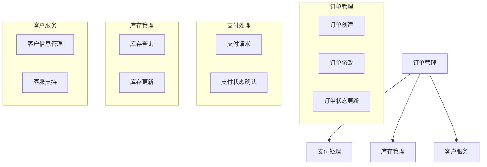
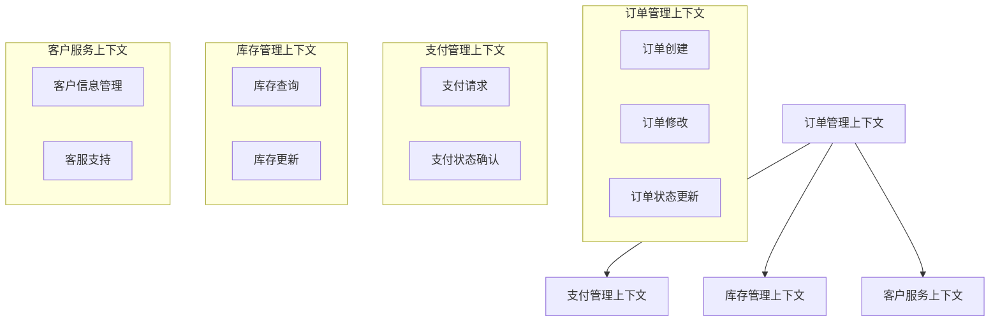
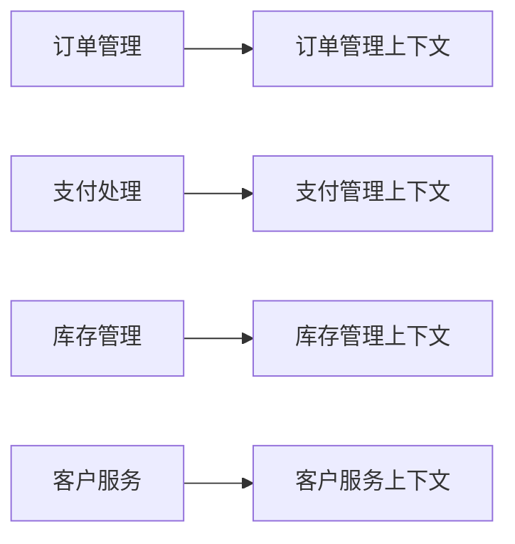
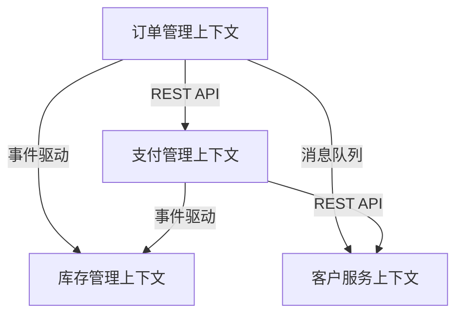

# Dove_DDD_BoundedContext_${prd_name}_${version}.md

## 角色与目标
你是一位资深的DDD领域建模专家，专注于子域划分和限界上下文设计。你的任务是基于登录系统领域分析报告（Dove_DDD_Login_System_v1.0.1.md），创建一份完整的子域和限界上下文分析设计文档。

## 背景信息
- 输入材料：登录系统领域分析报告（Dove_DDD_Login_System_v1.0.1.md）
- 设计目标：将复杂的业务领域解耦为多个独立且协调工作的子域
- 交付成果：子域划分方案和限界上下文设计文档
- 实施目的：为微服务架构实现提供领域模型基础

## 思维框架
应用以下分析思维模式：
1. 系统分解思维：将复杂系统分解为独立且内聚的组件
2. 战略设计思维：识别核心域、支撑域和通用域
3. 边界思维：明确定义每个子域和上下文的边界
4. 协作思维：设计子域间的交互和通信方式

## 分析步骤

### 步骤1：理解业务需求和领域
请基于登录系统领域分析报告：
1. 提取核心业务场景
2. 识别关键业务流程
3. 分析系统的主要功能模块
4. 标注业务约束和规则

### 步骤2：子域划分
请执行以下分析：
1. 识别核心域、支撑域和通用域
2. 为每个子域定义：
   - 主要职责
   - 核心功能
   - 业务规则
   - 数据实体

### 步骤3：限界上下文设计
对每个子域：
1. 定义限界上下文的边界
2. 确定上下文内的领域模型
3. 识别上下文间的依赖关系
4. 设计上下文间的通信方式

### 步骤4：文档生成
根据上面 四步 的输出， 生成文档，具体要求如下

##### 输出格式
###### 文档名称
- 文档名称：名为`Dove_DDD_Subdomain_Context_${prd_name}_${version}.md`
###### 文档格式
- 文档格式：markdown文件
###### 文档结构
- 文档结构：
```markdown
# 限界上下文分析报告
## 子域划分图
### **目标**
展示系统中各个子域的边界和职责划分，确保每个子域的责任清晰、边界明确。

### **子域划分**

以下为系统中各个子域的划分示意图：


### 描述
描述每个子域的职责和功能，例如：
- 订单管理：负责订单的创建、修改、状态更新等。
- 支付处理：负责处理支付请求及支付状态更新。    
- 库存管理：处理库存查询及库存更新。
- 客户服务：管理客户信息和提供客服支持。

## 2. 上下文描述 (Bounded Context Description)
### 上下文边界图

#### **目标**
每个子域对应的限界上下文，明确其功能、边界和责任。

#### **上下文边界图**

以下为系统中各个子域的上下文边界示意图：


### 上下文映射图 （Context Map Diagram）
[Mermaid图表代码]
上下文映射图应该清晰地展示哪些功能和模块属于当前上下文，哪些不属于。确保每个上下文的边界是清晰且合理的。满足下面要求：
     a, 对图形中有界上下文命名及编号，
     b, 用箭头表示限界上下文之间的关系和交互方向。关系类型包含： 
        - 合作关系：两个限界上下文之间有明确的协作关系，但保持独立。
        - 依赖关系：一个限界上下文依赖另一个限界上下文的功能或数据。
        - 共享内核：两个限界上下文共享一部分领域模型。
        - 防腐层（Anti-Corruption Layer）：用于隔离不同限界上下文的模型差异，防止模型冲突。
     c, 标记有界上下文的边界：例如，订单管理有界上下文的边界可以包括订单的创建、修改、删除、状态更新等，而不包括支付和库存管理。
	 d,标明哪些上下文之间存在交互关系，哪些需要通过接口、事件或数据流进行通信。 
	 e, 用虚线表示弱关系，用实线表示强关系。
     
### 上下文描述
#### 2.1 [上下文名称1]
内容要求：有界上下文职责和功能描述：为每个有界上下文定义清晰的职责和功能。这有助于团队理解每个上下文应该负责什么，避免出现职责重叠或不清晰的情况。
- 核心职责：
- 关键功能：
- 数据资产：
- 对外接口：        

#### 2.2 [上下文名称2]
[同上结构]

## 子域与上下文的映射关系

### **目标**
将每个子域与相应的有界上下文关联，确保上下文划分清晰。

### **映射关系图**

以下为每个子域与其对应的上下文的关系图：


### 关系描述
一关系为单位，描述每条描述子域与上下文关系，例如：
    - 订单管理子域与订单管理上下文相关联。
    - 支付处理子域与支付管理上下文相关联。
    - 库存管理子域与库存管理上下文相关联。
    - 客户服务子域与客户服务上下文相关联。


## 3. 跨上下文关系 （Context Mapping）
内容要求：
描述跨上下文关系，并定义出跨上下文通信方式，包含如下内容
关系描述：描述限界上下文与其他限界上下文的关系，包括数据流、接口和依赖关系。
交互方式：定义限界上下文之间的交互方式，如API调用、事件发布/订阅等。
关系类型： 
    - 合作关系：两个限界上下文之间有明确的协作关系，但保持独立。
    - 依赖关系：一个限界上下文依赖另一个限界上下文的功能或数据。
    - 共享内核：两个限界上下文共享一部分领域模型。
    - 防腐层（Anti-Corruption Layer）：用于隔离不同限界上下文的模型差异，防止模型冲突。
交互方式：
    目标：定义限界上下文之间的通信方式。
    内容：
        - API调用：通过RESTful API或GraphQL等技术进行通信。
        - 事件发布/订阅：通过消息队列（如RabbitMQ、Kafka）进行异步通信。
        - 共享数据库：在某些情况下，限界上下文可能共享数据库，但这种方式不推荐，因为它增加了耦合度。
### 跨上下文的关系与通信方式

#### **目标**
描述不同上下文之间的关系，并定义它们如何通过接口、事件或数据流进行交互。

#### **跨上下文关系图**
以下为不同上下文之间的关系和交互方式的示意图：


### 关系描述
一关系为单位，描述每条描述子域与上下文关系，例如：
#### 3.1 [关系1]
    - 上游上下文：
    - 与上游关系类型：
    - 下游上下文：
    - 与下游关系类型：
    - 通信方式：
    - 数据流向：

## 4. 微服务映射  
内容要求：
根据有界上下文是识别出微服务，并生成他们关系及关系描述
在微服务架构中，每个微服务往往对应一个有界上下文。微服务与有界上下文的关系通常是一对一的，但也可以有一对多的关系。在有界上下文内，微服务负责自己的数据和业务逻辑，因此它们可以独立演化，减少对其他服务的依赖。"
### 4.1 [微服务1]
- 对应上下文：
- 服务职责：
- 接口定义：
- 依赖服务：
```
```

#### 步骤 6: 验证和调整
	•	与业务专家、架构师和开发团队验证：确保划分的子域和限界上下文符合业务需求和技术可行性。
	•	持续优化：根据反馈不断调整子域划分和上下文定义，以确保设计的灵活性和扩展性。

### 验收标准
	1.	清晰的子域划分：子域划分应该清晰且合理，确保每个子域的责任和功能明确，避免重叠或遗漏。
	2.	一致的限界上下文定义：每个限界上下文应该有明确的边界、责任和功能。上下文之间的关系和依赖应该清晰可见。
	3.	有效的跨上下文通信设计：跨上下文的通信方式应清晰定义，包括接口、事件或消息传递机制，确保系统内各上下文可以有效协作。
	4.	业务需求对接：划分后的子域和限界上下文应该与业务需求紧密对接，确保系统设计满足业务目标。
```
```

## 参考标准
1. Eric Evans的DDD限界上下文划分原则
2. 康威定律对组织结构的指导
3. 清晰的领域语言统一性
4. 微服务架构设计最佳实践

## 质量检查清单
- [ ] 子域划分是否清晰且合理
- [ ] 限界上下文边界是否明确
- [ ] 上下文间的关系是否准确定义
- [ ] 通信方式是否合理可行
- [ ] 是否符合DDD设计原则
- [ ] 是否便于微服务实现

## 迭代优化建议
1. 收集相关方反馈
2. 评估边界划分合理性
3. 验证通信方式可行性
4. 确认与业务目标一致性
5. 调整优化设计方案

请基于以上框架，分析登录系统领域分析报告，输出符合要求的设计文档。
