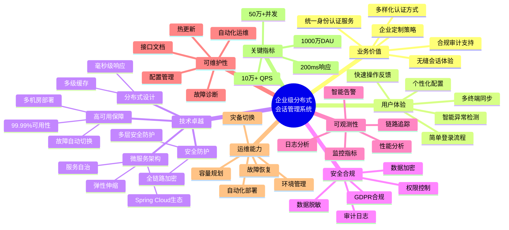
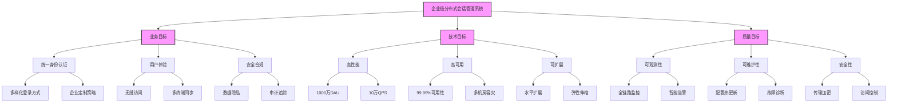
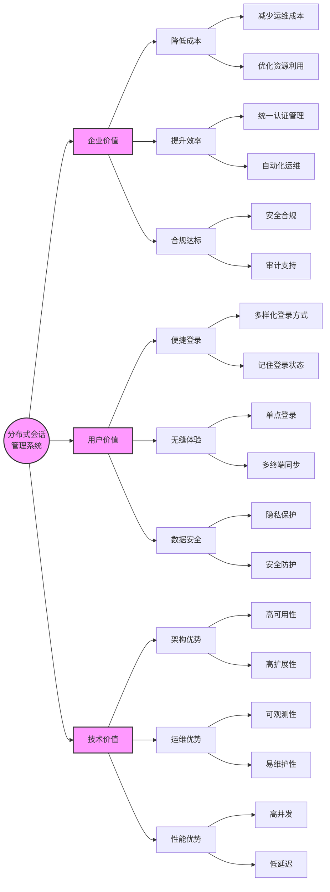
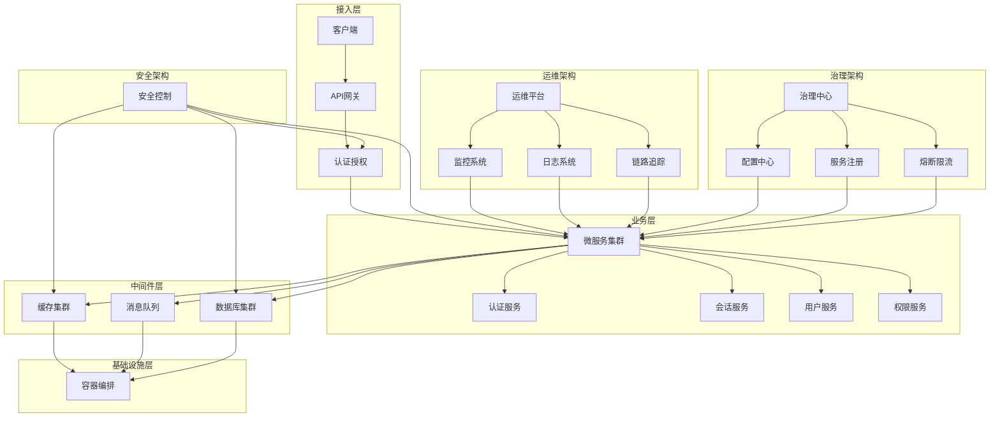
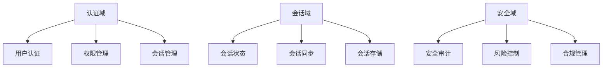
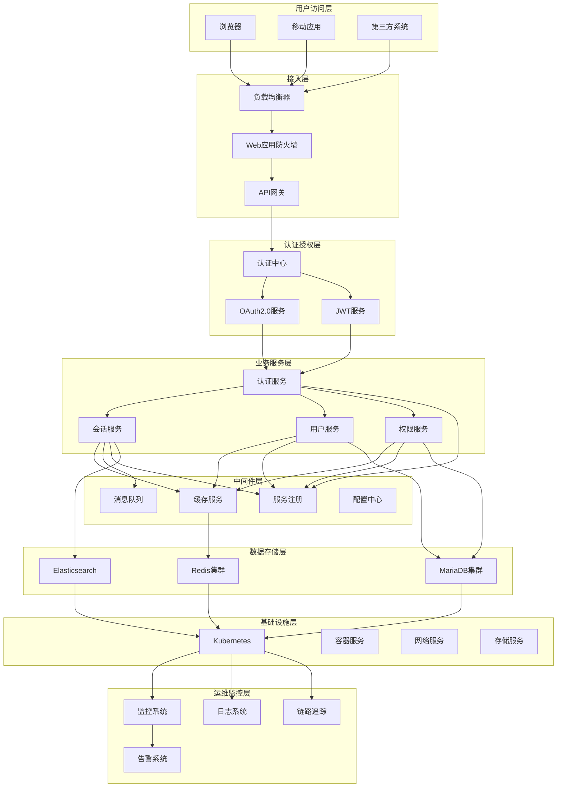

# 企业级解决方案文档 - 分布式会话管理方案

## 1. 项目背景与目标

### 1.1 项目背景
- **业务需求**:
  - 支持大规模微服务架构下的用户会话管理
  - 确保跨服务的用户身份认证和授权
  - 支持业务流程状态的持久化存储
  - 满足高并发、高可用的性能要求

- **技术挑战**:
  - 微服务间的会话数据一致性维护
  - 分布式环境下的安全性保障
  - 系统性能和可扩展性要求
  - 会话数据的实时同步和故障恢复

- **市场趋势**:
  - 微服务架构的广泛采用
  - 云原生应用的普及
  - 零信任安全架构的兴起
  - 全球化业务对分布式系统的需求增长

### 1.2 项目目标

#### 1.2.1 总体目标
构建企业级分布式会话管理系统，通过微服务架构和云原生技术，实现高性能、高可用、高安全的会话管理服务。系统面向千万级DAU设计，采用多租户架构，确保不同企业间的数据隔离和个性化需求。

#### 1.2.2 业务目标
- **认证与授权管理**
  - 支持多样化的认证方式（本地账号、SSO、OAuth等）
  - 提供细粒度的权限控制能力
  - 实现灵活的多因素认证机制
  - 支持多租户的定制化认证策略

- **用户体验优化**
  - 确保登录流程简单直观
  - 提供无缝的跨服务访问体验
  - 支持多终端的会话同步
  - 实现智能的异常检测和处理

- **安全合规保障**
  - 满足企业级安全要求
  - 确保数据隐私保护
  - 符合国际合规标准
  - 提供完整的审计能力

#### 1.2.3 技术目标
- **性能指标**
  - 支持1000万日活用户(DAU)
  - 峰值QPS达到10万+
  - 平均响应时间<200ms (95th percentile)
  - 并发会话数支持50万+

- **可用性指标**
  - 系统可用性达到99.99%
  - 实现多机房容灾能力
  - RPO趋近于0，RTO<5分钟
  - 支持服务的平滑扩缩容

- **扩展性指标**
  - 支持系统水平扩展
  - 实现动态弹性伸缩
  - 便于新增认证方式
  - 支持API版本演进

#### 1.2.4 质量目标
- **安全性指标**
  - 实现完整的加密传输
  - 确保敏感数据安全存储
  - 提供入侵检测能力
  - 支持安全审计追踪

- **可维护性指标**
  - 提供标准化接口
  - 完善技术文档
  - 支持配置热更新
  - 便于问题诊断

- **可观测性指标**
  - 全方位监控覆盖
  - 完整的日志追踪
  - 实时告警机制
  - 性能分析能力

## 2. 解决方案概述
### 2.1 架构设计
#### 2.1.1 架构远景
- **架构远景图**


- **架构远景说明**：
  - **业务价值**：
   系统将支持多种身份验证方式，包括社交媒体登录和多因素认证，以满足不同用户的需求。
     - 提供统一的身份认证和会话管理服务
     - 支持企业定制的认证策略和安全策略
     - 实现跨服务、跨终端的无缝会话体验
     - 满足合规性要求并提供完整审计能力
     - 支持多种身份验证方式，包括社交媒体登录和多因素认证

  - **用户体验**：
    - 简单直观的登录流程设计
    - 快速响应的操作反馈
    - 智能的异常检测和处理
    - 多终端的无缝同步体验
    - 个性化的配置选项

  - **技术卓越**：
    - 微服务架构：基于Spring Cloud生态，支持服务自治和弹性伸缩
    - 分布式设计：采用多级缓存架构，确保毫秒级响应
    - 高可用保障：多机房部署，故障自动切换，确保99.99%可用性
    - 安全防护：全链路加密，多层次安全防护，防止会话劫持

  - **安全合规**：
    - 符合GDPR等国际安全标准
    - 数据加密存储和传输
    - 完整的审计日志记录
    - 细粒度的权限控制
    - 敏感数据脱敏处理

  - **可观测性**：
    - 全方位监控指标体系
    - 分布式链路追踪
    - 实时日志采集分析
    - 智能告警机制
    - 性能瓶颈分析

  - **可维护性**：
    - 统一的配置管理中心
    - 支持配置热更新
    - 自动化运维工具
    - 完善的故障诊断机制
    - 标准化的接口文档

  - **运维能力**：
    - 自动化部署和扩缩容
    - 故障自动检测和恢复
    - 容量智能规划
    - 多环境管理
    - 灾备切换演练

  - **关键指标**：
    - 性能：支持1000万DAU，峰值QPS 10万+
    - 响应：平均响应时间<200ms (95th percentile)
    - 可用性：99.99%，RPO趋近于0，RTO<5分钟
    - 扩展性：支持50万+并发会话数
#####  **目标分解图**：

- **目标分解图说明**：

目标分解图通过系统化的方式，将企业级分布式会话管理系统的总体目标分解为业务目标、技术目标和质量目标三个维度，并进一步细化为可度量、可实现的具体目标。这种分解方式有助于团队理解系统的整体愿景，并指导后续的架构设计和实现。

1. **业务目标维度**

   A. 统一身份认证
   - 多样化登录方式
     * 本地账号密码登录：支持用户名/邮箱+密码的传统登录方式
     * 社交媒体登录：集成Google、Microsoft、GitHub等第三方登录
     * 企业SSO：支持SAML、OAuth2.0等企业级单点登录协议
     * 多因素认证：集成短信、TOTP、生物识别等多因素验证方式
     * 扫码登录：支持移动端扫码快速登录
   
   - 企业定制策略
     * 认证策略定制：允许企业自定义认证方式组合
     * 密码策略配置：支持密码强度、有效期等安全策略设置
     * 登录限制配置：IP限制、时间限制、设备限制等
     * 多因素认证策略：强制开启特定场景的多因素认证
     * 会话管理策略：自定义会话超时时间、并发限制等

   B. 用户体验
   - 无缝访问
     * 单点登录：一次登录，访问所有授权服务
     * 会话保持：合理的会话保活机制
     * 智能记住登录状态：安全的"记住我"功能
     * 平滑的登录体验：减少不必要的重复登录
     * 快速的响应时间：登录验证响应<200ms
   
   - 多终端同步
     * 会话状态同步：多设备间的登录状态实时同步
     * 配置信息同步：用户偏好设置的多端同步
     * 安全设备管理：支持查看和管理已登录设备
     * 异常登录提醒：多设备登录的安全提示
     * 强制登出能力：支持远程登出其他设备

   C. 安全合规
   - 数据隐私
     * 个人信息保护：符合GDPR等隐私保护法规
     * 数据最小化：仅收集必要的用户信息
     * 数据脱敏：敏感信息展示和传输时脱敏
     * 数据加密：采用强加密算法保护用户数据
     * 数据生命周期：明确的数据保留和销毁策略
   
   - 审计追踪
     * 完整的操作日志：记录所有认证相关操作
     * 安全事件审计：异常登录行为的记录和分析
     * 合规性报告：支持生成合规审计报告
     * 证据保全：关键操作的证据保存
     * 审计日志保护：确保日志不被篡改

2. **技术目标维度**

   A. 高性能
   - 1000万DAU
     * 集群规模：支持动态扩展的服务集群
     * 资源优化：合理的资源利用和分配
     * 峰值处理：应对早晚高峰的流量洪峰
     * 性能监控：实时监控系统性能指标
     * 性能优化：持续的性能优化机制
   
   - 10万QPS
     * 请求处理：高效的请求处理机制
     * 并发控制：优秀的并发处理能力
     * 缓存优化：多级缓存架构
     * 异步处理：非核心流程异步化
     * 限流保护：智能限流和降级机制

   B. 高可用
   - 99.99%可用性
     * 服务冗余：无单点故障的架构设计
     * 故障转移：快速的故障检测和转移
     * 熔断降级：智能的服务熔断机制
     * 请求重试：合理的重试策略
     * 负载均衡：智能的负载分发
   
   - 多机房容灾
     * 数据同步：机房间的数据实时同步
     * 流量调度：智能的流量调度策略
     * 故障隔离：机房级别的故障隔离
     * 就近接入：用户就近接入策略
     * 容灾切换：机房故障时的自动切换

   C. 可扩展
   - 水平扩展
     * 无状态设计：服务的无状态化设计
     * 分片策略：数据的分片存储策略
     * 扩容能力：支持动态添加节点
     * 一致性保证：数据一致性的保证机制
     * 平滑扩展：在线扩容不影响服务
   
   - 弹性伸缩
     * 负载感知：基于负载的自动伸缩
     * 成本优化：考虑成本的伸缩策略
     * 预测扩缩：基于预测的提前扩缩
     * 多维度触发：多指标触发的伸缩决策
     * 优雅缩容：安全的服务下线机制

3. **质量目标维度**

   A. 可观测性
   - 全链路监控
     * 性能监控：全方位的性能指标监控
     * 链路追踪：分布式调用链追踪
     * 资源监控：系统资源使用监控
     * 业务监控：核心业务指标监控
     * 依赖监控：外部依赖服务监控
   
   - 智能告警
     * 多维度告警：支持多指标组合告警
     * 告警级别：分级的告警机制
     * 告警收敛：重复告警的智能收敛
     * 告警路由：精准的告警分发
     * 告警自愈：自动化的问题修复

   B. 可维护性
   - 配置热更新
     * 动态配置：支持配置的动态更新
     * 配置版本：配置的版本管理
     * 配置审计：配置变更的审计日志
     * 配置回滚：支持配置的快速回滚
     * 灰度发布：配置的灰度发布能力
   
   - 故障诊断
     * 问题定位：快速的问题定位能力
     * 日志分析：完善的日志分析工具
     * 诊断工具：丰富的诊断工具集
     * 故障复现：支持故障场景复现
     * 根因分析：故障的根因分析能力

   C. 安全性
   - 传输加密
     * 协议加密：TLS/SSL传输加密
     * 数据加密：敏感数据的加密传输
     * 密钥管理：安全的密钥管理机制
     * 证书管理：数字证书的全生命周期管理
     * 加密算法：强加密算法的选择和更新
   
   - 访问控制
     * 身份认证：严格的身份认证机制
     * 权限控制：细粒度的权限控制
     * 会话管理：安全的会话管理
     * 攻击防护：常见攻击的防护措施
     * 安全审计：访问控制的审计日志

这个目标分解图不仅展示了系统的整体目标结构，还通过细化的分解说明了每个目标的具体内容和要求。它将作为整个项目的指导性文档，帮助团队在设计、开发、测试和运维等各个阶段保持对目标的清晰认识和追踪。同时，这个分解图也为后续的架构设计、技术选型、质量保证等工作提供了重要的决策依据。

##### - **价值地图**：


 - **价值地图说明**：

价值地图从企业价值、用户价值和技术价值三个维度，展示了分布式会话管理系统所创造的核心价值。

1. **企业价值**
   - 降低成本
     * 减少运维成本：通过自动化运维和智能运维降低人力成本
     * 优化资源利用：通过弹性伸缩和智能调度提高资源利用率
   - 提升效率
     * 统一认证管理：集中化的身份认证和权限管理
     * 自动化运维：自动化的部署、监控和维护
   - 合规达标
     * 安全合规：满足行业安全标准和法规要求
     * 审计支持：提供完整的审计和合规报告

2. **用户价值**
   - 便捷登录
     * 多样化登录方式：支持多种登录认证方式
     * 记住登录状态：安全可靠的登录状态保持
   - 无缝体验
     * 单点登录：一次登录，处处通行
     * 多终端同步：跨设备的无缝体验
   - 数据安全
     * 隐私保护：严格的数据保护机制
     * 安全防护：全方位的安全防护措施

3. **技术价值**
   - 架构优势
     * 高可用性：99.99%的系统可用性
     * 高扩展性：支持水平扩展和弹性伸缩
   - 运维优势
     * 可观测性：全方位的监控和诊断能力
     * 易维护性：便捷的维护和升级机制
   - 性能优势
     * 高并发：支持大规模并发访问
     * 低延迟：毫秒级的响应时间

价值地图的作用：
1. **战略对齐**
   - 确保系统建设与业务价值一致
   - 帮助团队理解系统的价值定位
   - 指导功能优先级排序

2. **决策支持**
   - 为技术选型提供价值导向
   - 帮助资源投入的优先级判断
   - 支持成本收益分析

3. **沟通工具**
   - 与利益相关者沟通系统价值
   - 帮助团队理解开发目标
   - 促进跨团队协作

4. **评估基准**
   - 为系统评估提供价值维度
   - 帮助衡量系统成功程度
   - 指导持续改进方向

##### - **核心原则**：

  1. **高可用性**：确保系统7*24小时稳定运行
     
     高可用性是分布式会话管理系统的首要原则。在微服务架构中，会话服务作为基础设施，其可用性直接影响整个业务系统的稳定性。高可用性体现在以下几个方面：

     - **服务冗余**：
       - 采用多节点部署，确保单点故障不会导致整体服务中断
       - 实现服务自动发现和注册，支持动态扩缩容
       - 使用负载均衡策略，合理分配请求流量
     
     - **故障容错**：
       - 实现故障自动检测和隔离机制
       - 支持服务熔断和降级策略
       - 提供请求重试和失败补偿机制
     
     - **数据高可用**：
       - Redis集群采用主从复制架构
       - 实现数据多副本存储和自动同步
       - 支持故障节点的自动切换和恢复

     关联设计点：
     - 三、关键机制 -> 高可用机制：服务自动发现、负载均衡、故障转移、熔断降级
     - 四、运维保障 -> 容灾备份：多副本备份、定时快照、灾难恢复预案
     - 六、性能指标 -> 系统可用性 > 99.99%
     - 2.2 技术选型 -> Redis Cluster：高可用分布式缓存集群
     - 3.1 系统模块 -> 数据存储模块：故障转移机制

  2. **可扩展性**：支持水平扩展以应对业务增长
     
     可扩展性确保系统能够应对不断增长的业务需求。在分布式会话管理中，可扩展性主要体现在系统架构的弹性和业务功能的扩展性两个维度：

     - **架构弹性**：
       - 支持服务实例的动态扩缩容
       - 实现请求的动态路由和负载均衡
       - 确保系统资源的合理利用和调度
     
     - **功能扩展**：
       - 采用模块化设计，支持新功能快速集成
       - 提供标准化的接口和协议
       - 支持多种认证方式和会话管理策略
     
     - **性能扩展**：
       - 支持集群规模的动态调整
       - 实现数据分片和分区存储
       - 提供缓存机制优化访问性能

     关联设计点：
     - 二、核心组件 -> 分层架构设计：接入层、服务层、存储层
     - 三、关键机制 -> 服务自动发现：动态服务注册与发现
     - 2.2 技术选型 -> Spring Cloud：微服务架构支持
     - 3.2 数据模型 -> 会话数据结构：支持扩展字段
     - 4.1 项目阶段 -> 分阶段实施策略

  3. **安全性**：保障用户数据和会话信息安全
     
     安全性是分布式会话管理的核心要求，需要在多个层面实现全方位的安全防护：

     - **传输安全**：
       - 使用HTTPS加密通信
       - 实现数据传输的加密和签名
       - 防止中间人攻击和数据篡改
     
     - **访问控制**：
       - 实现细粒度的权限管理
       - 支持多因素认证
       - 防止未授权访问和越权操作
     
     - **数据安全**：
       - 敏感数据加密存储
       - 实现数据访问审计
       - 确保数据隐私保护

     关联设计点：
     - 三、关键机制 -> 安全机制：HTTPS、JWT、OAuth2.0
     - 5.1 风险识别 -> 安全漏洞：风险评估和防范
     - 6.1 测试策略 -> 安全测试：渗透测试、安全审计
     - 3.1 系统模块 -> 认证模块：权限管理
     - 3.3 接口设计 -> API规范：安全认证接口

  4. **一致性**：确保分布式环境下的数据一致性
     
     在分布式环境中，数据一致性是确保系统可靠性的关键因素。需要在性能和一致性之间找到合适的平衡点：

     - **会话一致性**：
       - 确保用户会话状态的一致性
       - 处理并发访问和更新
       - 实现会话数据的同步复制
     
     - **数据一致性**：
       - 实现最终一致性模型
       - 处理分布式事务
       - 解决数据冲突和合并
     
     - **状态一致性**：
       - 维护业务状态的一致性
       - 处理异常和回滚机制
       - 确保操作的原子性

     关联设计点：
     - 三、关键机制 -> 数据一致性：Redis主从复制、数据同步策略
     - 3.1 系统模块 -> 会话管理模块：会话状态维护
     - 六、性能指标 -> 数据一致性延迟：< 1s
     - 3.2 数据模型 -> 会话数据结构：状态管理
     - 5.1 风险识别 -> 数据不一致：风险控制

## 3. 架构实现

### 3.1 整体架构
#### 1. 架构全景


#### 2. 架构分层
1. **接入层**
   - 统一接入网关
   - 认证授权校验
   - 流量控制

2. **业务层**
   - 微服务架构
   - 业务服务解耦
   - 领域划分

3. **中间件层**
   - 分布式缓存
   - 消息队列
   - 数据存储

4. **基础设施层**
   - 容器化部署
   - 资源调度
   - 弹性伸缩

#### 3. 横切关注点
1. **安全架构**
   - 端到端安全保障
   - 数据加密传输
   - 访问控制管理

2. **运维架构**
   - 全方位监控
   - 统一日志管理
   - 链路追踪分析

3. **治理架构**
   - 服务注册发现
   - 配置统一管理
   - 熔断限流降级

### 3.2 业务架构
- **业务领域模型**


- **核心业务流程**
  - **认证流程**
    ```mermaid
    sequenceDiagram
      participant U as 用户
      participant A as 认证服务
      participant S as 会话服务
      participant D as 数据服务
      
      U->>A: 1.发起认证请求
      A->>D: 2.验证凭证
      D-->>A: 3.返回结果
      A->>S: 4.创建会话
      S-->>A: 5.返回会话信息
      A-->>U: 6.返回认证结果
    ```

  - **会话管理流程**
    ```mermaid
    sequenceDiagram
      participant C as 客户端
      participant G as 网关
      participant S as 会话服务
      participant R as Redis集群
      
      C->>G: 1.携带Token访问
      G->>S: 2.验证会话
      S->>R: 3.查询会话状态
      R-->>S: 4.返回会话信息
      S->>S: 5.验证会话有效性
      S-->>G: 6.会话验证结果
      G-->>C: 7.响应请求
    ```

  - **权限控制流程**
    ```mermaid
    sequenceDiagram
      participant U as 用户
      participant G as 网关
      participant A as 权限服务
      participant S as 会话服务
      
      U->>G: 1.访问受保护资源
      G->>S: 2.获取会话信息
      S-->>G: 3.返回用户信息
      G->>A: 4.检查权限
      A-->>G: 5.权限验证结果
      G-->>U: 6.授权访问/拒绝
    ```

  - **会话同步流程**
    ```mermaid
    sequenceDiagram
      participant C1 as 客户端1
      participant C2 as 客户端2
      participant S as 会话服务
      participant MQ as 消息队列
      
      C1->>S: 1.会话状态变更
      S->>MQ: 2.发布状态变更
      MQ->>S: 3.广播变更消息
      S->>C2: 4.推送状态更新
      C2-->>S: 5.确认更新
    ```

  - **注销流程**
    ```mermaid
    sequenceDiagram
      participant U as 用户
      participant A as 认证服务
      participant S as 会话服务
      participant R as Redis集群
      
      U->>A: 1.发起注销请求
      A->>S: 2.清理会话
      S->>R: 3.删除会话数据
      S->>S: 4.广播会话失效
      A-->>U: 5.注销完成
    ```

  - **会话续期流程**
    ```mermaid
    sequenceDiagram
      participant C as 客户端
      participant S as 会话服务
      participant R as Redis集群
      
      C->>S: 1.请求续期
      S->>S: 2.验证续期条件
      S->>R: 3.更新过期时间
      R-->>S: 4.更新确认
      S-->>C: 5.返回新Token
    ```

- **业务能力地图**
  - **认证能力**
    - 本地账号认证
    - 社交账号认证
    - 企业SSO认证
    - 多因素认证
    - 生物识别认证

  - **会话管理能力**
    - 会话创建维护
    - 会话状态同步
    - 会话安全控制
    - 会话监控审计
    - 会话策略管理

  - **安全管控能力**
    - 访问控制
    - 风险识别
    - 安全审计
    - 合规管理
    - 数据保护

- **业务规则引擎**
  - **认证规则**
    - 密码策略
    - 登录限制
    - 失败处理
    - 锁定策略

  - **会话规则**
    - 超时策略
    - 并发控制
    - 漫游策略
    - 注销规则

  - **安全规则**
    - 风控规则
    - 审计规则
    - 合规规则
    - 数据规则

- **业务监控指标**
  - **业务指标**
    - 认证成功率
    - 活跃会话数
    - 异常登录率
    - 合规违规数

  - **性能指标**
    - 认证响应时间
    - 会话同步延迟
    - 系统吞吐量
    - 资源使用率

- **业务扩展性**
  - **认证方式扩展**
    - 新认证协议支持
    - 新生物特征接入
    - 新设备认证支持

  - **业务规则扩展**
    - 规则引擎可配置
    - 策略动态更新
    - 参数灵活调整

  - **多租户支持**
    - 租户隔离
    - 租户定制
    - 租户管理

### 3.3 技术架构

#### 1. 整体技术架构描述
分布式会话管理系统的技术架构设计遵循"高内聚、低耦合"的原则，采用分层架构和微服务架构相结合的方式。系统在保证高可用性和高性能的同时，通过合理的架构设计确保系统的可扩展性和可维护性。整体架构包括用户访问层、接入层、认证授权层、业务服务层、中间件层、数据存储层和运维监控层八个主要层次。 每个层次都有其明确的职责和边界：
- 用户访问层负责用户请求的接入和路由
- 接入层负责请求的接入和路由
- 认证授权层负责认证和授权
- 业务服务层处理核心业务逻辑
- 中间件层提供公共基础能力
- 数据存储层管理数据存储和访问
- 运维监控层保障系统的稳定运行

#### 2. 技术架构图及说明
##### 2.1 总体技术架构图


##### 2.2 架构层次说明
1. **用户访问层**
   - 支持多种客户端接入
   - 提供统一的访问入口
   - 实现客户端适配

2. **接入层**
   - 负载均衡：实现流量分发
   - API网关：请求路由和过滤
   - 安全防护：WAF防护

3. **认证授权层**
   - 统一认证中心
   - OAuth2.0协议支持
   - JWT令牌管理

4. **业务服务层**
   - 认证服务：身份认证
   - 会话服务：会话管理
   - 用户服务：用户管理
   - 权限服务：权限控制

5. **中间件层**
   - 缓存服务：分布式缓存
   - 消息队列：异步通信
   - 服务注册：服务发现
   - 配置中心：配置管理

6. **数据存储层**
   - Redis集群：会话存储
   - MariaDB集群：数据持久化
   - Elasticsearch：日志检索

7. **基础设施层**
   - 容器编排：Kubernetes
   - 容器运行：Docker
   - 网络服务：SDN
   - 存储服务：分布式存储

8. **运维监控层**
   - 监控系统：性能监控
   - 日志系统：日志收集
   - 链路追踪：调用链跟踪
   - 告警系统：异常告警

##### 2.3 关键流程说明
1. **认证流程**
   - 客户端请求认证
   - 网关路由到认证服务
   - 认证服务验证身份
   - 生成JWT令牌
   - 返回认证结果

2. **会话管理流程**
   - 创建分布式会话
   - 会话状态同步
   - 会话有效性验证
   - 会话自动续期
   - 会话安全清理

3. **数据访问流程**
   - 多级缓存访问
   - 读写分离处理
   - 数据分片路由
   - 数据同步复制

4. **监控告警流程**
   - 指标数据采集
   - 性能监控分析
   - 异常情况检测
   - 告警信息推送

#### 3. 应用架构
- **微服务架构**
  ```mermaid
  graph TD
    A[API Gateway] --> B[认证服务]
    A --> C[会话服务]
    A --> D[用户服务]
    A --> E[权限服务]
    
    B --> F[Redis集群]
    C --> F
    B --> G[MariaDB Enterprise集群]
    D --> G
    
    H[消息队列] --> B
    H --> C
    H --> D
  ```
##### 组件说明
1. **API Gateway**
   - 功能：统一的API接入层，负责请求路由、认证鉴权、流量控制
   - 依赖：与所有微服务交互
   - 技术选型：Spring Cloud Gateway
   - 关键特性：
     * 请求转发和负载均衡
     * 统一认证鉴权
     * 流量控制和熔断
     * 请求/响应转换

2. **认证服务**
   - 功能：处理用户认证、令牌管理、会话创建
   - 依赖：
     * Redis集群：存储会话和令牌信息
     * MariaDB Enterprise集群：存储用户认证信息
     * 消息队列：发布认证事件
   - 关键接口：
     * /auth/login：用户登录
     * /auth/logout：用户登出
     * /auth/token：令牌管理
     * /auth/session：会话管理

3. **会话服务**
   - 功能：管理分布式会话状态、会话同步、会话清理
   - 依赖：
     * Redis集群：存储会话数据
     * 消息队列：会话状态同步
   - 关键特性：
     * 分布式会话管理
     * 会话状态同步
     * 会话有效期控制
     * 会话数据清理

4. **用户服务**
   - 功能：用户信息管理、用户状态维护
   - 依赖：
     * MariaDB Enterprise集群：存储用户基础信息
     * Redis集群：缓存用户数据
     * 消息队列：用户状态变更通知
   - 核心功能：
     * 用户信息CRUD
     * 用户状态管理
     * 用户数据缓存

5. **权限服务**
   - 功能：权限管理、访问控制、权限验证
   - 依赖：
     * MariaDB Enterprise集群：存储权限规则
     * Redis集群：缓存权限数据
   - 主要特性：
     * RBAC权限模型
     * 动态权限控制
     * 权限缓存管理

6. **Redis集群**
   - 功能：分布式缓存，存储会话和临时数据
   - 被依赖：
     * 认证服务：存储会话令牌
     * 会话服务：存储会话状态
     * 用户服务：缓存用户数据
     * 权限服务：缓存权限数据
   - 关键配置：
     * 主从复制
     * 哨兵模式
     * 数据分片

7. **MariaDB集群**
   - 功能：持久化存储核心业务数据
   - 被依赖：
     * 认证服务：存储认证信息
     * 用户服务：存储用户数据
   - 架构特点：
     * Galera集群
     * 主从复制(Semi-Sync)
     * 读写分离
     * 数据分片
   - 企业特性：
     * 高性能事务处理
     * 数据一致性保证
     * 自动故障转移
     * 在线扩容能力

8. **消息队列**
   - 功能：异步消息通信，事件广播
   - 被依赖：
     * 认证服务：发布认证事件
     * 会话服务：同步会话状态
     * 用户服务：状态变更通知
   - 消息类型：
     * 认证事件消息
     * 会话状态消息
     * 用户状态消息
- **服务划分**
  - 认证服务(Auth Service)
    * 身份认证
    * Token管理
    * 多因素认证
    * 社交登录集成
    * SSO服务

  - 会话服务(Session Service)
    * 会话管理
    * 状态同步
    * 会话存储
    * 会话监控
    * 会话清理

  - 用户服务(User Service)
    * 用户管理
    * 账号管理
    * 设备管理
    * 偏好设置
    * 安全设置

  - 权限服务(Permission Service)
    * 权限管理
    * 角色管理
    * 访问控制
    * 策略管理
    * 审计日志

#### 2. 中间件架构
- **缓存架构**
  ```mermaid
  graph TD
    A[应用层] --> B[本地缓存]
    A --> C[分布式缓存]
    B --> D[Redis Cluster]
    C --> D
    D --> E[持久化存储]
  ```

- **消息架构**
  ```mermaid
  graph LR
    A[生产者服务] --> B[Kafka集群]
    B --> C[消费者服务]
    B --> D[消息存储]
    B --> E[消息监控]
  ```

#### 3. 存储架构
- **多级存储**
  - L1: 本地缓存(Caffeine)
  - L2: 分布式缓存(Redis Cluster)
  - L3: 持久化存储(MariaDB Enterprise)

- **数据分片策略**
  - 会话数据分片
    * 按用户ID范围分片
    * 按地理位置分片
    * 热点数据分片
    * 会话数据分布式存储

  - 用户数据分片
    * 按用户ID哈希分片
    * 按业务域分片
    * 按租户分片
    * 关联数据本地化

  - 日志数据分片
    * 按时间范围分片
    * 按业务类型分片
    * 按日志级别分片
    * 冷热数据分离

- **分片架构**
  ```mermaid
  graph TD
    A[应用层] --> B[代理层/MHA]
    B --> C1[MariaDB主节点]
    B --> C2[MariaDB从节点1]
    B --> C3[MariaDB从节点2]
    C1 --> D1[数据分片1]
    C1 --> D2[数据分片2]
    C1 --> D3[数据分片3]
  ```

#### 4. 技术选型

##### 4.1 基础框架选型
1. **微服务框架**
   - Spring Cloud Alibaba
     * 成熟稳定的微服务生态
     * 完善的中文社区支持
     * 丰富的企业实践案例
     * 配套组件齐全

2. **服务治理**
   - Nacos
     * 服务注册与发现
     * 配置管理中心
     * 动态DNS服务
     * 元数据管理

3. **网关服务**
   - Spring Cloud Gateway
     * 基于Spring 5.0 + WebFlux
     * 支持异步非阻塞
     * 丰富的路由断言
     * 强大的过滤器链

4. **安全框架**
   - Spring Security
     * 企业级安全框架
     * 灵活的认证机制
     * 细粒度权限控制
     * OAuth2.0支持

##### 4.2 存储方案选型
1. **关系型数据库**
   - MariaDB Enterprise 10.6+
     * 高性能事务处理
     * 企业级高可用保障
     * 完善的分布式方案
     * 成熟的运维工具
   - 集群方案
     * Galera多主集群
     * Semi-Sync复制
     * ProxySQL中间件
     * MHA高可用管理

2. **缓存系统**
   - Redis Enterprise
     * 高性能内存数据库
     * 企业级集群方案
     * 数据持久化支持
     * 丰富的数据结构
   - 集群架构
     * Redis Cluster
     * Sentinel哨兵
     * 主从复制
     * 分片存储

3. **搜索引擎**
   - Elasticsearch
     * 分布式搜索引擎
     * 实时日志分析
     * 全文检索能力
     * 时序数据分析

##### 4.3 中间件选型
1. **消息队列**
   - Apache Kafka
     * 高吞吐消息系统
     * 分布式架构
     * 消息持久化
     * 流处理能力
   - RocketMQ
     * 金融级消息系统
     * 事务消息支持
     * 消息追踪能力
     * 平滑扩容

2. **分布式事务**
   - Seata
     * 微服务分布式事务
     * 多种事务模式
     * 高可用集群
     * 可视化管理

3. **服务调用**
   - OpenFeign
     * 声明式服务调用
     * 负载均衡集成
     * 熔断降级支持
     * 优雅的API设计

##### 4.4 监控运维选型
1. **监控系统**
   - Prometheus + Grafana
     * 时序数据存储
     * 灵活的查询语言
     * 丰富的可视化
     * 完善的告警机制

2. **链路追踪**
   - SkyWalking
     * 分布式追踪系统
     * 性能指标监控
     * 应用拓扑分析
     * 故障诊断能力

3. **日志管理**
   - ELK Stack
     * 分布式日志收集
     * 实时日志分析
     * 可视化展示
     * 复杂查询支持

##### 4.5 部署运维选型
1. **容器编排**
   - Kubernetes
     * 容器编排管理
     * 自动化部署
     * 弹性伸缩
     * 服务发现
     * 配置管理

2. **持续集成/部署**
   - Jenkins Pipeline
     * 自动化构建
     * 持续集成/部署
     * 流水线管理
     * 插件生态丰富

3. **制品管理**
   - Harbor
     * 企业级镜像仓库
     * RBAC权限控制
     * 镜像安全扫描
     * 高可用部署

##### 4.6 开发工具选型
1. **项目管理**
   - Maven/Gradle
     * 依赖管理
     * 构建工具
     * 项目模板
     * 插件机制

2. **开发框架**
   - Spring Boot
     * 快速开发框架
     * 自动配置
     * 内嵌容器
     * 丰富的启动器

3. **测试工具**
   - JUnit 5
     * 单元测试框架
     * 参数化测试
     * 并行测试支持
   - Mockito
     * 模拟测试框架
     * 行为验证
     * 灵活的API
     
#### 5. 安全技术
- **认证技术**
  - OAuth 2.0/OIDC
  - JWT Token
  - SAML 2.0
  - 多因素认证(MFA)

- **加密技术**
  - 传输加密(TLS/SSL)
  - 数据加密(AES/RSA)
  - 密钥管理(KMS)
  - 证书管理

#### 6. 高可用技术
- **服务高可用**
  - 服务注册发现
  - 负载均衡
  - 熔断降级
  - 限流保护

- **存储高可用**
  - 主从复制
  - 分片集群
  - 数据备份
  - 故障转移

#### 7. 扩展性设计
- **水平扩展**
  - 服务无状态
  - 数据分片
  - 弹性伸缩
  - 动态扩容

- **垂直扩展**
  - 性能优化
  - 资源升级
  - 代码重构
  - 架构演进

### 3.4 数据架构
- **数据模型**：
  - 会话数据模型
  - 用户数据模型
  - 权限数据模型
  - 审计数据模型

- **存储方案**：
  - Redis集群：会话数据存储
  - MySQL：用户数据持久化
  - ElasticSearch：日志和审计数据
  - MongoDB：业务状态数据

- **数据流转**：
  - 数据同步策略
  - 数据备份方案
  - 数据清理策略
  - 数据迁移方案

### 3.5 安全架构
- **认证授权**：
  - OAuth2.0 认证流程
  - JWT Token 管理
  - SSO 单点登录
  - 多因素认证

- **安全防护**：
  - 传输加密（HTTPS/TLS）
  - 数据加密存储
  - 防SQL注入
  - XSS/CSRF防护

- **审计监控**：
  - 访问日志审计
  - 操作行为审计
  - 安全事件监控
  - 异常行为检测

### 3.6 部署架构
- **环境规划**：
  - 开发环境
  - 测试环境
  - 预生产环境
  - 生产环境

- **容器化部署**：
  - Docker容器化
  - K8s编排管理
  - 服务网格治理
  - CI/CD流水线

- **资源规划**：
  - 服务器资源配置
  - 网络带宽需求
  - 存储容量规划
  - 灾备资源配置

### 3.7 集成架构
- **外部集成**：
  - 第三方认证集成
  - 外部系统对接
  - API网关集成
  - 消息系统集成

- **内部集成**：
  - 服务间通信
  - 数据同步集成
  - 监控系统集成
  - 日志系统集成

### 3.8 性能架构
- **性能优化**：
  - 缓存策略
  - 负载均衡
  - 数据分片
  - 并发处理

- **扩展机制**：
  - 水平扩展
  - 垂直扩展
  - 数据库扩展
  - 缓存扩展

### 3.9 可用性架构
- **高可用设计**：
  - 服务冗余
  - 故障转移
  - 灾难恢复
  - 数据备份

- **容错机制**：
  - 熔断策略
  - 降级策略
  - 限流策略
  - 重试策略

### 3.10 测试架构
- **测试策略**：
  - 单元测试
  - 集成测试
  - 性能测试
  - 安全测试

- **测试环境**：
  - 测试数据
  - 测试工具
  - 测试脚本

### 3.11 运维架构
- **监控体系**：
  - 业务监控
  - 性能监控
  - 安全监控
  - 日志监控

- **运维管理**：
  - 配置管理
  - 变更管理
  - 容量管理
  - 应急响应

### 3.12 治理架构
- **版本管理**：
  - 代码版本控制
  - 文档版本控制
  - 配置版本控制

- **变更管理**：
  - 变更流程
  - 变更审批
  - 变更回滚

- **发布管理**：
  - 发布流程
  - 发布审批
  - 发布回滚

### 3.13 可观测性架构
- **日志收集**：
  - 应用日志
  - 系统日志
  - 安全日志

- **指标监控**：
  - 性能指标
  - 业务指标
  - 安全指标

- **链路追踪**：
  - 分布式链路追踪
  - 服务间调用追踪
  - 请求响应追踪

### 3.14 成本架构
- **成本预算**：
  - 人力成本
  - 硬件成本
  - 软件成本
  - 运维成本

- **成本优化**：
  - 资源利用优化
  - 成本分摊优化
  - 成本控制优化

### 3.15 合规架构
- **合规标准**：
  - 数据保护标准
  - 隐私保护标准
  - 安全合规标准

- **合规管理**：
  - 合规评估
  - 合规培训
  - 合规审计

### 3.16 用户体验架构
- **用户界面**：
  - 简洁美观
  - 易用性强
  - 响应式设计

- **用户交互**：
  - 流程简化
  - 操作反馈
  - 异常处理

- **用户偏好**：
  - 个性化配置
  - 多终端同步
  - 智能推荐

### 3.17 演进架构
- **技术演进**：
  - 技术栈更新
  - 架构重构
  - 技术债管理

- **业务演进**：
  - 业务扩展
  - 业务优化
  - 业务创新

- **架构演进**：
  - 架构优化
  - 架构演进
  - 架构创新

## 4. 技术选型
- **技术栈**:
  - Gateway: Spring Cloud Gateway
  - 认证: JWT + OAuth 2.0
  - 缓存: Redis Cluster
  - 持久化: MySQL
  - 服务发现: Consul
  - 监控: Prometheus + Grafana

- **选型理由**:
  - Spring Cloud Gateway: 轻量级、高性能、易扩展
  - JWT: 无状态认证，降低服务器负载
  - Redis Cluster: 高性能、高可用的分布式缓存
  - Consul: 服务发现和配置管理的最佳实践

## 5. 实施计划
- **阶段1: 基础设施搭建** (2个月)
  - 环境准备
  - 核心组件部署
  - 基础功能实现

- **阶段2: 功能开发** (3个月)
  - 认证模块开发
  - 会话管理实现
  - 数据存储集成

- **阶段3: 测试与优化** (2个月)
  - 功能测试
  - 性能测试
  - 安全测试

- **资源分配**
  - 项目经理 x 1
  - 架构师 x 2
  - 后端开发 x 5
  - 测试工程师 x 3
  - 运维工程师 x 2

## 6. 风险管理
- **技术风险**:
  - Redis集群故障
  - 网络分区
  - 数据不一致
  - 性能瓶颈

- **业务风险**:
  - 用户体验下降
  - 安全漏洞
  - 运维复杂度

- **预防措施**:
  - Redis主从复制
  - 故障自动转移
  - 限流和降级策略
  - 安全审计和监控

- **应急计划**:
  - 故障转移方案
  - 数据恢复流程
  - 应急响应机制

## 7. 质量保证
- **单元测试**:
  - 接口测试
  - 功能测试
  - 边界测试

- **集成测试**:
  - 端到端测试
  - 压力测试
  - 故障恢复测试

- **性能测试**:
  - 并发测试
  - 延迟测试
  - 容量测试

- **监控指标**:
  - QPS/TPS
  - 响应时间
  - 错误率
  - 资源使用率

- **维护计划**:
  - 定期健康检查
  - 性能优化
  - 安全补丁更新

## 8. 文档与培训
- **技术文档**:
  - 架构设计文档
  - API文档
  - 运维手册

- **使用手册**:
  - 开发指南
  - 部署文档
  - 故障处理手册

- **内部培训**:
  - 技术架构培训
  - 开发规范培训
  - 运维流程培训

- **外部培训**:
  - 客户使用培训
  - 技术支持培训

## 9. 附录
- **术语表**:
  - JWT: JSON Web Token
  - OAuth: 开放授权协议
  - Redis: 开源内存数据存储系统
  - CAP: 一致性、可用性、分区容错性

- **参考资料**:
  - Redis官方文档: https://redis.io/documentation
  - JWT规范: https://jwt.io/
  - OAuth 2.0规范: https://oauth.net/2/
  - Spring Cloud文档: https://spring.io/projects/spring-cloud