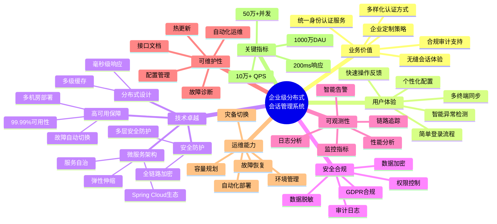

# 企业级解决方案文档 - 分布式会话管理方案

## 1. 项目背景与目标

### 1.1 项目背景
- **业务需求**:
  - 支持大规模微服务架构下的用户会话管理
  - 确保跨服务的用户身份认证和授权
  - 支持业务流程状态的持久化存储
  - 满足高并发、高可用的性能要求

- **技术挑战**:
  - 微服务间的会话数据一致性维护
  - 分布式环境下的安全性保障
  - 系统性能和可扩展性要求
  - 会话数据的实时同步和故障恢复

- **市场趋势**:
  - 微服务架构的广泛采用
  - 云原生应用的普及
  - 零信任安全架构的兴起
  - 全球化业务对分布式系统的需求增长

### 1.2 项目目标

#### 1.2.1 总体目标
构建企业级分布式会话管理系统，通过微服务架构和云原生技术，实现高性能、高可用、高安全的会话管理服务。系统面向千万级DAU设计，采用多租户架构，确保不同企业间的数据隔离和个性化需求。

#### 1.2.2 业务目标
- **认证与授权管理**
  - 支持多样化的认证方式（本地账号、SSO、OAuth等）
  - 提供细粒度的权限控制能力
  - 实现灵活的多因素认证机制
  - 支持多租户的定制化认证策略

- **用户体验优化**
  - 确保登录流程简单直观
  - 提供无缝的跨服务访问体验
  - 支持多终端的会话同步
  - 实现智能的异常检测和处理

- **安全合规保障**
  - 满足企业级安全要求
  - 确保数据隐私保护
  - 符合国际合规标准
  - 提供完整的审计能力

#### 1.2.3 技术目标
- **性能指标**
  - 支持1000万日活用户(DAU)
  - 峰值QPS达到10万+
  - 平均响应时间<200ms (95th percentile)
  - 并发会话数支持50万+

- **可用性指标**
  - 系统可用性达到99.99%
  - 实现多机房容灾能力
  - RPO趋近于0，RTO<5分钟
  - 支持服务的平滑扩缩容

- **扩展性指标**
  - 支持系统水平扩展
  - 实现动态弹性伸缩
  - 便于新增认证方式
  - 支持API版本演进

#### 1.2.4 质量目标
- **安全性指标**
  - 实现完整的加密传输
  - 确保敏感数据安全存储
  - 提供入侵检测能力
  - 支持安全审计追踪

- **可维护性指标**
  - 提供标准化接口
  - 完善技术文档
  - 支持配置热更新
  - 便于问题诊断

- **可观测性指标**
  - 全方位监控覆盖
  - 完整的日志追踪
  - 实时告警机制
  - 性能分析能力

## 2. 解决方案概述

### 2.1 架构设计

#### 一、总体架构
- **架构远景图**：


- **架构远景说明**：
  - **业务价值**：
   系统将支持多种身份验证方式，包括社交媒体登录和多因素认证，以满足不同用户的需求。
     - 提供统一的身份认证和会话管理服务
     - 支持企业定制的认证策略和安全策略
     - 实现跨服务、跨终端的无缝会话体验
     - 满足合规性要求并提供完整审计能力
     - 支持多种身份验证方式，包括社交媒体登录和多因素认证

  - **用户体验**：
    - 简单直观的登录流程设计
    - 快速响应的操作反馈
    - 智能的异常检测和处理
    - 多终端的无缝同步体验
    - 个性化的配置选项

  - **技术卓越**：
    - 微服务架构：基于Spring Cloud生态，支持服务自治和弹性伸缩
    - 分布式设计：采用多级缓存架构，确保毫秒级响应
    - 高可用保障：多机房部署，故障自动切换，确保99.99%可用性
    - 安全防护：全链路加密，多层次安全防护，防止会话劫持

  - **安全合规**：
    - 符合GDPR等国际安全标准
    - 数据加密存储和传输
    - 完整的审计日志记录
    - 细粒度的权限控制
    - 敏感数据脱敏处理

  - **可观测性**：
    - 全方位监控指标体系
    - 分布式链路追踪
    - 实时日志采集分析
    - 智能告警机制
    - 性能瓶颈分析

  - **可维护性**：
    - 统一的配置管理中心
    - 支持配置热更新
    - 自动化运维工具
    - 完善的故障诊断机制
    - 标准化的接口文档

  - **运维能力**：
    - 自动化部署和扩缩容
    - 故障自动检测和恢复
    - 容量智能规划
    - 多环境管理
    - 灾备切换演练

  - **关键指标**：
    - 性能：支持1000万DAU，峰值QPS 10万+
    - 响应：平均响应时间<200ms (95th percentile)
    - 可用性：99.99%，RPO趋近于0，RTO<5分钟
    - 扩展性：支持50万+并发会话数

- **核心原则**：

  1. **高可用性**：确保系统7*24小时稳定运行
     
     高可用性是分布式会话管理系统的首要原则。在微服务架构中，会话服务作为基础设施，其可用性直接影响整个业务系统的稳定性。高可用性体现在以下几个方面：

     - **服务冗余**：
       - 采用多节点部署，确保单点故障不会导致整体服务中断
       - 实现服务自动发现和注册，支持动态扩缩容
       - 使用负载均衡策略，合理分配请求流量
     
     - **故障容错**：
       - 实现故障自动检测和隔离机制
       - 支持服务熔断和降级策略
       - 提供请求重试和失败补偿机制
     
     - **数据高可用**：
       - Redis集群采用主从复制架构
       - 实现数据多副本存储和自动同步
       - 支持故障节点的自动切换和恢复

     关联设计点：
     - 三、关键机制 -> 高可用机制：服务自动发现、负载均衡、故障转移、熔断降级
     - 四、运维保障 -> 容灾备份：多副本备份、定时快照、灾难恢复预案
     - 六、性能指标 -> 系统可用性 > 99.99%
     - 2.2 技术选型 -> Redis Cluster：高可用分布式缓存集群
     - 3.1 系统模块 -> 数据存储模块：故障转移机制

  2. **可扩展性**：支持水平扩展以应对业务增长
     
     可扩展性确保系统能够应对不断增长的业务需求。在分布式会话管理中，可扩展性主要体现在系统架构的弹性和业务功能的扩展性两个维度：

     - **架构弹性**：
       - 支持服务实例的动态扩缩容
       - 实现请求的动态路由和负载均衡
       - 确保系统资源的合理利用和调度
     
     - **功能扩展**：
       - 采用模块化设计，支持新功能快速集成
       - 提供标准化的接口和协议
       - 支持多种认证方式和会话管理策略
     
     - **性能扩展**：
       - 支持集群规模的动态调整
       - 实现数据分片和分区存储
       - 提供缓存机制优化访问性能

     关联设计点：
     - 二、核心组件 -> 分层架构设计：接入层、服务层、存储层
     - 三、关键机制 -> 服务自动发现：动态服务注册与发现
     - 2.2 技术选型 -> Spring Cloud：微服务架构支持
     - 3.2 数据模型 -> 会话数据结构：支持扩展字段
     - 4.1 项目阶段 -> 分阶段实施策略

  3. **安全性**：保障用户数据和会话信息安全
     
     安全性是分布式会话管理的核心要求，需要在多个层面实现全方位的安全防护：

     - **传输安全**：
       - 使用HTTPS加密通信
       - 实现数据传输的加密和签名
       - 防止中间人攻击和数据篡改
     
     - **访问控制**：
       - 实现细粒度的权限管理
       - 支持多因素认证
       - 防止未授权访问和越权操作
     
     - **数据安全**：
       - 敏感数据加密存储
       - 实现数据访问审计
       - 确保数据隐私保护

     关联设计点：
     - 三、关键机制 -> 安全机制：HTTPS、JWT、OAuth2.0
     - 5.1 风险识别 -> 安全漏洞：风险评估和防范
     - 6.1 测试策略 -> 安全测试：渗透测试、安全审计
     - 3.1 系统模块 -> 认证模块：权限管理
     - 3.3 接口设计 -> API规范：安全认证接口

  4. **一致性**：确保分布式环境下的数据一致性
     
     在分布式环境中，数据一致性是确保系统可靠性的关键因素。需要在性能和一致性之间找到合适的平衡点：

     - **会话一致性**：
       - 确保用户会话状态的一致性
       - 处理并发访问和更新
       - 实现会话数据的同步复制
     
     - **数据一致性**：
       - 实现最终一致性模型
       - 处理分布式事务
       - 解决数据冲突和合并
     
     - **状态一致性**：
       - 维护业务状态的一致性
       - 处理异常和回滚机制
       - 确保操作的原子性

     关联设计点：
     - 三、关键机制 -> 数据一致性：Redis主从复制、数据同步策略
     - 3.1 系统模块 -> 会话管理模块：会话状态维护
     - 六、性能指标 -> 数据一致性延迟：< 1s
     - 3.2 数据模型 -> 会话数据结构：状态管理
     - 5.1 风险识别 -> 数据不一致：风险控制

- **高层次架构图**：
  ```mermaid
  graph TD
    Client -->|请求| API_Gateway
    API_Gateway -->|验证| JWT验证
    JWT验证 -->|授权| 微服务集群
    微服务集群 -->|存储| Redis集群
    微服务集群 -->|持久化| 持久化存储
    Redis集群 -->|会话| 会话存储
  ```

#### 二、业务架构
- **业务流程**：
  - 用户认证流程
  - 会话管理流程
  - 权限控制流程
  - 数据同步流程

- **业务域划分**：
  - 认证域
  - 会话管理域
  - 用户管理域
  - 权限管理域

#### 三、技术架构
- **应用架构**：
  - 微服务架构
  - 分布式缓存
  - 消息队列
  - 服务网关

- **框架选型**：
  - Spring Cloud 生态
  - Redis Cluster
  - OAuth2.0 + JWT
  - Docker + K8s

- **技术标准**：
  - RESTful API 规范
  - 微服务通信协议
  - 数据序列化格式
  - 接口版本控制

#### 四、数据架构
- **数据模型**：
  - 会话数据模型
  - 用户数据模型
  - 权限数据模型
  - 审计数据模型

- **存储方案**：
  - Redis集群：会话数据存储
  - MySQL：用户数据持久化
  - ElasticSearch：日志和审计数据
  - MongoDB：业务状态数据

- **数据流转**：
  - 数据同步策略
  - 数据备份方案
  - 数据清理策略
  - 数据迁移方案

#### 五、安全架构
- **认证授权**：
  - OAuth2.0 认证流程
  - JWT Token 管理
  - SSO 单点登录
  - 多因素认证

- **安全防护**：
  - 传输加密（HTTPS/TLS）
  - 数据加密存储
  - 防SQL注入
  - XSS/CSRF防护

- **审计监控**：
  - 访问日志审计
  - 操作行为审计
  - 安全事件监控
  - 异常行为检测

#### 六、部署架构
- **环境规划**：
  - 开发环境
  - 测试环境
  - 预生产环境
  - 生产环境

- **容器化部署**：
  - Docker容器化
  - K8s编排管理
  - 服务网格治理
  - CI/CD流水线

- **资源规划**：
  - 服务器资源配置
  - 网络带宽需求
  - 存储容量规划
  - 灾备资源配置

#### 七、集成架构
- **外部集成**：
  - 第三方认证集成
  - 外部系统对接
  - API网关集成
  - 消息系统集成

- **内部集成**：
  - 服务间通信
  - 数据同步集成
  - 监控系统集成
  - 日志系统集成

#### 八、运维架构
- **监控体系**：
  - 业务监控
  - 性能监控
  - 安全监控
  - 日志监控

- **运维管理**：
  - 配置管理
  - 变更管理
  - 容量管理
  - 应急响应

#### 九、性能架构
- **性能优化**：
  - 缓存策略
  - 负载均衡
  - 数据分片
  - 并发处理

- **扩展机制**：
  - 水平扩展
  - 垂直扩展
  - 数据库扩展
  - 缓存扩展

#### 十、可用性架构
- **高可用设计**：
  - 服务冗余
  - 故障转移
  - 灾难恢复
  - 数据备份

- **容错机制**：
  - 熔断策略
  - 降级策略
  - 限流策略
  - 重试策略

### 2.2 技术选型
- **技术栈**:
  - Gateway: Spring Cloud Gateway
  - 认证: JWT + OAuth 2.0
  - 缓存: Redis Cluster
  - 持久化: MySQL
  - 服务发现: Consul
  - 监控: Prometheus + Grafana

- **选型理由**:
  - Spring Cloud Gateway: 轻量级、高性能、易扩展
  - JWT: 无状态认证，降低服务器负载
  - Redis Cluster: 高性能、高可用的分布式缓存
  - Consul: 服务发现和配置管理的最佳实践

## 3. 详细设计

### 3.1 系统模块
- **认证模块**:
  - JWT token生成和验证
  - OAuth 2.0授权流程
  - 用户权限管理

- **会话管理模块**:
  - 分布式会话创建和维护
  - 会话数据同步
  - 会话过期处理

- **数据存储模块**:
  - Redis集群配置
  - 数据持久化策略
  - 故障转移机制

### 3.2 数据模型
- **会话数据结构**:
  ```json
  {
    "sessionId": "uuid",
    "userId": "string",
    "tokenInfo": {
      "accessToken": "string",
      "refreshToken": "string",
      "expireTime": "timestamp"
    },
    "userData": {
      "permissions": ["array"],
      "preferences": "object"
    },
    "businessState": "object"
  }
  ```

### 3.3 接口设计
- **API规范**:
  ```
  POST /api/auth/login
  POST /api/auth/refresh
  GET /api/session/{sessionId}
  PUT /api/session/{sessionId}
  DELETE /api/session/{sessionId}
  ```

- **通信协议**:
  - RESTful HTTP/HTTPS
  - WebSocket (实时数据同步)

## 4. 实施计划

### 4.1 项目阶段
- **阶段1: 基础设施搭建** (2个月)
  - 环境准备
  - 核心组件部署
  - 基础功能实现

- **阶段2: 功能开发** (3个月)
  - 认证模块开发
  - 会话管理实现
  - 数据存储集成

- **阶段3: 测试与优化** (2个月)
  - 功能测试
  - 性能测试
  - 安全测试

### 4.2 资源分配
- **团队结构**:
  - 项目经理 x 1
  - 架构师 x 2
  - 后端开发 x 5
  - 测试工程师 x 3
  - 运维工程师 x 2

## 5. 风险管理

### 5.1 风险识别
- **技术风险**:
  - Redis集群故障
  - 网络分区
  - 数据不一致
  - 性能瓶颈

- **业务风险**:
  - 用户体验下降
  - 安全漏洞
  - 运维复杂度

### 5.2 缓解措施
- **预防措施**:
  - Redis主从复制
  - 故障自动转移
  - 限流和降级策略
  - 安全审计和监控

- **应急计划**:
  - 故障转移方案
  - 数据恢复流程
  - 应急响应机制

## 6. 质量保证

### 6.1 测试策略
- **单元测试**:
  - 接口测试
  - 功能测试
  - 边界测试

- **集成测试**:
  - 端到端测试
  - 压力测试
  - 故障恢复测试

- **性能测试**:
  - 并发测试
  - 延迟测试
  - 容量测试

### 6.2 监控与维护
- **监控指标**:
  - QPS/TPS
  - 响应时间
  - 错误率
  - 资源使用率

- **维护计划**:
  - 定期健康检查
  - 性能优化
  - 安全补丁更新

## 7. 文档与培训

### 7.1 用户文档
- **技术文档**:
  - 架构设计文档
  - API文档
  - 运维手册

- **使用手册**:
  - 开发指南
  - 部署文档
  - 故障处理手册

### 7.2 培训计划
- **内部培训**:
  - 技术架构培训
  - 开发规范培训
  - 运维流程培训

- **外部培训**:
  - 客户使用培训
  - 技术支持培训

## 8. 附录

### 8.1 术语表
- JWT: JSON Web Token
- OAuth: 开放授权协议
- Redis: 开源内存数据存储系统
- CAP: 一致性、可用性、分区容错性

### 8.2 参考资料
- Redis官方文档: https://redis.io/documentation
- JWT规范: https://jwt.io/
- OAuth 2.0规范: https://oauth.net/2/
- Spring Cloud文档: https://spring.io/projects/spring-cloud