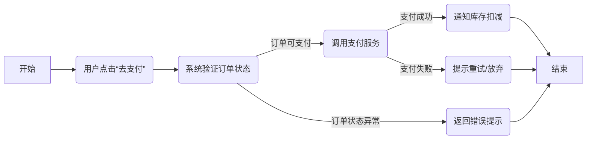

你现在是一位专业的需求分析师与领域驱动设计（DDD）顾问，请根据以下需求描述，编写若干条符合企业级标准的用户故事。用户故事要使用以下强化版 Markdown 模板，并尽量填写对应信息，写得专业且完整。

---
【需求描述】：
``` markdown

以下是将最初版本的用户场景和增强版本的用户场景融合在一起，汇总出一份更丰富的场景清单，帮助你在编写用户故事或进行系统设计时更全面地考虑各种登录行为与需求。
需求描述：模仿 Jira Web 登录功能


### 1. 目标与范围
* 目标：
在我们自己的系统中，实现与 Atlassian Jira Web（最新版本）完全一致的登录功能，包括登录界面、登录逻辑、密码管理、账号安全、二次验证（2FA）等所有细节。
* 范围：
仅限 Jira Web 登录与身份验证相关的所有功能，不包含登录后其他项目管理、看板、Issue 跟踪等功能。

### 2. 主要角色
1. 普通用户：拥有可登录系统的用户账号，需要进行正常登录、退出、2FA 等操作。
2. 管理员（或系统运维）：
    - 配置安全策略（如 2FA 必须开启、密码复杂度等）。
    - 查看登录日志或审计信息。
3. 访客或未登录用户：
    - 首次访问系统，可能需要进行注册或 SSO 登录跳转。
    - 未登录情况下看到的登录界面（如“登录 / 注册”入口）。

### 3. 登录与账号安全功能清单
1. Atlassian 账户类型的本地登录模式：
    - 用户名或邮箱 + 密码形式的传统登录；
    - “记住我 (Remember Me)” 选项；
    - 多语言支持（至少英文、中文）；
    - 密码错误时的错误提示、重试限制。
2. 第三方 SSO / OAuth 登录（Jira 支持的多种集成方式）：
    - Google / Microsoft / GitHub 等常见身份提供商登录；
    - SAML 或 OAuth 2.0 协议集成；
    - 配置和调用第三方提供商时的重定向流程。
3. 二次验证 (2FA)：
    - 可启用或强制启用二次验证（短信、TOTP、Authenticator App 等方式），模仿 Jira Cloud 的 2FA 流程；
    - 若用户账户启用了 2FA，则在输入正确密码后，要求输入一次性验证码。
4. 验证码 / 验证安全措施：
    - 当多次输入密码错误时触发人机验证 (CAPTCHA) 或锁定账号的功能；
    - 可配置重试次数、锁定时长；
    - 与安全日志联动，写入异常尝试记录。
5. 忘记密码 / 重置密码：
    - 支持通过邮件链接或安全问题/验证码重置密码；
    - 模仿 Jira：提交邮箱后，系统发送重置链接至邮箱，点击后进入重设页面；
    - 链接有效时长与安全措施（若多次频繁申请重置，则触发安全机制）。
6. 账号注册 / 登录状态管理：
    - 支持全新用户账号注册（如 Jira Cloud 允许用户自助创建 Atlassian Account，管理员可限制域名或手动审批）；
    - 登录状态保持，使用 Session / Cookie / Token 机制，模仿 Jira Cloud restful 方式；
    - 手动“退出登录”后清除缓存与 Cookie。
	7. 安全审计与日志：
    - 记录每次登录成功/失败的时间、IP、设备信息等；
    - 管理员可在后端或日志系统查看近期登录记录；
    - 对异常登录（如地理位置变化、可疑 IP）给出提示或邮件通知。
8. 企业级可配置策略：
    - 管理员可设置密码复杂度策略（长度、特殊字符）；
    - 管理员可配置是否强制 2FA；
    - 管理员可设置登录尝试次数上限、锁定时长；
    - Email 验证策略（用户初次注册或变更信息时，需要验证邮箱）；
9. UI/UX 要求：
    - 完全参考 Jira 最新登录页面的布局、配色、提示文案及引导流程；
    - 自适应各种屏幕（PC、平板、移动端）；
    - 操作流畅度、错误提示一致。

10. 前后端分离，Spring Cloud Alibaba 架构
    - 后端：采用 Spring Cloud、Spring Cloud Alibaba 体系，如 Nacos、Sentinel、Gateway、Feign、Ribbon 等微服务组件。
    - 前端：独立的前端应用，通过网关或 REST API 与后端通信。
    - 要求：登录服务作为一个独立微服务，具备水平扩展能力，与其他微服务（用户管理、支付、通知等）保持解耦。
11. SaaS 多租户，高并发场景
    - 多租户：该产品支持多个企业或组织共用一套系统，每个租户的用户、配置、数据相对隔离；管理员可针对租户做登录策略（如启用/禁用 2FA）。
    - 1000 万 DAU：系统需支撑日活用户达千万级别；在登录高峰期能承受大并发压力。
    - 流量特征：非工作时间流量是工作时间的三分之一，系统应能按流量自动扩容/缩容，避免资源浪费。
12.	国际化 (i18n) 支持
    - 多语言：最少支持中文、英文、繁体中文、日文等常用语言，并可根据地区自动切换；
    - 全球用户：在登录时自动检测时区、地理位置，以保障审计日志对跨时区用户的友好呈现；
    - 时区与夏令时：支持自动识别用户所在时区、夏令时变化，不影响登录验证或审计记录。

### 4. 非功能性需求（NFR）
1. 性能：
    - 针对 1000 万 DAU 级别设计，要求登录请求平均响应时间 <200ms（常规负载下），在高峰期亦能保持稳定。
    - Spring Cloud 微服务需支持弹性伸缩、负载均衡（可借助 Alibaba Dubbo、Nacos 或 Kubernetes HPA）。
2. 安全性：
    - 满足通行的 Web 安全防护要求（SQL 注入、XSS、CSRF 等），以及 SSL/TLS 加密；
    - 符合国际隐私法规 (如 GDPR)；对敏感信息（密码、2FA 密钥）加密或脱敏存储。。
3. 可扩展性：
    - 将来可添加更多第三方 SSO 提供商、更多的 2FA 方式（如硬件 Token）；
    - 支持多租户或多域名登录策略。
    - 微服务可独立升级；前端可单独部署或做灰度发布。
4. 可用性 (BCP/DR)：
    - 登录服务需 7×24 小时可用，单点故障可快速恢复；采用多机房容灾方案，
    - 重要登录数据（账号、密码哈希、2FA 密钥）需有多副本备份与灾备切换机制。
    - 关键登录服务数据多副本存储，RPO≈0；故障可在分钟级切换。

### 5. 用户场景示例
1. **场景1：本地账号 + 密码的常规登录**
    - 描述：已注册用户在登录页面输入邮箱（或用户名）和密码，选择“记住我”选项。若密码正确且未启用 2FA，则系统直接跳转到主界面；否则要求额外验证。
    - 要点：
        - 支持多语言登录提示；
        - 登录成功后生成 Session/Token，前端能拿到用户信息；
        - 在工作日高并发时能维持<200ms平均响应。
2. **场景2：管理员配置强制 2FA（企业租户A）**
    - 描述：管理员在后台启用“强制 2FA”策略。员工登录时，先输入密码，系统校验后，再弹出二次验证页面（TOTP 或短信等方式）。若二次验证通过则进入系统，否则拒绝登录。
    - 要点：
        - 与多租户策略结合，不同租户可有不同 2FA 配置；
        - 后端微服务需记录 TOTP 验证日志；
        - 防止短时间内大量失败尝试引发安全风险或过多报警。
3. **场景3：密码输入错误 5 次后锁定或触发 CAPTCHA**
    - 描述：某用户在短时间内连续输错密码 5 次，系统自动锁定账户 10 分钟或让用户通过验证码（CAPTCHA）来确认。若反复输错或来自可疑 IP，则系统触发更严的安全策略或通知管理员。
    - 要点：
        - 错误计数需在分布式缓存中记录，以支持高并发；
        - 锁定时长、阈值等由管理员在租户维度配置；
        - 日志中要有具体 IP、失败次数等信息，便于审计。
4. **场景4：忘记密码 / 重置密码流程**
    - 描述：用户点击“Forgot Password”，输入邮箱后，系统发送一封带有重置链接的邮件。用户打开链接并进行安全校验（如验证码问题），然后可重置密码。若多次频繁尝试或链接过期，则需再次请求或联系管理员。
    - 要点：
        - 验证链接有效时长；
        - 密码重置后，旧 Session/Token 失效，避免安全隐患；
        - 操作日志写入“密码重置成功/失败”及触发来源信息。
5. **场景5：用户使用第三方 SSO**
    - 描述：企业租户 B 启用 Google 或 Microsoft OAuth 登录，用户点击“使用 Google 登录”，系统将其重定向至 Google 授权页面；成功后回调本系统并自动生成/绑定该用户账号，最终进入主界面。
    - 要点：
        - 需在后端配置相应 Client ID/Secret、回调 URL；
        - SSO 失败或被拒绝时系统需正确提示并允许用户退回；
        - 若租户要求 2FA 强制，则在 SSO 成功后依然需要一次性验证码。
6. **场景6：国际化用户时区与多语言支持**
	* 描述：用户在美国洛杉矶，登录后界面显示英文及当地时间戳；若该用户切换到东京工作，系统审计日志能记录其日本时区，同时前端语言可自动或手动切换为日文。
	* 要点：
		+ 登录时区自动检测或可手动设置；
		+ 日志与安全提示均需要带时区信息；
        - 多语言界面需保留与 Jira 相似的本地化文案和布局。
7. **场景7：SaaS 多租户下的注册与登录**
    - 描述：某用户通过自助注册方式新建账号。系统根据其填写的企业域名或邀请码，将其分配到对应租户。登录时则带上租户标识，系统从微服务层面进行租户隔离。例如：subdomain1.xxx.com 登录后属租户1，subdomain2.xxx.com 属租户2；各自账号、密码、策略互不干扰。
	* 要点：
        - 分库或逻辑隔离来维护租户间数据；
        - 管理员可在租户级别定制登录策略（2FA、密码规则、SSO）；
        - 大规模租户并存时，系统要保证高并发与稳定性。
8. **场景8：非工作时间流量三分之一**
    - 描述：在夜间或周末时段，整体登录量只有工作日的三分之一。系统可通过自动伸缩（AutoScaling）减少不必要的实例，降低成本；同时保证锁定/2FA 机制依然有效。
    - 要点：
        - Spring Cloud Alibaba / Kubernetes HPA 结合监控指标进行弹性伸缩；
        - 要符合 SLA，不论高峰或低峰都能安全登录；
        - 不浪费资源及成本。
9. **场景9：高并发（上百万并发）压力测试**
    - 描述：租户 C 举行促销活动，短时间有大量用户同时登录，峰值可达几十万到上百万 QPS。系统通过多机房、负载均衡、Redis/分布式缓存、消息队列等方式支撑高并发登录，并保证平均响应小于 200ms。
    - 要点：
        - 防止数据库连接耗尽；
        - AutoScaling 或流量分发策略要完善；
        - 若某机房或容器组故障，需短时内切到其他资源。
10. **场景10：国际化合规与安全审计**
    - 描述：用户来自欧盟，需要在登录时同意 GDPR 条款；系统对敏感字段（如密码、2FA 秘钥）进行加密存储，限制访问。管理员可通过审计日志查看某用户的异常登录及 IP 分布，若发现风险可强制该用户重新验证或禁用账号。
    - 要点：
        - 加密、脱敏策略；
        - 国际化用户同意协议；
        - 审计日志可查详细登录历史（时间、IP、location）。
11. **场景11：多机房容灾 (BCP/DR) 演练**
    - 描述：系统在两个或更多数据中心部署，当主机房模拟断电后，流量切至备机房。用户登录过程中可能会话中断，需要重新确认或刷新，但整体业务不中断；数据也在灾备中心实时同步。
    - 要点：
        - RPO≈0，RTO 在数分钟内恢复；
        - 需要测试登录、2FA、密码重置等所有操作在 DR 切换中的一致性；
        - 日志中要记录切换时间和对应节点信息。

### 6. 依赖 & 风险
1. 依赖：
    - 需要邮件服务器（SMTP）或第三方邮件服务，用于发送重置密码邮件；
    - 需要防腐层适配 Google、Microsoft、Atlassian 等 SSO 协议；
    - 需要前端与后端共同配合支持 Session / Token / Cookie 机制。
2. 风险：
    - 无法实时获取最新 Jira Web UI 改动，有可能功能差异；
    - 第三方 SSO 授权流程变动（协议升级等），导致集成失效；
    - 2FA 方案若实施不当，会阻塞用户正常登录或产生过多支持请求。

### 7. 关键验收标准
	1. 功能覆盖：与 Jira Web 登录功能表现一致（包含本地登录、SSO、2FA、忘记密码、锁定机制等）。
    2. 高并发测试：在模拟 1000 万 DAU、峰值 QPS +3 倍的压测下，系统依然平稳，平均响应 <200ms；
    3. 微服务架构：前后端分离，后端基于 Spring Cloud Alibaba，各服务可独立扩容，故障时能自动降级或切换；
    4. 安全合规：密码安全 + TLS 加密 + 不留明文敏感信息 + 符合 GDPR 基础原则（数据最小化、明示同意等）。
	5. 可用性：在高并发场景下保证平均响应时间优良，用户不会因系统资源不足而无法登陆。
	6. 管理员配置：可成功进行密码策略与 2FA 的启停配置，并在日志中查看所有登录行为。
	7. 审计记录：所有异常或错误登录记录可追溯，管理员可查询并采取措施。
	8. 多机房容灾：故障演练时 RPO=0，RTO 在分钟级内完成切换。
	9. 国际化：切换语言后，登录界面、报错提示、审计日志时区均能正确显示；

### 8. 其他说明
	* 版本要求：参考 Atlassian Jira Cloud / Data Center 最新版本登录界面及相关官方文档。
	* 后续扩展：若后续要支持手机 App 登录或扫码登录，可在这个功能基础上继续迭代。
	* 文档/参考：Atlassian 官方文档中关于 Identity & Security，以及 Jira Cloud 登录流程说明。

```

【用户故事编写目标】：
1. 确保故事可直接用于后续 DDD 战略/战术设计，让团队快速对应到领域模型、上下文、领域事件等。
2. 帮助前端、测试、架构、运营等角色都能获取足够的信息。
3. 使故事在验收标准、测试场景中可落地，且满足企业合规与高可用需求。
```

---
【用户故事模板（Markdown 格式）】：

``` markdown
# 用户故事模版

## 1. 基本信息

- **用户故事编号 (ID)**: [US-001 或类似编号]
- **名称 (Title)**: [简要说明，如：“下单并支付”]
- **角色 (Actor / Role)**: [例如：买家 / 管理员 / 客服 / 其他外部角色]
- **优先级 (Priority)**: [如：High / Medium / Low]
- **状态 (Status)**: [如：待评审 / 进行中 / 完成 / 已验收]

---

## 2. 用户故事描述 (User Story Statement)

> **格式**: 作为 *[某个角色]*，我想要 *[某个目标]*，以便 *[实现某个业务价值]*

- **示例**: 作为一名买家，我想要在确认支付后实时看到库存扣减，以便确保我能顺利下单并及时发货。

---

## 3. 业务背景与动机 (Business Context & Motivation)

- **业务目标**: [为什么这个用户故事重要？与业务战略或收益挂钩的原因。]
- **痛点/机会**: [当前遇到的业务痛点，或可提升的领域机会。]
- **相关业务流程**: [若涉及端到端流程，可在此简要说明，如：下单->支付->扣库存->发货。]

---

## 4. 领域模型映射 (Domain Mapping)

- **相关限界上下文 (Bounded Contexts)**:
  - [如：订单上下文 / 库存上下文 / 支付上下文]
- **核心实体/聚合**:
  - [哪些实体、值对象、聚合与该故事直接相关？]
- **业务规则 / 领域规则**:
  1. [示例：订单金额 < 100 时，不可创建 VIP 订单]
  2. [示例：库存不足时，订单无法完成支付]
  3. [更多规则……]
- **可能触发的领域事件 (Domain Events)**:
  1. [如：`OrderPaidEvent` / `InventoryUpdatedEvent` 等]
  2. [是否有事件订阅者需要处理？]
- **领域服务 (Domain Services) 或应用服务**:
  - [如：`PaymentService` 用于跨聚合支付流程、`InventoryService` 等]

---

## 5. 前提条件 (Pre-Conditions)

- [列出在本故事触发前，系统或用户需满足的前置状态。]
- [如：用户必须已登录；商品必须处于可售状态；…]

---

## 6. 完整流程 (Main Flow & Alternate Flows)
在此部分，需要既有**流程图**，也要有**文字描述**，以便更直观地理解。
### 6.1 流程图 (Flow Diagram)


### 6.2 流程文字描述

1. 主流程 (Main Flow)
   1. [示例] 用户在购物车页面点击“去支付”。
   2. 系统验证订单状态无误，调用支付服务进行扣款操作。
   3. 支付服务返回成功后，系统通知库存服务进行库存扣减，并记录支付完成日志。
   4. 系统最终将成功信息返回给用户，进入订单完成页。
2. 扩展 / 异常场景 (Alternate Flows)
   1. 场景A：订单状态异常
      如果订单状态不是“待支付”，系统立刻返回错误提示，如“订单已取消，无法支付”。
   2. 场景B：支付失败
      若支付服务返回失败，系统提示用户重试或放弃支付，记录失败原因。
   3. 场景C：库存不足
      如库存服务返回扣减失败，系统回滚订单状态并向用户展示“库存不足”错误。

### 7. 验收标准 (Acceptance Criteria)
[列出可检验的条件，越具体越好。每条验收标准可对应一组测试用例。]
示例:
1. 当订单金额小于 100 时，系统提示“订单金额不足，无法升级为 VIP 订单”。
2. 当支付成功后，系统自动扣减库存，并返回可追踪的订单号。
3. 若库存不足，则支付流程被禁止，并返回错误提示给用户。

### 8. 验收测试 (Acceptance Testing)
- 测试用例/场景 (Scenario):
    1.	[单元 / 集成 / E2E 测试思路]
    2.	输入：xxx； 期望输出：xxx；
    3.	[如有契约测试（Contract Test）也可列示]
- 性能 / 安全 / 兼容测试（如适用）:
    1.	[若有特定的性能要求，如 QPS、响应时间]
    2.	[是否有安全或合规需求需测试？]

### 9. 非功能性需求 (NFRs) 关联
- 性能/SLA: [是否要求高并发？交易时限？]
- 安全/合规: [个人信息、支付数据、日志审计？]
- 可扩展性: [将来可能添加更多支付方式？更多语言或区域？]
- 可用性 (BCP/DR): [若支付服务宕机时，订单是否可回滚？]

### 10. 依赖与冲突 (Dependencies & Conflicts)
- 外部依赖: [如：第三方支付网关、库存系统、第三方物流…]
- 内部依赖: [如：前置用户注册、优惠券系统…]
- 潜在冲突: [同一时间其他用户故事是否影响该流程？]

### 11. 设计 & 实现提示 (Implementation Notes)
- [可选，写下对前端、后端、测试或运维等团队的额外指导]
- [如：前端需使用 WebSocket 实现实时刷新；后端要注意处理幂等性；…]

### 12. 用户场景 (User Scenarios)
在这里，你可以描述该用户故事关联的不同场景或角色如何在真实环境下使用本功能，以保证端到端一致性。
    示例：
        1.	场景1：买家查看购物车并尝试支付
            用户已登录，且购物车中有可用商品。
            点击“去支付”后进入支付流程。
            若支付成功，则进入下单成功页面；若失败，查看可用资金或切换支付方式。
        2.	场景2：管理员查看并调试支付日志
            管理员需要快速定位支付失败的原因，查看支付网关返回码。
            验证订单 ID、交易流水号是否一致，并确保库存服务是否成功扣减。
        3.	场景3：海外用户 / 移动端用户
            用户在移动端下单，支付流程同样需要展示相应国际化信息；若时区不同，需在订单记录里准确标识支付时间等。    

```

【请根据上述模板和需求描述，编写若干用户故事，并保证输出的内容具备专业度、企业级可用性。每条故事都要以 Markdown 形式呈现；如有多条故事，请依次编号。】