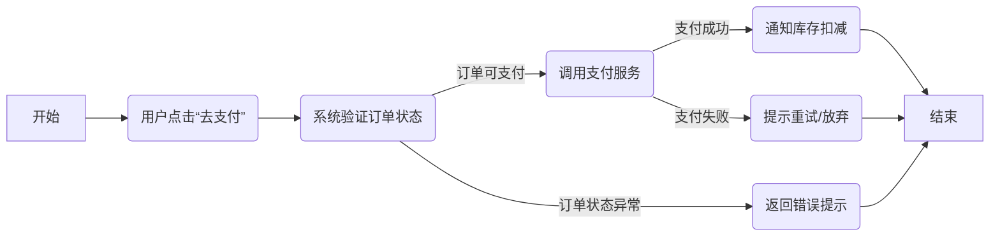

# 用户故事模版

## 1. 基本信息

- **用户故事编号 (ID)**: [US-001 或类似编号]
- **名称 (Title)**: [简要说明，如：“下单并支付”]
- **角色 (Actor / Role)**: [例如：买家 / 管理员 / 客服 / 其他外部角色]
- **优先级 (Priority)**: [如：High / Medium / Low]
- **状态 (Status)**: [如：待评审 / 进行中 / 完成 / 已验收]

---

## 2. 用户故事描述 (User Story Statement)

> **格式**: 作为 *[某个角色]*，我想要 *[某个目标]*，以便 *[实现某个业务价值]*

- **示例**: 作为一名买家，我想要在确认支付后实时看到库存扣减，以便确保我能顺利下单并及时发货。

---

## 3. 业务背景与动机 (Business Context & Motivation)

- **业务目标**: [为什么这个用户故事重要？与业务战略或收益挂钩的原因。]
- **痛点/机会**: [当前遇到的业务痛点，或可提升的领域机会。]
- **相关业务流程**: [若涉及端到端流程，可在此简要说明，如：下单->支付->扣库存->发货。]

---

## 4. 领域模型映射 (Domain Mapping)

- **相关限界上下文 (Bounded Contexts)**:
  - [如：订单上下文 / 库存上下文 / 支付上下文]
- **核心实体/聚合**:
  - [哪些实体、值对象、聚合与该故事直接相关？]
- **业务规则 / 领域规则**:
  1. [示例：订单金额 < 100 时，不可创建 VIP 订单]
  2. [示例：库存不足时，订单无法完成支付]
  3. [更多规则……]
- **可能触发的领域事件 (Domain Events)**:
  1. [如：`OrderPaidEvent` / `InventoryUpdatedEvent` 等]
  2. [是否有事件订阅者需要处理？]
- **领域服务 (Domain Services) 或应用服务**:
  - [如：`PaymentService` 用于跨聚合支付流程、`InventoryService` 等]

---

## 5. 前提条件 (Pre-Conditions)

- [列出在本故事触发前，系统或用户需满足的前置状态。]
- [如：用户必须已登录；商品必须处于可售状态；…]

---

## 6. 完整流程 (Main Flow & Alternate Flows)
在此部分，需要既有**流程图**，也要有**文字描述**，以便更直观地理解。
### 6.1 流程图 (Flow Diagram)

### 6.2 流程文字描述

1. 主流程 (Main Flow)
   1. [示例] 用户在购物车页面点击“去支付”。
   2. 系统验证订单状态无误，调用支付服务进行扣款操作。
   3. 支付服务返回成功后，系统通知库存服务进行库存扣减，并记录支付完成日志。
   4. 系统最终将成功信息返回给用户，进入订单完成页。
2. 扩展 / 异常场景 (Alternate Flows)
   1. 场景A：订单状态异常
      如果订单状态不是“待支付”，系统立刻返回错误提示，如“订单已取消，无法支付”。
   2. 场景B：支付失败
      若支付服务返回失败，系统提示用户重试或放弃支付，记录失败原因。
   3. 场景C：库存不足
      如库存服务返回扣减失败，系统回滚订单状态并向用户展示“库存不足”错误。

### 7. 验收标准 (Acceptance Criteria)
[列出可检验的条件，越具体越好。每条验收标准可对应一组测试用例。]
示例:
1. 当订单金额小于 100 时，系统提示“订单金额不足，无法升级为 VIP 订单”。
2. 当支付成功后，系统自动扣减库存，并返回可追踪的订单号。
3. 若库存不足，则支付流程被禁止，并返回错误提示给用户。

### 8. 验收测试 (Acceptance Testing)
- 测试用例/场景 (Scenario):
    1.	[单元 / 集成 / E2E 测试思路]
    2.	输入：xxx； 期望输出：xxx；
    3.	[如有契约测试（Contract Test）也可列示]
- 性能 / 安全 / 兼容测试（如适用）:
    1.	[若有特定的性能要求，如 QPS、响应时间]
    2.	[是否有安全或合规需求需测试？]

### 9. 非功能性需求 (NFRs) 关联
- 性能/SLA: [是否要求高并发？交易时限？]
- 安全/合规: [个人信息、支付数据、日志审计？]
- 可扩展性: [将来可能添加更多支付方式？更多语言或区域？]
- 可用性 (BCP/DR): [若支付服务宕机时，订单是否可回滚？]

### 10. 依赖与冲突 (Dependencies & Conflicts)
- 外部依赖: [如：第三方支付网关、库存系统、第三方物流…]
- 内部依赖: [如：前置用户注册、优惠券系统…]
- 潜在冲突: [同一时间其他用户故事是否影响该流程？]

### 11. 设计 & 实现提示 (Implementation Notes)
- [可选，写下对前端、后端、测试或运维等团队的额外指导]
- [如：前端需使用 WebSocket 实现实时刷新；后端要注意处理幂等性；…]

### 12. 用户场景 (User Scenarios)
在这里，你可以描述该用户故事关联的不同场景或角色如何在真实环境下使用本功能，以保证端到端一致性。
    示例：
        1.	场景1：买家查看购物车并尝试支付
            用户已登录，且购物车中有可用商品。
            点击“去支付”后进入支付流程。
            若支付成功，则进入下单成功页面；若失败，查看可用资金或切换支付方式。
        2.	场景2：管理员查看并调试支付日志
            管理员需要快速定位支付失败的原因，查看支付网关返回码。
            验证订单 ID、交易流水号是否一致，并确保库存服务是否成功扣减。
        3.	场景3：海外用户 / 移动端用户
            用户在移动端下单，支付流程同样需要展示相应国际化信息；若时区不同，需在订单记录里准确标识支付时间等。    