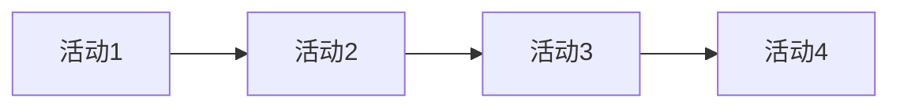

# 用户故事地图模板 / User Story Map Template

## 文档信息 / Document Information
- 文档编号 / Document ID：[项目代号-USM-序号]
- 版本 / Version：[1.0]
- 状态 / Status：[草稿/评审中/已批准]
- 作者 / Author：[姓名]
- 最后更新 / Last Updated：[YYYY-MM-DD]

## 1. 用户旅程概览 / User Journey Overview
### 1.1 目标用户 / Target Users
- 主要用户：[描述]
- 次要用户：[描述]

### 1.2 核心用户旅程 / Core User Journey

## 2. 用户活动分解 / User Activities Breakdown
### 2.1 活动1：[活动名称]
#### 用户任务 / User Tasks
- [ ] 任务1.1
  - 子任务1.1.1
  - 子任务1.1.2
- [ ] 任务1.2
  - 子任务1.2.1

### 2.2 活动2：[活动名称]
[按上述格式继续]

## 3. 用户痛点分析 / User Pain Points Analysis
### 3.1 当前痛点 / Current Pain Points
| 痛点描述 | 影响范围 | 优先级 | 相关活动 |
|---------|---------|--------|----------|
| [描述] | [范围] | [高/中/低] | [活动] |

### 3.2 改进机会 / Improvement Opportunities
| 改进建议 | 预期效果 | 实现难度 | 优先级 |
|---------|---------|----------|--------|
| [建议] | [效果] | [高/中/低] | [高/中/低] |

## 4. 发布计划 / Release Planning
### 4.1 最小可行产品 / MVP
- 核心功能：
  - [功能1]
  - [功能2]

### 4.2 后续迭代 / Following Iterations
- 迭代1：[功能列表]
- 迭代2：[功能列表]

## 5. 附加信息 / Additional Information
### 5.1 相关文档 / Related Documents
- [相关文档链接]

### 5.2 变更记录 / Change Log
| 版本 | 日期 | 作者 | 变更说明 |
|-----|------|------|----------|
| 1.0 | [日期] | [作者] | [说明] | 