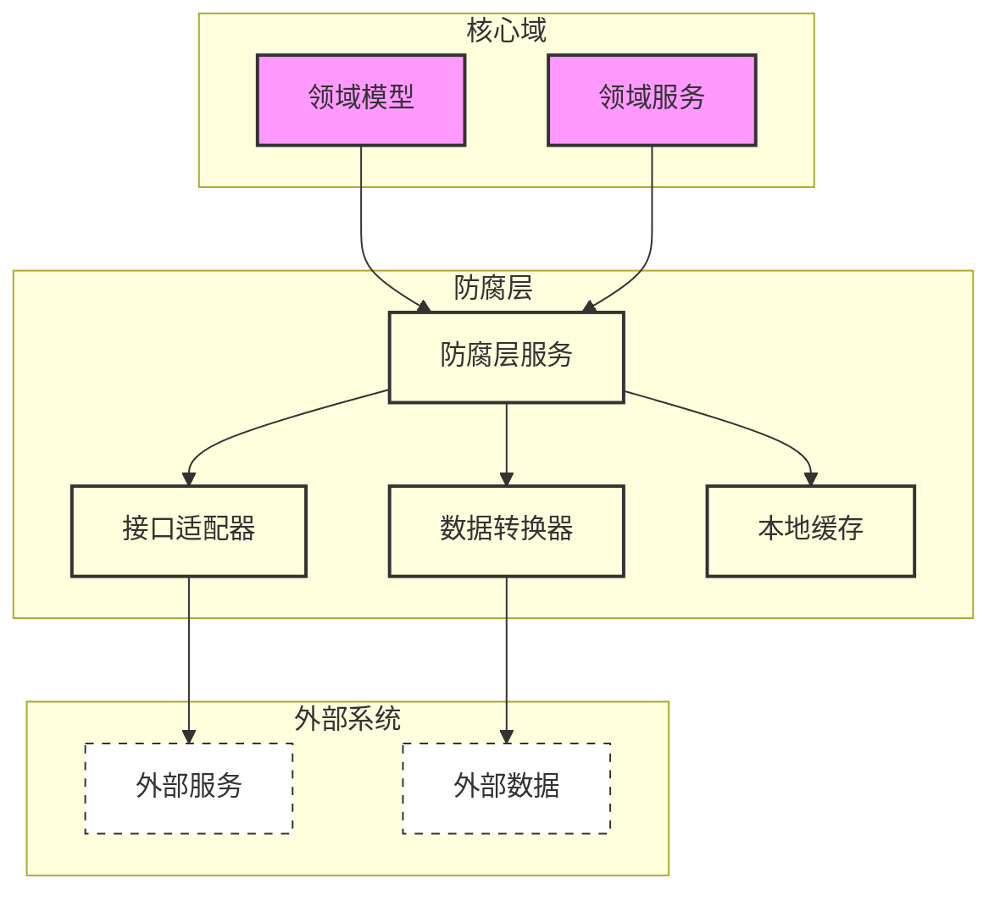

# 防腐层设计文档

## 文档信息

| 信息 | 说明 |
|------|------|
| 文档编号 | ACL-001 |
| 版本号 | V1.0 |
| 状态 | Draft/In Review/Approved |
| 作者 | |
| 评审人 | |
| 创建日期 | YYYY-MM-DD |
| 最后更新日期 | YYYY-MM-DD |

## 变更历史

| 版本 | 修改日期 | 修改人 | 修改描述 |
|------|----------|--------|----------|
| V1.0 | YYYY-MM-DD | | 初始版本 |

## 1. 概述

### 1.1 设计目的
说明防腐层的设计意图和解决的核心问题。

### 1.2 设计范围
- 涉及的限界上下文
- 需要适配的外部系统
- 防腐层的边界定义

### 1.3 相关文档
- 限界上下文定义文档
- 外部系统接口文档
- 统一语言词汇表

## 2. 外部系统分析

### 2.1 系统概况
| 系统名称 | 系统职责 | 交互频率 | 数据量级 | 接口类型 |
|----------|----------|-----------|-----------|----------|
| [系统1] | | | | |
| [系统2] | | | | |

### 2.2 接口清单
| 接口名称 | 用途 | 请求方式 | 数据格式 | SLA要求 |
|----------|------|----------|-----------|----------|
| [接口1] | | | | |
| [接口2] | | | | |

### 2.3 数据模型差异
| 业务概念 | 本系统定义 | 外部系统定义 | 转换需求 |
|----------|------------|--------------|----------|
| [概念1] | | | |
| [概念2] | | | |

## 3. 防腐层设计

### 3.1 架构设计


> 架构设计章节阐述了防腐层的整体结构和各个组件之间的关系。防腐层作为领域模型和外部系统之间的中间层，其主要职责是隔离外部系统的复杂性，保护领域模型的纯粹性。在架构设计中，我们需要明确以下几个关键点：
> 1. 组件划分：将防腐层分为服务层、数据转换层和适配层，每层负责不同的职责
> 2. 依赖关系：确保所有外部依赖都通过防腐层进行，不允许领域模型直接依赖外部系统
> 3. 数据流向：清晰定义数据在各层之间的转换和流动方式
> 4. 缓存策略：设计本地缓存机制，减少对外部系统的直接依赖
> 这个架构图使用分层和组件的方式，直观地展示了系统间的交互关系和数据流向，帮助开发团队理解防腐层的整体结构。

### 3.2 适配策略
| 场景 | 适配方式 | 转换规则 | 异常处理 |
|------|----------|----------|----------|
| [场景1] | | | |
| [场景2] | | | |

> 适配策略章节详细说明了如何处理外部系统与领域模型之间的差异。这是防腐层的核心内容，需要考虑以下几个方面：
> 1. 业务场景适配：针对不同的业务场景，设计相应的适配策略，确保业务流程的连续性
> 2. 数据模型转换：处理外部系统与内部模型之间的数据结构差异，包括字段映射、类型转换等
> 3. 接口协议适配：处理不同系统间的通信协议差异，包括同步/异步调用、消息格式等
> 4. 异常处理机制：设计完善的异常处理策略，确保系统的健壮性和可靠性
> 适配策略的设计直接影响到系统的集成质量和维护成本，需要在灵活性和复杂性之间找到平衡点。

### 3.3 接口适配器
```java
// 示例代码结构
public interface ExternalSystemAdapter {
    // 适配器接口定义
}

public class ExternalSystemAdapterImpl implements ExternalSystemAdapter {
    // 适配器实现
}
```

> 接口适配器章节提供了具体的代码级实现指导。这里需要详细说明如何构建和使用适配器：
> 1. 接口设计原则：遵循单一职责原则，每个适配器只负责一个外部系统或一组相关功能
> 2. 适配器模式应用：使用标准的适配器模式，将外部接口转换为领域模型所需的接口
> 3. 代码组织结构：清晰的包结构和命名规范，便于代码维护和扩展
> 4. 实现最佳实践：包括错误处理、日志记录、性能优化等具体实现细节
> 接口适配器的实现质量直接影响到系统的可维护性和可测试性，需要遵循良好的设计模式和编码规范。

## 4. 数据转换规则

### 4.1 模型转换
| 源模型 | 目标模型 | 转换规则 | 特殊处理 |
|--------|----------|----------|----------|
| [模型1] | | | |
| [模型2] | | | |

> 模型转换章节详细描述了如何进行领域模型与外部系统数据模型之间的转换。这个环节需要考虑：
> 1. 领域模型完整性：确保转换过程不会破坏领域模型的封装性和业务规则
> 2. 数据完整性：保证数据转换的准确性和完整性，处理好数据类型、格式、精度等问题
> 3. 转换规则定义：明确定义转换规则，包括字段映射、值转换、默认值处理等
> 4. 特殊情况处理：考虑数据不一致、格式错误等异常情况的处理方案
> 模型转换是防腐层的核心功能之一，需要确保转换过程的可靠性和可维护性。

### 4.2 字段映射
| 源字段 | 目标字段 | 数据类型 | 转换逻辑 | 校验规则 |
|--------|----------|-----------|-----------|-----------|
| [字段1] | | | | |
| [字段2] | | | | |

> 字段映射章节提供了详细的字段级别转换规则。这部分内容需要包括：
> 1. 字段对应关系：明确定义源系统和目标系统的字段映射关系
> 2. 数据类型转换：处理不同系统间的数据类型差异，确保类型转换的安全性
> 3. 验证规则：定义字段级别的验证规则，确保数据的正确性和有效性
> 4. 默认值处理：规定字段缺失或空值情况下的处理策略
> 字段映射的准确性和完整性是确保系统正常运行的基础，需要仔细设计和验证。

### 4.3 状态映射
| 源状态 | 目标状态 | 转换条件 | 处理逻辑 |
|--------|----------|-----------|----------|
| [状态1] | | | |
| [状态2] | | | |

## 5. 版本兼容策略

### 5.1 版本管理
- 版本号规则
- 兼容性策略
- 升级流程

> 版本管理章节说明如何处理防腐层的版本演进。这个部分需要考虑：
> 1. 版本号规则：定义清晰的版本号命名规则，反映接口的兼容性变化
> 2. 兼容性策略：说明如何处理接口的向前和向后兼容
> 3. 升级流程：定义防腐层升级的具体步骤和注意事项
> 4. 回滚机制：设计版本回滚的策略和操作流程
> 良好的版本管理可以确保系统平滑升级，减少版本变更带来的风险。

### 5.2 向后兼容
| 变更类型 | 兼容策略 | 过渡方案 | 切换时间 |
|----------|----------|-----------|----------|
| [类型1] | | | |
| [类型2] | | | |

### 5.3 降级策略
| 故障场景 | 降级方案 | 恢复策略 | 业务影响 |
|----------|----------|-----------|----------|
| [场景1] | | | |
| [场景2] | | | |

## 6. 实现指南

### 6.1 开发规范
- 代码组织结构
- 命名规范
- 异常处理规范
- 日志规范

> 开发规范章节为开发团队提供具体的编码指导。这部分应该包括：
> 1. 代码结构规范：定义项目的包结构、命名规范、代码组织方式
> 2. 编码规范：规定代码风格、注释要求、命名约定等
> 3. 异常处理：统一的异常处理策略和日志记录要求
> 4. 代码审查：设定代码审查的标准和流程
> 规范的开发流程可以提高代码质量，减少维护成本，提升团队协作效率。

### 6.2 测试策略
- 单元测试要求
- 集成测试场景
- 性能测试指标
- 兼容性测试

### 6.3 部署说明
- 部署架构
- 配置管理
- 监控告警
- 运维指南

## 7. 附录

### 7.1 关键设计决策
| 决策点 | 方案选择 | 决策理由 | 替代方案 |
|--------|----------|----------|-----------|
| [决策1] | | | |
| [决策2] | | | |

### 7.2 风险评估
| 风险点 | 影响程度 | 应对措施 | 责任人 |
|--------|----------|-----------|--------|
| [风险1] | | | |
| [风险2] | | | |

### 7.3 评审记录
| 评审日期 | 评审人 | 评审结果 | 主要反馈 |
|----------|--------|----------|----------|
| YYYY-MM-DD | | | | 