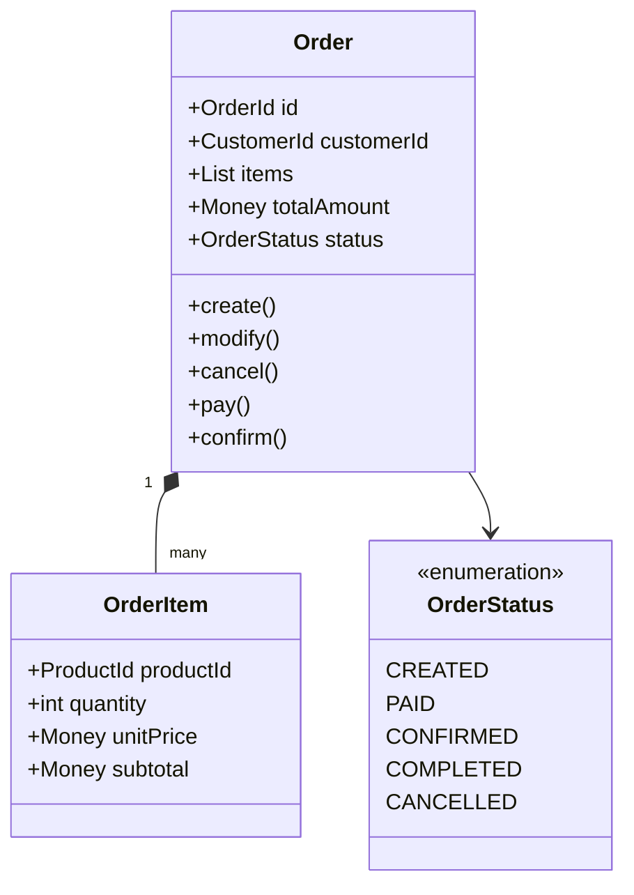

# 限界上下文定义文档

## 文档信息
| 信息 | 内容 |
|---|---|
| 文档编号 | BC-{项目代号}-001 |
| 版本 | v1.0.0 |
| 状态 | Draft/In Review/Approved |
| 作者 | {作者} |
| 审核人 | {审核人} |
| 最后更新时间 | YYYY-MM-DD |

## 变更历史
| 版本 | 修改日期 | 修改人 | 修改描述 |
|---|---|---|---|
| v1.0.0 | YYYY-MM-DD | {作者} | 初始版本 |

## 1. 概述
### 1.1 文档目的
### 1.2 参考文档
### 1.3 术语定义

## 2. 限界上下文总览
### 2.1 上下文关系图
### 2.2 职责概述

## 3. 上下文定义
### 3.1 {上下文名称}

#### 说明
上下文定义是限界上下文文档的核心部分，它详细描述了每个限界上下文的完整定义。这部分需要从业务、数据、技术等多个维度来刻画一个限界上下文的完整轮廓。每个上下文的定义都应该是自包含的，即使脱离其他章节也能让读者完整理解该上下文的职责和边界。这里的描述应当足够详细，使得不同团队的成员（包括业务人员、开发人员、运维人员等）都能从各自的视角理解这个上下文。

#### 关键要素
- 上下文的核心目标和定位
- 业务能力清单
- 领域模型结构
- 数据主权范围
- 团队职责划分

#### 示例：订单上下文(Order Context)

##### 3.1.1 职责范围
```markdown
负责整个订单生命周期的管理，包括订单创建、修改、取消、支付状态跟踪、订单履行等核心业务流程。
作为订单领域的权威数据源，负责维护订单相关的所有核心数据。

主要职责：
- 订单生命周期管理
- 订单定价计算
- 订单状态流转
- 订单历史记录维护
- 订单相关业务规则执行
```

##### 3.1.2 业务能力
```markdown
核心业务能力：
1. 订单管理
   - 创建订单
   - 修改订单
   - 取消订单
   - 订单支付处理
   - 订单确认
   - 订单完成

2. 定价管理
   - 基础价格计算
   - 优惠规则应用
   - 税费计算
   - 运费计算
   - 最终价格确定

3. 订单策略
   - 库存检查
   - 信用额度验证
   - 风险控制
   - 订单拆分
```

##### 3.1.3 领域模型


##### 3.1.4 聚合定义
```markdown
订单聚合：
- 聚合根：Order
- 实体：OrderItem
- 值对象：Money, OrderStatus
- 不变量：
  1. 订单总金额必须等于所有订单项的总和
  2. 已支付订单不能修改金额
  3. 已取消订单不能重新激活
```

##### 3.1.5 数据所有权
```markdown
主数据：
- 订单主数据
- 订单项数据
- 订单状态历史
- 订单定价数据

依赖数据（通过防腐层获取）：
- 商品信息（商品上下文）
- 客户信息（客户上下文）
- 支付信息（支付上下文）
```

##### 3.1.6 团队映射
```markdown
负责团队：订单团队
团队组成：
- 产品经理 x 1
- 技术负责人 x 1
- 高级开发工程师 x 3
- 开发工程师 x 4
- 测试工程师 x 2
- DevOps工程师 x 1

职责分工：
- 产品负责订单业务流程设计
- 开发负责核心功能实现
- 测试负责质量保证
- DevOps负责部署运维
```

#### 注意事项
1. 确保职责范围明确且不与其他上下文重叠
2. 业务能力要具体且可操作
3. 领域模型要反映核心业务概念
4. 数据所有权要清晰界定
5. 团队映射要与组织结构匹配

### 3.2 {上下文名称2}
...

## 4. 边界定义

#### 说明
边界定义是限界上下文最关键的部分之一，它明确定义了上下文的各种边界，包括业务、数据、团队和技术层面。清晰的边界定义能够帮助团队理解责任范围，减少跨上下文的不必要耦合，提高系统的可维护性和可扩展性。边界定义需要考虑当前需求和未来演进，在保持边界清晰的同时预留适当的扩展空间。

#### 关键要素
- 业务职责边界
- 数据所有权边界
- 团队协作边界
- 技术实现边界

### 4.1 业务边界

#### 说明
业务边界定义了每个上下文所负责的业务功能范围，明确了业务流程的起点和终点，以及与其他上下文的业务交互点。

#### 示例：订单上下文的业务边界
```markdown
核心业务范围：
1. 订单生命周期管理
   - 起点：用户提交订单请求
   - 终点：订单完成或取消
   - 不包含：购物车管理、商品管理

2. 业务规则范围
   - 订单定价规则
   - 订单状态转换规则
   - 订单拆分规则
   
3. 业务交互点
   - 与购物车上下文：接收购物车转换请求
   - 与支付上下文：发送支付请求，接收支付结果
   - 与库存上下文：检查库存，锁定库存
   - 与物流上下文：创建发货请求
```

### 4.2 数据边界

#### 说明
数据边界明确定义了每个上下文的数据所有权和数据共享规则，包括主数据的管理和依赖数据的获取方式。

#### 示例：订单上下文的数据边界
```markdown
1. 数据所有权
   主数据（完全拥有）：
   - 订单基本信息
   - 订单项信息
   - 订单状态记录
   - 订单定价信息

2. 依赖数据（通过集成获取）：
   - 商品信息
     * 获取方式：商品上下文REST API
     * 更新策略：实时查询 + 本地缓存
     * 缓存时间：15分钟
   
   - 用户信息
     * 获取方式：用户上下文事件订阅
     * 更新策略：异步更新
     * 本地存储：核心属性快照

3. 数据共享规则
   - 对外提供的数据服务
   - 数据访问控制策略
   - 数据同步机制
```

### 4.3 团队边界

#### 说明
团队边界定义了负责该上下文的团队组织结构、职责分工和协作方式，确保团队自治的同时保持必要的协作。

#### 示例：订单上下文的团队边界
```markdown
1. 团队组织
   - 核心团队
     * 产品负责人：张三
     * 技术负责人：李四
     * 开发团队：5人
     * 测试团队：2人
     * DevOps：1人

2. 职责划分
   - 产品职责
     * 订单业务流程设计
     * 用户体验优化
     * 需求优先级管理
   
   - 技术职责
     * 架构设计和演进
     * 核心功能开发
     * 性能优化
     * 技术债务管理

3. 协作机制
   - 日常协作
     * 每日站会：9:30
     * 周会：周五 14:00
     * 代码审查：双人评审制
   
   - 跨团队协作
     * 定期架构同步会：双周
     * API变更评审会：按需
     * 联合排障机制
```

### 4.4 技术边界

#### 说明
技术边界定义了上下文在技术实现层面的约束和规范，包括技术栈选择、接口规范、部署要求等。

#### 示例：订单上下文的技术边界
```markdown
1. 技术栈规范
   - 开发语言：Java 17
   - 框架选择：Spring Boot 3.x
   - 数据库：PostgreSQL 14
   - 消息队列：RabbitMQ
   - 缓存：Redis

2. 接口规范
   - REST API
     * 遵循RESTful设计规范
     * 使用OpenAPI 3.0文档
     * 统一响应格式
   
   - 事件接口
     * 事件格式：CloudEvents
     * 序列化：Protocol Buffers
     * 版本控制策略

3. 部署要求
   - 容器化部署：Docker
   - 编排平台：Kubernetes
   - 最小副本数：3
   - 资源配置要求
   - 监控和告警要求

4. 性能边界
   - 响应时间：99% < 300ms
   - 吞吐量：1000 TPS
   - 数据一致性要求
   - 可用性目标：99.99%
```

#### 注意事项
1. 边界定义要清晰但不过于僵化
2. 预留适当的演进空间
3. 定期评审和调整边界定义
4. 确保团队间充分理解和遵守边界
5. 建立边界变更的管理机制

## 5. 接口规范
### 5.1 服务接口
### 5.2 事件接口
### 5.3 数据接口
### 5.4 集成模式

## 6. 数据所有权

#### 说明
数据所有权章节详细定义了上下文对数据的管理职责和权限。明确的数据所有权有助于避免数据不一致，减少数据冗余，并确保数据质量。这部分需要明确界定数据的产生、维护、共享和销毁的完整生命周期管理责任。

#### 关键要素
- 主数据定义和管理
- 数据访问权限控制
- 数据同步策略制定
- 数据质量保证措施

### 6.1 主数据定义

#### 说明
定义上下文负责管理的核心数据实体及其属性。

#### 示例：订单上下文的主数据定义
```markdown
1. 订单主数据
   核心属性：
   - 订单ID (Primary Key)
   - 创建时间
   - 客户ID (Foreign Key)
   - 订单状态
   - 支付状态
   - 总金额
   - 币种

   数据特征：
   - 不可变性：订单号、创建时间
   - 可变性：订单状态、支付状态
   - 计算性：总金额（由订单项计算）

2. 订单项数据
   核心属性：
   - 订单项ID
   - 订单ID (Foreign Key)
   - 商品ID (Foreign Key)
   - 数量
   - 单价
   - 小计金额

   数据约束：
   - 数量必须大于0
   - 单价必须大于等于0
   - 小计必须等于数量乘以单价
```

### 6.2 数据权责

#### 说明
明确定义数据的访问权限和管理职责。

#### 示例：订单上下文的数据权责
```markdown
1. 数据访问权限
   读取权限：
   - 订单服务：完全读取权限
   - 支付服务：订单支付相关字段
   - 物流服务：订单配送相关字段
   - 客服系统：订单基本信息

   写入权限：
   - 订单服务：完全写入权限
   - 支付服务：更新支付状态
   - 物流服务：更新物流状态

2. 数据管理职责
   - 数据创建：订单服务
   - 数据更新：各服务按权限更新
   - 数据归档：订单服务
   - 数据清理：运维团队
```

### 6.3 数据同步策略

#### 说明
定义数据在不同上下文间的同步机制和策略。

#### 示例：订单上下文的数据同步策略
```markdown
1. 实时同步
   场景：
   - 订单状态变更
   - 支付状态更新
   - 库存锁定释放

   实现方式：
   - 事件驱动
   - 消息队列
   - 回调通知

2. 准实时同步
   场景：
   - 订单统计数据
   - 用户订单历史
   - 商品销售数据

   实现方式：
   - 批量同步
   - CDC机制
   - 定时任务

3. 离线同步
   场景：
   - 历史订单归档
   - 数据仓库同步
   - 报表数据准备

   实现方式：
   - ETL作业
   - 数据导出导入
   - 增量同步
```

### 6.4 数据质量要求

#### 说明
定义数据质量标准和保证措施。

#### 示例：订单上下文的数据质量要求
```markdown
1. 数据准确性
   - 金额计算精度：保留2位小数
   - 时间精度：精确到毫秒
   - 数据一致性检查：定期校验

2. 数据完整性
   - 必填字段验证
   - 外键完整性保证
   - 业务规则验证

3. 数据及时性
   - 实时数据：延迟<1秒
   - 准实时数据：延迟<5分钟
   - 离线数据：延迟<24小时

4. 监控措施
   - 数据质量监控
   - 异常数据告警
   - 定期质量报告
```

## 7. 实施指南

#### 说明
实施指南提供了将限界上下文从设计转变为实际系统所需的具体指导。这部分内容应该足够详细，使开发团队能够按照指南正确实现系统。

#### 关键要素
- 开发规范和标准
- 测试策略和方法
- 部署流程和要求
- 运维保障措施

### 7.1 开发规范

#### 示例：订单上下文的开发规范
```markdown
1. 代码规范
   - 编码规范：Google Java Style
   - 命名规范：
     * 类名：大驼峰
     * 方法名：小驼峰
     * 常量：全大写下划线
   - 注释规范：
     * 类注释：说明职责和作者
     * 方法注释：说明参数和返回值
     * 关键代码注释：说明业务逻辑

2. 架构规范
   - 分层架构：
     * 接口层：REST/Event接口
     * 应用层：业务流程编排
     * 领域层：核心业务逻辑
     * 基础设施层：技术实现
   - 依赖规则：
     * 单向依赖
     * 依赖倒置
     * 接口隔离

3. 设计模式
   - 领域驱动设计模式
   - 事件溯源
   - CQRS
   - 工厂模式
   - 策略模式
```

### 7.2 测试策略

#### 示例：订单上下文的测试策略
```markdown
1. 单元测试
   - 覆盖率要求：>80%
   - 测试框架：JUnit 5
   - 模拟框架：Mockito
   - 测试范围：
     * 领域模型
     * 业务规则
     * 计算逻辑

2. 集成测试
   - 测试范围：
     * 接口集成
     * 数据库操作
     * 消息集成
   - 测试环境：
     * 独立测试数据库
     * 模拟外部服务

3. 端到端测试
   - 测试工具：Cucumber
   - 测试场景：
     * 核心业务流程
     * 异常处理流程
     * 性能测试场景
```

### 7.3 部署要求

#### 示例：订单上下文的部署要求
```markdown
1. 环境要求
   - 开发环境：
     * JDK 17
     * Maven 3.8+
     * Docker 20.10+
   - 测试环境：
     * 8核16G
     * 100G存储
   - 生产环境：
     * 16核32G
     * 500G存储

2. 部署流程
   - 制品打包：
     * Docker镜像
     * 配置文件
     * 数据库脚本
   - 部署步骤：
     * 数据库更新
     * 配置更新
     * 服务更新
     * 健康检查

3. 监控要求
   - 基础监控：
     * CPU使用率
     * 内存使用率
     * 磁盘使用率
   - 应用监控：
     * 接口响应时间
     * 错误率
     * 业务指标
```

### 7.4 运维考虑

#### 示例：订单上下文的运维考虑
```markdown
1. 日志管理
   - 日志级别：
     * PROD: WARN以上
     * TEST: INFO以上
     * DEV: DEBUG以上
   - 日志内容：
     * 时间戳
     * 追踪ID
     * 上下文信息
     * 错误堆栈

2. 监控告警
   - 告警级别：
     * P0：立即处理
     * P1：30分钟内处理
     * P2：2小时内处理
   - 告警渠道：
     * 短信
     * 邮件
     * 企业微信

3. 应急预案
   - 故障等级划分
   - 响应流程
   - 升级机制
   - 回滚方案
```

## 附录

### A. 接口清单
```markdown
1. REST API列表
2. 事件接口列表
3. 内部服务接口
```

### B. 评审记录
```markdown
| 日期 | 评审人 | 评审结果 | 主要反馈 |
|------|--------|----------|----------|
| 2024-01-20 | 架构组 | 通过 | 建议优化性能指标 |
```

### C. 参考资料
```markdown
1. DDD实践指南
2. 系统架构设计文档
3. 技术标准规范
``` 