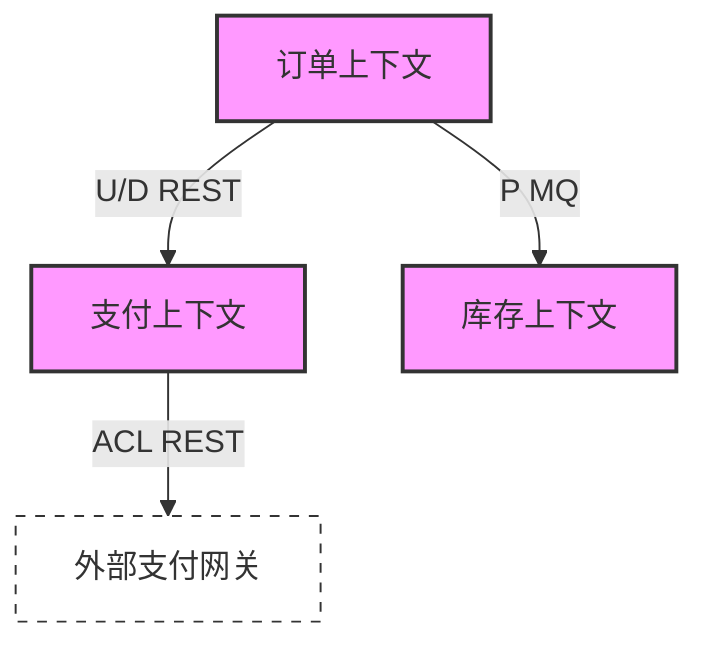

# 上下文映射关系图文档

## 文档信息
| 信息 | 内容 |
|---|---|
| 文档编号 | CM-{项目代号}-001 |
| 版本 | v1.0.0 |
| 状态 | Draft/In Review/Approved |
| 作者 | {作者} |
| 审核人 | {审核人} |
| 最后更新时间 | YYYY-MM-DD |

## 变更历史
| 版本 | 修改日期 | 修改人 | 修改描述 |
|---|---|---|---|
| v1.0.0 | YYYY-MM-DD | {作者} | 初始版本 |

## 1. 概述

### 1.1 文档目的
本文档旨在清晰地描述系统中各个限界上下文之间的关系和交互方式，帮助团队理解上下文间的依赖关系和集成模式。

### 1.2 关系类型说明
- U/D (Upstream/Downstream): 上下游关系
- P (Partnership): 合作伙伴关系
- ACL (Anti-Corruption Layer): 防腐层
- OHS (Open Host Service): 开放主机服务
- PL (Published Language): 发布语言
- SK (Shared Kernel): 共享内核
- CF (Customer/Supplier): 客户/供应商

## 2. 上下文映射总览

### 2.1 系统全景图


### 2.2 关系概述表
| 源上下文 | 目标上下文 | 关系类型 | 集成方式 | 通信协议 |
|----------|------------|----------|-----------|-----------|
| 订单 | 支付 | U/D | 同步 | REST |
| 订单 | 库存 | P | 异步 | MQ |
| 支付 | 支付网关 | ACL | 同步 | REST |

## 3. 详细映射关系

### 3.1 订单-支付上下文关系
#### 说明
订单上下文作为下游消费者，依赖支付上下文提供的支付处理服务。

#### 交互详情
```markdown
1. 接口依赖
   - 创建支付单
   - 查询支付状态
   - 退款处理

2. 数据依赖
   - 支付状态
   - 支付方式
   - 退款信息

3. 集成模式
   - 同步调用：REST API
   - 异步通知：Webhook
   - 状态同步：MQ事件
```

### 3.2 订单-库存上下文关系
...（其他关系的详细描述）

## 4. 集成模式详解

### 4.1 同步集成
```markdown
1. REST API集成
   - 接口规范：OpenAPI 3.0
   - 认证方式：OAuth 2.0
   - 错误处理：标准错误码
   - 超时设置：3秒

2. gRPC集成
   - 服务定义：Protocol Buffers
   - 双向流：支持
   - 超时设置：2秒
```

### 4.2 异步集成
```markdown
1. 消息队列集成
   - 消息格式：CloudEvents
   - 消息保证：至少一次
   - 重试策略：指数退避
   - 死信处理：人工介入

2. 事件流集成
   - 事件格式：Avro
   - 分区策略：按业务键
   - 消费模式：按序消费
```

## 5. 依赖管理

### 5.1 版本管理
```markdown
1. API版本控制
   - URL版本号
   - 媒体类型版本
   - 向后兼容要求

2. 契约管理
   - 消费者驱动契约
   - 接口契约测试
   - 版本兼容性测试
```

### 5.2 变更管理
```markdown
1. 变更流程
   - 变更通知
   - 审查流程
   - 兼容性测试
   - 灰度发布

2. 依赖监控
   - 依赖健康检查
   - 调用链监控
   - 性能监控
```

## 6. 实施指南

### 6.1 开发规范
```markdown
1. 接口开发规范
   - RESTful设计规范
   - 错误处理规范
   - 安全规范

2. 测试要求
   - 契约测试
   - 集成测试
   - 性能测试
```

### 6.2 运维规范
```markdown
1. 部署要求
   - 服务发现
   - 负载均衡
   - 熔断降级

2. 监控要求
   - 健康检查
   - 性能指标
   - 告警规则
```

## 附录

### A. 关系类型详解
```markdown
1. U/D (Upstream/Downstream)
   - 定义：明确的依赖关系
   - 使用场景：服务间明确的调用依赖
   - 注意事项：避免循环依赖

2. ACL (Anti-Corruption Layer)
   - 定义：防腐层模式
   - 使用场景：与遗留系统集成
   - 实现方式：适配器模式
```

### B. 评审记录
| 日期 | 评审人 | 评审结果 | 主要反馈 |
|------|--------|----------|----------|
| 2024-01-20 | 架构组 | 通过 | 建议增加监控措施 |

### C. 参考资料
1. DDD实践指南
2. 企业集成模式
3. 微服务设计模式 