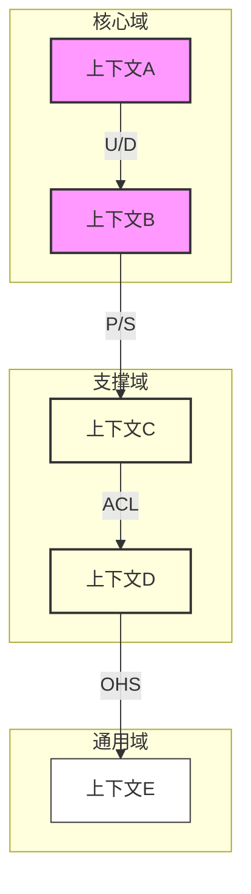

# 上下文映射关系图设计文档

## 文档信息

| 信息 | 说明 |
|------|------|
| 文档编号 | CM-001 |
| 版本号 | V1.0 |
| 状态 | Draft/In Review/Approved |
| 作者 | |
| 评审人 | |
| 创建日期 | YYYY-MM-DD |
| 最后更新日期 | YYYY-MM-DD |

## 变更历史

| 版本 | 修改日期 | 修改人 | 修改描述 |
|------|----------|--------|----------|
| V1.0 | YYYY-MM-DD | | 初始版本 |

## 1. 概述

### 1.1 文档目的
> 本文档旨在清晰定义和展示系统中各限界上下文之间的关系和协作模式。通过上下文映射图，帮助团队理解系统的整体结构，明确上下文间的依赖关系和集成方式，为系统设计和实现提供指导。

### 1.2 适用范围
- 系统整体架构设计
- 微服务划分依据
- 团队协作边界定义
- 集成接口设计

### 1.3 相关文档
- 领域划分文档
- 限界上下文定义
- 统一语言词汇表
- 系统架构设计文档

## 2. 上下文关系总览

### 2.1 上下文映射图

> 上下文映射图展示了系统中所有限界上下文及其之间的关系。图中使用不同的图形和连线样式来表示不同类型的关系和协作模式。这种可视化表示有助于团队理解系统的整体结构和各部分之间的交互方式。

### 2.2 关系类型说明
| 关系类型 | 符号 | 描述 | 使用场景 |
|----------|------|------|----------|
| Upstream/Downstream (U/D) | U/D | 上游团队优先级高于下游团队 | 核心域与支撑域的关系 |
| Partnership (P) | P | 双方团队共同协作 | 紧密协作的上下文 |
| Shared Kernel (SK) | SK | 共享内核 | 共享模型的上下文 |
| Customer/Supplier (C/S) | C/S | 客户/供应商关系 | 服务提供与消费 |
| Conformist (CF) | CF | 遵奉者模式 | 被动接受上游模型 |
| Anti-corruption Layer (ACL) | ACL | 防腐层 | 模型转换隔离 |
| Open Host Service (OHS) | OHS | 开放主机服务 | 通用服务提供 |
| Published Language (PL) | PL | 发布语言 | 标准数据格式 |

## 3. 上下文协作关系详述

### 3.1 核心域上下文关系
| 源上下文 | 目标上下文 | 关系类型 | 协作方式 | 数据流动 | 依赖程度 |
|----------|------------|----------|-----------|-----------|-----------|
| [上下文A] | [上下文B] | U/D | REST API | 单向同步 | 强依赖 |
| [上下文B] | [上下文C] | P/S | 消息队列 | 异步通知 | 弱依赖 |

### 3.2 支撑域上下文关系
| 源上下文 | 目标上下文 | 关系类型 | 协作方式 | 数据流动 | 依赖程度 |
|----------|------------|----------|-----------|-----------|-----------|
| [上下文C] | [上下文D] | ACL | RPC | 双向同步 | 中等依赖 |
| [上下文D] | [上下文E] | OHS | REST API | 单向查询 | 弱依赖 |

## 4. 集成模式设计

### 4.1 同步集成模式
| 上下文对 | 集成方式 | 接口类型 | 超时策略 | 重试策略 | 降级方案 |
|----------|----------|----------|-----------|-----------|-----------|
| [A-B] | REST | POST/GET | 3s | 3次 | 缓存 |
| [C-D] | RPC | 双向流 | 5s | 2次 | 降级服务 |

### 4.2 异步集成模式
| 上下文对 | 消息类型 | 队列设计 | 顺序保证 | 错误处理 | 补偿策略 |
|----------|----------|-----------|-----------|-----------|-----------|
| [B-C] | 领域事件 | 专用队列 | 是 | 死信队列 | 手动补偿 |
| [D-E] | 通知消息 | 共享队列 | 否 | 忽略 | 无 |

## 5. 依赖关系管理

### 5.1 团队协作模式
| 上下文对 | 团队关系 | 沟通机制 | 变更流程 | 发布协调 |
|----------|----------|-----------|-----------|-----------|
| [A-B] | 强依赖 | 日常对接 | 评审 | 同步发布 |
| [C-D] | 弱依赖 | 定期同步 | 通知 | 独立发布 |

### 5.2 契约设计
| 上下文对 | 契约类型 | 版本策略 | 兼容性要求 | 测试策略 |
|----------|----------|-----------|-------------|-----------|
| [A-B] | API契约 | 语义化版本 | 向后兼容 | 契约测试 |
| [C-D] | 事件契约 | 双向协议 | 严格兼容 | 集成测试 |

## 6. 实现指南

### 6.1 技术实现建议
- 通信协议选择
- 序列化方案
- 安全认证
- 监控方案

### 6.2 最佳实践
- 接口设计规范
- 错误处理原则
- 性能优化建议
- 测试策略

## 7. 附录

### 7.1 关键设计决策
| 决策点 | 方案选择 | 决策理由 | 替代方案 |
|--------|----------|----------|-----------|
| [决策1] | | | |
| [决策2] | | | |

### 7.2 风险评估
| 风险点 | 影响程度 | 应对措施 | 责任人 |
|--------|----------|-----------|--------|
| [风险1] | | | |
| [风险2] | | | |

### 7.3 评审记录
| 评审日期 | 评审人 | 评审结果 | 主要反馈 |
|----------|--------|----------|----------|
| YYYY-MM-DD | | | |