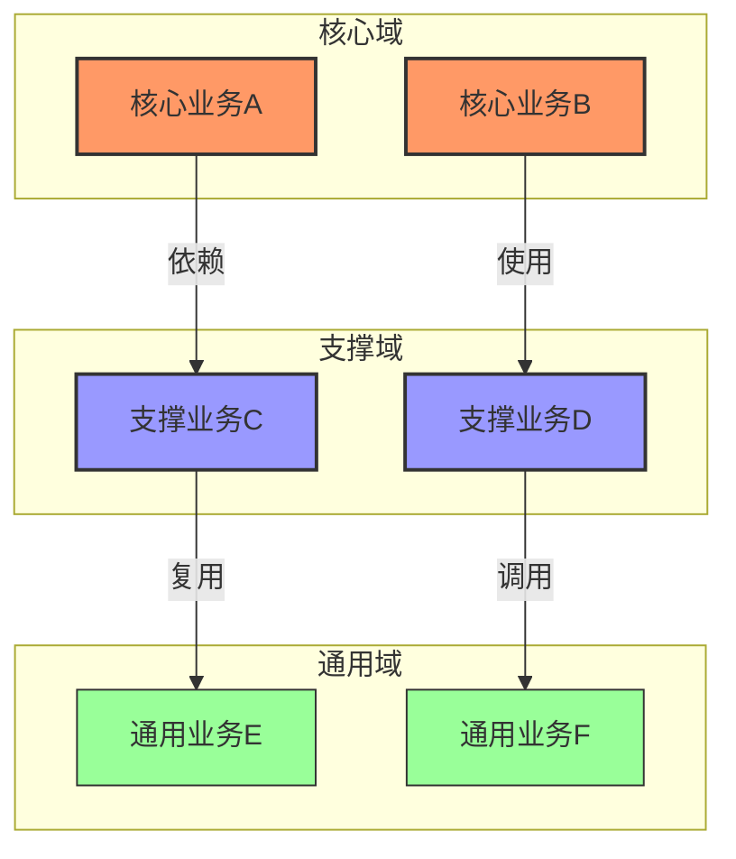

# 领域划分设计文档

## 文档信息

| 信息 | 说明 |
|------|------|
| 文档编号 | DD-001 |
| 版本号 | V1.0 |
| 状态 | Draft/In Review/Approved |
| 作者 | |
| 评审人 | |
| 创建日期 | YYYY-MM-DD |
| 最后更新日期 | YYYY-MM-DD |

## 变更历史

| 版本 | 修改日期 | 修改人 | 修改描述 |
|------|----------|--------|----------|
| V1.0 | YYYY-MM-DD | | 初始版本 |

## 1. 概述

### 1.1 文档目的
> 本文档旨在清晰定义系统的领域划分，明确核心域、支撑域和通用域的范围与职责，为后续详细设计和开发提供指导。通过合理的领域划分，确保业务价值的最大化实现，同时保证系统的可维护性和可扩展性。

### 1.2 领域划分原则
1. 业务价值导向
   - 基于业务战略重要性
   - 考虑竞争优势贡献
   - 评估创新潜力

2. 复杂度管理
   - 技术复杂度评估
   - 业务复杂度分析
   - 维护成本考量

3. 演进可能性
   - 变更频率预测
   - 扩展需求评估
   - 重用机会分析

### 1.3 相关文档
- 业务需求文档
- 系统架构设计
- 技术选型报告
- 团队能力评估

## 2. 领域全景图

### 2.1 领域关系图

> 领域全景图展示了系统中各个领域的分布和关系。通过不同的颜色和连线，清晰地表达了各个领域的重要程度和依赖关系。这种可视化表示有助于团队理解系统的整体结构和业务重点。

## 3. 核心域定义

### 3.1 核心域清单
| 核心域 | 业务价值 | 竞争优势 | 创新程度 | 技术复杂度 | 变更频率 |
|--------|----------|-----------|-----------|------------|-----------|
| [核心域1] | 高 | 差异化 | 高 | 中 | 频繁 |
| [核心域2] | 高 | 领先 | 中 | 高 | 中等 |

### 3.2 核心域详述

#### 3.2.1 [核心域1]名称
- 业务范围
  * 核心业务流程
  * 关键业务规则
  * 核心数据资产

- 战略意义
  * 业务价值点
  * 竞争优势分析
  * 创新机会

- 技术要求
  * 性能指标
  * 可用性要求
  * 扩展性需求

#### 3.2.2 [核心域2]名称
...

## 4. 支撑域定义

### 4.1 支撑域清单
| 支撑域 | 支撑对象 | 业务重要性 | 技术复杂度 | 复用可能 | 维护频率 |
|--------|----------|------------|------------|-----------|-----------|
| [支撑域1] | 核心域1 | 中 | 中 | 低 | 中等 |
| [支撑域2] | 核心域2 | 高 | 低 | 高 | 低 |

### 4.2 支撑域详述

#### 4.2.1 [支撑域1]名称
- 支撑内容
  * 业务功能
  * 数据服务
  * 流程支持

- 依赖关系
  * 上游依赖
  * 下游服务
  * 集成点

- 技术特征
  * 实现复杂度
  * 维护要求
  * 扩展性考虑

#### 4.2.2 [支撑域2]名称
...

## 5. 通用域定义

### 5.1 通用域清单
| 通用域 | 服务范围 | 标准化程度 | 复用价值 | 维护成本 | 更新周期 |
|--------|----------|------------|-----------|-----------|-----------|
| [通用域1] | 全局 | 高 | 高 | 低 | 长期 |
| [通用域2] | 部分 | 中 | 中 | 中 | 中期 |

### 5.2 通用域详述

#### 5.2.1 [通用域1]名称
- 功能范围
  * 通用功能
  * 共享服务
  * 基础设施

- 标准规范
  * 接口标准
  * 数据规范
  * 集成协议

- 复用策略
  * 服务形式
  * 集成方式
  * 版本管理

#### 5.2.2 [通用域2]名称
...

## 6. 领域间关系

### 6.1 依赖关系矩阵
| 领域 | 核心域1 | 核心域2 | 支撑域1 | 支撑域2 | 通用域1 | 通用域2 |
|------|---------|---------|---------|---------|---------|---------|
| 核心域1 | - | 弱依赖 | 强依赖 | 无 | 弱依赖 | 无 |
| 核心域2 | 无 | - | 无 | 强依赖 | 弱依赖 | 弱依赖 |
| ... | | | | | | |

### 6.2 交互设计
| 源领域 | 目标领域 | 交互类型 | 交互频率 | 数据量 | 一致性要求 |
|--------|----------|-----------|-----------|---------|------------|
| [领域1] | [领域2] | 同步 | 高 | 大 | 强一致性 |
| [领域2] | [领域3] | 异步 | 低 | 小 | 最终一致性 |

## 7. 演进策略

### 7.1 领域优化方向
| 领域 | 当前痛点 | 优化目标 | 演进路径 | 时间规划 |
|------|----------|----------|----------|----------|
| [领域1] | | | | |
| [领域2] | | | | |

### 7.2 重构建议
| 领域 | 重构动机 | 预期收益 | 风险评估 | 实施建议 |
|------|----------|-----------|-----------|----------|
| [领域1] | | | | |
| [领域2] | | | | |

## 8. 附录

### 8.1 评估方法
- 业务价值评估标准
- 技术复杂度评估标准
- 维护成本评估标准

### 8.2 决策记录
| 决策点 | 方案选择 | 决策理由 | 否决方案 |
|--------|----------|----------|-----------|
| [决策1] | | | |
| [决策2] | | | |

### 8.3 评审记录
| 评审日期 | 评审人 | 评审结果 | 主要反馈 |
|----------|--------|----------|----------|
| YYYY-MM-DD | | | | 