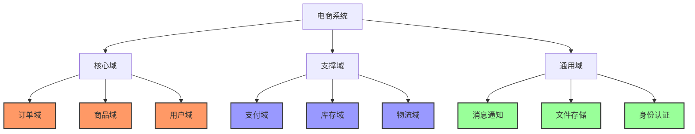
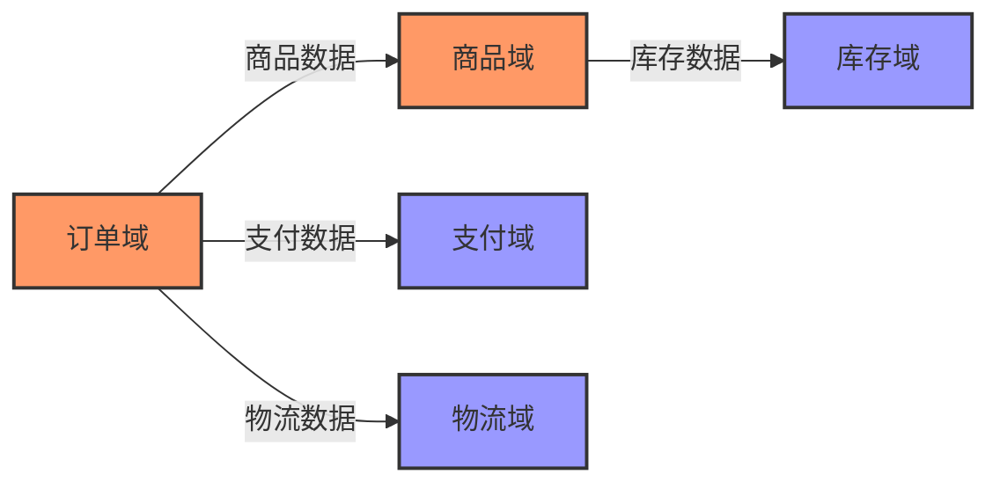

# 领域划分文档

## 文档信息
| 信息 | 内容 |
|---|---|
| 文档编号 | DD-{项目代号}-001 |
| 版本 | v1.0.0 |
| 状态 | Draft/In Review/Approved |
| 作者 | {作者} |
| 审核人 | {审核人} |
| 最后更新时间 | YYYY-MM-DD |

## 变更历史
| 版本 | 修改日期 | 修改人 | 修改描述 |
|---|---|---|---|
| v1.0.0 | YYYY-MM-DD | {作者} | 初始版本 |

## 1. 概述

### 1.1 文档目的
#### 说明
本文档旨在清晰地定义系统的领域划分，包括核心域、支撑域和通用域的识别与界定。通过合理的领域划分，指导后续的架构设计和资源分配，确保核心业务得到足够的关注和投入。

#### 关键要素
- 业务领域识别
- 领域价值评估
- 领域边界定义
- 领域关系梳理

### 1.2 参考文档
```markdown
1. 业务需求文档
   - 业务目标说明书
   - 业务流程图
   - 组织架构图

2. 技术文档
   - 系统架构设计
   - 技术选型报告
   - 遗留系统文档

3. 行业标准
   - 行业规范文档
   - 标准接口定义
   - 合规要求说明
```

## 2. 领域划分总览

### 2.1 领域划分图


### 2.2 领域关系概述
```markdown
1. 核心域依赖关系
   - 订单域 -> 商品域：商品信息查询
   - 订单域 -> 用户域：用户信息验证
   - 商品域 -> 用户域：卖家信息关联

2. 支撑域依赖关系
   - 订单域 -> 支付域：订单支付处理
   - 订单域 -> 库存域：库存锁定/释放
   - 订单域 -> 物流域：发货信息同步

3. 通用域依赖关系
   - 全局依赖：身份认证
   - 异步通知：消息通知
   - 文件服务：文件存储
```

## 3. 核心域

### 3.1 订单域
#### 说明
订单域是电商系统的核心业务域，负责整个交易流程的管理和协调。

#### 详细设计
```markdown
1. 业务范围
   - 订单生命周期管理
   - 订单定价计算
   - 订单分配处理
   - 订单履约协调

2. 核心功能
   - 订单创建和修改
   - 订单支付管理
   - 订单状态流转
   - 订单分析统计

3. 关键实体
   - 订单聚合根
   - 订单项实体
   - 定价值对象
   - 订单状态枚举

4. 业务规则
   - 订单创建规则
   - 定价计算规则
   - 状态转换规则
   - 订单拆分规则

5. 技术要求
   - 高并发处理
   - 数据一致性
   - 业务可扩展性
   - 性能优化需求
```

### 3.2 商品域
#### 说明
商品域管理所有商品相关的核心业务逻辑，是电商平台的基础域。

#### 详细设计
```markdown
1. 业务范围
   - 商品信息管理
   - 商品类目管理
   - 商品定价管理
   - 商品上下架管理

2. 核心功能
   - 商品发布
   - 商品搜索
   - 商品推荐
   - 价格管理

3. 关键实体
   - 商品聚合根
   - SKU实体
   - 类目实体
   - 价格值对象

4. 业务规则
   - 商品审核规则
   - 价格变更规则
   - 上下架规则
   - 库存联动规则

5. 技术要求
   - 搜索性能
   - 数据一致性
   - 缓存策略
   - 存储扩展性
```

## 4. 支撑域

### 4.1 支付域
#### 说明
支付域提供所有支付相关的功能支持，确保交易的顺利完成。

#### 详细设计
```markdown
1. 业务范围
   - 支付处理
   - 退款管理
   - 账户管理
   - 对账清算

2. 主要功能
   - 支付渠道管理
   - 支付流程处理
   - 退款流程处理
   - 支付安全控制

3. 关键实体
   - 支付单
   - 退款单
   - 支付账户
   - 支付渠道

4. 技术复杂度
   - 支付安全
   - 分布式事务
   - 数据一致性
   - 性能要求
```

## 5. 通用域

### 5.1 消息通知域
#### 说明
提供统一的消息通知服务，支持多渠道、多场景的消息发送需求。

#### 详细设计
```markdown
1. 业务范围
   - 消息模板管理
   - 消息发送处理
   - 发送状态跟踪
   - 消息统计分析

2. 通用功能
   - 多渠道支持
   - 消息定时发送
   - 消息优先级
   - 发送状态查询

3. 标准接口
   - 消息发送接口
   - 状态查询接口
   - 模板管理接口
   - 配置管理接口

4. 复用策略
   - 接口标准化
   - 配置灵活性
   - 扩展便利性
   - 监控通用性
```

## 6. 域间关系

### 6.1 依赖关系
```markdown
1. 同步依赖
   - 订单创建 -> 商品查询
   - 订单支付 -> 支付处理
   - 订单发货 -> 物流创建

2. 异步依赖
   - 订单状态 -> 消息通知
   - 支付完成 -> 订单更新
   - 库存变更 -> 商品更新
```

### 6.2 数据流向


## 7. 决策说明

### 7.1 划分依据
```markdown
1. 业务价值评估
   - 业务重要性
   - 创新程度
   - 竞争优势
   - 收入贡献

2. 技术复杂度
   - 实现难度
   - 维护成本
   - 扩展需求
   - 性能要求

3. 团队因素
   - 团队技能
   - 开发效率
   - 维护能力
   - 响应速度
```

### 7.2 权衡分析
```markdown
1. 核心域划分
   考虑因素：
   - 业务价值
   - 变更频率
   - 创新需求
   - 竞争影响
   
   决策理由：
   - 订单域：直接影响用户体验和交易转化
   - 商品域：平台基础能力，影响用户选择
   - 用户域：用户数据资产，个性化基础

2. 支撑域划分
   考虑因素：
   - 业务支撑
   - 技术成熟度
   - 维护成本
   - 替换可能
   
   决策理由：
   - 支付域：可使用第三方服务但需要定制
   - 物流域：依赖外部系统，需要适配层
```

## 8. 演进策略

### 8.1 演进路线图
```markdown
1. 近期目标（3个月）
   - 完成核心域拆分
   - 实现基础功能
   - 建立域间接口

2. 中期目标（6个月）
   - 支撑域服务化
   - 性能优化
   - 监控完善

3. 远期目标（12个月）
   - 通用域服务化
   - 弹性伸缩
   - 智能化升级
```

## 附录

### A. 需求追踪矩阵
| 业务需求 | 涉及领域 | 优先级 | 复杂度 |
|----------|----------|--------|--------|
| 订单管理 | 订单域 | P0 | 高 |
| 商品管理 | 商品域 | P0 | 中 |
| 支付处理 | 支付域 | P1 | 高 |

### B. 评审记录
| 日期 | 评审人 | 评审结果 | 主要反馈 |
|------|--------|----------|----------|
| 2024-01-20 | 架构组 | 通过 | 建议细化域间接口 |

### C. 参考资料
1. DDD实践指南
2. 业务架构设计
3. 微服务设计模式 