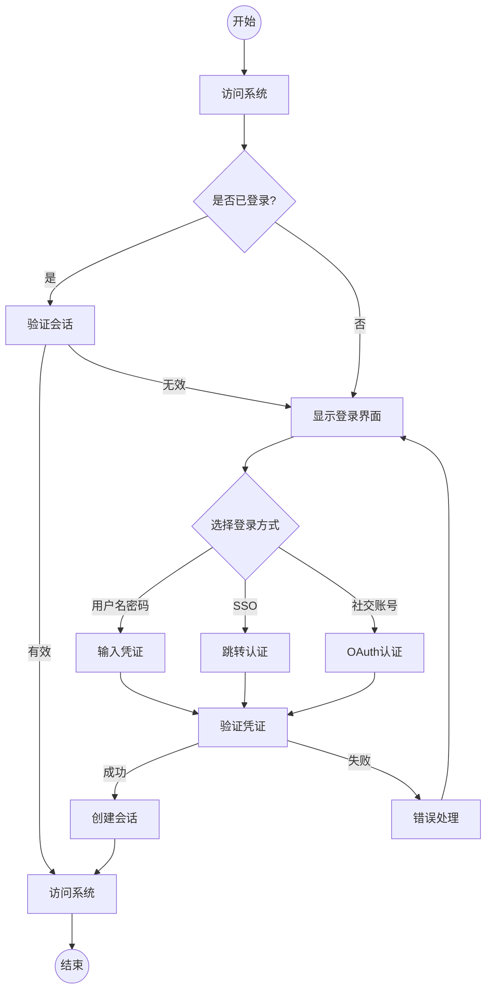
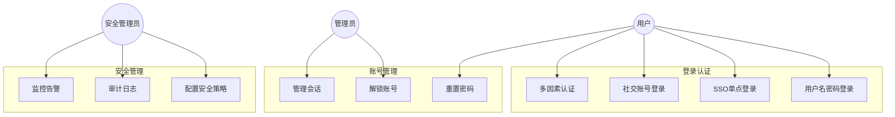

# 业务需求文档 (BRD)
## 文档信息
- 文档版本：1.0
- 最后更新：2024-03-20
- 作者：高级产品经理
- 审核人：待定
- 状态：草稿

## 1. 项目概述
### 1.1 业务背景
Dove是一个面向全球用户的大规模互联网SaaS产品，预计支持2亿用户规模，峰值并发用户数达到8000万。登录系统作为产品的核心公共模块，需要支持全球化访问，并确保工作时间的高峰访问量，同时保证非工作时间30%基础访问量的稳定服务。

### 1.2 业务目标
#### 总体目标
构建安全、高效、可靠的全球化登录系统，支持Dove产品的大规模用户访问需求。

#### 具体目标（SMART原则）
1. 规模性（Specific & Measurable）
   - 支持2亿用户账户管理
   - 支持8000万用户并发登录
   - 登录响应时间99.9%在500ms以内

2. 可用性（Achievable）
   - 工作时间（7:00-19:00）系统可用性99.999%
   - 非工作时间系统可用性99.99%
   - 全球各地区访问延迟<1s

3. 相关性（Relevant）
   - 支持多终端统一登录
   - 实现与现有系统的无缝集成
   - 满足安全合规要求

4. 时效性（Time-bound）
   - 2025年2月10日项目启动
   - 2025年2月28日完成生产部署

#### 业务价值
1. 用户价值
   - 提供统一、便捷的登录体验
   - 确保账户安全和数据保护
   - 支持全球化访问需求

2. 技术价值
   - 建立可扩展的认证基础设施
   - 提供标准化的身份认证服务
   - 支持未来业务快速扩展

3. 运营价值
   - 降低运维复杂度
   - 提高系统可观测性
   - 优化资源利用效率

### 1.3 项目范围
#### 范围内容
1. 认证功能
   - 用户名密码登录
   - 多因素认证（MFA）
   - 单点登录（SSO）
   - 社交账号登录
   - 记住登录状态

2. 安全特性
   - 密码策略管理
   - 登录失败处理
   - 账户锁定机制
   - 异常检测预警
   - 安全审计日志

3. 会话管理
   - 会话创建维护
   - 会话状态同步
   - 超时自动登出
   - 并发登录控制

4. 用户体验
   - 响应式界面设计
   - 多语言支持
   - 错误提示优化
   - 登录状态保持

#### 范围边界
1. 包含范围
   - Web端登录功能
   - 登录API服务
   - 管理员配置界面
   - 监控告警系统

2. 排除范围
   - 用户注册功能
   - 账号注销功能
   - 权限管理系统
   - 计费认证集成

## 2. 业务架构
### 2.1 组织架构
#### 涉及部门
1. 产品部门
   - 产品经理：负责登录功能规划
   - 用户体验设计师：负责登录界面设计

2. 研发部门
   - 架构师：负责系统架构设计
   - 前端开发：负责界面实现
   - 后端开发：负责服务实现
   - 测试工程师：负责质量保证

3. 运维部门
   - 系统运维：负责部署和维护
   - 安全运维：负责安全保障
   - 监控运维：负责系统监控

4. 安全部门
   - 安全架构师：负责安全方案
   - 安全审计员：负责安全审计

#### 角色定义
| 角色 | 职责描述 | 所属部门 | 技能要求 |
|-----|---------|---------|---------|
| 产品负责人 | 整体产品规划和决策 | 产品部门 | 产品管理、沟通协调 |
| 架构负责人 | 技术方案设计和把控 | 研发部门 | 分布式架构、安全设计 |
| 开发负责人 | 研发任务分配和管理 | 研发部门 | 技术管理、问题解决 |
| 运维负责人 | 运维规划和资源协调 | 运维部门 | 系统运维、监控告警 |
| 安全负责人 | 安全策略制定和执行 | 安全部门 | 安全架构、风险控制 |

#### 职责矩阵
| 职责/角色 | 产品负责人 | 架构负责人 | 开发负责人 | 运维负责人 | 安全负责人 |
|----------|-----------|-----------|-----------|-----------|-----------|
| 需求分析 | R/A | C | C | C | C |
| 方案设计 | A | R | C | C | C |
| 技术实现 | I | A | R | C | C |
| 安全保障 | I | C | C | C | R/A |
| 运维保障 | I | C | C | R/A | C |

### 2.2 业务域划分
#### 核心业务域
1. 认证域
   - 限界上下文：用户认证
   - 核心实体：用户凭证、认证令牌
   - 领域服务：认证服务、会话服务

2. 安全域
   - 限界上下文：安全控制
   - 核心实体：安全策略、审计日志
   - 领域服务：策略服务、审计服务

#### 支撑业务域
1. 配置域
   - 限界上下文：系统配置
   - 核心实体：配置项、参数定义
   - 领域服务：配置服务、缓存服务

2. 监控域
   - 限界上下文：系统监控
   - 核心实体：监控指标、告警规则
   - 领域服务：监控服务、告警服务

#### 通用业务域
1. 日志域
   - 限界上下文：日志管理
   - 核心实体：操作日志、系统日志
   - 领域服务：日志服务、分析服务

### 2.3 业务约束
#### 法规约束
1. 数据保护
   - GDPR合规要求
   - 数据本地化要求
   - 用户隐私保护

2. 安全合规
   - 等级保护要求
   - 密码管理规范
   - 访问控制标准

#### 技术约束
1. 架构要求
   - 采用微服务架构
   - 使用Spring Cloud技术栈
   - 前后端分离设计

2. 技术选型
   - 开源技术优先
   - 社区活跃度要求
   - 商用许可要求

#### 运维约束
1. 部署要求
   - 容器化部署
   - 多区域部署
   - 灾备要求

2. 监控要求
   - 全链路监控
   - 实时告警
   - 性能分析

## 3. 业务流程（核心章节一）
### 3.1 流程概览
#### 3.1.1 流程全景图

#### 3.1.2 核心流程清单
1. 用户名密码登录流程
2. SSO单点登录流程
3. 社交账号登录流程
4. 多因素认证流程
5. 密码重置流程
6. 账号锁定解锁流程
7. 会话管理流程

### 3.2 详细流程描述
#### 3.2.1 用户名密码登录流程
- 流程目标：验证用户身份并授权访问系统
- 触发条件：用户访问系统且未登录
- 前置条件：用户已注册账号

- 流程步骤：
  1. 用户访问系统
  2. 系统检查登录状态
  3. 显示登录界面
  4. 用户输入用户名和密码
  5. 系统验证凭证
  6. 检查账号状态
  7. 创建用户会话
  8. 记录登录日志
  9. 重定向到目标页面

- 后置条件：
  1. 用户成功登录系统
  2. 会话信息已创建
  3. 审计日志已记录

- 业务规则：
  1. 密码规则
     - 最小长度8位
     - 必须包含大小写字母和数字
     - 支持特殊字符
  
  2. 登录限制
     - 连续失败5次锁定账号
     - 锁定时间30分钟
     - 支持手动解锁

  3. 会话规则
     - 会话超时时间30分钟
     - 支持同时在线数量配置
     - 支持强制下线

- 异常处理：
  1. 密码错误
     - 显示错误提示
     - 记录失败次数
     - 触发锁定机制
  
  2. 账号锁定
     - 显示锁定提示
     - 提供解锁方式
     - 发送通知提醒

  3. 系统异常
     - 显示友好提示
     - 记录错误日志
     - 提供重试选项

#### 3.2.2 SSO单点登录流程
- 流程目标：实现系统间的统一认证
- 触发条件：用户通过SSO方式登录
- 前置条件：已配置SSO集成

- 流程步骤：
  1. 用户选择SSO登录
  2. 重定向到SSO服务
  3. 用户完成认证
  4. 接收认证结果
  5. 验证Token有效性
  6. 创建本地会话
  7. 同步用户信息
  8. 记录登录日志
  9. 授权访问系统

- 后置条件：
  1. 用户完成SSO认证
  2. 本地会话已创建
  3. 用户信息已同步

- 业务规则：
  1. Token规则
     - JWT格式
     - 包含必要声明
     - 设置有效期限
  
  2. 同步规则
     - 定义同步属性
     - 处理冲突策略
     - 设置更新策略

- 异常处理：
  1. Token无效
     - 重新认证
     - 记录错误
     - 提示用户
  
  2. 同步失败
     - 降级处理
     - 记录日志
     - 后台重试

### 3.3 角色与职责
#### 3.3.1 角色定义
| 角色 | 职责描述 | 所属部门 | 技能要求 |
|-----|---------|---------|---------|
| 普通用户 | 系统登录和使用 | 业务部门 | 基本操作技能 |
| 系统管理员 | 配置和管理登录功能 | IT部门 | 系统运维技能 |
| 安全管理员 | 管理安全策略和审计 | 安全部门 | 安全管理技能 |
| 运维人员 | 维护和监控系统 | 运维部门 | 系统维护技能 |

#### 3.3.2 RACI矩阵
| 活动/角色 | 普通用户 | 系统管理员 | 安全管理员 | 运维人员 |
|----------|---------|------------|------------|---------|
| 系统登录 | R | I | I | I |
| 密码重置 | R | A | C | I |
| 账号解锁 | I | R | A | I |
| 策略配置 | I | C | R/A | I |
| 日志审计 | I | C | R | A |
| 系统维护 | I | C | C | R/A |

## 4. 业务用例（核心章节二）
### 4.1 用例总览
#### 4.1.1 用例图

#### 4.1.2 参与者清单
1. 主要参与者
   - 普通用户：系统使用者
   - 系统管理员：系统维护者
   - 安全管理员：安全管理者

2. 次要参与者
   - 运维人员：系统运维者
   - 审计人员：日志审计者
   - 支持人员：用户支持者

3. 外部系统
   - SSO系统：单点登录服务
   - OAuth服务：社交登录服务
   - 监控系统：系统监控服务

### 4.2 详细用例描述
#### 4.2.1 用户名密码登录
- 用例编号：UC001
- 优先级：高
- 参与者：普通用户
- 前置条件：
  1. 用户已注册账号
  2. 系统正常运行
  3. 网络连接正常

- 后置条件：
  1. 用户成功登录
  2. 创建会话信息
  3. 记录登录日志

- 基本流程：
  1. 用户访问登录页面
  2. 系统显示登录界面
  3. 用户输入用户名和密码
  4. 用户点击登录按钮
  5. 系统验证用户凭证
  6. 系统创建用户会话
  7. 系统重定向到首页

- 替代流程：
  A1. 记住密码
  1. 用户勾选"记住密码"
  2. 系统保存登录状态
  3. 下次访问自动登录

  A2. 忘记密码
  1. 用户点击"忘记密码"
  2. 系统显示密码重置界面
  3. 用户完成密码重置

- 异常流程：
  E1. 密码错误
  1. 系统显示错误提示
  2. 记录失败次数
  3. 返回登录界面

  E2. 账号锁定
  1. 系统显示锁定提示
  2. 提供解锁方式
  3. 记录锁定事件

- 业务规则：
  1. BR001：密码复杂度要求
  2. BR002：登录失败处理
  3. BR003：会话管理规则

#### 4.2.2 SSO单点登录
- 用例编号：UC002
- 优先级：高
- 参与者：普通用户、SSO系统
- 前置条件：
  1. SSO系统可用
  2. 用户已有SSO账号
  3. 系统集成配置完成

- 后置条件：
  1. 完成SSO认证
  2. 创建本地会话
  3. 同步用户信息

- 基本流程：
  1. 用户选择SSO登录
  2. 系统重定向到SSO
  3. 用户完成SSO认证
  4. SSO返回Token
  5. 系统验证Token
  6. 创建本地会话
  7. 重定向到首页

- 替代流程：
  A1. 首次SSO登录
  1. 系统创建本地账号
  2. 关联SSO身份
  3. 同步用户信息

- 异常流程：
  E1. SSO服务不可用
  1. 显示错误提示
  2. 提供其他登录方式
  3. 记录错误日志

  E2. Token验证失败
  1. 重新发起认证
  2. 记录失败原因
  3. 通知用户重试

- 业务规则：
  1. BR004：SSO集成规范
  2. BR005：身份映射规则
  3. BR006：数据同步策略

### 4.3 用例关系
#### 包含关系
1. 用户认证包含：
   - 凭证验证
   - 状态检查
   - 会话创建

2. 安全管理包含：
   - 策略配置
   - 日志记录
   - 异常处理

#### 扩展关系
1. 基础登录扩展：
   - 多因素认证
   - 记住密码
   - 自动登录

2. 账号管理扩展：
   - 密码重置
   - 账号解锁
   - 会话管理

#### 泛化关系
1. 认证方式泛化：
   - 用户名密码认证
   - SSO认证
   - 社交账号认证

2. 管理功能泛化：
   - 用户管理
   - 策略管理
   - 日志管理

## 5. 用户故事（核心章节三）
### 5.1 Epic故事地图
#### 5.1.1 核心Epic
1. 基础认证
   - Epic名称：用户认证基础功能
   - 业务价值：确保系统安全访问
   - 优先级：P0
   - 关联故事：
     * US001：用户名密码登录
     * US002：记住登录状态
     * US003：自动登录功能

2. 高级认证
   - Epic名称：企业级认证功能
   - 业务价值：提供企业级安全保障
   - 优先级：P1
   - 关联故事：
     * US004：SSO单点登录
     * US005：多因素认证
     * US006：社交账号登录

#### 5.1.2 支撑Epic
1. 安全管理
   - Epic名称：登录安全管理
   - 业务价值：保障账号安全
   - 优先级：P1
   - 关联故事：
     * US007：密码策略管理
     * US008：登录异常处理
     * US009：安全审计日志

2. 用户体验
   - Epic名称：登录体验优化
   - 业务价值：提升用户满意度
   - 优先级：P2
   - 关联故事：
     * US010：快捷登录
     * US011：登录提示优化
     * US012：个性化设置

### 5.2 用户故事列表
#### 5.2.1 用户名密码登录
- 编号：US001
- 作为：系统用户
- 我想要：使用用户名和密码登录系统
- 以便于：安全地访问系统功能
- 验收标准：
  1. 支持用户名和密码输入
  2. 验证输入有效性
  3. 显示适当的错误提示
  4. 成功后跳转到首页
  5. 记录登录操作日志
- 优先级：P0
- 估算：3点
- 依赖关系：无

#### 5.2.2 SSO单点登录
- 编号：US004
- 作为：企业用户
- 我想要：使用企业SSO账号登录
- 以便于：统一管理系统访问
- 验收标准：
  1. 支持SSO登录选项
  2. 正确跳转到SSO服务
  3. 验证SSO令牌有效性
  4. 同步用户信息
  5. 记录SSO登录日志
- 优先级：P1
- 估算：5点
- 依赖关系：US001

#### 5.2.3 多因素认证
- 编号：US005
- 作为：安全管理员
- 我想要：启用多因素认证
- 以便于：提升账号安全性
- 验收标准：
  1. 配置MFA策略
  2. 支持多种认证方式
  3. 验证第二因素
  4. 提供跳过选项
  5. 记录认证过程
- 优先级：P1
- 估算：8点
- 依赖关系：US001

### 5.3 故事优先级分类
#### Must Have（必须有）
1. 基础登录功能
   - 用户名密码登录
   - 登录状态管理
   - 基本安全策略

2. 核心安全特性
   - 密码规则验证
   - 账号锁定机制
   - 审计日志记录

#### Should Have（应该有）
1. 高级认证功能
   - SSO单点登录
   - 多因素认证
   - 记住登录状态

2. 安全管理功能
   - 安全策略配置
   - 异常检测告警
   - 会话管理功能

#### Could Have（可以有）
1. 扩展登录功能
   - 社交账号登录
   - 生物识别登录
   - 扫码登录功能

2. 体验优化功能
   - 个性化设置
   - 快捷登录
   - 智能提示

#### Won't Have（暂不考虑）
1. 高级特性
   - 区块链认证
   - AI行为分析
   - 硬件令牌支持

2. 其他功能
   - 委托授权登录
   - 临时账号管理
   - 登录积分系统

## 6. 非功能需求
### 6.1 性能需求
#### 响应时间
1. 登录操作
   - 普通登录响应时间：≤500ms（95%请求）
   - SSO登录响应时间：≤800ms（95%请求）
   - 多因素认证响应时间：≤1s（95%请求）

2. 会话管理
   - 会话创建时间：≤100ms
   - 会话验证时间：≤50ms
   - 会话注销时间：≤100ms

#### 并发用户
1. 用户规模
   - 总用户数：2亿
   - 日活用户：5000万
   - 峰值并发：8000万

2. 系统容量
   - 每秒登录请求：10万QPS
   - 每秒会话查询：50万QPS
   - 每秒Token验证：100万QPS

#### 吞吐量
1. 业务指标
   - 日登录次数：1亿次
   - 日志记录量：10亿条
   - 数据增长率：20%/年

2. 系统指标
   - CPU利用率：≤70%
   - 内存利用率：≤80%
   - 存储使用率：≤75%

### 6.2 安全需求
#### 访问控制
1. 认证要求
   - 支持多因素认证
   - 密码复杂度策略
   - 登录失败处理

2. 授权管理
   - 基于角色的访问控制
   - 细粒度权限控制
   - 动态权限调整

3. 会话安全
   - 会话超时控制
   - 并发登录控制
   - 会话劫持防护

#### 数据安全
1. 传输安全
   - TLS 1.3加密
   - 证书管理
   - 安全通信协议

2. 存储安全
   - 密码加密存储
   - 敏感数据加密
   - 数据备份策略

3. 访问安全
   - IP白名单控制
   - 地理位置限制
   - 设备指纹校验

#### 审计要求
1. 操作审计
   - 登录操作记录
   - 异常行为记录
   - 管理操作记录

2. 安全审计
   - 安全事件记录
   - 风险评估报告
   - 合规性检查

3. 日志管理
   - 日志分级存储
   - 日志查询分析
   - 日志备份恢复

### 6.3 可用性需求
#### 操作便利性
1. 界面要求
   - 响应式设计
   - 多语言支持
   - 适配主流设备

2. 操作要求
   - 操作步骤≤3步
   - 错误提示准确
   - 帮助信息完整

3. 可访问性
   - 支持快捷键
   - 支持屏幕阅读
   - 符合WCAG标准

#### 用户体验
1. 交互设计
   - 界面简洁清晰
   - 操作反馈及时
   - 引导提示友好

2. 异常处理
   - 友好的错误提示
   - 提供问题解决建议
   - 支持故障自助恢复

3. 个性化支持
   - 记住用户偏好
   - 自定义登录选项
   - 个性化提示信息

#### 培训需求
1. 用户培训
   - 在线帮助文档
   - 操作引导视频
   - 常见问题解答

2. 管理员培训
   - 配置管理手册
   - 运维操作指南
   - 故障处理手册

3. 支持服务
   - 7x24技术支持
   - 在线客服服务
   - 问题跟踪系统

## 7. 实施要求
### 7.1 实施策略
#### 实施方式
1. 开发模式
   - 采用敏捷开发方法
   - 双周迭代交付
   - CI/CD自动化部署

2. 团队组织
   - 跨职能敏捷团队
   - 前后端分离开发
   - DevOps持续交付

3. 质量保证
   - 自动化测试
   - 代码审查
   - 安全扫描

#### 实施阶段
1. 准备阶段（2025.2.10-2.13）
   - 需求确认
   - 架构设计
   - 环境准备

2. 开发阶段（2025.2.14-2.23）
   - 基础功能开发
   - 安全特性实现
   - 集成测试

3. 验证阶段（2025.2.24-2.27）
   - 系统测试
   - 性能测试
   - 安全测试

4. 部署阶段（2025.2.28）
   - 生产环境部署
   - 系统切换
   - 运维交接

#### 实施风险
1. 技术风险
   - 性能瓶颈
   - 安全漏洞
   - 集成问题

2. 进度风险
   - 需求变更
   - 资源不足
   - 依赖延期

3. 运维风险
   - 部署失败
   - 数据丢失
   - 服务中断

### 7.2 过渡方案
#### 数据迁移
1. 迁移范围
   - 用户数据
   - 配置数据
   - 日志数据

2. 迁移策略
   - 增量迁移
   - 实时同步
   - 回滚机制

3. 数据验证
   - 完整性检查
   - 一致性验证
   - 性能测试

#### 业务过渡
1. 系统切换
   - 灰度发布
   - 流量切换
   - 应急回滚

2. 运维交接
   - 监控交接
   - 告警配置
   - 运维文档

3. 应急预案
   - 故障处理
   - 降级方案
   - 回滚方案

#### 人员培训
1. 培训计划
   - 用户培训
   - 管理员培训
   - 运维培训

2. 培训方式
   - 线上培训
   - 实操演练
   - 视频教程

3. 培训评估
   - 理论考核
   - 实操考核
   - 反馈收集

### 7.3 验收标准
#### 业务验收标准
1. 功能验收
   - 所有用例通过
   - 无严重缺陷
   - 符合业务需求

2. 性能验收
   - 满足性能指标
   - 稳定性达标
   - 资源利用合理

3. 体验验收
   - 操作流畅
   - 界面友好
   - 提示准确

#### 技术验收标准
1. 代码质量
   - 代码规范
   - 测试覆盖
   - 安全合规

2. 系统监控
   - 监控覆盖
   - 告警有效
   - 日志完整

3. 文档交付
   - 设计文档
   - 部署文档
   - 运维手册

#### 运维验收标准
1. 部署要求
   - 自动化部署
   - 环境隔离
   - 配置管理

2. 运维要求
   - 监控告警
   - 日志管理
   - 备份恢复

3. 安全要求
   - 访问控制
   - 数据加密
   - 审计跟踪

## 8. 项目约束
### 8.1 时间约束
#### 关键里程碑
1. 项目启动：2025.2.10
   - 需求评审完成
   - 团队组建完成
   - 环境准备就绪

2. 开发完成：2025.2.23
   - 核心功能实现
   - 集成测试通过
   - 文档编写完成

3. 系统上线：2025.2.28
   - 生产环境部署
   - 系统切换完成
   - 运维交接完成

#### 时间节点
1. 第一周（2.10-2.16）
   - 2.10：项目启动
   - 2.11-2.13：需求分析与设计
   - 2.14-2.16：基础功能开发

2. 第二周（2.17-2.23）
   - 2.17-2.19：高级功能开发
   - 2.20-2.21：集成测试
   - 2.22-2.23：系统测试

3. 第三周（2.24-2.28）
   - 2.24-2.26：验收测试
   - 2.27：预发布验证
   - 2.28：正式上线

### 8.2 资源约束
#### 人力资源
1. 开发团队
   - 前端开发：2人
   - 后端开发：3人
   - 测试工程师：2人
   - 运维工程师：1人

2. 管理团队
   - 项目经理：1人
   - 产品经理：1人
   - 架构师：1人
   - 技术经理：1人

3. 支持团队
   - UI设计师：1人
   - 安全专家：1人
   - 运维专家：1人

#### 技术资源
1. 开发环境
   - 开发服务器：4台
   - 测试服务器：2台
   - CI/CD环境：1套

2. 测试资源
   - 性能测试环境：1套
   - 自动化测试工具：1套
   - 安全测试工具：1套

3. 运维资源
   - 监控系统：1套
   - 日志系统：1套
   - 备份系统：1套

#### 设备资源
1. 硬件资源
   - 开发用机：12台
   - 测试设备：6台
   - 网络设备：2套

2. 软件资源
   - 开发工具：授权
   - 测试工具：授权
   - 协作工具：授权

### 8.3 预算约束
#### 预算限制
1. 人力成本
   - 开发人员：预算XX
   - 管理人员：预算XX
   - 支持人员：预算XX

2. 资源成本
   - 硬件采购：预算XX
   - 软件授权：预算XX
   - 云服务费：预算XX

3. 其他成本
   - 培训费用：预算XX
   - 外部服务：预算XX
   - 应急预备：预算XX

#### 成本控制
1. 控制措施
   - 预算跟踪
   - 成本核算
   - 支出审批

2. 优化策略
   - 资源复用
   - 开源方案
   - 成本优化

## 9. 附录
### 9.1 术语表
| 术语 | 定义 | 来源 |
|-----|------|-----|
| SSO | 单点登录，实现一次登录，访问所有相关系统的认证方式 | 技术规范 |
| MFA | 多因素认证，通过两个或以上的认证因素实现身份验证 | 安全标准 |
| RBAC | 基于角色的访问控制，通过角色进行权限管理的模型 | 设计模式 |
| JWT | JSON Web Token，一种开放标准的令牌格式 | 技术标准 |
| OAuth | 开放授权协议，用于授权第三方应用访问用户资源 | 技术规范 |

### 9.2 参考文档
1. 技术标准
   - 《Spring Cloud微服务架构规范》
   - 《前后端分离开发规范》
   - 《安全开发生命周期规范》

2. 设计规范
   - 《统一身份认证系统设计指南》
   - 《用户体验设计规范》
   - 《接口设计规范》

3. 行业标准
   - 《信息安全等级保护标准》
   - 《GDPR数据保护规范》
   - 《ISO27001安全标准》

### 9.3 变更历史
| 版本 | 日期 | 作者 | 变更描述 |
|-----|------|------|---------|
| 1.0 | 2024-03-20 | 产品经理 | 初始版本创建 |
| 1.1 | 2024-03-21 | 产品经理 | 完善性能需求 |
| 1.2 | 2024-03-22 | 产品经理 | 更新安全要求 |

[继续编写剩余部分...] 