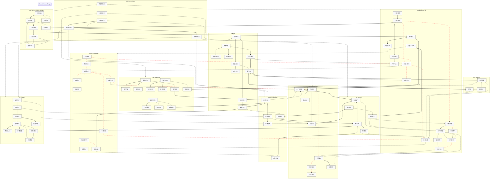

# Project Lifecycle Documentation Relationship Diagram

```mermaid
flowchart TD
    %% 前期文档
    subgraph PP["项目建议书 Project Proposal"]
        direction TB
        PP1[市场机遇] --> PP2[项目创意]
        PP2 --> PP3[初步方案]
        PP3 --> PP4[投资预估]
        PP2 --> PP5[预期收益]
        PP1 -.-> PP6[竞品分析]
        PP6 -.-> PP1
        PP4 -.-> PP5
        PP5 -.-> PP4
        PP2 -.-> B3
    end

    subgraph FS["可行性研究报告"]
        direction TB
        FS1[技术可行性] --> FS2[技术方案]
        FS1 --> FS3[技术风险]
        FS4[经济可行性] --> FS5[成本收益]
        FS4 --> FS6[投资回报]
        FS7[运营可行性] --> FS8[资源需求]
        FS7 --> FS9[组织保障]
        FS1 -.-> T1
        FS7 -.-> T3
        FS4 -.-> B5
    end

    subgraph PC["立项报告"]
        direction TB
        PC1[项目概述] --> PC2[项目目标]
        PC2 --> PC3[关键里程碑]
        PC2 --> PC4[预算规划]
        PC1 --> PC5[团队组织]
        PC5 --> PC6[职责分工]
        PC1 --> PC7[风险清单]
        PC2 -.-> AG1
        PC5 -.-> AG2
        PC7 -.-> T6
    end

    %% 需求分析文档
    subgraph BRD["BRD业务需求文档"]
        direction TB
        B1[项目背景] --> B2[业务目标]
        B2 --> B3[市场机会]
        B3 --> B4[商业模式]
        B4 --> B5[收益预估]
        B2 --> B6[项目范围]
        B6 --> B7[时间节点]
        B4 --> B8[风险评估]
        
        %% 业务流程部分
        B9[流程概览] --> B10[详细流程]
        B10 -.-> B13
        B13 -.-> B10
        B10 --> B11[角色职责]
        B11 -.-> B14
        
        %% 业务用例部分
        B12[用例概述] --> B13[详细用例]
        B13 --> B14[用例关系]
        
        %% 用户故事部分
        B2 --> B16[用户故事]
        B6 --> B16
        B16 --> B17[验收标准]
        B16 --> B15[Epic列表]
        
        %% 内部关联
        B2 --> B9
        B9 --> B12
        B4 -.-> DD1
    end

    subgraph PRD["PRD产品需求文档"]
        direction TB
        P1[用户画像] --> P2[用户场景]
        P2 --> P3[功能需求]
        P3 --> P4[界面原型]
        P4 --> P5[交互流程]
        P3 --> P6[业务规则]
        P3 --> P7[非功能需求]
        P7 --> P8[性能指标]
        P1 -.-> B16
        P3 -.-> F1
        P7 -.-> T7
        P6 -.-> B11
    end

    %% 技术设计文档
    subgraph FSD["FSD功能规格说明"]
        direction TB
        F1[功能架构] --> F2[模块划分]
        F2 --> F3[功能描述]
        F3 --> F4[处理流程]
        F4 --> F5[异常处理]
        F3 --> F6[业务规则]
        F2 --> F7[模块接口]
        F1 -.-> DD2
        F2 -.-> DD4
        F3 -.-> B14
        F6 -.-> B10
    end

    subgraph TSD["TSD技术规格说明"]
        direction TB
        T1[技术选型] --> T2[系统架构]
        T2 --> T3[部署架构]
        T2 --> T4[数据架构]
        T4 --> T5[存储方案]
        T2 --> T6[安全方案]
        T6 --> T7[性能方案]
        T2 -.-> DD2
        T4 -.-> DD4
        T6 -.-> A2
        T7 -.-> A7
    end

    %% 详细设计文档
    subgraph DBD["数据库设计"]
        direction TB
        D1[概念模型] --> D2[逻辑模型]
        D2 --> D3[物理模型]
        D3 --> D4[表结构]
        D4 --> D5[索引设计]
        D4 --> D6[存储过程]
        D3 --> D7[数据迁移]
        D1 -.-> DD4
        D2 -.-> T4
        D4 -.-> A4
        D4 -.-> A5
    end

    subgraph APID["API接口设计"]
        direction TB
        A1[接口规范] --> A2[认证授权]
        A2 --> A3[接口清单]
        A3 --> A4[请求参数]
        A4 --> A5[响应数据]
        A3 --> A6[错误码]
        A3 --> A7[限流策略]
        A1 -.-> DD5
        A3 -.-> DD3
        A6 -.-> B17
    end

    %% IPD阶段门
    subgraph IPD["IPD Phase Gates"]
        direction TB
        IPD1[概念阶段门] --> IPD2[计划阶段门]
        IPD2 --> IPD3[开发阶段门]
        IPD3 --> IPD4[验证阶段门]
        IPD4 --> IPD5[发布阶段门]
    end

    %% 敏捷工件
    subgraph AGILE["Agile Artifacts"]
        direction TB
        AG1[产品待办] --> AG2[迭代待办]
        AG2 --> AG3[燃尽图]
        AG2 --> AG4[迭代评审]
        AG4 --> AG5[回顾会议]
        AG5 -.-> AG2
        AG3 -.-> B17
        AG4 -.-> B17
    end

    %% DDD战略设计
    subgraph DDD["Domain Driven Design"]
        direction TB
        DD1[限界上下文] --> DD2[上下文映射]
        DD2 --> DD3[领域事件]
        DD3 --> DD4[聚合根]
        DD1 --> DD5[通用语言]
        DD3 -.-> B10
        DD5 -.-> B9
        DD5 -.-> B12
    end

    %% IPD阶段门关联
    IPD1 -.-> PP
    IPD1 -.-> BRD
    IPD2 -.-> FS
    IPD2 -.-> PC
    IPD3 -.-> PRD
    IPD3 -.-> FSD
    IPD4 -.-> TSD
    IPD4 -.-> DBD
    IPD5 -.-> APID
    IPD5 -.-> DBD
    IPD5 -.-> TSD

    %% 敏捷工件关联
    AG1 -.-> B16
    AG2 -.-> B15
    AG4 -.-> FSD

    %% DDD关联
    DD1 -.-> PRD
    DD2 -.-> TSD
    DD3 -.-> APID

    %% 需求追踪关系
    B16 -.-> P3
    B14 -.-> F3
    B17 -.-> T7
    B17 -.-> A6

    linkStyle default stroke:#333,stroke-width:2px
    linkStyle 40,41,42,43,44,45,46,47,48,49,50,51,52,53,54,55,56,57,58,59,60,61,62 stroke:#ff6b6b,stroke-width:2px,stroke-dasharray: 5 5

    classDef default fill:#f9f9f9,stroke:#333,stroke-width:1px
    classDef crossDep fill:#fff0f0,stroke:#ff6b6b,stroke-width:2px
```