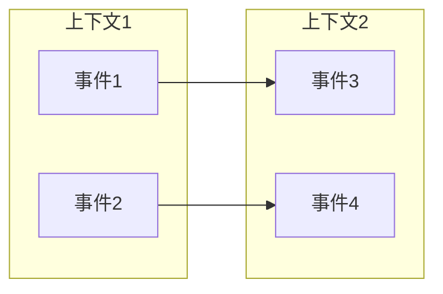
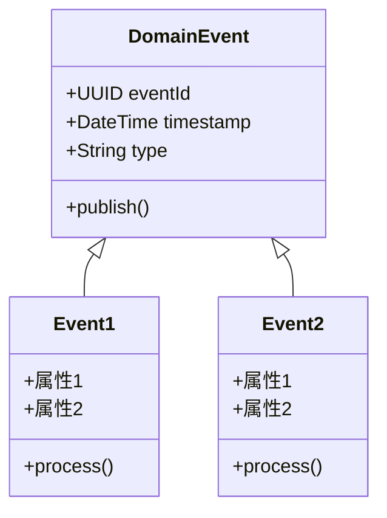
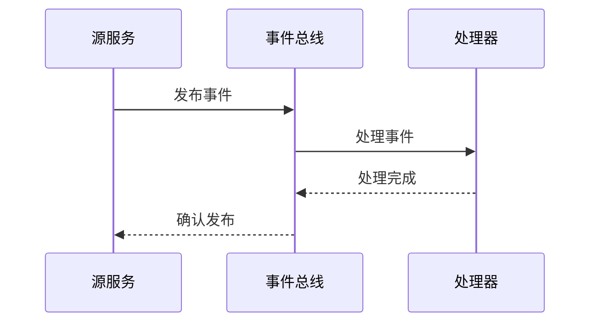
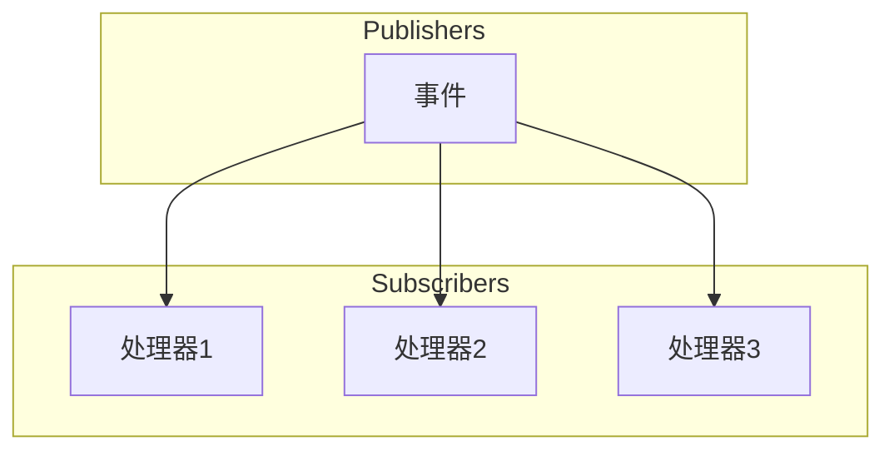
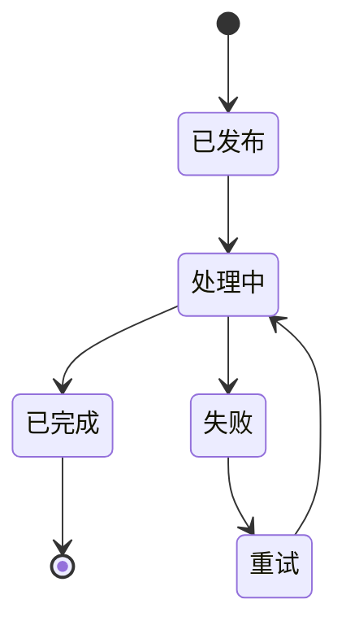

# 领域事件图模板
版本：[版本号]
日期：[日期]

## 1. 事件流概述

### 1.1 整体事件流


### 1.2 事件分类
| 事件类型 | 所属上下文 | 触发条件 | 影响范围 |
|---------|-----------|----------|----------|
| [事件类型1] | [上下文] | [触发条件] | [影响范围] |

## 2. 核心领域事件

### 2.1 [事件组1]


### 2.2 [事件组2]
[使用相同的结构描述其他事件组]

## 3. 事件处理流程

### 3.1 [流程名称1]


### 3.2 [流程名称2]
[使用相同的结构描述其他流程]

## 4. 事件订阅关系

### 4.1 [事件组1]订阅


### 4.2 [事件组2]订阅
[使用相同的结构描述其他订阅关系]

## 5. 事件状态流转

### 5.1 [状态流转1]


### 5.2 [状态流转2]
[使用相同的结构描述其他状态流转]

## 6. 事件处理策略

### 6.1 事件处理规则
| 事件类型 | 处理优先级 | 重试策略 | 失败处理 |
|---------|-----------|----------|----------|
| [事件1] | [优先级] | [重试策略] | [失败处理] |

### 6.2 事件存储策略
| 事件类型 | 存储时间 | 存储方式 | 清理策略 |
|---------|----------|----------|----------|
| [事件1] | [时间] | [方式] | [策略] |

## 7. 事件监控

### 7.1 监控指标
| 指标 | 描述 | 警告阈值 | 监控周期 |
|------|------|----------|----------|
| [指标1] | [描述] | [阈值] | [周期] |

### 7.2 告警规则
| 规则 | 条件 | 级别 | 通知方式 |
|------|------|------|----------|
| [规则1] | [条件] | [级别] | [通知方式] |

## 8. 附录

### 8.1 事件Schema
```json
{
    "DomainEvent": {
        "eventId": "UUID",
        "timestamp": "DateTime",
        "type": "String",
        "version": "String",
        "data": "Object"
    }
}
```

### 8.2 变更历史
| 日期 | 版本 | 变更内容 | 作者 |
|------|------|----------|------|
| [日期] | [版本] | [变更内容] | [作者] | 