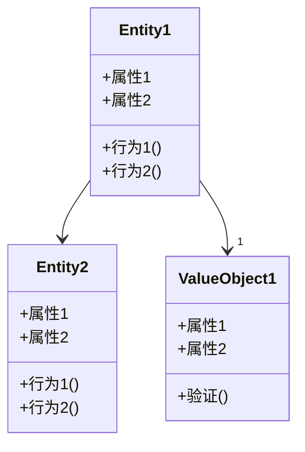
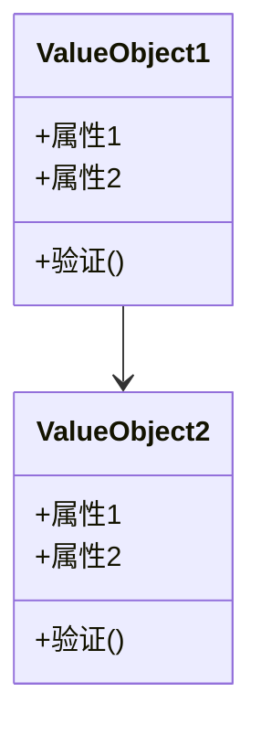
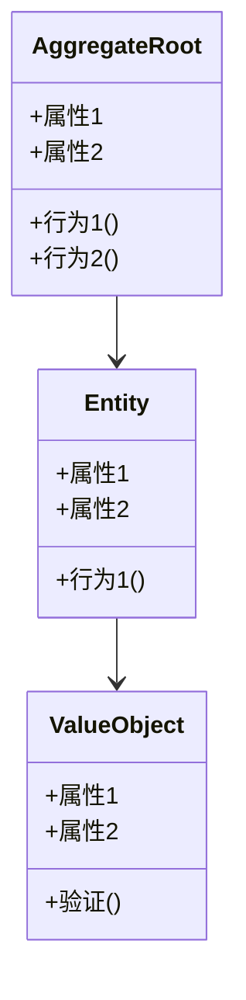
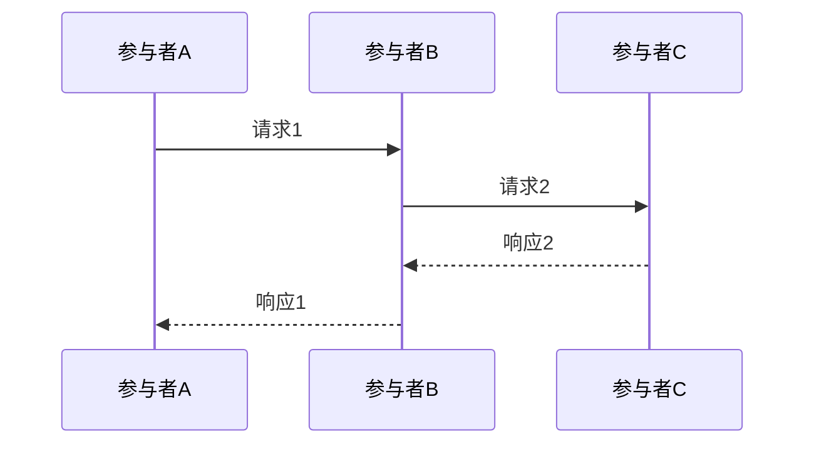
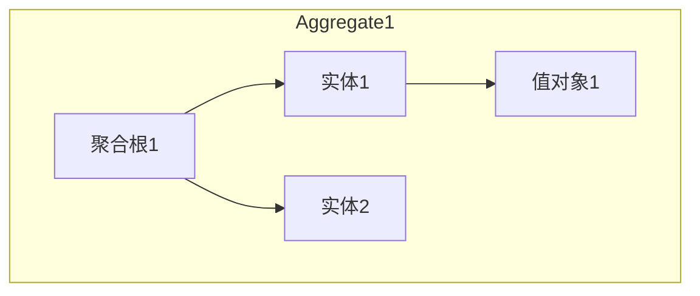
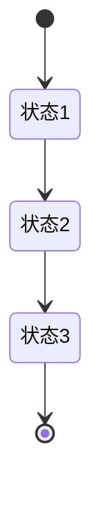
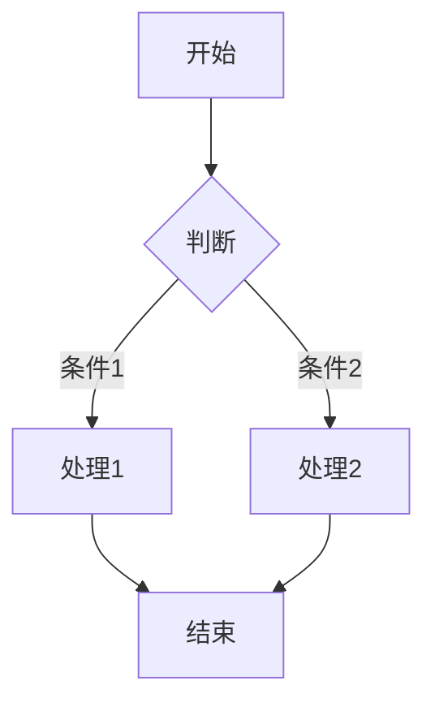

# 领域模型图模板
版本：[版本号]
日期：[日期]

## 1. 整体领域模型

### 1.1 核心领域模型

### 1.2 值对象模型

## 2. 限界上下文详情

### 2.1 [上下文名称1]

### 2.2 [上下文名称2]
[使用相同的图表结构描述其他上下文]

## 3. 上下文交互模型

### 3.1 [流程名称1]

### 3.2 [流程名称2]
[使用相同的图表结构描述其他流程]

## 4. 聚合关系模型

### 4.1 [聚合名称1]

### 4.2 [聚合名称2]
[使用相同的图表结构描述其他聚合]

## 5. 状态转换图

### 5.1 [状态图名称1]

### 5.2 [状态图名称2]
[使用相同的图表结构描述其他状态转换]

## 6. 业务流程图

### 6.1 [业务流程1]

### 6.2 [业务流程2]
[使用相同的图表结构描述其他业务流程]

## 7. 附录

### 7.1 图例说明
| 符号 | 含义 | 用法 |
|------|------|------|
| [符号1] | [含义1] | [用法1] |
| [符号2] | [含义2] | [用法2] |

### 7.2 变更历史
| 日期 | 版本 | 变更内容 | 作者 |
|------|------|----------|------|
| [日期] | [版本] | [变更内容] | [作者] | 