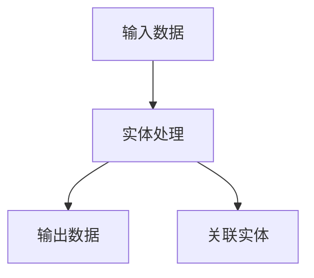
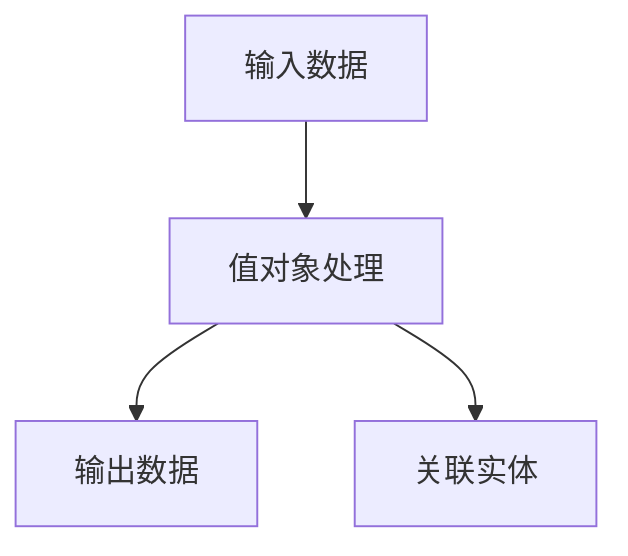
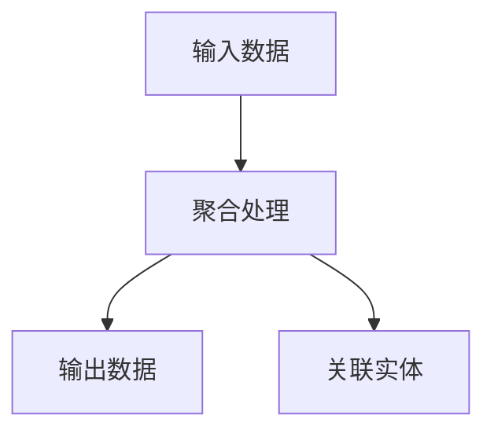
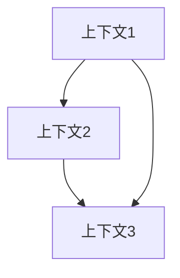

# 领域模型文档模板
版本：[版本号]
日期：[日期]

## 1. 文档概述
### 1.1 目的
[描述本文档的目的，例如：详细描述系统的领域模型，包括实体、值对象、聚合根、领域服务和领域事件的定义及其关系]

### 1.2 范围
[描述文档涵盖的范围，例如：涵盖系统的所有核心领域概念和业务规则]

## 2. 限界上下文中的领域对象

### 2.1 [上下文名称1]
#### 2.1.1 实体

##### 实体概述表
| 实体名称 | 核心描述 | 业务场景 | 关联实体 |
|---------|---------|----------|----------|
| [实体1] | [该实体的核心定义和作用] | - [使用场景1]<br>- [使用场景2] | - [关联实体1]: [关系描述]<br>- [关联实体2]: [关系描述] |

##### 属性详情
| 实体名称 | 属性名 | 类型 | 是否必填 | 描述 | 业务规则 | 验证逻辑 |
|---------|--------|------|-----------|------|----------|----------|
| [实体1] | [属性1] | [类型] | [是/否] | [属性描述] | - [规则1]<br>- [规则2] | - [验证1]<br>- [验证2] |
| [实体1] | [属性2] | [类型] | [是/否] | [属性描述] | - [规则1]<br>- [规则2] | - [验证1]<br>- [验证2] |

##### 行为详情
| 实体名称 | 行为名称 | 输入参数 | 返回值 | 前置条件 | 后置条件 | 业务规则 | 处理逻辑 |
|---------|----------|----------|---------|-----------|-----------|----------|----------|
| [实体1] | [行为1] | - [参数1]: [类型]<br>- [参数2]: [类型] | [返回类型] | - [条件1]<br>- [条件2] | - [条件1]<br>- [条件2] | - [规则1]<br>- [规则2] | 1. [步骤1]<br>2. [步骤2] |

##### 不变量
| 实体名称 | 不变量 | 验证时机 | 违反后果 | 保证措施 |
|---------|--------|----------|-----------|----------|
| [实体1] | [不变量1] | [验证时机] | [后果] | - [措施1]<br>- [措施2] |

##### 示例
```json
{
    "实体1": {
        "属性1": "示例值1",
        "属性2": "示例值2",
        "关联对象": {
            "属性": "值"
        }
    }
}
```

##### 使用案例场景
- [场景1]: [描述场景及其与实体的交互]
- [场景2]: [描述场景及其与实体的交互]

##### 数据流图


##### UI/UX 考虑
- [UI/UX需求1]: [描述需求及其对实体的影响]
- [UI/UX需求2]: [描述需求及其对实体的影响]

##### 集成点
- [集成点1]: [描述与其他系统或服务的集成]
- [集成点2]: [描述与其他系统或服务的集成]

##### 安全与合规
- [安全要求1]: [描述安全要求及其实现方式]
- [合规要求1]: [描述合规要求及其实现方式]

##### 性能指标
- [性能指标1]: [描述指标及其目标值]
- [性能指标2]: [描述指标及其目标值]

##### 测试指南
- [测试用例1]: [描述测试用例及其预期结果]
- [测试用例2]: [描述测试用例及其预期结果]

#### 2.1.2 值对象

##### 值对象概述表
| 值对象名称 | 核心描述 | 业务场景 | 关联实体 |
|-----------|---------|----------|----------|
| [值对象1] | [该值对象的核心定义和作用] | - [使用场景1]<br>- [使用场景2] | - [关联实体1]: [关系描述]<br>- [关联实体2]: [关系描述] |

##### 属性详情
| 值对象名称 | 属性名 | 类型 | 是否必填 | 描述 | 业务规则 | 验证逻辑 |
|-----------|--------|------|-----------|------|----------|----------|
| [值对象1] | [属性1] | [类型] | [是/否] | [属性描述] | - [规则1]<br>- [规则2] | - [验证1]<br>- [验证2] |
| [值对象1] | [属性2] | [类型] | [是/否] | [属性描述] | - [规则1]<br>- [规则2] | - [验证1]<br>- [验证2] |

##### 使用案例场景
- [场景1]: [描述场景及其与值对象的交互]
- [场景2]: [描述场景及其与值对象的交互]

##### 数据流图


##### UI/UX 考虑
- [UI/UX需求1]: [描述需求及其对值对象的影响]
- [UI/UX需求2]: [描述需求及其对值对象的影响]

##### 集成点
- [集成点1]: [描述与其他系统或服务的集成]
- [集成点2]: [描述与其他系统或服务的集成]

##### 安全与合规
- [安全要求1]: [描述安全要求及其实现方式]
- [合规要求1]: [描述合规要求及其实现方式]

##### 性能指标
- [性能指标1]: [描述指标及其目标值]
- [性能指标2]: [描述指标及其目标值]

##### 测试指南
- [测试用例1]: [描述测试用例及其预期结果]
- [测试用例2]: [描述测试用例及其预期结果]

#### 2.1.3 聚合

##### 聚合概述表
| 聚合名称 | 核心描述 | 业务场景 | 关联实体 |
|---------|---------|----------|----------|
| [聚合1] | [该聚合的核心定义和作用] | - [使用场景1]<br>- [使用场景2] | - [关联实体1]: [关系描述]<br>- [关联实体2]: [关系描述] |

##### 组件详情
| 聚合名称 | 组件名 | 类型 | 描述 | 业务规则 | 验证逻辑 |
|---------|--------|------|------|----------|----------|
| [聚合1] | [组件1] | [类型] | [组件描述] | - [规则1]<br>- [规则2] | - [验证1]<br>- [验证2] |
| [聚合1] | [组件2] | [类型] | [组件描述] | - [规则1]<br>- [规则2] | - [验证1]<br>- [验证2] |

##### 行为详情
| 聚合名称 | 行为名称 | 输入参数 | 返回值 | 前置条件 | 后置条件 | 业务规则 | 处理逻辑 |
|---------|----------|----------|---------|-----------|-----------|----------|----------|
| [聚合1] | [行为1] | - [参数1]: [类型]<br>- [参数2]: [类型] | [返回类型] | - [条件1]<br>- [条件2] | - [条件1]<br>- [条件2] | - [规则1]<br>- [规则2] | 1. [步骤1]<br>2. [步骤2] |
| [聚合1] | [行为2] | - [参数1]: [类型]<br>- [参数2]: [类型] | [返回类型] | - [条件1]<br>- [条件2] | - [条件1]<br>- [条件2] | - [规则1]<br>- [规则2] | 1. [步骤1]<br>2. [步骤2] |

##### 使用案例场景
- [场景1]: [描述场景及其与聚合的交互]
- [场景2]: [描述场景及其与聚合的交互]

##### 数据流图


##### UI/UX 考虑
- [UI/UX需求1]: [描述需求及其对聚合的影响]
- [UI/UX需求2]: [描述需求及其对聚合的影响]

##### 集成点
- [集成点1]: [描述与其他系统或服务的集成]
- [集成点2]: [描述与其他系统或服务的集成]

##### 安全与合规
- [安全要求1]: [描述安全要求及其实现方式]
- [合规要求1]: [描述合规要求及其实现方式]

##### 性能指标
- [性能指标1]: [描述指标及其目标值]
- [性能指标2]: [描述指标及其目标值]

##### 测试指南
- [测试用例1]: [描述测试用例及其预期结果]
- [测试用例2]: [描述测试用例及其预期结果]

#### 2.1.4 领域服务
| 服务名称 | 职责 | 依赖 |
|---------|------|------|
| [服务1] | - [职责1]<br>- [职责2] | - [依赖1]<br>- [依赖2] |

#### 2.1.5 领域事件
| 事件名称 | 属性 | 触发条件 | 处理器 |
|---------|------|----------|--------|
| [事件1] | - [属性1]<br>- [属性2] | [触发条件] | - [处理器1]<br>- [处理器2] |

### 2.2 [上下文名称2]
[按照上述结构继续描述其他上下文]

## 3. 领域模型关系
### 3.1 上下文间关系


### 3.2 关系详情
| 源 | 目标 | 类型 | 描述 |
|---|------|------|------|
| [源上下文] | [目标上下文] | [关系类型] | [关系描述] |

## 4. 业务规则
### 4.1 不变量
| 规则ID | 描述 | 强制执行方式 |
|--------|------|-------------|
| [规则ID] | [规则描述] | [执行方式] |

### 4.2 验证规则
| 规则ID | 上下文 | 验证内容 |
|--------|--------|----------|
| [规则ID] | [上下文] | [验证内容] |

## 5. 实现指南
### 5.1 使用的模式
- [模式1]
  - 目的：[描述目的]
  - 实现：[描述实现方式]

### 5.2 技术考虑
- [考虑点1]
  - 影响：[描述影响]
  - 缓解：[描述缓解措施]

## 6. 附录
### 6.1 术语表
| 术语 | 定义 | 上下文 |
|------|------|--------|
| [术语1] | [定义1] | [上下文1] |

### 6.2 参考资料
- [参考资料1]
- [参考资料2]

### 6.3 变更历史
| 日期 | 版本 | 变更内容 | 作者 |
|------|------|----------|------|
| [日期] | [版本] | [变更内容] | [作者] | 