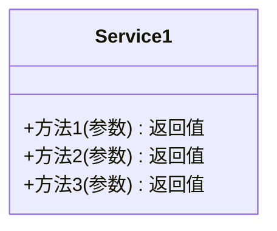
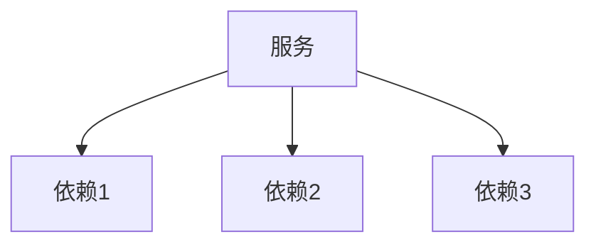
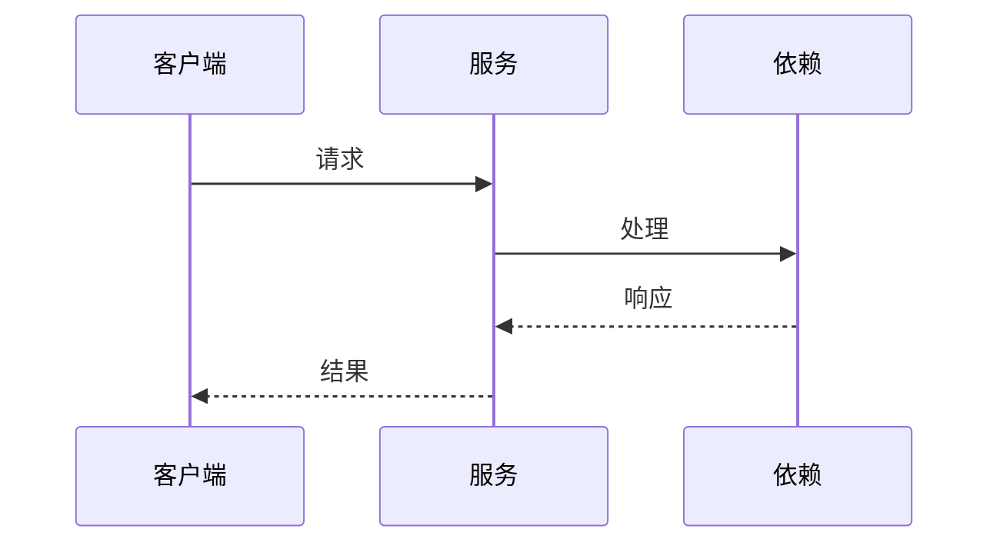

# 领域服务定义模板
版本：[版本号]
日期：[日期]

## 1. 服务概述

### 1.1 目的
[描述本文档的目的，例如：定义系统中的领域服务，封装跨领域对象的业务逻辑]

### 1.2 范围
[描述文档涵盖的范围，例如：涵盖核心领域服务的定义和实现]

## 2. 服务定义

### 2.1 [服务名称1]
#### 2.1.1 服务接口


#### 2.1.2 操作定义
| 操作 | 参数 | 返回值 | 描述 |
|------|------|--------|------|
| [方法1] | [参数列表] | [返回类型] | [方法描述] |

#### 2.1.3 依赖关系


### 2.2 [服务名称2]
[使用相同的结构描述其他服务]

## 3. 业务流程

### 3.1 [流程名称1]


### 3.2 [流程名称2]
[使用相同的结构描述其他流程]

## 4. 服务实现

### 4.1 [服务实现1]
```java
public class ServiceImpl implements Service {
    private final Dependency1 dependency1;
    private final Dependency2 dependency2;
    
    @Override
    public Result method1(Request request) {
        // 实现说明
    }
}
```

### 4.2 [服务实现2]
[使用相同的结构描述其他实现]

## 5. 错误处理

### 5.1 异常定义
| 异常类型 | 错误码 | 处理策略 |
|---------|--------|----------|
| [异常1] | [错误码] | [处理策略] |

### 5.2 重试策略
| 操作 | 重试次数 | 间隔时间 | 退避策略 |
|------|----------|----------|----------|
| [操作1] | [次数] | [时间] | [策略] |

## 6. 性能考虑

### 6.1 缓存策略
| 缓存对象 | 过期时间 | 刷新策略 |
|---------|----------|----------|
| [对象1] | [时间] | [策略] |

### 6.2 并发控制
| 操作 | 锁类型 | 超时时间 |
|------|--------|----------|
| [操作1] | [锁类型] | [时间] |

## 7. 监控指标

### 7.1 性能指标
| 指标 | 目标值 | 警告阈值 | 监控周期 |
|------|--------|----------|----------|
| [指标1] | [目标值] | [阈值] | [周期] |

### 7.2 业务指标
| 指标 | 目标值 | 警告阈值 | 监控周期 |
|------|--------|----------|----------|
| [指标1] | [目标值] | [阈值] | [周期] |

## 8. 附录

### 8.1 参考资料
- [参考资料1]
- [参考资料2]

### 8.2 变更历史
| 日期 | 版本 | 变更内容 | 作者 |
|------|------|----------|------|
| [日期] | [版本] | [变更内容] | [作者] | 