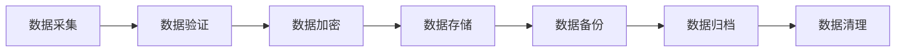

# Dove 登录系统产品需求文档 (PRD)

## 文档信息
- 文档版本：V1.0.1
- 最后更新：2024-03-21
- 作者：系统架构组
- 审核人：技术委员会

## 1. 产品概述

### 1.1 产品背景
Dove登录系统是一个面向全球的企业级SaaS身份认证系统，旨在为企业提供安全、可靠、高性能的统一身份认证服务。系统基于先进的微服务架构设计，采用Spring Cloud + Spring Cloud Alibaba技术栈，确保系统具备高可扩展性、高可用性和强大的可观测能力。

#### 市场需求
- 企业数字化转型对统一身份认证的迫切需求
- 全球化业务发展带来的多区域部署需求
- 安全合规要求不断提高
- 用户体验要求持续提升

#### 技术趋势
- 微服务架构的广泛应用
- 云原生技术的快速发展
- 零信任安全架构的推广
- AI/ML在安全领域的应用

#### 竞品分析
- 传统IAM系统的局限性
- 云服务商IAM的优劣势
- 开源解决方案的现状
- 市场机会点分析

### 1.2 产品定位与成功指标

#### 成功指标
- 用户规模
  - 支持2亿注册用户
  - 日活跃用户1亿以上
  - 每月新增用户300万
  - 用户留存率95%
- 系统性能
  - 高峰时段支持8000万并发用户访问
  - 单区域支持2000万用户
  - API平均响应时间<100ms
  - 全球访问延迟<3s
- 可用性指标
  - 系统可用性99.99%
  - 故障恢复时间<5分钟
  - 数据一致性99.999%
  - 零数据丢失
- 安全指标
  - 零重大安全事故
  - 所有安全漏洞24小时内修复
  - 渗透测试100%通过
  - 合规认证100%通过
- 用户体验
  - 首次登录成功率95%以上
  - 平均登录时间<3秒
  - 用户满意度>90%
  - 问题解决率>95%

#### 目标用户
1. 企业用户（B端）
   - 大型企业
     - IT基础设施完善
     - 安全需求高
     - 全球化业务
     - 合规要求严格
   - 中小企业
     - 成本敏感
     - 快速部署需求
     - 运维能力有限
     - 扩展需求强
   - 创业公司
     - 灵活性要求高
     - 快速迭代需求
     - 资源有限
     - 成长性强

2. 个人用户（C端）
   - 企业员工
     - 便捷登录需求
     - 多设备接入
     - 安全意识差异
     - 使用频率高
   - 外部合作者
     - 临时访问需求
     - 权限管理严格
     - 审计需求强
     - 使用场景复杂
   - 普通用户
     - 简单易用需求
     - 安全保障需求
     - 隐私保护需求
     - 个性化需求

3. 系统管理员
   - 安全管理员
     - 安全策略配置
     - 风险监控
     - 审计追踪
     - 应急响应
   - 运维管理员
     - 系统监控
     - 性能优化
     - 问题诊断
     - 容量规划
   - 业务管理员
     - 用户管理
     - 权限配置
     - 报表分析
     - 政策执行

#### 核心价值
1. 企业价值
   - 降低成本
     - 统一认证平台
     - 自动化运维
     - 资源优化
     - TCO降低
   - 提升效率
     - 快速部署
     - 统一管理
     - 自助服务
     - 流程优化
   - 安全保障
     - 多层次防护
     - 合规达标
     - 风险可控
     - 安全可信
   - 业务赋能
     - 快速创新
     - 全球化支持
     - 业务连续性
     - 用户体验

2. 技术价值
   - 架构先进
     - 微服务架构
     - 云原生支持
     - 高可扩展
     - 易集成
   - 性能卓越
     - 高并发
     - 低延迟
     - 可伸缩
     - 高可用
   - 运维友好
     - 可观测性
     - 易维护
     - 自动化
     - 智能化
   - 安全可靠
     - 多层防护
     - 数据加密
     - 审计追踪
     - 容灾备份

#### 主要功能
1. 身份认证体系
   - 标准认证
     - 用户名密码认证
     - 邮箱密码认证
     - 手机号码认证
     - 记住登录功能
   - 高级认证
     - 双因素认证(2FA)
     - 生物识别认证
     - 硬件密钥认证
     - 证书认证
   - 企业认证
     - 企业SSO集成
     - LDAP/AD集成
     - OAuth2.0支持
     - SAML2.0支持
   - 社交认证
     - 微信登录
     - Google登录
     - Facebook登录
     - 企业微信登录

2. 安全防护体系
   - 访问控制
     - 基于角色的访问控制
     - 基于属性的访问控制
     - 细粒度权限管理
     - 动态权限调整
   - 安全策略
     - 密码策略管理
     - 登录策略配置
     - 会话管理策略
     - 风险控制策略
   - 安全审计
     - 操作日志审计
     - 安全事件审计
     - 合规性审计
     - 风险评估报告
   - 威胁防护
     - 暴力破解防护
     - 异常行为检测
     - DDoS防护
     - WAF防护

3. 用户管理体系
   - 账号管理
     - 账号生命周期
     - 账号状态管理
     - 账号关联管理
     - 账号注销流程
   - 组织管理
     - 组织架构管理
     - 部门管理
     - 角色管理
     - 岗位管理
   - 授权管理
     - 权限分配
     - 角色分配
     - 资源授权
     - 临时授权
   - 自助服务
     - 个人信息管理
     - 安全设置
     - 设备管理
     - 授权管理

4. 系统管理体系
   - 配置管理
     - 系统参数配置
     - 安全策略配置
     - 认证方式配置
     - 界面配置
   - 监控管理
     - 实时监控
     - 性能监控
     - 安全监控
     - 日志监控
   - 运维管理
     - 系统运维
     - 证书管理
     - 密钥管理
     - 备份恢复
   - 集成管理
     - API管理
     - 协议适配
     - 数据同步
     - 消息推送

5. 全球化支持
   - 多语言支持
     - 界面多语言
     - 消息多语言
     - 数据多语言
     - 时区处理
   - 合规支持
     - GDPR合规
     - SOC2认证
     - ISO27001认证
     - 等保认证
   - 区域部署
     - 多区域部署
     - 就近接入
     - 数据本地化
     - 容灾备份
   - 全球运营
     - 全球化监控
     - 区域性能优化
     - 全球化支持
     - 本地化服务

## 2. 需求概述

### 2.1 用户需求

#### 用户痛点
1. 安全性痛点
   - 账号安全
     - 账号被盗风险高
     - 密码管理困难
     - 弱密码普遍
     - 凭证泄露频繁
   - 访问控制
     - 权限管理复杂
     - 越权访问风险
     - 临时授权困难
     - 权限回收不及时
   - 合规性
     - 合规要求严格
     - 审计追踪不足
     - 隐私保护不足
     - 数据合规难

2. 便利性痛点
   - 登录体验
     - 多系统重复登录
     - 密码频繁输入
     - 验证步骤繁琐
     - 登录方式单一
   - 自助服务
     - 密码重置复杂
     - 信息修改不便
     - 设备管理困难
     - 授权流程长
   - 系统接入
     - 集成成本高
     - 维护工作量大
     - 兼容性问题多
     - 升级困难

3. 管理痛点
   - 用户管理
     - 账号生命周期管理难
     - 组织架构调整频繁
     - 批量操作效率低
     - 特殊场景处理难
   - 系统管理
     - 运维工作量大
     - 监控能力不足
     - 问题定位困难
     - 变更风险高
   - 成本控制
     - 建设成本高
     - 运维成本高
     - ROI不明确
     - 资源浪费多

#### 核心诉求
1. 最终用户
   - 安全保障
     - 账号安全可靠
     - 访问受控
     - 隐私得到保护
     - 数据安全无忧
   - 便捷体验
     - 一次登录
     - 多端同步
     - 自助服务
     - 快速响应
   - 个性化
     - 登录方式可选
     - 界面可定制
     - 偏好可设置
     - 服务可定制

2. 企业管理者
   - 统一管理
     - 集中化管理
     - 标准化流程
     - 自动化运维
     - 可视化监控
   - 安全合规
     - 访问控制
     - 审计追踪
     - 合规达标
     - 风险可控
   - 成本效益
     - 建设成本可控
     - 运维成本降低
     - 效率提升
     - 价值明确

3. 技术人员
   - 系统性能
     - 高可用性
     - 高并发
     - 低延迟
     - 可扩展
   - 运维便利
     - 易部署
     - 易维护
     - 易监控
     - 易排障
   - 技术先进
     - 架构先进
     - 技术成熟
     - 生态完善
     - 持续演进

#### 使用场景
1. 日常办公场景
   - 工作时间访问
     - 早晚高峰登录
     - 全天候操作
     - 多设备切换
     - 临时授权
   - 移动办公
     - 远程办公
     - 出差访问
     - 移动端操作
     - 多地协同
   - 协作场景
     - 团队协作
     - 项目协作
     - 临时协作
     - 外部协作

2. 特殊场景
   - 应急响应
     - 紧急授权
     - 应急处理
     - 故障恢复
     - 灾难恢复
   - 安全事件
     - 账号冻结
     - 密码重置
     - 异常处理
     - 安全审计
   - 合规审计
     - 定期审计
     - 合规检查
     - 安全评估
     - 等保测评

3. 运维场景
   - 日常运维
     - 监控告警
     - 性能优化
     - 问题处理
     - 变更管理
   - 系统管理
     - 配置管理
     - 版本升级
     - 数据备份
     - 容量规划
   - 安全运维
     - 安全加固
     - 漏洞修复
     - 攻击防护
     - 应急响应

### 2.2 功能需求

#### 必要功能
1. 身份认证
   - 标准登录
     - 用户名密码登录
     - 邮箱密码登录
     - 手机号码登录
     - 记住登录状态
   - 企业认证
     - 企业SSO集成
     - LDAP认证
     - Active Directory集成
     - 自定义认证接口
   - 多因素认证
     - 短信验证码
     - 邮件验证码
     - 认证器(TOTP)
     - 生物识别

2. 安全防护
   - 访问控制
     - IP白名单
     - 地理位置限制
     - 时间段限制
     - 设备指纹校验
   - 异常防护
     - 暴力破解防护
     - 账号锁定策略
     - 异常登录检测
     - 风险评分系统
   - 审计追踪
     - 登录日志记录
     - 操作行为审计
     - 安全事件记录
     - 合规性报告

3. 用户管理
   - 账号注册
   - 密码重置
   - 账号恢复
   - 个人信息管理

4. 企业管理
   - 组织架构管理
   - SSO配置
   - 安全策略设置

5. 系统管理
   - 用户审计
   - 安全监控
   - 运营分析

#### 可选功能
1. 高级认证
   - 生物识别
     - 指纹识别
     - 面部识别
     - 声纹识别
     - 虹膜扫描
   - 硬件认证
     - USB Key
     - 智能卡
     - 硬件令牌
     - NFC设备
   - 行为认证
     - 键盘特征
     - 鼠标轨迹
     - 操作习惯
     - 位置轨迹

2. 社交集成
   - 账号关联
     - 微信登录
     - Google登录
     - Facebook登录
     - LinkedIn登录
   - 信息同步
     - 基本信息同步
     - 头像同步
     - 联系方式同步
     - 社交关系同步
   - 社交分享
     - 分享登录状态
     - 邀请注册
     - 社交推荐
     - 活动分享

3. 个性化配置
   - 界面定制
     - 主题切换
     - 布局调整
     - 语言切换
     - 时区设置
   - 通知设置
     - 登录通知
     - 安全预警
     - 活动提醒
     - 消息订阅
   - 偏好设置
     - 默认登录方式
     - 安全级别设置
     - 隐私选项
     - 辅助功能

#### 未来规划
1. 智能认证
   - AI风险评估
     - 行为分析
     - 环境评估
     - 威胁检测
     - 自适应认证
   - 无密码登录
     - 生物特征
     - 设备信任
     - 链接登录
     - 魔法链接

2. 高级分析
   - 用户画像
     - 行为分析
     - 使用习惯
     - 风险偏好
     - 安全意识
   - 安全分析
     - 威胁情报
     - 攻击模式
     - 风险预测
     - 安全评分

## 3. 功能详述

### 3.1 用户界面

#### 界面布局
1. 登录页面
   - 品牌展示区
     - Logo展示
     - 品牌标语
     - 背景设计
     - 动效元素
   - 登录表单区
     - 登录方式选择
     - 输入框布局
     - 验证码区域
     - 辅助功能链接
   - 提示信息区
     - 错误提示
     - 状态反馈
     - 帮助信息
     - 操作指引

2. 验证页面
   - 验证码输入
     - 短信验证码
     - 邮件验证码
     - 图形验证码
     - 滑块验证
   - 双因素认证
     - TOTP验证器
     - 安全问题
     - 备用码验证
     - 生物识别
   - 状态展示
     - 倒计时显示
     - 重发按钮
     - 验证进度
     - 结果反馈

3. 个人中心
   - 信息概览
     - 基本信息
     - 安全状态
     - 最近活动
     - 快捷操作
   - 设置面板
     - 账号设置
     - 安全设置
     - 隐私设置
     - 通知设置
   - 活动记录
     - 登录历史
     - 操作日志
     - 设备管理
     - 授权管理

#### 交互流程
1. 标准登录流程
   ```mermaid
   sequenceDiagram
   participant U as 用户
   participant F as 前端
   participant B as 后端
   participant D as 数据库
   
   U->>F: 访问登录页
   F->>U: 展示登录表单
   U->>F: 输入凭证
   F->>F: 本地验证
   F->>B: 提交登录请求
   B->>D: 验证凭证
   D-->>B: 返回结果
   B->>B: 生成Token
   B-->>F: 返回Token
   F->>F: 保存Token
   F-->>U: 登录成功提示
   F->>U: 跳转目标页面
   ```

2. 2FA验证流程
   ```mermaid
   sequenceDiagram
   participant U as 用户
   participant F as 前端
   participant B as 后端
   participant S as 验证服务
   
   U->>F: 完成首次认证
   F->>B: 请求2FA验证
   B->>S: 生成验证码
   S-->>U: 发送验证码
   U->>F: 输入验证码
   F->>B: 提交验证
   B->>S: 验证码校验
   S-->>B: 验证结果
   B-->>F: 返回结果
   F-->>U: 完成验证
   F->>U: 进入系统
   ```

#### 视觉规范
1. 设计风格
   - 布局规范
     - 响应式设计
     - 网格系统
     - 留白原则
     - 对齐规则
   - 界面风格
     - 简洁现代
     - 科技感
     - 专业性
     - 一致性
   - 无障碍
     - 色盲友好
     - 键盘操作
     - 屏幕阅读
     - 对比度

2. 色彩系统
   - 主色调
     - 品牌主色
     - 辅助色
     - 点缀色
     - 渐变色
   - 功能色
     - 成功：#28a745
     - 警告：#ffc107
     - 错误：#dc3545
     - 信息：#17a2b8
   - 中性色
     - 文本色：#333333
     - 背景色：#ffffff
     - 边框色：#e5e5e5
     - 阴影色：rgba(0,0,0,0.1)

3. 组件规范
   - 按钮样式
     - 主要按钮
     - 次要按钮
     - 文字按钮
     - 图标按钮
   - 输入控件
     - 文本输入框
     - 密码输入框
     - 验证码输入
     - 选择控件
   - 提示信息
     - 成功提示
     - 错误提示
     - 警告提示
     - 帮助信息
   - 加载状态
     - 页面加载
     - 按钮加载
     - 提交加载
     - 验证加载

### 3.2 功能模块

#### 3.2.1 登录认证模块

##### 功能描述
- 多方式登录
  - 标准登录：用户名/邮箱+密码
  - 手机登录：手机号+验证码
  - 企业登录：SSO/LDAP集成
  - 社交登录：第三方OAuth
- 安全认证
  - 双因素认证(2FA)
  - 生物识别认证
  - 硬件密钥认证
  - 风险级别认证
- 会话管理
  - Token管理
  - 会话超时
  - 并发登录控制
  - 登录状态同步

##### 业务规则
1. 登录方式
   - 账号规则
     - 用户名：6-20位字母数字
     - 邮箱：标准邮箱格式
     - 手机号：国际格式支持
     - 企业账号：域账号格式
   - 密码规则
     - 最小长度：12位
     - 复杂度要求：大小写+数字+特殊字符
     - 历史密码：禁止使用最近5次密码
     - 有效期：90天强制更新
   - 验证规则
     - 短信验证码：6位数字，5分钟有效
     - 邮件验证码：8位字符，10分钟有效
     - 图形验证码：连续失败3次后要求
     - 滑块验证：异常行为触发

2. 安全策略
   - 登录保护
     - 失败次数：5次/小时
     - 锁定时间：30分钟
     - IP限制：白名单机制
     - 地理限制：异地登录验证
   - 会话控制
     - 超时时间：30分钟
     - 最大会话：3个设备
     - Token有效期：24小时
     - 刷新机制：支持自动续期
   - 风险控制
     - 异常检测：设备/IP/时间异常
     - 阈值控制：自定义风险等级
     - 阻断策略：风险分级处理
     - 告警通知：多渠道推送

3. 状态管理
   - 登录状态
     - Token存储：HTTP-Only Cookie
     - 状态同步：WebSocket实时推送
     - 注销处理：全端同步注销
     - 异常处理：自动重连机制
   - 数据同步
     - 用户信息：实时同步
     - 权限数据：定时同步
     - 配置信息：启动同步
     - 日志记录：异步处理

##### 交互说明
1. 登录入口
   - 界面布局
     - 登录方式切换
     - 输入框布局
     - 验证码区域
     - 辅助功能区
   - 交互流程
     - 自动填充支持
     - 实时字段验证
     - 提交按钮状态
     - 错误提示展示
   - 响应处理
     - 登录成功跳转
     - 验证失败提示
     - 异常状态处理
     - 重试机制

2. 验证流程
   - 验证触发
     - 首次登录验证
     - 异常行为验证
     - 敏感操作验证
     - 定期重验证
   - 验证方式
     - 短信验证码
     - 邮件验证码
     - TOTP验证器
     - 生物识别
   - 结果处理
     - 验证通过处理
     - 验证失败处理
     - 超时重新验证
     - 备用验证方案

##### 验证规则
1. 输入验证
   - 字段验证
     - 必填项检查
     - 格式正则匹配
     - 长度范围控制
     - 特殊字符过滤
   - 业务验证
     - 账号存在检查
     - 密码强度检查
     - 验证码正确性
     - 登录权限检查

2. 安全验证
   - 基础验证
     - 密码哈希对比
     - 验证码校验
     - Token验证
     - 签名校验
   - 增强验证
     - 设备指纹
     - 环境检测
     - 行为分析
     - 风险评估

## 4. 非功能需求

### 4.1 性能需求

#### 响应时间
- 页面性能
  - 首页加载时间 < 2秒
  - 页面切换时间 < 1秒
  - 静态资源加载 < 1秒
- 操作响应
  - 登录请求响应 < 1秒
  - 验证码发送延迟 < 3秒
  - API调用响应 < 500ms
- 全球化性能
  - 跨区域访问延迟 < 3秒
  - CDN覆盖率 > 95%
  - 全球节点同步时间 < 5秒

#### 并发能力
- 用户规模
  - 支持800万用户并发在线
  - 单区域支持200万并发
  - 峰值处理能力可弹性扩展
- 系统吞吐
  - 单机支持1万TPS
  - 集群总吞吐量50万TPS
  - 消息队列处理延迟 < 50ms
- 资源利用
  - CPU利用率 < 70%
  - 内存使用率 < 80%
  - 存储IOPS预留30%

#### 可用性要求
- 服务等级
  - 服务可用性 99.99%
  - 故障恢复时间 < 5分钟
  - 数据备份实时同步
- 容灾能力
  - 跨区域容灾切换 < 30秒
  - 数据零丢失（RPO=0）
  - 服务恢复时间（RTO < 5分钟）
- 监控告警
  - 核心指标实时监控
  - 故障预警提前15分钟
  - 告警响应时间 < 5分钟

### 4.2 安全需求

#### 权限控制
- 基于RBAC的权限模型
  - 支持角色继承和组合
  - 动态权限分配
  - 最小权限原则
- 细粒度的权限控制
  - 功能级权限
  - 数据级权限
  - 操作级权限
- 动态权限调整
  - 实时权限更新
  - 权限变更审计
  - 紧急权限撤销

#### 数据安全
- 传输安全
  - TLS 1.3加密传输
  - 证书轮换机制
  - 防重放攻击
- 存储安全
  - AES-256加密算法
  - 密钥定期轮换
  - 敏感数据分级存储
- 密钥管理
  - 硬件安全模块(HSM)
  - 密钥生命周期管理
  - 多重加密保护

#### 隐私保护
- 合规要求
  - GDPR合规
  - CCPA合规
  - 数据本地化存储
- 数据处理
  - 全程数据脱敏
  - 数据使用授权
  - 数据删除机制
- 审计追踪
  - 完整操作日志
  - 敏感操作双人审批
  - 异常行为告警

### 4.3 可用性需求

#### 操作便利性
- 直观的界面设计
- 清晰的操作引导
- 友好的错误提示

#### 容错能力
- 自动故障转移
- 服务降级机制
- 灾难恢复能力

## 5. 数据需求

### 5.1 数据定义

#### 用户数据
- 基础信息
  - 用户ID（全局唯一）
  - 用户名/邮箱
  - 密码哈希
  - 注册时间
- 认证信息
  - 认证方式
  - 2FA配置
  - 安全问题
  - 登录凭证
- 安全设置
  - 登录策略
  - IP白名单
  - 设备信任列表
  - 安全等级
- 操作记录
  - 登录历史
  - 操作日志
  - 安全事件
  - 异常记录

#### 系统数据
- 配置信息
  - 系统参数
  - 安全策略
  - 功能开关
  - 限流规则
- 运行数据
  - 性能指标
  - 资源使用
  - 错误日志
  - 审计记录
- 统计数据
  - 用户活跃度
  - 登录成功率
  - 异常统计
  - 性能分析
- 业务数据
  - 组织信息
  - 权限配置
  - 集成配置
  - 自定义设置

### 5.2 数据流转

#### 数据处理流程


#### 数据生命周期
- 数据采集
  - 用户输入验证
  - 系统自动采集
  - 第三方数据集成
- 数据处理
  - 实时处理
  - 批量处理
  - 异步处理
- 数据存储
  - 分级存储
  - 分片存储
  - 冷热分离
- 数据清理
  - 定期归档
  - 自动清理
  - 合规删除

#### 数据同步机制
- 主从复制
  - 实时同步
  - 异步复制
  - 双向同步
- 跨区域同步
  - 多中心数据同步
  - 灾备数据同步
  - 全球数据分发
- 一致性保证
  - 强一致性保证
  - 最终一致性
  - 冲突解决策略

## 6. 接口需求

### 6.1 外部接口

#### API接口规范
- RESTful API
  - 统一资源定位
  - HTTP方法语义
  - 状态码规范
  - 版本控制
- GraphQL API
  - 查询语言规范
  - 类型系统
  - 实时订阅
  - 批量操作
- WebSocket
  - 实时通信
  - 心跳机制
  - 重连策略
  - 消息队列

#### 集成接口
- 身份认证
  - OAuth 2.0协议
  - SAML 2.0支持
  - OpenID Connect
  - JWT令牌
- 第三方服务
  - 短信服务集成
  - 邮件服务集成
  - 推送服务集成
  - 存储服务集成
- 监控告警
  - 监控数据接口
  - 告警推送接口
  - 日志采集接口
  - 追踪链路接口

### 6.2 用户接口

#### 输入规范
- 表单验证
  - 必填项校验
  - 格式验证
  - 业务规则校验
  - 实时反馈
- 数据格式
  - 日期时间格式
  - 数字格式化
  - 货币本地化
  - 多语言输入
- 特殊处理
  - XSS防护
  - SQL注入防护
  - 特殊字符转义
  - 输入长度限制

#### 输出规范
- 响应格式
  - 统一响应结构
  - 错误码体系
  - 响应压缩
  - 分页规则
- 展示规则
  - 数据脱敏
  - 权限过滤
  - 内容格式化
  - 多语言展示
- 异常处理
  - 错误提示
  - 友好页面
  - 降级展示
  - 重试机制

## 7. 约束与依赖

### 7.1 技术约束
- 架构要求
  - Spring Cloud微服务架构
  - Spring Cloud Alibaba组件
  - 容器化部署(Kubernetes)
  - 服务网格(Service Mesh)
- 开发规范
  - 前后端分离
  - 微服务设计规范
  - API设计规范
  - 代码规范
- 部署要求
  - 多区域部署
  - 自动化部署
  - 灰度发布
  - 容器编排

### 7.2 业务约束
- 合规要求
  - GDPR合规
  - CCPA合规
  - 等保要求
  - 行业标准
- 服务等级
  - SLA服务协议
  - 故障响应时间
  - 服务可用性
  - 数据持久性
- 运营要求
  - 7x24运维支持
  - 故障处理流程
  - 变更管理
  - 容量规划

### 7.3 外部依赖
- 基础设施
  - 云服务提供商
  - CDN服务
  - DNS服务
  - 负载均衡
- 第三方服务
  - 短信服务商
  - 邮件服务商
  - 验证码服务
  - 监控服务
- 开源组件
  - 数据库
  - 缓存系统
  - 消息队列
  - 搜索引擎

### 7.4 资源依赖
- 硬件资源
  - 服务器配置
  - 存储容量
  - 网络带宽
  - 安全设备
- 软件资源
  - 操作系统
  - 中间件
  - 开发工具
  - 监控工具
- 人力资源
  - 开发团队
  - 运维团队
  - 安全团队
  - 支持团队

## 8. 附录

### 8.1 术语表
- 认证相关
  - SSO: Single Sign-On，单点登录
  - 2FA: Two-Factor Authentication，双因素认证
  - MFA: Multi-Factor Authentication，多因素认证
  - RBAC: Role-Based Access Control，基于角色的访问控制
- 技术相关
  - TLS: Transport Layer Security，传输层安全协议
  - JWT: JSON Web Token，JSON网络令牌
  - OAuth: Open Authorization，开放授权
  - SAML: Security Assertion Markup Language，安全断言标记语言
- 安全相关
  - GDPR: General Data Protection Regulation，通用数据保护条例
  - CCPA: California Consumer Privacy Act，加州消费者隐私法案
  - HSM: Hardware Security Module，硬件安全模块
  - KMS: Key Management Service，密钥管理服务

### 8.2 参考文档
- 标准规范
  - JIRA登录系统设计文档
  - OAuth 2.0规范文档
  - OpenID Connect规范
  - GDPR合规指南
- 技术文档
  - Spring Cloud文档
  - Spring Security文档
  - Kubernetes文档
  - Service Mesh文档
- 安全标准
  - OWASP安全指南
  - ISO 27001标准
  - 等保2.0标准
  - PCI DSS标准

### 8.3 风险评估
- 技术风险
  - 系统性能风险
  - 安全漏洞风险
  - 技术选型风险
  - 集成兼容风险
- 业务风险
  - 用户体验风险
  - 数据合规风险
  - 运营成本风险
  - 市场竞争风险
- 项目风险
  - 进度延期风险
  - 资源不足风险
  - 需求变更风险
  - 质量控制风险

### 8.4 变更记录
- V1.0.1 (2024-03-21)
  - 增加成功指标
  - 完善安全需求
  - 优化性能指标
  - 补充数据规范
- V1.0.0 (2024-03-21)
  - 初始版本
  - 基础功能定义
  - 核心需求描述
  - 基本架构设计

### 8.5 里程碑计划
- 阶段一：需求分析与设计（1个月）
  - 需求调研与分析
  - 架构设计与评审
  - 技术方案制定
  - 详细设计完成
- 阶段二：核心功能开发（2个月）
  - 基础架构搭建
  - 核心功能实现
  - 安全体系建设
  - 单元测试完成
- 阶段三：集成与测试（1个月）
  - 系统集成测试
  - 性能压力测试
  - 安全渗透测试
  - 验收测试完成
- 阶段四：部署与优化（1个月）
  - 生产环境部署
  - 系统优化调整
  - 运维体系建设
  - 正式上线运行

### 参考文档
- JIRA登录系统设计文档
- OAuth 2.0规范文档
- GDPR合规指南

### 变更记录
- 2024-03-21: V1.0.0 初始版本
- [后续更新记录] 