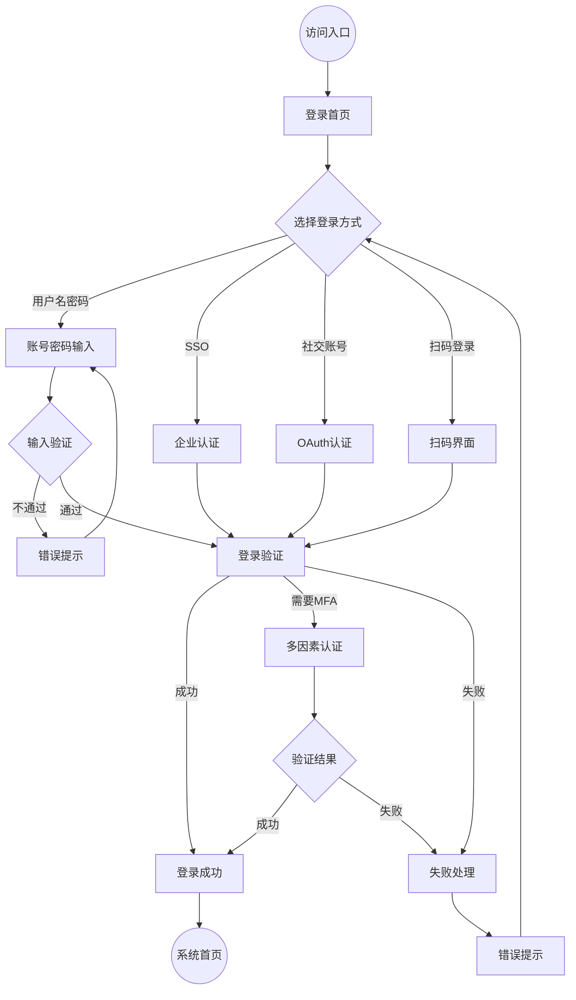
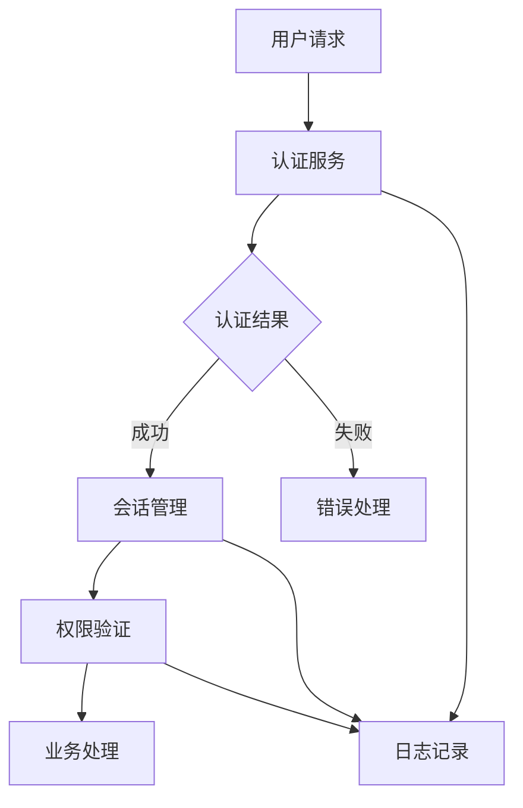

# 产品需求文档 (PRD)
## 文档信息
- 文档版本：1.0
- 最后更新：2024-03-22
- 作者：高级产品经理
- 审核人：产品总监

## 1. 产品概述
### 1.1 产品背景
Dove 登录系统是面向全球用户的大规模互联网 SaaS 产品的核心认证模块，需要支持：
- 2亿用户规模的账户管理
- 8000万并发用户的访问需求
- 全球化分布式部署和访问
- 企业级安全认证标准

在当前快速发展的云服务市场中，安全可靠的身份认证系统是产品成功的关键基础设施。本系统将为企业带来以下核心价值：
1. 业务价值
   - 提升用户访问效率，降低40%登录相关支持成本
   - 增强安全防护能力，减少90%账号安全事件
   - 支持业务全球化扩展，加速市场拓展

2. 技术价值
   - 构建统一身份认证平台，简化系统集成
   - 提供标准化认证服务，支持快速对接
   - 建立安全运营体系，保障持续运营

3. 集成要求
   - 支持与主流身份提供商的标准集成
   - 预置常用企业系统的认证接口
   - 提供完整的集成开发工具包（SDK）
   - 具备第三方系统快速适配能力

### 1.2 产品定位
#### 目标用户
1. 主要用户群体
   - 企业 IT 管理员
     * 特征：技术背景强，关注系统安全和可管理性
     * 需求：集中化管理、安全策略配置、审计跟踪
   - 企业员工用户
     * 特征：技术水平差异大，对便捷性要求高
     * 需求：快速登录、记住密码、自助服务
   - 合作伙伴用户
     * 特征：系统使用频率不固定，多设备访问
     * 需求：统一认证、跨设备同步、安全可靠
   - 客户端用户
     * 特征：对体验要求高，容忍度相对较低
     * 需求：简单直观、快速响应、问题自助解决

2. 用户特征
   - 分布在全球不同地区
     * 多语言环境
     * 不同时区访问
     * 网络条件差异
   - 需要频繁访问系统
     * 每日多次登录
     * 多终端切换
     * 长期在线需求
   - 对安全性要求高
     * 敏感数据保护
     * 身份认证可靠
     * 访问控制严格
   - 期望便捷的登录体验
     * 操作步骤简单
     * 响应速度快
     * 出错恢复容易

#### 核心价值
1. 安全性
   - 多因素认证保障
   - 企业级安全标准
   - 全面的审计能力

2. 可靠性
   - 高可用架构设计
   - 全球化服务能力
   - 稳定的性能表现

3. 易用性
   - 统一的登录入口
   - 智能的登录体验
   - 友好的错误处理

#### 主要功能
1. 认证功能
   - 用户名密码登录
   - SSO 单点登录
   - 多因素认证（MFA）
   - 社交账号登录

2. 安全功能
   - 密码策略管理
   - 登录保护策略
   - 异常行为检测
   - 审计日志记录

3. 管理功能
   - 用户会话管理
   - 配置策略管理
   - 监控告警管理

## 2. 需求概述
### 2.1 用户需求
#### 用户痛点
1. 安全性问题
   - 账号被盗风险
   - 密码管理困难
   - 安全策略执行难

2. 体验问题
   - 登录流程繁琐
   - 频繁输入凭证
   - 多系统重复登录

3. 管理问题
   - 账号管理复杂
   - 安全策略分散
   - 审计追踪困难

#### 核心诉求
1. 最终用户
   - 快速便捷的登录
   - 安全可靠的保障
   - 统一的账号体系

2. 管理员
   - 集中的管理控制
   - 灵活的策略配置
   - 完整的审计能力

#### 使用场景
1. 日常办公场景
   ```场景描述
   张工是一名企业员工，每天需要访问多个内部系统：
   - 早上到公司，一次登录即可访问所有系统
   - 中午休息后，无需重新登录即可继续工作
   - 下班后，系统自动安全登出
   ```

2. 远程办公场景
   ```场景描述
   李工在出差期间需要访问公司系统：
   - 使用笔记本通过VPN访问
   - 系统要求进行多因素认证
   - 验证身份后可以正常访问
   ```

3. 异地协作场景
   ```场景描述
   王工需要与海外团队协作：
   - 访问全球协作平台
   - 使用统一账号登录
   - 享受本地化的服务
   ```

### 2.2 功能需求
#### 必要功能（Must Have）
1. 基础认证
   - 用户名密码登录
   - 登录状态管理
   - 会话安全控制

2. 安全防护
   - 密码策略执行
   - 账号锁定保护
   - 基础审计日志

3. 用户体验
   - 记住登录状态
   - 友好错误提示
   - 基础自助服务

#### 可选功能（Should Have）
1. 高级认证
   - SSO单点登录
   - 多因素认证
   - 社交账号登录

2. 安全增强
   - 异常检测
   - 地理位置控制
   - 设备指纹验证

3. 管理功能
   - 策略配置
   - 监控告警
   - 报表分析

#### 未来规划（Could Have）
1. 智能认证
   - 生物识别登录
   - 行为认证
   - AI风险控制

2. 高级特性
   - 自适应认证
   - 零信任架构
   - 区块链支持

## 3. 功能详述
### 3.1 用户界面
#### 3.1.1 界面原型


#### 3.1.2 交互流程
1. 登录入口
   - 统一的登录页面
     * 清晰的品牌标识
     * 简洁的界面布局
     * 醒目的登录入口
   - 登录方式选择
     * 默认展示常用方式
     * 清晰的图标提示
     * 快捷切换选项
   - 智能登录提示
     * 记住上次选择
     * 自动填充建议
     * 智能默认项

2. 登录过程
   - 实时的输入验证
     * 即时字段校验
     * 清晰的错误提示
     * 密码强度指示
   - 状态反馈
     * 加载状态显示
     * 进度指示器
     * 操作确认提示
   - 安全提示
     * 安全等级展示
     * 风险提醒
     * 防钓鱼提示

3. 登录结果
   - 成功状态
     * 欢迎信息显示
     * 平滑过渡动画
     * 引导下一步
   - 失败处理
     * 错误原因说明
     * 建议解决方案
     * 备选登录方式
   - 异常处理
     * 会话超时提醒
     * 网络异常提示
     * 系统维护通知

#### 3.1.3 视觉规范
1. 布局要求
   - 响应式设计
     * 支持多种屏幕尺寸
     * 自适应布局调整
     * 关键元素优先展示
   - 视觉层次
     * 清晰的信息层级
     * 重点内容突出
     * 合理的空间利用
   - 无障碍设计
     * 适当的对比度
     * 可调整字体大小
     * 键盘操作支持

2. 交互要求
   - 即时反馈
     * 按钮状态变化
     * 输入框焦点效果
     * 加载状态指示
   - 动画效果
     * 平滑的过渡动画
     * 适度的动效设计
     * 考虑性能影响
   - 操作引导
     * 新功能引导
     * 操作提示
     * 帮助信息

3. 风格要求
   - 设计风格
     * 符合品牌调性
     * 专业可靠感
     * 现代简约美观
   - 色彩系统
     * 主色调运用
     * 功能色彩定义
     * 状态色彩规范
   - 组件规范
     * 统一的组件库
     * 一致的交互模式
     * 标准的视觉语言

### 3.2 功能模块
#### 3.2.1 用户名密码登录
1. 功能描述
   - 支持用户名/邮箱/手机号登录
   - 密码强度校验和提示
   - 图形验证码防护
   - 记住登录状态选项

2. 业务规则
   - 密码规则
     * 最小长度8位
     * 必须包含大小写字母和数字
     * 支持特殊字符
     * 不允许使用常见密码
   
   - 登录限制
     * 连续失败5次锁定
     * 锁定时间30分钟
     * 支持管理员解锁
     * IP限制和风控

3. 交互说明
   - 输入验证
     * 实时字段验证
     * 密码强度提示
     * 大小写提醒
     * 输入完成检查

   - 登录流程
     * 提交时验证
     * 显示加载状态
     * 结果即时反馈
     * 错误明确提示

4. 界面要求
   - 输入框规范
     * 合适的尺寸
     * 清晰的标签
     * 必填项标识
     * 密码显示切换

   - 按钮设计
     * 醒目的登录按钮
     * 禁用状态区分
     * 加载状态显示
     * 点击反馈效果

5. 验证规则
   - 字段验证
     * 用户名格式
     * 密码复杂度
     * 验证码正确性
     * 必填项完整性

   - 提交验证
     * 表单完整性
     * 权限验证
     * 风控校验
     * 登录频率检查

#### 3.2.2 SSO单点登录
1. 功能描述
   - 支持SAML2.0协议
   - 支持OAuth2.0协议
   - JWT Token认证
   - 自动登录跳转

2. 业务规则
   - 认证流程
     * SP发起认证
     * IdP身份验证
     * 断言验证
     * 会话创建

   - 配置要求
     * 证书管理
     * 元数据配置
     * 属性映射
     * 超时设置

3. 交互说明
   - 登录流程
     * 选择企业
     * 跳转认证
     * 等待处理
     * 自动回跳

   - 异常处理
     * 超时提示
     * 失败处理
     * 重试机制
     * 手动登录

4. 界面要求
   - 企业选择
     * 搜索功能
     * 最近选择
     * 常用企业
     * 默认设置

   - 状态展示
     * 进度提示
     * 结果反馈
     * 错误说明
     * 操作建议

5. 验证规则
   - 请求验证
     * 来源验证
     * 签名验证
     * 时间戳检查
     * 格式校验

   - 响应验证
     * 断言验证
     * 权限检查
     * 会话验证
     * 令牌校验

#### 3.2.3 多因素认证
1. 功能描述
   - 支持多种认证方式
     * 短信验证码
     * 邮件验证码
     * OTP动态密码
     * 生物识别

   - 认证流程管理
     * 认证因素配置
     * 认证顺序控制
     * 认证结果处理
     * 降级机制

2. 业务规则
   - 触发规则
     * 首次登录
     * 异地登录
     * 敏感操作
     * 管理员设置

   - 验证规则
     * 有效期限制
     * 重试次数限制
     * 冷却时间控制
     * 并发请求控制

3. 交互说明
   - 认证流程
     * 选择认证方式
     * 发送验证码
     * 输入验证
     * 结果处理

   - 异常处理
     * 发送失败处理
     * 验证失败处理
     * 超时处理
     * 降级处理

4. 界面要求
   - 认证选择
     * 清晰的方式说明
     * 简单的选择操作
     * 帮助信息提示
     * 推荐方式标识

   - 验证界面
     * 倒计时显示
     * 重发送按钮
     * 验证码输入框
     * 结果状态显示

5. 验证规则
   - 请求验证
     * 频率控制
     * 权限检查
     * 风险评估
     * 设备验证

   - 结果验证
     * 码值验证
     * 时效性检查
     * 次数控制
     * 完整性校验

## 4. 非功能需求
### 4.1 性能需求
#### 响应时间
| 操作类型 | 平均响应时间 | 95%响应时间 | 99%响应时间 |
|---------|------------|------------|------------|
| 用户名密码登录 | ≤300ms | ≤500ms | ≤800ms |
| SSO登录 | ≤500ms | ≤800ms | ≤1s |
| 多因素认证 | ≤600ms | ≤1s | ≤1.5s |
| 会话验证 | ≤50ms | ≤100ms | ≤200ms |
| Token验证 | ≤30ms | ≤50ms | ≤100ms |

#### 并发能力
| 指标项 | 基准值 | 峰值 | 说明 |
|-------|--------|-----|------|
| 总用户数 | 2亿 | - | 注册用户总量 |
| 日活用户 | 5000万 | 8000万 | 每日登录用户数 |
| 登录TPS | 10万/秒 | 20万/秒 | 每秒登录请求数 |
| 会话数 | 5000万 | 8000万 | 并发会话数量 |

#### 可用性指标
| 时间段 | 可用性要求 | 最大故障时间 |
|-------|-----------|------------|
| 工作时间 | 99.999% | 5分钟/年 |
| 非工作时间 | 99.99% | 1小时/年 |
| 计划维护 | - | 4小时/次 |

### 4.2 安全需求
#### 访问控制
1. 身份认证
   - 支持多因素认证
   - 强密码策略
   - 证书认证
   - 生物识别

2. 授权管理
   - 基于角色的访问控制
   - 最小权限原则
   - 动态权限调整
   - 会话控制

3. 安全审计
   - 操作日志记录
   - 安全事件审计
   - 异常行为检测
   - 实时告警

#### 数据安全
1. 传输安全
   - TLS 1.3加密
   - 证书管理
   - 加密算法要求
     * 对称加密：AES-256
     * 非对称加密：RSA-2048
     * 哈希算法：SHA-256

2. 存储安全
   - 敏感数据加密
   - 数据脱敏
   - 备份策略
   - 销毁机制

3. 隐私保护
   - 符合GDPR要求
   - 用户授权机制
   - 数据最小化
   - 匿名化处理

#### 安全合规
1. 等级保护
   - 符合三级等保要求
   - 安全评估认证
   - 定期安全检查
   - 漏洞管理

2. 行业标准
   - ISO27001认证
   - SOC2认证
   - PCI DSS认证
   - NIST标准

### 4.3 可用性需求
#### 错误处理机制
1. 输入错误
   - 实时验证
     * 字段格式检查
     * 即时错误提示
     * 纠正建议
   - 提交验证
     * 完整性检查
     * 业务规则验证
     * 安全检查
   - 错误恢复
     * 保留有效输入
     * 清晰的错误说明
     * 引导正确操作

2. 系统异常
   - 网络问题
     * 连接状态提示
     * 自动重试机制
     * 离线模式支持
   - 服务异常
     * 友好的错误页面
     * 问题原因说明
     * 替代方案建议
   - 会话异常
     * 超时提醒
     * 数据保护
     * 重新认证引导

3. 安全预警
   - 异常登录
     * 位置变化提醒
     * 设备变更告警
     * 频繁失败警告
   - 风险操作
     * 敏感操作确认
     * 二次验证提示
     * 安全建议

#### 反馈机制
1. 操作反馈
   - 即时反馈
     * 按钮状态变化
     * 加载进度显示
     * 成功/失败提示
   - 状态通知
     * Toast提示
     * 状态栏通知
     * 邮件通知
   - 进度指示
     * 步骤进度条
     * 操作倒计时
     * 同步状态显示

2. 帮助支持
   - 上下文帮助
     * 悬浮提示
     * 引导说明
     * 示例展示
   - 问题解决
     * 常见问题解答
     * 智能问答支持
     * 人工服务入口
   - 操作指引
     * 新功能引导
     * 操作教程
     * 快捷键提示

#### 个性化体验
1. 用户偏好
   - 界面定制
     * 主题切换
     * 布局调整
     * 字体设置
   - 操作习惯
     * 默认登录方式
     * 快捷操作设置
     * 提醒方式选择
   - 辅助功能
     * 无障碍模式
     * 高对比度主题
     * 快捷键定制

2. 智能适配
   - 场景识别
     * 设备类型适配
     * 网络状况适应
     * 使用习惯学习
   - 智能推荐
     * 登录方式建议
     * 安全等级提示
     * 个性化提醒
   - 性能优化
     * 资源预加载
     * 智能缓存
     * 按需加载

#### 易用性指标
1. 操作效率
   - 首次使用无需培训
   - 操作步骤≤3步
   - 出错率≤0.1%
   - 任务完成时间≤30秒

2. 学习曲线
   - 10分钟掌握基本操作
   - 1天熟悉全部功能
   - 提供在线帮助
   - 操作引导

3. 用户体验
   - 界面简洁清晰
   - 操作流程直观
   - 反馈及时准确
   - 错误提示友好

#### 可访问性
1. 多端适配
   - 响应式设计
   - 移动端优化
   - 不同分辨率支持
   - 主流浏览器兼容

2. 特殊需求
   - 支持屏幕阅读
   - 键盘快捷操作
   - 对比度调节
   - 字体大小调整

3. 国际化
   - 多语言支持
   - 时区适配
   - 本地化部署
   - 合规性适配

#### 可维护性
1. 监控要求
   - 全链路监控
   - 性能监控
   - 用户行为分析
   - 故障诊断

2. 运维要求
   - 配置集中管理
   - 日志集中管理
   - 备份恢复机制
   - 灾备切换

3. 升级要求
   - 零停机升级
   - 支持回滚
   - 兼容性保证
   - 平滑迁移

### 4.4 灾备要求
#### 灾备策略
1. 数据备份
   - 实时同步：核心数据多副本实时同步
   - 定时备份：配置数据每日增量备份
   - 全量备份：每周一次全量备份
   - 备份验证：每月进行恢复演练

2. 容灾方案
   - 同城双活：RPO ≤ 0，RTO ≤ 30秒
   - 异地灾备：RPO ≤ 5分钟，RTO ≤ 30分钟
   - 多活部署：至少3个区域互为备份
   - 自动切换：故障自动检测和切换

3. 应急预案
   - 预案分级：分级响应机制
   - 演练计划：每季度灾备演练
   - 恢复流程：标准化恢复流程
   - 应急响应：7x24小时应急团队

### 4.5 风险控制
#### 实施风险
1. 技术风险
   - 性能风险：性能压测不足
     * 对策：分阶段压测，建立性能基线
   - 安全风险：安全漏洞
     * 对策：安全渗透测试，定期安全评估
   - 集成风险：系统兼容性
     * 对策：分批次集成，充分测试验证

2. 进度风险
   - 需求变更：需求不稳定
     * 对策：需求变更管理，影响评估
   - 资源不足：人力资源不足
     * 对策：提前储备，建立人才池
   - 依赖延期：外部依赖延期
     * 对策：关键路径管理，预留缓冲期

3. 运营风险
   - 使用阻力：用户适应性
     * 对策：分批次推广，加强用户培训
   - 数据风险：数据迁移风险
     * 对策：增量迁移，保留回滚机制
   - 服务中断：服务可用性风险
     * 对策：灰度发布，快速回滚机制

#### 风险管理
1. 风险评估
   - 定期评估：每周风险评估
   - 动态跟踪：实时风险监控
   - 预警机制：风险预警分级

2. 控制措施
   - 预防控制：提前识别和预防
   - 检测控制：及时发现和报告
   - 纠正控制：快速响应和解决

3. 持续优化
   - 经验总结：问题复盘分析
   - 方案优化：持续改进机制
   - 知识沉淀：最佳实践积累

## 5. 数据需求
### 5.1 数据定义
#### 用户数据
1. 基础信息
   ```json
   {
     "userId": "string",      // 用户唯一标识
     "username": "string",    // 用户名
     "email": "string",       // 邮箱
     "phone": "string",       // 手机号
     "status": "enum",        // 状态：正常、锁定、禁用
     "createTime": "datetime" // 创建时间
   }
   ```

2. 认证信息
   ```json
   {
     "userId": "string",         // 用户ID
     "passwordHash": "string",   // 密码哈希
     "salt": "string",          // 盐值
     "mfaEnabled": "boolean",   // 是否启用多因素认证
     "mfaType": "enum",         // 多因素认证类型
     "lastLoginTime": "datetime" // 最后登录时间
   }
   ```

3. 会话信息
   ```json
   {
     "sessionId": "string",     // 会话ID
     "userId": "string",        // 用户ID
     "token": "string",         // 访问令牌
     "deviceInfo": "object",    // 设备信息
     "createTime": "datetime",  // 创建时间
     "expireTime": "datetime"   // 过期时间
   }
   ```

#### 配置数据
1. 系统配置
   ```json
   {
     "configId": "string",    // 配置ID
     "configType": "enum",    // 配置类型
     "configKey": "string",   // 配置键
     "configValue": "object", // 配置值
     "status": "enum",        // 状态
     "updateTime": "datetime" // 更新时间
   }
   ```

2. 安全策略
   ```json
   {
     "policyId": "string",      // 策略ID
     "policyType": "enum",      // 策略类型
     "policyName": "string",    // 策略名称
     "policyConfig": "object",  // 策略配置
     "effectiveTime": "datetime"// 生效时间
   }
   ```

#### 日志数据
1. 操作日志
   ```json
   {
     "logId": "string",      // 日志ID
     "userId": "string",     // 用户ID
     "operation": "string",  // 操作类型
     "status": "enum",      // 状态
     "ipAddress": "string", // IP地址
     "deviceInfo": "object",// 设备信息
     "createTime": "datetime"// 创建时间
   }
   ```

2. 审计日志
   ```json
   {
     "auditId": "string",    // 审计ID
     "eventType": "enum",    // 事件类型
     "eventLevel": "enum",   // 事件级别
     "eventData": "object",  // 事件数据
     "createTime": "datetime"// 创建时间
   }
   ```

### 5.2 数据流转
#### 数据流程


#### 数据处理
1. 数据采集
   - 用户输入数据
   - 系统生成数据
   - 第三方数据
   - 设备环境数据

2. 数据处理
   - 数据验证
   - 数据转换
   - 数据加密
   - 数据脱敏

3. 数据存储
   - 数据分类
   - 存储策略
   - 备份机制
   - 清理规则

#### 数据同步
1. 同步策略
   - 实时同步
   - 准实时同步
   - 定期同步
   - 触发同步

2. 同步机制
   - 消息队列
   - 数据订阅
   - API调用
   - 数据复制

## 6. 接口需求
### 6.1 外部接口
#### API接口
1. 认证接口
   ```http
   POST /api/v1/auth/login
   Content-Type: application/json

   Request:
   {
     "username": "string",  // 用户名
     "password": "string",  // 密码
     "captcha": "string",   // 验证码
     "deviceInfo": {        // 设备信息
       "deviceId": "string",
       "deviceType": "string",
       "osVersion": "string"
     }
   }

   Response:
   {
     "code": "integer",     // 状态码
     "message": "string",   // 消息
     "data": {
       "token": "string",   // 访问令牌
       "expireIn": "integer"// 过期时间
     }
   }
   ```

2. SSO接口
   ```http
   GET /api/v1/auth/sso
   Content-Type: application/json

   Request:
   {
     "idpId": "string",    // 身份提供商ID
     "samlRequest": "string"// SAML请求
   }

   Response:
   {
     "code": "integer",    // 状态码
     "message": "string",  // 消息
     "data": {
       "redirectUrl": "string"// 重定向URL
     }
   }
   ```

3. 会话接口
   ```http
   GET /api/v1/session/verify
   Authorization: Bearer {token}

   Response:
   {
     "code": "integer",    // 状态码
     "message": "string",  // 消息
     "data": {
       "valid": "boolean", // 是否有效
       "userId": "string", // 用户ID
       "permissions": ["string"]// 权限列表
     }
   }
   ```

#### 集成接口
1. 身份提供商
   - SAML2.0协议
   - OAuth2.0协议
   - OpenID Connect
   - 自定义协议

2. 消息服务
   - 短信服务
   - 邮件服务
   - 推送服务
   - 通知服务

3. 风控服务
   - 设备指纹
   - 行为分析
   - 风险评估
   - 实时防护

### 6.2 内部接口
#### 微服务接口
1. 用户服务
   ```http
   GET /internal/user/info
   Authorization: Internal {token}

   Request:
   {
     "userId": "string"    // 用户ID
   }

   Response:
   {
     "code": "integer",    // 状态码
     "message": "string",  // 消息
     "data": {
       "userInfo": "object"// 用户信息
     }
   }
   ```

2. 配置服务
   ```http
   GET /internal/config/security
   Authorization: Internal {token}

   Response:
   {
     "code": "integer",    // 状态码
     "message": "string",  // 消息
     "data": {
       "policies": ["object"]// 安全策略列表
     }
   }
   ```

#### 监控接口
1. 健康检查
   ```http
   GET /internal/health
   
   Response:
   {
     "status": "string",   // 状态：UP、DOWN
     "components": {       // 组件状态
       "database": "string",
       "cache": "string",
       "mq": "string"
     }
   }
   ```

2. 指标采集
   ```http
   GET /internal/metrics
   
   Response:
   {
     "metrics": {
       "qps": "number",    // 每秒查询数
       "latency": "object",// 延迟统计
       "errors": "object", // 错误统计
       "sessions": "number"// 会话数量
     }
   }
   ```

### 6.3 接口规范
#### 通用要求
1. 请求规范
   - 使用HTTPS协议
   - RESTful风格
   - 版本控制
   - 参数验证

2. 响应规范
   - 统一响应格式
   - 错误码规范
   - 国际化支持
   - 性能优化

3. 安全规范
   - 认证鉴权
   - 参数加密
   - 防重放攻击
   - 访问控制

## 7. 约束与依赖
### 7.1 技术约束
#### 开发约束
1. 技术栈要求
   - 前端框架：React 18+
   - 后端框架：Spring Cloud
   - 数据库：MySQL 8.0+
   - 缓存：Redis 6.0+

2. 架构要求
   - 微服务架构
   - 容器化部署
   - 云原生支持
   - 服务网格

3. 规范要求
   - 代码规范
   - API规范
   - 安全规范
   - 测试规范

#### 环境约束
1. 部署环境
   - Kubernetes集群
   - 阿里云基础设施
   - 全球多区域部署
   - 容灾备份要求

2. 网络环境
   - 专线连接
   - VPN支持
   - CDN加速
   - 防火墙策略

3. 监控环境
   - APM工具
   - 日志中心
   - 监控告警
   - 运维平台

### 7.2 业务约束
#### 组织约束
1. 团队要求
   - 开发团队规模
   - 技能要求
   - 协作方式
   - 响应时间

2. 流程要求
   - 开发流程
   - 发布流程
   - 变更流程
   - 审批流程

3. 管理要求
   - 项目管理
   - 质量管理
   - 风险管理
   - 成本管理

#### 时间约束
1. 项目周期
   - 总体周期：3个月
   - 开发周期：2个月
   - 测试周期：2周
   - 上线周期：2周

2. 关键时间点
   - 需求确认：2025.2.10
   - 开发完成：2025.2.23
   - 测试完成：2025.2.27
   - 正式上线：2025.2.28

### 7.3 外部依赖
#### 系统依赖
1. 内部系统
   - 用户中心
   - 权限系统
   - 消息系统
   - 监控系统

2. 外部系统
   - 短信服务商
   - 邮件服务商
   - CDN服务商
   - 云服务商

#### 资源依赖
1. 基础设施
   - 服务器资源
   - 存储资源
   - 网络资源
   - 安全设备

2. 软件资源
   - 开发工具
   - 测试工具
   - 运维工具
   - 监控工具

### 7.3 验收标准
#### 功能验收
1. 基础功能
   - 用户名密码登录
     * 标准：支持多种登录方式，响应时间≤500ms
     * 验证：功能测试+性能测试
     * 完成标志：测试报告通过
   
   - 单点登录(SSO)
     * 标准：支持主流SSO协议，跳转时间≤1s
     * 验证：集成测试+兼容性测试
     * 完成标志：测试报告通过

2. 安全功能
   - 多因素认证
     * 标准：支持至少3种认证方式，配置灵活
     * 验证：功能测试+安全测试
     * 完成标志：安全评估通过

   - 安全审计
     * 标准：100%记录关键操作，支持实时告警
     * 验证：审计测试+合规检查
     * 完成标志：合规报告通过

#### 性能验收
1. 并发能力
   - 标准：支持8000万并发用户
   - 验证方法：压力测试
   - 验收条件：
     * CPU使用率≤70%
     * 内存使用率≤80%
     * 响应时间符合SLA

2. 可用性
   - 标准：99.999%可用性
   - 验证方法：长期运行测试
   - 验收条件：
     * 连续运行30天无重大故障
     * 故障自动恢复时间≤5分钟
     * 数据零丢失

#### 运维验收
1. 监控能力
   - 标准：全方位监控覆盖
   - 验证方法：运维演练
   - 验收条件：
     * 监控指标完整
     * 告警及时准确
     * 问题定位准确

2. 运维能力
   - 标准：支持自动化运维
   - 验证方法：运维测试
   - 验收条件：
     * 自动化部署成功
     * 配置变更可追踪
     * 具备回滚能力

## 8. 附录
### 8.1 术语表
| 术语 | 定义 | 说明 |
|-----|------|-----|
| SSO | Single Sign-On | 单点登录，实现一次登录，访问所有相关系统 |
| MFA | Multi-Factor Authentication | 多因素认证，通过两个或以上的认证因素实现身份验证 |
| SAML | Security Assertion Markup Language | 安全断言标记语言，用于在身份提供者和服务提供者之间交换身份验证和授权数据 |
| OAuth | Open Authorization | 开放授权协议，允许用户授权第三方应用访问其资源 |
| JWT | JSON Web Token | 一种开放标准的令牌格式，用于在各方之间安全地传输信息 |

### 8.2 参考文档
1. 技术标准
   - 《OAuth 2.0 规范》
   - 《SAML 2.0 规范》
   - 《JWT 规范》
   - 《REST API 设计规范》

2. 安全标准
   - 《OWASP 安全指南》
   - 《等级保护 2.0 标准》
   - 《GDPR 合规要求》
   - 《ISO 27001 标准》

3. 内部规范
   - 《技术架构规范》
   - 《安全开发规范》
   - 《API 接口规范》
   - 《UI 设计规范》

### 8.3 变更记录
| 版本 | 日期 | 作者 | 变更描述 |
|-----|------|------|---------|
| 1.0 | 2024-03-20 | 产品经理 | 初始版本创建 |
| 1.1 | 2024-03-21 | 产品经理 | 完善功能需求 |
| 1.2 | 2024-03-22 | 产品经理 | 更新接口规范 |

### 8.4 评审记录
| 评审日期 | 评审人 | 评审结果 | 主要反馈 |
|---------|--------|----------|---------|
| 2024-03-20 | 架构师 | 通过 | 技术方案可行 |
| 2024-03-21 | 安全专家 | 通过 | 安全要求完善 |
| 2024-03-22 | 产品总监 | 通过 | 符合产品规划 |

### 8.5 文档说明
1. 文档维护
   - 本文档由产品经理负责维护
   - 每季度定期评审更新
   - 重大变更需即时更新

2. 使用说明
   - 作为开发团队实施依据
   - 作为测试团队验收依据
   - 作为运维团队运营依据

3. 版权声明
   - 本文档为公司内部文档
   - 未经许可不得外传
   - 版权所有侵权必究

-- 文档结束 -- 