# 高层设计文档 (HLD)
## 文档信息
- 文档版本：1.0
- 最后更新：2024-03-22
- 作者：高级架构师
- 审核人：技术总监
- 状态：草稿

## 1. 设计概述
### 1.1 设计目标
#### 总体目标
构建一个安全、高性能、高可用的全球化登录系统，支持：
- 2亿用户规模的账户管理
- 8000万并发用户的访问需求
- 全球化分布式部署和访问
- 企业级安全认证标准

#### 具体目标
1. 性能目标
   - 登录响应时间：99.9%请求 < 500ms
   - 并发处理能力：20万 TPS
   - 全球访问延迟：< 1s
   - 系统吞吐量：峰值 8000万 QPS

2. 可用性目标
   - 工作时间（7:00-19:00）：99.999%
   - 非工作时间：99.99%
   - 故障恢复时间：< 5分钟
   - 数据一致性：最终一致性

3. 安全目标
   - 符合等保三级要求
   - 支持多因素认证
   - 全链路数据加密
   - 完整审计日志

### 1.2 设计原则
1. 高可用原则
   - 无单点故障
   - 故障自动恢复
   - 多区域容灾
   - 平滑扩缩容

2. 安全性原则
   - 纵深防御
   - 最小权限
   - 安全审计
   - 数据加密

3. 可扩展原则
   - 水平扩展
   - 模块化设计
   - 服务解耦
   - 异步处理

4. 可维护原则
   - 统一监控
   - 集中日志
   - 配置中心
   - 版本控制

### 1.3 关键设计决策
1. 架构选型
   - 采用微服务架构
   - 基于Spring Cloud生态
   - 容器化部署
   - 服务网格治理

2. 技术选型
   - 开发框架：Spring Cloud Alibaba
   - 数据存储：MaridDb + Redis
   - 消息队列：Kafka
   - 服务网格：Istio

3. 部署策略
   - 多区域部署
   - 蓝绿发布
   - 灰度升级
   - 容器编排

### 1.4 设计约束
1. 技术约束
   - 必须使用开源技术
   - 支持云原生部署
   - 满足安全合规
   - 支持平滑升级

2. 业务约束
   - 向后兼容性
   - 多租户隔离
   - 数据合规性
   - 审计追踪

3. 资源约束
   - 基础设施成本
   - 运维人力投入
   - 开发周期
   - 性能边界 

## 2. 领域架构
### 2.1 领域模型
#### 核心域
1. 认证域（Authentication）
   - 聚合根：用户认证（UserAuthentication）
   - 实体：
     * 认证凭证（Credential）
     * 认证因素（AuthFactor）
     * 认证会话（AuthSession）
   - 值对象：
     * 密码策略（PasswordPolicy）
     * 认证方式（AuthMethod）
     * 认证状态（AuthStatus）
   - 领域服务：
     * 认证服务（AuthenticationService）
     * 会话管理服务（SessionService）
     * 凭证验证服务（CredentialValidationService）

2. 用户域（User）
   - 聚合根：用户账户（UserAccount）
   - 实体：
     * 用户档案（UserProfile）
     * 用户设备（UserDevice）
     * 登录历史（LoginHistory）
   - 值对象：
     * 用户状态（UserStatus）
     * 账户类型（AccountType）
     * 设备信息（DeviceInfo）
   - 领域服务：
     * 用户管理服务（UserManagementService）
     * 设备管理服务（DeviceManagementService）

#### 支撑域
1. 安全域（Security）
   - 聚合根：安全策略（SecurityPolicy）
   - 实体：
     * 风险控制（RiskControl）
     * 安全审计（SecurityAudit）
     * 访问控制（AccessControl）
   - 值对象：
     * 风险等级（RiskLevel）
     * 审计类型（AuditType）
     * 控制策略（ControlPolicy）
   - 领域服务：
     * 风险评估服务（RiskAssessmentService）
     * 审计服务（AuditService）

2. 配置域（Configuration）
   - 聚合根：系统配置（SystemConfiguration）
   - 实体：
     * 租户配置（TenantConfig）
     * 功能开关（FeatureToggle）
     * 限流配置（RateLimitConfig）
   - 值对象：
     * 配置项（ConfigItem）
     * 配置状态（ConfigStatus）
   - 领域服务：
     * 配置管理服务（ConfigurationService）
     * 租户管理服务（TenantManagementService）

#### 通用域
1. 通知域（Notification）
   - 聚合根：通知消息（Notification）
   - 实体：
     * 消息模板（MessageTemplate）
     * 发送记录（SendRecord）
   - 值对象：
     * 消息类型（MessageType）
     * 发送状态（SendStatus）
   - 领域服务：
     * 消息发送服务（MessageService）
     * 模板管理服务（TemplateService）

### 2.2 领域边界
#### 上下文映射
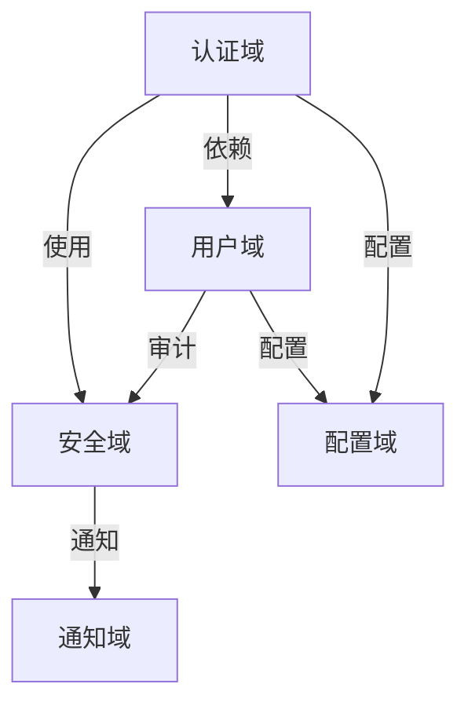

#### 集成模式
1. 合作关系（Partnership）
   - 认证域与用户域
   - 认证域与安全域

2. 防腐层模式（ACL）
   - 配置域与外部系统
   - 通知域与消息服务

3. 开放主机服务（OHS）
   - 认证域对外服务
   - 用户域对外服务

### 2.3 领域事件
#### 核心事件
1. 认证事件
   - 认证开始（AuthenticationStarted）
   - 认证成功（AuthenticationSucceeded）
   - 认证失败（AuthenticationFailed）
   - 会话创建（SessionCreated）
   - 会话过期（SessionExpired）

2. 用户事件
   - 用户创建（UserCreated）
   - 用户更新（UserUpdated）
   - 密码变更（PasswordChanged）
   - 状态变更（StatusChanged）

#### 集成事件
1. 安全事件
   - 风险检测（RiskDetected）
   - 策略违反（PolicyViolated）
   - 审计记录（AuditLogged）

2. 通知事件
   - 验证码发送（VerificationCodeSent）
   - 安全警告（SecurityAlertSent）
   - 状态通知（StatusNotificationSent）

### 2.4 领域规则
#### 业务规则
1. 认证规则
   - 密码复杂度要求
   - 登录失败处理
   - 会话管理策略
   - 多因素认证流程

2. 安全规则
   - 访问控制策略
   - 风险控制阈值
   - 审计日志要求
   - 数据加密标准

#### 约束规则
1. 不变量
   - 用户标识唯一性
   - 会话状态一致性
   - 审计日志完整性

2. 业务约束
   - 并发登录限制
   - 地理位置限制
   - 设备信任等级
   - 操作频率限制 

## 3. 技术架构
### 3.1 整体架构
#### 架构视图
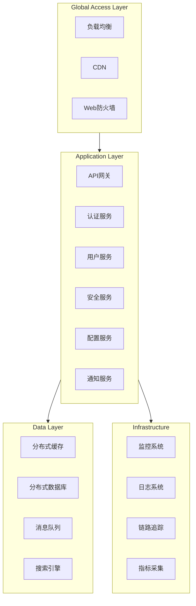

#### 技术栈选型
1. 接入层
   - 负载均衡：阿里云SLB
   - CDN：阿里云CDN
   - WAF：阿里云WAF

2. 应用层
   - 微服务框架：Spring Cloud Alibaba
   - API网关：Spring Cloud Gateway
   - 服务注册：Nacos
   - 配置中心：Nacos

3. 数据层
   - 关系型数据库：MariaDB
   - 分布式缓存：Redis 6.0
   - 消息队列：RocketMQ 4.9
   - 搜索引擎：Elasticsearch 7.x

4. 基础设施
   - 容器编排：Kubernetes 1.24
   - 服务网格：Istio 1.12
   - 监控系统：Prometheus + Grafana
   - 链路追踪：SkyWalking

### 3.2 系统部署
#### 部署架构
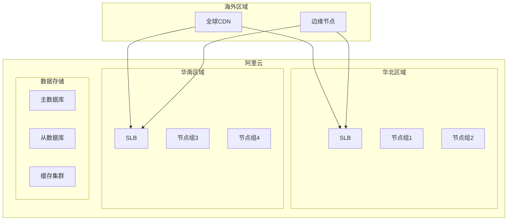

#### 部署策略
1. 多区域部署
   - 同城双活
   - 异地容灾
   - 就近接入
   - 数据同步

2. 容器化部署
   - Kubernetes集群
   - 服务网格
   - 自动扩缩容
   - 健康检查

3. 发布策略
   - 蓝绿发布
   - 金丝雀发布
   - 灰度发布
   - 回滚机制

### 3.3 技术组件
#### 核心组件
1. Spring Cloud Alibaba
   - Nacos：服务注册与配置
   - Sentinel：限流熔断
   - Seata：分布式事务
   - RocketMQ：消息队列

2. 数据存储
   - MySQL：主从复制
   - Redis：集群模式
   - Elasticsearch：分片副本
   - MongoDB：分片集群

3. 基础设施
   - Kubernetes：容器编排
   - Istio：服务网格
   - Prometheus：监控告警
   - ELK：日志分析

#### 组件关系
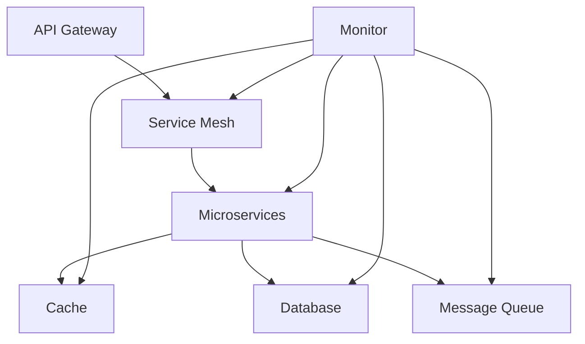

### 3.4 接口设计
#### API设计
1. RESTful API
   - 资源命名规范
   - HTTP方法语义
   - 状态码规范
   - 版本控制

2. 接口规范
   - 请求/响应格式
   - 错误处理
   - 参数验证
   - 安全控制

#### 内部通信
1. 同步调用
   - REST API
   - gRPC
   - Dubbo
   - Feign

2. 异步通信
   - 消息队列
   - 事件总线
   - WebSocket
   - 发布订阅

### 3.5 安全架构
#### 安全框架
1. 认证授权
   - Spring Security
   - OAuth2.0
   - JWT
   - RBAC

2. 传输安全
   - TLS 1.3
   - HTTPS
   - 证书管理
   - 加密算法

3. 数据安全
   - 加密存储
   - 脱敏处理
   - 访问控制
   - 审计日志

#### 安全策略
1. 接入安全
   - WAF防护
   - DDoS防护
   - 入侵检测
   - 漏洞扫描

2. 运行安全
   - 容器安全
   - 网络隔离
   - 密钥管理
   - 漏洞修复 

## 4. 核心模块设计
### 4.1 认证模块
#### 模块架构
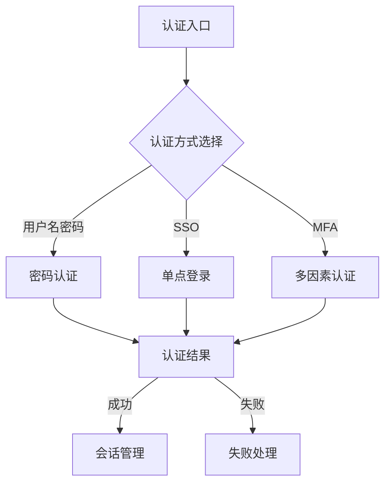

#### 核心流程
1. 密码认证流程
   ```mermaid
   sequenceDiagram
       participant C as Client
       participant G as Gateway
       participant A as Auth
       participant U as User
       participant S as Security
       
       C->>G: 提交登录请求
       G->>A: 转发认证请求
       A->>U: 获取用户信息
       A->>S: 校验安全策略
       S-->>A: 返回校验结果
       A-->>G: 返回认证结果
       G-->>C: 响应结果
   ```

2. SSO认证流程
   - SP发起流程
   - IdP认证流程
   - 断言验证流程
   - 会话创建流程

3. MFA认证流程
   - 首因素验证
   - 二次验证触发
   - 验证码发送
   - 验证码校验

#### 关键算法
1. 密码处理
   ```java
   public class PasswordProcessor {
       // 密码加密
       public String encrypt(String password, String salt) {
           return PBKDF2(password, salt, 10000, 256);
       }
       
       // 密码验证
       public boolean verify(String password, String hash, String salt) {
           String newHash = encrypt(password, salt);
           return SecureEquals(newHash, hash);
       }
   }
   ```

2. 令牌生成
   ```java
   public class TokenGenerator {
       // JWT令牌生成
       public String generateToken(UserInfo user, Claims claims) {
           return JWT.builder()
                  .subject(user.getId())
                  .claims(claims)
                  .expiration(expireTime)
                  .sign(algorithm);
       }
   }
   ```

### 4.2 会话模块
#### 模块架构
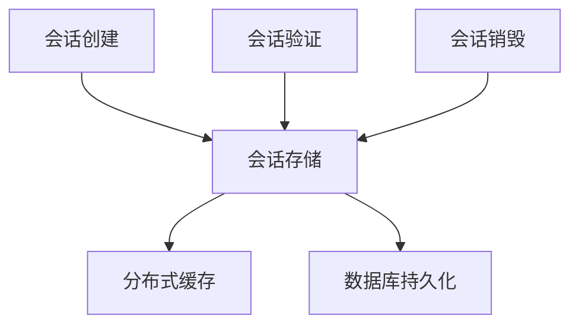

#### 核心流程
1. 会话管理
   - 会话创建
   - 会话刷新
   - 会话验证
   - 会话清理

2. 状态同步
   - 集群同步
   - 跨区域同步
   - 状态一致性
   - 冲突解决

#### 数据结构
1. 会话信息
   ```json
   {
     "sessionId": "string",
     "userId": "string",
     "loginTime": "timestamp",
     "expireTime": "timestamp",
     "deviceInfo": {
       "deviceId": "string",
       "deviceType": "string",
       "location": "string"
     },
     "securityContext": {
       "permissions": ["string"],
       "roles": ["string"]
     }
   }
   ```

2. 令牌结构
   ```json
   {
     "header": {
       "alg": "RS256",
       "typ": "JWT"
     },
     "payload": {
       "sub": "userId",
       "iat": "timestamp",
       "exp": "timestamp",
       "scope": ["string"]
     }
   }
   ```

### 4.3 安全模块
#### 模块架构
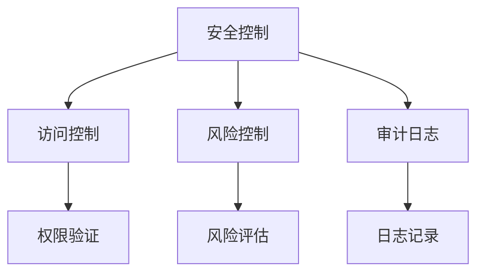

#### 核心流程
1. 风险控制
   - 实时检测
   - 规则匹配
   - 风险评分
   - 处置动作

2. 审计日志
   - 日志采集
   - 实时分析
   - 告警触发
   - 日志归档

#### 安全策略
1. 访问控制
   ```java
   public class AccessControl {
       // 权限检查
       public boolean checkPermission(User user, Resource resource, Action action) {
           // 1. 角色检查
           if (!hasRole(user, requiredRole)) {
               return false;
           }
           
           // 2. 权限检查
           if (!hasPermission(user, resource, action)) {
               return false;
           }
           
           // 3. 策略检查
           return checkPolicy(user, resource, action);
       }
   }
   ```

2. 风险控制
   ```java
   public class RiskControl {
       // 风险评估
       public RiskLevel assessRisk(LoginContext context) {
           // 1. 位置检查
           if (isUnusualLocation(context.getLocation())) {
               return RiskLevel.HIGH;
           }
           
           // 2. 设备检查
           if (isUnknownDevice(context.getDevice())) {
               return RiskLevel.MEDIUM;
           }
           
           // 3. 行为检查
           return checkBehavior(context);
       }
   }
   ```

### 4.4 配置模块
#### 模块架构
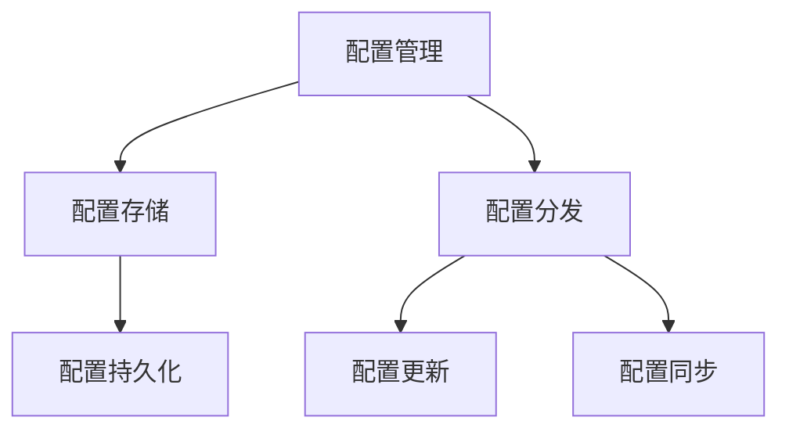

#### 核心流程
1. 配置管理
   - 配置读取
   - 配置验证
   - 配置更新
   - 配置同步

2. 变更处理
   - 变更检测
   - 变更通知
   - 变更应用
   - 变更回滚

#### 配置项
1. 系统配置
   ```json
   {
     "system": {
       "session": {
         "timeout": 3600,
         "maxConcurrent": 3
       },
       "password": {
         "minLength": 8,
         "complexity": "HIGH",
         "expireDays": 90
       },
       "security": {
         "lockThreshold": 5,
         "lockDuration": 1800
       }
     }
   }
   ```

2. 租户配置
   ```json
   {
     "tenant": {
       "features": {
         "mfa": true,
         "sso": true,
         "socialLogin": false
       },
       "limits": {
         "userQuota": 10000,
         "apiQps": 1000
       },
       "security": {
         "ipWhitelist": ["string"],
         "accessControl": "object"
       }
     }
   }
   ``` 

## 5. 数据架构
### 5.1 数据模型
#### 核心实体
1. 用户实体
   ```sql
   CREATE TABLE users (
       id VARCHAR(32) PRIMARY KEY,
       username VARCHAR(64) NOT NULL UNIQUE,
       email VARCHAR(128) NOT NULL UNIQUE,
       phone VARCHAR(20),
       status ENUM('ACTIVE', 'LOCKED', 'DISABLED'),
       created_at TIMESTAMP NOT NULL,
       updated_at TIMESTAMP NOT NULL,
       INDEX idx_email (email),
       INDEX idx_phone (phone)
   );
   ```

2. 认证实体
   ```sql
   CREATE TABLE credentials (
       id VARCHAR(32) PRIMARY KEY,
       user_id VARCHAR(32) NOT NULL,
       auth_type ENUM('PASSWORD', 'SSO', 'MFA'),
       credential_key VARCHAR(128) NOT NULL,
       credential_value TEXT NOT NULL,
       salt VARCHAR(32),
       created_at TIMESTAMP NOT NULL,
       updated_at TIMESTAMP NOT NULL,
       FOREIGN KEY (user_id) REFERENCES users(id),
       INDEX idx_user_type (user_id, auth_type)
   );
   ```

3. 会话实体
   ```sql
   CREATE TABLE sessions (
       id VARCHAR(32) PRIMARY KEY,
       user_id VARCHAR(32) NOT NULL,
       token VARCHAR(256) NOT NULL,
       device_info JSON,
       ip_address VARCHAR(64),
       location VARCHAR(128),
       created_at TIMESTAMP NOT NULL,
       expired_at TIMESTAMP NOT NULL,
       FOREIGN KEY (user_id) REFERENCES users(id),
       INDEX idx_token (token),
       INDEX idx_user_session (user_id, expired_at)
   );
   ```

#### 关联实体
1. 租户实体
   ```sql
   CREATE TABLE tenants (
       id VARCHAR(32) PRIMARY KEY,
       name VARCHAR(128) NOT NULL,
       status ENUM('ACTIVE', 'DISABLED'),
       config JSON,
       created_at TIMESTAMP NOT NULL,
       updated_at TIMESTAMP NOT NULL
   );
   ```

2. 用户租户关系
   ```sql
   CREATE TABLE user_tenant_relations (
       id VARCHAR(32) PRIMARY KEY,
       user_id VARCHAR(32) NOT NULL,
       tenant_id VARCHAR(32) NOT NULL,
       role VARCHAR(32) NOT NULL,
       created_at TIMESTAMP NOT NULL,
       FOREIGN KEY (user_id) REFERENCES users(id),
       FOREIGN KEY (tenant_id) REFERENCES tenants(id),
       UNIQUE KEY uk_user_tenant (user_id, tenant_id)
   );
   ```

#### 配置实体
1. 系统配置
   ```sql
   CREATE TABLE system_configs (
       id VARCHAR(32) PRIMARY KEY,
       config_key VARCHAR(64) NOT NULL,
       config_value JSON NOT NULL,
       description TEXT,
       created_at TIMESTAMP NOT NULL,
       updated_at TIMESTAMP NOT NULL,
       UNIQUE KEY uk_config_key (config_key)
   );
   ```

2. 租户配置
   ```sql
   CREATE TABLE tenant_configs (
       id VARCHAR(32) PRIMARY KEY,
       tenant_id VARCHAR(32) NOT NULL,
       config_key VARCHAR(64) NOT NULL,
       config_value JSON NOT NULL,
       created_at TIMESTAMP NOT NULL,
       updated_at TIMESTAMP NOT NULL,
       FOREIGN KEY (tenant_id) REFERENCES tenants(id),
       UNIQUE KEY uk_tenant_config (tenant_id, config_key)
   );
   ```

### 5.2 存储设计
#### 存储分层
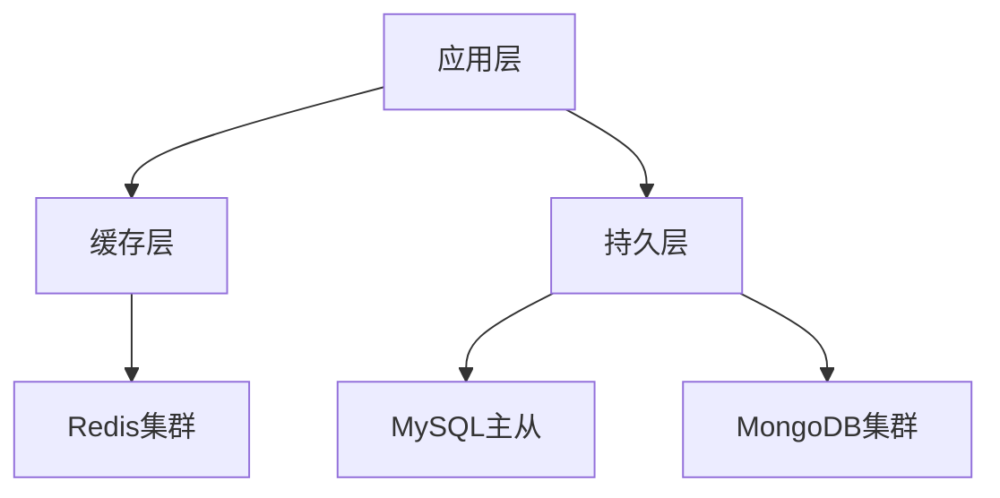

1. 缓存层设计
   - 热点数据缓存
     * 用户信息
     * 会话数据
     * 配置信息
   - 分布式缓存
     * Redis Cluster
     * 多级缓存
     * 数据一致性

2. 持久层设计
   - 关系型数据库
     * 主从复制
     * 读写分离
     * 分库分表
   - 文档型数据库
     * 日志存储
     * 审计数据
     * 历史记录

#### 数据分布
1. 分片策略
   ```java
   public class ShardingStrategy {
       // 用户数据分片
       public int getUserSharding(String userId) {
           return hash(userId) % TOTAL_SHARDS;
       }
       
       // 租户数据分片
       public int getTenantSharding(String tenantId) {
           return hash(tenantId) % TOTAL_SHARDS;
       }
   }
   ```

2. 路由策略
   ```java
   public class RoutingStrategy {
       // 读写分离路由
       public DataSource route(String sql) {
           if (isRead(sql)) {
               return getReadDataSource();
           }
           return getMasterDataSource();
       }
   }
   ```

### 5.3 数据访问
#### 访问模式
1. 读取模式
   ```java
   public interface DataAccessPattern {
       // 缓存优先
       default <T> T readThroughCache(String key, Supplier<T> loader) {
           T value = cache.get(key);
           if (value == null) {
               value = loader.get();
               cache.set(key, value);
           }
           return value;
       }
       
       // 写入模式
       default void writeWithCache(String key, Object value) {
           database.save(value);
           cache.delete(key);
       }
   }
   ```

2. 更新模式
   ```java
   public interface UpdatePattern {
       // 最终一致性更新
       default void eventualConsistency(String key, UpdateFunction func) {
           database.update(key, func);
           asyncDeleteCache(key);
       }
       
       // 强一致性更新
       default void strongConsistency(String key, UpdateFunction func) {
           transaction.begin();
           try {
               database.update(key, func);
               cache.delete(key);
               transaction.commit();
           } catch (Exception e) {
               transaction.rollback();
               throw e;
           }
       }
   }
   ```

#### 缓存策略
1. 缓存键设计
   ```java
   public class CacheKeyGenerator {
       // 用户缓存键
       public String getUserKey(String userId) {
           return String.format("user:%s", userId);
       }
       
       // 会话缓存键
       public String getSessionKey(String sessionId) {
           return String.format("session:%s", sessionId);
       }
       
       // 配置缓存键
       public String getConfigKey(String tenantId, String key) {
           return String.format("config:%s:%s", tenantId, key);
       }
   }
   ```

2. 缓存失效策略
   ```java
   public class CacheEvictionStrategy {
       // TTL策略
       public void setTTL(String key, Object value, Duration ttl) {
           cache.set(key, value, ttl);
       }
       
       // LRU策略
       public void setLRU(String key, Object value) {
           cache.set(key, value, LRU_POLICY);
       }
   }
   ```

### 5.4 数据同步
#### 同步策略
1. 实时同步
   ```mermaid
   sequenceDiagram
       participant A as 应用服务
       participant M as 消息队列
       participant B as 数据同步服务
       participant D as 目标存储
       
       A->>M: 发送变更消息
       M->>B: 消费消息
       B->>D: 执行同步
       D-->>B: 同步结果
       B-->>M: 确认消息
   ```

2. 批量同步
   ```mermaid
   sequenceDiagram
       participant S as 源存储
       participant B as 同步作业
       participant D as 目标存储
       
       B->>S: 增量扫描
       S-->>B: 返回数据
       B->>D: 批量写入
       D-->>B: 写入结果
   ```

#### 一致性保证
1. 数据一致性
   ```java
   public class ConsistencyGuarantee {
       // 检查点机制
       public void checkpoint(String syncId, long position) {
           database.saveCheckpoint(syncId, position);
       }
       
       // 数据校验
       public boolean verify(String syncId, String checksum) {
           String sourceChecksum = calculateChecksum(getSourceData(syncId));
           return sourceChecksum.equals(checksum);
       }
   }
   ```

2. 冲突解决
   ```java
   public class ConflictResolver {
       // 版本冲突
       public void resolveVersion(String key, Object value1, Object value2) {
           if (value1.version > value2.version) {
               return value1;
           }
           return value2;
       }
       
       // 合并冲突
       public void resolveMerge(String key, Object value1, Object value2) {
           return mergeStrategy.merge(value1, value2);
       }
   }
   ```

## 6. 技术实现
### 6.1 开发规范
#### 代码规范
1. 命名规范
   ```java
   // 1. 包命名
   package com.dove.auth.core;
   package com.dove.auth.service;
   package com.dove.auth.api;
   
   // 2. 类命名
   public class UserAuthenticationService {}
   public interface AuthenticationProvider {}
   public enum AuthenticationType {}
   
   // 3. 方法命名
   public class AuthenticationService {
       public void authenticate(Credentials credentials) {}
       public boolean validateToken(String token) {}
       public void revokeAccess(String userId) {}
   }
   ```

2. 注释规范
   ```java
   /**
    * 认证服务实现类
    * 
    * @author dove-team
    * @version 1.0
    */
   public class AuthenticationServiceImpl {
       /**
        * 执行认证
        *
        * @param credentials 认证凭证
        * @return 认证结果
        * @throws AuthenticationException 认证失败异常
        */
       public AuthResult authenticate(Credentials credentials) {}
   }
   ```

#### 异常处理
1. 异常体系
   ```java
   // 基础异常
   public class AuthException extends RuntimeException {
       private String errorCode;
       private String errorMessage;
   }
   
   // 业务异常
   public class AuthenticationException extends AuthException {
       public static final String ERROR_INVALID_CREDENTIALS = "AUTH-001";
       public static final String ERROR_ACCOUNT_LOCKED = "AUTH-002";
   }
   
   // 系统异常
   public class SystemException extends AuthException {
       public static final String ERROR_DATABASE = "SYS-001";
       public static final String ERROR_CACHE = "SYS-002";
   }
   ```

2. 异常处理策略
   ```java
   @ControllerAdvice
   public class GlobalExceptionHandler {
       @ExceptionHandler(AuthenticationException.class)
       public ResponseEntity<ErrorResponse> handleAuthException(AuthenticationException e) {
           return ResponseEntity.status(HttpStatus.UNAUTHORIZED)
                              .body(new ErrorResponse(e.getErrorCode(), e.getMessage()));
       }
       
       @ExceptionHandler(SystemException.class)
       public ResponseEntity<ErrorResponse> handleSystemException(SystemException e) {
           log.error("System error", e);
           return ResponseEntity.status(HttpStatus.INTERNAL_SERVER_ERROR)
                              .body(new ErrorResponse(e.getErrorCode(), "System error"));
       }
   }
   ```

### 6.2 性能优化
#### 缓存优化
1. 多级缓存
   ```java
   public class MultiLevelCache {
       private Cache localCache;
       private Cache distributedCache;
       
       public <T> T get(String key, Class<T> type) {
           // 1. 查本地缓存
           T value = localCache.get(key);
           if (value != null) {
               return value;
           }
           
           // 2. 查分布式缓存
           value = distributedCache.get(key);
           if (value != null) {
               localCache.set(key, value);
           }
           
           return value;
       }
   }
   ```

2. 缓存预热
   ```java
   public class CacheWarmer {
       @PostConstruct
       public void warmUp() {
           // 1. 加载系统配置
           loadSystemConfigs();
           
           // 2. 加载热点数据
           loadHotData();
           
           // 3. 建立本地缓存
           buildLocalCache();
       }
   }
   ```

#### SQL优化
1. 索引优化
   ```sql
   -- 复合索引
   CREATE INDEX idx_user_status_created ON users(status, created_at);
   
   -- 覆盖索引
   CREATE INDEX idx_session_info ON sessions(user_id, token, expired_at);
   
   -- 分区索引
   CREATE INDEX idx_login_time ON login_history(login_time) LOCAL;
   ```

2. 查询优化
   ```java
   public class QueryOptimizer {
       // 分页查询优化
       public Page<User> findUsers(UserQuery query) {
           return userMapper.selectPage()
                          .select("id, username, email")
                          .where(query.getConditions())
                          .orderBy("created_at DESC")
                          .limit(query.getOffset(), query.getLimit());
       }
       
       // 批量操作优化
       public void batchUpdate(List<User> users) {
           userMapper.batchUpdate()
                    .batchSize(1000)
                    .execute(users);
       }
   }
   ```

### 6.3 安全实现
#### 密码安全
1. 密码加密
   ```java
   public class PasswordEncoder {
       // 密码加密
       public String encode(String password) {
           String salt = generateSalt();
           byte[] hash = pbkdf2(password.getBytes(), salt.getBytes(), 10000, 256);
           return String.format("%s$%s", salt, Base64.encode(hash));
       }
       
       // 密码验证
       public boolean matches(String password, String encodedPassword) {
           String[] parts = encodedPassword.split("\\$");
           String salt = parts[0];
           byte[] hash = Base64.decode(parts[1]);
           byte[] testHash = pbkdf2(password.getBytes(), salt.getBytes(), 10000, 256);
           return MessageDigest.isEqual(hash, testHash);
       }
   }
   ```

2. 密码策略
   ```java
   public class PasswordPolicy {
       // 密码强度检查
       public void validateStrength(String password) {
           if (password.length() < 8) {
               throw new InvalidPasswordException("Password too short");
           }
           
           if (!containsLowerCase(password) || !containsUpperCase(password)) {
               throw new InvalidPasswordException("Password must contain both upper and lower case");
           }
           
           if (!containsDigit(password)) {
               throw new InvalidPasswordException("Password must contain at least one digit");
           }
       }
   }
   ```

#### 令牌安全
1. JWT实现
   ```java
   public class JwtTokenProvider {
       // 生成令牌
       public String generateToken(UserDetails user) {
           return JWT.create()
                    .withSubject(user.getId())
                    .withIssuedAt(new Date())
                    .withExpiresAt(calculateExpiryDate())
                    .withClaim("roles", user.getRoles())
                    .sign(algorithm);
       }
       
       // 验证令牌
       public boolean validateToken(String token) {
           try {
               JWT.require(algorithm)
                  .build()
                  .verify(token);
               return true;
           } catch (JWTVerificationException e) {
               return false;
           }
       }
   }
   ```

2. 令牌刷新
   ```java
   public class TokenRefresher {
       // 刷新令牌
       public TokenPair refreshToken(String refreshToken) {
           // 1. 验证刷新令牌
           if (!validateRefreshToken(refreshToken)) {
               throw new InvalidTokenException();
           }
           
           // 2. 生成新令牌
           String userId = extractUserId(refreshToken);
           UserDetails user = loadUser(userId);
           
           return new TokenPair(
               generateAccessToken(user),
               generateRefreshToken(user)
           );
       }
   }
   ```

### 6.4 监控实现
#### 指标收集
1. 性能指标
   ```java
   @Aspect
   public class PerformanceMonitor {
       @Around("@annotation(Monitor)")
       public Object monitor(ProceedingJoinPoint point) {
           long startTime = System.currentTimeMillis();
           try {
               return point.proceed();
           } finally {
               long duration = System.currentTimeMillis() - startTime;
               metrics.record(point.getSignature().getName(), duration);
           }
       }
   }
   ```

2. 业务指标
   ```java
   public class BusinessMetrics {
       // 登录指标
       public void recordLogin(String userId, boolean success) {
           Counter.builder("auth.login")
                 .tag("user", userId)
                 .tag("status", success ? "success" : "failure")
                 .register(registry)
                 .increment();
       }
       
       // 并发指标
       public void recordConcurrent(String type) {
           Gauge.builder("auth.concurrent", concurrentMap, Map::size)
                .tag("type", type)
                .register(registry);
       }
   }
   ```

#### 日志记录
1. 日志实现
   ```java
   public class LoggingAspect {
       @Around("@annotation(Loggable)")
       public Object log(ProceedingJoinPoint point) {
           // 1. 前置日志
           log.info("Start: {}", point.getSignature());
           
           try {
               Object result = point.proceed();
               // 2. 成功日志
               log.info("Success: {}", point.getSignature());
               return result;
           } catch (Exception e) {
               // 3. 异常日志
               log.error("Error: {}", e.getMessage(), e);
               throw e;
           }
       }
   }
   ```

2. 审计日志
   ```java
   public class AuditLogger {
       // 记录审计日志
       public void logAudit(String userId, String action, String resource) {
           AuditLog log = new AuditLog();
           log.setUserId(userId);
           log.setAction(action);
           log.setResource(resource);
           log.setTimestamp(new Date());
           log.setIp(RequestContext.getIp());
           
           auditLogRepository.save(log);
       }
   }
   ``` 

## 7. 安全架构
### 7.1 安全模型
#### 认证模型
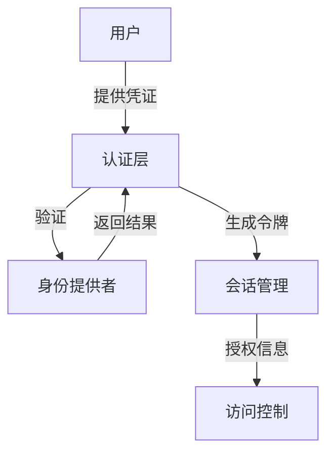

1. 多因素认证
   ```java
   public interface MfaProvider {
       // 生成验证因素
       Factor generateFactor(User user, FactorType type);
       
       // 验证因素
       boolean validateFactor(User user, Factor factor);
       
       // 注册因素
       void registerFactor(User user, FactorType type);
   }
   ```

2. 身份联盟
   ```java
   public interface FederationProvider {
       // SAML认证
       AuthResult authenticateWithSaml(SamlRequest request);
       
       // OAuth认证
       AuthResult authenticateWithOAuth(OAuthRequest request);
       
       // OpenID认证
       AuthResult authenticateWithOpenId(OpenIdRequest request);
   }
   ```

#### 授权模型
1. RBAC模型
   ```java
   public class RbacModel {
       // 角色判断
       public boolean hasRole(User user, String role) {
           return user.getRoles().contains(role);
       }
       
       // 权限判断
       public boolean hasPermission(User user, String permission) {
           return user.getRoles().stream()
                     .flatMap(role -> role.getPermissions().stream())
                     .anyMatch(p -> p.matches(permission));
       }
   }
   ```

2. ABAC模型
   ```java
   public class AbacModel {
       // 策略评估
       public boolean evaluate(Subject subject, Resource resource, Action action, Environment env) {
           List<Policy> policies = policyRepository.findApplicablePolicies(subject, resource);
           return policies.stream()
                         .allMatch(policy -> policy.evaluate(subject, resource, action, env));
       }
   }
   ```

### 7.2 安全控制
#### 访问控制
1. 请求过滤
   ```java
   @Component
   public class SecurityFilter extends OncePerRequestFilter {
       @Override
       protected void doFilterInternal(HttpServletRequest request, 
                                     HttpServletResponse response, 
                                     FilterChain chain) {
           // 1. 令牌提取
           String token = extractToken(request);
           
           // 2. 令牌验证
           if (!tokenService.validateToken(token)) {
               response.sendError(HttpStatus.UNAUTHORIZED.value());
               return;
           }
           
           // 3. 权限检查
           if (!checkPermission(token, request.getRequestURI())) {
               response.sendError(HttpStatus.FORBIDDEN.value());
               return;
           }
           
           chain.doFilter(request, response);
       }
   }
   ```

2. 权限拦截
   ```java
   @Aspect
   public class SecurityAspect {
       @Around("@annotation(secured)")
       public Object checkSecurity(ProceedingJoinPoint point, Secured secured) {
           // 1. 获取当前用户
           User user = SecurityContext.getCurrentUser();
           
           // 2. 检查权限
           if (!securityService.hasPermission(user, secured.value())) {
               throw new AccessDeniedException();
           }
           
           return point.proceed();
       }
   }
   ```

#### 攻击防护
1. XSS防护
   ```java
   public class XssFilter {
       // HTML转义
       public String escape(String input) {
           return input.replace("<", "&lt;")
                      .replace(">", "&gt;")
                      .replace("\"", "&quot;")
                      .replace("'", "&#x27;")
                      .replace("/", "&#x2F;");
       }
       
       // 内容验证
       public boolean isValid(String input) {
           return !containsXssPayload(input);
       }
   }
   ```

2. CSRF防护
   ```java
   @Component
   public class CsrfProtection {
       // 生成令牌
       public String generateToken(HttpSession session) {
           String token = generateSecureToken();
           session.setAttribute(CSRF_TOKEN_NAME, token);
           return token;
       }
       
       // 验证令牌
       public boolean validateToken(HttpSession session, String token) {
           String storedToken = (String) session.getAttribute(CSRF_TOKEN_NAME);
           return storedToken != null && storedToken.equals(token);
       }
   }
   ```

### 7.3 数据安全
#### 数据加密
1. 传输加密
   ```java
   public class TransportSecurity {
       // SSL/TLS配置
       public SSLContext createSSLContext() {
           return SSLContext.getInstance("TLS")
                          .init(keyManagers, trustManagers, secureRandom);
       }
       
       // 证书验证
       public X509TrustManager createTrustManager() {
           return new X509TrustManager() {
               public void checkClientTrusted(X509Certificate[] chain, String authType) {}
               public void checkServerTrusted(X509Certificate[] chain, String authType) {}
               public X509Certificate[] getAcceptedIssuers() { return null; }
           };
       }
   }
   ```

2. 存储加密
   ```java
   public class StorageSecurity {
       // 字段加密
       public String encryptField(String plaintext, String key) {
           Cipher cipher = Cipher.getInstance("AES/GCM/NoPadding");
           cipher.init(Cipher.ENCRYPT_MODE, new SecretKeySpec(key.getBytes(), "AES"));
           return Base64.encode(cipher.doFinal(plaintext.getBytes()));
       }
       
       // 字段解密
       public String decryptField(String ciphertext, String key) {
           Cipher cipher = Cipher.getInstance("AES/GCM/NoPadding");
           cipher.init(Cipher.DECRYPT_MODE, new SecretKeySpec(key.getBytes(), "AES"));
           return new String(cipher.doFinal(Base64.decode(ciphertext)));
       }
   }
   ```

#### 数据脱敏
1. 脱敏规则
   ```java
   public class DataMasking {
       // 手机号脱敏
       public String maskPhone(String phone) {
           return phone.replaceAll("(\\d{3})\\d{4}(\\d{4})", "$1****$2");
       }
       
       // 邮箱脱敏
       public String maskEmail(String email) {
           return email.replaceAll("(\\w{2})\\w+(@\\w+)", "$1***$2");
       }
       
       // 身份证脱敏
       public String maskIdCard(String idCard) {
           return idCard.replaceAll("(\\d{4})\\d{10}(\\w{4})", "$1**********$2");
       }
   }
   ```

2. 脱敏处理
   ```java
   @Aspect
   public class MaskingAspect {
       @Around("@annotation(Masked)")
       public Object mask(ProceedingJoinPoint point) {
           Object result = point.proceed();
           if (result instanceof String) {
               return maskingService.mask((String) result);
           }
           return result;
       }
   }
   ```

### 7.4 审计日志
#### 审计记录
1. 操作审计
   ```java
   public class OperationAudit {
       // 记录操作
       public void logOperation(String userId, String operation, Object... params) {
           AuditLog log = new AuditLog();
           log.setUserId(userId);
           log.setOperation(operation);
           log.setParameters(Arrays.toString(params));
           log.setTimestamp(new Date());
           log.setIp(RequestContext.getIp());
           
           auditRepository.save(log);
       }
   }
   ```

2. 安全审计
   ```java
   public class SecurityAudit {
       // 记录安全事件
       public void logSecurityEvent(String userId, SecurityEvent event) {
           SecurityLog log = new SecurityLog();
           log.setUserId(userId);
           log.setEventType(event.getType());
           log.setSeverity(event.getSeverity());
           log.setDetails(event.getDetails());
           log.setTimestamp(new Date());
           
           securityLogRepository.save(log);
       }
   }
   ```

#### 审计分析
1. 实时分析
   ```java
   public class RealTimeAnalysis {
       // 异常检测
       public void detectAnomaly(SecurityLog log) {
           // 1. 规则匹配
           List<SecurityRule> rules = ruleEngine.matchRules(log);
           
           // 2. 风险评估
           RiskLevel risk = riskAssessor.assess(log, rules);
           
           // 3. 告警触发
           if (risk.isHigh()) {
               alertService.sendAlert(createAlert(log, risk));
           }
       }
   }
   ```

2. 离线分析
   ```java
   public class OfflineAnalysis {
       // 安全报告生成
       public SecurityReport generateReport(Date startTime, Date endTime) {
           // 1. 数据聚合
           List<SecurityLog> logs = securityLogRepository.findByTimeRange(startTime, endTime);
           
           // 2. 统计分析
           Map<String, Long> eventCounts = logs.stream()
                                             .collect(groupingBy(SecurityLog::getEventType, counting()));
           
           // 3. 报告生成
           return new SecurityReport(eventCounts, analyzeTrends(logs), generateInsights(logs));
       }
   } 

## 8. 性能设计
### 8.1 性能目标
#### 关键指标
1. 响应时间
   - 用户名密码登录：P99 < 500ms
   - SSO登录：P99 < 800ms
   - 令牌验证：P99 < 100ms
   - 会话查询：P99 < 50ms

2. 并发能力
   - 总用户数：2亿
   - 日活用户：5000万
   - 峰值并发：8000万
   - 每秒请求：20万TPS

3. 资源利用
   - CPU利用率 < 70%
   - 内存使用率 < 80%
   - 网络带宽利用率 < 60%
   - 存储IOPS < 70%

#### 性能基线
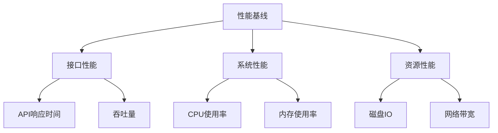

### 8.2 性能优化
#### 应用优化
1. 代码优化
   ```java
   public class PerformanceOptimization {
       // 并行处理
       public List<AuthResult> batchAuthenticate(List<AuthRequest> requests) {
           return requests.parallelStream()
                         .map(this::authenticate)
                         .collect(Collectors.toList());
       }
       
       // 异步处理
       @Async
       public CompletableFuture<AuthResult> asyncAuthenticate(AuthRequest request) {
           return CompletableFuture.supplyAsync(() -> authenticate(request));
       }
   }
   ```

2. 缓存优化
   ```java
   public class CacheOptimization {
       // 多级缓存
       @Cacheable(value = "userCache", key = "#userId")
       public UserInfo getUserInfo(String userId) {
           // 1. 查本地缓存
           UserInfo user = localCache.get(userId);
           if (user != null) {
               return user;
           }
           
           // 2. 查分布式缓存
           user = redisCache.get(userId);
           if (user != null) {
               localCache.put(userId, user);
               return user;
           }
           
           // 3. 查数据库
           user = userRepository.findById(userId);
           if (user != null) {
               redisCache.put(userId, user);
               localCache.put(userId, user);
           }
           
           return user;
       }
   }
   ```

#### 数据优化
1. 索引优化
   ```sql
   -- 复合索引
   CREATE INDEX idx_user_status_time ON users(status, created_time);
   
   -- 覆盖索引
   CREATE INDEX idx_session_query ON sessions(user_id, token, status);
   
   -- 分区索引
   CREATE INDEX idx_audit_time ON audit_logs(created_time) LOCAL;
   ```

2. SQL优化
   ```java
   public class SqlOptimization {
       // 分页查询优化
       public Page<LoginHistory> getLoginHistory(String userId, Pageable page) {
           return loginHistoryRepository.findAll(
               Specification.where(userIdEqual(userId))
                          .and(statusIn(VALID_STATUS)),
               page.previousOrFirst()
                   .withSort(Sort.by("loginTime").descending())
           );
       }
       
       // 批量操作优化
       @Transactional
       public void batchUpdateStatus(List<String> userIds, UserStatus status) {
           jdbcTemplate.batchUpdate(
               "UPDATE users SET status = ? WHERE id = ?",
               userIds.stream()
                     .map(id -> new Object[]{status, id})
                     .collect(Collectors.toList())
           );
       }
   }
   ```

### 8.3 性能测试
#### 测试方案
1. 压力测试
   ```java
   public class StressTest {
       @Test
       public void loginStressTest() {
           // 1. 测试参数
           int concurrentUsers = 10000;
           int requestsPerUser = 100;
           Duration testDuration = Duration.ofMinutes(30);
           
           // 2. 测试场景
           Scenario scenario = Scenario.builder()
                                    .threads(concurrentUsers)
                                    .iterations(requestsPerUser)
                                    .duration(testDuration)
                                    .build();
           
           // 3. 执行测试
           StressTestResult result = stressTestEngine.run(scenario);
           
           // 4. 验证结果
           assertThat(result.getP99ResponseTime()).isLessThan(Duration.ofMillis(500));
           assertThat(result.getSuccessRate()).isGreaterThan(0.999);
       }
   }
   ```

2. 容量测试
   ```java
   public class CapacityTest {
       @Test
       public void systemCapacityTest() {
           // 1. 测试参数
           int totalUsers = 200_000_000;
           int concurrentUsers = 80_000_000;
           int requestRate = 200_000;
           
           // 2. 测试场景
           Scenario scenario = Scenario.builder()
                                    .totalUsers(totalUsers)
                                    .concurrentUsers(concurrentUsers)
                                    .requestRate(requestRate)
                                    .build();
           
           // 3. 执行测试
           CapacityTestResult result = capacityTestEngine.run(scenario);
           
           // 4. 验证结果
           assertThat(result.getSystemThroughput()).isGreaterThan(requestRate);
           assertThat(result.getResourceUtilization()).isLessThan(0.8);
       }
   }
   ```

#### 监控方案
1. 性能监控
   ```java
   @Configuration
   public class PerformanceMonitoring {
       // 指标收集
       @Bean
       public MetricsCollector metricsCollector() {
           return MetricsCollector.builder()
                                .withMetric("response_time", MetricType.HISTOGRAM)
                                .withMetric("throughput", MetricType.COUNTER)
                                .withMetric("error_rate", MetricType.GAUGE)
                                .build();
       }
       
       // 性能告警
       @Bean
       public PerformanceAlerts performanceAlerts(MetricsCollector collector) {
           return PerformanceAlerts.builder()
                                 .withThreshold("response_time_p99", 500)
                                 .withThreshold("error_rate", 0.001)
                                 .withThreshold("cpu_usage", 70)
                                 .build();
       }
   }
   ```

2. 资源监控
   ```java
   @Configuration
   public class ResourceMonitoring {
       // 资源指标
       @Bean
       public ResourceMetrics resourceMetrics() {
           return ResourceMetrics.builder()
                               .withCpuMetrics()
                               .withMemoryMetrics()
                               .withDiskMetrics()
                               .withNetworkMetrics()
                               .build();
       }
       
       // 资源告警
       @Bean
       public ResourceAlerts resourceAlerts(ResourceMetrics metrics) {
           return ResourceAlerts.builder()
                              .withCpuThreshold(70)
                              .withMemoryThreshold(80)
                              .withDiskThreshold(85)
                              .withNetworkThreshold(60)
                              .build();
       }
   }
   ```

### 8.4 性能优化策略
#### 系统层优化
1. JVM优化
   ```bash
   # JVM参数优化
   JAVA_OPTS="\
       -Xms4g \
       -Xmx4g \
       -XX:+UseG1GC \
       -XX:MaxGCPauseMillis=200 \
       -XX:+HeapDumpOnOutOfMemoryError \
       -XX:+UseCompressedOops \
       -XX:+UseCompressedClassPointers \
       "
   ```

2. 系统优化
   ```bash
   # 系统参数优化
   sysctl -w net.core.somaxconn=65535
   sysctl -w net.ipv4.tcp_max_syn_backlog=65535
   sysctl -w net.core.netdev_max_backlog=65535
   sysctl -w net.ipv4.tcp_fin_timeout=30
   ```

#### 中间件优化
1. Redis优化
   ```properties
   # Redis配置优化
   maxmemory 4gb
   maxmemory-policy allkeys-lru
   timeout 300
   tcp-keepalive 60
   ```

2. MySQL优化
   ```properties
   # MySQL配置优化
   innodb_buffer_pool_size = 4G
   innodb_log_file_size = 1G
   innodb_flush_log_at_trx_commit = 2
   innodb_read_io_threads = 8
   innodb_write_io_threads = 8
   ``` 

## 9. 可用性设计
### 9.1 高可用架构
#### 架构设计
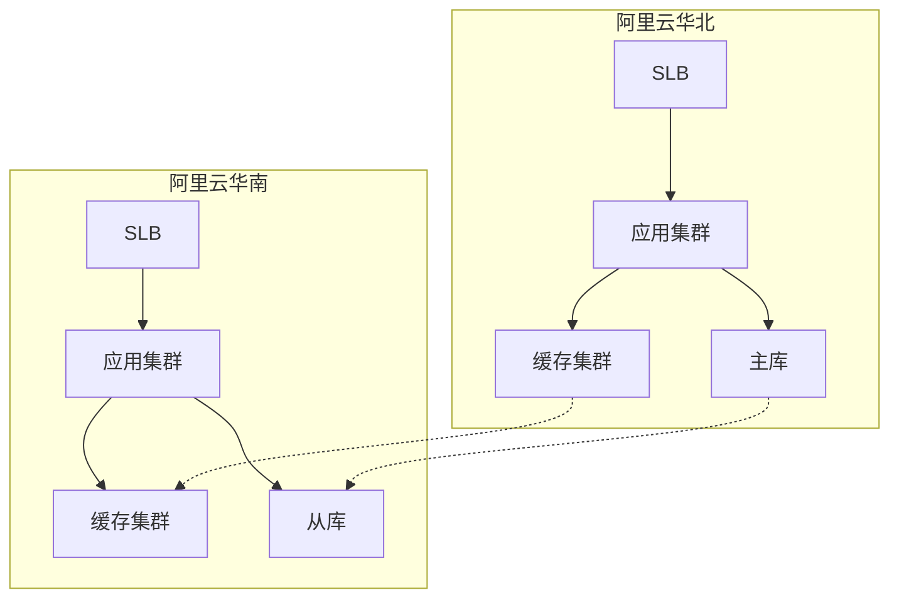

1. 多活设计
   ```java
   public class MultiActiveDesign {
       // 多活路由
       public String routeRequest(HttpRequest request) {
           // 1. 就近路由
           String region = getRegionByIp(request.getClientIp());
           
           // 2. 负载均衡
           List<String> endpoints = getAvailableEndpoints(region);
           
           // 3. 故障转移
           return failoverStrategy.selectEndpoint(endpoints);
       }
       
       // 数据同步
       public void syncData(String sourceRegion, String targetRegion) {
           // 1. 增量同步
           List<DataChange> changes = getIncrementalChanges(sourceRegion);
           
           // 2. 冲突解决
           changes = conflictResolver.resolve(changes);
           
           // 3. 应用变更
           applyChanges(targetRegion, changes);
       }
   }
   ```

2. 容灾设计
   ```java
   public class DisasterRecovery {
       // 故障检测
       @Scheduled(fixedRate = 5000)
       public void healthCheck() {
           // 1. 服务健康检查
           Map<String, HealthStatus> status = checkServicesHealth();
           
           // 2. 故障判定
           if (isRegionFailure(status)) {
               // 3. 触发切换
               triggerFailover();
           }
       }
       
       // 故障恢复
       public void recover(String failedRegion) {
           // 1. 数据修复
           repairData(failedRegion);
           
           // 2. 服务恢复
           restoreServices(failedRegion);
           
           // 3. 流量恢复
           restoreTraffic(failedRegion);
       }
   }
   ```

### 9.2 可用性保障
#### 故障处理
1. 故障检测
   ```java
   public class FailureDetection {
       // 健康检查
       public HealthStatus checkHealth(Service service) {
           try {
               // 1. 服务探活
               boolean alive = ping(service.getEndpoint());
               
               // 2. 指标检查
               boolean healthy = checkMetrics(service.getMetrics());
               
               // 3. 依赖检查
               boolean dependenciesOk = checkDependencies(service.getDependencies());
               
               return new HealthStatus(alive && healthy && dependenciesOk);
           } catch (Exception e) {
               return new HealthStatus(false, e);
           }
       }
   }
   ```

2. 故障恢复
   ```java
   public class FailureRecovery {
       // 自动恢复
       public void autoRecover(Service service) {
           // 1. 隔离故障
           isolateFailure(service);
           
           // 2. 服务重启
           restartService(service);
           
           // 3. 健康检查
           if (checkHealth(service).isHealthy()) {
               // 4. 恢复流量
               restoreTraffic(service);
           }
       }
   }
   ```

#### 限流熔断
1. 限流策略
   ```java
   public class RateLimiting {
       // 令牌桶限流
       public boolean tryAcquire(String key, int permits) {
           // 1. 获取令牌桶
           RateLimiter limiter = getLimiter(key);
           
           // 2. 尝试获取令牌
           return limiter.tryAcquire(permits, 100, TimeUnit.MILLISECONDS);
       }
       
       // 分布式限流
       public boolean globalTryAcquire(String key, int permits) {
           // 1. 获取当前计数
           long current = redisTemplate.opsForValue()
                                    .increment(key, permits);
           
           // 2. 检查限制
           if (current > getLimit(key)) {
               redisTemplate.opsForValue().decrement(key, permits);
               return false;
           }
           
           return true;
       }
   }
   ```

2. 熔断策略
   ```java
   public class CircuitBreaker {
       // 熔断器状态
       private enum State {
           CLOSED, OPEN, HALF_OPEN
       }
       
       // 熔断处理
       public <T> T execute(Supplier<T> supplier) {
           // 1. 检查状态
           if (state == State.OPEN) {
               return fallback();
           }
           
           try {
               // 2. 执行操作
               T result = supplier.get();
               
               // 3. 成功计数
               onSuccess();
               
               return result;
           } catch (Exception e) {
               // 4. 失败处理
               onError(e);
               return fallback();
           }
       }
   }
   ```

### 9.3 可用性监控
#### 监控指标
1. 业务指标
   ```java
   @Configuration
   public class BusinessMetrics {
       // 可用性指标
       @Bean
       public AvailabilityMetrics availabilityMetrics() {
           return AvailabilityMetrics.builder()
                                   .withSuccessRate("auth.success_rate")
                                   .withErrorRate("auth.error_rate")
                                   .withLatency("auth.latency")
                                   .withSaturation("auth.saturation")
                                   .build();
       }
       
       // 业务指标
       @Bean
       public BusinessIndicators businessIndicators() {
           return BusinessIndicators.builder()
                                  .withActiveUsers("biz.active_users")
                                  .withLoginRate("biz.login_rate")
                                  .withSessionCount("biz.session_count")
                                  .build();
       }
   }
   ```

2. 系统指标
   ```java
   @Configuration
   public class SystemMetrics {
       // 资源指标
       @Bean
       public ResourceMetrics resourceMetrics() {
           return ResourceMetrics.builder()
                               .withCpuUsage("sys.cpu_usage")
                               .withMemoryUsage("sys.memory_usage")
                               .withDiskUsage("sys.disk_usage")
                               .withNetworkIO("sys.network_io")
                               .build();
       }
       
       // 服务指标
       @Bean
       public ServiceMetrics serviceMetrics() {
           return ServiceMetrics.builder()
                              .withQps("service.qps")
                              .withResponseTime("service.rt")
                              .withErrorCount("service.errors")
                              .withHealthStatus("service.health")
                              .build();
       }
   }
   ```

#### 告警策略
1. 告警规则
   ```java
   public class AlertRules {
       // 可用性告警
       public List<AlertRule> availabilityRules() {
           return Arrays.asList(
               // 成功率告警
               AlertRule.builder()
                       .metric("auth.success_rate")
                       .threshold(99.9)
                       .operator(Operator.LESS_THAN)
                       .duration(Duration.ofMinutes(5))
                       .severity(Severity.HIGH)
                       .build(),
               
               // 延迟告警
               AlertRule.builder()
                       .metric("auth.latency_p99")
                       .threshold(500)
                       .operator(Operator.GREATER_THAN)
                       .duration(Duration.ofMinutes(5))
                       .severity(Severity.HIGH)
                       .build()
           );
       }
   }
   ```

2. 告警处理
   ```java
   public class AlertHandler {
       // 告警通知
       public void handleAlert(Alert alert) {
           // 1. 告警聚合
           List<Alert> correlatedAlerts = alertCorrelator.correlate(alert);
           
           // 2. 告警级别判断
           if (shouldEscalate(correlatedAlerts)) {
               // 3. 告警升级
               escalateAlert(correlatedAlerts);
           }
           
           // 4. 告警通知
           notifyAlert(correlatedAlerts);
       }
   }
   ```

### 9.4 灾备策略
#### 数据备份
1. 备份策略
   ```java
   public class BackupStrategy {
       // 全量备份
       @Scheduled(cron = "0 0 2 * * ?")
       public void fullBackup() {
           // 1. 创建快照
           String snapshot = createSnapshot();
           
           // 2. 备份数据
           backupData(snapshot);
           
           // 3. 清理历史
           cleanupHistory();
       }
       
       // 增量备份
       @Scheduled(fixedRate = 300000)
       public void incrementalBackup() {
           // 1. 获取变更
           List<Change> changes = getChanges();
           
           // 2. 备份变更
           backupChanges(changes);
           
           // 3. 更新检查点
           updateCheckpoint();
       }
   }
   ```

2. 恢复策略
   ```java
   public class RecoveryStrategy {
       // 数据恢复
       public void recoverData(RecoveryPoint point) {
           // 1. 恢复全量数据
           recoverFullBackup(point.getFullBackupId());
           
           // 2. 应用增量变更
           applyIncrementalChanges(point.getChangeIds());
           
           // 3. 数据校验
           validateData();
       }
   }
   ```

#### 演练策略
1. 故障演练
   ```java
   public class FailoverDrill {
       // 故障注入
       public void injectFailure(FailureType type) {
           switch (type) {
               case INSTANCE_FAILURE:
                   killRandomInstance();
                   break;
               case NETWORK_FAILURE:
                   simulateNetworkFailure();
                   break;
               case DISK_FAILURE:
                   simulateDiskFailure();
                   break;
           }
       }
       
       // 演练验证
       public DrillResult verifyDrill(DrillCase drillCase) {
           // 1. 检查系统状态
           SystemStatus status = checkSystem();
           
           // 2. 验证可用性
           boolean available = checkAvailability();
           
           // 3. 验证数据一致性
           boolean consistent = checkDataConsistency();
           
           return new DrillResult(status, available, consistent);
       }
   }
   ```

2. 应急预案
   ```java
   public class EmergencyPlan {
       // 应急响应
       public void handleEmergency(Emergency emergency) {
           // 1. 确定级别
           Severity severity = assessSeverity(emergency);
           
           // 2. 执行预案
           switch (severity) {
               case HIGH:
                   executeHighSeverityPlan();
                   break;
               case MEDIUM:
                   executeMediumSeverityPlan();
                   break;
               case LOW:
                   executeLowSeverityPlan();
                   break;
           }
           
           // 3. 通知相关方
           notifyStakeholders(emergency, severity);
       }
   }
   ``` 

## 10. 附录
### 10.1 术语表
| 术语 | 全称 | 说明 |
|-----|------|-----|
| SSO | Single Sign-On | 单点登录，实现一次登录，访问所有相关系统 |
| MFA | Multi-Factor Authentication | 多因素认证，通过两个或以上的认证因素实现身份验证 |
| RBAC | Role-Based Access Control | 基于角色的访问控制，通过角色进行权限管理 |
| JWT | JSON Web Token | 基于JSON的开放标准，用于创建访问令牌 |
| TLS | Transport Layer Security | 传输层安全协议，用于网络通信加密 |
| SLB | Server Load Balancer | 服务器负载均衡，用于分发流量 |
| WAF | Web Application Firewall | Web应用防火墙，用于应用层安全防护 |
| CDN | Content Delivery Network | 内容分发网络，用于加速资源访问 |

### 10.2 参考文档
1. 技术标准
   - OAuth 2.0 规范：https://oauth.net/2/
   - OpenID Connect 规范：https://openid.net/connect/
   - SAML 2.0 规范：http://docs.oasis-open.org/security/saml/v2.0/
   - JWT 规范：https://jwt.io/introduction/

2. 安全标准
   - OWASP 安全指南：https://owasp.org/www-project-web-security-testing-guide/
   - NIST 密码指南：https://pages.nist.gov/800-63-3/
   - GDPR 合规指南：https://gdpr.eu/
   - ISO 27001 标准：https://www.iso.org/isoiec-27001-information-security.html

3. 最佳实践
   - Spring Security 文档：https://docs.spring.io/spring-security/reference/
   - Kubernetes 文档：https://kubernetes.io/docs/
   - Istio 文档：https://istio.io/latest/docs/
   - Alibaba Cloud 文档：https://www.alibabacloud.com/help/

### 10.3 变更记录
| 版本 | 日期 | 作者 | 变更描述 |
|-----|------|------|---------|
| 1.0 | 2024-03-22 | 架构师 | 初始版本创建 |
| 1.1 | 2024-03-22 | 架构师 | 完善技术架构设计 |
| 1.2 | 2024-03-22 | 架构师 | 补充安全架构设计 |
| 1.3 | 2024-03-22 | 架构师 | 补充性能设计方案 |
| 1.4 | 2024-03-22 | 架构师 | 补充可用性设计方案 |

### 10.4 评审记录
| 评审日期 | 评审人 | 评审结果 | 主要反馈 |
|---------|--------|----------|---------|
| 2024-03-22 | 技术总监 | 通过 | 整体架构合理，建议加强安全设计 |
| 2024-03-22 | 安全专家 | 通过 | 安全架构完善，建议补充风险控制 |
| 2024-03-22 | 性能专家 | 通过 | 性能设计合理，建议优化缓存策略 |
| 2024-03-22 | 运维总监 | 通过 | 运维架构完善，建议加强监控告警 |

### 10.5 风险评估
#### 技术风险
1. 性能风险
   - 风险：高并发场景下的系统响应延迟
   - 影响：用户体验下降，系统可用性降低
   - 对策：
     * 实施多级缓存策略
     * 优化数据库访问
     * 实施限流熔断
     * 定期性能测试

2. 安全风险
   - 风险：系统安全漏洞和数据泄露
   - 影响：用户信息泄露，系统被攻击
   - 对策：
     * 实施多重安全防护
     * 定期安全审计
     * 及时更新安全补丁
     * 加强数据加密

3. 可用性风险
   - 风险：系统故障导致服务中断
   - 影响：业务中断，用户无法访问
   - 对策：
     * 实施多活架构
     * 完善故障转移
     * 定期灾备演练
     * 建立应急预案

#### 项目风险
1. 进度风险
   - 风险：开发周期延误
   - 影响：项目延期，成本增加
   - 对策：
     * 合理规划进度
     * 加强项目管理
     * 定期进度评估
     * 及时调整资源

2. 技术风险
   - 风险：技术方案不成熟
   - 影响：系统质量下降，维护成本高
   - 对策：
     * 选择成熟技术
     * 进行技术验证
     * 建立技术预案
     * 保持技术储备

3. 运维风险
   - 风险：运维能力不足
   - 影响：系统稳定性下降，故障处理延迟
   - 对策：
     * 加强运维培训
     * 完善运维工具
     * 建立运维规范
     * 优化运维流程

### 10.6 验收标准
#### 功能验收
1. 认证功能
   - 支持用户名密码登录
   - 支持多因素认证
   - 支持单点登录
   - 支持社交账号登录

2. 安全功能
   - 实现访问控制
   - 实现数据加密
   - 实现审计日志
   - 实现风险控制

#### 性能验收
1. 响应时间
   - 登录响应时间 P99 < 500ms
   - 令牌验证时间 P99 < 100ms
   - API响应时间 P99 < 200ms

2. 并发能力
   - 支持 8000万 并发用户
   - 支持 20万 TPS
   - CPU使用率 < 70%
   - 内存使用率 < 80%

#### 可用性验收
1. 系统可用性
   - 工作时间可用性 99.999%
   - 非工作时间可用性 99.99%
   - 故障恢复时间 < 5分钟
   - 数据一致性 100%

2. 运维能力
   - 支持在线扩容
   - 支持故障转移
   - 支持灾难恢复
   - 支持监控告警

### 10.7 实施计划
#### 开发计划
1. 第一阶段（4周）
   - 完成基础框架搭建
   - 完成核心功能开发
   - 完成单元测试
   - 完成代码审查

2. 第二阶段（4周）
   - 完成安全功能开发
   - 完成性能优化
   - 完成集成测试
   - 完成安全测试

3. 第三阶段（2周）
   - 完成系统联调
   - 完成压力测试
   - 完成验收测试
   - 完成文档编写

#### 部署计划
1. 环境准备
   - 完成硬件采购
   - 完成网络配置
   - 完成系统部署
   - 完成环境测试

2. 灰度发布
   - 完成小规模试点
   - 完成部分用户迁移
   - 完成系统优化
   - 完成问题修复

3. 全量上线
   - 完成全量部署
   - 完成数据迁移
   - 完成切换验证
   - 完成运维交付

-- 文档结束 -- 