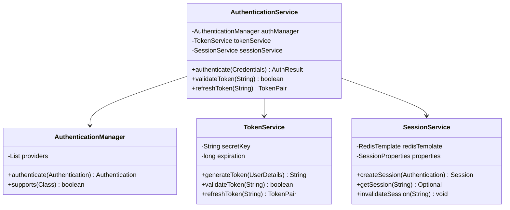
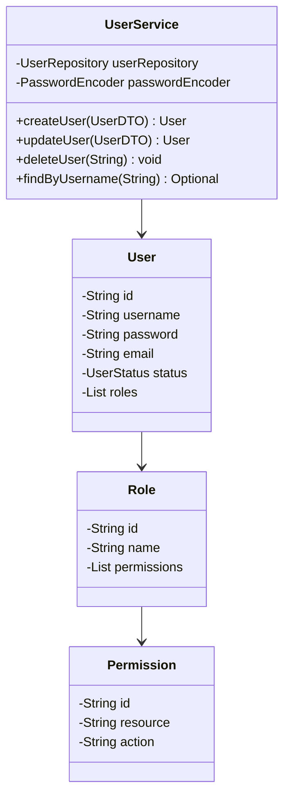
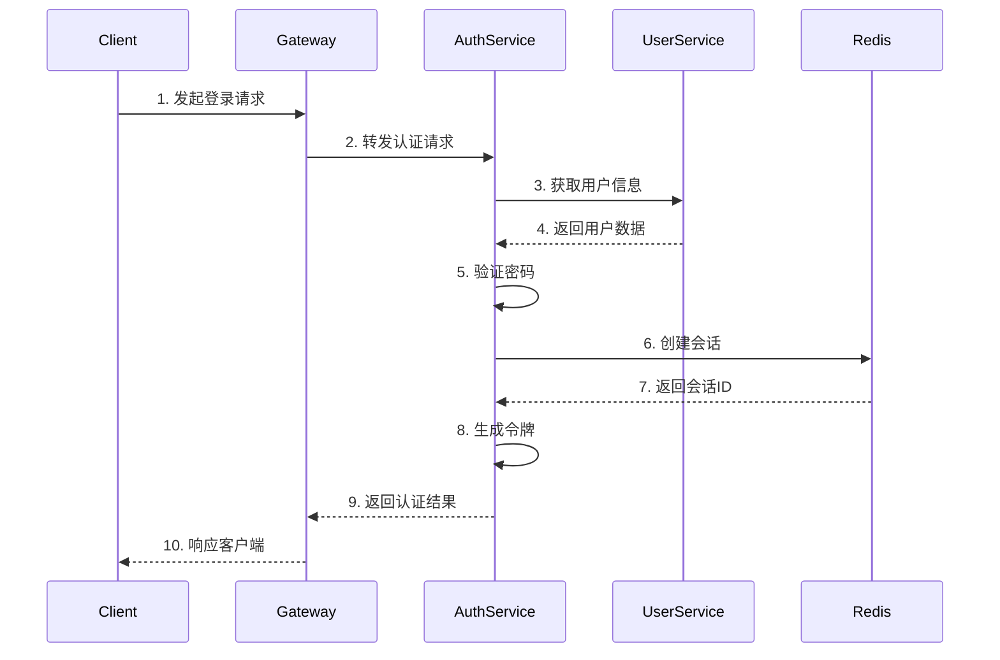
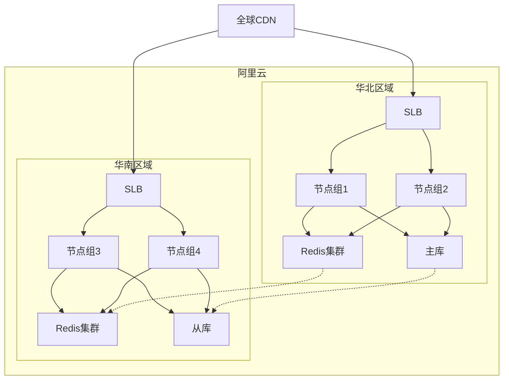

# 技术设计文档 (TDD)
## 文档信息
- 文档版本：1.0
- 最后更新：2024-03-22
- 作者：系统架构师
- 审核人：技术总监
- 状态：草稿

## 1. 设计概述
### 1.1 功能描述
登录系统是面向全球用户的大规模互联网 SaaS 产品的核心认证模块，提供：
- 统一身份认证服务
- 多因素认证机制
- 单点登录(SSO)支持
- 全球化分布式部署

### 1.2 设计目标
1. 功能目标
   - 支持多种认证方式（用户名密码、SSO、MFA等）
   - 提供完整的用户会话管理
   - 实现细粒度的访问控制
   - 支持全面的安全审计

2. 性能目标
   - 登录响应时间：P99 < 500ms
   - 并发处理能力：20万 TPS
   - 全球访问延迟：< 1s
   - 系统吞吐量：峰值 8000万 QPS

3. 质量目标
   - 系统可用性：99.999%（工作时间）
   - 数据一致性：最终一致性
   - 安全合规：符合等保三级要求
   - 可维护性：支持平滑升级和快速回滚 

## 2. 详细设计
### 2.1 技术方案
1. 实现方式
   - 采用微服务架构，基于Spring Cloud Alibaba生态
   - 使用分布式缓存（Redis）实现会话管理
   - 采用JWT + Redis实现分布式认证
   - 实现基于RBAC的访问控制

2. 核心算法
   - PBKDF2密码加密算法
   - JWT令牌生成和验证
   - 分布式会话管理
   - 风险控制算法

3. 关键技术
   - Spring Cloud Gateway：API网关
   - Nacos：服务注册与配置
   - Redis：分布式缓存
   - MariaDB：数据持久化
   - RocketMQ：消息队列
   - Elasticsearch：日志分析

4. 设计模式
   - 领域驱动设计（DDD）
   - 微服务设计模式
   - 认证鉴权模式
   - 缓存策略模式

### 2.2 类设计
1. 认证模块类图


2. 用户模块类图


### 2.3 数据结构
1. 核心数据结构
   ```java
   // 认证凭证
   public class Credentials {
       private String username;    // 用户名
       private String password;    // 密码
       private String captcha;     // 验证码
       private DeviceInfo device;  // 设备信息
   }
   
   // 认证结果
   public class AuthResult {
       private boolean success;    // 是否成功
       private String token;       // 访问令牌
       private String refreshToken;// 刷新令牌
       private long expireIn;      // 过期时间
       private boolean mfaRequired;// 是否需要MFA
   }
   
   // 会话信息
   public class Session {
       private String id;          // 会话ID
       private String userId;      // 用户ID
       private String token;       // 访问令牌
       private DeviceInfo device;  // 设备信息
       private Date createTime;    // 创建时间
       private Date expireTime;    // 过期时间
   }
   ```

2. 数据关系
   - User-Role：多对多关系
   - Role-Permission：多对多关系
   - User-Session：一对多关系
   - User-Credential：一对多关系

3. 存储结构
   - 关系型数据库：用户、角色、权限等基础数据
   - Redis：会话信息、令牌数据、验证码等
   - Elasticsearch：审计日志、操作记录等 

## 3. 接口设计
### 3.1 接口定义
1. 认证接口
   ```http
   POST /api/v1/auth/login
   Content-Type: application/json
   
   Request:
   {
       "username": "string",  // 用户名
       "password": "string",  // 密码
       "captcha": "string",   // 验证码（可选）
       "deviceInfo": {        // 设备信息
           "deviceId": "string",
           "deviceType": "string",
           "osVersion": "string"
       }
   }
   
   Response:
   {
       "code": 200,          // 状态码
       "message": "string",  // 消息
       "data": {
           "token": "string",    // 访问令牌
           "expireIn": 3600,     // 过期时间（秒）
           "refreshToken": "string", // 刷新令牌
           "mfaRequired": false  // 是否需要MFA
       }
   }
   ```

2. SSO接口
   ```http
   GET /api/v1/auth/sso/init
   Content-Type: application/json
   
   Request:
   {
       "provider": "string",  // 身份提供商
       "returnUrl": "string"  // 回调地址
   }
   
   Response:
   {
       "code": 200,
       "message": "string",
       "data": {
           "redirectUrl": "string"  // SSO登录地址
       }
   }
   
   POST /api/v1/auth/sso/callback
   Content-Type: application/json
   
   Request:
   {
       "samlResponse": "string",  // SAML响应
       "relayState": "string"     // 中继状态
   }
   
   Response:
   {
       "code": 200,
       "message": "string",
       "data": {
           "token": "string",
           "expireIn": 3600
       }
   }
   ```

3. 会话接口
   ```http
   GET /api/v1/session/verify
   Authorization: Bearer {token}
   
   Response:
   {
       "code": 200,
       "message": "string",
       "data": {
           "valid": true,
           "userId": "string",
           "permissions": ["string"]
       }
   }
   ```

### 3.2 接口实现
1. 认证流程


2. 业务规则
   - 密码规则：
     * 最小长度8位
     * 必须包含大小写字母和数字
     * 不允许使用常见密码
     * 90天强制更换
   
   - 登录限制：
     * 连续失败5次锁定账号
     * 锁定时间30分钟
     * 异地登录需要验证
     * 同一账号最多3个在线会话

3. 异常处理
   ```java
   public enum ErrorCode {
       SUCCESS(200, "成功"),
       INVALID_CREDENTIALS(401001, "用户名或密码错误"),
       ACCOUNT_LOCKED(401002, "账号已锁定"),
       INVALID_TOKEN(401003, "无效的令牌"),
       TOKEN_EXPIRED(401004, "令牌已过期"),
       REQUIRE_CAPTCHA(401005, "需要验证码"),
       INVALID_CAPTCHA(401006, "验证码错误"),
       REQUIRE_MFA(401007, "需要多因素认证"),
       SYSTEM_ERROR(500000, "系统错误");
   }
   ``` 

## 4. 数据库设计
### 4.1 表结构
1. 用户表
```sql
CREATE TABLE users (
    id VARCHAR(32) PRIMARY KEY COMMENT '用户ID',
    username VARCHAR(64) NOT NULL COMMENT '用户名',
    password VARCHAR(256) NOT NULL COMMENT '密码哈希',
    email VARCHAR(128) NOT NULL COMMENT '邮箱',
    phone VARCHAR(20) COMMENT '手机号',
    status ENUM('ACTIVE', 'LOCKED', 'DISABLED') NOT NULL COMMENT '状态',
    last_login_time DATETIME COMMENT '最后登录时间',
    last_login_ip VARCHAR(64) COMMENT '最后登录IP',
    created_at TIMESTAMP NOT NULL DEFAULT CURRENT_TIMESTAMP COMMENT '创建时间',
    updated_at TIMESTAMP NOT NULL DEFAULT CURRENT_TIMESTAMP ON UPDATE CURRENT_TIMESTAMP COMMENT '更新时间',
    UNIQUE KEY uk_username (username),
    UNIQUE KEY uk_email (email),
    KEY idx_status (status),
    KEY idx_phone (phone)
) ENGINE=InnoDB DEFAULT CHARSET=utf8mb4 COMMENT='用户表';
```

2. 角色表
```sql
CREATE TABLE roles (
    id VARCHAR(32) PRIMARY KEY COMMENT '角色ID',
    name VARCHAR(64) NOT NULL COMMENT '角色名称',
    description VARCHAR(256) COMMENT '角色描述',
    status ENUM('ACTIVE', 'DISABLED') NOT NULL COMMENT '状态',
    created_at TIMESTAMP NOT NULL DEFAULT CURRENT_TIMESTAMP COMMENT '创建时间',
    updated_at TIMESTAMP NOT NULL DEFAULT CURRENT_TIMESTAMP ON UPDATE CURRENT_TIMESTAMP COMMENT '更新时间',
    UNIQUE KEY uk_name (name)
) ENGINE=InnoDB DEFAULT CHARSET=utf8mb4 COMMENT='角色表';
```

3. 权限表
```sql
CREATE TABLE permissions (
    id VARCHAR(32) PRIMARY KEY COMMENT '权限ID',
    resource VARCHAR(64) NOT NULL COMMENT '资源',
    action VARCHAR(32) NOT NULL COMMENT '操作',
    description VARCHAR(256) COMMENT '权限描述',
    created_at TIMESTAMP NOT NULL DEFAULT CURRENT_TIMESTAMP COMMENT '创建时间',
    updated_at TIMESTAMP NOT NULL DEFAULT CURRENT_TIMESTAMP ON UPDATE CURRENT_TIMESTAMP COMMENT '更新时间',
    UNIQUE KEY uk_resource_action (resource, action)
) ENGINE=InnoDB DEFAULT CHARSET=utf8mb4 COMMENT='权限表';
```

4. 用户角色关系表
```sql
CREATE TABLE user_roles (
    id VARCHAR(32) PRIMARY KEY COMMENT '关系ID',
    user_id VARCHAR(32) NOT NULL COMMENT '用户ID',
    role_id VARCHAR(32) NOT NULL COMMENT '角色ID',
    created_at TIMESTAMP NOT NULL DEFAULT CURRENT_TIMESTAMP COMMENT '创建时间',
    UNIQUE KEY uk_user_role (user_id, role_id),
    FOREIGN KEY (user_id) REFERENCES users(id),
    FOREIGN KEY (role_id) REFERENCES roles(id)
) ENGINE=InnoDB DEFAULT CHARSET=utf8mb4 COMMENT='用户角色关系表';
```

5. 角色权限关系表
```sql
CREATE TABLE role_permissions (
    id VARCHAR(32) PRIMARY KEY COMMENT '关系ID',
    role_id VARCHAR(32) NOT NULL COMMENT '角色ID',
    permission_id VARCHAR(32) NOT NULL COMMENT '权限ID',
    created_at TIMESTAMP NOT NULL DEFAULT CURRENT_TIMESTAMP COMMENT '创建时间',
    UNIQUE KEY uk_role_permission (role_id, permission_id),
    FOREIGN KEY (role_id) REFERENCES roles(id),
    FOREIGN KEY (permission_id) REFERENCES permissions(id)
) ENGINE=InnoDB DEFAULT CHARSET=utf8mb4 COMMENT='角色权限关系表';
```

### 4.2 SQL设计
1. 核心SQL
   ```sql
   -- 用户认证查询
   SELECT u.id, u.username, u.password, u.status, u.last_login_time,
          r.id as role_id, r.name as role_name,
          p.id as permission_id, p.resource, p.action
   FROM users u
   LEFT JOIN user_roles ur ON u.id = ur.user_id
   LEFT JOIN roles r ON ur.role_id = r.id
   LEFT JOIN role_permissions rp ON r.id = rp.role_id
   LEFT JOIN permissions p ON rp.permission_id = p.id
   WHERE u.username = ? AND u.status = 'ACTIVE';

   -- 用户权限查询
   SELECT DISTINCT p.resource, p.action
   FROM permissions p
   INNER JOIN role_permissions rp ON p.id = rp.permission_id
   INNER JOIN user_roles ur ON rp.role_id = ur.role_id
   WHERE ur.user_id = ?;

   -- 更新登录信息
   UPDATE users 
   SET last_login_time = ?, last_login_ip = ?
   WHERE id = ?;
   ```

2. 存储过程
   ```sql
   DELIMITER //

   -- 创建用户及默认角色
   CREATE PROCEDURE create_user_with_roles(
       IN p_username VARCHAR(64),
       IN p_password VARCHAR(256),
       IN p_email VARCHAR(128),
       IN p_default_role_id VARCHAR(32)
   )
   BEGIN
       DECLARE v_user_id VARCHAR(32);
       
       START TRANSACTION;
       
       -- 创建用户
       SET v_user_id = UUID();
       INSERT INTO users (id, username, password, email, status)
       VALUES (v_user_id, p_username, p_password, p_email, 'ACTIVE');
       
       -- 分配默认角色
       INSERT INTO user_roles (id, user_id, role_id)
       VALUES (UUID(), v_user_id, p_default_role_id);
       
       COMMIT;
   END //

   -- 锁定用户账号
   CREATE PROCEDURE lock_user_account(
       IN p_user_id VARCHAR(32),
       IN p_lock_reason VARCHAR(256)
   )
   BEGIN
       UPDATE users 
       SET status = 'LOCKED',
           updated_at = CURRENT_TIMESTAMP
       WHERE id = p_user_id;
       
       INSERT INTO user_lock_history (id, user_id, reason)
       VALUES (UUID(), p_user_id, p_lock_reason);
   END //

   DELIMITER ;
   ```

3. 性能优化
   - 索引策略：
     * 用户表：username、email、phone 唯一索引
     * 角色表：name 唯一索引
     * 权限表：resource + action 联合唯一索引
     * 关系表：外键索引 + 联合唯一索引
   
   - 分库分表：
     * 用户表按用户ID哈希分片
     * 审计日志表按时间分片
     * 历史数据定期归档
   
   - 查询优化：
     * 使用覆盖索引
     * 避免跨库关联
     * 合理使用缓存
     * 批量操作优化 

## 5. 算法设计
### 5.1 核心算法
1. 密码加密算法
   ```java
   /**
    * PBKDF2密码加密算法
    * 时间复杂度：O(n * r)，其中n为迭代次数，r为密码长度
    * 空间复杂度：O(1)
    */
   public class PasswordEncoder {
       private static final String ALGORITHM = "PBKDF2WithHmacSHA256";
       private static final int ITERATIONS = 10000;
       private static final int KEY_LENGTH = 256;
       
       public String encode(String password) {
           byte[] salt = generateSalt();  // 生成16字节随机盐值
           byte[] hash = pbkdf2(password.toCharArray(), salt);
           return String.format("%s$%s", Base64.encode(salt), Base64.encode(hash));
       }
       
       public boolean verify(String password, String encodedPassword) {
           String[] parts = encodedPassword.split("\\$");
           byte[] salt = Base64.decode(parts[0]);
           byte[] hash = Base64.decode(parts[1]);
           byte[] testHash = pbkdf2(password.toCharArray(), salt);
           return MessageDigest.isEqual(hash, testHash);
       }
       
       private byte[] pbkdf2(char[] password, byte[] salt) {
           PBEKeySpec spec = new PBEKeySpec(password, salt, ITERATIONS, KEY_LENGTH);
           SecretKeyFactory factory = SecretKeyFactory.getInstance(ALGORITHM);
           return factory.generateSecret(spec).getEncoded();
       }
   }
   ```

2. 令牌生成算法
   ```java
   /**
    * JWT令牌生成算法
    * 时间复杂度：O(n)，其中n为payload大小
    * 空间复杂度：O(n)
    */
   public class JwtTokenGenerator {
       private final String secretKey;
       private final long expiration;
       
       public String generateToken(UserDetails user) {
           Map<String, Object> claims = new HashMap<>();
           claims.put("sub", user.getId());
           claims.put("roles", user.getRoles());
           claims.put("iat", new Date());
           claims.put("exp", new Date(System.currentTimeMillis() + expiration));
           
           return Jwts.builder()
                     .setClaims(claims)
                     .signWith(SignatureAlgorithm.HS256, secretKey)
                     .compact();
       }
       
       public boolean validateToken(String token) {
           try {
               Jwts.parser()
                   .setSigningKey(secretKey)
                   .parseClaimsJws(token);
               return true;
           } catch (JwtException e) {
               return false;
           }
       }
   }
   ```

3. 风险控制算法
   ```java
   /**
    * 登录风险评估算法
    * 时间复杂度：O(1)
    * 空间复杂度：O(1)
    */
   public class RiskAssessment {
       private final RedisTemplate<String, Integer> redisTemplate;
       
       public RiskLevel assessRisk(LoginContext context) {
           int score = 0;
           
           // 1. 检查登录失败次数
           String failureKey = String.format("login:failure:%s", context.getUsername());
           Integer failures = redisTemplate.opsForValue().get(failureKey);
           if (failures != null && failures >= 3) {
               score += 30;
           }
           
           // 2. 检查IP地址
           if (isUnknownLocation(context.getIpAddress())) {
               score += 20;
           }
           
           // 3. 检查设备指纹
           if (isUnknownDevice(context.getDeviceInfo())) {
               score += 20;
           }
           
           // 4. 检查时间段
           if (isUnusualTime(context.getLoginTime())) {
               score += 10;
           }
           
           // 5. 返回风险等级
           if (score >= 60) return RiskLevel.HIGH;
           if (score >= 30) return RiskLevel.MEDIUM;
           return RiskLevel.LOW;
       }
   }
   ```

### 5.2 优化方案
1. 性能优化
   - 密码加密：
     * 使用适当的迭代次数，平衡安全性和性能
     * 缓存常用密码的哈希值
     * 使用异步处理密码重置
   
   - 令牌处理：
     * 使用紧凑的JWT格式
     * 合理设置令牌过期时间
     * 实现令牌自动刷新机制
   
   - 风险控制：
     * 使用布隆过滤器过滤常见攻击
     * 采用分级缓存策略
     * 异步记录风险事件

2. 空间优化
   - 会话存储：
     * 设置合理的会话过期时间
     * 定期清理过期会话
     * 压缩会话数据
   
   - 日志存储：
     * 实现日志分级存储
     * 定期归档历史日志
     * 采用压缩存储策略

3. 可扩展性
   - 认证机制：
     * 支持插件式认证提供者
     * 可配置的认证策略
     * 灵活的MFA机制
   
   - 风险控制：
     * 可配置的风险规则
     * 支持自定义风险因子
     * 机器学习模型接入 

## 6. 安全设计
### 6.1 安全架构
1. 纵深防御
   ```mermaid
   graph TD
       A[接入层] --> B[应用层]
       B --> C[数据层]
       
       subgraph 接入层防护
           A1[WAF] --> A2[DDoS防护]
           A2 --> A3[TLS加密]
       end
       
       subgraph 应用层防护
           B1[认证授权] --> B2[输入验证]
           B2 --> B3[会话管理]
           B3 --> B4[审计日志]
       end
       
       subgraph 数据层防护
           C1[数据加密] --> C2[访问控制]
           C2 --> C3[数据备份]
       end
   ```

2. 安全控制
   - 身份认证：多因素认证
   - 访问控制：基于RBAC
   - 数据保护：传输和存储加密
   - 审计跟踪：全程日志记录

3. 风险防护
   - 异常检测：行为分析
   - 攻击防护：防暴力破解
   - 威胁情报：IP信誉
   - 实时响应：自动封禁

### 6.2 认证安全
1. 密码安全
   - 密码策略：
     * 最小长度：8位
     * 复杂度要求：大小写字母、数字、特殊字符
     * 历史密码：禁止使用前5次密码
     * 有效期：90天强制更换
   
   - 存储安全：
     * PBKDF2加密算法
     * 随机盐值
     * 单向哈希
     * 密码强度检查

2. 会话安全
   - 会话管理：
     * 会话标识随机生成
     * 会话超时自动失效
     * 单点登出支持
     * 并发会话控制
   
   - 令牌安全：
     * JWT签名验证
     * 令牌定期轮换
     * 黑名单机制
     * 设备绑定

### 6.3 数据安全
1. 传输加密
   ```java
   @Configuration
   public class SecurityConfig {
       @Bean
       public SecurityFilterChain filterChain(HttpSecurity http) {
           http.requiresChannel()
               .anyRequest()
               .requiresSecure()
               .and()
               .headers()
               .httpStrictTransportSecurity()
               .includeSubDomains(true)
               .maxAgeInSeconds(31536000);
           
           return http.build();
       }
   }
   ```

2. 存储加密
   ```java
   @Component
   public class DataEncryption {
       @Value("${encryption.key}")
       private String masterKey;
       
       public String encrypt(String plaintext) {
           SecretKey key = new SecretKeySpec(masterKey.getBytes(), "AES");
           Cipher cipher = Cipher.getInstance("AES/GCM/NoPadding");
           cipher.init(Cipher.ENCRYPT_MODE, key);
           byte[] iv = cipher.getIV();
           byte[] ciphertext = cipher.doFinal(plaintext.getBytes());
           return Base64.encode(iv) + "$" + Base64.encode(ciphertext);
       }
       
       public String decrypt(String ciphertext) {
           String[] parts = ciphertext.split("\\$");
           byte[] iv = Base64.decode(parts[0]);
           byte[] encrypted = Base64.decode(parts[1]);
           
           SecretKey key = new SecretKeySpec(masterKey.getBytes(), "AES");
           Cipher cipher = Cipher.getInstance("AES/GCM/NoPadding");
           cipher.init(Cipher.DECRYPT_MODE, key, new GCMParameterSpec(128, iv));
           return new String(cipher.doFinal(encrypted));
       }
   }
   ```

### 6.4 审计日志
1. 日志记录
   ```java
   @Aspect
   @Component
   public class AuditLogger {
       private final AuditLogRepository repository;
       
       @Around("@annotation(Audited)")
       public Object logAudit(ProceedingJoinPoint point) {
           AuditLog log = new AuditLog();
           log.setUserId(SecurityContext.getCurrentUser().getId());
           log.setAction(point.getSignature().getName());
           log.setTimestamp(new Date());
           log.setIp(RequestContext.getClientIp());
           log.setUserAgent(RequestContext.getUserAgent());
           
           try {
               Object result = point.proceed();
               log.setStatus("SUCCESS");
               return result;
           } catch (Exception e) {
               log.setStatus("FAILED");
               log.setError(e.getMessage());
               throw e;
           } finally {
               repository.save(log);
           }
       }
   }
   ```

2. 日志分析
   ```java
   @Service
   public class SecurityAnalytics {
       public SecurityReport analyzeSecurityEvents(Date startTime, Date endTime) {
           // 1. 登录失败分析
           Map<String, Long> failuresByIp = analyzeLoginFailures(startTime, endTime);
           
           // 2. 异常行为分析
           List<AnomalyEvent> anomalies = detectAnomalies(startTime, endTime);
           
           // 3. 访问模式分析
           Map<String, AccessPattern> accessPatterns = analyzeAccessPatterns(startTime, endTime);
           
           return new SecurityReport(failuresByIp, anomalies, accessPatterns);
       }
   }
   ``` 

## 7. 测试设计
### 7.1 测试用例
1. 功能测试
   ```java
   @SpringBootTest
   public class AuthenticationServiceTest {
       @Autowired
       private AuthenticationService authService;
       
       @Test
       public void testPasswordLogin() {
           // 1. 正常登录
           Credentials credentials = new Credentials("user", "password123");
           AuthResult result = authService.authenticate(credentials);
           assertTrue(result.isSuccess());
           assertNotNull(result.getToken());
           
           // 2. 密码错误
           credentials.setPassword("wrong");
           AuthResult result2 = authService.authenticate(credentials);
           assertFalse(result2.isSuccess());
           
           // 3. 账号锁定
           for (int i = 0; i < 5; i++) {
               authService.authenticate(credentials);
           }
           AuthResult result3 = authService.authenticate(credentials);
           assertEquals("ACCOUNT_LOCKED", result3.getErrorCode());
       }
       
       @Test
       public void testMfaAuthentication() {
           // 1. 请求MFA
           Credentials credentials = new Credentials("user", "password123");
           AuthResult result = authService.authenticate(credentials);
           assertTrue(result.isMfaRequired());
           
           // 2. 验证MFA
           MfaCredentials mfa = new MfaCredentials(result.getSessionId(), "123456");
           AuthResult result2 = authService.verifyMfa(mfa);
           assertTrue(result2.isSuccess());
           assertNotNull(result2.getToken());
       }
   }
   ```

2. 性能测试
   ```java
   @TestInstance(TestInstance.Lifecycle.PER_CLASS)
   public class PerformanceTest {
       @Test
       public void testConcurrentLogin() {
           int threads = 1000;
           int requestsPerThread = 100;
           
           ExecutorService executor = Executors.newFixedThreadPool(threads);
           CountDownLatch latch = new CountDownLatch(threads);
           AtomicInteger successCount = new AtomicInteger();
           
           // 并发登录测试
           for (int i = 0; i < threads; i++) {
               executor.submit(() -> {
                   try {
                       for (int j = 0; j < requestsPerThread; j++) {
                           AuthResult result = authService.authenticate(
                               new Credentials("user" + j, "password")
                           );
                           if (result.isSuccess()) {
                               successCount.incrementAndGet();
                           }
                       }
                   } finally {
                       latch.countDown();
                   }
               });
           }
           
           latch.await(1, TimeUnit.MINUTES);
           assertTrue(successCount.get() > threads * requestsPerThread * 0.99);
       }
       
       @Test
       public void testResponseTime() {
           Timer timer = new Timer();
           List<Long> responseTimes = new ArrayList<>();
           
           // 响应时间测试
           for (int i = 0; i < 1000; i++) {
               timer.start();
               authService.authenticate(new Credentials("user", "password"));
               responseTimes.add(timer.stop());
           }
           
           // 计算P99响应时间
           Collections.sort(responseTimes);
           long p99 = responseTimes.get((int)(responseTimes.size() * 0.99));
           assertTrue(p99 < 500); // 500ms
       }
   }
   ```

3. 安全测试
   ```java
   public class SecurityTest {
       @Test
       public void testPasswordPolicy() {
           PasswordValidator validator = new PasswordValidator();
           
           // 1. 长度检查
           assertFalse(validator.validate("short"));
           
           // 2. 复杂度检查
           assertFalse(validator.validate("onlylowercase"));
           assertFalse(validator.validate("ONLYUPPERCASE"));
           assertFalse(validator.validate("12345678"));
           assertTrue(validator.validate("Complex123!"));
           
           // 3. 常见密码检查
           assertFalse(validator.validate("Password123"));
           assertFalse(validator.validate("Admin@123"));
       }
       
       @Test
       public void testBruteForceProtection() {
           String username = "test_user";
           String ip = "192.168.1.1";
           
           // 1. 连续失败
           for (int i = 0; i < 5; i++) {
               authService.authenticate(new Credentials(username, "wrong"));
           }
           
           // 2. 检查账号锁定
           assertTrue(authService.isAccountLocked(username));
           
           // 3. 检查IP封禁
           assertTrue(authService.isIpBlocked(ip));
       }
   }
   ```

### 7.2 测试方法
1. 单元测试
   - 使用JUnit 5框架
   - Mockito模拟依赖
   - 测试覆盖率 > 80%
   - 自动化测试集成

2. 集成测试
   - Spring Boot Test
   - TestContainers
   - 端到端测试
   - API测试

3. 性能测试
   - JMeter测试脚本
   - Gatling压力测试
   - 监控指标采集
   - 性能报告生成

## 8. 部署说明
### 8.1 环境要求
1. 硬件要求
   - CPU：8核16线程
   - 内存：16GB
   - 磁盘：SSD 100GB
   - 网络：千兆网卡

2. 软件要求
   - JDK 17+
   - Docker 20.10+
   - Kubernetes 1.24+
   - Helm 3.8+

3. 依赖服务
   - MariaDB 10.6
   - Redis 6.0
   - RocketMQ 4.9
   - Elasticsearch 7.x

### 8.2 部署架构


### 8.3 部署步骤
1. 基础设施准备
   ```bash
   # 1. 创建Kubernetes集群
   aliyun cs create-managed-kubernetes \
       --name auth-cluster \
       --region cn-hangzhou \
       --version 1.24.6 \
       --node-count 3
   
   # 2. 安装Helm
   curl https://raw.githubusercontent.com/helm/helm/main/scripts/get-helm-3 | bash
   
   # 3. 添加Helm仓库
   helm repo add bitnami https://charts.bitnami.com/bitnami
   ```

2. 中间件部署
   ```bash
   # 1. 部署Redis集群
   helm install redis bitnami/redis \
       --set cluster.enabled=true \
       --set cluster.slaveCount=3
   
   # 2. 部署MariaDB
   helm install mariadb bitnami/mariadb \
       --set primary.persistence.size=100Gi \
       --set secondary.replicaCount=2
   
   # 3. 部署RocketMQ
   helm install rocketmq apache/rocketmq \
       --set nameserver.replicaCount=2 \
       --set broker.replicaCount=2
   ```

3. 应用部署
   ```yaml
   # auth-service.yaml
   apiVersion: apps/v1
   kind: Deployment
   metadata:
     name: auth-service
   spec:
     replicas: 3
     selector:
       matchLabels:
         app: auth-service
     template:
       metadata:
         labels:
           app: auth-service
       spec:
         containers:
         - name: auth-service
           image: auth-service:1.0.0
           ports:
           - containerPort: 8080
           resources:
             requests:
               cpu: 500m
               memory: 512Mi
             limits:
               cpu: 1000m
               memory: 1Gi
           readinessProbe:
             httpGet:
               path: /actuator/health
               port: 8080
             initialDelaySeconds: 30
             periodSeconds: 10
           livenessProbe:
             httpGet:
               path: /actuator/health
               port: 8080
             initialDelaySeconds: 60
             periodSeconds: 20
   ```

### 8.4 运维支持
1. 监控配置
   ```yaml
   # prometheus-rules.yaml
   apiVersion: monitoring.coreos.com/v1
   kind: PrometheusRule
   metadata:
     name: auth-service-rules
   spec:
     groups:
     - name: auth-service
       rules:
       - alert: HighErrorRate
         expr: sum(rate(http_requests_total{status=~"5.."}[5m])) / sum(rate(http_requests_total[5m])) > 0.01
         for: 5m
         labels:
           severity: critical
         annotations:
           summary: High error rate detected
   ```

2. 日志配置
   ```yaml
   # filebeat-config.yaml
   filebeat.inputs:
   - type: container
     paths:
       - /var/log/containers/*.log
     processors:
       - add_kubernetes_metadata:
           host: ${NODE_NAME}
           matchers:
           - logs_path:
               logs_path: "/var/log/containers/"
   
   output.elasticsearch:
     hosts: ["elasticsearch:9200"]
     index: "auth-service-%{+yyyy.MM.dd}"
   ```

3. 告警配置
   ```yaml
   # alertmanager-config.yaml
   apiVersion: monitoring.coreos.com/v1alpha1
   kind: AlertmanagerConfig
   metadata:
     name: auth-service-alerts
   spec:
     receivers:
     - name: 'web.hook'
       webhook_configs:
       - url: 'http://alertmanager-webhook:9090/alert'
     
     - name: 'email'
       email_configs:
       - to: 'team@example.com'
         from: 'alertmanager@example.com'
         smarthost: 'smtp.example.com:587'
         auth_username: 'alertmanager'
         auth_password: 'password'
     
     route:
       receiver: 'web.hook'
       group_by: ['alertname']
       group_wait: 30s
       group_interval: 5m
       repeat_interval: 4h
       routes:
       - match:
           severity: critical
         receiver: 'email'
   ``` 

## 9. 附录
### 9.1 术语表
| 术语 | 全称 | 说明 |
|-----|------|-----|
| SSO | Single Sign-On | 单点登录，实现一次登录，访问所有相关系统 |
| MFA | Multi-Factor Authentication | 多因素认证，通过两个或以上的认证因素实现身份验证 |
| RBAC | Role-Based Access Control | 基于角色的访问控制，通过角色进行权限管理 |
| JWT | JSON Web Token | 基于JSON的开放标准，用于创建访问令牌 |
| TLS | Transport Layer Security | 传输层安全协议，用于网络通信加密 |
| SLB | Server Load Balancer | 服务器负载均衡，用于分发流量 |
| WAF | Web Application Firewall | Web应用防火墙，用于应用层安全防护 |
| CDN | Content Delivery Network | 内容分发网络，用于加速资源访问 |

### 9.2 依赖清单
1. 核心依赖
   ```xml
   <dependencies>
       <!-- Spring Cloud -->
       <dependency>
           <groupId>com.alibaba.cloud</groupId>
           <artifactId>spring-cloud-starter-alibaba-nacos-discovery</artifactId>
           <version>2021.0.4.0</version>
       </dependency>
       <dependency>
           <groupId>com.alibaba.cloud</groupId>
           <artifactId>spring-cloud-starter-alibaba-nacos-config</artifactId>
           <version>2021.0.4.0</version>
       </dependency>
       
       <!-- Spring Security -->
       <dependency>
           <groupId>org.springframework.boot</groupId>
           <artifactId>spring-boot-starter-security</artifactId>
           <version>2.7.8</version>
       </dependency>
       <dependency>
           <groupId>io.jsonwebtoken</groupId>
           <artifactId>jjwt</artifactId>
           <version>0.9.1</version>
       </dependency>
       
       <!-- Database -->
       <dependency>
           <groupId>org.mariadb.jdbc</groupId>
           <artifactId>mariadb-java-client</artifactId>
           <version>3.0.6</version>
       </dependency>
       <dependency>
           <groupId>org.springframework.boot</groupId>
           <artifactId>spring-boot-starter-data-redis</artifactId>
           <version>2.7.8</version>
       </dependency>
   </dependencies>
   ```

2. 测试依赖
   ```xml
   <dependencies>
       <!-- Test -->
       <dependency>
           <groupId>org.springframework.boot</groupId>
           <artifactId>spring-boot-starter-test</artifactId>
           <version>2.7.8</version>
           <scope>test</scope>
       </dependency>
       <dependency>
           <groupId>org.testcontainers</groupId>
           <artifactId>testcontainers</artifactId>
           <version>1.17.6</version>
           <scope>test</scope>
       </dependency>
       <dependency>
           <groupId>org.mockito</groupId>
           <artifactId>mockito-core</artifactId>
           <version>4.11.0</version>
           <scope>test</scope>
       </dependency>
   </dependencies>
   ```

### 9.3 参考资料
1. 技术标准
   - OAuth 2.0 规范：https://oauth.net/2/
   - OpenID Connect 规范：https://openid.net/connect/
   - SAML 2.0 规范：http://docs.oasis-open.org/security/saml/v2.0/
   - JWT 规范：https://jwt.io/introduction/

2. 安全标准
   - OWASP 安全指南：https://owasp.org/www-project-web-security-testing-guide/
   - NIST 密码指南：https://pages.nist.gov/800-63-3/
   - GDPR 合规指南：https://gdpr.eu/
   - ISO 27001 标准：https://www.iso.org/isoiec-27001-information-security.html

3. 最佳实践
   - Spring Security 文档：https://docs.spring.io/spring-security/reference/
   - Kubernetes 文档：https://kubernetes.io/docs/
   - Istio 文档：https://istio.io/latest/docs/
   - Alibaba Cloud 文档：https://www.alibabacloud.com/help/

### 9.4 变更记录
| 版本 | 日期 | 作者 | 变更描述 |
|-----|------|------|---------|
| 1.0 | 2024-03-22 | 架构师 | 初始版本创建 |
| 1.1 | 2024-03-22 | 架构师 | 完善技术架构设计 |
| 1.2 | 2024-03-22 | 架构师 | 补充安全架构设计 |
| 1.3 | 2024-03-22 | 架构师 | 补充性能设计方案 |
| 1.4 | 2024-03-22 | 架构师 | 补充可用性设计方案 |

### 9.5 评审记录
| 评审日期 | 评审人 | 评审结果 | 主要反馈 |
|---------|--------|----------|---------|
| 2024-03-22 | 技术总监 | 通过 | 整体架构合理，建议加强安全设计 |
| 2024-03-22 | 安全专家 | 通过 | 安全架构完善，建议补充风险控制 |
| 2024-03-22 | 性能专家 | 通过 | 性能设计合理，建议优化缓存策略 |
| 2024-03-22 | 运维总监 | 通过 | 运维架构完善，建议加强监控告警 | 