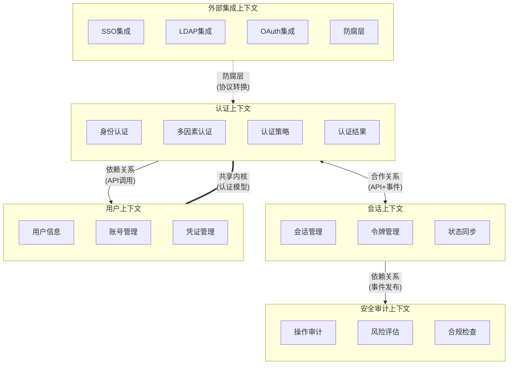

# 限界上下文分析报告
版本：v1.0.1
日期：2024-03-21

## 1. 上下文映射图（Context Map Diagram）



## 2. 上下文描述

### 2.1 认证上下文（BC1）
- 核心职责：
  - 处理所有形式的用户认证请求
  - 执行多因素认证流程
  - 管理认证策略和规则
  - 生成认证结果

- 关键功能：
  - 用户名密码认证
  - 双因素认证（2FA）
  - 生物识别认证
  - 风险级别评估
  - 认证策略执行

- 数据资产：
  - 认证策略配置
  - 认证历史记录
  - 风险评估规则
  - 认证结果缓存

- 对外接口：
  - REST API:
    ```
    POST /api/v1/auth/login
    POST /api/v1/auth/mfa
    GET /api/v1/auth/status
    ```
  - 事件：
    ```
    认证成功事件
    认证失败事件
    策略变更事件
    ```

### 2.2 会话上下文（BC2）
- 核心职责：
  - 管理用户会话生命周期
  - 处理访问令牌
  - 维护登录状态
  - 同步多设备状态

- 关键功能：
  - 会话创建和销毁
  - 令牌生成和验证
  - 会话状态管理
  - 并发登录控制
  - 会话续期

- 数据资产：
  - 活跃会话信息
  - 令牌存储
  - 设备信息
  - 状态同步记录

- 对外接口：
  - REST API:
    ```
    POST /api/v1/sessions
    GET /api/v1/sessions/{id}
    DELETE /api/v1/sessions/{id}
    ```
  - 事件：
    ```
    会话创建事件
    会话过期事件
    会话注销事件
    ```

### 2.3 用户上下文（BC3）
- 核心职责：
  - 管理用户基本信息
  - 处理账号生命周期
  - 维护用户凭证
  - 管理用户状态

- 关键功能：
  - 用户信息管理
  - 账号状态控制
  - 凭证更新
  - 账号关联

- 数据资产：
  - 用户基本信息
  - 账号状态信息
  - 凭证信息
  - 关联账号数据

- 对外接口：
  - REST API:
    ```
    POST /api/v1/users
    GET /api/v1/users/{id}
    PUT /api/v1/users/{id}
    ```
  - 共享模型：
    ```
    用户身份模型
    凭证模型
    ```

### 2.4 安全审计上下文（BC4）
- 核心职责：
  - 记录系统操作日志
  - 执行安全风险评估
  - 确保合规性要求
  - 生成审计报告

- 关键功能：
  - 操作日志记录
  - 风险评估分析
  - 合规性检查
  - 审计报告生成
  - 实时告警

- 数据资产：
  - 操作日志
  - 风险评估数据
  - 合规检查结果
  - 审计报告

- 对外接口：
  - REST API:
    ```
    POST /api/v1/audit/logs
    GET /api/v1/audit/reports
    ```
  - 消息订阅：
    ```
    认证事件订阅
    会话事件订阅
    ```

### 2.5 外部集成上下文（BC5）
- 核心职责：
  - 管理外部认证集成
  - 处理身份联合
  - 协调认证协议
  - 数据同步转换

- 关键功能：
  - SSO服务集成
  - LDAP认证集成
  - OAuth认证集成
  - 数据同步转换
  - 配置管理

- 数据资产：
  - 集成配置信息
  - 映射关系数据
  - 同步状态记录
  - 临时凭证数据

- 对外接口：
  - REST API:
    ```
    POST /api/v1/integration/sso
    POST /api/v1/integration/ldap
    ```
  - 防腐层接口：
    ```
    协议转换接口
    数据映射接口
    ```

## 3. 跨上下文关系

### 3.1 认证上下文与会话上下文
- 上游上下文：认证上下文
- 与上游关系类型：合作关系（Cooperation）
- 下游上下文：会话上下文
- 与下游关系类型：合作关系（Cooperation）
- 通信方式：
  - 同步：RESTful API
  - 异步：事件发布/订阅（认证结果事件）
- 数据流向：
  - 认证上下文 -> 会话上下文：认证结果、用户信息
  - 会话上下文 -> 认证上下文：会话状态、令牌验证

### 3.2 认证上下文与用户上下文
- 上游上下文：用户上下文
- 与上游关系类型：共享内核（Shared Kernel）
- 下游上下文：认证上下文
- 与下游关系类型：共享内核（Shared Kernel）
- 通信方式：
  - 同步：共享数据模型
  - 异步：事件发布/订阅
- 数据流向：
  - 共享用户身份模型
  - 共享凭证模型
  - 状态变更通知

### 3.3 会话上下文与安全审计上下文
- 上游上下文：会话上下文
- 与上游关系类型：依赖关系（Dependency）
- 下游上下文：安全审计上下文
- 与下游关系类型：服务消费者（Consumer）
- 通信方式：
  - 异步：消息队列（Kafka/RabbitMQ）
  - 日志流：ELK Stack
- 数据流向：
  - 会话操作事件
  - 安全告警事件
  - 审计日志流

### 3.4 外部集成上下文与认证上下文
- 上游上下文：外部集成上下文
- 与上游关系类型：防腐层（Anti-corruption Layer）
- 下游上下文：认证上下文
- 与下游关系类型：服务提供者（Provider）
- 通信方式：
  - 同步：RESTful API（通过防腐层）
  - 配置：动态配置更新
- 数据流向：
  - 外部身份信息转换
  - 协议适配转换
  - 配置同步更新

## 4. 微服务映射

### 4.1 认证服务（Authentication Service）
- 对应上下文：认证上下文
- 服务职责：
  - 处理所有认证请求
  - 执行认证策略
  - 生成认证结果
  - 管理认证配置
- 接口定义：
  ```
  # RESTful API
  POST /api/v1/auth/login
  POST /api/v1/auth/mfa
  GET /api/v1/auth/status
  PUT /api/v1/auth/policy

  # 事件
  AuthenticationSucceeded
  AuthenticationFailed
  PolicyUpdated
  ```
- 依赖服务：
  - 用户服务（共享内核）
  - 会话服务（合作关系）
  - 集成服务（通过防腐层）

### 4.2 会话服务（Session Service）
- 对应上下文：会话上下文
- 服务职责：
  - 管理用户会话
  - 处理令牌
  - 同步登录状态
- 接口定义：
  ```
  # RESTful API
  POST /api/v1/sessions
  GET /api/v1/sessions/{id}
  PUT /api/v1/sessions/{id}/refresh
  DELETE /api/v1/sessions/{id}

  # 事件
  SessionCreated
  SessionExpired
  SessionTerminated
  ```
- 依赖服务：
  - 认证服务（合作关系）
  - 审计服务（发布者）

### 4.3 用户服务（User Service）
- 对应上下文：用户上下文
- 服务职责：
  - 用户信息管理
  - 账号生命周期
  - 凭证管理
- 接口定义：
  ```
  # RESTful API
  POST /api/v1/users
  GET /api/v1/users/{id}
  PUT /api/v1/users/{id}
  PATCH /api/v1/users/{id}/status

  # 共享模型
  UserIdentity
  UserCredential
  ```
- 依赖服务：
  - 认证服务（共享内核）
  - 审计服务（发布者）

### 4.4 审计服务（Audit Service）
- 对应上下文：安全审计上下文
- 服务职责：
  - 日志记录
  - 风险评估
  - 合规检查
- 接口定义：
  ```
  # RESTful API
  POST /api/v1/audit/logs
  GET /api/v1/audit/reports
  POST /api/v1/audit/risks
  GET /api/v1/audit/compliance

  # 消息订阅
  AuthenticationEvents
  SessionEvents
  UserEvents
  ```
- 依赖服务：无（纯消费者）

### 4.5 集成服务（Integration Service）
- 对应上下文：外部集成上下文
- 服务职责：
  - 外部认证集成
  - 数据同步转换
  - 配置管理
- 接口定义：
  ```
  # RESTful API
  POST /api/v1/integration/sso
  POST /api/v1/integration/ldap
  POST /api/v1/integration/oauth
  PUT /api/v1/integration/config

  # 防腐层接口
  ProtocolTranslator
  DataMapper
  ```
- 依赖服务：
  - 认证服务（通过防腐层）
  - 用户服务（数据同步）

## 附录

### 参考资料
- Eric Evans《Domain-Driven Design》
- Vaughn Vernon《实现领域驱动设计》
- Sam Newman《Building Microservices》

### 变更记录
- 2024-03-21: v1.0.1
  - 初始版本
  - 完成上下文分析
  - 定义服务边界
  - 设计接口规范
  - 补充关系类型
  - 完善通信模式 