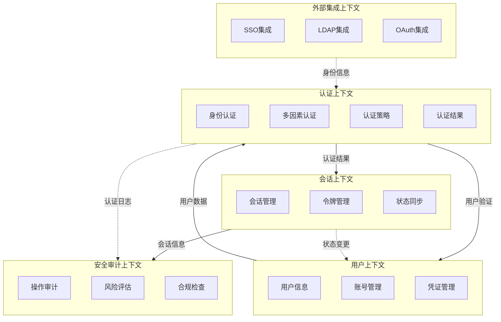

# 限界上下文分析报告
版本：v1.0.1
日期：2024-03-21

## 1. 上下文边界图



## 2. 上下文描述

### 2.1 认证上下文（BC1）
- 核心职责：
  - 处理所有形式的用户认证请求
  - 执行多因素认证流程
  - 管理认证策略和规则
  - 生成认证结果

- 关键功能：
  - 用户名密码认证
  - 双因素认证（2FA）
  - 生物识别认证
  - 风险级别评估
  - 认证策略执行

- 数据资产：
  - 认证策略配置
  - 认证历史记录
  - 风险评估规则
  - 认证结果缓存

- 对外接口：
  - 认证请求接口
  - 认证结果查询
  - 策略配置接口
  - 状态查询接口

### 2.2 会话上下文（BC2）
- 核心职责：
  - 管理用户会话生命周期
  - 处理访问令牌
  - 维护登录状态
  - 同步多设备状态

- 关键功能：
  - 会话创建和销毁
  - 令牌生成和验证
  - 会话状态管理
  - 并发登录控制
  - 会话续期

- 数据资产：
  - 活跃会话信息
  - 令牌存储
  - 设备信息
  - 状态同步记录

- 对外接口：
  - 会话管理API
  - 令牌验证接口
  - 状态同步接口
  - 会话查询接口

### 2.3 用户上下文（BC3）
- 核心职责：
  - 管理用户基本信息
  - 处理账号生命周期
  - 维护用户凭证
  - 管理用户状态

- 关键功能：
  - 用户信息管理
  - 账号状态控制
  - 凭证更新
  - 账号关联

- 数据资产：
  - 用户基本信息
  - 账号状态信息
  - 凭证信息
  - 关联账号数据

- 对外接口：
  - 用户信息CRUD
  - 状态查询接口
  - 凭证管理接口
  - 账号关联接口

### 2.4 安全审计上下文（BC4）
- 核心职责：
  - 记录系统操作日志
  - 执行安全风险评估
  - 确保合规性要求
  - 生成审计报告

- 关键功能：
  - 操作日志记录
  - 风险评估分析
  - 合规性检查
  - 审计报告生成
  - 实时告警

- 数据资产：
  - 操作日志
  - 风险评估数据
  - 合规检查结果
  - 审计报告

- 对外接口：
  - 日志记录接口
  - 风险评估接口
  - 合规检查接口
  - 报告生成接口

### 2.5 外部集成上下文（BC5）
- 核心职责：
  - 管理外部认证集成
  - 处理身份联合
  - 协调认证协议
  - 数据同步转换

- 关键功能：
  - SSO服务集成
  - LDAP认证集成
  - OAuth认证集成
  - 数据同步转换
  - 配置管理

- 数据资产：
  - 集成配置信息
  - 映射关系数据
  - 同步状态记录
  - 临时凭证数据

- 对外接口：
  - 集成配置接口
  - 认证代理接口
  - 数据同步接口
  - 状态查询接口

## 3. 上下文关系

### 3.1 认证上下文与用户上下文
- 上游上下文：用户上下文
- 下游上下文：认证上下文
- 通信方式：同步RPC + 事件通知
- 数据流向：
  - 用户上下文提供用户基本信息和凭证信息
  - 认证上下文返回认证结果
  - 状态变更通过事件通知

### 3.2 认证上下文与会话上下文
- 上游上下文：认证上下文
- 下游上下文：会话上下文
- 通信方式：同步RPC + 消息队列
- 数据流向：
  - 认证上下文提供认证结果
  - 会话上下文创建和管理会话
  - 状态变更通过消息队列同步

### 3.3 会话上下文与安全审计上下文
- 上游上下文：会话上下文
- 下游上下文：安全审计上下文
- 通信方式：异步消息 + 日志流
- 数据流向：
  - 会话操作日志
  - 状态变更事件
  - 安全告警信息

### 3.4 外部集成上下文与认证上下文
- 上游上下文：外部集成上下文
- 下游上下文：认证上下文
- 通信方式：同步RPC + 数据同步
- 数据流向：
  - 外部身份信息转换
  - 认证请求代理
  - 结果同步回调

## 4. 微服务映射

### 4.1 认证服务（Authentication Service）
- 对应上下文：认证上下文
- 服务职责：
  - 处理所有认证请求
  - 执行认证策略
  - 生成认证结果
  - 管理认证配置
- 接口定义：
  ```
  POST /api/v1/auth/login
  POST /api/v1/auth/mfa
  GET /api/v1/auth/status
  PUT /api/v1/auth/policy
  ```
- 依赖服务：
  - 用户服务
  - 会话服务
  - 外部集成服务

### 4.2 会话服务（Session Service）
- 对应上下文：会话上下文
- 服务职责：
  - 管理用户会话
  - 处理令牌
  - 同步登录状态
- 接口定义：
  ```
  POST /api/v1/sessions
  GET /api/v1/sessions/{id}
  PUT /api/v1/sessions/{id}/refresh
  DELETE /api/v1/sessions/{id}
  ```
- 依赖服务：
  - 认证服务
  - 审计服务

### 4.3 用户服务（User Service）
- 对应上下文：用户上下文
- 服务职责：
  - 用户信息管理
  - 账号生命周期
  - 凭证管理
- 接口定义：
  ```
  POST /api/v1/users
  GET /api/v1/users/{id}
  PUT /api/v1/users/{id}
  PATCH /api/v1/users/{id}/status
  ```
- 依赖服务：
  - 审计服务

### 4.4 审计服务（Audit Service）
- 对应上下文：安全审计上下文
- 服务职责：
  - 日志记录
  - 风险评估
  - 合规检查
- 接口定义：
  ```
  POST /api/v1/audit/logs
  GET /api/v1/audit/reports
  POST /api/v1/audit/risks
  GET /api/v1/audit/compliance
  ```
- 依赖服务：无

### 4.5 集成服务（Integration Service）
- 对应上下文：外部集成上下文
- 服务职责：
  - 外部认证集成
  - 数据同步转换
  - 配置管理
- 接口定义：
  ```
  POST /api/v1/integration/sso
  POST /api/v1/integration/ldap
  POST /api/v1/integration/oauth
  PUT /api/v1/integration/config
  ```
- 依赖服务：
  - 认证服务
  - 用户服务

## 附录

### 参考资料
- Eric Evans《Domain-Driven Design》
- Vaughn Vernon《实现领域驱动设计》
- Sam Newman《Building Microservices》

### 变更记录
- 2024-03-21: v1.0.1
  - 初始版本
  - 完成上下文分析
  - 定义服务边界
  - 设计接口规范 


  # DDD 
  ## 获得 DDD 设计思路 - ChatGpt
  请告诉我， 一个专业 DDD 如何一步一步的 完成一个需求的 DDD 设计。 
  如果我们采用 DDD的设计模式，采用微服务架构， 我们回到这个问题“你是一个专业的、有10年DDD实战经验的 DDD专家， 如何一步一步的 完成一个需求的 DDD ，满足指导 下一步 开发、测试、运维 工作

  ## 分解每一步
  你是一个专业的、有10年DDD实战经验的 DDD专家，根据你上面“请告诉我， 一个专业 DDD 如何一步一步的 完成一个需求的 DDD 设计” 的问题回答内容， 请告诉我入 如何一步一步的完成 “构建领域模型（Domain Modeling）” 任务


## 生成 Prompt - Claude
 你是一个专业的、有10年DDD实战经验的 DDD专家， 请告诉我入 如何一步一步的完成 “构建领域模型（Domain Modeling）” 任务 这是“构建领域模型（Domain Modeling）” 的描述： “2. 构建领域模型（Domain Modeling）

2.1 识别领域对象（Entity、Value Object）
	•	实体（Entity）：有独立标识且生命周期可追踪的对象，例如订单、客户等。
	•	值对象（Value Object）：没有唯一标识，只由属性定义的对象，例如地址、金额、时间段等。
	•	确保值对象是不可变的，避免与实体混淆。

2.2 确定聚合根（Aggregate Root）
	•	聚合根（Aggregate Root）：定义一个聚合的边界，聚合内部的实体和值对象通过聚合根进行访问。聚合根保证了聚合内部的一致性。
	•	确保聚合根的操作是事务性的，即在同一事务内完成聚合内部数据的一致性更新。

2.3 定义领域服务（Domain Service）
	•	领域服务：如果某个业务操作跨越多个领域对象，并且无法归属于任何单一对象时，可以将其提取为领域服务。例如，订单确认服务、库存调整服务等。

2.4 领域事件（Domain Event）
	•	领域事件：表示领域中的某个状态发生了改变，通常用来实现解耦和触发异步处理。例如，“订单已支付”或“库存已更新”等。”
