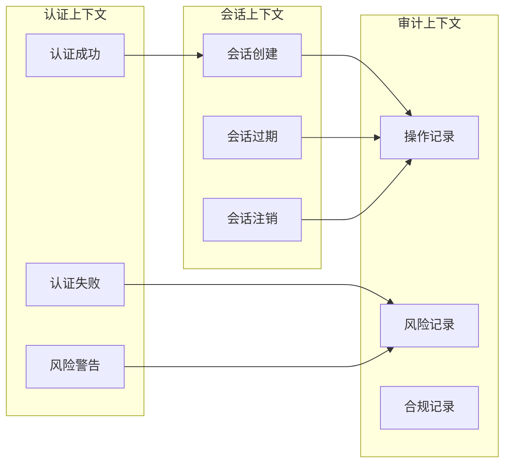
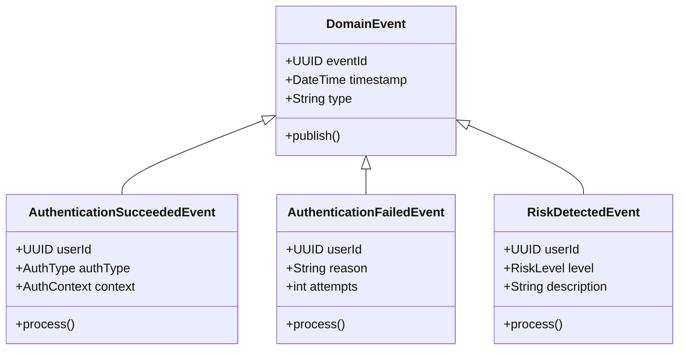
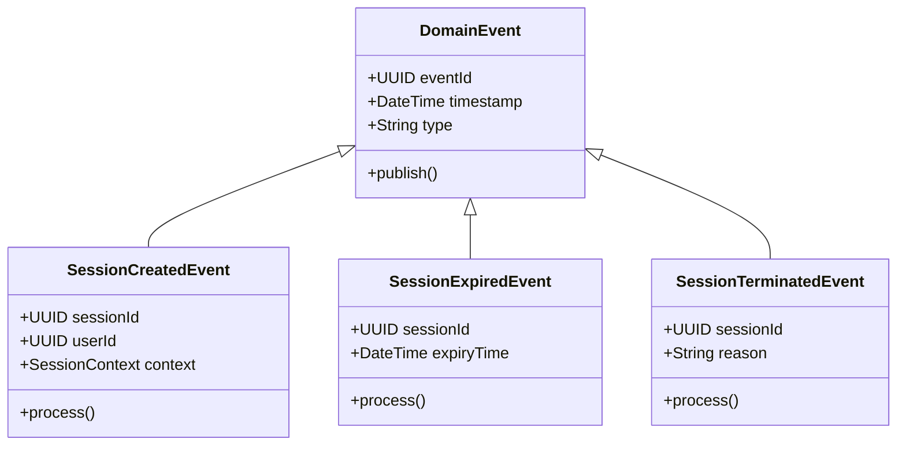
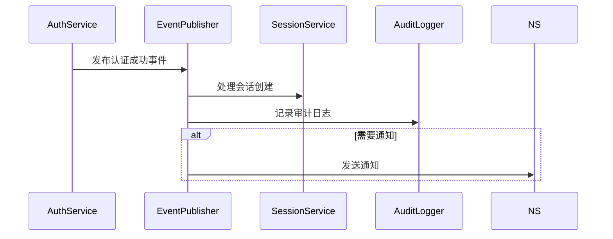
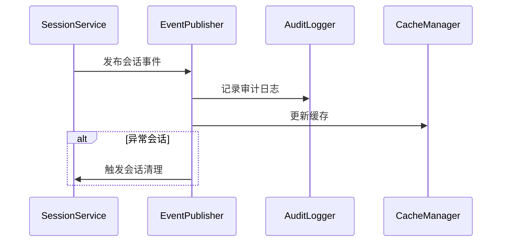
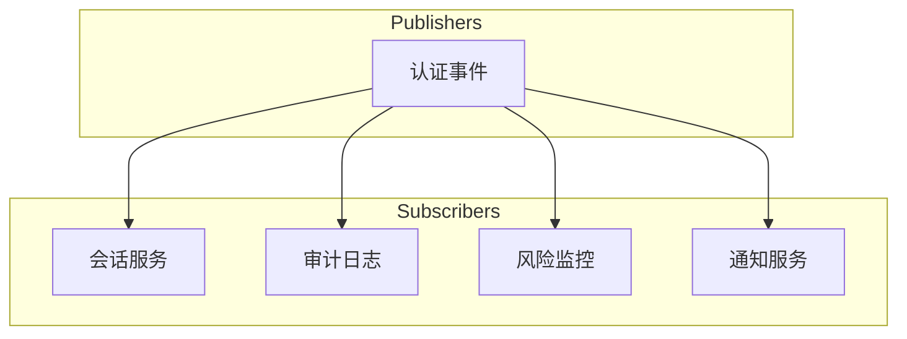
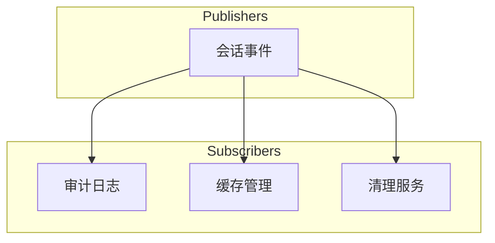
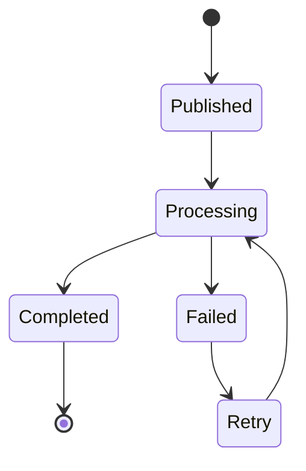
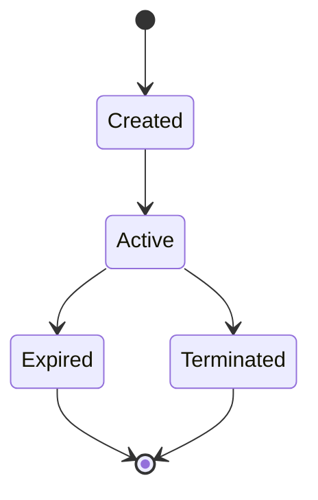

# 登录系统领域事件图
版本：v1.0.1
日期：2024-03-21

## 1. 事件流概述

### 1.1 整体事件流


### 1.2 事件分类
| 事件类型 | 所属上下文 | 触发条件 | 影响范围 |
|---------|-----------|----------|----------|
| 认证事件 | 认证上下文 | 用户认证操作 | 全局 |
| 会话事件 | 会话上下文 | 会话状态变更 | 用户级 |
| 审计事件 | 审计上下文 | 安全相关操作 | 系统级 |

## 2. 核心领域事件

### 2.1 认证事件


### 2.2 会话事件


## 3. 事件处理流程

### 3.1 认证成功流程


### 3.2 会话管理流程


## 4. 事件订阅关系

### 4.1 认证事件订阅


### 4.2 会话事件订阅


## 5. 事件状态流转

### 5.1 认证事件状态


### 5.2 会话事件状态


## 6. 事件处理策略

### 6.1 事件处理规则
| 事件类型 | 处理优先级 | 重试策略 | 失败处理 |
|---------|-----------|----------|----------|
| 认证成功 | 高 | 3次，指数退避 | 告警通知 |
| 认证失败 | 中 | 2次，固定间隔 | 记录日志 |
| 会话创建 | 高 | 3次，指数退避 | 强制清理 |
| 会话过期 | 低 | 1次，立即重试 | 异步清理 |

### 6.2 事件存储策略
| 事件类型 | 存储时间 | 存储方式 | 清理策略 |
|---------|----------|----------|----------|
| 认证事件 | 30天 | 数据库 | 定期归档 |
| 会话事件 | 7天 | 数据库 | 定期清理 |
| 审计事件 | 180天 | 数据库 | 定期归档 |

## 7. 事件监控

### 7.1 监控指标
| 指标 | 描述 | 警告阈值 | 监控周期 |
|------|------|----------|----------|
| 事件处理延迟 | 从发布到处理完成的时间 | >500ms | 实时 |
| 事件处理成功率 | 成功处理的事件百分比 | <99% | 分钟 |
| 事件积压数量 | 待处理的事件队列长度 | >1000 | 实时 |

### 7.2 告警规则
| 规则 | 条件 | 级别 | 通知方式 |
|------|------|------|----------|
| 高延迟 | 延迟>1s | 警告 | 邮件 |
| 处理失败 | 失败率>5% | 严重 | 短信+邮件 |
| 队列积压 | 积压>5000 | 紧急 | 电话+短信 |

## 8. 附录

### 8.1 事件Schema
```json
{
    "DomainEvent": {
        "eventId": "UUID",
        "timestamp": "DateTime",
        "type": "String",
        "version": "String",
        "data": "Object"
    }
}
```

### 8.2 变更历史
| 日期 | 版本 | 变更内容 | 作者 |
|------|------|----------|------|
| 2024-03-21 | v1.0.1 | 初始版本 | DDD Expert | 