# 登录系统领域模型图
版本：v1.0.1
日期：2024-03-21

## 1. 整体领域模型

### 1.1 核心领域模型
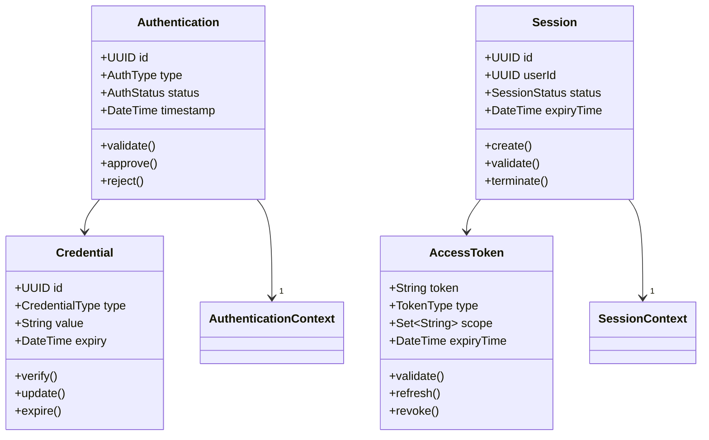

### 1.2 值对象模型
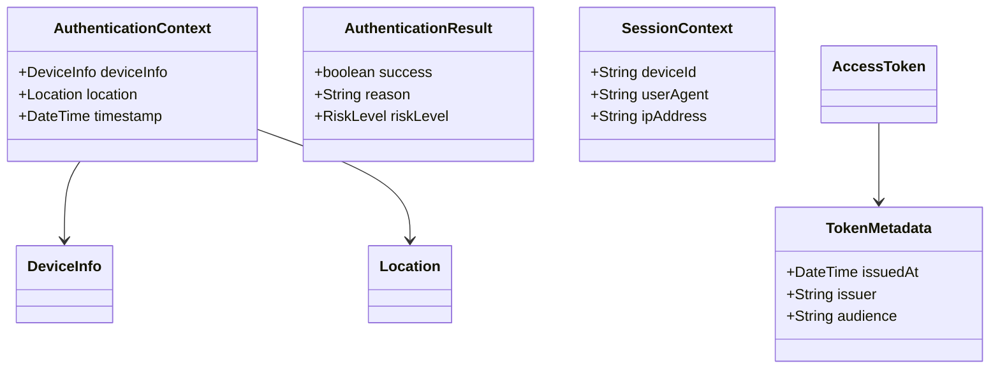

## 2. 限界上下文详情

### 2.1 认证上下文
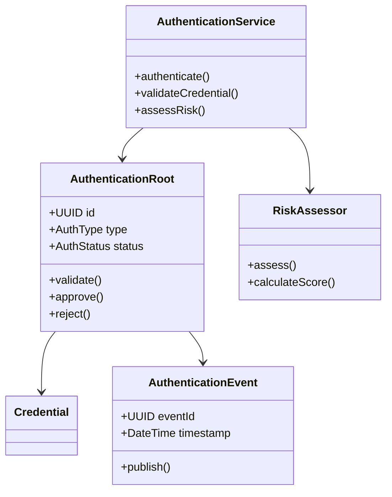

### 2.2 会话上下文
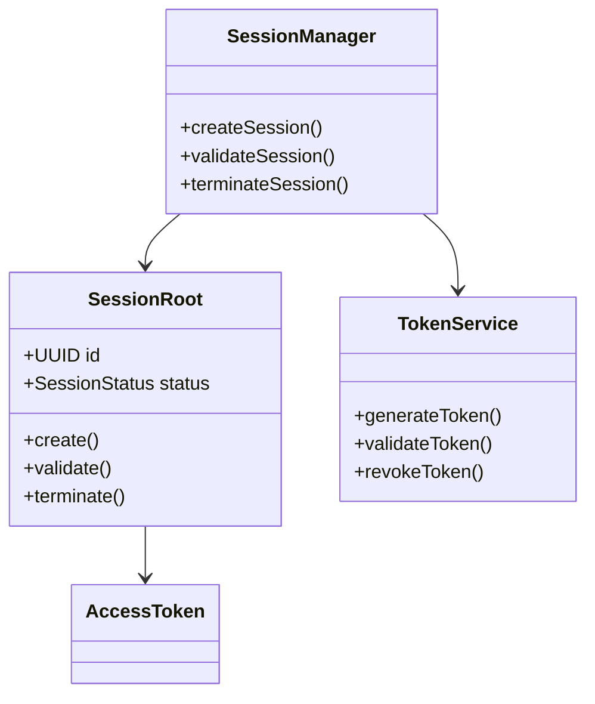

## 3. 上下文交互模型

### 3.1 认证流程
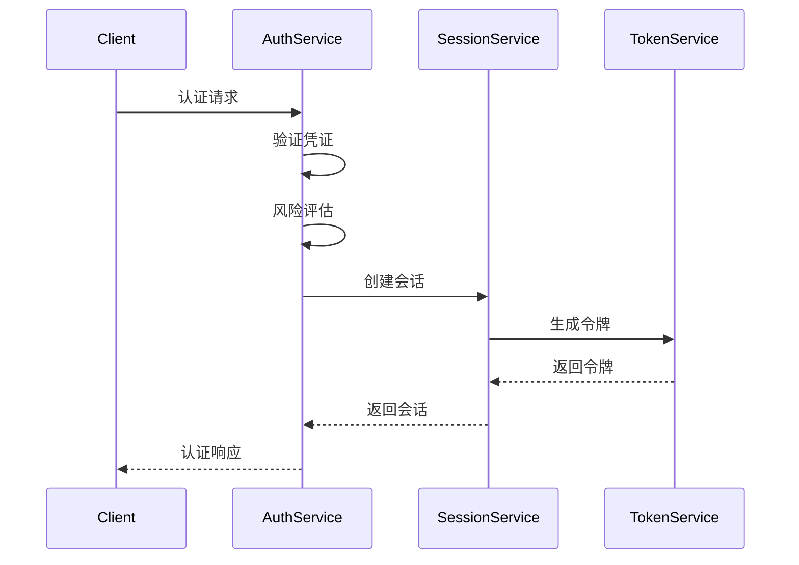

### 3.2 会话管理流程
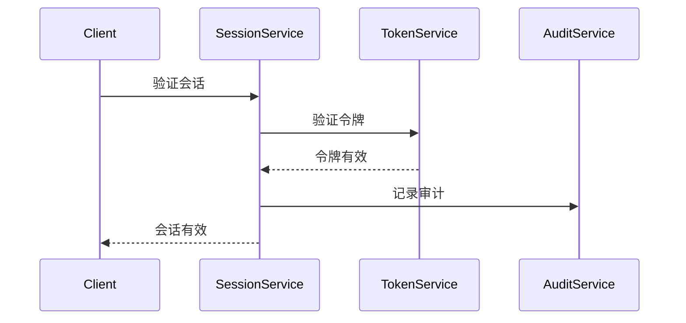

## 4. 聚合关系模型

### 4.1 认证聚合
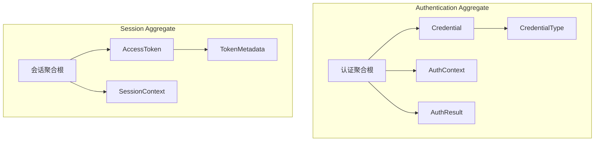

### 4.2 领域服务交互
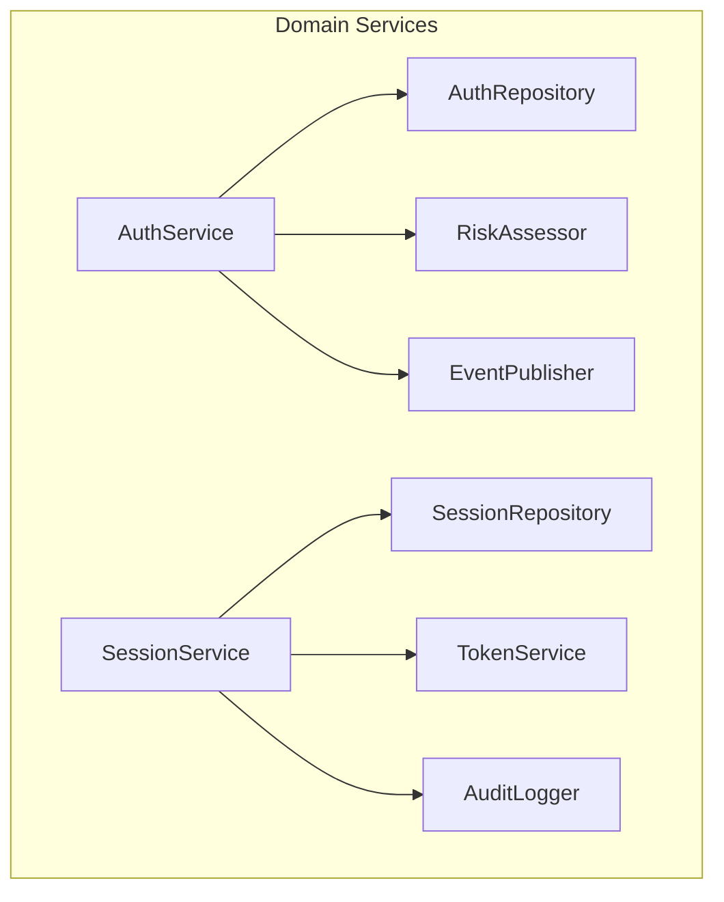

## 5. 事件流模型

### 5.1 认证事件流
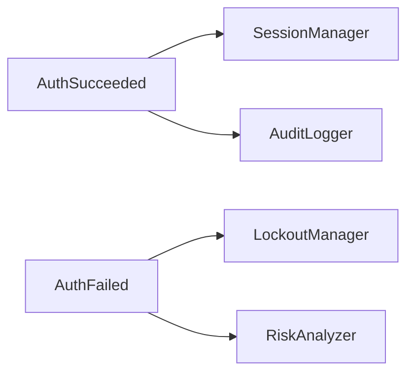

### 5.2 会话事件流
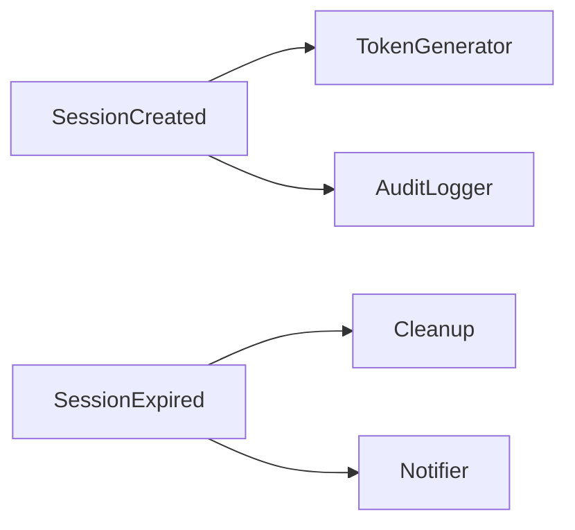

## 6. 状态转换图

### 6.1 认证状态
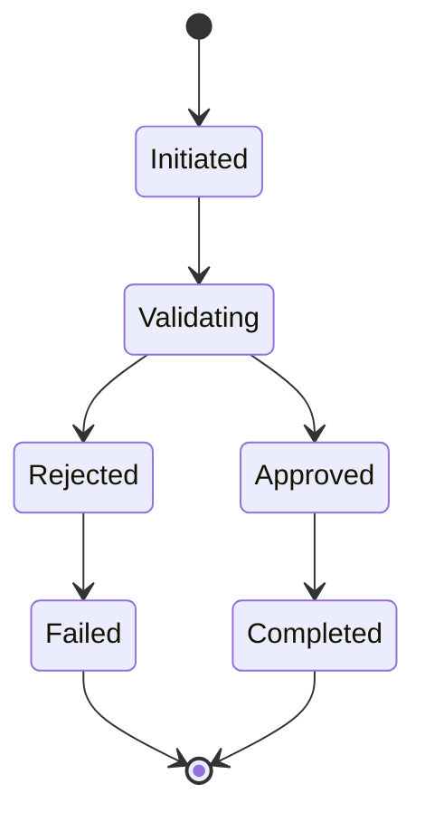

### 6.2 会话状态
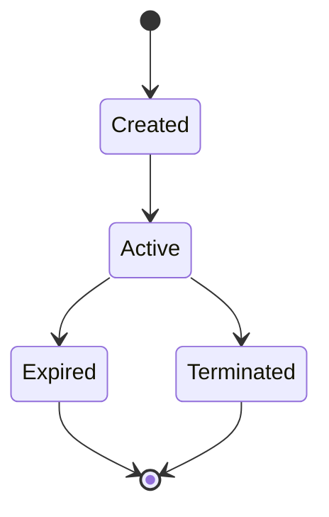

## 7. 附录

### 7.1 图例说明
| 符号 | 含义 | 用法 |
|------|------|------|
| 实线箭头 | 关联关系 | 表示对象之间的直接关联 |
| 虚线箭头 | 依赖关系 | 表示对象之间的依赖调用 |
| 实线框 | 聚合边界 | 表示聚合的范围 |
| 双线框 | 限界上下文 | 表示上下文的边界 |

### 7.2 变更历史
| 日期 | 版本 | 变更内容 | 作者 |
|------|------|----------|------|
| 2024-03-21 | v1.0.1 | 初始版本 | DDD Expert | 