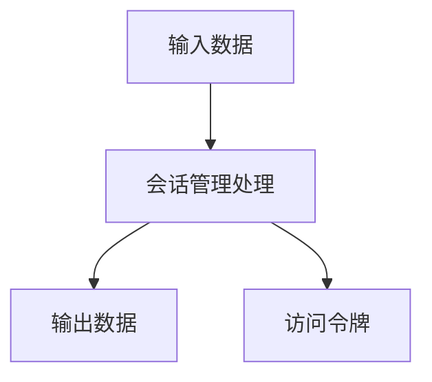
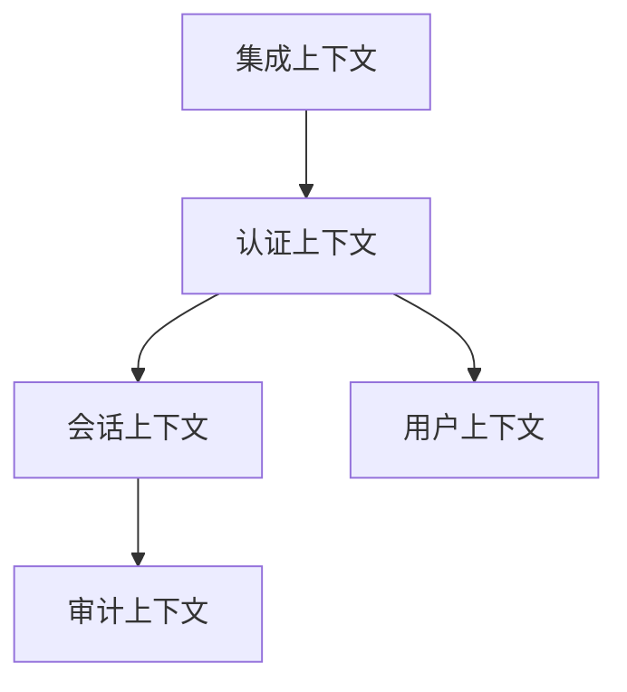

# 登录系统领域模型文档
版本：v1.0.1
日期：2024-03-21

## 1. 文档概述
### 1.1 目的
本领域模型文档旨在详细描述登录系统的领域模型，包括实体、值对象、聚合根、领域服务和领域事件的定义及其关系。

### 1.2 范围
涵盖登录系统的所有核心领域概念和业务规则，包括身份认证、会话管理、用户管理等领域。

## 2. 限界上下文中的领域对象

### 2.1 认证上下文
#### 2.1.1 实体
##### 实体概述表
| 实体名称 | 核心描述 | 业务场景 | 关联实体 |
|---------|---------|----------|----------|
| 身份认证 | 处理用户认证请求 | - 用户名密码认证<br>- 多因素认证 | - 认证策略: 管理认证规则 |

##### 属性详情
| 实体名称 | 属性名 | 类型 | 是否必填 | 描述 | 业务规则 | 验证逻辑 |
|---------|--------|------|-----------|------|----------|----------|
| 身份认证 | 用户名 | String | 是 | 用户的登录名 | - 必须唯一 | - 格式验证 |
| 身份认证 | 密码 | String | 是 | 用户的登录密码 | - 密码复杂度要求 | - 加密存储 |

##### 行为详情
| 实体名称 | 行为名称 | 输入参数 | 返回值 | 前置条件 | 后置条件 | 业务规则 | 处理逻辑 |
|---------|----------|----------|---------|-----------|-----------|----------|----------|
| 身份认证 | 验证凭证 | - 用户名: String<br>- 密码: String | boolean | - 用户名存在 | - 返回验证结果 | - 密码匹配 | 1. 检查用户名<br>2. 验证密码 |

##### 不变量
| 实体名称 | 不变量 | 验证时机 | 违反后果 | 保证措施 |
|---------|--------|----------|-----------|----------|
| 身份认证 | 用户名唯一 | 创建时 | 认证失败 | - 数据库约束 |

##### 示例
```json
{
    "身份认证": {
        "用户名": "exampleUser",
        "密码": "hashedPassword"
    }
}
```

##### 使用案例场景
- 用户名密码认证: 用户输入用户名和密码进行登录。

##### 数据流图


##### UI/UX 考虑
- 登录界面设计应简洁，支持多种认证方式。

##### 集成点
- 与用户管理系统集成以获取用户信息。

##### 安全与合规
- 确保用户数据加密存储，符合GDPR要求。

##### 性能指标
- 认证响应时间应小于500ms。

##### 测试指南
- 测试用例：验证用户名密码组合的正确性。

### 2.2 会话上下文
#### 2.2.1 实体
##### 实体概述表
| 实体名称 | 核心描述 | 业务场景 | 关联实体 |
|---------|---------|----------|----------|
| 会话管理 | 管理用户会话生命周期 | - 会话创建和销毁<br>- 令牌管理 | - 访问令牌: 管理访问权限 |

##### 属性详情
| 实体名称 | 属性名 | 类型 | 是否必填 | 描述 | 业务规则 | 验证逻辑 |
|---------|--------|------|-----------|------|----------|----------|
| 会话管理 | 会话ID | UUID | 是 | 唯一标识会话 | - 必须唯一 | - 格式验证 |
| 会话管理 | 用户ID | UUID | 是 | 关联的用户标识 | - 必须存在 | - 外键约束 |

##### 行为详情
| 实体名称 | 行为名称 | 输入参数 | 返回值 | 前置条件 | 后置条件 | 业务规则 | 处理逻辑 |
|---------|----------|----------|---------|-----------|-----------|----------|----------|
| 会话管理 | 创建会话 | - 用户ID: UUID | 会话ID | - 用户已认证 | - 返回会话ID | - 会话有效期 | 1. 生成会话ID<br>2. 记录会话信息 |

##### 不变量
| 实体名称 | 不变量 | 验证时机 | 违反后果 | 保证措施 |
|---------|--------|----------|-----------|----------|
| 会话管理 | 会话ID唯一 | 创建时 | 会话冲突 | - 数据库约束 |

##### 示例
```json
{
    "会话管理": {
        "会话ID": "123e4567-e89b-12d3-a456-426614174000",
        "用户ID": "123e4567-e89b-12d3-a456-426614174001"
    }
}
```

##### 使用案例场景
- 用户登录后创建会话，管理用户的在线状态。

##### 数据流图


##### UI/UX 考虑
- 提供会话状态显示，支持用户主动注销。

##### 集成点
- 与认证服务集成以验证用户身份。

##### 安全与合规
- 确保会话数据加密传输，符合安全标准。

##### 性能指标
- 会话创建时间应小于200ms。

##### 测试指南
- 测试用例：验证会话创建和销毁的正确性。

## 3. 领域模型关系
### 3.1 上下文间关系


### 3.2 关系详情
| 源 | 目标 | 类型 | 描述 |
|---|------|------|------|
| 认证上下文 | 会话上下文 | 合作关系 | 认证成功后创建会话 |
| 认证上下文 | 用户上下文 | 共享内核 | 共享用户身份信息 |
| 会话上下文 | 审计上下文 | 发布者-订阅者 | 会话事件通知 |
| 集成上下文 | 认证上下文 | 防腐层 | 外部认证协议转换 |

## 4. 业务规则
### 4.1 不变量
| 规则ID | 描述 | 强制执行方式 |
|--------|------|-------------|
| INV001 | 用户凭证必须加密存储 | 数据持久化时强制加密 |
| INV002 | 会话Token必须具有有效期 | Token生成时强制设置 |

### 4.2 验证规则
| 规则ID | 上下文 | 验证内容 |
|--------|--------|----------|
| VAL001 | 认证上下文 | 密码复杂度要求 |
| VAL002 | 会话上下文 | Token格式验证 |

## 5. 实现指南
### 5.1 使用的模式
- 聚合根模式
  - 目的：确保数据一致性
  - 实现：通过Authentication和Session聚合根

- 领域事件模式
  - 目的：解耦上下文通信
  - 实现：使用事件总线传递领域事件

### 5.2 技术考虑
- 并发处理
  - 影响：会话状态管理
  - 缓解：使用分布式锁

- 性能优化
  - 影响：认证请求响应时间
  - 缓解：使用缓存和异步处理

## 6. 附录
### 6.1 术语表
| 术语 | 定义 | 上下文 |
|------|------|--------|
| 认证 | 验证用户身份的过程 | 认证上下文 |
| 会话 | 用户登录状态的记录 | 会话上下文 |
| 令牌 | 访问资源的凭证 | 会话上下文 |

### 6.2 参考资料
- Eric Evans《领域驱动设计》
- Vaughn Vernon《实现领域驱动设计》
- Martin Fowler《企业应用架构模式》

### 6.3 变更历史
| 日期 | 版本 | 变更内容 | 作者 |
|------|------|----------|------|
| 2024-03-21 | v1.0.1 | 初始版本 | DDD Expert | 