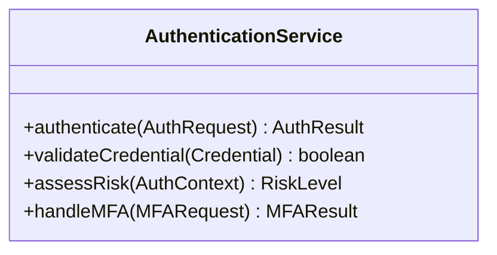
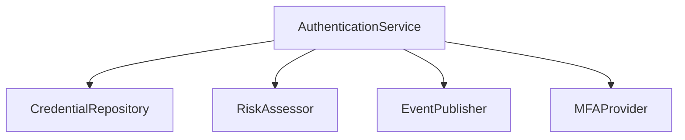
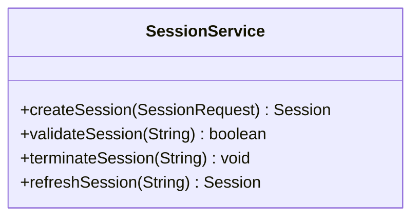
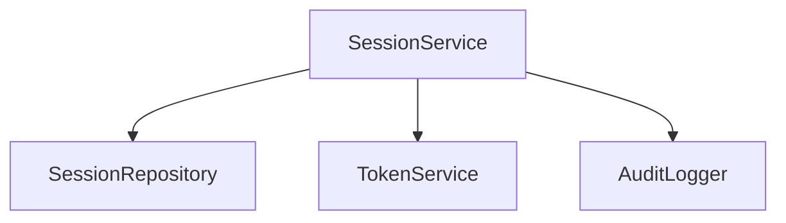
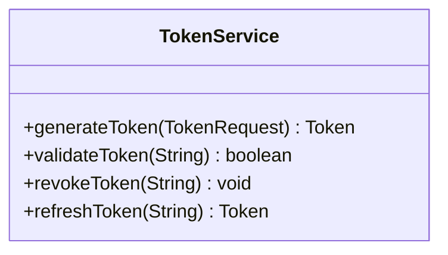
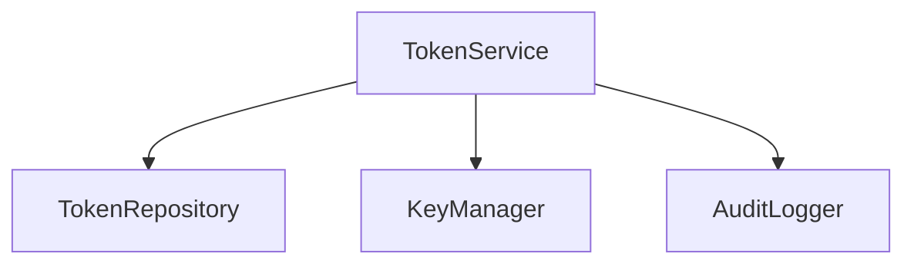
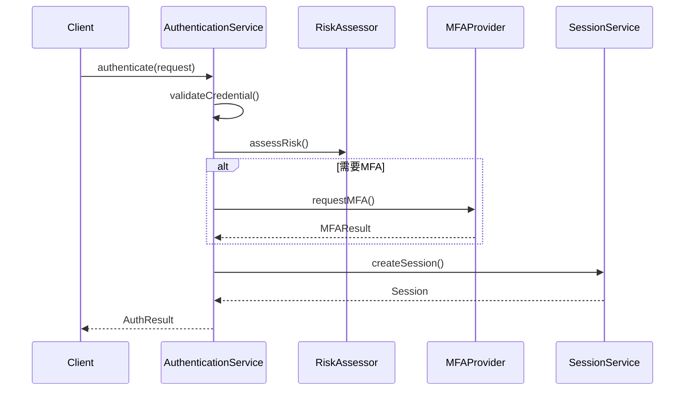
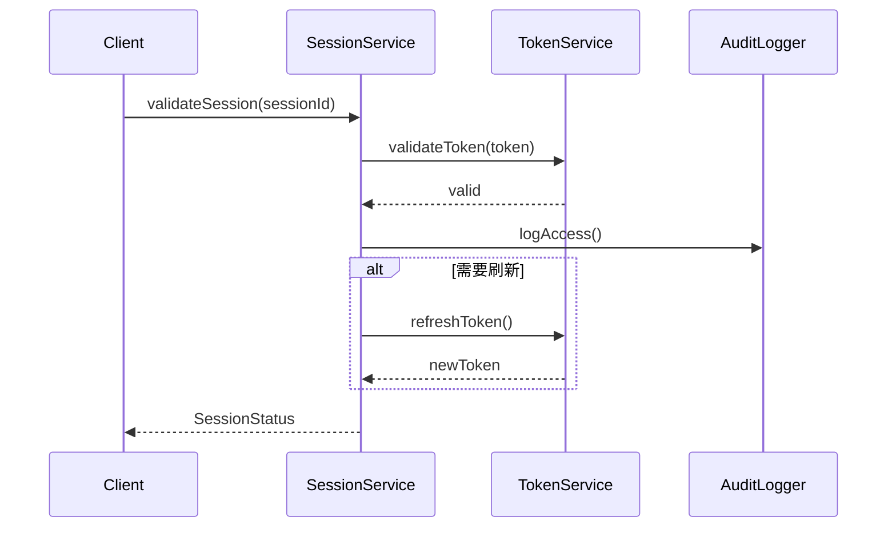

# 登录系统领域服务定义
版本：v1.0.1
日期：2024-03-21

## 1. 服务概述

### 1.1 目的
定义登录系统中的领域服务，封装跨领域对象的业务逻辑，确保领域模型的实现清晰且易于维护。

### 1.2 范围
涵盖认证、会话管理、用户管理等核心领域服务的定义和实现。

## 2. 服务定义

### 2.1 认证服务（AuthenticationService）
#### 2.1.1 服务接口


#### 2.1.2 操作定义
| 操作 | 参数 | 返回值 | 描述 |
|------|------|--------|------|
| authenticate | AuthRequest | AuthResult | 执行用户认证流程 |
| validateCredential | Credential | boolean | 验证用户凭证 |
| assessRisk | AuthContext | RiskLevel | 评估认证风险等级 |
| handleMFA | MFARequest | MFAResult | 处理多因素认证 |

#### 2.1.3 依赖关系


### 2.2 会话服务（SessionService）
#### 2.2.1 服务接口


#### 2.2.2 操作定义
| 操作 | 参数 | 返回值 | 描述 |
|------|------|--------|------|
| createSession | SessionRequest | Session | 创建新的会话 |
| validateSession | String sessionId | boolean | 验证会话有效性 |
| terminateSession | String sessionId | void | 终止指定会话 |
| refreshSession | String sessionId | Session | 刷新会话状态 |

#### 2.2.3 依赖关系


### 2.3 令牌服务（TokenService）
#### 2.3.1 服务接口


#### 2.3.2 操作定义
| 操作 | 参数 | 返回值 | 描述 |
|------|------|--------|------|
| generateToken | TokenRequest | Token | 生成访问令牌 |
| validateToken | String token | boolean | 验证令牌有效性 |
| revokeToken | String token | void | 撤销指定令牌 |
| refreshToken | String token | Token | 刷新访问令牌 |

#### 2.3.3 依赖关系


## 3. 业务流程

### 3.1 认证流程


### 3.2 会话管理流程


## 4. 服务实现

### 4.1 认证服务实现
```java
public class AuthenticationServiceImpl implements AuthenticationService {
    private final CredentialRepository credentialRepo;
    private final RiskAssessor riskAssessor;
    private final EventPublisher eventPublisher;
    private final MFAProvider mfaProvider;
    
    @Override
    public AuthResult authenticate(AuthRequest request) {
        // 实现认证逻辑
    }
    
    @Override
    public boolean validateCredential(Credential credential) {
        // 实现凭证验证
    }
    
    @Override
    public RiskLevel assessRisk(AuthContext context) {
        // 实现风险评估
    }
}
```

### 4.2 会话服务实现
```java
public class SessionServiceImpl implements SessionService {
    private final SessionRepository sessionRepo;
    private final TokenService tokenService;
    private final AuditLogger auditLogger;
    
    @Override
    public Session createSession(SessionRequest request) {
        // 实现会话创建
    }
    
    @Override
    public boolean validateSession(String sessionId) {
        // 实现会话验证
    }
}
```

## 5. 错误处理

### 5.1 异常定义
| 异常类型 | 错误码 | 处理策略 |
|---------|--------|----------|
| AuthenticationException | AUTH001 | 返回认证失败响应 |
| SessionException | SESS001 | 要求重新登录 |
| TokenException | TOK001 | 刷新令牌或重新认证 |

### 5.2 重试策略
| 操作 | 重试次数 | 间隔时间 | 退避策略 |
|------|----------|----------|----------|
| 认证 | 3 | 1s | 指数退避 |
| 令牌刷新 | 2 | 500ms | 固定间隔 |
| 会话验证 | 2 | 200ms | 固定间隔 |

## 6. 性能考虑

### 6.1 缓存策略
| 缓存对象 | 过期时间 | 刷新策略 |
|---------|----------|----------|
| 会话信息 | 30分钟 | 访问时刷新 |
| 令牌信息 | 15分钟 | 定时刷新 |
| 风险规则 | 1小时 | 变更时刷新 |

### 6.2 并发控制
| 操作 | 锁类型 | 超时时间 |
|------|--------|----------|
| 认证 | 无锁 | - |
| 会话创建 | 分布式锁 | 5s |
| 令牌刷新 | 分布式锁 | 3s |

## 7. 监控指标

### 7.1 性能指标
| 指标 | 目标值 | 警告阈值 | 监控周期 |
|------|--------|----------|----------|
| 认证响应时间 | <500ms | >1s | 实时 |
| 会话验证时间 | <100ms | >200ms | 实时 |
| 令牌验证时间 | <50ms | >100ms | 实时 |

### 7.2 业务指标
| 指标 | 目标值 | 警告阈值 | 监控周期 |
|------|--------|----------|----------|
| 认证成功率 | >95% | <90% | 小时 |
| 会话活跃数 | <100万 | >150万 | 分钟 |
| 令牌刷新率 | <10% | >20% | 小时 |

## 8. 附录

### 8.1 参考资料
- Spring Security文档
- OAuth 2.0规范
- JWT规范

### 8.2 变更历史
| 日期 | 版本 | 变更内容 | 作者 |
|------|------|----------|------|
| 2024-03-21 | v1.0.1 | 初始版本 | DDD Expert | 