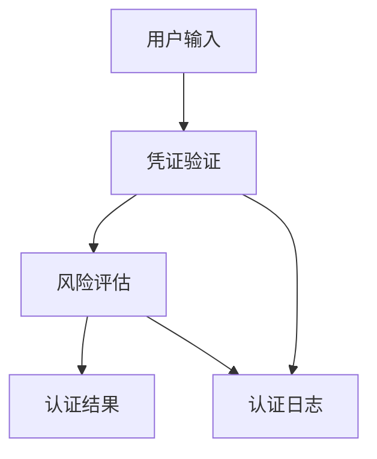
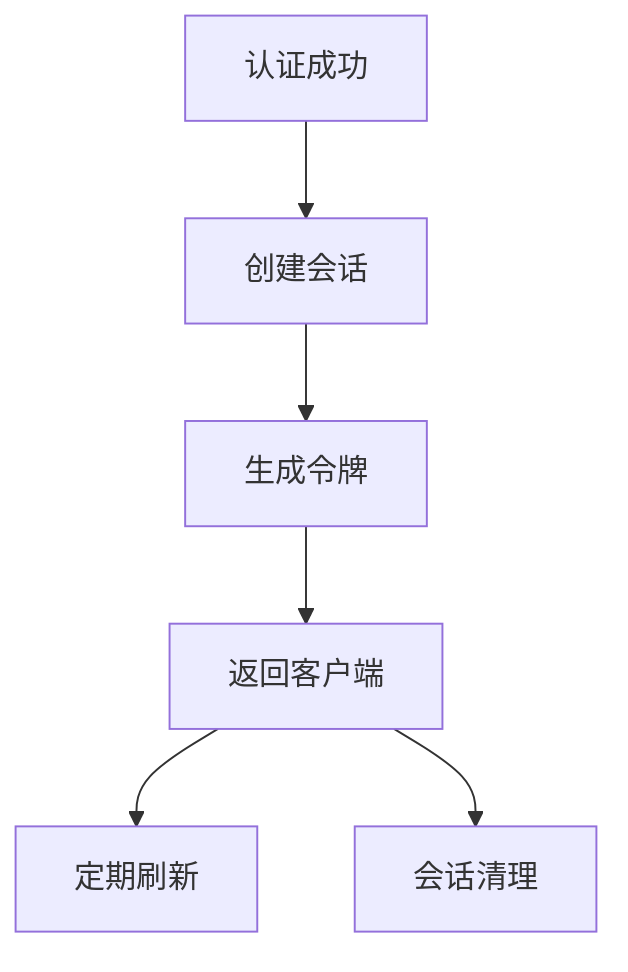
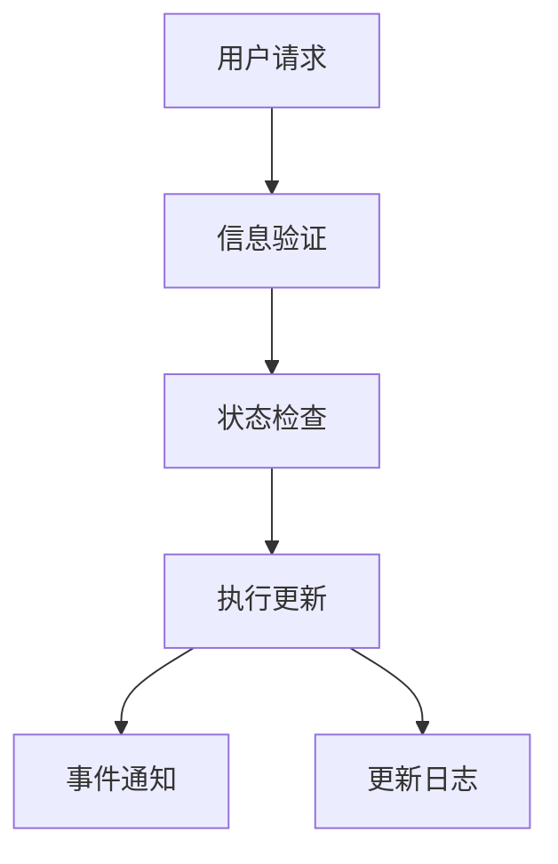
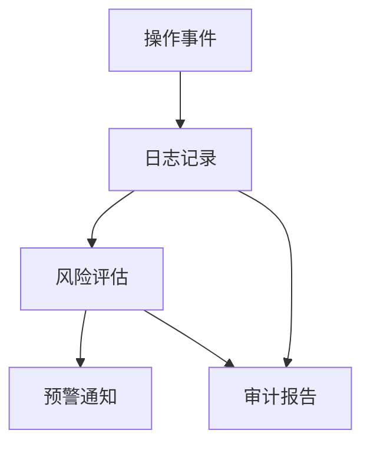
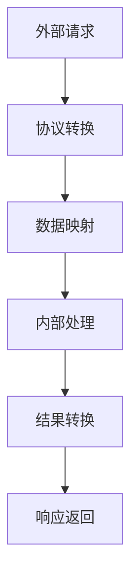
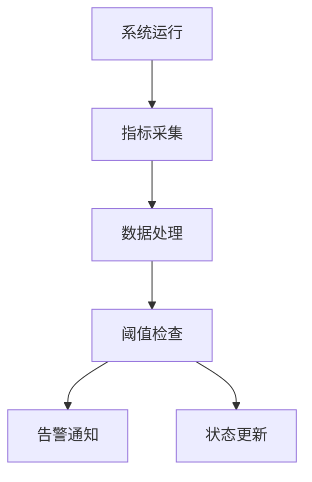
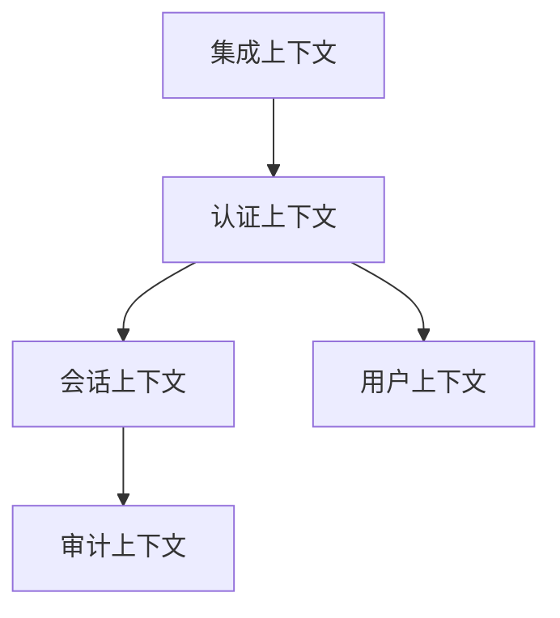

# 登录系统领域模型文档
版本：v1.0.1
日期：2024-03-21

## 1. 文档概述

### 1.1 目的
本文档旨在详细描述登录系统的领域模型，包括实体、值对象、聚合根、领域服务和领域事件的定义及其关系，为系统开发和维护提供指导。

### 1.2 范围
涵盖登录系统的核心域、支撑域和通用域的所有领域概念和业务规则，包括身份认证、会话管理、用户管理、安全审计等领域。

## 2. 限界上下文中的领域对象

### 2.1 身份认证上下文

#### 2.1.1 实体

##### 实体概述表
| 实体名称 | 核心描述 | 业务场景 | 关联实体 |
|---------|---------|----------|----------|
| 认证凭证 | 用户身份认证信息 | - 用户名密码认证<br>- 多因素认证<br>- 生物识别认证 | - 认证策略: 管理认证规则<br>- 风险评估: 评估认证风险 |
| 认证策略 | 认证规则和配置 | - 密码策略管理<br>- 认证方式配置<br>- 风险规则设置 | - 认证凭证: 验证规则应用<br>- 风险评估: 策略执行 |

##### 属性详情
| 实体名称 | 属性名 | 类型 | 是否必填 | 描述 | 业务规则 | 验证逻辑 |
|---------|--------|------|-----------|------|----------|----------|
| 认证凭证 | 凭证ID | UUID | 是 | 唯一标识符 | - 全局唯一 | - UUID格式校验 |
| 认证凭证 | 用户名 | String | 是 | 登录账号 | - 6-20位字母数字<br>- 不允许特殊字符 | - 正则表达式验证<br>- 唯一性检查 |
| 认证凭证 | 密码 | String | 是 | 加密存储的密码 | - 12-32位字符<br>- 复杂度评分>80 | - 密码强度校验<br>- 加密存储验证 |
| 认证策略 | 策略ID | UUID | 是 | 唯一标识符 | - 全局唯一 | - UUID格式校验 |
| 认证策略 | 策略类型 | Enum | 是 | 策略类型 | - 预定义类型 | - 枚举值验证 |
| 认证策略 | 规则配置 | JSON | 是 | 具体规则配置 | - 符合策略模式 | - JSON格式校验<br>- 规则完整性检查 |

##### 行为详情
| 实体名称 | 行为名称 | 输入参数 | 返回值 | 前置条件 | 后置条件 | 业务规则 | 处理逻辑 |
|---------|----------|----------|---------|-----------|-----------|----------|----------|
| 认证凭证 | 验证凭证 | - 用户名: String<br>- 密码: String | AuthResult | - 凭证存在<br>- 凭证未锁定 | - 更新认证结果<br>- 记录认证日志 | - 密码匹配<br>- 尝试次数限制 | 1. 检查凭证状态<br>2. 验证密码<br>3. 评估风险<br>4. 生成结果 |
| 认证策略 | 评估风险 | - 认证上下文: Context | RiskLevel | - 策略已启用 | - 更新风险等级 | - 风险阈值控制<br>- 多因素触发 | 1. 收集上下文<br>2. 应用规则<br>3. 计算风险等级 |

##### 不变量
| 实体名称 | 不变量 | 验证时机 | 违反后果 | 保证措施 |
|---------|--------|----------|-----------|----------|
| 认证凭证 | 用户名唯一性 | 创建/更新时 | 创建/更新失败 | - 唯一索引<br>- 事务控制 |
| 认证策略 | 规则一致性 | 规则更新时 | 更新失败 | - 规则验证<br>- 版本控制 |

##### 示例
```json
{
    "认证凭证": {
        "凭证ID": "550e8400-e29b-41d4-a716-446655440000",
        "用户名": "example_user",
        "密码": "hashed_password_value",
        "状态": "ACTIVE",
        "创建时间": "2024-03-21T10:00:00Z"
    },
    "认证策略": {
        "策略ID": "550e8400-e29b-41d4-a716-446655440001",
        "策略类型": "PASSWORD_POLICY",
        "规则配置": {
            "最小长度": 12,
            "复杂度要求": ["大写字母", "小写字母", "数字", "特殊字符"],
            "历史密码数": 5,
            "过期天数": 90
        }
    }
}
```

##### 使用案例场景
- 用户登录认证
  - 用户输入用户名密码
  - 系统验证凭证
  - 评估登录风险
  - 决定是否需要二次认证
  - 生成认证结果

##### 数据流图


##### UI/UX 考虑
- 登录界面设计
  - 简洁清晰的表单布局
  - 明确的错误提示
  - 支持多种认证方式切换
  - 记住用户名选项
- 安全提示
  - 密码强度实时提示
  - 登录状态显示
  - 异常登录提醒

##### 集成点
- 用户管理系统
  - 获取用户信息
  - 同步用户状态
- 风险控制系统
  - 实时风险评估
  - 安全策略执行
- 审计日志系统
  - 记录认证事件
  - 分析异常行为

##### 安全与合规
- 数据安全
  - 密码加密存储
  - 传输加密
  - 敏感信息脱敏
- 合规要求
  - 符合GDPR规范
  - 满足等保要求
  - 支持数据跨境传输

##### 性能指标
- 响应时间
  - 认证请求 < 500ms
  - 风险评估 < 200ms
- 并发处理
  - 支持10000 TPS
  - 错峰处理机制
- 可用性
  - 99.99%可用性
  - 故障自动切换

##### 测试指南
- 单元测试
  - 凭证验证逻辑
  - 策略执行逻辑
  - 风险评估算法
- 集成测试
  - 认证流程测试
  - 策略联动测试
- 性能测试
  - 高并发测试
  - 压力测试
- 安全测试
  - 渗透测试
  - 弱密码测试

### 2.2 会话管理上下文

#### 2.2.1 实体

##### 实体概述表
| 实体名称 | 核心描述 | 业务场景 | 关联实体 |
|---------|---------|----------|----------|
| 会话 | 用户登录会话 | - 会话创建<br>- 会话验证<br>- 会话销毁 | - 访问令牌: 授权凭证<br>- 设备信息: 登录环境 |
| 访问令牌 | 授权访问凭证 | - 令牌生成<br>- 令牌验证<br>- 令牌刷新 | - 会话: 关联会话<br>- 权限范围: 访问控制 |

##### 属性详情
| 实体名称 | 属性名 | 类型 | 是否必填 | 描述 | 业务规则 | 验证逻辑 |
|---------|--------|------|-----------|------|----------|----------|
| 会话 | 会话ID | UUID | 是 | 会话标识 | - 全局唯一 | - UUID格式校验 |
| 会话 | 用户ID | UUID | 是 | 用户标识 | - 用户必须存在 | - 外键约束 |
| 会话 | 状态 | Enum | 是 | 会话状态 | - 状态流转合法 | - 状态机校验 |
| 访问令牌 | 令牌ID | UUID | 是 | 令牌标识 | - 全局唯一 | - UUID格式校验 |
| 访问令牌 | 令牌值 | String | 是 | JWT令牌 | - JWT格式 | - JWT校验 |
| 访问令牌 | 过期时间 | DateTime | 是 | 失效时间 | - 大于当前时间 | - 时间有效性校验 |

##### 行为详情
| 实体名称 | 行为名称 | 输入参数 | 返回值 | 前置条件 | 后置条件 | 业务规则 | 处理逻辑 |
|---------|----------|----------|---------|-----------|-----------|----------|----------|
| 会话 | 创建会话 | - 用户ID: UUID<br>- 设备信息: DeviceInfo | Session | - 用户已认证 | - 会话已创建<br>- 令牌已生成 | - 并发会话控制<br>- 会话时长限制 | 1. 验证用户状态<br>2. 创建会话记录<br>3. 生成访问令牌<br>4. 记录会话日志 |
| 访问令牌 | 验证令牌 | - 令牌值: String | TokenInfo | - 令牌格式正确 | - 返回令牌信息 | - 令牌有效性<br>- 权限范围检查 | 1. 解析令牌<br>2. 验证签名<br>3. 检查有效期<br>4. 验证权限 |

##### 不变量
| 实体名称 | 不变量 | 验证时机 | 违反后果 | 保证措施 |
|---------|--------|----------|-----------|----------|
| 会话 | 会话ID唯一性 | 创建时 | 创建失败 | - 唯一索引<br>- 分布式锁 |
| 访问令牌 | 令牌有效性 | 使用时 | 访问拒绝 | - 签名验证<br>- 时间戳检查 |

##### 示例
```json
{
    "会话": {
        "会话ID": "550e8400-e29b-41d4-a716-446655440002",
        "用户ID": "550e8400-e29b-41d4-a716-446655440003",
        "状态": "ACTIVE",
        "创建时间": "2024-03-21T10:30:00Z",
        "最后访问时间": "2024-03-21T10:35:00Z"
    },
    "访问令牌": {
        "令牌ID": "550e8400-e29b-41d4-a716-446655440004",
        "令牌值": "eyJhbGciOiJIUzI1NiIsInR5cCI6IkpXVCJ9...",
        "过期时间": "2024-03-21T11:30:00Z",
        "刷新令牌": "550e8400-e29b-41d4-a716-446655440005"
    }
}
```

##### 使用案例场景
- 会话管理流程
  - 用户认证成功后创建会话
  - 生成访问令牌
  - 定期刷新会话
  - 超时或注销时清理会话

##### 数据流图


##### UI/UX 考虑
- 会话管理界面
  - 当前会话状态显示
  - 会话列表管理
  - 强制注销功能
- 用户体验
  - 自动续期提醒
  - 会话过期提示
  - 多设备登录提醒

##### 集成点
- 认证服务
  - 接收认证结果
  - 触发会话创建
- 审计服务
  - 记录会话操作
  - 监控异常行为
- 缓存服务
  - 存储会话信息
  - 令牌快速验证

##### 安全与合规
- 会话安全
  - 会话劫持防护
  - 令牌加密传输
  - 会话固定防护
- 访问控制
  - 细粒度权限控制
  - 动态权限调整
  - 越权访问防护

##### 性能指标
- 会话操作
  - 创建会话 < 100ms
  - 验证令牌 < 50ms
- 系统容量
  - 支持百万级并发会话
  - 会话定期清理
- 可用性
  - 99.999%可用性
  - 跨区域容灾

##### 测试指南
- 功能测试
  - 会话生命周期测试
  - 令牌管理测试
  - 并发会话测试
- 性能测试
  - 会话并发测试
  - 令牌验证性能
- 安全测试
  - 会话安全测试
  - 令牌欺骗测试

### 2.3 用户管理上下文

#### 2.3.1 实体

##### 实体概述表
| 实体名称 | 核心描述 | 业务场景 | 关联实体 |
|---------|---------|----------|----------|
| 用户信息 | 用户基本信息 | - 用户信息管理<br>- 账号状态管理<br>- 用户配置管理 | - 认证凭证: 关联认证信息<br>- 账号状态: 管理账号生命周期 |
| 账号状态 | 账号生命周期状态 | - 账号激活/停用<br>- 账号锁定/解锁<br>- 账号注销管理 | - 用户信息: 关联用户<br>- 认证凭证: 影响认证行为 |

##### 属性详情
| 实体名称 | 属性名 | 类型 | 是否必填 | 描述 | 业务规则 | 验证逻辑 |
|---------|--------|------|-----------|------|----------|----------|
| 用户信息 | 用户ID | UUID | 是 | 用户唯一标识 | - 全局唯一 | - UUID格式校验 |
| 用户信息 | 用户名 | String | 是 | 显示名称 | - 2-50字符 | - 长度校验<br>- 字符集校验 |
| 用户信息 | 邮箱 | String | 是 | 联系邮箱 | - 邮箱格式 | - 邮箱格式校验<br>- 唯一性检查 |
| 账号状态 | 状态ID | UUID | 是 | 状态记录ID | - 全局唯一 | - UUID格式校验 |
| 账号状态 | 当前状态 | Enum | 是 | 账号状态 | - 状态有效性 | - 枚举值校验 |
| 账号状态 | 更新时间 | DateTime | 是 | 状态更新时间 | - 时间有效性 | - 时间格式校验 |

##### 行为详情
| 实体名称 | 行为名称 | 输入参数 | 返回值 | 前置条件 | 后置条件 | 业务规则 | 处理逻辑 |
|---------|----------|----------|---------|-----------|-----------|----------|----------|
| 用户信息 | 更新信息 | - 用户信息: UserInfo | Result | - 用户存在<br>- 状态正常 | - 信息已更新<br>- 记录变更日志 | - 信息格式校验<br>- 敏感信息处理 | 1. 验证用户状态<br>2. 校验信息格式<br>3. 更新信息<br>4. 记录变更 |
| 账号状态 | 变更状态 | - 目标状态: Status<br>- 原因: String | Result | - 状态转换合法 | - 状态已更新<br>- 发送状态事件 | - 状态流转规则<br>- 权限控制 | 1. 检查状态流转<br>2. 执行状态变更<br>3. 发送事件通知<br>4. 记录变更日志 |

##### 不变量
| 实体名称 | 不变量 | 验证时机 | 违反后果 | 保证措施 |
|---------|--------|----------|-----------|----------|
| 用户信息 | 邮箱唯一性 | 创建/更新时 | 操作失败 | - 唯一索引<br>- 事务控制 |
| 账号状态 | 状态流转合法性 | 状态变更时 | 变更失败 | - 状态机控制<br>- 事务保护 |

##### 示例
```json
{
    "用户信息": {
        "用户ID": "550e8400-e29b-41d4-a716-446655440000",
        "用户名": "张三",
        "邮箱": "zhangsan@example.com",
        "创建时间": "2024-03-21T10:00:00Z"
    },
    "账号状态": {
        "状态ID": "550e8400-e29b-41d4-a716-446655440001",
        "用户ID": "550e8400-e29b-41d4-a716-446655440000",
        "当前状态": "ACTIVE",
        "更新时间": "2024-03-21T10:00:00Z",
        "更新原因": "账号创建激活"
    }
}
```

##### 使用案例场景
- 用户信息管理
  - 创建新用户
  - 更新用户信息
  - 查询用户状态
  - 变更账号状态

##### 数据流图


##### UI/UX 考虑
- 用户管理界面
  - 清晰的信息展示
  - 状态变更确认
  - 操作权限控制
  - 变更历史查看
- 状态管理
  - 状态标识显示
  - 状态流转提示
  - 操作引导说明

##### 集成点
- 认证系统
  - 同步认证状态
  - 更新认证信息
- 审计系统
  - 记录操作日志
  - 状态变更追踪
- 通知系统
  - 状态变更通知
  - 重要操作提醒

##### 安全与合规
- 数据安全
  - 敏感信息加密
  - 访问权限控制
  - 操作审计追踪
- 合规要求
  - 数据保护合规
  - 隐私政策遵守
  - 数据留存控制

##### 性能指标
- 响应时间
  - 信息查询 < 100ms
  - 状态更新 < 200ms
- 并发处理
  - 支持1000 TPS
  - 状态锁控制
- 可用性
  - 99.99%可用性
  - 故障自动恢复

##### 测试指南
- 单元测试
  - 信息验证逻辑
  - 状态流转逻辑
  - 事件处理逻辑
- 集成测试
  - 状态同步测试
  - 事件通知测试
- 性能测试
  - 并发更新测试
  - 状态锁测试
- 安全测试
  - 权限控制测试
  - 敏感信息保护测试

### 2.4 安全审计上下文

#### 2.4.1 实体

##### 实体概述表
| 实体名称 | 核心描述 | 业务场景 | 关联实体 |
|---------|---------|----------|----------|
| 审计日志 | 系统操作日志 | - 操作记录<br>- 安全审计<br>- 合规检查 | - 风险评估: 安全分析<br>- 合规报告: 合规管理 |
| 风险评估 | 安全风险评估 | - 风险分析<br>- 威胁检测<br>- 安全预警 | - 审计日志: 数据来源<br>- 安全策略: 评估规则 |

##### 属性详情
| 实体名称 | 属性名 | 类型 | 是否必填 | 描述 | 业务规则 | 验证逻辑 |
|---------|--------|------|-----------|------|----------|----------|
| 审计日志 | 日志ID | UUID | 是 | 日志唯一标识 | - 全局唯一 | - UUID格式校验 |
| 审计日志 | 操作类型 | Enum | 是 | 操作类型 | - 预定义类型 | - 枚举值校验 |
| 审计日志 | 操作时间 | DateTime | 是 | 操作发生时间 | - 时间有效性 | - 时间格式校验 |
| 审计日志 | 操作结果 | String | 是 | 操作结果描述 | - 结果完整性 | - 内容校验 |
| 风险评估 | 评估ID | UUID | 是 | 评估记录ID | - 全局唯一 | - UUID格式校验 |
| 风险评估 | 风险等级 | Enum | 是 | 风险等级 | - 等级有效性 | - 枚举值校验 |
| 风险评估 | 评估时间 | DateTime | 是 | 评估时间 | - 时间有效性 | - 时间格式校验 |

##### 行为详情
| 实体名称 | 行为名称 | 输入参数 | 返回值 | 前置条件 | 后置条件 | 业务规则 | 处理逻辑 |
|---------|----------|----------|---------|-----------|-----------|----------|----------|
| 审计日志 | 记录操作 | - 操作信息: Operation | Result | - 操作有效 | - 日志已记录<br>- 触发评估 | - 日志完整性<br>- 实时性要求 | 1. 验证操作信息<br>2. 记录日志<br>3. 触发风险评估<br>4. 发送通知 |
| 风险评估 | 评估风险 | - 评估数据: RiskData | RiskLevel | - 数据完整 | - 评估完成<br>- 发送预警 | - 评估规则<br>- 阈值控制 | 1. 收集数据<br>2. 应用规则<br>3. 计算等级<br>4. 触发预警 |

##### 不变量
| 实体名称 | 不变量 | 验证时机 | 违反后果 | 保证措施 |
|---------|--------|----------|-----------|----------|
| 审计日志 | 日志不可变性 | 创建后 | 操作失败 | - 追加写入<br>- 签名保护 |
| 风险评估 | 评估完整性 | 评估时 | 评估无效 | - 数据验证<br>- 规则完整性 |

##### 示例
```json
{
    "审计日志": {
        "日志ID": "550e8400-e29b-41d4-a716-446655440000",
        "操作类型": "USER_LOGIN",
        "操作时间": "2024-03-21T10:00:00Z",
        "操作结果": "登录成功",
        "操作详情": {
            "用户ID": "user123",
            "IP地址": "192.168.1.1",
            "设备信息": "Chrome/Windows"
        }
    },
    "风险评估": {
        "评估ID": "550e8400-e29b-41d4-a716-446655440001",
        "风险等级": "MEDIUM",
        "评估时间": "2024-03-21T10:00:01Z",
        "评估依据": {
            "异常登录": true,
            "位置变化": "跨地域",
            "时间特征": "非常规时间"
        }
    }
}
```

##### 使用案例场景
- 安全审计
  - 记录用户操作
  - 分析操作行为
  - 生成审计报告
  - 风险预警通知

##### 数据流图


##### UI/UX 考虑
- 审计界面
  - 日志查询过滤
  - 风险等级展示
  - 操作详情查看
  - 报告导出功能
- 预警界面
  - 实时预警提示
  - 风险等级标识
  - 处理状态跟踪
  - 历史记录查看

##### 集成点
- 认证系统
  - 认证事件记录
  - 风险评估输入
- 会话系统
  - 会话操作审计
  - 异常行为检测
- 用户系统
  - 用户操作记录
  - 账号风险评估

##### 安全与合规
- 数据安全
  - 日志加密存储
  - 访问权限控制
  - 数据完整性保护
- 合规要求
  - 日志保存期限
  - 敏感信息脱敏
  - 审计追踪要求

##### 性能指标
- 响应时间
  - 日志写入 < 50ms
  - 风险评估 < 100ms
- 并发处理
  - 支持5000 TPS
  - 批量处理能力
- 可用性
  - 99.999%可用性
  - 灾备机制

##### 测试指南
- 单元测试
  - 日志记录逻辑
  - 风险评估算法
  - 预警触发逻辑
- 集成测试
  - 事件处理流程
  - 系统联动测试
- 性能测试
  - 高并发写入测试
  - 大数据量查询测试
- 安全测试
  - 数据完整性测试
  - 访问控制测试

### 2.5 外部集成上下文

#### 2.5.1 实体

##### 实体概述表
| 实体名称 | 核心描述 | 业务场景 | 关联实体 |
|---------|---------|----------|----------|
| 集成配置 | 外部系统集成配置 | - SSO配置管理<br>- LDAP配置管理<br>- OAuth配置管理 | - 认证协议: 协议转换<br>- 数据映射: 数据转换 |
| 认证协议 | 外部认证协议适配 | - 协议转换<br>- 数据适配<br>- 状态同步 | - 集成配置: 配置信息<br>- 防腐层: 协议隔离 |

##### 属性详情
| 实体名称 | 属性名 | 类型 | 是否必填 | 描述 | 业务规则 | 验证逻辑 |
|---------|--------|------|-----------|------|----------|----------|
| 集成配置 | 配置ID | UUID | 是 | 配置唯一标识 | - 全局唯一 | - UUID格式校验 |
| 集成配置 | 集成类型 | Enum | 是 | 集成类型 | - 预定义类型 | - 枚举值校验 |
| 集成配置 | 配置参数 | JSON | 是 | 配置详情 | - 参数完整性 | - 格式校验 |
| 认证协议 | 协议ID | UUID | 是 | 协议标识 | - 全局唯一 | - UUID格式校验 |
| 认证协议 | 协议类型 | Enum | 是 | 协议类型 | - 类型有效性 | - 枚举值校验 |
| 认证协议 | 映射规则 | JSON | 是 | 数据映射规则 | - 规则有效性 | - 规则校验 |

##### 行为详情
| 实体名称 | 行为名称 | 输入参数 | 返回值 | 前置条件 | 后置条件 | 业务规则 | 处理逻辑 |
|---------|----------|----------|---------|-----------|-----------|----------|----------|
| 集成配置 | 更新配置 | - 配置信息: Config | Result | - 配置有效 | - 配置已更新<br>- 同步状态 | - 参数验证<br>- 配置一致性 | 1. 验证配置<br>2. 更新配置<br>3. 测试连接<br>4. 同步状态 |
| 认证协议 | 协议转换 | - 源数据: Data | Result | - 数据完整 | - 转换完成<br>- 记录日志 | - 映射规则<br>- 数据完整性 | 1. 验证数据<br>2. 应用映射<br>3. 转换数据<br>4. 记录日志 |

##### 不变量
| 实体名称 | 不变量 | 验证时机 | 违反后果 | 保证措施 |
|---------|--------|----------|-----------|----------|
| 集成配置 | 配置一致性 | 更新时 | 更新失败 | - 事务控制<br>- 版本管理 |
| 认证协议 | 协议兼容性 | 转换时 | 转换失败 | - 协议验证<br>- 错误处理 |

##### 示例
```json
{
    "集成配置": {
        "配置ID": "550e8400-e29b-41d4-a716-446655440000",
        "集成类型": "OAUTH2",
        "配置参数": {
            "clientId": "example-client",
            "clientSecret": "encrypted-secret",
            "authorizationUrl": "https://auth.example.com/oauth/authorize",
            "tokenUrl": "https://auth.example.com/oauth/token",
            "scope": ["profile", "email"]
        }
    },
    "认证协议": {
        "协议ID": "550e8400-e29b-41d4-a716-446655440001",
        "协议类型": "OAUTH2",
        "映射规则": {
            "userId": "sub",
            "userName": "preferred_username",
            "email": "email",
            "groups": "groups"
        }
    }
}
```

##### 使用案例场景
- 外部系统集成
  - 配置管理
  - 协议适配
  - 数据同步
  - 状态监控

##### 数据流图


##### UI/UX 考虑
- 配置管理界面
  - 配置向导
  - 参数验证
  - 连接测试
  - 状态监控
- 运维监控界面
  - 集成状态
  - 性能指标
  - 错误告警
  - 日志查看

##### 集成点
- 认证系统
  - 身份认证
  - 用户同步
- 用户系统
  - 用户映射
  - 权限同步
- 审计系统
  - 操作记录
  - 异常监控

##### 安全与合规
- 数据安全
  - 敏感信息加密
  - 传输加密
  - 访问控制
- 合规要求
  - 数据保护
  - 审计追踪
  - 隐私合规

##### 性能指标
- 响应时间
  - 协议转换 < 100ms
  - 数据同步 < 1s
- 并发处理
  - 支持1000 TPS
  - 队列缓冲
- 可用性
  - 99.99%可用性
  - 故障转移

##### 测试指南
- 单元测试
  - 配置验证
  - 协议转换
  - 数据映射
- 集成测试
  - 端到端测试
  - 性能测试
- 安全测试
  - 认证测试
  - 授权测试
- 兼容性测试
  - 协议兼容
  - 版本兼容

### 2.6 基础设施上下文

#### 2.6.1 实体

##### 实体概述表
| 实体名称 | 核心描述 | 业务场景 | 关联实体 |
|---------|---------|----------|----------|
| 系统配置 | 系统运行配置 | - 配置管理<br>- 参数设置<br>- 环境管理 | - 性能监控: 系统性能<br>- 资源管理: 资源配置 |
| 监控指标 | 系统运行指标 | - 性能监控<br>- 资源监控<br>- 健康检查 | - 系统配置: 阈值配置<br>- 告警规则: 监控规则 |

##### 属性详情
| 实体名称 | 属性名 | 类型 | 是否必填 | 描述 | 业务规则 | 验证逻辑 |
|---------|--------|------|-----------|------|----------|----------|
| 系统配置 | 配置ID | UUID | 是 | 配置唯一标识 | - 全局唯一 | - UUID格式校验 |
| 系统配置 | 配置类型 | Enum | 是 | 配置类型 | - 预定义类型 | - 枚举值校验 |
| 系统配置 | 配置值 | JSON | 是 | 配置内容 | - 格式有效 | - 格式校验 |
| 监控指标 | 指标ID | UUID | 是 | 指标标识 | - 全局唯一 | - UUID格式校验 |
| 监控指标 | 指标类型 | Enum | 是 | 指标类型 | - 类型有效 | - 枚举值校验 |
| 监控指标 | 指标值 | Number | 是 | 监控数值 | - 值范围 | - 范围校验 |

##### 行为详情
| 实体名称 | 行为名称 | 输入参数 | 返回值 | 前置条件 | 后置条件 | 业务规则 | 处理逻辑 |
|---------|----------|----------|---------|-----------|-----------|----------|----------|
| 系统配置 | 更新配置 | - 配置信息: Config | Result | - 配置有效 | - 配置已更新<br>- 系统同步 | - 参数验证<br>- 配置生效 | 1. 验证配置<br>2. 更新配置<br>3. 同步系统<br>4. 记录变更 |
| 监控指标 | 采集指标 | - 指标数据: Metrics | Result | - 采集正常 | - 数据已记录<br>- 规则检查 | - 数据有效性<br>- 阈值控制 | 1. 采集数据<br>2. 验证数据<br>3. 存储数据<br>4. 规则检查 |

##### 不变量
| 实体名称 | 不变量 | 验证时机 | 违反后果 | 保证措施 |
|---------|--------|----------|-----------|----------|
| 系统配置 | 配置一致性 | 更新时 | 更新失败 | - 版本控制<br>- 事务管理 |
| 监控指标 | 数据连续性 | 采集时 | 数据无效 | - 数据校验<br>- 补偿机制 |

##### 示例
```json
{
    "系统配置": {
        "配置ID": "550e8400-e29b-41d4-a716-446655440000",
        "配置类型": "PERFORMANCE",
        "配置值": {
            "maxConnections": 1000,
            "timeout": 30000,
            "retryCount": 3,
            "cacheSize": "2GB"
        }
    },
    "监控指标": {
        "指标ID": "550e8400-e29b-41d4-a716-446655440001",
        "指标类型": "SYSTEM_LOAD",
        "指标值": 0.75,
        "采集时间": "2024-03-21T10:00:00Z",
        "阈值设置": {
            "warning": 0.8,
            "critical": 0.9
        }
    }
}
```

##### 使用案例场景
- 系统运维管理
  - 配置管理
  - 性能监控
  - 资源管理
  - 健康检查

##### 数据流图


##### UI/UX 考虑
- 配置管理界面
  - 配置分类展示
  - 参数验证提示
  - 历史版本查看
  - 配置对比功能
- 监控界面
  - 实时指标展示
  - 趋势图分析
  - 告警状态显示
  - 报表导出功能

##### 集成点
- 监控系统
  - 指标采集
  - 数据分析
- 告警系统
  - 阈值告警
  - 通知分发
- 日志系统
  - 操作记录
  - 变更追踪

##### 安全与合规
- 数据安全
  - 配置加密
  - 访问控制
  - 审计日志
- 运维安全
  - 变更管理
  - 备份恢复
  - 应急预案

##### 性能指标
- 响应时间
  - 配置读取 < 10ms
  - 指标采集 < 1s
- 系统负载
  - CPU使用率 < 70%
  - 内存使用率 < 80%
- 可用性
  - 99.999%可用性
  - 故障自动恢复

##### 测试指南
- 单元测试
  - 配置管理
  - 指标采集
  - 阈值检查
- 集成测试
  - 系统联动
  - 告警触发
- 性能测试
  - 负载测试
  - 压力测试
- 可靠性测试
  - 故障恢复
  - 数据一致性

## 3. 领域模型关系

### 3.1 上下文间关系


### 3.2 关系详情
| 源 | 目标 | 类型 | 描述 |
|---|------|------|------|
| 认证上下文 | 会话上下文 | 合作关系 | 认证成功后创建会话 |
| 认证上下文 | 用户上下文 | 共享内核 | 共享用户身份信息 |
| 会话上下文 | 审计上下文 | 发布者-订阅者 | 会话事件通知 |
| 集成上下文 | 认证上下文 | 防腐层 | 外部认证协议转换 |

## 4. 业务规则

### 4.1 不变量
| 规则ID | 描述 | 强制执行方式 |
|--------|------|-------------|
| INV001 | 用户凭证必须加密存储 | 数据持久化时强制加密 |
| INV002 | 会话Token必须具有有效期 | Token生成时强制设置 |
| INV003 | 认证尝试次数必须有限制 | 认证服务中实现计数器 |
| INV004 | 会话状态必须遵循状态机 | 状态转换时强制校验 |

### 4.2 验证规则
| 规则ID | 上下文 | 验证内容 |
|--------|--------|----------|
| VAL001 | 认证上下文 | 密码复杂度要求 |
| VAL002 | 会话上下文 | Token格式验证 |
| VAL003 | 用户上下文 | 用户状态检查 |
| VAL004 | 审计上下文 | 操作日志完整性 |

## 5. 实现指南

### 5.1 使用的模式
- 聚合根模式
  - 目的：确保数据一致性
  - 实现：通过Authentication和Session聚合根

- 领域事件模式
  - 目的：解耦上下文通信
  - 实现：使用事件总线传递领域事件

- 防腐层模式
  - 目的：隔离外部系统
  - 实现：为每个外部系统实现适配器

### 5.2 技术考虑
- 分布式架构
  - 影响：数据一致性、性能
  - 缓解：使用分布式锁、缓存

- 高并发处理
  - 影响：系统响应时间
  - 缓解：使用异步处理、队列

- 安全防护
  - 影响：系统安全性
  - 缓解：实施多层安全措施

## 6. 附录

### 6.1 术语表
| 术语 | 定义 | 上下文 |
|------|------|--------|
| 认证 | 验证用户身份的过程 | 认证上下文 |
| 会话 | 用户登录状态的记录 | 会话上下文 |
| 令牌 | 访问资源的凭证 | 会话上下文 |
| 防腐层 | 隔离外部系统的接口层 | 集成上下文 |

### 6.2 参考资料
- Eric Evans《领域驱动设计》
- Vaughn Vernon《实现领域驱动设计》
- Martin Fowler《企业应用架构模式》
- OAuth 2.0规范文档
- JWT规范文档

### 6.3 变更历史
| 日期 | 版本 | 变更内容 | 作者 |
|------|------|----------|------|
| 2024-03-21 | v1.0.1 | 初始版本 | DDD Expert | 