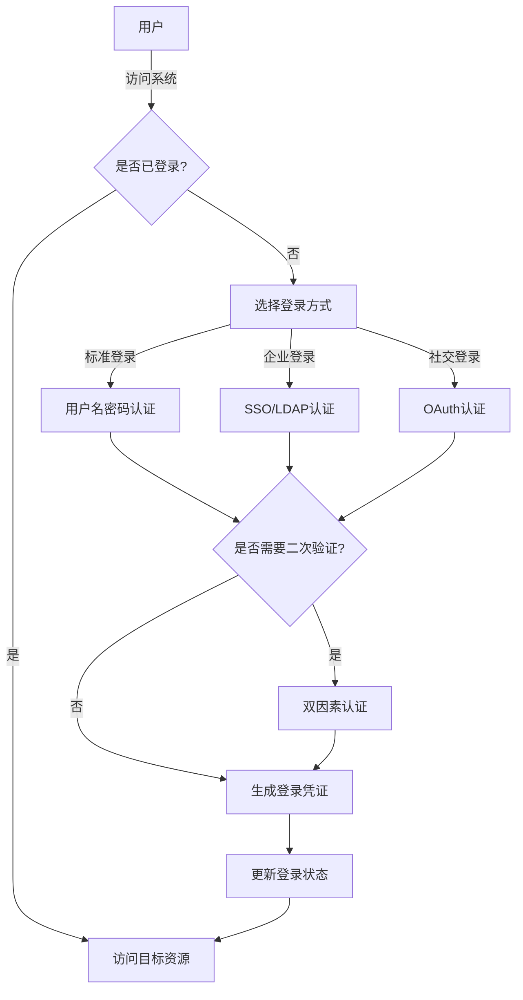
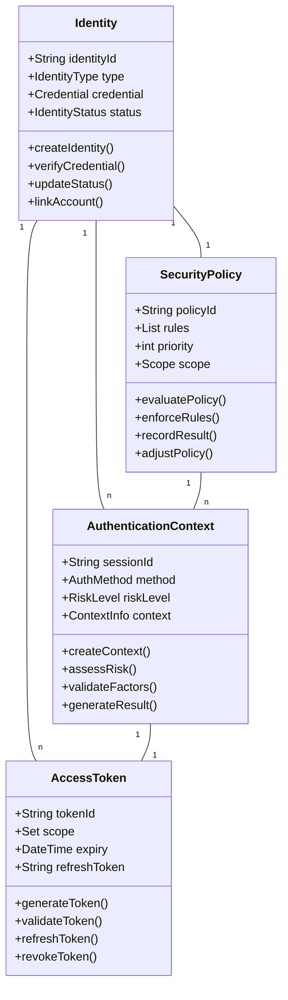

# 登录系统领域分析报告
版本：v1.0.1
日期：2024-03-21

## 执行摘要
基于对登录系统PRD的深入分析，本文档从DDD的视角对系统进行领域分析。该系统是一个面向全球的企业级SaaS身份认证系统，旨在为企业提供安全、可靠、高性能的统一身份认证服务。

主要发现：
1. 核心领域：身份认证与访问控制
2. 支撑域：用户管理、安全审计、系统配置
3. 通用域：消息通知、监控告警

关键决策：
1. 采用聚合根设计确保身份认证的一致性
2. 使用领域事件驱动的异步通知机制
3. 实现防腐层隔离外部认证服务

## 1. 业务流程分析

### 1.1 当前业务流程

#### 1.1.1 业务流程图



#### 1.1.2 流程描述

| 流程编号 | 流程名称 | 流程描述 | 参与者 | 上一个环节 | 后续环节 | 触发条件 | 结束条件 |
|---------|---------|---------|--------|-----------|----------|----------|----------|
| F001 | 登录入口 | 用户访问系统并选择登录方式 | 用户 | 无 | 身份认证 | 访问系统 | 选择登录方式 |
| F002 | 身份认证 | 根据选择的方式进行身份验证 | 用户、认证服务 | 登录入口 | 二次验证 | 提交登录信息 | 验证通过/失败 |
| F003 | 二次验证 | 根据安全策略进行双因素认证 | 用户、认证服务 | 身份认证 | 会话创建 | 首次认证通过 | 验证通过/失败 |
| F004 | 会话创建 | 生成并管理用户登录会话 | 认证服务 | 二次验证 | 资源访问 | 验证通过 | 会话创建完成 |
| F005 | 资源访问 | 访问系统受保护资源 | 用户、授权服务 | 会话创建 | 无 | 会话有效 | 访问完成 |

#### 1.1.3 流程触发点和终点

触发点：
- 用户访问系统
- 会话过期重新登录
- 安全策略要求重新认证
- 第三方系统SSO登录

终点：
- 登录成功，获得访问令牌
- 登录失败，返回错误信息
- 会话超时，要求重新登录
- 用户主动注销登录

### 1.2 关键业务流程与瓶颈分析

#### 1.2.1 关键业务流程
1. 身份认证流程
   - 影响整个系统的安全性
   - 直接关系用户体验
   - 涉及多个外部系统集成
   - 需要处理复杂的认证场景

2. 授权管理流程
   - 控制资源访问权限
   - 支持动态权限调整
   - 确保数据访问安全
   - 实现细粒度权限控制

3. 会话管理流程
   - 维护用户登录状态
   - 确保多设备登录一致性
   - 处理会话过期和续期
   - 支持全局会话注销

#### 1.2.2 瓶颈流程
1. 并发登录处理
   - 高峰期并发登录压力大
   - 验证码服务响应延迟
   - 外部认证服务依赖
   - 数据库连接数限制

2. 全球化访问
   - 跨区域访问延迟高
   - 数据同步实时性要求
   - CDN覆盖不足
   - DNS解析性能

3. 安全策略验证
   - 复杂规则校验耗时
   - 风险评估计算密集
   - 实时监控数据量大
   - 审计日志存储压力

### 1.3 业务目标与成功标准

#### 1.3.1 业务目标
1. 安全性目标
   - 建立完善的身份认证体系
   - 实现细粒度的访问控制
   - 保障数据传输和存储安全
   - 满足各类合规要求

2. 性能目标
   - 支持2亿注册用户规模
   - 处理8000万并发用户访问
   - API平均响应时间<100ms
   - 全球访问延迟<3s

3. 可用性目标
   - 系统可用性99.99%
   - 故障恢复时间<5分钟
   - 数据一致性99.999%
   - 零数据丢失

#### 1.3.2 成功标准
1. 技术指标
   - 服务可用性达标
   - 性能指标达标
   - 安全漏洞零容忍
   - 监控覆盖率100%

2. 业务指标
   - 用户满意度>90%
   - 首次登录成功率>95%
   - 问题解决率>95%
   - 系统使用率持续增长

## 2. 领域模型

### 2.1 核心领域对象

1. 身份标识（Identity）
   - 属性：
     - 标识ID（全局唯一）
     - 认证类型（本地、企业、社交）
     - 凭证信息
     - 状态（活跃、锁定、注销）
   - 行为：
     - 创建身份
     - 验证凭证
     - 更新状态
     - 关联账号

2. 认证上下文（AuthenticationContext）
   - 属性：
     - 会话ID
     - 认证方式
     - 风险等级
     - 环境信息
   - 行为：
     - 创建认证上下文
     - 评估风险等级
     - 验证认证要素
     - 生成认证结果

3. 访问令牌（AccessToken）
   - 属性：
     - 令牌ID
     - 授权范围
     - 有效期
     - 刷新令牌
   - 行为：
     - 生成令牌
     - 验证有效性
     - 刷新令牌
     - 撤销令牌

4. 安全策略（SecurityPolicy）
   - 属性：
     - 策略ID
     - 规则集合
     - 优先级
     - 生效范围
   - 行为：
     - 评估策略
     - 执行规则
     - 记录结果
     - 策略调整

### 2.2 领域对象关系



### 2.3 领域对象生命周期

1. 身份标识（Identity）
   ```mermaid
   stateDiagram-v2
       [*] --> Created: 创建身份
       Created --> Active: 激活
       Active --> Locked: 锁定
       Locked --> Active: 解锁
       Active --> Suspended: 暂停
       Suspended --> Active: 恢复
       Active --> Deleted: 注销
       Deleted --> [*]
   ```

2. 访问令牌（AccessToken）
   ```mermaid
   stateDiagram-v2
       [*] --> Generated: 生成令牌
       Generated --> Active: 激活
       Active --> Expired: 过期
       Active --> Refreshed: 刷新
       Refreshed --> Active: 重新激活
       Active --> Revoked: 撤销
       Expired --> [*]
       Revoked --> [*]
   ```

## 3. 业务规则与约束

### 3.1 核心业务规则

1. 身份认证规则
   - 密码复杂度要求：
     - 最小长度12位
     - 必须包含大小写字母、数字和特殊字符
     - 不能使用最近5次使用过的密码
     - 90天强制更新
   - 登录尝试限制：
     - 连续失败5次锁定账号
     - 锁定时间30分钟
     - 异地登录需要二次验证
     - IP白名单机制

2. 会话管理规则
   - 会话有效期：
     - 标准会话30分钟
     - 记住登录7天
     - 移动端60分钟
     - 管理员可配置
   - 并发登录控制：
     - 最多支持3个设备同时在线
     - 新设备登录挤出旧设备
     - 关键操作需要主设备确认
     - 异常登录自动通知

3. 安全审计规则
   - 操作日志记录：
     - 所有认证操作必须记录
     - 敏感操作双人审批
     - 日志保留期限1年
     - 实时安全告警
   - 合规性要求：
     - 符合GDPR规范
     - 满足等保要求
     - 支持数据跨境传输
     - 隐私数据加密存储

### 3.2 数据验证规则

1. 输入验证
   - 用户名：
     - 6-20位字母数字
     - 不允许特殊字符
     - 大小写不敏感
     - 全局唯一
   - 密码：
     - 12-32位字符
     - 复杂度评分>80
     - 不允许连续字符
     - 不允许常见密码
   - 手机号：
     - 符合国际格式
     - 支持区号选择
     - 真实性验证
     - 一号一账户
   - 邮箱：
     - 标准邮箱格式
     - MX记录验证
     - 域名白名单
     - 验证邮件确认

2. 业务验证
   - 注册验证：
     - 身份真实性
     - 账号唯一性
     - 必填信息完整
     - 协议同意确认
   - 登录验证：
     - 凭证正确性
     - 账号状态检查
     - 环境安全评估
     - 风险等级评定
   - 权限验证：
     - 角色权限匹配
     - 操作权限校验
     - 数据权限过滤
     - 时间范围控制

### 3.3 异常处理规则

1. 认证异常
   - 账号锁定：
     - 自动锁定策略
     - 手动解锁流程
     - 锁定通知
     - 解锁验证
   - 密码重置：
     - 身份验证要求
     - 重置流程设计
     - 临时密码机制
     - 强制修改策略

2. 系统异常
   - 服务降级：
     - 降级策略定义
     - 核心功能保障
     - 用户体验优先
     - 恢复机制设计
   - 故障转移：
     - 自动切换机制
     - 数据一致性保证
     - 会话状态维护
     - 业务连续性

## 4. 用例描述

### 4.1 用例分析

#### 4.1.1 核心用例描述

1. 标准登录用例

| 项目 | 描述 |
|-----|------|
| 用例名称 | 用户名密码登录 |
| 参与者 | 终端用户 |
| 前置条件 | 用户已注册账号 |
| 基本流程 | 1. 用户访问登录页面<br>2. 输入用户名和密码<br>3. 提交登录请求<br>4. 系统验证凭证<br>5. 生成登录会话<br>6. 返回访问令牌 |
| 扩展流程 | 4a. 凭证验证失败<br>&nbsp;&nbsp;1. 显示错误信息<br>&nbsp;&nbsp;2. 记录失败次数<br>&nbsp;&nbsp;3. 返回登录页面<br>4b. 触发二次验证<br>&nbsp;&nbsp;1. 发送验证码<br>&nbsp;&nbsp;2. 验证用户输入<br>&nbsp;&nbsp;3. 继续主流程 |
| 后置条件 | 用户成功登录系统 |
| 异常情况 | - 账号被锁定<br>- 密码过期<br>- 系统维护中<br>- 网络异常 |

2. 企业SSO登录用例

| 项目 | 描述 |
|-----|------|
| 用例名称 | 企业SSO登录 |
| 参与者 | 企业用户、企业IdP |
| 前置条件 | 已配置企业SSO |
| 基本流程 | 1. 用户选择企业登录<br>2. 重定向到企业IdP<br>3. 完成企业认证<br>4. 接收认证结果<br>5. 创建本地会话<br>6. 授权访问资源 |
| 扩展流程 | 3a. 企业认证失败<br>&nbsp;&nbsp;1. 记录错误原因<br>&nbsp;&nbsp;2. 通知用户<br>&nbsp;&nbsp;3. 返回登录页面<br>4a. 账号未关联<br>&nbsp;&nbsp;1. 创建关联关系<br>&nbsp;&nbsp;2. 同步基本信息<br>&nbsp;&nbsp;3. 继续主流程 |
| 后置条件 | 用户通过企业身份登录 |
| 异常情况 | - IdP服务异常<br>- 配置不正确<br>- 权限不足<br>- 会话同步失败 |

#### 4.1.2 用例目标
1. 确保安全性
   - 防止未授权访问
   - 保护用户凭证
   - 防范常见攻击
   - 记录安全审计

2. 优化用户体验
   - 简化登录流程
   - 减少操作步骤
   - 提供记住登录
   - 支持快速切换

3. 支持业务需求
   - 满足合规要求
   - 支持多种认证
   - 灵活的授权控制
   - 可扩展的集成能力

#### 4.1.3 用例与领域模型的关系
1. 实体关系
   - Identity与用户认证用例
   - SecurityPolicy与权限控制用例
   - AccessToken与会话管理用例
   - AuthenticationContext与登录流程用例

2. 业务规则
   - 密码策略与认证用例
   - 访问控制与授权用例
   - 会话管理与令牌用例
   - 审计要求与日志用例

## 5. 痛点与建议

### 5.1 现有痛点

1. 技术痛点
   - 性能瓶颈：
     - 高并发场景响应慢
     - 全球化访问延迟高
     - 数据同步实时性差
     - 资源利用不均衡
   - 安全风险：
     - 认证机制单一
     - 攻击防护不足
     - 审计追踪不完整
     - 合规性存在隐患
   - 运维复杂：
     - 配置管理困难
     - 监控覆盖不全
     - 问题定位耗时
     - 升级风险大

2. 业务痛点
   - 用户体验：
     - 登录流程繁琐
     - 操作响应慢
     - 错误提示不清
     - 自助服务不足
   - 功能限制：
     - 认证方式单一
     - 授权粒度粗
     - 集成能力弱
     - 定制性差

### 5.2 改进建议

1. 架构优化
   - 采用微服务架构：
     - 服务解耦
     - 独立扩展
     - 故障隔离
     - 技术栈灵活
   - 引入服务网格：
     - 流量治理
     - 安全加固
     - 可观测性
     - 策略执行

2. 功能增强
   - 多因素认证：
     - 生物识别
     - 硬件密钥
     - 推送确认
     - 行为验证
   - 智能安全：
     - AI风险评估
     - 异常检测
     - 自适应认证
     - 欺诈防护

3. 体验优化
   - 无密码登录：
     - 生物识别
     - 魔法链接
     - 扫码登录
     - 设备信任
   - 智能客服：
     - 自助问答
     - 智能工单
     - 操作指引
     - 实时响应

## 6. 未来考虑

### 6.1 技术演进
1. 新技术应用
   - 区块链身份：
     - 去中心化身份
     - 自主身份管理
     - 可验证凭证
     - 隐私保护
   - 量子安全：
     - 量子加密
     - 抗量子算法
     - 密钥分发
     - 安全通信

2. 架构升级
   - 云原生改造：
     - 容器化部署
     - Serverless架构
     - 微服务治理
     - DevOps实践
   - 智能化运维：
     - AIOps
     - 自动化运维
     - 智能监控
     - 预测性维护

### 6.2 业务发展
1. 场景扩展
   - 物联网接入：
     - 设备认证
     - 资产管理
     - 权限控制
     - 安全通信
   - 跨域协作：
     - 联邦身份
     - 跨域认证
     - 权限传递
     - 数据共享

2. 服务升级
   - 个性化服务：
     - 场景定制
     - 策略配置
     - 界面定制
     - 流程优化
   - 增值服务：
     - 安全咨询
     - 合规审计
     - 培训服务
     - 技术支持

## 附录

### 参考资料
- Eric Evans的《领域驱动设计》
- Vaughn Vernon的《实现领域驱动设计》
- OAuth 2.0规范文档
- GDPR合规指南

### 变更记录
- 2024-03-21: v1.0.1
  - 完善领域模型
  - 优化业务规则
  - 补充用例分析
  - 更新技术建议