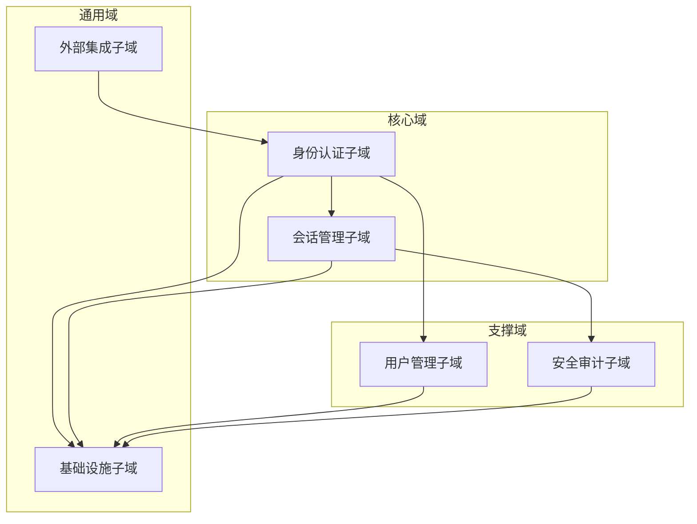
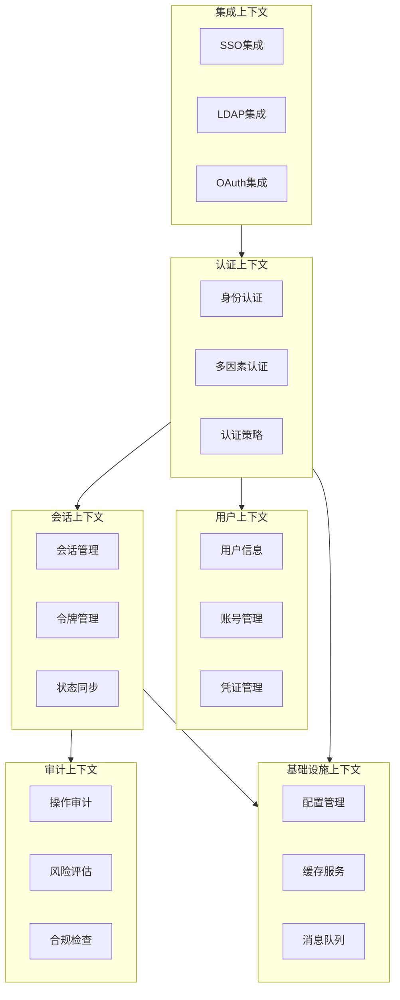
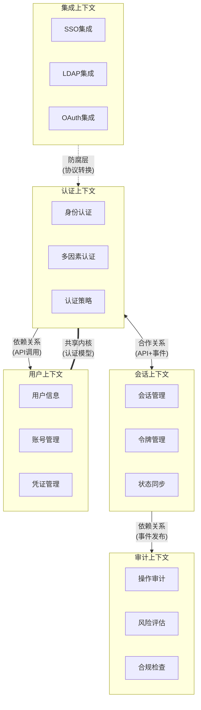
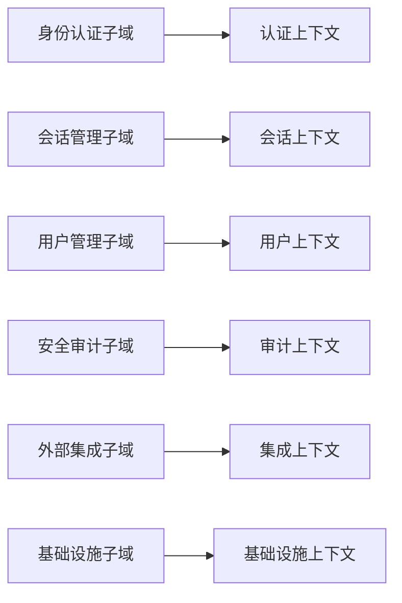
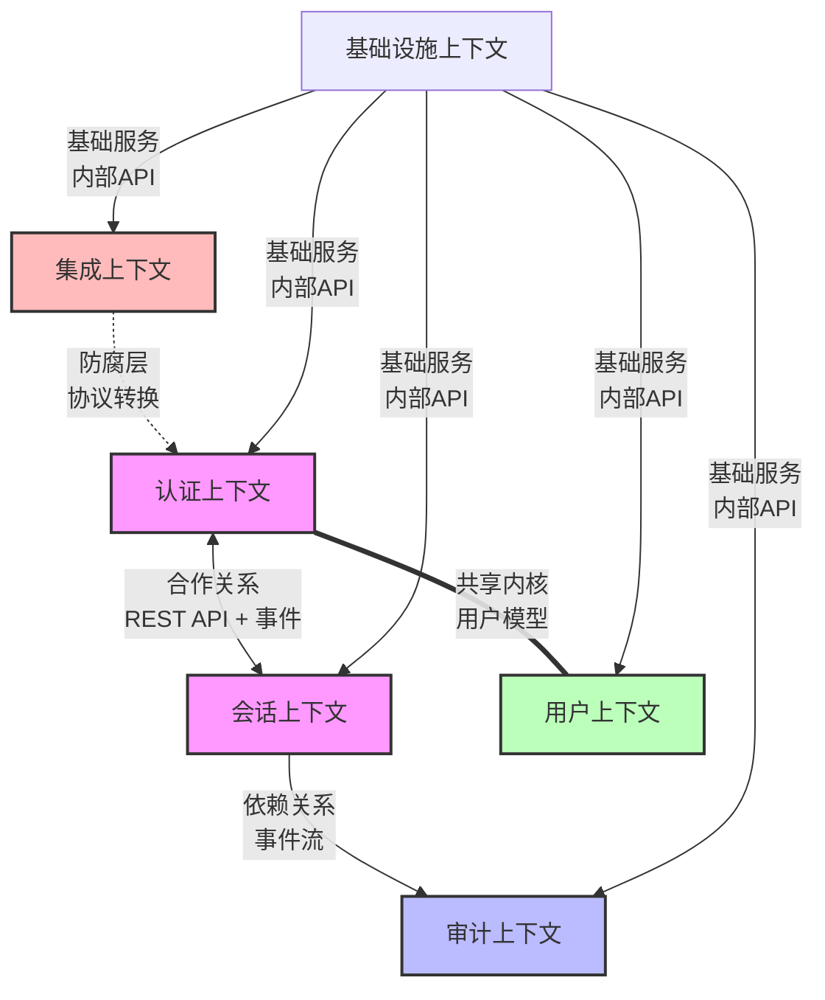
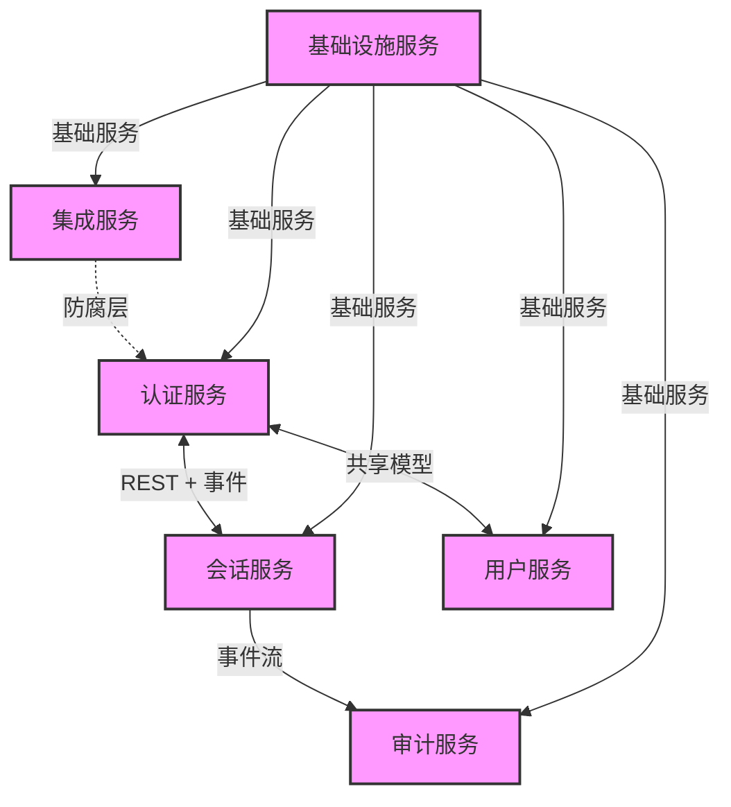

# 限界上下文分析报告

## 子域划分图

### 目标
展示系统中各个子域的边界和职责划分，确保每个子域的责任清晰、边界明确。

### 子域划分

以下为系统中各个子域的划分示意图：



### 描述

#### 核心域
1. 身份认证子域
   - 主要职责：处理所有形式的用户认证请求
   - 核心功能：
     - 用户名密码认证
     - 多因素认证（MFA）
     - 生物识别认证
     - 认证策略管理
   - 业务规则：
     - 密码复杂度要求
     - 登录尝试限制
     - 风险级别评估
   - 数据实体：
     - 认证凭证
     - 认证策略
     - 认证日志
     - 风险评估规则

2. 会话管理子域
   - 主要职责：管理用户会话生命周期
   - 核心功能：
     - 会话创建和销毁
     - 令牌管理
     - 状态同步
     - 并发控制
   - 业务规则：
     - 会话有效期控制
     - 并发登录限制
     - 设备信任策略
   - 数据实体：
     - 会话信息
     - 访问令牌
     - 设备信息
     - 状态记录

#### 支撑域
1. 用户管理子域
   - 主要职责：管理用户账号和信息
   - 核心功能：
     - 用户信息管理
     - 账号生命周期
     - 凭证管理
   - 业务规则：
     - 用户信息验证
     - 账号状态控制
     - 数据完整性
   - 数据实体：
     - 用户信息
     - 账号状态
     - 凭证信息

2. 安全审计子域
   - 主要职责：记录和分析安全相关事件
   - 核心功能：
     - 操作日志记录
     - 风险评估
     - 合规检查
     - 审计报告
   - 业务规则：
     - 日志完整性
     - 存储期限
     - 访问控制
   - 数据实体：
     - 审计日志
     - 风险报告
     - 合规记录

#### 通用域
1. 外部集成子域
   - 主要职责：管理外部系统集成
   - 核心功能：
     - SSO集成
     - LDAP集成
     - OAuth集成
   - 业务规则：
     - 协议转换
     - 数据映射
     - 配置管理
   - 数据实体：
     - 集成配置
     - 映射规则
     - 同步记录

2. 基础设施子域
   - 主要职责：提供基础技术支持
   - 核心功能：
     - 配置管理
     - 缓存服务
     - 消息队列
   - 业务规则：
     - 性能要求
     - 可用性要求
     - 安全要求
   - 数据实体：
     - 系统配置
     - 运行状态
     - 性能指标

## 2. 上下文描述

### 上下文边界图

#### 目标
明确每个子域对应的限界上下文，确保功能、边界和责任清晰。

#### 上下文边界图



### 上下文映射图



### 上下文描述

#### 2.1 认证上下文
- 核心职责：
  - 处理用户认证请求
  - 执行认证策略
  - 生成认证结果
- 关键功能：
  - 多种认证方式支持
  - 认证策略管理
  - 风险评估
- 数据资产：
  - 认证配置
  - 认证记录
  - 风险规则
- 对外接口：
  - REST API
  - 事件发布
  - 共享模型

#### 2.2 会话上下文
- 核心职责：
  - 管理用户会话生命周期
  - 处理访问令牌
  - 维护登录状态
- 关键功能：
  - 会话创建和销毁
  - 令牌生成和验证
  - 状态同步管理
  - 并发登录控制
- 数据资产：
  - 会话信息
  - 令牌存储
  - 设备信息
  - 状态记录
- 对外接口：
  - REST API
  - 事件通知
  - 状态查询

#### 2.3 用户上下文
- 核心职责：
  - 管理用户基本信息
  - 处理账号生命周期
  - 维护用户凭证
- 关键功能：
  - 用户信息管理
  - 账号状态控制
  - 凭证更新
  - 账号关联
- 数据资产：
  - 用户基本信息
  - 账号状态信息
  - 凭证信息
  - 关联账号数据
- 对外接口：
  - REST API
  - 共享模型
  - 事件通知

#### 2.4 审计上下文
- 核心职责：
  - 记录系统操作日志
  - 执行安全风险评估
  - 确保合规性要求
- 关键功能：
  - 操作日志记录
  - 风险评估分析
  - 合规性检查
  - 审计报告生成
- 数据资产：
  - 操作日志
  - 风险评估数据
  - 合规检查结果
  - 审计报告
- 对外接口：
  - REST API
  - 消息订阅
  - 报告导出

#### 2.5 集成上下文
- 核心职责：
  - 管理外部认证集成
  - 处理身份联合
  - 协调认证协议
- 关键功能：
  - SSO服务集成
  - LDAP认证集成
  - OAuth认证集成
  - 数据同步转换
- 数据资产：
  - 集成配置信息
  - 映射关系数据
  - 同步状态记录
  - 临时凭证数据
- 对外接口：
  - REST API
  - 防腐层接口
  - 配置管理

#### 2.6 基础设施上下文
- 核心职责：
  - 提供基础技术支持
  - 管理系统配置
  - 确保性能和可用性
- 关键功能：
  - 配置管理
  - 缓存服务
  - 消息队列
  - 监控告警
- 数据资产：
  - 系统配置
  - 运行状态
  - 性能指标
  - 监控数据
- 对外接口：
  - 内部API
  - 监控接口
  - 管理控制台

## 子域与上下文的映射关系

### 目标
将每个子域与相应的有界上下文关联，确保上下文划分清晰。

### 映射关系图



### 关系描述
1. 身份认证子域与认证上下文
   - 子域职责：实现身份认证业务逻辑
   - 上下文范围：包含认证流程、策略和结果管理
   - 映射关系：一对一完全映射

2. 会话管理子域与会话上下文
   - 子域职责：管理用户会话生命周期
   - 上下文范围：会话创建、维护和销毁
   - 映射关系：一对一完全映射

[其他映射关系类似结构]

## 3. 跨上下文关系与通信方式 （Context Mapping）

### 跨上下文的关系与通信方式

#### 目标
描述不同上下文之间的关系，并定义它们如何通过接口、事件或数据流进行交互。

#### 跨上下文关系图
以下为不同上下文之间的关系和交互方式的示意图：



### 关系描述

#### 1. 认证上下文与会话上下文（合作关系）
- 关系类型：合作关系（Cooperation）
- 通信方式：
  - REST API：
    ```
    POST /api/v1/auth/validate
    GET /api/v1/sessions/status
    ```
  - 事件：
    ```
    认证成功事件
    认证失败事件
    会话状态变更事件
    ```
- 数据流向：双向
- 交互场景：
  - 认证成功后创建会话
  - 会话状态变更通知认证
  - 令牌验证和刷新

#### 2. 认证上下文与用户上下文（共享内核）
- 关系类型：共享内核（Shared Kernel）
- 共享模型：
  ```json
  {
    "UserIdentity": {
      "id": "string",
      "type": "enum",
      "status": "enum",
      "credentials": "object"
    },
    "AuthenticationContext": {
      "userId": "string",
      "authMethod": "enum",
      "riskLevel": "enum"
    }
  }
  ```
- 数据一致性：强一致性
- 变更管理：需要双方评审和同意

#### 3. 会话上下文与审计上下文（依赖关系）
- 关系类型：依赖关系（Dependency）
- 通信方式：
  - 消息队列：
    ```
    会话操作事件队列
    安全告警事件队列
    ```
  - 日志流：
    ```
    会话审计日志
    操作审计日志
    ```
- 数据流向：单向（会话 -> 审计）
- 解耦策略：异步事件驱动

#### 4. 集成上下文与认证上下文（防腐层）
- 关系类型：防腐层（Anti-corruption Layer）
- 转换接口：
  ```java
  public interface ProtocolTranslator {
    AuthRequest translate(ExternalAuthRequest request);
    AuthResponse translate(InternalAuthResponse response);
  }
  ```
- 适配策略：
  - 协议转换
  - 数据格式转换
  - 错误码映射
- 配置管理：
  - 映射规则配置
  - 协议参数配置
  - 超时和重试策略

#### 5. 基础设施上下文（通用支撑）
- 关系类型：通用支撑（Generic Support）
- 服务接口：
  ```
  配置服务接口
  缓存服务接口
  消息服务接口
  监控服务接口
  ```
- 服务质量：
  - 高可用性要求
  - 性能SLA
  - 监控告警
- 治理策略：
  - 限流配置
  - 熔断策略
  - 降级方案

### 通信模式总结

1. 同步通信
   - REST API：实时交互
   - RPC：内部调用
   - 共享内存：高性能场景

2. 异步通信
   - 消息队列：事件驱动
   - 日志流：审计和分析
   - 批处理：数据同步

3. 混合通信
   - 命令查询分离
   - 事件溯源
   - 最终一致性

## 4. 微服务映射

### 4.1 认证服务（Authentication Service）
- 对应上下文：认证上下文
- 服务职责：
  - 处理所有认证请求
  - 执行认证策略
  - 生成认证结果
  - 管理认证配置
- 接口定义：
  ```
  # RESTful API
  POST /api/v1/auth/login          # 用户登录
  POST /api/v1/auth/mfa            # 多因素认证
  GET /api/v1/auth/status          # 认证状态查询
  PUT /api/v1/auth/policy          # 更新认证策略

  # 事件
  AuthenticationSucceeded          # 认证成功事件
  AuthenticationFailed             # 认证失败事件
  PolicyUpdated                    # 策略更新事件
  ```
- 依赖服务：
  - 用户服务（共享内核）
  - 会话服务（合作关系）
  - 集成服务（通过防腐层）

### 4.2 会话服务（Session Service）
- 对应上下文：会话上下文
- 服务职责：
  - 管理用户会话
  - 处理访问令牌
  - 同步登录状态
  - 控制并发登录
- 接口定义：
  ```
  # RESTful API
  POST /api/v1/sessions           # 创建会话
  GET /api/v1/sessions/{id}       # 获取会话信息
  PUT /api/v1/sessions/{id}       # 更新会话
  DELETE /api/v1/sessions/{id}    # 销毁会话
  PUT /api/v1/sessions/{id}/refresh # 刷新会话

  # 事件
  SessionCreated                  # 会话创建事件
  SessionExpired                  # 会话过期事件
  SessionTerminated              # 会话终止事件
  ```
- 依赖服务：
  - 认证服务（合作关系）
  - 审计服务（事件发布）

### 4.3 用户服务（User Service）
- 对应上下文：用户上下文
- 服务职责：
  - 用户信息管理
  - 账号生命周期
  - 凭证管理
  - 账号关联管理
- 接口定义：
  ```
  # RESTful API
  POST /api/v1/users              # 创建用户
  GET /api/v1/users/{id}          # 获取用户信息
  PUT /api/v1/users/{id}          # 更新用户信息
  DELETE /api/v1/users/{id}       # 删除用户
  PATCH /api/v1/users/{id}/status # 更新用户状态
  PUT /api/v1/users/{id}/credentials # 更新凭证

  # 共享模型
  UserIdentity                    # 用户身份模型
  UserCredential                  # 用户凭证模型
  ```
- 依赖服务：
  - 认证服务（共享内核）
  - 审计服务（事件发布）

### 4.4 审计服务（Audit Service）
- 对应上下文：审计上下文
- 服务职责：
  - 日志记录
  - 风险评估
  - 合规检查
  - 报告生成
- 接口定义：
  ```
  # RESTful API
  POST /api/v1/audit/logs         # 记录审计日志
  GET /api/v1/audit/logs          # 查询审计日志
  POST /api/v1/audit/risks        # 风险评估
  GET /api/v1/audit/reports       # 获取审计报告
  GET /api/v1/audit/compliance    # 合规性检查

  # 消息订阅
  AuthenticationEvents            # 认证事件订阅
  SessionEvents                   # 会话事件订阅
  UserEvents                      # 用户事件订阅
  ```
- 依赖服务：无（纯消费者）

### 4.5 集成服务（Integration Service）
- 对应上下文：集成上下文
- 服务职责：
  - 外部认证集成
  - 数据同步转换
  - 配置管理
  - 协议适配
- 接口定义：
  ```
  # RESTful API
  POST /api/v1/integration/sso    # SSO认证
  POST /api/v1/integration/ldap   # LDAP认证
  POST /api/v1/integration/oauth  # OAuth认证
  PUT /api/v1/integration/config  # 更新配置

  # 防腐层接口
  ProtocolTranslator              # 协议转换器
  DataMapper                      # 数据映射器
  ```
- 依赖服务：
  - 认证服务（通过防腐层）
  - 用户服务（数据同步）

### 4.6 基础设施服务（Infrastructure Service）
- 对应上下文：基础设施上下文
- 服务职责：
  - 配置管理
  - 缓存服务
  - 消息服务
  - 监控告警
- 接口定义：
  ```
  # 内部API
  ConfigurationService            # 配置服务
  CacheService                    # 缓存服务
  MessageService                  # 消息服务
  MonitoringService              # 监控服务

  # 管理接口
  POST /api/v1/infra/config      # 更新配置
  GET /api/v1/infra/metrics      # 获取指标
  GET /api/v1/infra/health       # 健康检查
  POST /api/v1/infra/alerts      # 告警配置
  ```
- 依赖服务：无（基础服务提供者）

### 4.7 服务通信关系图



## 5. 实现建议

### 5.1 技术选型建议
1. 认证服务实现：
   - 语言：Java/Kotlin
   - 框架：Spring Boot
   - 安全框架：Spring Security
   - 缓存：Redis
   - 消息队列：Kafka

2. 会话服务实现：
   - 语言：Java/Kotlin
   - 框架：Spring Boot
   - 缓存：Redis
   - 数据库：MongoDB

3. 用户服务实现：
   - 语言：Java/Kotlin
   - 框架：Spring Boot
   - 数据库：PostgreSQL
   - 缓存：Redis

4. 审计服务实现：
   - 语言：Java/Kotlin
   - 框架：Spring Boot
   - 数据库：Elasticsearch
   - 消息队列：Kafka

5. 集成服务实现：
   - 语言：Java/Kotlin
   - 框架：Spring Boot
   - 配置中心：Nacos
   - 数据库：MongoDB

6. 基础设施服务：
   - 服务网格：Istio
   - 监控：Prometheus + Grafana
   - 日志：ELK Stack
   - 链路追踪：Jaeger

### 5.2 接口规范建议
1. API设计原则：
   - RESTful风格
   - 版本控制
   - 统一错误处理
   - 规范化响应格式

2. 事件设计原则：
   - 领域事件驱动
   - 异步消息通信
   - 事件溯源支持
   - 幂等性保证

3. 安全规范：
   - OAuth2.0/OIDC标准
   - JWT令牌
   - TLS传输加密
   - 敏感数据加密

### 5.3 部署架构建议
1. 容器化部署：
   - 容器平台：Kubernetes
   - 镜像仓库：Harbor
   - 配置中心：Nacos
   - 服务网格：Istio

2. 多环境支持：
   - 开发环境
   - 测试环境
   - 预生产环境
   - 生产环境

3. 高可用设计：
   - 多区域部署
   - 服务冗余
   - 数据备份
   - 灾难恢复

## 附录

### A. 参考资料
- Eric Evans《Domain-Driven Design》
- Vaughn Vernon《实现领域驱动设计》
- Sam Newman《Building Microservices》
- Martin Fowler《企业应用架构模式》

### B. 变更记录
- 2024-03-21: v1.0.1
  - 初始版本
  - 完成上下文分析
  - 定义服务边界
  - 设计接口规范
  - 补充关系类型
  - 完善通信模式
  - 添加实现建议 