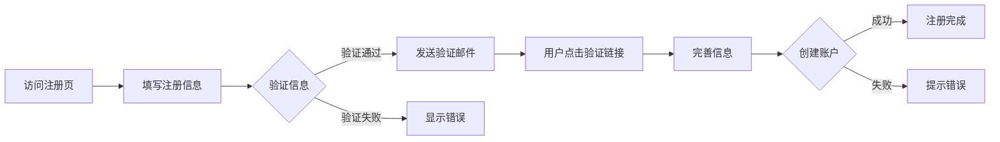

# 用户故事：账户注册功能

## 1. 基本信息

- **用户故事编号**: LOGIN-000
- **名称**: 新用户账户注册
- **角色**: 潜在用户、系统管理员
- **优先级**: 高
- **状态**: 待评审

---

## 2. 用户故事描述

作为一个潜在用户，我希望能够通过邮箱注册一个新账户，以便能够访问和使用系统功能。

作为系统管理员，我希望能够控制和管理用户注册流程，包括域名限制、注册审核等，以确保系统安全。

---

## 3. 业务背景与动机

- **业务目标**: 
  - 提供便捷的账户注册流程
  - 确保用户信息的准确性
  - 防范恶意注册行为
- **痛点/机会**: 
  - 降低新用户使用门槛
  - 保证注册用户质量
  - 防范垃圾账号注册
- **相关业务流程**: 信息填写 -> 邮箱验证 -> 完善信息 -> 注册完成

---

## 4. 领域模型映射

- **相关限界上下文**:
  - 用户注册上下文
  - 邮件验证上下文
  - 用户管理上下文
  
- **核心实体/聚合**:
  - 用户（聚合根）
  - 注册表单（实体）
  - 验证码（值对象）
  - 注册策略（实体）
  
- **业务规则**:
  1. 邮箱地址必须唯一
  2. 密码必须符合复杂度要求
  3. 必须验证邮箱真实性
  4. 同一IP注册频率限制
  
- **领域事件**:
  1. 注册申请事件
  2. 邮箱验证事件
  3. 注册完成事件
  4. 注册失败事件
  
- **领域服务**:
  - 注册服务
  - 邮件验证服务
  - 用户管理服务

---

## 5. 前提条件

- 系统开放注册功能
- 邮件服务正常运行
- 数据库服务可用
- 验证码服务可用

---

## 6. 完整流程

### 6.1 流程图

### 6.2 流程文字描述

1. 主流程
   1. 用户访问注册页面
   2. 填写基本注册信息
   3. 系统验证信息有效性
   4. 发送验证邮件
   5. 用户验证邮箱
   6. 完善账户信息
   7. 完成注册

2. 扩展场景
   1. 信息验证失败
      - 显示具体错误原因
      - 允许重新输入
      - 提供输入建议
   
   2. 邮箱验证超时
      - 提供重发验证邮件
      - 保留已填信息
      - 限制重发频率
   
   3. 注册限制处理
      - 检查IP限制
      - 验证域名白名单
      - 触发人机验证

---

## 7. 验收标准

1. 功能验证
   - 成功提交注册信息
   - 成功验证邮箱
   - 成功创建账户
   - 密码符合要求

2. 安全验证
   - 防止重复注册
   - 防止批量注册
   - 敏感信息加密

3. 用户体验
   - 清晰的引导流程
   - 友好的错误提示
   - 合理的超时时间

---

## 8. 验收测试

- 测试场景:
  1. 正常注册流程
     - 输入：有效的注册信息
     - 期望：成功创建账户
  
  2. 重复注册测试
     - 输入：已注册的邮箱
     - 期望：提示邮箱已存在
  
  3. 注册限制测试
     - 输入：频繁注册请求
     - 期望：触发限制机制

---

## 9. 非功能性需求

- 性能要求:
  - 注册响应时间<1秒
  - 邮件发送延迟<1分钟
  - 支持并发注册

- 安全要求:
  - 密码加密存储
  - 防止SQL注入
  - 防止XSS攻击

- 可用性:
  - 24/7服务可用
  - 多语言支持
  - 移动端适配

---

## 10. 依赖与冲突

- 外部依赖:
  - 邮件发送服务
  - 验证码服务
  - 人机验证服务

- 内部依赖:
  - 用户管理服务
  - 存储服务
  - 安全服务

---

## 11. 设计与实现提示

- 前端实现:
  - 表单验证
  - 密码强度提示
  - 进度指示器
  
- 后端实现:
  - 邮件异步发送
  - 分布式锁
  - 限流机制
  
- 测试建议:
  - 注册流程测试
  - 并发测试
  - 安全测试

---

## 12. 用户场景

1. 场景1：个人用户注册
   - 填写基本信息
   - 验证个人邮箱
   - 设置访问权限

2. 场景2：企业用户注册
   - 使用企业邮箱
   - 选择企业类型
   - 等待管理员审核

3. 场景3：批量注册请求
   - 检测异常行为
   - 启动保护机制
   - 记录安全日志 