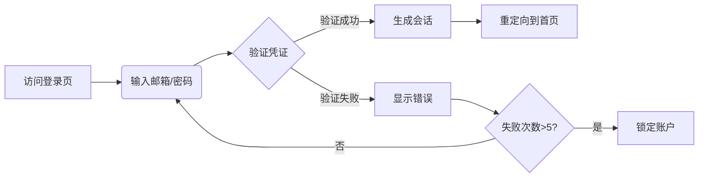

# 用户故事：基础登录功能

## 1. 基本信息

- **用户故事编号**: LOGIN-001
- **名称**: 用户使用邮箱/用户名和密码进行系统登录
- **角色**: 普通用户
- **优先级**: 高
- **状态**: 待评审

---

## 2. 用户故事描述

作为一名系统用户，我想要使用我的邮箱（或用户名）和密码登录系统，以便访问我的工作区域和相关资源。

---

## 3. 业务背景与动机

- **业务目标**: 
  - 提供安全可靠的身份认证机制
  - 确保用户数据访问的安全性
  - 提供与Jira Web一致的用户体验
- **痛点/机会**: 
  - 需要标准化的登录流程
  - 防止未授权访问
  - 提升用户登录体验
- **相关业务流程**: 输入凭证 -> 验证身份 -> 生成会话 -> 进入系统

---

## 4. 领域模型映射

- **相关限界上下文**:
  - 身份认证上下文
  - 用户管理上下文
  - 会话管理上下文
  
- **核心实体/聚合**:
  - 用户（聚合根）
  - 凭证（值对象）
  - 会话（实体）
  
- **业务规则**:
  1. 用户名/邮箱必须已在系统中注册
  2. 密码必须符合系统安全策略
  3. 连续失败5次后触发账户锁定
  4. 会话token有效期为8小时
  
- **领域事件**:
  1. 用户登录成功事件
  2. 登录失败事件
  3. 账户锁定事件
  
- **领域服务**:
  - 认证服务
  - 会话管理服务
  - 安全策略服务

---

## 5. 前提条件

- 用户已在系统中注册
- 用户账户处于激活状态
- 用户未被锁定
- 系统登录服务正常运行

---

## 6. 完整流程

### 6.1 流程图

### 6.2 流程文字描述

1. 主流程
   1. 用户访问系统登录页面
   2. 输入邮箱（或用户名）和密码
   3. 系统验证用户凭证
   4. 验证成功后生成会话token
   5. 重定向用户至系统首页

2. 扩展场景
   1. 凭证验证失败
      - 显示错误信息
      - 允许重新输入
      - 记录失败次数
   
   2. 账户锁定触发
      - 连续失败5次后锁定账户
      - 显示锁定提示信息
      - 发送邮件通知用户

   3. "记住我"功能
      - 用户勾选"记住我"选项
      - 延长会话保持时间
      - 生成持久化token

---

## 7. 验收标准

1. 基本功能验证
   - 使用正确凭证可成功登录
   - 使用错误凭证显示适当错误信息
   - "记住我"功能正常工作

2. 安全性验证
   - 密码传输采用HTTPS加密
   - 连续失败5次触发账户锁定
   - 会话token具有适当的过期时间

3. 性能验证
   - 登录响应时间<200ms
   - 支持1000+并发登录请求

---

## 8. 验收测试

- 测试场景:
  1. 正确凭证登录测试
     - 输入：正确的邮箱和密码
     - 期望：成功登录并重定向到首页
  
  2. 错误凭证测试
     - 输入：错误的密码
     - 期望：显示"用户名或密码错误"提示
  
  3. 账户锁定测试
     - 输入：连续5次错误密码
     - 期望：账户被锁定，显示锁定提示

---

## 9. 非功能性需求

- 性能要求:
  - 平均响应时间<200ms
  - 支持1000+并发用户
  - 99.99%可用性

- 安全要求:
  - 所有通信使用TLS 1.2+
  - 密码必须加密存储
  - 符合GDPR数据保护要求

- 可用性:
  - 支持多浏览器兼容
  - 响应式UI设计
  - 多语言支持

---

## 10. 依赖与冲突

- 外部依赖:
  - 数据库服务
  - 缓存服务（Redis）
  - 邮件服务（用于通知）

- 内部依赖:
  - 用户管理服务
  - 安全策略服务
  - 审计日志服务

---

## 11. 设计与实现提示

- 前端实现:
  - 使用React组件
  - 实现表单验证
  - 添加加载状态显示
  
- 后端实现:
  - 实现JWT token认证
  - 使用Spring Security
  - 添加请求限流保护

- 测试建议:
  - 编写单元测试覆盖所有场景
  - 进行压力测试验证并发性能
  - 进行安全渗透测试

---

## 12. 用户场景

1. 场景1：日常登录
   - 用户访问系统登录页
   - 输入邮箱和密码
   - 成功登录并访问工作区

2. 场景2：移动端登录
   - 用户使用手机访问
   - 在响应式界面上登录
   - 保持移动端会话

3. 场景3：异地登录
   - 检测到非常用地点登录
   - 要求额外验证
   - 发送安全提醒邮件 