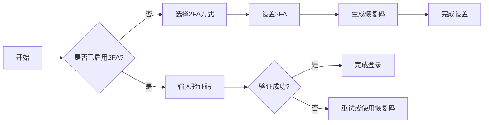

# 用户故事：双因素认证（2FA）功能

## 1. 基本信息

- **用户故事编号**: LOGIN-002
- **名称**: 用户启用和使用双因素认证
- **角色**: 普通用户、系统管理员
- **优先级**: 高
- **状态**: 待评审

---

## 2. 用户故事描述

作为系统用户，我想要启用双因素认证（2FA）来保护我的账户，以便在密码泄露的情况下仍能保证账户安全。

作为系统管理员，我想要能够为企业租户强制开启2FA，以确保企业数据的安全性。

---

## 3. 业务背景与动机

- **业务目标**: 
  - 提供多层次的账户安全保护
  - 符合企业级安全标准
  - 防止账户被盗用
- **痛点/机会**: 
  - 单一密码认证的安全风险
  - 企业对高安全性的需求
  - 防范钓鱼和社会工程学攻击
- **相关业务流程**: 2FA设置 -> 2FA验证 -> 登录完成

---

## 4. 领域模型映射

- **相关限界上下文**:
  - 身份认证上下文
  - 安全策略上下文
  - 用户偏好上下文
  
- **核心实体/聚合**:
  - 用户（聚合根）
  - 2FA配置（实体）
  - 验证码（值对象）
  - 安全策略（实体）
  
- **业务规则**:
  1. 用户必须先完成密码验证才能设置2FA
  2. 2FA验证码有效期为30秒
  3. 企业管理员可强制要求所有用户启用2FA
  4. 用户可选择TOTP或短信作为2FA方式
  
- **领域事件**:
  1. 2FA启用事件
  2. 2FA验证成功事件
  3. 2FA验证失败事件
  4. 2FA策略更新事件
  
- **领域服务**:
  - 2FA管理服务
  - TOTP生成服务
  - 短信验证服务

---

## 5. 前提条件

- 用户已完成基础账户注册
- 用户拥有可用的手机号或认证器App
- 系统支持TOTP协议
- 短信服务可用（如果选择短信验证）

---

## 6. 完整流程

### 6.1 流程图

### 6.2 流程文字描述

1. 主流程
   1. 用户在安全设置中选择启用2FA
   2. 选择验证方式（TOTP或短信）
   3. 系统生成并显示TOTP密钥或发送短信验证码
   4. 用户验证设置
   5. 系统生成恢复码
   6. 完成2FA设置

2. 扩展场景
   1. TOTP设置流程
      - 显示二维码和密钥
      - 用户使用认证器扫描
      - 输入当前验证码确认
   
   2. 短信验证流程
      - 验证手机号
      - 发送测试验证码
      - 确认验证码正确
   
   3. 恢复码使用
      - 无法使用主要2FA方式
      - 输入恢复码
      - 重新设置2FA

---

## 7. 验收标准

1. 2FA功能验证
   - 成功启用TOTP验证
   - 成功启用短信验证
   - 验证码正确时允许登录
   - 验证码错误时拒绝登录

2. 管理功能验证
   - 管理员可设置强制2FA策略
   - 用户可查看2FA状态
   - 支持重置2FA设置

3. 安全性验证
   - 验证码具有时效性
   - 恢复码可正常使用
   - 敏感操作需重新验证

---

## 8. 验收测试

- 测试场景:
  1. TOTP设置测试
     - 输入：扫描二维码并输入验证码
     - 期望：成功启用TOTP验证
  
  2. 短信验证测试
     - 输入：接收并输入短信验证码
     - 期望：成功启用短信验证
  
  3. 登录验证测试
     - 输入：正确/错误的验证码
     - 期望：正确验证码通过，错误验证码拒绝

---

## 9. 非功能性需求

- 性能要求:
  - 验证码验证响应时间<1秒
  - 支持大规模并发验证
  - 短信发送延迟<5秒

- 安全要求:
  - TOTP密钥安全存储
  - 验证码传输加密
  - 防暴力破解机制

- 可用性:
  - 支持多种认证器App
  - 国际手机号支持
  - 友好的错误提示

---

## 10. 依赖与冲突

- 外部依赖:
  - 短信服务提供商
  - 时间同步服务
  - 密钥管理服务

- 内部依赖:
  - 用户认证服务
  - 安全策略服务
  - 通知服务

---

## 11. 设计与实现提示

- 前端实现:
  - 优化二维码显示
  - 实现倒计时显示
  - 友好的引导流程
  
- 后端实现:
  - 使用标准TOTP算法
  - 实现验证码防重放
  - 加密存储密钥

- 测试建议:
  - 验证时间偏差处理
  - 测试恢复流程
  - 压力测试验证性能

---

## 12. 用户场景

1. 场景1：首次设置2FA
   - 用户访问安全设置
   - 选择并设置2FA方式
   - 保存恢复码

2. 场景2：日常使用2FA登录
   - 输入密码后自动要求2FA
   - 使用认证器生成验证码
   - 完成登录

3. 场景3：恢复码使用
   - 无法访问主要2FA设备
   - 使用恢复码登录
   - 重新设置2FA 