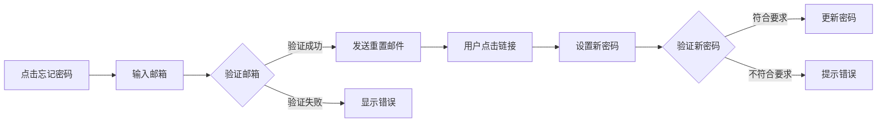

# 用户故事：忘记密码和密码重置

## 1. 基本信息

- **用户故事编号**: LOGIN-003
- **名称**: 用户忘记密码后的重置流程
- **角色**: 普通用户
- **优先级**: 高
- **状态**: 待评审

---

## 2. 用户故事描述

作为一个系统用户，当我忘记密码时，我希望能通过安全的方式重置密码，以便重新获得系统访问权限。

---

## 3. 业务背景与动机

- **业务目标**: 
  - 提供安全可靠的密码重置机制
  - 降低用户因忘记密码导致的困扰
  - 减少客服工作量
- **痛点/机会**: 
  - 用户经常忘记密码
  - 密码重置过程需要安全
  - 避免账号被盗用风险
- **相关业务流程**: 申请重置 -> 身份验证 -> 设置新密码 -> 重置完成

---

## 4. 领域模型映射

- **相关限界上下文**:
  - 用户管理上下文
  - 安全验证上下文
  - 通知服务上下文
  
- **核心实体/聚合**:
  - 用户（聚合根）
  - 重置令牌（值对象）
  - 密码策略（实体）
  - 重置请求（实体）
  
- **业务规则**:
  1. 重置链接有效期为24小时
  2. 新密码不能与最近3次使用的密码相同
  3. 30分钟内最多发送3次重置邮件
  4. 新密码必须符合密码强度要求
  
- **领域事件**:
  1. 密码重置请求事件
  2. 重置链接生成事件
  3. 密码重置完成事件
  4. 重置失败事件
  
- **领域服务**:
  - 密码重置服务
  - 邮件通知服务
  - 密码策略服务

---

## 5. 前提条件

- 用户已注册并验证邮箱
- 邮件服务正常运行
- 用户能访问注册邮箱
- 系统密码重置服务可用

---

## 6. 完整流程

### 6.1 流程图

### 6.2 流程文字描述

1. 主流程
   1. 用户点击"忘记密码"链接
   2. 输入注册邮箱地址
   3. 系统验证邮箱并发送重置链接
   4. 用户通过邮件访问重置页面
   5. 设置新密码并提交
   6. 系统更新密码并通知成功

2. 扩展场景
   1. 邮箱验证失败
      - 提示邮箱未注册
      - 提供注册入口
      - 记录失败尝试
   
   2. 重置链接失效
      - 提示链接已过期
      - 允许重新发送
      - 记录重置尝试
   
   3. 新密码不合规
      - 显示密码要求
      - 实时密码强度检查
      - 提供修改建议

---

## 7. 验收标准

1. 功能验证
   - 重置邮件成功发送
   - 重置链接正常工作
   - 新密码符合要求时可更新
   - 重置成功后可使用新密码登录

2. 安全验证
   - 重置链接具有时效性
   - 防止暴力破解
   - 密码强度校验有效

3. 用户体验
   - 清晰的操作引导
   - 友好的错误提示
   - 合理的超时时间

---

## 8. 验收测试

- 测试场景:
  1. 正常重置流程
     - 输入：已注册邮箱
     - 期望：收到重置邮件并完成重置
  
  2. 异常邮箱测试
     - 输入：未注册邮箱
     - 期望：显示适当错误提示
  
  3. 密码规则测试
     - 输入：不同强度的密码
     - 期望：正确执行密码规则验证

---

## 9. 非功能性需求

- 性能要求:
  - 邮件发送延迟<1分钟
  - 重置页面响应<1秒
  - 支持并发重置请求

- 安全要求:
  - 重置链接加密传输
  - 防止重置链接被猜测
  - 记录所有重置操作

- 可用性:
  - 24/7服务可用
  - 多语言支持
  - 移动端适配

---

## 10. 依赖与冲突

- 外部依赖:
  - 邮件发送服务
  - DNS服务
  - 垃圾邮件过滤器

- 内部依赖:
  - 用户管理服务
  - 密码策略服务
  - 审计日志服务

---

## 11. 设计与实现提示

- 前端实现:
  - 实现密码强度指示器
  - 添加密码规则提示
  - 优化表单验证
  
- 后端实现:
  - 实现安全的令牌生成
  - 加密存储密码
  - 实现频率限制

- 测试建议:
  - 测试邮件发送
  - 验证链接有效期
  - 测试并发请求

---

## 12. 用户场景

1. 场景1：常规密码重置
   - 用户忘记密码
   - 通过邮件重置
   - 设置新密码后登录

2. 场景2：移动端重置
   - 在手机上操作
   - 通过邮件应用打开链接
   - 完成移动端重置

3. 场景3：异常情况处理
   - 重置链接过期
   - 重新发起重置
   - 成功完成重置 