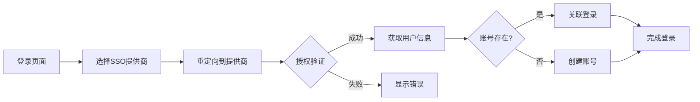

# 用户故事：第三方SSO登录集成

## 1. 基本信息
- **用户故事编号**: LOGIN-004
- **名称**: 集成第三方SSO登录（Google/Microsoft/GitHub）
- **角色**: 普通用户、系统管理员
- **优先级**: 高
- **状态**: 待评审

## 2. 用户故事描述
作为一个系统用户，我希望能够使用我的Google、Microsoft或GitHub账号直接登录系统，以避免记忆新的账号密码。

作为系统管理员，我希望能够配置和管理SSO提供商的集成，以便为企业用户提供统一的身份认证方案。

## 3. 业务背景与动机
- **业务目标**: 
  - 简化用户登录流程
  - 提供企业级SSO解决方案
  - 增强用户体验
- **痛点/机会**: 
  - 用户不愿记忆多个密码
  - 企业需要统一身份认证
  - 提高账号安全性
- **相关业务流程**: 选择SSO提供商 -> 授权验证 -> 账号关联 -> 完成登录

## 4. 领域模型映射
- **相关限界上下文**:
  - SSO集成上下文
  - 用户管理上下文
  - 身份认证上下文
- **核心实体/聚合**:
  - 用户（聚合根）
  - SSO配置（实体）
  - 身份提供商（实体）
  - OAuth凭证（值对象）
- **业务规则**:
  1. 用户首次SSO登录时自动创建账号
  2. 已有账号可以关联多个SSO身份
  3. SSO登录需要验证邮箱域名
  4. 管理员可以限制允许的SSO提供商
- **领域事件**:
  1. SSO登录成功事件
  2. 账号关联事件
  3. SSO配置更新事件
  4. 身份验证失败事件
- **领域服务**:
  - SSO集成服务
  - 身份映射服务
  - 授权管理服务

## 5. 前提条件
- 系统已配置SSO提供商信息
- 用户拥有第三方账号
- 网络能访问SSO服务
- OAuth/SAML配置正确

## 6. 完整流程
### 6.1 流程图

### 6.2 流程文字描述
1. 主流程
   1. 用户在登录页选择SSO方式
   2. 系统重定向到身份提供商
   3. 用户在提供商页面授权
   4. 系统获取用户信息
   5. 创建或关联账号
   6. 完成登录流程
2. 扩展场景
   1. 首次SSO登录
      - 验证邮箱域名
      - 创建本地账号
      - 建立身份映射
   
   2. 账号关联
      - 检查已有账号
      - 确认关联授权
      - 更新用户信息
   
   3. 授权失败处理
      - 显示错误信息
      - 提供重试选项
      - 记录失败原因

## 7. 验收标准
1. SSO功能验证
   - 支持Google登录
   - 支持Microsoft登录
   - 支持GitHub登录
   - 自动创建新账号
2. 管理功能验证
   - 配置SSO提供商
   - 管理允许域名
   - 查看SSO使用统计
3. 安全性验证
   - 安全令牌传输
   - 防止账号冲突
   - 授权范围控制

## 8. 验收测试
- 测试场景:
  1. 首次SSO登录
     - 输入：选择SSO提供商并授权
     - 期望：成功创建账号并登录
  
  2. 已有账号SSO
     - 输入：使用已关联的SSO登录
     - 期望：直接登录成功
  
  3. 域名限制测试
     - 输入：非允许域名的账号
     - 期望：显示域名限制提示

## 9. 非功能性需求
- 性能要求:
  - SSO跳转响应<1秒
  - 身份验证延迟<2秒
  - 支持高并发登录
- 安全要求:
  - OAuth密钥安全存储
  - HTTPS传输
  - 防止会话劫持
- 可用性:
  - 提供商服务中断备选方案
  - 友好的错误提示
  - 多语言支持

## 10. 依赖与冲突
- 外部依赖:
  - Google OAuth服务
  - Microsoft Azure AD
  - GitHub OAuth API
  - 网络连接稳定性
- 内部依赖:
  - 用户管理服务
  - 会话管理服务
  - 配置管理服务

## 11. 设计与实现提示
- 前端实现:
  - SSO按钮设计
  - 登录状态管理
  - 错误处理机制
  
- 后端实现:
  - OAuth 2.0集成
  - SAML 2.0支持
  - 用户信息同步
  
- 测试建议:
  - 模拟SSO流程
  - 测试网络中断
  - 验证数据同步

## 12. 用户场景
1. 场景1：企业用户SSO
   - 使用企业Microsoft账号
   - 自动关联组织结构
   - 统一身份管理
2. 场景2：个人用户便捷登录
   - 选择Google账号登录
   - 自动创建账号
   - 后续直接登录
3. 场景3：开发者账号关联
   - 使用GitHub账号
   - 关联已有账号
   - 保持代码访问权限 