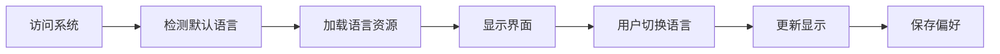

# 用户故事：登录功能国际化支持

## 1. 基本信息
- **用户故事编号**: LOGIN-007
- **名称**: 登录系统的国际化和多语言支持
- **角色**: 普通用户、系统管理员
- **优先级**: 中
- **状态**: 待评审

## 2. 用户故事描述
作为一个国际用户，我希望能够以我熟悉的语言使用登录系统，包括界面文字、错误提示、邮件内容等，以获得更好的用户体验。

作为系统管理员，我希望能够管理和配置系统支持的语言，以满足不同地区用户的需求。

## 3. 业务背景与动机
- **业务目标**:
  - 支持全球用户使用
  - 提供本地化体验
  - 提升用户满意度
- **痛点/机会**:
  - 国际用户语言障碍
  - 本地化需求增加
  - 提升市场竞争力
- **相关业务流程**:
  - 语言选择
  - 内容展示
  - 交互反馈

## 4. 领域映射
- **限界上下文**:
  - 国际化上下文
  - 用户偏好上下文
  - 内容管理上下文
- **核心实体/聚合**:
  - 语言配置（聚合根）
  - 翻译资源（实体）
  - 区域设置（值对象）
  - 用户语言偏好（实体）
- **领域规则**:
  - 默认使用浏览器语言
  - 用户可以手动切换语言
  - 语言设置需要持久化
  - 支持至少中英文两种语言
- **领域事件**:
  - 语言切换事件
  - 翻译更新事件
  - 区域设置变更事件
  - 用户偏好更新事件
- **领域服务**:
  - 国际化服务
  - 翻译管理服务
  - 区域设置服务

## 5. 前提条件
1. 系统支持多语言架构
2. 翻译资源已准备
3. 字符编码支持Unicode
4. 存储支持多语言

## 6. 完整流程
### 6.1 流程图

### 6.2 流程文字描述
1. **主流程**:
   - 系统检测用户语言设置
   - 加载对应语言资源
   - 显示本地化界面
   - 响应语言切换
   - 保存语言偏好

2. **扩展/异常场景**:
   - 首次访问处理
     - 检测浏览器语言
     - 使用默认语言
     - 提供语言选择
  
   - 语言切换处理
     - 实时切换界面
     - 更新所有文本
     - 保存用户选择
  
   - 缺失翻译处理
     - 使用默认语言
     - 标记未翻译项
     - 记录缺失项

## 7. 验收标准
1. **基础功能验证**:
   - 支持语言切换
   - 正确显示翻译
   - 保存语言偏好

2. **界面元素验证**:
   - 所有文本已翻译
   - 格式正确显示
   - 特殊字符支持

3. **交互体验**:
   - 切换即时生效
   - 提示信息本地化
   - 错误信息翻译

## 8. 验收测试
- **测试场景**:
  1. 语言切换测试
     - 输入：切换不同语言
     - 期望：界面正确更新
  
  2. 默认语言测试
     - 输入：首次访问系统
     - 期望：正确识别语言
  
  3. 特殊字符测试
     - 输入：各种语言字符
     - 期望：正确显示不乱码

## 9. 非功能性需求
- **性能/SLA**:
  - 语言切换响应快速
  - 资源加载优化
  - 缓存机制支持
- **可用性**:
  - 直观的语言选择
  - 平滑的切换体验
  - 兼容各种字符
- **可扩展性**:
  - 易于添加新语言
  - 支持动态更新
  - 翻译管理便捷

## 10. 依赖与冲突
- **外部依赖**:
  - 翻译资源文件
  - 字符编码支持
  - 区域设置服务
- **内部依赖**:
  - 用户配置服务
  - 内容管理服务
  - 缓存服务

## 11. 设计与实现提示
- **前端实现**:
  - i18n框架集成
  - 动态语言加载
  - 响应式设计
  
- **后端实现**:
  - 资源文件管理
  - 缓存策略
  - 编码处理
  
- **测试建议**:
  - 多语言测试
  - 性能测试
  - 兼容性测试

## 12. 用户场景
1. 场景1：国际用户访问
   - 自动检测语言
   - 显示本地化内容
   - 提供语言切换

2. 场景2：管理员配置
   - 添加新语言支持
   - 更新翻译内容
   - 设置默认语言

3. 场景3：多语言环境
   - 处理混合语言
   - 支持语言回退
   - 处理特殊字符 