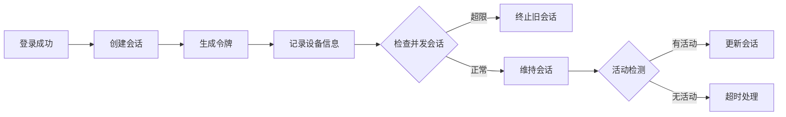

# 用户故事：会话管理功能

## 1. 基本信息

- **用户故事编号**: LOGIN-008
- **名称**: 用户会话管理
- **角色**: 普通用户、系统管理员
- **优先级**: 高
- **状态**: 待评审

---

## 2. 用户故事描述

作为系统用户，我希望系统能够安全地管理我的登录会话，包括自动延期、多设备登录控制、会话超时等功能，以确保账户安全性。

作为系统管理员，我希望能够查看和管理所有用户的活动会话，必要时可以强制终止可疑会话。

---

## 3. 业务背景与动机

- **业务目标**: 
  - 确保用户会话安全
  - 提供灵活的会话控制
  - 防止会话劫持
- **痛点/机会**: 
  - 会话安全风险管理
  - 多设备访问控制
  - 异常会话处理
- **相关业务流程**: 会话创建 -> 会话维护 -> 会话更新 -> 会话终止

---

## 4. 领域模型映射

- **相关限界上下文**:
  - 会话管理上下文
  - 安全策略上下文
  - 用户活动上下文
  
- **核心实体/聚合**:
  - 会话（聚合根）
  - 用户设备（实体）
  - 访问令牌（值对象）
  - 会话策略（实体）
  
- **业务规则**:
  1. 会话默认有效期为8小时
  2. 超过30分钟无活动自动终止会话
  3. 同一账号最多允许3个并发会话
  4. 检测到异常访问模式时强制登出
  
- **领域事件**:
  1. 会话创建事件
  2. 会话更新事件
  3. 会话终止事件
  4. 会话异常事件
  
- **领域服务**:
  - 会话管理服务
  - 令牌管理服务
  - 设备管理服务

---

## 5. 前提条件

- 用户已完成身份认证
- 会话存储服务可用
- 缓存服务正常运行
- 设备识别服务可用

---

## 6. 完整流程

### 6.1 流程图

### 6.2 流程文字描述

1. 主流程
   1. 用户登录成功后创建会话
   2. 生成并返回访问令牌
   3. 记录用户设备信息
   4. 定期检查会话活动
   5. 根据活动更新会话状态

2. 扩展场景
   1. 会话并发控制
      - 检查现有会话数
      - 执行会话清理
      - 通知用户状态
   
   2. 会话延期处理
      - 检测用户活动
      - 自动延长会话
      - 更新令牌状态
   
   3. 异常处理
      - 检测异常访问
      - 强制终止会话
      - 通知用户异常

---

## 7. 验收标准

1. 会话管理功能
   - 正确创建新会话
   - 准确追踪会话状态
   - 及时清理过期会话
   - 正确处理并发限制

2. 安全控制
   - 防止会话固定攻击
   - 防止会话劫持
   - 异常访问检测

3. 用户体验
   - 无感知会话延期
   - 友好的登出提示
   - 多设备同步状态

---

## 8. 验收测试

- 测试场景:
  1. 会话创建测试
     - 输入：用户登录成功
     - 期望：创建有效会话
  
  2. 会话超时测试
     - 输入：超过无活动时间
     - 期望：自动终止会话
  
  3. 并发控制测试
     - 输入：超过最大会话数
     - 期望：终止最早会话

---

## 9. 非功能性需求

- 性能要求:
  - 会话操作响应<100ms
  - 支持大规模并发会话
  - 会话存储高可用

- 安全要求:
  - 会话信息加密存储
  - 安全的令牌传输
  - 防会话预测攻击

- 可用性:
  - 会话恢复机制
  - 跨设备会话同步
  - 优雅的降级处理

---

## 10. 依赖与冲突

- 外部依赖:
  - 缓存服务（Redis）
  - 设备指纹服务
  - 地理位置服务

- 内部依赖:
  - 用户认证服务
  - 安全策略服务
  - 审计日志服务

---

## 11. 设计与实现提示

- 前端实现:
  - Token管理机制
  - 心跳检测
  - 自动重连机制
  
- 后端实现:
  - 分布式会话存储
  - 会话状态同步
  - 令牌加密机制
  
- 测试建议:
  - 会话一致性测试
  - 负载测试
  - 故障恢复测试

---

## 12. 用户场景

1. 场景1：普通用户会话
   - 登录创建会话
   - 正常使用系统
   - 自动延期会话

2. 场景2：多设备访问
   - 同时使用多个设备
   - 会话数量控制
   - 设备间状态同步

3. 场景3：异常会话处理
   - 检测异常访问
   - 强制终止会话
   - 通知用户确认 