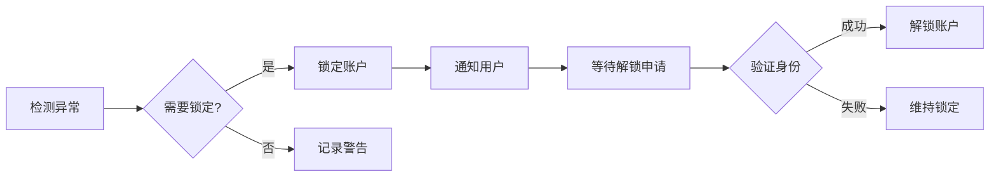

# 用户故事：账户锁定与解锁

## 1. 基本信息

- **用户故事编号**: LOGIN-009
- **名称**: 账户锁定和解锁管理
- **角色**: 普通用户、系统管理员
- **优先级**: 高
- **状态**: 待评审

---

## 2. 用户故事描述

作为系统用户，当我的账户因安全原因被锁定时，我希望能够通过安全的方式解锁账户，以重新获得系统访问权限。

作为系统管理员，我希望能够管理账户锁定策略，并在必要时手动锁定或解锁用户账户。

---

## 3. 业务背景与动机

- **业务目标**: 
  - 保护账户安全
  - 防范暴力破解
  - 提供账户恢复机制
- **痛点/机会**: 
  - 异常登录防护
  - 账户被盗风险
  - 自助解锁需求
- **相关业务流程**: 检测异常 -> 锁定账户 -> 验证身份 -> 解锁账户

---

## 4. 领域模型映射

- **相关限界上下文**:
  - 账户安全上下文
  - 用户管理上下文
  - 安全策略上下文
  
- **核心实体/聚合**:
  - 用户账户（聚合根）
  - 锁定记录（实体）
  - 解锁申请（实体）
  - 锁定策略（实体）
  
- **业务规则**:
  1. 连续5次密码错误触发锁定
  2. 账户锁定持续30分钟
  3. 24小时内最多3次自助解锁
  4. 管理员可以随时解锁
  
- **领域事件**:
  1. 账户锁定事件
  2. 解锁申请事件
  3. 账户解锁事件
  4. 锁定策略更新事件
  
- **领域服务**:
  - 账户锁定服务
  - 解锁验证服务
  - 通知服务

---

## 5. 前提条件

- 账户管理系统可用
- 邮件服务正常运行
- 验证服务可用
- 通知系统正常

---

## 6. 完整流程

### 6.1 流程图

### 6.2 流程文字描述

1. 主流程
   1. 系统检测到异常行为
   2. 触发账户锁定
   3. 通知用户锁定原因
   4. 用户申请解锁
   5. 验证身份后解锁

2. 扩展场景
   1. 自动锁定处理
      - 记录失败次数
      - 触发锁定规则
      - 发送通知邮件
   
   2. 自助解锁流程
      - 验证用户身份
      - 检查解锁限制
      - 执行解锁操作
   
   3. 管理员操作
      - 查看锁定原因
      - 手动解锁账户
      - 调整锁定策略

---

## 7. 验收标准

1. 锁定功能
   - 正确触发锁定
   - 准确记录原因
   - 及时发送通知

2. 解锁功能
   - 身份验证有效
   - 解锁限制生效
   - 操作日志完整

3. 管理功能
   - 策略配置有效
   - 管理操作可追溯
   - 通知送达可靠

---

## 8. 验收测试

- 测试场景:
  1. 自动锁定测试
     - 输入：连续密码错误
     - 期望：账户被锁定
  
  2. 自助解锁测试
     - 输入：有效的身份验证
     - 期望：账户成功解锁
  
  3. 管理员操作测试
     - 输入：管理员解锁命令
     - 期望：立即解锁账户

---

## 9. 非功能性需求

- 性能要求:
  - 锁定操作实时生效
  - 解锁响应<1秒
  - 通知延迟<1分钟

- 安全要求:
  - 解锁验证安全
  - 操作日志不可篡改
  - 管理权限严格控制

- 可用性:
  - 7x24小时服务
  - 多渠道通知
  - 友好的错误提示

---

## 10. 依赖与冲突

- 外部依赖:
  - 邮件服务
  - 短信服务
  - 验证码服务

- 内部依赖:
  - 用户管理服务
  - 安全策略服务
  - 审计日志服务

---

## 11. 设计与实现提示

- 前端实现:
  - 锁定状态显示
  - 解锁申请表单
  - 进度反馈
  
- 后端实现:
  - 分布式锁定状态
  - 解锁流程事务
  - 通知重试机制
  
- 测试建议:
  - 锁定条件测试
  - 解锁流程测试
  - 并发操作测试

---

## 12. 用户场景

1. 场景1：密码错误锁定
   - 多次输入错误
   - 触发自动锁定
   - 等待自动解锁

2. 场景2：可疑活动锁定
   - 检测异常行为
   - 管理员手动锁定
   - 要求身份验证

3. 场景3：紧急解锁需求
   - 账户意外锁定
   - 提供身份证明
   - 管理员协助解锁 