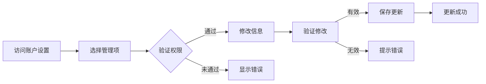

# 用户故事：用户账户管理

## 1. 基本信息

- **用户故事编号**: LOGIN-010
- **名称**: 用户账户信息管理
- **角色**: 普通用户、系统管理员
- **优先级**: 中
- **状态**: 待评审

---

## 2. 用户故事描述

作为系统用户，我希望能够管理我的账户信息，包括更新个人资料、修改密码、管理安全设置等，以保持账户信息的准确性和安全性。

作为系统管理员，我希望能够管理用户账户信息，包括查看、编辑、停用账户等操作，以维护系统的正常运行。

---

## 3. 业务背景与动机

- **业务目标**: 
  - 维护用户资料准确性
  - 提供账户自助管理
  - 确保数据合规性
- **痛点/机会**: 
  - 用户信息需要更新
  - 账户安全需要加强
  - 管理效率需要提升
- **相关业务流程**: 信息维护 -> 安全设置 -> 权限管理 -> 状态更新

---

## 4. 领域模型映射

- **相关限界上下文**:
  - 用户管理上下文
  - 个人资料上下文
  - 安全设置上下文
  
- **核心实体/聚合**:
  - 用户账户（聚合根）
  - 个人资料（实体）
  - 安全设置（实体）
  - 账户状态（值对象）
  
- **业务规则**:
  1. 邮箱修改需要验证
  2. 密码修改需要原密码
  3. 敏感信息需要加密
  4. 操作需要授权验证
  
- **领域事件**:
  1. 资料更新事件
  2. 密码修改事件
  3. 账户状态变更事件
  4. 安全设置更新事件
  
- **领域服务**:
  - 账户管理服务
  - 资料验证服务
  - 安全配置服务

---

## 5. 前提条件

- 用户已经注册
- 用户已经登录
- 权限验证服务可用
- 存储服务正常运行

---

## 6. 完整流程

### 6.1 流程图

### 6.2 流程文字描述

1. 主流程
   1. 用户访问账户设置
   2. 选择要管理的项目
   3. 进行权限验证
   4. 修改相关信息
   5. 保存并更新

2. 扩展场景
   1. 个人资料更新
      - 修改基本信息
      - 验证必要字段
      - 保存更新记录
   
   2. 密码修改
      - 验证原密码
      - 设置新密码
      - 更新安全记录
   
   3. 账户状态管理
      - 检查当前状态
      - 执行状态变更
      - 发送状态通知

---

## 7. 验收标准

1. 基本功能
   - 信息更新正确
   - 密码修改成功
   - 状态变更有效

2. 安全控制
   - 权限验证有效
   - 敏感信息保护
   - 操作日志完整

3. 用户体验
   - 操作流程清晰
   - 反馈信息及时
   - 异常处理友好

---

## 8. 验收测试

- 测试场景:
  1. 资料更新测试
     - 输入：新的个人信息
     - 期望：成功更新并保存
  
  2. 密码修改测试
     - 输入：原密码和新密码
     - 期望：密码成功更新
  
  3. 状态管理测试
     - 输入：状态变更请求
     - 期望：状态正确更新

---

## 9. 非功能性需求

- 性能要求:
  - 操作响应<1秒
  - 数据同步及时
  - 支持并发操作

- 安全要求:
  - 数据加密存储
  - 访问权限控制
  - 操作审计跟踪

- 可用性:
  - 界面易用性
  - 操作可回退
  - 状态实时显示

---

## 10. 依赖与冲突

- 外部依赖:
  - 存储服务
  - 验证服务
  - 通知服务

- 内部依赖:
  - 认证服务
  - 权限服务
  - 审计服务

---

## 11. 设计与实现提示

- 前端实现:
  - 表单验证
  - 实时反馈
  - 状态显示
  
- 后端实现:
  - 数据验证
  - 事务处理
  - 缓存更新
  
- 测试建议:
  - 字段验证测试
  - 并发操作测试
  - 权限控制测试

---

## 12. 用户场景

1. 场景1：个人资料维护
   - 更新基本信息
   - 修改联系方式
   - 设置偏好选项

2. 场景2：安全信息更新
   - 修改登录密码
   - 更新安全问题
   - 配置通知设置

3. 场景3：管理员操作
   - 查看用户信息
   - 修改账户状态
   - 重置用户设置 