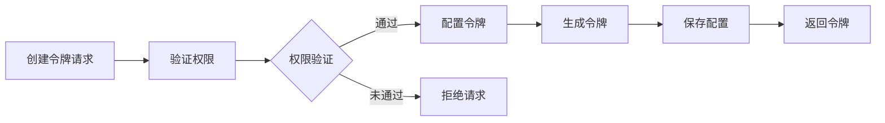

# 用户故事：API令牌管理

## 1. 基本信息

- **用户故事编号**: LOGIN-011
- **名称**: API令牌管理
- **角色**: 开发者用户、系统管理员
- **优先级**: 高
- **状态**: 待评审

---

## 2. 用户故事描述

作为一个开发者用户，我希望能够创建和管理API访问令牌，以便安全地集成和访问系统API。

作为系统管理员，我希望能够监控和控制API令牌的使用，以确保系统安全和资源合理使用。

---

## 3. 业务背景与动机

- **业务目标**: 
  - 提供安全的API访问机制
  - 支持系统集成需求
  - 控制API访问权限
- **痛点/机会**: 
  - 需要非交互式访问
  - API访问安全管理
  - 访问权限精细控制
- **相关业务流程**: 令牌创建 -> 权限配置 -> 令牌使用 -> 令牌管理

---

## 4. 领域模型映射

- **相关限界上下文**:
  - API管理上下文
  - 安全认证上下文
  - 访问控制上下文
  
- **核心实体/聚合**:
  - API令牌（聚合根）
  - 权限范围（实体）
  - 使用记录（实体）
  - 令牌策略（实体）
  
- **业务规则**:
  1. 令牌有效期可配置
  2. 令牌权限范围可自定义
  3. 令牌使用需要审计
  4. 可设置令牌使用限制
  
- **领域事件**:
  1. 令牌创建事件
  2. 令牌使用事件
  3. 令牌撤销事件
  4. 权限变更事件
  
- **领域服务**:
  - 令牌管理服务
  - 权限验证服务
  - 审计日志服务

---

## 5. 前提条件

- 用户具有开发者权限
- API网关服务可用
- 权限系统正常运行
- 审计系统就绪

---

## 6. 完整流程

### 6.1 流程图

### 6.2 流程文字描述

1. 主流程
   1. 用户请求创建API令牌
   2. 系统验证用户权限
   3. 用户配置令牌参数
   4. 系统生成令牌
   5. 保存令牌配置
   6. 返回令牌信息

2. 扩展场景
   1. 令牌管理
      - 查看现有令牌
      - 修改令牌权限
      - 撤销失效令牌
   
   2. 令牌使用监控
      - 跟踪使用情况
      - 检测异常使用
      - 生成使用报告
   
   3. 令牌更新
      - 延长有效期
      - 修改访问范围
      - 更新使用限制

---

## 7. 验收标准

1. 令牌管理功能
   - 成功创建令牌
   - 正确设置权限
   - 有效期管理正常
   - 撤销功能可用

2. 安全控制
   - 令牌安全存储
   - 权限验证有效
   - 使用限制生效

3. 监控审计
   - 使用记录完整
   - 异常检测有效
   - 报告生成正确

---

## 8. 验收测试

- 测试场景:
  1. 令牌创建测试
     - 输入：令牌配置参数
     - 期望：成功生成有效令牌
  
  2. 权限控制测试
     - 输入：不同权限范围
     - 期望：正确限制访问范围
  
  3. 令牌撤销测试
     - 输入：撤销请求
     - 期望：令牌立即失效

---

## 9. 非功能性需求

- 性能要求:
  - 令牌验证 <50ms
  - 支持高并发访问
  - 令牌管理响应快速

- 安全要求:
  - 令牌加密存储
  - 传输过程加密
  - 防止令牌泄露

- 可用性:
  - 24/7 服务可用
  - 友好的管理界面
  - 完整的使用文档

---

## 10. 依赖与冲突

- 外部依赖:
  - API网关服务
  - 加密服务
  - 存储服务

- 内部依赖:
  - 认证服务
  - 权限服务
  - 审计服务

---

## 11. 设计与实现提示

- 前端实现:
  - 令牌管理界面
  - 权限配置组件
  - 使用状态展示
  
- 后端实现:
  - JWT令牌实现
  - 权限验证中间件
  - 使用统计服务
  
- 测试建议:
  - 令牌生命周期测试
  - 权限边界测试
  - 性能压力测试

---

## 12. 用户场景

1. 场景1：系统集成
   - 创建集成令牌
   - 配置访问权限
   - 监控使用情况

2. 场景2：令牌更新
   - 检查令牌状态
   - 更新令牌配置
   - 确保业务连续性

3. 场景3：安全审计
   - 审查令牌使用
   - 检测异常访问
   - 生成审计报告 