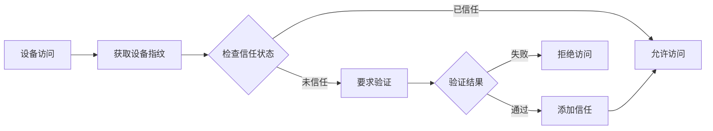

# 用户故事：设备信任管理

## 1. 基本信息

- **用户故事编号**: LOGIN-012
- **名称**: 设备信任管理
- **角色**: 普通用户、系统管理员
- **优先级**: 高
- **状态**: 待评审

---

## 2. 用户故事描述

作为系统用户，我希望能够管理我的可信设备列表，并在新设备登录时得到通知和确认，以确保账户安全。

作为系统管理员，我希望能够实施设备信任策略，监控设备访问模式，以防范潜在的安全威胁。

---

## 3. 业务背景与动机

- **业务目标**: 
  - 增强账户安全性
  - 防范未授权访问
  - 提供设备级别控制
- **痛点/机会**: 
  - 防止账户被盗用
  - 异常设备检测
  - 提升安全体验
- **相关业务流程**: 设备注册 -> 信任确认 -> 访问控制 -> 设备管理

---

## 4. 领域模型映射

- **相关限界上下文**:
  - 设备管理上下文
  - 安全策略上下文
  - 用户偏好上下文
  
- **核心实体/聚合**:
  - 设备信息（聚合根）
  - 设备指纹（实体）
  - 信任级别（值对象）
  - 访问记录（实体）
  
- **业务规则**:
  1. 新设备首次登录需要验证
  2. 可信设备列表最多10个
  3. 90天未使用自动解除信任
  4. 异常行为触发安全检查
  
- **领域事件**:
  1. 设备注册事件
  2. 信任状态变更事件
  3. 设备访问事件
  4. 异常行为事件
  
- **领域服务**:
  - 设备管理服务
  - 指纹识别服务
  - 风险评估服务

---

## 5. 前提条件

- 用户已注册账户
- 设备指纹服务可用
- 通知系统就绪
- 风险评估系统可用

---

## 6. 完整流程

### 6.1 流程图

### 6.2 流程文字描述

1. 主流程
   1. 检测设备信息
   2. 生成设备指纹
   3. 验证信任状态
   4. 处理访问请求
   5. 更新设备记录

2. 扩展场景
   1. 新设备注册
      - 收集设备信息
      - 验证用户身份
      - 确认添加信任
   
   2. 设备管理
      - 查看设备列表
      - 移除信任设备
      - 更新设备信息
   
   3. 异常处理
      - 检测异常行为
      - 发送安全警告
      - 要求重新验证

---

## 7. 验收标准

1. 设备管理功能
   - 准确识别设备
   - 正确管理信任状态
   - 设备列表管理有效

2. 安全控制
   - 新设备验证有效
   - 异常检测准确
   - 风险控制得当

3. 用户体验
   - 操作流程清晰
   - 提示信息准确
   - 验证过程流畅

---

## 8. 验收测试

- 测试场景:
  1. 设备注册测试
     - 输入：新设备访问
     - 期望：要求验证并正确注册
  
  2. 信任管理测试
     - 输入：设备信任操作
     - 期望：正确更新信任状态
  
  3. 异常检测测试
     - 输入：模拟异常行为
     - 期望：触发安全警告

---

## 9. 非功能性需求

- 性能要求:
  - 设备识别 <1秒
  - 信任验证 <2秒
  - 支持大规模设备

- 安全要求:
  - 设备信息加密
  - 指纹算法安全
  - 防止指纹伪造

- 可用性:
  - 跨平台支持
  - 离线模式支持
  - 优雅降级机制

---

## 10. 依赖与冲突

- 外部依赖:
  - 设备指纹服务
  - 地理位置服务
  - 风险评估服务

- 内部依赖:
  - 认证服务
  - 通知服务
  - 审计服务

---

## 11. 设计与实现提示

- 前端实现:
  - 设备信息收集
  - 信任状态显示
  - 管理界面设计
  
- 后端实现:
  - 指纹算法实现
  - 风险评估逻辑
  - 数据同步机制
  
- 测试建议:
  - 多设备测试
  - 性能压力测试
  - 安全漏洞测试

---

## 12. 用户场景

1. 场景1：日常设备使用
   - 已信任设备登录
   - 自动通过验证
   - 正常访问系统

2. 场景2：新设备首次使用
   - 要求身份验证
   - 确认添加信任
   - 记录设备信息

3. 场景3：异常设备处理
   - 检测可疑行为
   - 发送警告通知
   - 要求额外验证 