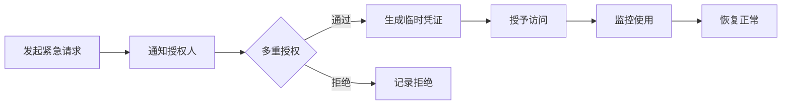

# 用户故事：紧急访问程序

## 1. 基本信息

- **用户故事编号**: LOGIN-013
- **名称**: 紧急访问程序
- **角色**: 系统管理员、安全管理员、普通用户
- **优先级**: 高
- **状态**: 待评审

---

## 2. 用户故事描述

作为系统管理员，我希望能够在紧急情况下（如系统故障、自然灾害等）快速恢复关键用户的访问权限，以确保业务连续性。

作为安全管理员，我希望紧急访问程序有完整的审计记录和多重授权机制，以确保安全合规。

---

## 3. 业务背景与动机

- **业务目标**: 
  - 确保业务连续性
  - 提供应急访问机制
  - 保护系统安全
- **痛点/机会**: 
  - 常规访问机制失效
  - 紧急情况处理
  - 合规性要求
- **相关业务流程**: 紧急申请 -> 多重授权 -> 临时访问 -> 恢复正常

---

## 4. 领域模型映射

- **相关限界上下文**:
  - 应急管理上下文
  - 授权管理上下文
  - 审计日志上下文
  
- **核心实体/聚合**:
  - 紧急访问请求（聚合根）
  - 授权记录（实体）
  - 临时凭证（值对象）
  - 审计日志（实体）
  
- **业务规则**:
  1. 紧急访问需要多人授权
  2. 临时访问最长24小时
  3. 必须记录完整操作日志
  4. 定期演练和更新流程
  
- **领域事件**:
  1. 紧急访问申请事件
  2. 授权完成事件
  3. 访问权限变更事件
  4. 紧急状态解除事件
  
- **领域服务**:
  - 紧急授权服务
  - 临时凭证服务
  - 审计记录服务

---

## 5. 前提条件

- 紧急预案已制定
- 授权人员已指定
- 审计系统正常运行
- 备用通信渠道可用

---

## 6. 完整流程

### 6.1 流程图

### 6.2 流程文字描述

1. 主流程
   1. 识别紧急情况
   2. 发起访问请求
   3. 获取必要授权
   4. 生成临时凭证
   5. 监控使用情况
   6. 恢复正常访问

2. 扩展场景
   1. 快速授权流程
      - 验证紧急程度
      - 简化授权步骤
      - 快速响应处理
   
   2. 权限范围控制
      - 限制访问范围
      - 设置时间限制
      - 监控操作行为
   
   3. 恢复正常流程
      - 解除紧急状态
      - 撤销临时权限
      - 记录完整过程

---

## 7. 验收标准

1. 紧急访问功能
   - 快速响应请求
   - 多重授权有效
   - 临时凭证可用

2. 安全控制
   - 授权流程完整
   - 访问范围受限
   - 审计记录完整

3. 合规要求
   - 符合安全策略
   - 满足审计要求
   - 流程可追溯

---

## 8. 验收测试

- 测试场景:
  1. 紧急授权测试
     - 输入：紧急访问请求
     - 期望：快速完成授权
  
  2. 多重授权测试
     - 输入：授权审批流程
     - 期望：所有必要人员确认
  
  3. 审计记录测试
     - 输入：完整操作流程
     - 期望：记录所有关键行为

---

## 9. 非功能性需求

- 性能要求:
  - 响应时间 <5分钟
  - 24/7可用性
  - 高可靠性保证

- 安全要求:
  - 多重授权机制
  - 完整审计日志
  - 加密通信

- 可用性:
  - 简单的操作流程
  - 清晰的状态显示
  - 多渠道通知

---

## 10. 依赖与冲突

- 外部依赖:
  - 通信系统
  - 身份验证服务
  - 审计系统

- 内部依赖:
  - 授权服务
  - 用户管理服务
  - 监控服务

---

## 11. 设计与实现提示

- 前端实现:
  - 紧急请求界面
  - 授权管理页面
  - 状态监控显示
  
- 后端实现:
  - 多重授权逻辑
  - 临时凭证生成
  - 审计日志记录
  
- 测试建议:
  - 应急演练测试
  - 压力测试
  - 恢复流程测试

---

## 12. 用户场景

1. 场景1：系统故障恢复
   - 系统管理员请求访问
   - 快速获取授权
   - 执行恢复操作

2. 场景2：自然灾害应对
   - 启动应急预案
   - 授予临时权限
   - 确保业务连续

3. 场景3：安全事件响应
   - 检测安全威胁
   - 限制正常访问
   - 启用应急通道 