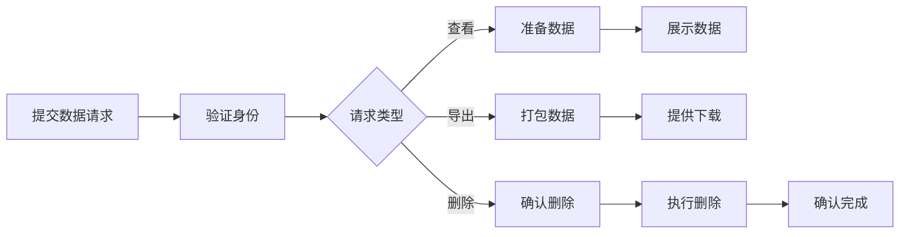

# 用户故事：隐私合规功能

## 1. 基本信息

- **用户故事编号**: LOGIN-014
- **名称**: 隐私合规功能实现
- **角色**: 普通用户、系统管理员、合规官
- **优先级**: 高
- **状态**: 待评审

---

## 2. 用户故事描述

作为系统用户，我希望能够管理我的个人数据，包括查看、导出和删除，以符合GDPR等隐私法规的要求。

作为系统管理员和合规官，我希望系统能够满足各项隐私合规要求，并能够有效处理用户的数据相关请求。

---

## 3. 业务背景与动机

- **业务目标**: 
  - 满足隐私法规要求
  - 保护用户数据权利
  - 降低合规风险
- **痛点/机会**: 
  - 隐私法规合规需求
  - 用户数据保护
  - 避免法律风险
- **相关业务流程**: 数据请求 -> 身份验证 -> 数据处理 -> 响应完成

---

## 4. 领域模型映射

- **相关限界上下文**:
  - 隐私管理上下文
  - 数据处理上下文
  - 用户权限上下文
  
- **核心实体/聚合**:
  - 数据主体请求（聚合根）
  - 个人数据（实体）
  - 处理记录（实体）
  - 同意记录（实体）
  
- **业务规则**:
  1. 数据导出在30天内完成
  2. 删除请求需二次确认
  3. 保留必要的合规记录
  4. 数据处理需明确同意
  
- **领域事件**:
  1. 数据请求提交事件
  2. 数据处理完成事件
  3. 用户同意变更事件
  4. 数据删除完成事件
  
- **领域服务**:
  - 隐私请求服务
  - 数据处理服务
  - 合规记录服务

---

## 5. 前提条件

- 用户身份已验证
- 数据处理系统就绪
- 存储系统支持数据分离
- 审计系统可用

---

## 6. 完整流程

### 6.1 流程图

### 6.2 流程文字描述

1. 主流程
   1. 用户提交数据请求
   2. 验证用户身份
   3. 处理数据请求
   4. 执行相应操作
   5. 记录处理结果

2. 扩展场景
   1. 数据访问请求
      - 收集相关数据
      - 格式化展示
      - 提供导出选项
   
   2. 数据删除请求
      - 确认删除范围
      - 执行数据删除
      - 保留必要记录
   
   3. 同意管理
      - 更新同意状态
      - 调整数据处理
      - 记录变更历史

---

## 7. 验收标准

1. 数据管理功能
   - 数据访问正确
   - 导出功能完整
   - 删除操作有效

2. 合规要求
   - 响应时间达标
   - 数据格式规范
   - 处理记录完整

3. 用户体验
   - 操作流程清晰
   - 状态反馈及时
   - 隐私政策透明

---

## 8. 验收测试

- 测试场景:
  1. 数据访问测试
     - 输入：数据访问请求
     - 期望：完整准确的数据
  
  2. 数据导出测试
     - 输入：导出请求
     - 期望：规范格式的数据包
  
  3. 数据删除测试
     - 输入：删除请求
     - 期望：数据被正确删除

---

## 9. 非功能性需求

- 性能要求:
  - 请求响应 <24小时
  - 导出打包 <30分钟
  - 删除操作 <7天

- 安全要求:
  - 数据传输加密
  - 访问权限控制
  - 操作日志完整

- 可用性:
  - 多语言支持
  - 清晰的指引
  - 状态追踪

---

## 10. 依赖与冲突

- 外部依赖:
  - 存储服务
  - 加密服务
  - 通知服务

- 内部依赖:
  - 用户认证服务
  - 数据处理服务
  - 审计服务

---

## 11. 设计与实现提示

- 前端实现:
  - 隐私中心界面
  - 请求处理流程
  - 状态展示组件
  
- 后端实现:
  - 数据收集逻辑
  - 删除流程实现
  - 审计日志记录
  
- 测试建议:
  - 合规性测试
  - 性能测试
  - 安全测试

---

## 12. 用户场景

1. 场景1：数据访问请求
   - 提交访问申请
   - 验证用户身份
   - 展示个人数据

2. 场景2：数据导出需求
   - 选择导出范围
   - 生成数据包
   - 安全下载数据

3. 场景3：被遗忘权行使
   - 提交删除请求
   - 确认删除范围
   - 执行数据清理 