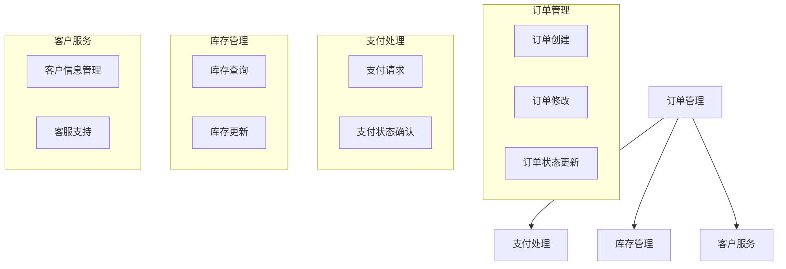
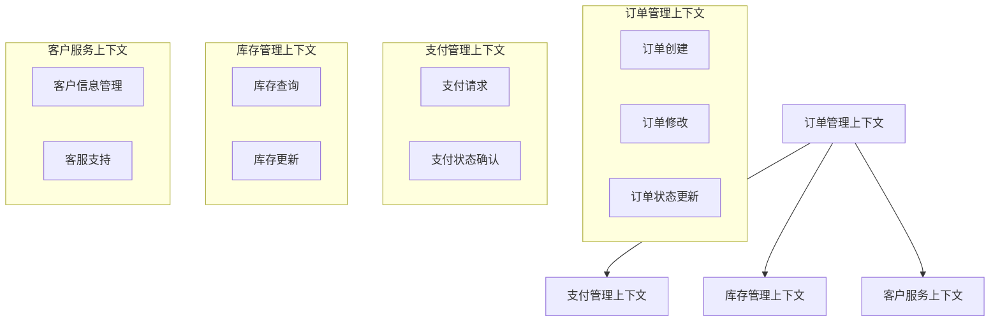
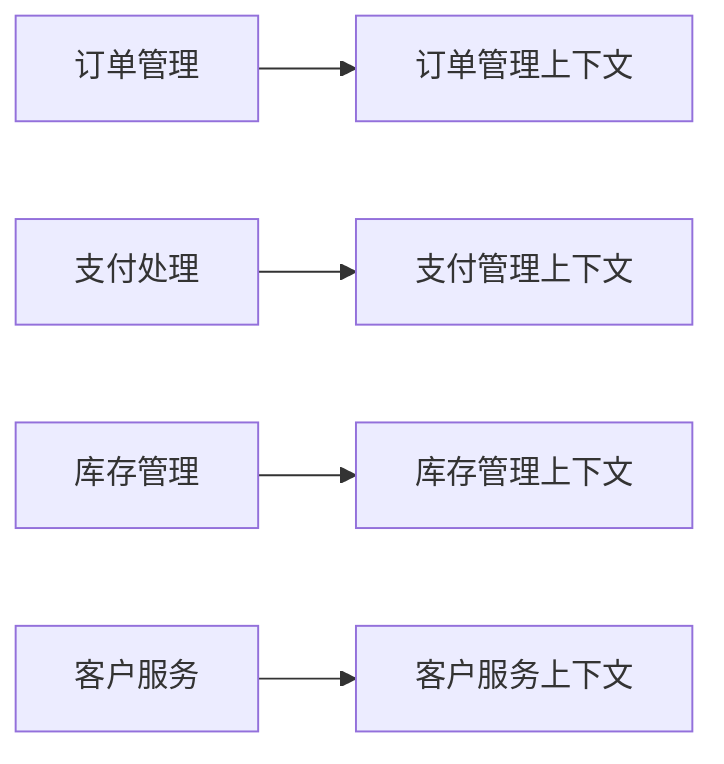
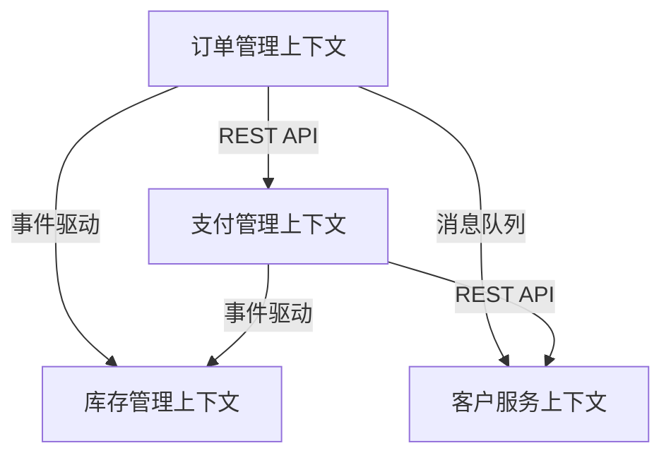

划分子域和限界上下文 是领域驱动设计（DDD）中一个至关重要的步骤，旨在将复杂的业务领域解耦为多个独立且协调工作的子域，并且为每个子域定义清晰的限界上下文。这不仅有助于系统的模块化，降低复杂度，还能为微服务架构的实现打下坚实的基础。

下面是**“划分子域和限界上下文”任务的详细描述，包括输入、输出、详细步骤、验收标准及RACI 矩阵**。

### 输入
	1.	业务需求和领域报告：如电商平台的业务需求分析报告、功能模块文档等。
	2.	领域专家反馈：与业务专家的访谈和沟通记录，帮助理解不同业务领域。
	3.	当前系统架构或业务流程图：现有系统或流程的整体架构，作为划分子域和限界上下文的基础。
	4.	用例建模和事件风暴结果：前期对业务流程和功能的建模结果，帮助识别子域和上下文的边界。

### 输出
	1.	子域划分图：展示系统中各个子域的边界和职责划分。
	2.	上下文边界图：每个子域对应的限界上下文，明确其功能、边界和责任。
	3.	子域与上下文的映射关系：将每个子域与相应的有界上下文关联，确保上下文划分清晰。
	4.	跨上下文的关系与通信方式：描述不同上下文之间的关系，以及它们如何通过接口、事件或数据流进行交互。

### 详细步骤

#### 步骤 1: 理解业务需求和领域
	•	与业务专家合作：通过与业务专家的沟通，确保深入了解不同业务模块的需求和功能。
	•	分析现有系统架构：查看现有系统架构或业务流程，识别出不同的业务模块和功能。

#### 步骤 2: 确定子域
	•	识别业务功能和模块：根据业务需求和功能，识别出系统中的主要子域。例如，电商平台可以划分为“订单管理”、“支付处理”、“库存管理”、“客户服务”等。
	•	分析业务流程和用例：通过分析系统的核心用例，识别出需要独立的功能模块，作为子域的候选。
步骤举例：
	•	订单管理：负责处理订单的创建、修改、取消等。
	•	支付处理：负责处理支付请求、确认支付状态等。
	•	库存管理：负责库存信息的更新、商品库存的管理。
	•	客户服务：处理客户咨询、支持请求等。

#### 步骤 3: 划分限界上下文
	•	根据子域划分上下文：为每个子域定义限界上下文，确保上下文内部的领域模型、语言和规则一致。
	•	明确每个上下文的边界：定义哪些功能属于当前上下文，哪些功能属于其他上下文。避免职责重叠，确保每个上下文的责任清晰。
例如：
	•	订单管理上下文：负责订单的生命周期管理，包括创建、修改、取消订单。
	•	支付处理上下文：处理支付信息和支付状态更新，不包含库存管理或订单创建功能。

#### 步骤 4: 描述跨上下文关系与通信方式
	•	识别上下文之间的关系：分析不同上下文之间的依赖关系和数据流，明确它们之间的交互方式（如API调用、事件驱动等）。
	•	定义跨上下文的通信方式：确定如何通过REST API、事件发布/订阅、消息队列等方式进行跨上下文的通信。
#### 步骤 5: 生成文档
根据上面 四步 的输出， 生成文档，具体要求如下

##### 输出格式
```markdown
# 限界上下文分析报告
## 子域划分图
### **目标**
展示系统中各个子域的边界和职责划分，确保每个子域的责任清晰、边界明确。

### **子域划分**

以下为系统中各个子域的划分示意图：


### 描述
描述每个子域的职责和功能，例如：
- 订单管理：负责订单的创建、修改、状态更新等。
- 支付处理：负责处理支付请求及支付状态更新。    
- 库存管理：处理库存查询及库存更新。
- 客户服务：管理客户信息和提供客服支持。

## 2. 上下文描述 (Bounded Context Description)
### 上下文边界图

#### **目标**
每个子域对应的限界上下文，明确其功能、边界和责任。

#### **上下文边界图**

以下为系统中各个子域的上下文边界示意图：


### 上下文映射图 （Context Map Diagram）
[Mermaid图表代码]
上下文映射图应该清晰地展示哪些功能和模块属于当前上下文，哪些不属于。确保每个上下文的边界是清晰且合理的。满足下面要求：
     a, 对图形中有界上下文命名及编号，
     b, 用箭头表示限界上下文之间的关系和交互方向。关系类型包含： 
        - 合作关系：两个限界上下文之间有明确的协作关系，但保持独立。
        - 依赖关系：一个限界上下文依赖另一个限界上下文的功能或数据。
        - 共享内核：两个限界上下文共享一部分领域模型。
        - 防腐层（Anti-Corruption Layer）：用于隔离不同限界上下文的模型差异，防止模型冲突。
     c, 标记有界上下文的边界：例如，订单管理有界上下文的边界可以包括订单的创建、修改、删除、状态更新等，而不包括支付和库存管理。
	 d,标明哪些上下文之间存在交互关系，哪些需要通过接口、事件或数据流进行通信。 
	 e, 用虚线表示弱关系，用实线表示强关系。
     
### 上下文描述
#### 2.1 [上下文名称1]
内容要求：有界上下文职责和功能描述：为每个有界上下文定义清晰的职责和功能。这有助于团队理解每个上下文应该负责什么，避免出现职责重叠或不清晰的情况。
- 核心职责：
- 关键功能：
- 数据资产：
- 对外接口：        

#### 2.2 [上下文名称2]
[同上结构]

## 子域与上下文的映射关系

### **目标**
将每个子域与相应的有界上下文关联，确保上下文划分清晰。

### **映射关系图**

以下为每个子域与其对应的上下文的关系图：


### 关系描述
一关系为单位，描述每条描述子域与上下文关系，例如：
    - 订单管理子域与订单管理上下文相关联。
    - 支付处理子域与支付管理上下文相关联。
    - 库存管理子域与库存管理上下文相关联。
    - 客户服务子域与客户服务上下文相关联。


## 3. 跨上下文关系 （Context Mapping）
内容要求：
描述跨上下文关系，并定义出跨上下文通信方式，包含如下内容
关系描述：描述限界上下文与其他限界上下文的关系，包括数据流、接口和依赖关系。
交互方式：定义限界上下文之间的交互方式，如API调用、事件发布/订阅等。
关系类型： 
    - 合作关系：两个限界上下文之间有明确的协作关系，但保持独立。
    - 依赖关系：一个限界上下文依赖另一个限界上下文的功能或数据。
    - 共享内核：两个限界上下文共享一部分领域模型。
    - 防腐层（Anti-Corruption Layer）：用于隔离不同限界上下文的模型差异，防止模型冲突。
交互方式：
    目标：定义限界上下文之间的通信方式。
    内容：
        - API调用：通过RESTful API或GraphQL等技术进行通信。
        - 事件发布/订阅：通过消息队列（如RabbitMQ、Kafka）进行异步通信。
        - 共享数据库：在某些情况下，限界上下文可能共享数据库，但这种方式不推荐，因为它增加了耦合度。
### 跨上下文的关系与通信方式

#### **目标**
描述不同上下文之间的关系，并定义它们如何通过接口、事件或数据流进行交互。

#### **跨上下文关系图**
以下为不同上下文之间的关系和交互方式的示意图：


### 关系描述
一关系为单位，描述每条描述子域与上下文关系，例如：
#### 3.1 [关系1]
    - 上游上下文：
    - 与上游关系类型：
    - 下游上下文：
    - 与下游关系类型：
    - 通信方式：
    - 数据流向：


#### 步骤 6: 验证和调整
	•	与业务专家、架构师和开发团队验证：确保划分的子域和限界上下文符合业务需求和技术可行性。
	•	持续优化：根据反馈不断调整子域划分和上下文定义，以确保设计的灵活性和扩展性。

### 验收标准
	1.	清晰的子域划分：子域划分应该清晰且合理，确保每个子域的责任和功能明确，避免重叠或遗漏。
	2.	一致的限界上下文定义：每个限界上下文应该有明确的边界、责任和功能。上下文之间的关系和依赖应该清晰可见。
	3.	有效的跨上下文通信设计：跨上下文的通信方式应清晰定义，包括接口、事件或消息传递机制，确保系统内各上下文可以有效协作。
	4.	业务需求对接：划分后的子域和限界上下文应该与业务需求紧密对接，确保系统设计满足业务目标。
```
```

### RACI 矩阵

| 任务/角色 | 业务专家 | 系统架构师 | 开发团队 | 项目经理 |
| --- | --- | --- | --- | --- |
| 理解业务需求和领域 | A | C | C | I |
| 确定子域 | A | C | C | I |
| 划分限界上下文 | A | R | C | I |
| 定义每个上下文的职责和功能 | C | R | C | I |
| 描述跨上下文关系与通信方式 | C | R | R | I |
| 验证和调整子域和上下文 | A | R | C | I |
| 输出最终设计文档 | C | R | I | A |

角色说明：
	•	A (Accountable)：对任务结果负责的人，通常是最终决策者。
	•	R (Responsible)：实际执行任务的角色。
	•	C (Consulted)：提供咨询或支持的人，提供专业意见。
	•	I (Informed)：需要被告知进展的人，通常是利益相关者。

### 总结

“划分子域和限界上下文”任务的目标是根据业务需求和系统架构将复杂的业务领域分解为多个子域，并为每个子域定义清晰的限界上下文。这一过程能够帮助团队在系统中明确功能模块的边界、避免职责重叠，并通过定义跨上下文的通信方式，确保系统能够灵活且高效地运作。

通过以上详细的步骤、输出和验收标准，您可以确保任务的高效执行，并确保最终设计能够支持系统的长期发展和演化。