# API网关 (Gateway)

## 功能描述
API Gateway 作为系统的统一流量入口，是整个分布式架构的核心基础组件。它负责请求的统一接入、路由分发、流量治理，并提供安全防护、监控管理等关键能力。

## 核心功能清单
1. **请求接入与路由**
   - 统一协议接入 (HTTP/HTTPS/WebSocket)
   - 动态路由规则配置与管理
   - 服务发现与负载均衡
   - 请求转发与协议转换
   - 灰度发布路由支持

2. **流量治理**
   - 请求限流(单机/分布式)
   - 熔断降级
   - 黑白名单控制
   - 并发控制
   - QPS控制
   - 带宽控制

3. **安全防护**
   - 统一认证鉴权
   - Token验证与续期
   - 防SQL注入
   - 防XSS攻击
   - 防CSRF攻击
   - IP黑名单
   - WAF功能
   - 敏感信息过滤

4. **请求增强**
   - 请求/响应报文加解密
   - 统一日志记录
   - 请求参数验证
   - 响应数据转换
   - 统一错误码处理
   - 接口签名校验
   - 请求链路追踪
   - 接口版本管理

5. **性能优化**
   - 请求合并
   - 响应缓存
   - GZIP压缩
   - 长连接管理
   - 超时控制
   - 重试机制

6. **运维监控**
   - 实时监控大盘
   - 流量监控
   - 性能监控
   - SLA监控
   - 告警管理
   - 链路追踪
   - 日志采集分析
   - 指标统计

7. **配置管理**
   - 动态配置更新
   - 路由规则配置
   - 限流规则配置
   - 熔断规则配置
   - 灰度规则配置
   - 安全规则配置
   - 监控规则配置

8. **API管理**
   - API文档管理
   - API版本管理
   - API测试管理
   - API访问控制
   - API生命周期管理
   - API订阅管理
   - API计费管理

## 接口定义

### 1. 对外 API 接口

#### 1.1 认证授权接口
```http
POST /v1/auth/login
POST /v1/auth/logout
POST /v1/auth/refresh-token
GET  /v1/auth/validate-token
POST /v1/auth/change-password
```

#### 1.2 会话管理接口
```http
GET  /v1/session/info
POST /v1/session/refresh
POST /v1/session/invalidate
GET  /v1/session/list
POST /v1/session/kick-out
```

#### 1.3 用户管理接口
```http
GET    /v1/users/{userId}
POST   /v1/users
PUT    /v1/users/{userId}
DELETE /v1/users/{userId}
GET    /v1/users/current
```

#### 1.4 API管理接口
```http
GET    /v1/apis/doc
GET    /v1/apis/versions
POST   /v1/apis/subscribe
DELETE /v1/apis/subscribe
GET    /v1/apis/metrics
```

#### 1.5 监控管理接口
```http
GET /v1/monitor/metrics
GET /v1/monitor/health
GET /v1/monitor/traffic
GET /v1/monitor/alerts
```

### 2. 内部服务接口

#### 2.1 服务注册接口
```http
POST   /internal/services/register
DELETE /internal/services/deregister
PUT    /internal/services/heartbeat
GET    /internal/services/list
GET    /internal/services/discovery
```

#### 2.2 配置管理接口
```http
GET  /internal/config/routes
POST /internal/config/routes
GET  /internal/config/limits
POST /internal/config/limits
GET  /internal/config/security
POST /internal/config/security
```

#### 2.3 流量控制接口
```http
POST /internal/traffic/limit
POST /internal/traffic/throttle
POST /internal/traffic/circuit-breaker
GET  /internal/traffic/status
```

#### 2.4 监控统计接口
```http
POST /internal/metrics/collect
GET  /internal/metrics/query
POST /internal/logs/report
POST /internal/traces/report
```

### 3. 接口规范

#### 3.1 请求头规范
```yaml
headers:
  Authorization: Bearer {token}    # JWT认证令牌
  X-Request-ID: {requestId}       # 请求追踪ID
  X-Client-Version: {version}     # 客户端版本
  X-API-Version: {version}        # API版本
  Content-Type: application/json  # 内容类型
  Accept-Language: zh-CN         # 语言设置
```

#### 3.2 响应格式规范
```json
{
  "code": 200,           // 状态码
  "message": "success",  // 状态描述
  "data": {             // 业务数据
    // ... 具体业务数据
  },
  "timestamp": "2023-12-12T10:00:00Z",  // 响应时间戳
  "requestId": "xxxxx"  // 请求追踪ID
}
```

#### 3.3 错误码规范
```yaml
错误码格式: {domain}{module}{code}
示例:
  - AUTH001: 未授权访问
  - AUTH002: Token过期
  - LIMIT001: 请求超过限制
  - PARAM001: 参数验证失败
  - SYSTEM001: 系统内部错误
```

#### 3.4 接口版本控制
```yaml
版本格式: v{major}.{minor}
支持方式:
  - URL路径版本: /v1/users
  - Header版本: X-API-Version: 1.0
  - 参数版本: ?version=1.0
```

### 4. 接口安全规范

#### 4.1 认证方式
- JWT Token认证
- OAuth2.0认证
- API Key认证
- 双因素认证(可选)

#### 4.2 访问控制
- 基于角色的访问控制(RBAC)
- 基于属性的访问控制(ABAC)
- IP白名单控制
- 时间窗口控制

#### 4.3 安全防护
- 请求签名验证
- 防重放攻击
- 敏感数据加密
- 参数校验过滤

#### 4.4 限流控制
- 基于用户的限流
- 基于IP的限流
- 基于接口的限流
- 基于业务的限流

## 内部逻辑设计

### 1. 核心组件架构

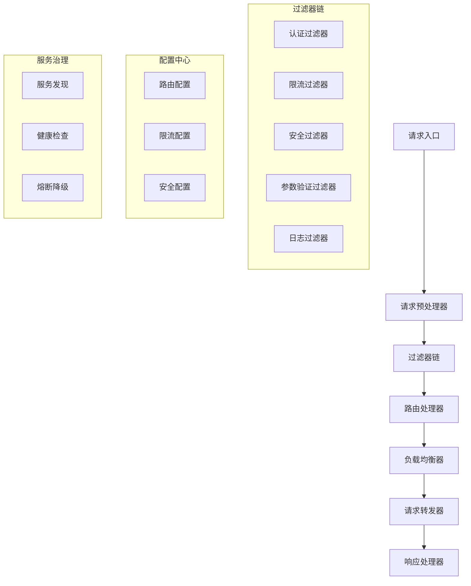
```mermaid
graph TD
    A[请求入口] --> B[请求预处理器]
    B --> C[过滤器链]
    C --> D[路由处理器]
    D --> E[负载均衡器]
    E --> F[请求转发器]
    F --> G[响应处理器]
    
    subgraph 过滤器链
        C1[认证过滤器]
        C2[限流过滤器]
        C3[安全过滤器]
        C4[参数验证过滤器]
        C5[日志过滤器]
    end
    
    subgraph 配置中心
        H1[路由配置]
        H2[限流配置]
        H3[安全配置]
    end
    
    subgraph 服务治理
        I1[服务发现]
        I2[健康检查]
        I3[熔断降级]
    end
```

### 2. 核心组件说明

#### 2.1 请求预处理器 (RequestPreProcessor)
- **职责**：
  * 请求解析和标准化
  * 请求上下文构建
  * 全局请求ID生成
  * 基础参数校验

- **关键实现**：
```java
public class RequestPreProcessor {
    // 请求上下文构建
    public RequestContext buildContext(HttpRequest request) {
        RequestContext context = new RequestContext();
        context.setRequestId(generateRequestId());
        context.setPath(request.getPath());
        context.setMethod(request.getMethod());
        context.setHeaders(request.getHeaders());
        context.setParameters(request.getParameters());
        return context;
    }
    
    // 请求参数验证
    public ValidationResult validateRequest(RequestContext context) {
        // 基础参数验证逻辑
    }
}
```

#### 2.2 过滤器链管理器 (FilterChainManager)
- **职责**：
  * 过滤器注册和排序
  * 过滤器链组装
  * 过滤器执行管理
  * 过滤器异常处理

- **关键实现**：
```java
public class FilterChainManager {
    private List<Filter> filters = new ArrayList<>();
    
    // 注册过滤器
    public void addFilter(Filter filter) {
        filters.add(filter);
        Collections.sort(filters); // 按照优先级排序
    }
    
    // 执行过滤器链
    public void doFilter(RequestContext context) {
        for (Filter filter : filters) {
            if (!filter.preHandle(context)) {
                return; // 中断过滤器链
            }
        }
        // 执行后续处理
    }
}
```

#### 2.3 路由处理器 (RouteHandler)
- **职责**：
  * 路由规则匹配
  * 服务实例选择
  * 路由策略执行
  * 灰度发布支持

- **关键实现**：
```java
public class RouteHandler {
    // 路由规则匹配
    public Route matchRoute(RequestContext context) {
        List<Route> routes = routeConfigService.getRoutes();
        return routes.stream()
                    .filter(route -> route.matches(context))
                    .findFirst()
                    .orElse(null);
    }
    
    // 灰度路由处理
    public Route handleGrayRelease(Route route, RequestContext context) {
        if (isGrayRequest(context)) {
            return route.getGrayRoute();
        }
        return route;
    }
}
```

#### 2.4 负载均衡器 (LoadBalancer)
- **职责**：
  * 服务实例选择
  * 负载策略执行
  * 实例权重计算
  * 健康检查集成

- **关键实现**：
```java
public class LoadBalancer {
    // 选择服务实例
    public ServiceInstance chooseInstance(List<ServiceInstance> instances) {
        // 根据负载均衡策略选择实例
        return loadBalanceStrategy.choose(instances);
    }
    
    // 更新实例权重
    public void updateWeight(ServiceInstance instance, HealthStatus status) {
        // 根据健康状态更新权重
    }
}
```

#### 2.5 请求转发器 (RequestForwarder)
- **职责**：
  * 请求转发执行
  * 协议转换处理
  * 超时控制
  * 重试机制

- **关键实现**：
```java
public class RequestForwarder {
    // 转发请求
    public Response forward(RequestContext context, Route route) {
        // 构建转发请求
        Request forwardRequest = buildForwardRequest(context, route);
        
        // 执行请求转发
        return retryTemplate.execute(context -> {
            return httpClient.execute(forwardRequest);
        });
    }
    
    // 重试策略
    private RetryTemplate createRetryTemplate() {
        RetryTemplate template = new RetryTemplate();
        template.setRetryPolicy(new SimpleRetryPolicy(3));
        template.setBackOffPolicy(new ExponentialBackOffPolicy());
        return template;
    }
}
```

### 4. 关键策略实现

#### 4.1 限流策略
```java
public interface RateLimitStrategy {
    boolean tryAcquire(RequestContext context);
}

// 令牌桶算法实现
public class TokenBucketLimiter implements RateLimitStrategy {
    private final RateLimiter rateLimiter;
    
    @Override
    public boolean tryAcquire(RequestContext context) {
        return rateLimiter.tryAcquire(1, 500, TimeUnit.MILLISECONDS);
    }
}

// 滑动窗口实现
public class SlidingWindowLimiter implements RateLimitStrategy {
    private final Cache<String, WindowCounter> cache;
    
    @Override
    public boolean tryAcquire(RequestContext context) {
        String key = context.getLimitKey();
        WindowCounter counter = cache.get(key);
        return counter.tryIncrement();
    }
}
```

#### 4.2 熔断策略
```java
public class CircuitBreaker {
    private final AtomicReference<State> state = new AtomicReference<>(State.CLOSED);
    private final SlidingWindowMetrics metrics;
    
    public boolean allowRequest() {
        State currentState = state.get();
        switch (currentState) {
            case CLOSED:
                return true;
            case OPEN:
                return false;
            case HALF_OPEN:
                return metrics.getErrorRate() < threshold;
        }
    }
    
    public void recordSuccess() {
        metrics.recordSuccess();
        tryTransitState();
    }
    
    public void recordError() {
        metrics.recordError();
        tryTransitState();
    }
}
```

#### 4.3 负载均衡策略
```java
public interface LoadBalanceStrategy {
    ServiceInstance choose(List<ServiceInstance> instances);
}

// 加权轮询实现
public class WeightedRoundRobin implements LoadBalanceStrategy {
    private final AtomicInteger position = new AtomicInteger(0);
    
    @Override
    public ServiceInstance choose(List<ServiceInstance> instances) {
        // 基于权重的轮询选择逻辑
    }
}

// 最小连接数实现
public class LeastConnection implements LoadBalanceStrategy {
    @Override
    public ServiceInstance choose(List<ServiceInstance> instances) {
        // 选择连接数最小的实例
    }
}
```

### 3. 关键处理流程

#### 3.1 请求处理主流程
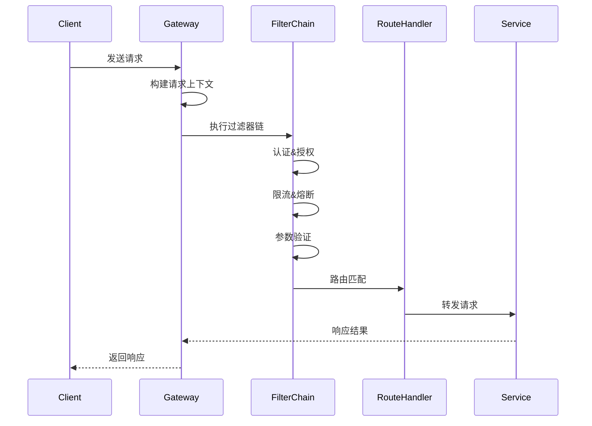
```mermaid
sequenceDiagram
    participant C as Client
    participant G as Gateway
    participant F as FilterChain
    participant R as RouteHandler
    participant S as Service

    C->>G: 发送请求
    G->>G: 构建请求上下文
    G->>F: 执行过滤器链
    F->>F: 认证&授权
    F->>F: 限流&熔断
    F->>F: 参数验证
    F->>R: 路由匹配
    R->>S: 转发请求
    S-->>G: 响应结果
    G-->>C: 返回响应
```

#### 3.2 限流处理流程
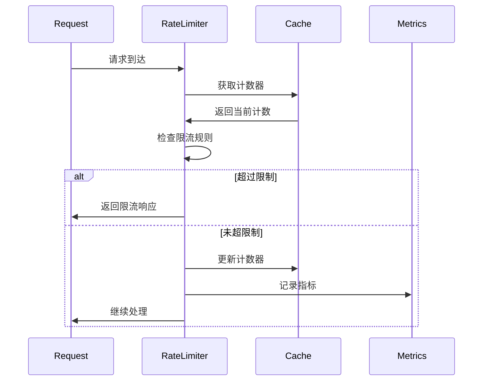
```mermaid
sequenceDiagram
    participant R as Request
    participant L as RateLimiter
    participant C as Cache
    participant M as Metrics

    R->>L: 请求到达
    L->>C: 获取计数器
    C->>L: 返回当前计数
    L->>L: 检查限流规则
    alt 超过限制
        L->>R: 返回限流响应
    else 未超限制
        L->>C: 更新计数器
        L->>M: 记录指标
        L->>R: 继续处理
    end
```

#### 3.3 降级处理流程
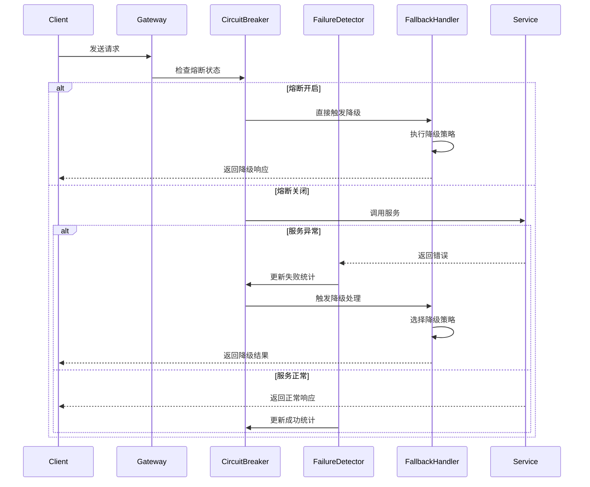
```mermaid
sequenceDiagram
    participant C as Client
    participant G as Gateway
    participant CB as CircuitBreaker
    participant FD as FailureDetector
    participant FH as FallbackHandler
    participant S as Service

    C->>G: 发送请求
    G->>CB: 检查熔断状态
    
    alt 熔断开启
        CB->>FH: 直接触发降级
        FH->>FH: 执行降级策略
        FH-->>C: 返回降级响应
    else 熔断关闭
        CB->>S: 调用服务
        
        alt 服务异常
            S-->>FD: 返回错误
            FD->>CB: 更新失败统计
            CB->>FH: 触发降级处理
            FH->>FH: 选择降级策略
            FH-->>C: 返回降级结果
        else 服务正常
            S-->>C: 返回正常响应
            FD->>CB: 更新成功统计
        end
    end
```

#### 3.4 灰度发布流程
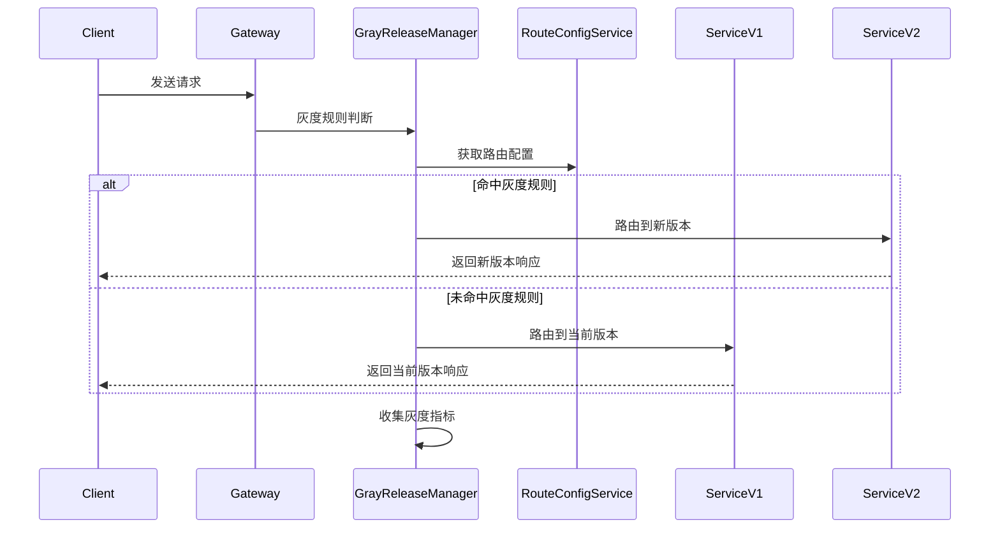
```mermaid
sequenceDiagram
    participant C as Client
    participant G as Gateway
    participant GR as GrayReleaseManager
    participant RC as RouteConfigService
    participant V1 as ServiceV1
    participant V2 as ServiceV2

    C->>G: 发送请求
    G->>GR: 灰度规则判断
    GR->>RC: 获取路由配置
    
    alt 命中灰度规则
        GR->>V2: 路由到新版本
        V2-->>C: 返回新版本响应
    else 未命中灰度规则
        GR->>V1: 路由到当前版本
        V1-->>C: 返回当前版本响应
    end

    GR->>GR: 收集灰度指标
```

#### 3.5 配置更新流程
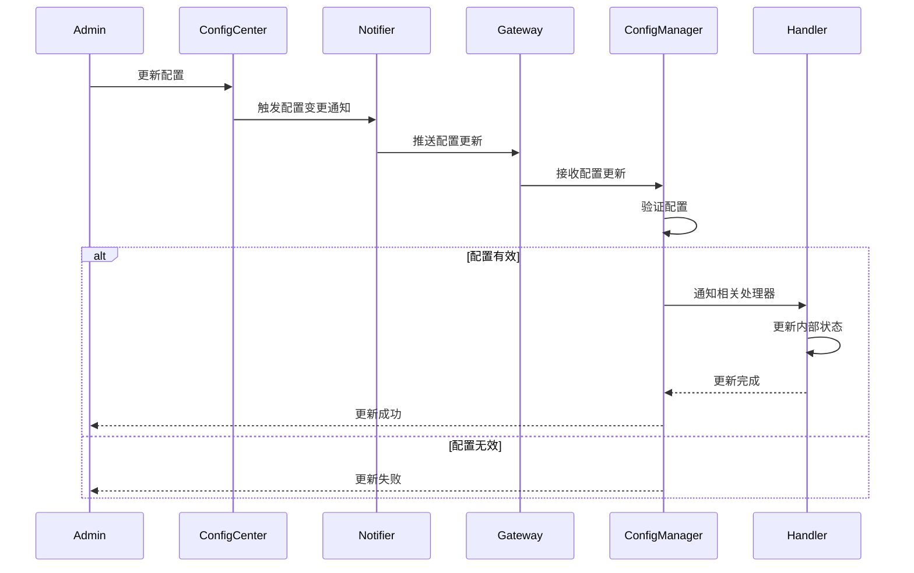
```mermaid
sequenceDiagram
    participant A as Admin
    participant CC as ConfigCenter
    participant N as Notifier
    participant G as Gateway
    participant CM as ConfigManager
    participant H as Handler

    A->>CC: 更新配置
    CC->>N: 触发配置变更通知
    N->>G: 推送配置更新
    G->>CM: 接收配置更新
    CM->>CM: 验证配置
    
    alt 配置有效
        CM->>H: 通知相关处理器
        H->>H: 更新内部状态
        H-->>CM: 更新完成
        CM-->>A: 更新成功
    else 配置无效
        CM-->>A: 更新失败
    end
```


#### 3.6 动态更新流程
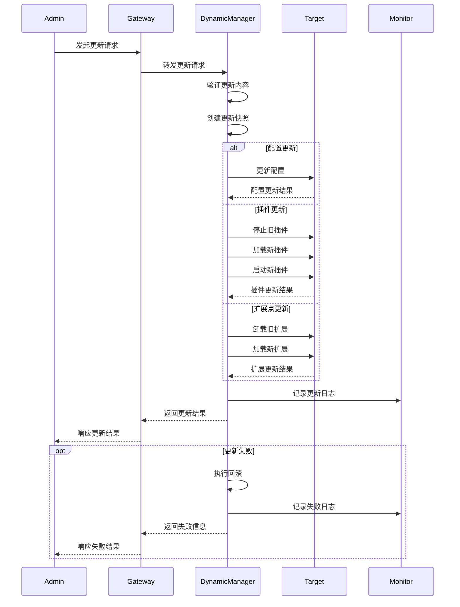
```mermaid
sequenceDiagram
    participant A as Admin
    participant G as Gateway
    participant D as DynamicManager
    participant T as Target
    participant M as Monitor

    A->>G: 发起更新请求
    G->>D: 转发更新请求
    
    D->>D: 验证更新内容
    D->>D: 创建更新快照
    
    alt 配置更新
        D->>T: 更新配置
        T-->>D: 配置更新结果
    else 插件更新
        D->>T: 停止旧插件
        D->>T: 加载新插件
        D->>T: 启动新插件
        T-->>D: 插件更新结果
    else 扩展点更新
        D->>T: 卸载旧扩展
        D->>T: 加载新扩展
        T-->>D: 扩展更新结果
    end
    
    D->>M: 记录更新日志
    D-->>G: 返回更新结果
    G-->>A: 响应更新结果

    opt 更新失败
        D->>D: 执行回滚
        D->>M: 记录失败日志
        D-->>G: 返回失败信息
        G-->>A: 响应失败结果
    end
```

#### 3.7 插件生命周期流程
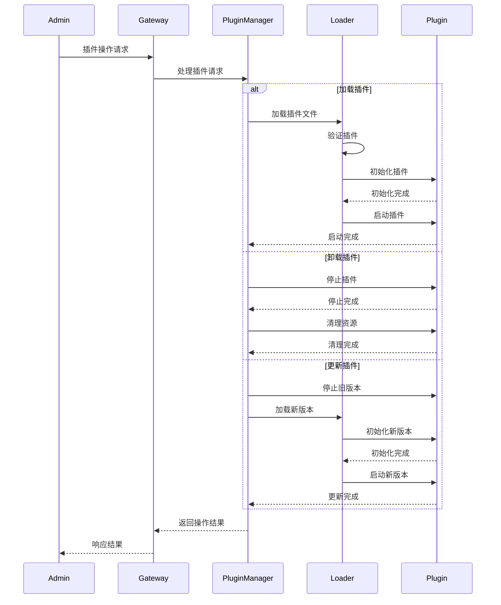
```mermaid
sequenceDiagram
    participant A as Admin
    participant G as Gateway
    participant P as PluginManager
    participant L as Loader
    participant C as Plugin

    A->>G: 插件操作请求
    G->>P: 处理插件请求
    
    alt 加载插件
        P->>L: 加载插件文件
        L->>L: 验证插件
        L->>C: 初始化插件
        C-->>L: 初始化完成
        L->>C: 启动插件
        C-->>P: 启动完成
    else 卸载插件
        P->>C: 停止插件
        C-->>P: 停止完成
        P->>C: 清理资源
        C-->>P: 清理完成
    else 更新插件
        P->>C: 停止旧版本
        P->>L: 加载新版本
        L->>C: 初始化新版本
        C-->>L: 初始化完成
        L->>C: 启动新版本
        C-->>P: 更新完成
    end
    
    P-->>G: 返回操作结果
    G-->>A: 响应结果
```

#### 3.8 扩展点动态更新流程
```mermaid
sequenceDiagram
    participant A as Admin
    participant G as Gateway
    participant E as ExtensionManager
    participant R as Registry
    participant X as Extension

    A->>G: 扩展点更新请求
    G->>E: 处理扩展更新
    
    E->>R: 获取当前扩展
    R-->>E: 返回扩展信息
    
    E->>X: 停止当前扩展
    X-->>E: 停止完成
    
    E->>X: 加载新扩展
    X-->>E: 加载完成
    
    E->>R: 更新注册信息
    R-->>E: 更新完成
    
    E-->>G: 返回更新结果
    G-->>A: 响应结果

    opt 更新失败
        E->>E: 回滚到旧版本
        E->>R: 恢复注册信息
        E-->>G: 返回失败信息
        G-->>A: 响应失败结果
    end

    #### 3.9 服务注册发现流程
```mermaid
sequenceDiagram
    participant S as Service
    participant R as Registry
    participant G as Gateway
    participant HC as HealthChecker
    participant RT as RouteTable

    S->>R: 服务注册
    R->>G: 推送服务变更
    G->>RT: 更新路由表
    
    loop 健康检查
        HC->>S: 发送健康检查
        alt 服务健康
            S-->>HC: 返回健康状态
            HC->>RT: 保持路由可用
        else 服务异常
            S-->>HC: 检查失败/超时
            HC->>RT: 移除不健康路由
            HC->>R: 更新服务状态
        end
    end

    opt 服务下线
        S->>R: 注销服务
        R->>G: 推送服务下线
        G->>RT: 清理路由记录
    end
```

#### 3.10 网关启动初始化流程
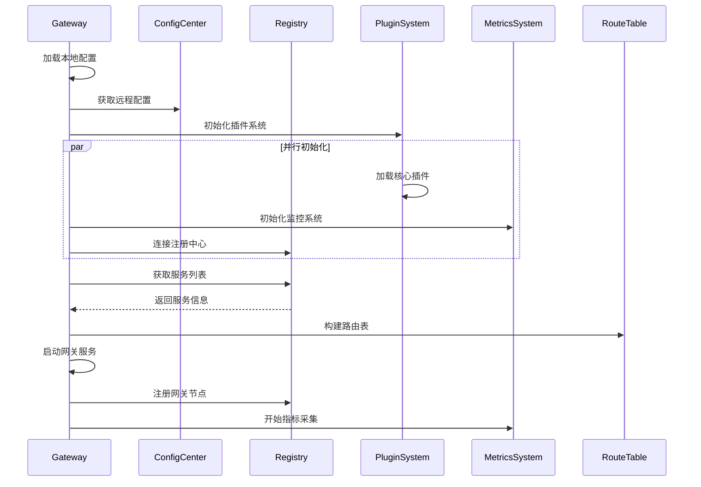
```mermaid
sequenceDiagram
    participant G as Gateway
    participant C as ConfigCenter
    participant R as Registry
    participant P as PluginSystem
    participant M as MetricsSystem
    participant RT as RouteTable

    G->>G: 加载本地配置
    G->>C: 获取远程配置
    G->>P: 初始化插件系统
    
    par 并行初始化
        P->>P: 加载核心插件
        G->>M: 初始化监控系统
        G->>R: 连接注册中心
    end

    G->>R: 获取服务列表
    R-->>G: 返回服务信息
    G->>RT: 构建路由表

    G->>G: 启动网关服务
    G->>R: 注册网关节点
    G->>M: 开始指标采集
```

#### 3.11 监控告警流程
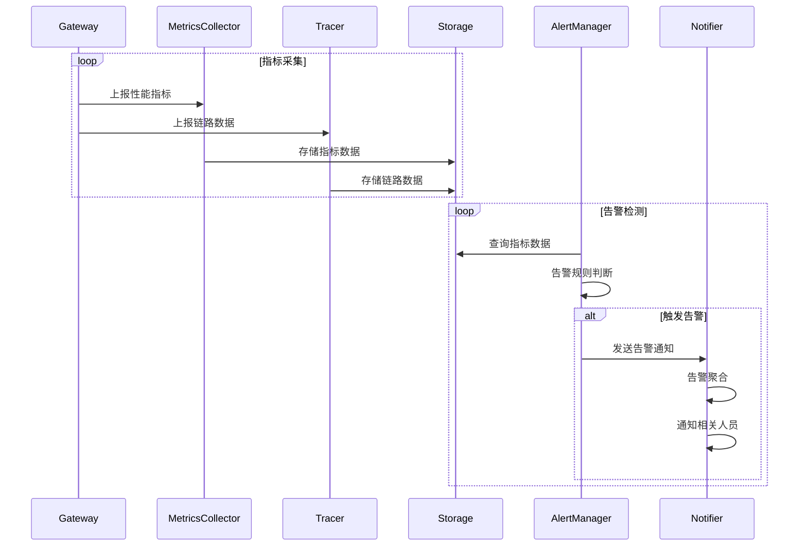
```mermaid
sequenceDiagram
    participant G as Gateway
    participant M as MetricsCollector
    participant T as Tracer
    participant S as Storage
    participant A as AlertManager
    participant N as Notifier

    loop 指标采集
        G->>M: 上报性能指标
        G->>T: 上报链路数据
        M->>S: 存储指标数据
        T->>S: 存储链路数据
    end

    loop 告警检测
        A->>S: 查询指标数据
        A->>A: 告警规则判断
        
        alt 触发告警
            A->>N: 发送告警通知
            N->>N: 告警聚合
            N->>N: 通知相关人员
        end
    end
```

#### 3.12 日志追踪流程
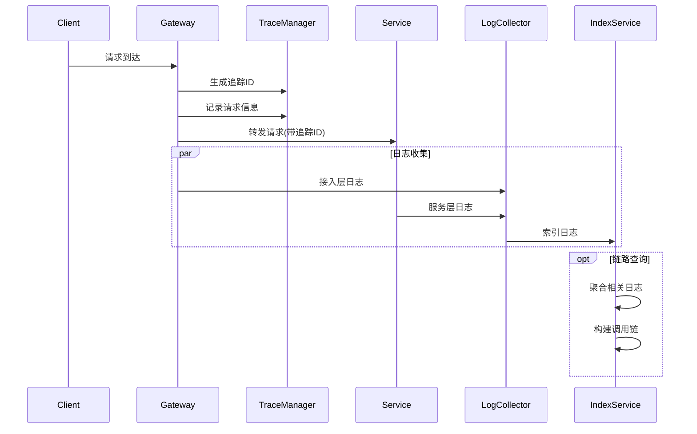
```mermaid
sequenceDiagram
    participant C as Client
    participant G as Gateway
    participant T as TraceManager
    participant S as Service
    participant L as LogCollector
    participant I as IndexService

    C->>G: 请求到达
    G->>T: 生成追踪ID
    G->>T: 记录请求信息
    G->>S: 转发请求(带追踪ID)
    
    par 日志收集
        G->>L: 接入层日志
        S->>L: 服务层日志
        L->>I: 索引日志
    end

    opt 链路查询
        I->>I: 聚合相关日志
        I->>I: 构建调用链
    end
```

#### 3.13 网关优雅下线流程
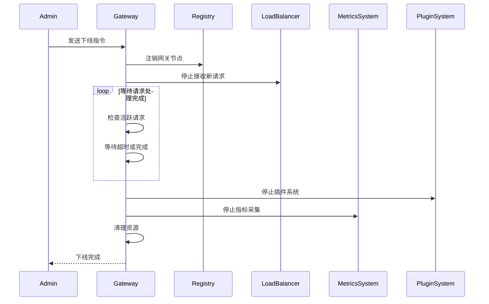
```mermaid
sequenceDiagram
    participant A as Admin
    participant G as Gateway
    participant R as Registry
    participant LB as LoadBalancer
    participant M as MetricsSystem
    participant P as PluginSystem

    A->>G: 发送下线指令
    G->>R: 注销网关节点
    G->>LB: 停止接收新请求

    loop 等待请求处理完成
        G->>G: 检查活跃请求
        G->>G: 等待超时或完成
    end

    G->>P: 停止插件系统
    G->>M: 停止指标采集
    G->>G: 清理资源
    G-->>A: 下线完成
```

## 类图设计

### 1. 核心类图


```mermaid
classDiagram
    %% 核心类
    class Gateway {
        -RequestPreProcessor preProcessor
        -FilterChainManager filterChainManager
        -RouteHandler routeHandler
        -LoadBalancer loadBalancer
        -RequestForwarder requestForwarder
        -DynamicCapabilityManager dynamicManager
        +handleRequest(HttpRequest request) Response
        +initialize() void
        +shutdown() void
        +handleDynamicUpdate(UpdateEvent event) void
        +reloadPlugin(String pluginId) void
        +updateExtension(String extensionId) void
    }

    %% 动态能力管理类
    class DynamicCapabilityManager {
        -ExtensionManager extensionManager
        -PluginManager pluginManager
        -DynamicUpdateManager updateManager
        +initialize() void
        +handleUpdate(UpdateEvent event) void
        +reload(String resourceId) void
        +rollback(String resourceId) void
    }

    %% 扩展管理类
    class ExtensionManager {
        -ExtensionRegistry registry
        -ExtensionLoader loader
        -ExtensionEventPublisher publisher
        +loadExtension(String path) void
        +unloadExtension(String id) void
        +updateExtension(String id, Config config) void
        +getExtension(String id) Extension
    }

    %% 插件管理类
    class PluginManager {
        -PluginRegistry registry
        -PluginLoader loader
        -PluginLifecycleManager lifecycleManager
        +loadPlugin(String path) void
        +unloadPlugin(String id) void
        +enablePlugin(String id) void
        +disablePlugin(String id) void
    }

    %% 动态更新管理类
    class DynamicUpdateManager {
        -ConfigCenter configCenter
        -UpdateEventPublisher publisher
        -UpdateValidator validator
        +updateConfig(String id, Config config) void
        +updateImplementation(String id, Object impl) void
        +rollback(String id) void
    }

    %% 请求处理相关类
    class RequestPreProcessor {
        -IdGenerator idGenerator
        -RequestValidator validator
        +buildContext(HttpRequest request) RequestContext
        +validateRequest(RequestContext context) ValidationResult
        +generateRequestId() String
        +standardizeRequest(HttpRequest request) void
    }

    class FilterChainManager {
        -List<Filter> filters
        -FilterRegistry registry
        +addFilter(Filter filter) void
        +removeFilter(String filterId) void
        +getFilters() List<Filter>
        +doFilter(RequestContext context) void
        +sortFilters() void
        +getFilterByType(FilterType type) Filter
    }

    class RouteHandler {
        -RouteConfigService routeConfigService
        -RouteCache routeCache
        -GrayReleaseManager grayManager
        +matchRoute(RequestContext context) Route
        +handleGrayRelease(Route route, RequestContext context) Route
        +updateRoutes(List<Route> routes) void
        +refreshRouteCache() void
        +getRouteMetrics() RouteMetrics
    }

    class LoadBalancer {
        -LoadBalanceStrategy strategy
        -HealthChecker healthChecker
        -MetricsCollector metricsCollector
        +chooseInstance(List<ServiceInstance> instances) ServiceInstance
        +updateWeight(ServiceInstance instance, HealthStatus status) void
        +getInstanceStatus(ServiceInstance instance) HealthStatus
        +collectMetrics(ServiceInstance instance) Metrics
    }

    class RequestForwarder {
        -HttpClient httpClient
        -RetryTemplate retryTemplate
        -TimeoutManager timeoutManager
        +forward(RequestContext context, Route route) Response
        +buildForwardRequest(RequestContext context, Route route) Request
        +handleResponse(Response response) Response
        +handleError(Throwable error) Response
    }

    %% 过滤器相关类
    class Filter {
        <<interface>>
        +getOrder() int
        +preHandle(RequestContext context) boolean
        +postHandle(RequestContext context) void
        +afterCompletion(RequestContext context) void
    }

    class DynamicFilter {
        <<interface>>
        +reload(FilterConfig config) void
        +getVersion() String
        +getMetadata() Map
    }

    class AuthenticationFilter {
        -TokenValidator tokenValidator
        -AuthenticationManager authManager
        +preHandle(RequestContext context) boolean
        +validateToken(String token) boolean
        +handleAuthFailure(RequestContext context) Response
    }

    class RateLimitFilter {
        -RateLimitStrategy rateLimitStrategy
        -RateLimitConfig limitConfig
        +preHandle(RequestContext context) boolean
        +checkLimit(RequestContext context) boolean
        +handleLimitExceeded(RequestContext context) Response
    }

    %% 关系定义
    Gateway --> DynamicCapabilityManager
    Gateway --> RequestPreProcessor
    Gateway --> FilterChainManager
    Gateway --> RouteHandler
    Gateway --> LoadBalancer
    Gateway --> RequestForwarder

    DynamicCapabilityManager --> ExtensionManager
    DynamicCapabilityManager --> PluginManager
    DynamicCapabilityManager --> DynamicUpdateManager

    FilterChainManager --> Filter
    Filter <|.. DynamicFilter
    DynamicFilter <|.. AuthenticationFilter
    DynamicFilter <|.. RateLimitFilter

    RouteHandler --> RouteConfigService
    LoadBalancer --> LoadBalanceStrategy
    RateLimitFilter --> RateLimitStrategy

    %% 动态能力关系
    ExtensionManager --> Filter
    PluginManager --> Filter
    DynamicUpdateManager --> RouteConfigService
    DynamicUpdateManager --> LoadBalanceStrategy
    DynamicUpdateManager --> RateLimitStrategy
```

### 2. 核心类职责说明

#### 2.1 基础类

##### Gateway
- 网关入口类，协调各组件工作
- 处理请求生命周期
- 管理组件初始化和销毁

##### RequestContext
- 请求上下文，贯穿整个请求处理过程
- 存储请求相关的所有信息
- 提供属性存取能力

#### 2.2 处理器类

##### RequestPreProcessor
- 请求预处理器
- 构建请求上下文
- 请求验证和标准化

##### FilterChainManager
- 过滤器链管理
- 过滤器注册和排序
- 过滤器链执行

##### RouteHandler
- 路由规则处理
- 灰度发布支持
- 路由缓存管理

##### LoadBalancer
- 负载均衡处理
- 服务实例选择
- 实例权重管理

##### RequestForwarder
- 请求转发处理
- 重试机制
- 响应处理

#### 2.3 策略类

##### RateLimitStrategy
- 限流策略接口
- 支持多种限流算法
- 限流判断和计数

##### LoadBalanceStrategy
- 负载均衡策略接口
- 实例选择算法
- 权重计算逻辑

#### 2.4 配置类

##### RouteConfigService
- 路由配置管理
- 配置更新和验证
- 配置持久化

##### Route
- 路由规则实体
- 路由匹配逻辑
- 路由元数据管理

#### 2.5 监控类

##### MetricsCollector
- 指标收集
- 数据聚合
- 监控报告生成

#### 2.6 新增类

##### ResponseProcessor
- 响应数据转换
- 响应格式标准化
- 错误响应处理

##### ErrorHandler
- 统一异常处理
- 错误码管理
- 降级处理

##### RateLimitCounter
- 限流计数管理
- 时间窗口控制
- 计数器重置

##### LimitRuleManager
- 限流规则管理
- 规则动态更新
- 规则验证

##### CircuitBreakerFilter
- 熔断状态检查
- 失败处理
- 结果记录

##### FailureDetector
- 失败判定
- 失败分析
- 统计更新

##### StateManager
- 状态机管理
- 状态转换
- 强制状态切换

##### FallbackHandler
- 降级处理
- 降级注册
- 降级链执行

##### CacheManager
- 本地缓存管理
- 分布式缓存管理
- 缓存生命周期

## 插件机制设计

### 1. 插件体系架构
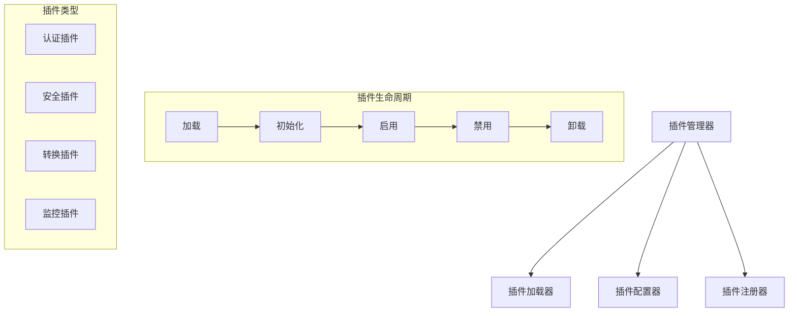
```mermaid
graph TD
    PM[插件管理器] --> PL[插件加载器]
    PM --> PC[插件配置器]
    PM --> PR[插件注册器]
    
    subgraph 插件生命周期
        L[加载] --> I[初始化]
        I --> E[启用]
        E --> D[禁用]
        D --> U[卸载]
    end
    
    subgraph 插件类型
        A[认证插件]
        S[安全插件]
        T[转换插件]
        M[监控插件]
    end
```

### 2. 核心接口设计

#### 2.1 插件接口
```java
public interface Plugin {
    // 插件初始化
    void init(PluginConfig config);
    
    // 请求处理
    void process(RequestContext context);
    
    // 插件销毁
    void destroy();
    
    // 获取插件信息
    PluginInfo getPluginInfo();
    
    // 获取插件状态
    PluginStatus getStatus();
}
```

#### 2.2 插件管理器
```java
public class PluginManager {
    private Map<String, Plugin> plugins;
    private PluginLoader loader;
    private PluginConfigManager configManager;
    
    // 加载插件
    public void loadPlugin(String pluginPath) {
        Plugin plugin = loader.load(pluginPath);
        registerPlugin(plugin);
    }
    
    // 启用插件
    public void enablePlugin(String pluginId) {
        Plugin plugin = plugins.get(pluginId);
        plugin.init(configManager.getConfig(pluginId));
    }
    
    // 禁用插件
    public void disablePlugin(String pluginId) {
        Plugin plugin = plugins.get(pluginId);
        plugin.destroy();
    }
}
```

### 3. 插件配置管理
```yaml
plugins:
  auth-plugin:
    enabled: true
    order: 1
    config:
      timeout: 1000
      retries: 3
      
  rate-limit-plugin:
    enabled: true
    order: 2
    config:
      limit: 100
      window: 60
```

### 4. 插件扩展点设计
```java
public interface PluginPoint {
    // 前置处理
    boolean preHandle(RequestContext context);
    
    // 后置处理
    void postHandle(RequestContext context);
    
    // 完成处理
    void afterCompletion(RequestContext context);
}
```

## 动态扩展机制

### 1. 扩展点设计
```java
public interface ExtensionPoint {
    // 扩展点唯一标识
    String getExtensionId();
    
    // 扩展点版本
    String getVersion();
    
    // 执行扩展逻辑
    Object execute(ExtensionContext context);
}
```

### 2. 扩展加载机制
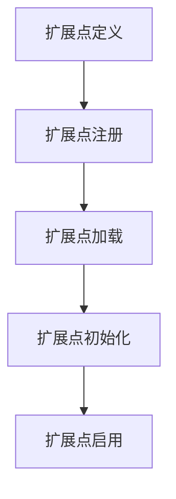
```mermaid
graph TD
    A[扩展点定义] --> B[扩展点注册]
    B --> C[扩展点加载]
    C --> D[扩展点初始化]
    D --> E[扩展点启用]
```

### 3. SPI扩展实现
```java
public class ExtensionLoader {
    private static Map<Class<?>, Object> extensionInstances = new ConcurrentHashMap<>();
    
    // 加载扩展实现
    public static <T> T getExtension(Class<T> type) {
        return ServiceLoader.load(type)
                          .findFirst()
                          .orElseThrow();
    }
    
    // 获取所有扩展实现
    public static <T> List<T> getAllExtensions(Class<T> type) {
        return ServiceLoader.load(type)
                          .stream()
                          .map(ServiceLoader.Provider::get)
                          .collect(Collectors.toList());
    }
}
```

### 4. 动态更新机制
```java
public class DynamicUpdateManager {
    private ConfigCenter configCenter;
    private ExtensionRegistry registry;
    
    // 动态更新配置
    public void updateConfig(String extensionId, Config config) {
        Extension extension = registry.getExtension(extensionId);
        extension.reload(config);
    }
    
    // 动态更新扩展实现
    public void updateExtension(String extensionId, ExtensionImpl impl) {
        registry.registerExtension(extensionId, impl);
        notifyExtensionUpdate(extensionId);
    }
}
```

### 5. 扩展示例

#### 5.1 自定义路由策略
```java
@Extension("custom-route")
public class CustomRouteStrategy implements RouteStrategy {
    @Override
    public Route select(List<Route> routes, RequestContext context) {
        // 自定义路由逻辑
    }
}
```

#### 5.2 自定义负载均衡
```java
@Extension("custom-loadbalancer")
public class CustomLoadBalancer implements LoadBalanceStrategy {
    @Override
    public ServiceInstance choose(List<ServiceInstance> instances) {
        // 自定义负载均衡逻辑
    }
}
```



``` mermaid
classDiagram

    %% 1. 核心接口定义
    class Gateway {
        <<Interface>>
        +handle(Request): Response
        +init()
        +shutdown()
    }

    class Filter {
        <<Interface>>
        +doFilter(Context, FilterChain)
    }

    class Plugin {
        <<Interface>>
        +init()
        +start()
        +stop()
        +destroy()
    }

    %% 2. 核心实现类
    class GatewayServer {
        -FilterChainManager filterChainManager
        -RouteManager routeManager
        -PluginManager pluginManager
        -ConfigManager configManager
        -MetricsManager metricsManager
        +start()
        +stop()
    }

    %% 3. 请求处理核心
    class Context {
        -String traceId
        -Request request
        -Response response
        -Map~String,Object~ attributes
        +getAttribute(String)
        +setAttribute(String, Object)
    }

    class FilterChainManager {
        -List~Filter~ globalFilters
        -Map~String,Filter~ routeFilters
        +buildChain(Context): FilterChain
        +addFilter(Filter)
        +removeFilter(String)
    }

    %% 4. 路由管理
    class RouteManager {
        -RouteRegistry registry
        -RoutePredicateFactory predicateFactory
        -LoadBalancer loadBalancer
        +match(Context): Route
        +updateRoutes(List~Route~)
    }

    class Route {
        -String id
        -List~Predicate~ predicates
        -List~Filter~ filters
        -URI uri
        -Map~String,Object~ metadata
    }

    %% 5. 保护机制
    class ProtectionFilter {
        -RateLimiter rateLimiter
        -CircuitBreaker circuitBreaker
        -FallbackManager fallbackManager
        +doFilter(Context, FilterChain)
    }

    class RateLimiter {
        -Cache counter
        -RateLimitConfig config
        +isAllowed(Context): boolean
    }

    class CircuitBreaker {
        -FailureDetector detector
        -CircuitBreakerState state
        +allowRequest(): boolean
        +recordSuccess()
        +recordFailure()
    }

    %% 6. 插件管理
    class PluginManager {
        -PluginLoader loader
        -Map~String,Plugin~ plugins
        +loadPlugin(PluginConfig)
        +unloadPlugin(String)
        +getPlugin(String): Plugin
    }

    %% 7. 配置管理
    class ConfigManager {
        -ConfigCenter configCenter
        -List~ConfigListener~ listeners
        +updateConfig(Config)
        +addListener(ConfigListener)
        +removeListener(ConfigListener)
    }

    %% 8. 服务发现
    class ServiceRegistry {
        -HealthChecker healthChecker
        -ServiceEventListener listener
        +register(ServiceInstance)
        +unregister(String)
        +getServices(): List~ServiceInstance~
    }

    %% 9. 监控追踪
    class MetricsManager {
        -MetricsCollector collector
        -TraceManager traceManager
        -AlertManager alertManager
        +collectMetrics(Metrics)
        +createTrace(): String
        +checkAlerts()
    }

    %% 10. 灰度发布
    class GrayReleaseManager {
        -RuleEngine ruleEngine
        -MetricsCollector collector
        +matchRule(Context): boolean
        +updateRules(List~Rule~)
    }

    %% 关系定义
    GatewayServer ..|> Gateway
    GatewayServer --> FilterChainManager
    GatewayServer --> RouteManager
    GatewayServer --> PluginManager
    GatewayServer --> ConfigManager
    GatewayServer --> MetricsManager
    GatewayServer --> ServiceRegistry
    GatewayServer --> GrayReleaseManager

    FilterChainManager --> Filter
    PluginManager --> Plugin
    RouteManager --> Route
    
    ProtectionFilter ..|> Filter
    ProtectionFilter --> RateLimiter
    ProtectionFilter --> CircuitBreaker

    RouteManager --> ServiceRegistry
    MetricsManager --> ConfigManager
    GrayReleaseManager --> MetricsManager
``` 


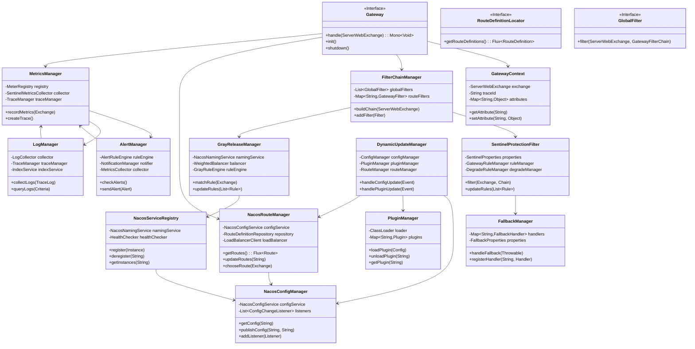
``` mermaid
classDiagram

    %% 1. 核心接口定义
    class Gateway {
        <<Interface>>
        +handle(ServerWebExchange): Mono~Void~
        +init()
        +shutdown()
    }

    class RouteDefinitionLocator {
        <<Interface>>
        +getRouteDefinitions(): Flux~RouteDefinition~
    }

    class GlobalFilter {
        <<Interface>>
        +filter(ServerWebExchange, GatewayFilterChain)
    }

    %% 2. 请求处理核心
    class GatewayContext {
        -ServerWebExchange exchange
        -String traceId
        -Map~String,Object~ attributes
        +getAttribute(String)
        +setAttribute(String, Object)
    }

    class FilterChainManager {
        -List~GlobalFilter~ globalFilters
        -Map~String,GatewayFilter~ routeFilters
        +buildChain(ServerWebExchange)
        +addFilter(Filter)
    }

    %% 3. 路由管理
    class NacosRouteManager {
        -NacosConfigService configService
        -RouteDefinitionRepository repository
        -LoadBalancerClient loadBalancer
        +getRoutes(): Flux~Route~
        +updateRoutes(String)
        +chooseRoute(Exchange)
    }

    %% 4. 限流熔断
    class SentinelProtectionFilter {
        -SentinelProperties properties
        -GatewayRuleManager ruleManager
        -DegradeRuleManager degradeManager
        +filter(Exchange, Chain)
        +updateRules(List~Rule~)
    }

    %% 5. 降级处理
    class FallbackManager {
        -Map~String,FallbackHandler~ handlers
        -FallbackProperties properties
        +handleFallback(Throwable)
        +registerHandler(String, Handler)
    }

    %% 6. 灰度发布
    class GrayReleaseManager {
        -NacosNamingService namingService
        -WeightedBalancer balancer
        -GrayRuleEngine ruleEngine
        +matchRule(Exchange)
        +updateRules(List~Rule~)
    }

    %% 7. 配置管理
    class NacosConfigManager {
        -NacosConfigService configService
        -List~ConfigChangeListener~ listeners
        +getConfig(String)
        +publishConfig(String, String)
        +addListener(Listener)
    }

    %% 8. 插件系统
    class PluginManager {
        -ClassLoader loader
        -Map~String,Plugin~ plugins
        +loadPlugin(Config)
        +unloadPlugin(String)
        +getPlugin(String)
    }

    %% 9. 服务注册发现
    class NacosServiceRegistry {
        -NacosNamingService namingService
        -HealthChecker healthChecker
        +register(Instance)
        +deregister(String)
        +getInstances(String)
    }

    %% 10. 监控追踪
    class MetricsManager {
        -MeterRegistry registry
        -SentinelMetricsCollector collector
        -TraceManager traceManager
        +recordMetrics(Exchange)
        +createTrace()
    }

    %% 11. 日志管理
    class LogManager {
        -LogCollector collector
        -TraceManager traceManager
        -IndexService indexService
        +collectLogs(TraceLog)
        +queryLogs(Criteria)
    }

    %% 12. 告警系统
    class AlertManager {
        -AlertRuleEngine ruleEngine
        -NotificationManager notifier
        -MetricsCollector collector
        +checkAlerts()
        +sendAlert(Alert)
    }

    %% 13. 动态更新
    class DynamicUpdateManager {
        -ConfigManager configManager
        -PluginManager pluginManager
        -RouteManager routeManager
        +handleConfigUpdate(Event)
        +handlePluginUpdate(Event)
    }

    %% 关系定义
    Gateway --> GatewayContext
    Gateway --> FilterChainManager
    Gateway --> NacosRouteManager
    Gateway --> MetricsManager

    FilterChainManager --> SentinelProtectionFilter
    FilterChainManager --> GrayReleaseManager

    SentinelProtectionFilter --> FallbackManager
    GrayReleaseManager --> NacosServiceRegistry

    NacosRouteManager --> NacosConfigManager
    NacosServiceRegistry --> NacosConfigManager

    MetricsManager --> AlertManager
    MetricsManager --> LogManager

    DynamicUpdateManager --> NacosConfigManager
    DynamicUpdateManager --> PluginManager
    DynamicUpdateManager --> NacosRouteManager

    AlertManager --> MetricsManager
    LogManager --> MetricsManager

```
## NEW - 2

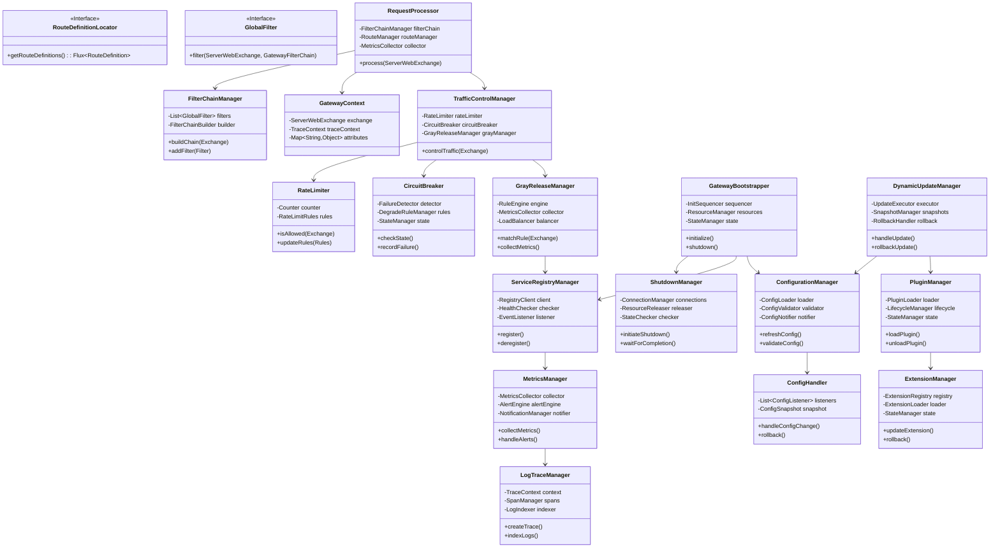
``` mermaid
classDiagram

    %% 1. 核心接口
    class RouteDefinitionLocator {
        <<Interface>>
        +getRouteDefinitions(): Flux~RouteDefinition~
    }

    class GlobalFilter {
        <<Interface>>
        +filter(ServerWebExchange, GatewayFilterChain)
    }

    %% 2. 请求处理核心
    class RequestProcessor {
        -FilterChainManager filterChain
        -RouteManager routeManager
        -MetricsCollector collector
        +process(ServerWebExchange)
    }

    class FilterChainManager {
        -List~GlobalFilter~ filters
        -FilterChainBuilder builder
        +buildChain(Exchange)
        +addFilter(Filter)
    }

    class GatewayContext {
        -ServerWebExchange exchange
        -TraceContext traceContext
        -Map~String,Object~ attributes
    }

    %% 3. 流量控制
    class TrafficControlManager {
        -RateLimiter rateLimiter
        -CircuitBreaker circuitBreaker
        -GrayReleaseManager grayManager
        +controlTraffic(Exchange)
    }

    class RateLimiter {
        -Counter counter
        -RateLimitRules rules
        +isAllowed(Exchange)
        +updateRules(Rules)
    }

    class CircuitBreaker {
        -FailureDetector detector
        -DegradeRuleManager rules
        -StateManager state
        +checkState()
        +recordFailure()
    }

    class GrayReleaseManager {
        -RuleEngine engine
        -MetricsCollector collector
        -LoadBalancer balancer
        +matchRule(Exchange)
        +collectMetrics()
    }

    %% 4. 配置管理
    class ConfigurationManager {
        -ConfigLoader loader
        -ConfigValidator validator
        -ConfigNotifier notifier
        +refreshConfig()
        +validateConfig()
    }

    class ConfigHandler {
        -List~ConfigListener~ listeners
        -ConfigSnapshot snapshot
        +handleConfigChange()
        +rollback()
    }

    %% 5. 插件系统
    class PluginManager {
        -PluginLoader loader
        -LifecycleManager lifecycle
        -StateManager state
        +loadPlugin()
        +unloadPlugin()
    }

    class ExtensionManager {
        -ExtensionRegistry registry
        -ExtensionLoader loader
        -StateManager state
        +updateExtension()
        +rollback()
    }

    %% 6. 服务治理
    class ServiceRegistryManager {
        -RegistryClient client
        -HealthChecker checker
        -EventListener listener
        +register()
        +deregister()
    }

    %% 7. 启动关闭
    class GatewayBootstrapper {
        -InitSequencer sequencer
        -ResourceManager resources
        -StateManager state
        +initialize()
        +shutdown()
    }

    class ShutdownManager {
        -ConnectionManager connections
        -ResourceReleaser releaser
        -StateChecker checker
        +initiateShutdown()
        +waitForCompletion()
    }

    %% 8. 监控追踪
    class MetricsManager {
        -MetricsCollector collector
        -AlertEngine alertEngine
        -NotificationManager notifier
        +collectMetrics()
        +handleAlerts()
    }

    class LogTraceManager {
        -TraceContext context
        -SpanManager spans
        -LogIndexer indexer
        +createTrace()
        +indexLogs()
    }

    %% 9. 动态更新
    class DynamicUpdateManager {
        -UpdateExecutor executor
        -SnapshotManager snapshots
        -RollbackHandler rollback
        +handleUpdate()
        +rollbackUpdate()
    }

    %% 关系定义
    RequestProcessor --> FilterChainManager
    RequestProcessor --> GatewayContext
    RequestProcessor --> TrafficControlManager

    TrafficControlManager --> RateLimiter
    TrafficControlManager --> CircuitBreaker
    TrafficControlManager --> GrayReleaseManager

    ConfigurationManager --> ConfigHandler
    PluginManager --> ExtensionManager

    GatewayBootstrapper --> ShutdownManager
    GatewayBootstrapper --> ServiceRegistryManager
    GatewayBootstrapper --> ConfigurationManager

    MetricsManager --> LogTraceManager
    DynamicUpdateManager --> ConfigurationManager
    DynamicUpdateManager --> PluginManager

    ServiceRegistryManager --> MetricsManager
    GrayReleaseManager --> ServiceRegistryManager

```


# NEW-3

```mermaid
classDiagram

    %% 1. Spring Cloud Gateway 核心接口适配
    class GlobalGatewayFilter {
        <<Interface>>
        +filter(ServerWebExchange, GatewayFilterChain): Mono~Void~
        +getOrder(): int
    }

    class RouteLocator {
        <<Interface>>
        +getRoutes(): Flux~Route~
        +refresh(): Mono~Void~
    }

    %% 2. 核心网关适配器
    class GatewayServerAdapter {
        -RouteLocator routeLocator
        -GlobalGatewayFilter gatewayFilter
        -RequestProcessor requestProcessor
        -NacosConfigManager nacosManager
        -SentinelRuleManager sentinelManager
        +initialize(): void
        +handleRequest(ServerWebExchange): Mono~Void~
        +refreshRoutes(): Mono~Void~
    }

    %% 3. 请求处理核心
    class RequestProcessor {
        -FilterChainManager filterChain
        -RouteManager routeManager
        -TrafficControlManager trafficManager
        -MetricsCollector metricsCollector
        +process(ServerWebExchange): Mono~Void~
        +buildContext(ServerWebExchange): GatewayContext
    }

    %% 4. 路由管理
    class RouteManager {
        -NacosRouteDefinitionRepository repository
        -DynamicRoutePublisher publisher
        -LoadBalancerClient loadBalancer
        +getRoutes(): Flux~Route~
        +updateRoute(RouteDefinition): Mono~Void~
        +deleteRoute(String): Mono~Void~
    }

    %% 5. 流量控制
    class TrafficControlManager {
        -SentinelGatewayAdapter sentinelAdapter
        -GrayReleaseManager grayManager
        -LoadBalancerClient loadBalancer
        +checkFlow(ServerWebExchange): Mono~Boolean~
        +chooseInstance(String): Mono~ServiceInstance~
        +handleGrayRelease(ServerWebExchange): Mono~Void~
    }

    %% 6. Sentinel适配
    class SentinelGatewayAdapter {
        -GatewayRuleManager ruleManager
        -DegradeRuleManager degradeManager
        -FlowControlHandler flowHandler
        +initRules(List~GatewayFlowRule~): void
        +checkFlow(ServerWebExchange): Mono~Boolean~
        +handleBlock(ServerWebExchange): Mono~Void~
    }

    %% 7. Nacos配置中心适配
    class NacosConfigAdapter {
        -NacosConfigManager configManager
        -ConfigChangeListener listener
        -ConfigConverter converter
        +getConfig(String): String
        +publishConfig(String, String): void
        +listenConfig(String, Listener): void
    }

    %% 8. 动态更新处理
    class DynamicUpdateProcessor {
        -NacosConfigAdapter configAdapter
        -SentinelGatewayAdapter sentinelAdapter
        -PluginManager pluginManager
        -RouteManager routeManager
        +handleConfigUpdate(ConfigUpdateEvent): Mono~Void~
        +handleRuleUpdate(RuleUpdateEvent): Mono~Void~
        +handlePluginUpdate(PluginUpdateEvent): Mono~Void~
    }

    %% 9. 插件管理
    class PluginManager {
        -SpringPluginLoader loader
        -PluginLifecycleManager lifecycle
        -PluginConfigManager config
        +loadPlugin(PluginDefinition): Mono~Void~
        +unloadPlugin(String): Mono~Void~
        +refreshPlugin(String): Mono~Void~
    }

    %% 10. 扩展点管理
    class ExtensionManager {
        -SpringExtensionLoader loader
        -ExtensionRegistry registry
        -ExtensionConfigManager config
        +loadExtension(ExtensionDefinition): Mono~Void~
        +unloadExtension(String): Mono~Void~
        +refreshExtension(String): Mono~Void~
    }

    %% 11. 监控和追踪
    class MetricsManager {
        -MeterRegistry meterRegistry
        -TraceWebFilter traceFilter
        -LoggingHandler logHandler
        -AlertManager alertManager
        +recordMetrics(ServerWebExchange): void
        +createTrace(ServerWebExchange): String
        +handleAlert(AlertEvent): void
    }

    %% 12. 服务注册与发现
    class ServiceRegistryAdapter {
        -NacosServiceRegistry registry
        -NamingService namingService
        -HealthChecker healthChecker
        +register(Registration): void
        +deregister(Registration): void
        +getInstances(String): List~ServiceInstance~
    }

    %% 13. 限流熔断处理
    class CircuitBreakerManager {
        -Resilience4jCircuitBreaker circuitBreaker
        -FallbackHandler fallbackHandler
        -StateManager stateManager
        +checkState(String): Mono~Boolean~
        +handleFallback(ServerWebExchange): Mono~Void~
        +updateState(CircuitBreakerEvent): void
    }

    %% 14. 灰度发布管理
    class GrayReleaseManager {
        -GrayRuleEngine ruleEngine
        -VersionManager versionManager
        -TrafficRouter trafficRouter
        +matchRule(ServerWebExchange): Mono~Boolean~
        +routeTraffic(ServerWebExchange): Mono~ServiceInstance~
        +updateRules(List~GrayRule~): void
    }

    %% 关系定义
    GatewayServerAdapter ..|> GlobalGatewayFilter
    GatewayServerAdapter ..|> RouteLocator
    GatewayServerAdapter --> RequestProcessor
    GatewayServerAdapter --> NacosConfigAdapter
    GatewayServerAdapter --> SentinelGatewayAdapter

    RequestProcessor --> RouteManager
    RequestProcessor --> TrafficControlManager
    RequestProcessor --> MetricsManager

    TrafficControlManager --> SentinelGatewayAdapter
    TrafficControlManager --> GrayReleaseManager
    TrafficControlManager --> CircuitBreakerManager

    RouteManager --> ServiceRegistryAdapter
    RouteManager --> LoadBalancerClient

    DynamicUpdateProcessor --> NacosConfigAdapter
    DynamicUpdateProcessor --> SentinelGatewayAdapter
    DynamicUpdateProcessor --> RouteManager
    DynamicUpdateProcessor --> PluginManager

    PluginManager --> ExtensionManager
    MetricsManager --> AlertManager

    ServiceRegistryAdapter --> NacosConfigAdapter
    CircuitBreakerManager --> MetricsManager
```


# NEW-5
```mermaid
classDiagram

    %% 1. Spring Cloud Gateway 核心接口适配
    class GlobalGatewayFilter {
        <<Interface>>
        +filter(ServerWebExchange, GatewayFilterChain): Mono~Void~
        +getOrder(): int
    }

    class RouteLocator {
        <<Interface>>
        +getRoutes(): Flux~Route~
        +refresh(): Mono~Void~
    }

    %% 新增: WebFilter 链路处理
    class WebFilterChainManager {
        -List~WebFilter~ webFilters
        -WebFilterOrderManager orderManager
        +addWebFilter(WebFilter filter): void
        +removeWebFilter(String filterId): void
        +buildChain(WebHandler handler): WebFilterChain
        +getWebFilters(): List~WebFilter~
    }

    %% 新增: Gateway Filter Factory 支持
    class GatewayFilterFactoryManager {
        -Map~String, GatewayFilterFactory~ factories
        -FilterConfigValidator configValidator
        -FilterOrderManager orderManager
        +registerFactory(String name, GatewayFilterFactory factory): void
        +createFilter(String name, Map config): GatewayFilter
        +removeFactory(String name): void
        +getFactory(String name): GatewayFilterFactory
    }

    class AbstractGatewayFilterFactory {
        <<Abstract>>
        #Config config
        +apply(Config): GatewayFilter
        +newConfig(): Config
        +shortcutFieldOrder(): List~String~
        #validateConfig(Config): void
    }
    %% 2. 核心网关适配器
    class GatewayServerAdapter {
        -RouteLocator routeLocator
        -GlobalGatewayFilter gatewayFilter
        -RequestProcessor requestProcessor
        -WebFilterChainManager webFilterManager
        -GatewayFilterFactoryManager filterFactoryManager
        -NacosConfigManager nacosManager
        -SentinelRuleManager sentinelManager
        +initialize(): void
        +handleRequest(ServerWebExchange): Mono~Void~
        +refreshRoutes(): Mono~Void~
        +registerWebFilter(WebFilter): void
        +registerGatewayFilterFactory(GatewayFilterFactory): void
    }

    %% 3. 请求处理核心
    class RequestProcessor {
        -FilterChainManager filterChain
        -RouteManager routeManager
        -TrafficControlManager trafficManager
        -MetricsCollector metricsCollector
        -WebFilterChainManager webFilterManager
        +process(ServerWebExchange): Mono~Void~
        +buildContext(ServerWebExchange): GatewayContext
        +handleWebFilters(ServerWebExchange): Mono~Void~
    }
    
    %% 新增: 内置过滤器工厂实现
    class BuiltInFilterFactories {
        +AddRequestHeaderGatewayFilterFactory
        +AddResponseHeaderGatewayFilterFactory
        +RequestRateLimiterGatewayFilterFactory
        +RetryGatewayFilterFactory
        +RewritePathGatewayFilterFactory
        +StripPrefixGatewayFilterFactory
    }

    %% 新增: 自定义过滤器工厂示例
    class CustomGatewayFilterFactory {
        -Config config
        +apply(Config): GatewayFilter
        +newConfig(): Config
        +shortcutFieldOrder(): List~String~
    }


    %% 4. 路由管理
    class RouteManager {
        -NacosRouteDefinitionRepository repository
        -DynamicRoutePublisher publisher
        -LoadBalancerClient loadBalancer
        +getRoutes(): Flux~Route~
        +updateRoute(RouteDefinition): Mono~Void~
        +deleteRoute(String): Mono~Void~
    }

    %% 5. 流量控制
    class TrafficControlManager {
        -SentinelGatewayAdapter sentinelAdapter
        -GrayReleaseManager grayManager
        -LoadBalancerClient loadBalancer
        +checkFlow(ServerWebExchange): Mono~Boolean~
        +chooseInstance(String): Mono~ServiceInstance~
        +handleGrayRelease(ServerWebExchange): Mono~Void~
    }

    %% 6. Sentinel适配
    class SentinelGatewayAdapter {
        -GatewayRuleManager ruleManager
        -DegradeRuleManager degradeManager
        -FlowControlHandler flowHandler
        +initRules(List~GatewayFlowRule~): void
        +checkFlow(ServerWebExchange): Mono~Boolean~
        +handleBlock(ServerWebExchange): Mono~Void~
    }

    %% 7. Nacos配置中心适配
    class NacosConfigAdapter {
        -NacosConfigManager configManager
        -ConfigChangeListener listener
        -ConfigConverter converter
        +getConfig(String): String
        +publishConfig(String, String): void
        +listenConfig(String, Listener): void
    }

    %% 8. 动态更新处理
    class DynamicUpdateProcessor {
        -NacosConfigAdapter configAdapter
        -SentinelGatewayAdapter sentinelAdapter
        -PluginManager pluginManager
        -RouteManager routeManager
        +handleConfigUpdate(ConfigUpdateEvent): Mono~Void~
        +handleRuleUpdate(RuleUpdateEvent): Mono~Void~
        +handlePluginUpdate(PluginUpdateEvent): Mono~Void~
    }

    %% 9. 插件管理
    class PluginManager {
        -SpringPluginLoader loader
        -PluginLifecycleManager lifecycle
        -PluginConfigManager config
        +loadPlugin(PluginDefinition): Mono~Void~
        +unloadPlugin(String): Mono~Void~
        +refreshPlugin(String): Mono~Void~
    }

    %% 10. 扩展点管理
    class ExtensionManager {
        -SpringExtensionLoader loader
        -ExtensionRegistry registry
        -ExtensionConfigManager config
        +loadExtension(ExtensionDefinition): Mono~Void~
        +unloadExtension(String): Mono~Void~
        +refreshExtension(String): Mono~Void~
    }

    %% 11. 监控和追踪
    class MetricsManager {
        -MeterRegistry meterRegistry
        -TraceWebFilter traceFilter
        -LoggingHandler logHandler
        -AlertManager alertManager
        +recordMetrics(ServerWebExchange): void
        +createTrace(ServerWebExchange): String
        +handleAlert(AlertEvent): void
    }

    %% 12. 服务注册与发现
    class ServiceRegistryAdapter {
        -NacosServiceRegistry registry
        -NamingService namingService
        -HealthChecker healthChecker
        +register(Registration): void
        +deregister(Registration): void
        +getInstances(String): List~ServiceInstance~
    }

    %% 13. 限流熔断处理
    class CircuitBreakerManager {
        -Resilience4jCircuitBreaker circuitBreaker
        -FallbackHandler fallbackHandler
        -StateManager stateManager
        +checkState(String): Mono~Boolean~
        +handleFallback(ServerWebExchange): Mono~Void~
        +updateState(CircuitBreakerEvent): void
    }

    %% 14. 灰度发布管理
    class GrayReleaseManager {
        -GrayRuleEngine ruleEngine
        -VersionManager versionManager
        -TrafficRouter trafficRouter
        +matchRule(ServerWebExchange): Mono~Boolean~
        +routeTraffic(ServerWebExchange): Mono~ServiceInstance~
        +updateRules(List~GrayRule~): void
    }

    %% 关系定义
    GatewayServerAdapter ..|> GlobalGatewayFilter
    GatewayServerAdapter ..|> RouteLocator
    GatewayServerAdapter --> WebFilterChainManager
    GatewayServerAdapter --> GatewayFilterFactoryManager
    
    GatewayFilterFactoryManager --> AbstractGatewayFilterFactory
    AbstractGatewayFilterFactory <|-- CustomGatewayFilterFactory
    AbstractGatewayFilterFactory <|-- BuiltInFilterFactories

    RequestProcessor --> WebFilterChainManager
    RequestProcessor --> GatewayFilterFactoryManager

    GatewayServerAdapter ..|> GlobalGatewayFilter
    GatewayServerAdapter ..|> RouteLocator
    GatewayServerAdapter --> RequestProcessor
    GatewayServerAdapter --> NacosConfigAdapter
    GatewayServerAdapter --> SentinelGatewayAdapter

    RequestProcessor --> RouteManager
    RequestProcessor --> TrafficControlManager
    RequestProcessor --> MetricsManager

    TrafficControlManager --> SentinelGatewayAdapter
    TrafficControlManager --> GrayReleaseManager
    TrafficControlManager --> CircuitBreakerManager

    RouteManager --> ServiceRegistryAdapter
    RouteManager --> LoadBalancerClient

    DynamicUpdateProcessor --> NacosConfigAdapter
    DynamicUpdateProcessor --> SentinelGatewayAdapter
    DynamicUpdateProcessor --> RouteManager
    DynamicUpdateProcessor --> PluginManager

    PluginManager --> ExtensionManager
    MetricsManager --> AlertManager

    ServiceRegistryAdapter --> NacosConfigAdapter
    CircuitBreakerManager --> MetricsManager
```