# NEW-7

## 1. 整体架构说明

本架构图展示了一个完整的分布式系统架构设计，采用分层架构模式，包含以下核心层次：

### 1.1 用户访问层 (User Access Layer)
- 支持多种客户端访问方式：浏览器、移动应用和第三方系统集成
- 提供统一的访问入口，确保用户体验的一致性

### 1.2 接入层 (Access Layer)
- 负载均衡器：实现流量分发和负载平衡
- Web应用防火墙(WAF)：提供应用层安全防护
- API网关：统一接入口管理，包含Token验证和路由过滤功能

### 1.3 业务服务层 (Business Service Layer)
包含三个核心功能模块：
1. 认证授权模块
   - 提供OAuth2.0和JWT等标准认证服务
   - 实现统一的认证和授权管理
2. 会话管理模块
   - 处理分布式会话状态维护
   - 与认证授权模块紧密集成
3. 业务服务模块
   - 包含项目、问题、工作流、看板等核心业务服务
   - 实现业务功能的模块化和解耦

### 1.4 治理架构层 (Governance Architecture Layer)
- 服务注册与发现：实现服务自动注册和发现
- 配置中心：统一配置管理
- 熔断器：保障系统稳定性
- 负载均衡：服务级别的负载均衡
- 服务路由：智能路由策略
- 版本管理：服务版本控制
- 限流控制：保护系统免受过载

### 1.5 中间件层 (Middleware Layer)
分为两大类：
1. 消息中间件
   - 消息队列：实现异步通信
   - 事件总线：处理系统事件流转
2. 数据存储中间件
   - Redis集群：提供高性能缓存服务
   - MariaDB集群：持久化数据存储
   - Elasticsearch：支持全文检索服务

### 1.6 基础设施层 (Infrastructure Layer)
- 基于Kubernetes的容器编排平台
- 提供容器服务、网络服务和存储服务
- 确保系统的弹性伸缩和高可用性

### 1.7 运维监控层 (Operations & Monitoring Layer)
- 监控系统：实时监控系统运行状态
- 日志系统：统一日志收集和分析
- 链路追踪：分布式调用链追踪
- 告警系统：及时预警和通知

### 1.8 系统特点
1. 高可用性
   - 多层次的容错和备份机制
   - 服务自动发现和故障转移
2. 可扩展性
   - 水平扩展能力
   - 模块化设计
3. 安全性
   - 多层次安全防护
   - 完整的认证授权体系
4. 可维护性
   - 统一的监控和运维体系
   - 完善的日志和追踪机制

## 2. 架构图

```mermaid
graph TD
    %% 原有的层级定义保持不变
    subgraph 用户访问层
        Browser[浏览器]
        MobileApp[移动应用]
        ThirdParty[第三方系统]
    end

    subgraph 接入层
        LB[负载均衡器]
        WAF[Web应用防火墙]
        Gateway[API Gateway]
        Gateway --> TokenValidate[Token验证]
        Gateway --> RouteFilter[路由过滤]
    end

    subgraph 业务服务层
        subgraph 认证授权模块
            TokenValidate --> AuthService[认证服务]
            TokenValidate --> AuthorizationService[授权服务]
            AuthService --> OAuth[OAuth2.0服务]
            AuthService --> JWT[JWT服务]
        end

        subgraph 会话管理模块
            AuthService --> SessionService[会话服务]
            AuthorizationService --> SessionService
        end

        subgraph 业务服务模块
            ProjectService[项目服务]
            IssueService[问题服务]
            WorkflowService[工作流服务]
            BoardService[看板服务]
            SearchService[搜索服务]
            NotificationService[通知服务]
            ReportService[报表服务]
            UserService[用户服务]
            TeamService[团队服务]
            PermissionService[权限服务]
        end
    end

    subgraph 治理架构层
        Registry[服务注册中心]
        Config[配置中心]
        Circuit[熔断器]
        LoadBalance[负载均衡器]
        Router[服务路由]
        Version[版本管理]
        RateLimit[限流控制]
    end

    subgraph 中间件层
        subgraph 消息中间件
            MQ[消息队列]
            EventBus[事件总线]
        end

        subgraph 数据存储中间件
            Cache[Redis集群]
            DB[MariaDB集群]
            ES[Elasticsearch]
        end
    end

    subgraph 基础设施层
        K8S[Kubernetes]
        Docker[容器服务]
        Network[网络服务]
        Storage[存储服务]
    end

    subgraph 运维监控层
        Monitor[监控系统]
        Log[日志系统]
        Trace[链路追踪]
        Alert[告警系统]
    end

    %% 业务服务与中间件的关系
    AuthService --> MQ
    AuthService --> EventBus
    AuthService --> Cache
    AuthService --> DB
    
    SessionService --> MQ
    SessionService --> EventBus
    SessionService --> Cache
    SessionService --> DB
    
    ProjectService --> MQ
    IssueService --> MQ
    WorkflowService --> MQ
    BoardService --> MQ
    SearchService --> MQ
    NotificationService --> MQ
    ReportService --> MQ
    UserService --> MQ
    TeamService --> MQ
    PermissionService --> MQ
    
    ProjectService --> Cache
    IssueService --> Cache
    WorkflowService --> Cache
    BoardService --> Cache
    SearchService --> Cache
    NotificationService --> Cache
    ReportService --> Cache
    UserService --> Cache
    TeamService --> Cache
    PermissionService --> Cache
    
    ProjectService --> DB
    IssueService --> DB
    WorkflowService --> DB
    BoardService --> DB
    SearchService --> DB
    NotificationService --> DB
    ReportService --> DB
    UserService --> DB
    TeamService --> DB
    PermissionService --> DB

    %% 治理层与中间件的关系
    Registry --> Cache
    Config --> DB
    Router --> Cache
    LoadBalance --> Cache
    Circuit --> Cache
    RateLimit --> Cache
    Version --> DB

    %% 中间件层与基础设施层的关系
    MQ --> K8S
    EventBus --> K8S
    Cache --> K8S
    DB --> K8S
    ES --> K8S

    MQ --> Storage
    EventBus --> Storage
    Cache --> Storage
    DB --> Storage
    ES --> Storage

    %% 监控相关的关系
    MQ --> Monitor
    EventBus --> Monitor
    Cache --> Monitor
    DB --> Monitor
    ES --> Monitor

    %% 日志相关的关系
    MQ --> Log
    EventBus --> Log
    Cache --> Log
    DB --> Log
    ES --> Log

    %% 链路追踪相关的关系
    MQ --> Trace
    EventBus --> Trace
    Cache --> Trace
    DB --> Trace
    ES --> Trace

    %% 原有的其他关系保持不变
    Browser --> LB
    MobileApp --> LB
    ThirdParty --> LB
    LB --> WAF
    WAF --> Gateway

    Gateway --> ProjectService
    Gateway --> IssueService
    Gateway --> WorkflowService
    Gateway --> BoardService
    Gateway --> SearchService
    Gateway --> NotificationService
    Gateway --> ReportService
    Gateway --> UserService
    Gateway --> TeamService
    Gateway --> PermissionService

    ProjectService --> IssueService
    IssueService --> WorkflowService
    WorkflowService --> BoardService

    ProjectService -.-> SessionService
    IssueService -.-> SessionService
    WorkflowService -.-> SessionService
    BoardService -.-> SessionService
    SearchService -.-> SessionService
    NotificationService -.-> SessionService
    ReportService -.-> SessionService
    UserService -.-> SessionService
    TeamService -.-> SessionService
    PermissionService -.-> SessionService
    
    ProjectService -.-> AuthorizationService
    IssueService -.-> AuthorizationService
    WorkflowService -.-> AuthorizationService
    BoardService -.-> AuthorizationService
    SearchService -.-> AuthorizationService
    NotificationService -.-> AuthorizationService
    ReportService -.-> AuthorizationService
    UserService -.-> AuthorizationService
    TeamService -.-> AuthorizationService
    PermissionService -.-> AuthorizationService

    K8S --> Monitor
    K8S --> Log
    K8S --> Trace
    Monitor --> Alert

    %% 接入层与治理架构层的关系
    Gateway --> Registry
    Gateway --> Config
    Gateway --> Circuit
    Gateway --> LoadBalance
    Gateway --> Router
    Gateway --> Version
    Gateway --> RateLimit

    LB --> Registry
    LB --> LoadBalance
    LB --> Circuit

    %% 样式定义
    classDef gateway fill:#f9f,stroke:#333,stroke-width:2px;
    classDef service fill:#bbf,stroke:#333,stroke-width:2px;
    classDef storage fill:#dfd,stroke:#333,stroke-width:2px;
    classDef auth fill:#ffd,stroke:#333,stroke-width:2px;
    classDef session fill:#dff,stroke:#333,stroke-width:2px;
    classDef infra fill:#ffe,stroke:#333,stroke-width:2px;
    classDef middleware fill:#fdf,stroke:#333,stroke-width:2px;
    classDef governance fill:#eff,stroke:#333,stroke-width:2px;
    
    class Gateway,TokenValidate,RouteFilter gateway;
    class AuthService,AuthorizationService,OAuth,JWT auth;
    class SessionService session;
    class ProjectService,IssueService,WorkflowService,BoardService,SearchService,NotificationService,ReportService,UserService,TeamService,PermissionService service;
    class Cache,DB,ES,MQ,EventBus middleware;
    class K8S,Docker,Network,Storage infra;
    class Registry,Config,Circuit,LoadBalance,Router,Version,RateLimit governance;
```

