# 3.3 技术架构

## 1. 整体技术架构描述
分布式会话管理系统的技术架构设计遵循"高内聚、低耦合"的原则，采用分层架构和微服务架构相结合的方式。系统在保证高可用性和高性能的同时，通过合理的架构设计确保系统的可扩展性和可维护性。整体架构包括用户访问层、接入层、认证授权层、业务服务层、中间件层、数据存储层和运维监控层八个主要层次。 每个层次都有其明确的职责和边界：
- 用户访问层负责用户请求的接入和路由
- 接入层负责请求的接入和路由
- 认证授权层负责认证和授权
- 业务服务层处理核心业务逻辑
- 中间件层提供公共基础能力
- 数据存储层管理数据存储和访问
- 运维监控层保障系统的稳定运行

## 2. 技术架构图及说明
### 2.1 总体技术架构图

```mermaid
graph TD
    %% 原有的层级定义保持不变
    subgraph 用户访问层
        Browser[浏览器]
        MobileApp[移动应用]
        ThirdParty[第三方系统]
    end

    subgraph 接入层
        LB[负载均衡器]
        WAF[Web应用防火墙]
        Gateway[API Gateway]
        Gateway --> TokenValidate[Token验证]
        Gateway --> RouteFilter[路由过滤]
    end

    subgraph 业务服务层
        subgraph 认证授权模块
            TokenValidate --> AuthService[认证服务]
            TokenValidate --> AuthorizationService[授权服务]
            AuthService --> OAuth[OAuth2.0服务]
            AuthService --> JWT[JWT服务]
        end

        subgraph 会话管理模块
            AuthService --> SessionService[会话服务]
            AuthorizationService --> SessionService
        end

        subgraph 业务服务模块
            ProjectService[项目服务]
            IssueService[问题服务]
            WorkflowService[工作流服务]
            BoardService[看板服务]
            SearchService[搜索服务]
            NotificationService[通知服务]
            ReportService[报表服务]
            UserService[用户服务]
            TeamService[团队服务]
            PermissionService[权限服务]
        end
    end

    subgraph 治理架构层
        Registry[服务注册中心]
        Config[配置中心]
        Circuit[熔断器]
        LoadBalance[负载均衡器]
        Router[服务路由]
        Version[版本管理]
        RateLimit[限流控制]
    end

    subgraph 中间件层
        subgraph 消息中间件
            MQ[消息队列]
            EventBus[事件总线]
        end

        subgraph 数据存储中间件
            Cache[Redis集群]
            DB[MariaDB集群]
            ES[Elasticsearch]
        end
    end

    subgraph 基础设施层
        K8S[Kubernetes]
        Docker[容器服务]
        Network[网络服务]
        Storage[存储服务]
    end

    subgraph 运维监控层
        Monitor[监控系统]
        Log[日志系统]
        Trace[链路追踪]
        Alert[告警系统]
    end

    %% 业务服务与中间件的关系
    AuthService --> MQ
    AuthService --> EventBus
    AuthService --> Cache
    AuthService --> DB
    
    SessionService --> MQ
    SessionService --> EventBus
    SessionService --> Cache
    SessionService --> DB
    
    ProjectService --> MQ
    IssueService --> MQ
    WorkflowService --> MQ
    BoardService --> MQ
    SearchService --> MQ
    NotificationService --> MQ
    ReportService --> MQ
    UserService --> MQ
    TeamService --> MQ
    PermissionService --> MQ
    
    ProjectService --> Cache
    IssueService --> Cache
    WorkflowService --> Cache
    BoardService --> Cache
    SearchService --> Cache
    NotificationService --> Cache
    ReportService --> Cache
    UserService --> Cache
    TeamService --> Cache
    PermissionService --> Cache
    
    ProjectService --> DB
    IssueService --> DB
    WorkflowService --> DB
    BoardService --> DB
    SearchService --> DB
    NotificationService --> DB
    ReportService --> DB
    UserService --> DB
    TeamService --> DB
    PermissionService --> DB

    %% 治理层与中间件的关系
    Registry --> Cache
    Config --> DB
    Router --> Cache
    LoadBalance --> Cache
    Circuit --> Cache
    RateLimit --> Cache
    Version --> DB

    %% 中间件层与基础设施层的关系
    MQ --> K8S
    EventBus --> K8S
    Cache --> K8S
    DB --> K8S
    ES --> K8S

    MQ --> Storage
    EventBus --> Storage
    Cache --> Storage
    DB --> Storage
    ES --> Storage

    %% 监控相关的关系
    MQ --> Monitor
    EventBus --> Monitor
    Cache --> Monitor
    DB --> Monitor
    ES --> Monitor

    %% 日志相关的关系
    MQ --> Log
    EventBus --> Log
    Cache --> Log
    DB --> Log
    ES --> Log

    %% 链路追踪相关的关系
    MQ --> Trace
    EventBus --> Trace
    Cache --> Trace
    DB --> Trace
    ES --> Trace

    %% 原有的其他关系保持不变
    Browser --> LB
    MobileApp --> LB
    ThirdParty --> LB
    LB --> WAF
    WAF --> Gateway

    Gateway --> ProjectService
    Gateway --> IssueService
    Gateway --> WorkflowService
    Gateway --> BoardService
    Gateway --> SearchService
    Gateway --> NotificationService
    Gateway --> ReportService
    Gateway --> UserService
    Gateway --> TeamService
    Gateway --> PermissionService

    ProjectService --> IssueService
    IssueService --> WorkflowService
    WorkflowService --> BoardService

    ProjectService -.-> SessionService
    IssueService -.-> SessionService
    WorkflowService -.-> SessionService
    BoardService -.-> SessionService
    SearchService -.-> SessionService
    NotificationService -.-> SessionService
    ReportService -.-> SessionService
    UserService -.-> SessionService
    TeamService -.-> SessionService
    PermissionService -.-> SessionService
    
    ProjectService -.-> AuthorizationService
    IssueService -.-> AuthorizationService
    WorkflowService -.-> AuthorizationService
    BoardService -.-> AuthorizationService
    SearchService -.-> AuthorizationService
    NotificationService -.-> AuthorizationService
    ReportService -.-> AuthorizationService
    UserService -.-> AuthorizationService
    TeamService -.-> AuthorizationService
    PermissionService -.-> AuthorizationService

    K8S --> Monitor
    K8S --> Log
    K8S --> Trace
    Monitor --> Alert

    %% 接入层与治理架构层的关系
    Gateway --> Registry
    Gateway --> Config
    Gateway --> Circuit
    Gateway --> LoadBalance
    Gateway --> Router
    Gateway --> Version
    Gateway --> RateLimit

    LB --> Registry
    LB --> LoadBalance
    LB --> Circuit

    %% 样式定义
    classDef gateway fill:#f9f,stroke:#333,stroke-width:2px;
    classDef service fill:#bbf,stroke:#333,stroke-width:2px;
    classDef storage fill:#dfd,stroke:#333,stroke-width:2px;
    classDef auth fill:#ffd,stroke:#333,stroke-width:2px;
    classDef session fill:#dff,stroke:#333,stroke-width:2px;
    classDef infra fill:#ffe,stroke:#333,stroke-width:2px;
    classDef middleware fill:#fdf,stroke:#333,stroke-width:2px;
    classDef governance fill:#eff,stroke:#333,stroke-width:2px;
    
    class Gateway,TokenValidate,RouteFilter gateway;
    class AuthService,AuthorizationService,OAuth,JWT auth;
    class SessionService session;
    class ProjectService,IssueService,WorkflowService,BoardService,SearchService,NotificationService,ReportService,UserService,TeamService,PermissionService service;
    class Cache,DB,ES,MQ,EventBus middleware;
    class K8S,Docker,Network,Storage infra;
    class Registry,Config,Circuit,LoadBalance,Router,Version,RateLimit governance;
```


### 2.2 架构层次说明
#### 2.2.1 用户访问层组件
##### 2.2.1.1 浏览器 (Browser)
   - 功能：提供Web界面访问入口
   - 关系：通过负载均衡器访问系统
   - 特点：支持标准HTTP/HTTPS协议访问

##### 2.2.1.2 移动应用 (MobileApp)
   - 功能：提供移动端访问入口
   - 关系：通过负载均衡器访问系统
   - 特点：支持原生APP和H5混合应用

##### 2.2.1.3 第三方系统 (ThirdParty)
   - 功能：提供外部系统集成接口
   - 关系：通过负载均衡器和API网关接入
   - 特点：支持标准API调用

##### 2.2.2 接入层组件
###### 2.2.2.1 负载均衡器 (LB)
   - 功能：实现流量分发和负载平衡
   - 关系：
     * 上游：接收来自客户端的请求
     * 下游：转发到WAF和API网关
   - 特点：支持多种负载均衡策略

###### 2.2.2.2 Web应用防火墙 (WAF)
   - 功能：提供应用层安全防护
   - 关系：
     * 上游：接收负载均衡器转发的请求
     * 下游：转发到API网关
   - 特点：防御SQL注入、XSS等Web攻击

###### 2.2.2.3 API网关 (Gateway)
   - 功能：统一API管理和路由
   - 关系：
     * 上游：接收WAF转发的请求
     * 下游：与Token验证和路由过滤交互
   - 特点：支持API版本管理、限流、监控

#######  2.2.2.3.1 Token验证 (TokenValidate)
   - 功能：验证请求的身份令牌
   - 关系：与认证服务和授权服务交互
   - 特点：支持多种Token格式验证

####### 2.2.2.3.2 路由过滤 (RouteFilter)
   - 功能：请求路由和过滤
   - 关系：决定请求转发到具体的业务服务
   - 特点：支持动态路由规则

#### 2.2.3 业务服务层组件
##### 2.2.3.1 认证授权模块
###### 2.2.3.1.1 认证服务 (AuthService)
   - 功能：处理用户认证
   - 关系：
     * 调用OAuth2.0服务和JWT服务
     * 与会话服务交互
   - 特点：支持多种认证方式

###### 2.2.3.1.2 授权服务 (AuthorizationService)
   - 功能：处理权限验证
   - 关系：
     * 与会话服务交互
     * 为其他业务服务提供权限验证
   - 特点：细粒度的权限控制

###### 2.2.3.1.3 OAuth2.0服务
   - 功能：提供标准的OAuth2.0认证
   - 关系：被认证服务调用
   - 特点：支持多种授权模式

###### 2.2.3.1.4 JWT服务
   - 功能：处理JWT令牌的生成和验证
   - 关系：被认证服务调用
   - 特点：无状态令牌管理

##### 2.2.3.2 会话管理模块
###### 2.2.3.2.1 会话服务 (SessionService)
   - 功能：管理用户会话状态
   - 关系：
     * 与认证授权模块交互
     * 为所有业务服务提供会话支持
   - 特点：分布式会话管理

###### 2.2.3.3 业务服务模块
###### 2.2.3.3.1 项目服务 (ProjectService)
   - 功能：项目管理核心服务
   - 关系：与问题服务、工作流服务交互
   - 特点：项目生命周期管理

###### 2.2.3.3.2 问题服务 (IssueService)
   - 功能：问题管理服务
   - 关系：与工作流服务、看板服务交互
   - 特点：问题跟踪和管理

###### 2.2.3.3.3 工作流服务 (WorkflowService)
   - 功能：工作流程管理
   - 关系：与看板服务交互
   - 特点：可配置的工作流引擎

###### 2.2.3.3.4 看板服务 (BoardService)
   - 功能：可视化任务管理
   - 关系：展示项目和问题状态
   - 特点：实时数据更新

###### 2.2.3.3.5 搜索服务 (SearchService)
   - 功能：全文检索服务
   - 关系：与Elasticsearch交互
   - 特点：支持复杂搜索条件

###### 2.2.3.3.6 通知服务 (NotificationService)
   - 功能：消息通知管理
   - 关系：使用消息队列发送通知
   - 特点：多渠道通知支持

###### 2.2.3.3.7 报表服务 (ReportService)
   - 功能：数据统计和报表
   - 关系：依赖各业务服务的数据
   - 特点：可定制报表模板

###### 2.2.3.3.8 用户服务 (UserService)
   - 功能：用户管理
   - 关系：与认证授权模块交互
   - 特点：用户信息管理

###### 2.2.3.3.9 团队服务 (TeamService)
   - 功能：团队管理
   - 关系：与用户服务、权限服务交互
   - 特点：团队协作管理

###### 2.2.3.3.10 权限服务 (PermissionService)
   - 功能：权限管理
   - 关系：与授权服务交互
   - 特点：细粒度权限控制

#### 2.2.4 治理架构层组件
###### 2.2.4.1 服务注册中心 (Registry)
   - 功能：服务注册与发现
   - 关系：管理所有微服务实例
   - 特点：自动服务发现

###### 2.2.4.2 配置中心 (Config)
   - 功能：统一配置管理
   - 关系：为所有服务提供配置
   - 特点：动态配置更新

###### 2.2.4.3 熔断器 (Circuit)
   - 功能：服务熔断降级
   - 关系：监控服务调用
   - 特点：自动故障转移

###### 2.2.4.4 负载均衡器 (LoadBalance)
   - 功能：服务级负载均衡
   - 关系：服务间调用负载均衡
   - 特点：多种均衡策略

###### 2.2.4.5 服务路由 (Router)
   - 功能：服务路由管理
   - 关系：控制服务间调用路径
   - 特点：支持灰度发布

###### 2.2.4.6 版本管理 (Version)
   - 功能：服务版本控制
   - 关系：管理服务版本
   - 特点：多版本共存

###### 2.2.4.7 限流控制 (RateLimit)
   - 功能：服务访问限流
   - 关系：保护服务不被过载
   - 特点：多维度限流策略

#### 2.2.5 中间件层组件
###### 2.2.5.1 消息中间件
####### 2.2.5.1.1 消息队列 (MQ)
   - 功能：异步消息处理
   - 关系：连接各个服务
   - 特点：高吞吐消息处理

####### 2.2.5.1.2 事件总线 (EventBus)
   - 功能：事件驱动架构支持
   - 关系：服务间事件传递
   - 特点：解耦服务通信

#### 2.2.5.2 数据存储中间件
####### 2.2.5.2.1 Redis集群 (Cache)
   - 功能：分布式缓存
   - 关系：为所有服务提供缓存
   - 特点：高性能、高可用

####### 2.2.5.2.2 MariaDB集群 (DB)
   - 功能：关系型数据存储
   - 关系：持久化业务数据
   - 特点：主从复制、数据分片

####### 2.2.5.2.3 Elasticsearch (ES)
   - 功能：全文检索引擎
   - 关系：支持搜索服务
   - 特点：实时搜索、分析

#### 2.2.6 基础设施层组件
###### 2.2.6.1 Kubernetes (K8S)
   - 功能：容器编排平台
   - 关系：管理所有容器化服务
   - 特点：自动化部署和扩展

###### 2.2.6.2 容器服务 (Docker)
   - 功能：容器运行时
   - 关系：运行微服务实例
   - 特点：标准化部署

###### 2.2.6.3 网络服务 (Network)
   - 功能：容器网络管理
   - 关系：服务间网络通信
   - 特点：安全隔离

###### 2.2.6.4 存储服务 (Storage)
   - 功能：持久化存储
   - 关系：为容器提供存储
   - 特点：动态存储分配

#### 2.2.7 运维监控层组件
###### 2.2.7.1 监控系统 (Monitor)
   - 功能：系统监控
   - 关系：监控所有组件
   - 特点：实时监控告警

###### 2.2.7.2 日志系统 (Log)
   - 功能：日志管理
   - 关系：收集所有组件日志
   - 特点：集中式日志处理

###### 2.2.7.3 链路追踪 (Trace)
   - 功能：调用链追踪
   - 关系：跟踪服务调用
   - 特点：分布式追踪

###### 2.2.7.4 告警系统 (Alert)
   - 功能：异常告警
   - 关系：接收监控数据
   - 特点：多渠道告警


##### 2.3 关键流程说明
1. **认证流程**
   - 客户端请求认证
   - 网关路由到认证服务
   - 认证服务验证身份
   - 生成JWT令牌
   - 返回认证结果

2. **会话管理流程**
   - 创建分布式会话
   - 会话状态同步
   - 会话有效性验证
   - 会话自动续期
   - 会话安全清理

3. **数据访问流程**
   - 多级缓存访问
   - 读写分离处理
   - 数据分片路由
   - 数据同步复制

4. **监控告警流程**
   - 指标数据采集
   - 性能监控分析
   - 异常情况检测
   - 告警信息推送

#### 3. 应用架构
- **微服务架构**
  ```mermaid
  graph TD
    A[API Gateway] --> B[认证服务]
    A --> C[会话服务]
    A --> D[用户服务]
    A --> E[权限服务]
    
    B --> F[Redis集群]
    C --> F
    B --> G[MariaDB Enterprise集群]
    D --> G
    
    H[消息队列] --> B
    H --> C
    H --> D
  ```
##### 组件说明
1. **API Gateway**
   - 功能：统一的API接入层，负责请求路由、认证鉴权、流量控制
   - 依赖：与所有微服务交互
   - 技术选型：Spring Cloud Gateway
   - 关键特性：
     * 请求转发和负载均衡
     * 统一认证鉴权
     * 流量控制和熔断
     * 请求/响应转换

2. **认证服务**
   - 功能：处理用户认证、令牌管理、会话创建
   - 依赖：
     * Redis集群：存储会话和令牌信息
     * MariaDB Enterprise集群：存储用户认证信息
     * 消息队列：发布认证事件
   - 关键接口：
     * /auth/login：用户登录
     * /auth/logout：用户登出
     * /auth/token：令牌管理
     * /auth/session：会话管理

3. **会话服务**
   - 功能：管理分布式会话状态、会话同步、会话清理
   - 依赖：
     * Redis集群：存储会话数据
     * 消息队列：会话状态同步
   - 关键特性：
     * 分布式会话管理
     * 会话状态同步
     * 会话有效期控制
     * 会话数据清理

4. **用户服务**
   - 功能：用户信息管理、用户状态维护
   - 依赖：
     * MariaDB Enterprise集群：存储用户基础信息
     * Redis集群：缓存用户数据
     * 消息队列：用户状态变更通知
   - 核心功能：
     * 用户信息CRUD
     * 用户状态管理
     * 用户数据缓存

5. **权限服务**
   - 功能：权限管理、访问控制、权限验证
   - 依赖：
     * MariaDB Enterprise集群：存储权限规则
     * Redis集群：缓存权限数据
   - 主要特性：
     * RBAC权限模型
     * 动态权限控制
     * 权限缓存管理

6. **Redis集群**
   - 功能：分布式缓存，存储会话和临时数据
   - 被依赖：
     * 认证服务：存储会话令牌
     * 会话服务：存储会话状态
     * 用户服务：缓存用户数据
     * 权限服务：缓存权限数据
   - 关键配置：
     * 主从复制
     * 哨兵模式
     * 数据分片

7. **MariaDB集群**
   - 功能：持久化存储核心业务数据
   - 被依赖：
     * 认证服务：存储认证信息
     * 用户服务：存储用户数据
   - 架构特点：
     * Galera集群
     * 主从复制(Semi-Sync)
     * 读写分离
     * 数据分片
   - 企业特性：
     * 高性能事务处理
     * 数据一致性保证
     * 自动故障转移
     * 在线扩容能力

8. **消息队列**
   - 功能：异步消息通信，事件广播
   - 被依赖：
     * 认证服务：发布认证事件
     * 会话服务：同步会话状态
     * 用户服务：状态变更通知
   - 消息类型：
     * 认证事件消息
     * 会话状态消息
     * 用户状态消息
- **服务划分**
  - 认证服务(Auth Service)
    * 身份认证
    * Token管理
    * 多因素认证
    * 社交登录集成
    * SSO服务

  - 会话服务(Session Service)
    * 会话管理
    * 状态同步
    * 会话存储
    * 会话监控
    * 会话清理

  - 用户服务(User Service)
    * 用户管理
    * 账号管理
    * 设备管理
    * 偏好设置
    * 安全设置

  - 权限服务(Permission Service)
    * 权限管理
    * 角色管理
    * 访问控制
    * 策略管理
    * 审计日志

#### 2. 中间件架构
- **缓存架构**
  ```mermaid
  graph TD
    A[应用层] --> B[本地缓存]
    A --> C[分布式缓存]
    B --> D[Redis Cluster]
    C --> D
    D --> E[持久化存储]
  ```

- **消息架构**
  ```mermaid
  graph LR
    A[生产者服务] --> B[Kafka集群]
    B --> C[消费者服务]
    B --> D[消息存储]
    B --> E[消息监控]
  ```

#### 3. 存储架构
- **多级存储**
  - L1: 本地缓存(Caffeine)
  - L2: 分布式缓存(Redis Cluster)
  - L3: 持久化存储(MariaDB Enterprise)

- **数据分片策略**
  - 会话数据分片
    * 按用户ID范围分片
    * 按地理位置分片
    * 热点数据分片
    * 会话数据分布式存储

  - 用户数据分片
    * 按用户ID哈希分片
    * 按业务域分片
    * 按租户分片
    * 关联数据本地化

  - 日志数据分片
    * 按时间范围分片
    * 按业务类型分片
    * 按日志级别分片
    * 冷热数据分离

- **分片架构**
  ```mermaid
  graph TD
    A[应用层] --> B[代理层/MHA]
    B --> C1[MariaDB主节点]
    B --> C2[MariaDB从节点1]
    B --> C3[MariaDB从节点2]
    C1 --> D1[数据分片1]
    C1 --> D2[数据分片2]
    C1 --> D3[数据分片3]
  ```

#### 4. 技术选型
##### 4.1 选型原则

1. **业务导向原则**
   - 以业务需求为驱动
   - 满足功能性要求
   - 支持业务发展
   - 适应业务变化

2. **成熟可靠原则**
   - 选择主流稳定技术
   - 考虑社区活跃度
   - 重视技术成熟度
   - 验证实践案例

3. **技术统一原则**
   - 技术栈统一
   - 开发规范统一
   - 架构标准统一
   - 工具链统一

4. **可维护性原则**
   - 降低维护成本
   - 提高运维效率
   - 保障系统稳定
   - 便于问题诊断

5. **安全可控原则**
   - 技术风险可控
   - 安全机制完善
   - 数据安全保障
   - 访问控制严格

##### 4.2 选型方法

1. **需求分析**
   - 功能需求分析
     * 核心业务功能
     * 非功能性要求
     * 性能指标要求
     * 安全合规要求
   - 技术需求分析
     * 并发访问量
     * 数据存储量
     * 响应时间要求
     * 可用性要求

2. **技术评估**
   - 技术指标评估
     * 性能指标
     * 可靠性指标
     * 安全性指标
     * 扩展性指标
   - 成本效益评估
     * 采购成本
     * 开发成本
     * 维护成本
     * 升级成本

3. **方案比较**
   - 横向对比
     * 功能特性对比
     * 性能指标对比
     * 成本投入对比
     * 技术生态对比
   - 纵向对比
     * 版本演进历史
     * 未来发展规划
     * 向下兼容性
     * 升级迭代周期

4. **验证测试**
   - 技术验证
     * 概念验证(POC)
     * 技术可行性
     * 性能压测
     * 安全测试
   - 场景验证
     * 业务场景测试
     * 异常场景测试
     * 极限场景测试
     * 恢复场景测试

##### 4.3 选型考虑因素

1. **技术维度**
   - 技术成熟度
   - 性能表现
   - 可靠性
   - 安全性
   - 扩展性

2. **团队维度**
   - 技术储备
   - 学习曲线
   - 开发效率
   - 运维能力

3. **成本维度**
   - 采购成本
   - 开发成本
   - 维护成本
   - 升级成本

4. **生态维度**
   - 社区活跃度
   - 文档完善度
   - 工具支持
   - 商业支持

5. **战略维度**
   - 技术趋势
   - 发展方向
   - 替代方案
   - 退出策略

##### 4.4 基础框架选型
1. **微服务框架**
   - Spring Cloud Alibaba 2021.0.5.0
     * 最新稳定版本
     * 兼容Spring Boot 2.6.x
     * 完整的微服务生态
     * 经过大规模生产验证

2. **服务治理**
   - Nacos 2.2.3
     * 稳定的长期支持版本
     * 支持新特性的同时保持稳定性
     * 完善的集群管理能力
     * 广泛的生产部署验证

3. **网关服务**
   - Spring Cloud Gateway 3.1.8
     * 支持Spring Boot 2.6.x
     * WebFlux响应式编程
     * 性能优化和问题修复
     * 安全漏洞修补

4. **安全框架**
   - Spring Security 5.7.10
     * 最新的安全补丁
     * OAuth 2.1支持
     * 完善的安全特性
     * 兼容性保证

##### 4.5 存储方案选型
1. **关系型数据库**
   - MariaDB Enterprise 10.6.12
     * 企业级长期支持版本
     * 性能优化和问题修复
     * 安全补丁更新
     * 企业级特性支持
   - 集群组件版本
     * Galera Cluster 4.x
     * ProxySQL 2.5.x
     * MHA 0.58

2. **缓存系统**
   - Redis Enterprise 7.2.4
     * 企业版最新稳定版
     * 性能显著提升
     * 新特性支持
     * 安全加固
   - 集群组件
     * Redis Cluster 7.2
     * Sentinel 7.2
     * RedisInsight 2.x

3. **搜索引擎**
   - Elasticsearch 8.11.1
     * 最新稳定版本
     * 性能优化
     * 安全特性增强
     * 新功能支持

##### 4.6 中间件选型
1. **消息队列**
   - Apache Kafka 3.6.0
     * 最新稳定版本
     * KRaft模式支持
     * 性能优化
     * 可靠性提升
   - RocketMQ 5.1.3
     * 企业级特性支持
     * 批处理性能优化
     * 事务消息增强
     * 云原生支持

2. **分布式事务**
   - Seata 1.7.1
     * 稳定版本
     * 多模式支持
     * 性能优化
     * 可靠性提升

3. **服务调用**
   - OpenFeign 3.1.8
     * Spring Cloud兼容版本
     * 性能优化
     * 问题修复
     * 新特性支持

##### 4.7 监控运维选型
1. **监控系统**
   - Prometheus 2.45.0
     * 长期支持版本
     * 性能优化
     * 存储优化
     * 新特性支持
   - Grafana 10.2.2
     * 最新稳定版本
     * UI/UX优化
     * 新增可视化功能
     * 安全性增强

2. **链路追踪**
   - SkyWalking 9.6.0
     * 最新稳定版本
     * 性能优化
     * 新增分析功能
     * 云原生支持

3. **日志管理**
   - ELK Stack 8.11.1
     * Elasticsearch 8.11.1
     * Logstash 8.11.1
     * Kibana 8.11.1
     * 版本统一保证兼容性

##### 4.8 部署运维选型
1. **容器编排**
   - Kubernetes 1.28.3
     * 最新稳定版本
     * 安全补丁
     * 性能优化
     * 新特性支持

2. **持续集成/部署**
   - Jenkins LTS 2.414.3
     * 长期支持版本
     * 安全性更新
     * 稳定性保证
     * 插件兼容性好

3. **制品管理**
   - Harbor 2.9.1
     * 最新稳定版本
     * 安全特性增强
     * 性能优化
     * 云原生支持

##### 4.9 开发工具选型
1. **项目管理**
   - Maven 3.9.5
     * 最新稳定版本
     * 构建性能优化
     * 依赖管理增强
     * 新特性支持
   - Gradle 8.4
     * 最新稳定版本
     * 构建速度提升
     * 依赖管理优化
     * 工具链增强

2. **开发框架**
   - Spring Boot 2.6.15
     * 长期支持版本
     * 稳定性保证
     * 安全补丁更新
     * 生态兼容性好

3. **测试工具**
   - JUnit 5.10.1
     * 最新稳定版本
     * 新特性支持
     * 性能优化
     * IDE支持完善
   - Mockito 5.7.0
     * 最新稳定版本
     * 新增mock特性
     * 兼容性优化
     * 使用体验提升

#### 5. 安全技术
- **认证技术**
  - OAuth 2.0/OIDC
  - JWT Token
  - SAML 2.0
  - 多因素认证(MFA)

- **加密技术**
  - 传输加密(TLS/SSL)
  - 数据加密(AES/RSA)
  - 密钥管理(KMS)
  - 证书管理

#### 6. 高可用技术
- **服务高可用**
  - 服务注册发现
  - 负载均衡
  - 熔断降级
  - 限流保护

- **存储高可用**
  - 主从复制
  - 分片集群
  - 数据备份
  - 故障转移

#### 7. 扩展性设计
- **水平扩展**
  - 服务无状态
  - 数据分片
  - 弹性伸缩
  - 动态扩容

- **垂直扩展**
  - 性能优化
  - 资源升级
  - 代码重构
  - 架构演进
