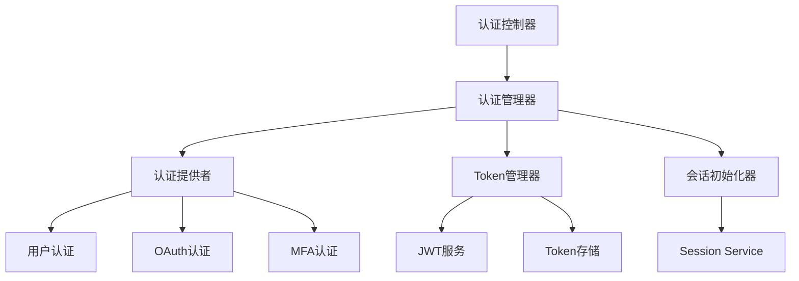
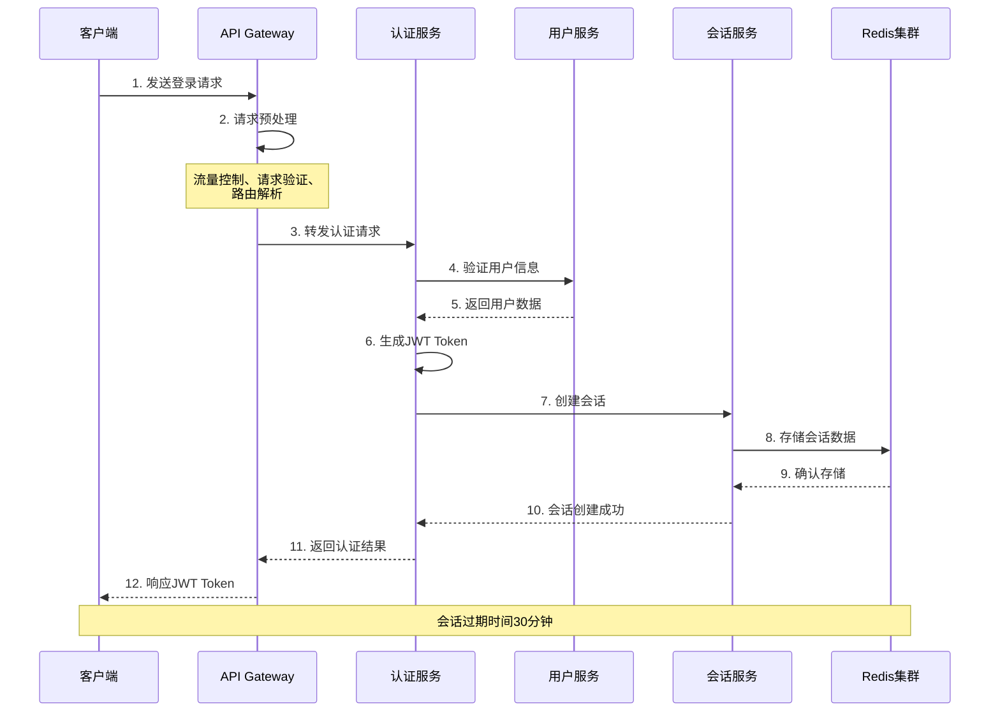
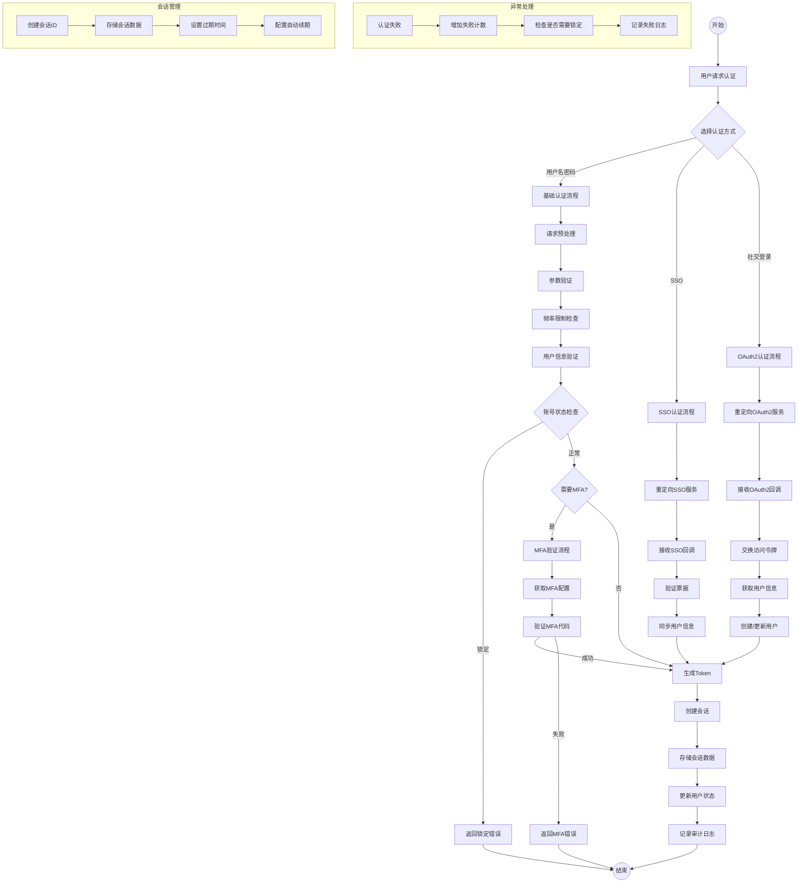
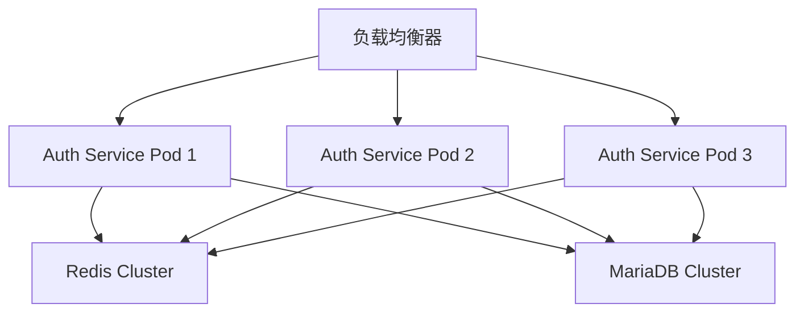

# Authentication Service 详细设计文档 (Authentication Service Detailed Design Document)

## 1. 文档信息 (Document Information)
- 文档版本：1.0.0
- 作者：System Architect
- 审核人：Technical Lead
- 更新日期：2024-03-21
- 状态：草稿 (Draft)

## 2. 修订历史 (Revision History)
| 版本  | 日期       | 作者 | 修订说明 |
|-----|----------|-------|---------|
| 1.0.0 | 2024-03-21 | System Architect | 初始版本，创建认证服务详细设计文档 |

## 3. 组件概述 (Component Overview)
### 3.1 组件名称 (Component Name)
Authentication Service (认证服务)

### 3.2 组件定位 (Component Position)
认证服务是分布式会话管理系统中的核心组件，负责用户身份验证和令牌管理，是整个系统安全体系的基础。

### 3.3 组件职责 (Component Responsibilities)
- 用户身份认证和验证
- OAuth2.0 认证流程管理
- JWT 令牌的生成和管理
- 多因素认证（MFA）支持
- 会话创建和初始化
- 认证事件的发布和处理

### 3.4 组件边界 (Component Boundaries)
- 输入：用户登录请求（主要是POST /auth/login）
- 输出：JWT Token、认证结果
- 核心依赖服务：
  * User Service：用户信息获取和验证
  * Redis 7.2.4：会话数据存储（30分钟过期）
  * MariaDB 10.6.12：用户数据持久化存储

### 3.5 关键假设 (Key Assumptions)
- 系统运行在 Spring Boot 2.7.0 环境
- 使用 Spring Security 5.7.10 框架
- Redis 7.2.4 用于令牌缓存
- MariaDB 10.6.12 存储用户认证信息

## 4. 架构设计 (Architecture Design)
### 4.1 内部架构 (Internal Architecture)

我将为内部架构的每个组件添加详细描述。

English & Chinese:

### 4.1 组件描述
#### 1. 认证控制器 (Authentication Controller)
认证控制器是整个认证服务的入口点，负责接收和处理所有与认证相关的HTTP请求。它实现了RESTful API接口，包括用户登录、令牌刷新、登出等功能。该控制器采用Spring MVC架构，通过`@RestController`注解实现。它主要负责请求的初步验证、参数解析和响应封装，同时也处理认证过程中的异常并转换为适当的HTTP响应。控制器与认证管理器紧密协作，将解析后的认证请求委托给认证管理器处理。此外，它还实现了请求限流、参数验证、响应格式化等功能。在安全方面，控制器集成了Spring Security的注解支持，实现了基于角色的访问控制。为了提供更好的API文档支持，集成了Swagger/OpenAPI规范，自动生成API文档。在性能方面，实现了请求缓存和异步处理能力，可以更好地处理高并发场景。

#### 2. 认证管理器 (Authentication Manager)
认证管理器是认证服务的核心组件，负责协调和管理整个认证流程。它实现了认证策略的选择、认证过程的编排、以及认证结果的处理。该组件采用策略模式和模板方法模式，支持多种认证方式的灵活切换和扩展。它与认证提供者、Token管理器和会话初始化器等组件进行交互，统一协调认证流程。认证管理器实现了认证的事务管理，确保认证过程的原子性。它还负责认证过程中的安全控制，包括防暴力破解、账号锁定等机制。在性能方面，实现了认证请求的并发处理和限流控制。此外，它还负责认证事件的发布，允许其他组件订阅和处理认证相关事件。认证管理器通过Spring Security的认证框架进行实现，同时扩展了自定义的认证逻辑。

#### 3. 认证提供者 (Authentication Provider)
认证提供者组件负责具体的认证逻辑实现，它包含多个子认证提供者，每个提供者负责特定类型的认证处理。该组件采用组合模式设计，允许灵活组合不同的认证方式。它与用户服务进行交互，负责验证用户凭证的有效性。认证提供者实现了可插拔的设计，支持新认证方式的动态添加。在安全性方面，实现了密码加密、凭证验证等核心功能。该组件还负责认证过程的审计日志记录，记录详细的认证过程信息。为了提高性能，实现了认证结果的缓存机制。认证提供者还支持认证过程的自定义扩展，允许添加自定义的认证规则和验证逻辑。

子组件包括：

##### 3.1 用户认证提供者 (User Authentication Provider)
用户认证提供者专门处理用户名密码方式的认证请求。它实现了密码的加密存储和验证，支持多种密码加密算法（如BCrypt、PBKDF2等）。该提供者与用户服务密切协作，负责验证用户凭证的有效性。它实现了账号锁定机制，防止暴力破解。在性能方面，实现了用户认证信息的缓存，减少数据库访问。该提供者还支持自定义的密码策略，如密码强度检查、密码过期检查等。它还负责处理密码重置和修改的逻辑，确保密码变更的安全性。在可扩展性方面，支持添加自定义的密码验证规则和处理逻辑。

##### 3.2 OAuth认证提供者 (OAuth Authentication Provider)
OAuth认证提供者负责处理所有OAuth2.0相关的认证请求，支持多个第三方身份提供商（如Google、GitHub等）。它实现了完整的OAuth2.0授权流程，包括授权码模式、密码模式等。该提供者负责OAuth2.0的token交换、用户信息获取等功能。它实现了状态管理，防止CSRF攻击。在性能方面，实现了OAuth2.0 token的缓存机制。该提供者还支持OAuth2.0的scope管理，实现细粒度的权限控制。它还负责处理OAuth2.0的错误情况，提供友好的错误提示。在可扩展性方面，支持新的OAuth2.0提供商的快速接入。

##### 3.3 MFA认证提供者 (MFA Authentication Provider)
MFA认证提供者负责处理多因素认证请求，支持多种二次认证方式（如TOTP、SMS、邮件等）。它实现了标准的TOTP算法，兼容Google Authenticator等验证器。该提供者负责MFA的启用、禁用和验证过程。它实现了MFA的备份码机制，确保用户不会因为无法访问二次认证设备而无法登录。在性能方面，实现了MFA验证码的生成和验证优化。该提供者还支持自定义的MFA策略，如基于风险的MFA触发机制。它还负责处理MFA的配置管理，包括重置和恢复流程。在可扩展性方面，支持新的MFA方式的快速集成。

#### 4. Token管理器 (Token Manager)
Token管理器负责处理所有与令牌相关的操作，包括令牌的生成、验证、刷新和撤销。它实现了JWT的签名和验证逻辑，支持多种签名算法。该组件负责令牌的生命周期管理，包括过期处理和刷新机制。它实现了令牌的黑名单机制，支持令牌的强制失效。在性能方面，实现了令牌验证的缓存，减少计算开销。Token管理器还支持令牌的自定义声明，允许在令牌中携带额外的业务信息。它还负责令牌的加密存储和传输，确保令牌的安全性。在可扩展性方面，支持自定义的令牌格式和处理逻辑。

子组件包括：

##### 4.1 JWT服务 (JWT Service)
JWT服务专门负责JWT令牌的处理，实现了JWT的生成、解析和验证功能。它支持多种JWT签名算法（如HS256、RS256等），确保令牌的安全性。该服务负责JWT的声明管理，包括标准声明和自定义声明的处理。它实现了JWT的压缩机制，优化令牌大小。在性能方面，实现了JWT验证的缓存，提高验证效率。该服务还支持JWT的加密功能，提供额外的安全保护。它还负责JWT的格式化和序列化，确保与标准规范的兼容性。在可扩展性方面，支持自定义的JWT处理逻辑。

##### 4.2 Token存储 (Token Storage)
Token存储组件负责管理令牌的持久化存储，主要使用Redis实现分布式存储。它负责令牌的存储、检索和失效处理。该组件实现了令牌的分布式缓存，支持集群环境。它负责令牌的过期清理，实现了惰性删除和主动清理机制。在性能方面，实现了多级缓存策略，优化访问性能。该组件还支持令牌的批量操作，提高处理效率。它还负责令牌存储的容灾备份，确保数据的可靠性。在可扩展性方面，支持自定义的存储实现。

#### 5. 会话初始化器 (Session Initializer)
会话初始化器负责创建和初始化用户会话，是认证成功后的重要处理环节。它实现了会话的创建、更新和销毁功能。该组件负责会话数据的组装和存储，包括用户信息、权限信息等。它实现了会话的分布式存储，支持集群环境下的会话共享。在性能方面，实现了会话数据的缓存机制，优化访问性能。会话初始化器还支持会话的自动续期，防止活跃用户的会话过期。它还负责会话的安全控制，如并发会话控制、会话劫持防护等。在可扩展性方面，支持自定义的会话处理逻辑。

#### 6. Session Service
Session Service是一个独立的微服务，负责提供分布式会话管理能力。它实现了会话的CRUD操作，支持会话数据的持久化存储。该服务负责会话的同步和广播，确保集群环境下的会话一致性。它实现了会话的过期处理和清理机制。在性能方面，实现了会话数据的分片存储，支持水平扩展。Session Service还支持会话的查询和统计功能，提供会话监控能力。它还负责会话的备份和恢复，确保数据的可靠性。在可扩展性方面，支持自定义的会话存储实现。

### 4.2 依赖关系 (Dependencies)
- Spring Boot Starter Web 2.7.0
- Spring Security OAuth2 5.7.10
- Spring Data Redis 2.7.0
- Spring Data JPA 2.7.0
- JJWT 0.11.5
- Lombok 1.18.24

### 4.3 部署要求 (Deployment Requirements)
- JDK 17+
- 最小内存要求：512Mi
- CPU 要求：1 Core
- 存储要求：20GB
- 网络要求：支持集群间通信

### 4.4 技术栈选择 (Technology Stack)
- 开发语言：Java 17
- 框架：Spring Boot 2.7.0
- 安全框架：Spring Security 5.7.10
- 缓存：Redis 7.2.4
- 数据库：MariaDB 10.6.12
- 容器化：Docker + Kubernetes

## 5. 功能设计 (Functional Design)
### 5.1 核心功能 (Core Functions)
1. 用户认证
   - 用户名密码认证
   - OAuth2.0 社交登录
   - 多因素认证（MFA）
   - 生物识别认证

2. 令牌管理
   - JWT 令牌生成
   - 令牌验证和刷新
   - 令牌撤销
   - 令牌状态管理

3. 会话管理
   - 会话创建
   - 会话验证
   - 会话更新
   - 会话终止

### 5.2 业务流程 (Business Processes)


### 5.3 处理逻辑 (Processing Logic)
#### 5.3.1. 认证流程
#### 5.3.1.1 



#### 5.3.1.2 核心功能描述
   - 接收认证请求
   - 验证用户凭证
   - 执行多因素认证（如果启用）
   - 生成访问令牌
   - 创建用户会话
   - 返回认证结果

#### 5.3.1.3 接口定义 (Interface Definition)
- 请求接口：
    - 路径: /auth/login
    - 方法: POST
    - Content-Type: application/json
    - 请求体:
        ``` json
        {
            "username": string,     // 用户名
            "password": string,     // 密码（前端需要进行Base64编码）
            "mfaCode": string,      // 可选，MFA验证码
            "deviceInfo": {         // 设备信息
            "deviceId": string,   // 设备标识
            "deviceType": string, // 设备类型：WEB/IOS/ANDROID
            "userAgent": string   // 用户代理
            }
        }
        ```
    - 响应体:
        ``` json
        {
            "code": number,        // 状态码：200成功，其他失败
            "message": string,     // 响应消息
            "data": {
            "token": string,     // JWT访问令牌
            "expiresIn": number  // 过期时间（秒）
            }
        }
        ```
#### 5.3.1.4 处理流程设计 (Process Design)

``` java
@Service
class AuthenticationService {
    
    // 1. 请求预处理
    preProcess(LoginRequest request) {
        - 参数校验（用户名、密码不为空）
        - 设备信息验证
        - 请求频率限制检查（Redis实现）
        - XSS防护
    }
    
    // 2. 用户认证
    authenticate(LoginRequest request) {
        - 查询用户信息（UserService）
        - 密码解密和验证（BCrypt）
        - 账号状态检查（是否锁定/禁用）
        - 失败次数检查（Redis计数）
    }
    
    // 3. MFA验证（如果启用）
    verifyMFA(String userId, String mfaCode) {
        - 检查是否启用MFA
        - 验证MFA代码（TOTP算法）
        - 处理MFA异常
    }
    
    // 4. 生成Token
    generateToken(UserDTO user, DeviceInfo deviceInfo) {
        - 创建JWT Header
        - 组装JWT Payload
        - 签名JWT（HMAC-SHA256）
        - 设置过期时间（30分钟）
    }
    
    // 5. 创建会话
    createSession(String userId, String token) {
        - 调用会话服务创建会话
        - 存储会话信息（Redis）
        - 设置会话过期时间
    }
    
    // 6. 更新认证状态
    updateAuthStatus(String userId) {
        - 更新最后登录时间
        - 重置失败次数
        - 记录登录设备信息
    }
    
    // 7. 认证事件处理
    handleAuthEvent(AuthEvent event) {
        - 发布认证成功事件
        - 记录审计日志
        - 触发异步任务（如通知）
    }
}
```

#### 5.3.1.5 异常处理设计 (Exception Handling)
``` java
@ControllerAdvice
class AuthenticationExceptionHandler {
    
    // 定义异常类型
    - AuthenticationException: 认证失败异常
    - MFAVerificationException: MFA验证异常
    - AccountLockedException: 账号锁定异常
    - RateLimitException: 频率限制异常
    
    // 异常处理方法
    handleAuthenticationException(AuthenticationException ex) {
        - 记录错误日志
        - 增加失败计数
        - 返回标准错误响应
    }
}
```
#### 5.3.1.6 安全控制设计 (Security Control)
``` java
@Configuration
class SecurityConfig {
    
    // 密码加密
    passwordEncoder() {
        - 使用BCrypt加密
        - 配置加密强度
    }
    
    // 请求限流
    rateLimiter() {
        - 基于Redis的令牌桶算法
        - 配置限流规则
    }
    
    // 会话控制
    sessionControl() {
        - 最大会话数限制
        - 会话并发控制
        - 会话劫持防护
    }
}
```

#### 5.3.1.7 缓存策略设计 (Cache Strategy)
``` java
@Configuration
class CacheConfig {
    
    // 认证缓存配置
    authenticationCache() {
        - 用户信息缓存（1小时）
        - 失败次数缓存（10分钟）
        - Token黑名单缓存
    }
}
```
#### 5.3.1.8 监控指标设计 (Monitoring Metrics)
```java
@Component
class AuthenticationMetrics {
    
    // 监控指标定义
    - 认证成功率
    - 认证响应时间
    - MFA验证成功率
    - 并发认证数
    - 失败认证计数
    
    // 告警规则
    - 认证失败率超阈值
    - 响应时间过高
    - 并发数超限
}
```
#### 5.3.1.9 数据模型设计 (Data Model)
``` java
// 请求模型
class LoginRequest {
    String username
    String password
    String mfaCode
    DeviceInfo deviceInfo
}

// 响应模型
class LoginResponse {
    String token
    long expiresIn
}

// 设备信息模型
class DeviceInfo {
    String deviceId
    String deviceType
    String userAgent
}

``` 
#### 5.3.1.10 配置参数设计 (Configuration Parameters)
``` yaml
auth:
  token:
    expiration: 1800  # Token过期时间（秒）
    secret: ${JWT_SECRET}  # JWT密钥
  mfa:
    enabled: true
    issuer: "Auth Service"
    algorithm: "SHA1"
    digits: 6
    period: 30
  sso:
    providers:
      - name: "corporate-sso"
        type: "SAML"
        metadata-url: "https://sso.corporate.com/metadata"
  security:
    max-attempts: 5  # 最大失败尝试次数
    lock-duration: 300  # 锁定时间（秒）
  rate-limit:
    capacity: 100  # 令牌桶容量
    rate: 10  # 令牌生成速率
  social:
    providers:
      google:
        client-id: ${GOOGLE_CLIENT_ID}
        client-secret: ${GOOGLE_CLIENT_SECRET}
        scope: "profile email"
      github:
        client-id: ${GITHUB_CLIENT_ID}
        client-secret: ${GITHUB_CLIENT_SECRET}
        scope: "user"
``` 


### 5.3.2 令牌验证流程
   - 解析 JWT 令牌
   - 验证令牌签名
   - 检查令牌有效期
   - 验证令牌状态
   - 返回验证结果


### 5.4 异常处理 (Exception Handling)
- 认证失败异常
- 令牌无效异常
- 会话过期异常
- 权限不足异常
- 系统错误异常

### 5.5 扩展点设计 (Extension Points)
- 自定义认证提供者
- 自定义令牌生成策略
- 自定义会话管理策略
- 认证事件监听器

## 6. 接口设计 (Interface Design)
### 6.1 对外接口 (External Interfaces)

1. 用户登录接口（主要接口）
```markdown
- 请求路径：/auth/login
- 请求方式：POST
- 请求参数：
  * username: string - 用户名
  * password: string - 密码
  * mfaCode: string - 多因素认证码（可选）
- 响应格式：
  * code: number - 状态码（200表示成功）
  * message: string - 消息
  * data: object
    - token: string - JWT访问令牌
    - expiresIn: number - 过期时间（1800秒）
```

2. OAuth2.0登录接口
```markdown
- 请求路径：/auth/oauth2/{provider}
- 请求方式：GET
- 路径参数：
  * provider: string - 认证提供者（如：google, github）
- 响应格式：
  * 重定向到认证提供者
```

3. 令牌刷新接口
```markdown
- 请求路径：/auth/token/refresh
- 请求方式：POST
- 请求参数：
  * refreshToken: string - 刷新令牌
- 响应格式：
  * code: number - 状态码
  * message: string - 消息
  * data: object
    - token: string - 新的访问令牌
    - expiresIn: number - 过期时间
```

### 6.2 内部接口 (Internal Interfaces)
#### 6.2.1 服务间接口 (Service Interfaces)
1. 用户信息验证
```markdown
- 接口名称：UserService.validateUser
- 参数：
  * username: string
  * password: string
- 返回值：
  * UserDTO: 用户信息对象
```

2. 会话管理接口
- 接口名称：SessionManagementService.createSession
- 参数：
  * userId: string - 用户ID
  * tenantId: string - 租户ID
  * authInfo: AuthenticationInfo - 认证信息
- 返回值：
  * sessionId: string - 会话ID

- 接口名称：SessionManagementService.validateSession
- 参数：
  * sessionId: string - 会话ID
- 返回值：
  * valid: boolean - 会话是否有效
```

#### 6.2.2 回调接口 (Callback Interfaces)
1. OAuth2.0回调
```markdown
- 路径：/auth/oauth2/callback/{provider}
- 参数：
  * code: string - 授权码
  * state: string - 状态码
- 处理：
  * 验证授权码
  * 获取用户信息
  * 创建或更新用户
  * 生成系统令牌
```

#### 6.2.3 事件接口 (Event Interfaces)
1. 认证成功事件
```markdown
- 事件类型：AuthenticationSuccessEvent
- 数据：
  * userId: string
  * loginTime: timestamp
  * deviceInfo: string
```

2. 认证失败事件
```markdown
- 事件类型：AuthenticationFailureEvent
- 数据：
  * username: string
  * failureReason: string
  * attemptTime: timestamp
```

## 7. 数据设计 (Data Design)
### 7.1 数据模型 (Data Models)
1. 用户认证信息
```markdown
- 表名：auth_info
- 字段：
  * id: string - 主键
  * user_id: string - 用户ID
  * password_hash: string - 密码哈希
  * salt: string - 盐值
  * mfa_enabled: boolean - 是否启用多因素认证
  * mfa_secret: string - 多因素认证密钥
  * status: enum - 状态（ACTIVE/LOCKED/DISABLED）
  * last_login_time: timestamp - 最后登录时间
  * failed_attempts: int - 失败尝试次数
```

2. OAuth2连接信息
```markdown
- 表名：oauth_connection
- 字段：
  * id: string - 主键
  * user_id: string - 用户ID
  * provider: string - 提供者
  * provider_user_id: string - 提供者用户ID
  * access_token: string - 访问令牌
  * refresh_token: string - 刷新令牌
  * expires_at: timestamp - 过期时间
```

3. JWT Token结构 (JWT Token Structure)
- Header（头部）
  * alg: string - 签名算法（HS256/RS256）
  * typ: string - 令牌类型（固定为"JWT"）
  * kid: string - 密钥ID

- Payload（负载）
  * 标准声明 (Standard Claims)：
    - iss: string - 令牌签发者（Authentication Service）
    - sub: string - 用户ID
    - exp: number - 过期时间
    - iat: number - 签发时间
    - jti: string - JWT唯一标识符
  
  * 自定义声明 (Custom Claims)：
    - sid: string - 会话ID（关联会话管理模块的会话上下文）
    - tid: string - 租户ID（多租户支持）
- Signature（签名）
  * 签名算法：HMAC-SHA256/RSA-SHA256
  * 签名内容：Base64UrlEncode(header) + "." + Base64UrlEncode(payload)
  * 签名密钥：从密钥管理服务获取

### 7.2 存储设计 (Storage Design)
#### 7.2.1 数据库表结构 (Database Schema)
使用MariaDB存储持久化数据：
- auth_info：用户认证信息表
- oauth_connection：OAuth连接信息表
- auth_log：认证日志表

#### 7.2.2 索引设计 (Index Design)
1. auth_info表：
   - 主键索引：id
   - 唯一索引：user_id
   - 普通索引：status, last_login_time

2. oauth_connection表：
   - 主键索引：id
   - 联合唯一索引：(user_id, provider)
   - 普通索引：provider_user_id

#### 7.2.3 缓存策略 (Cache Strategy)
使用Redis 7.2.4缓存：
- 会话数据：key=session:user_id, expiry=30min
- 用户认证信息缓存：key=auth:user:{user_id}, expiry=1h
- 失败尝试计数：key=auth:attempts:{username}, expiry=10min

主要缓存策略：
1. 会话数据存储
   - 键格式：session:user_id
   - 过期时间：30分钟
   - 数据内容：用户会话信息、认证状态
   - 自动续期机制

2. 认证信息缓存
   - 键格式：auth:user:{user_id}
   - 过期时间：1小时
   - 按需加载
   - 变更时主动失效

3. 失败计数控制
   - 键格式：auth:attempts:{username}
   - 过期时间：10分钟
   - 用于限制登录尝试次数
   - 防暴力破解机制

## 8. 性能设计 (Performance Design)
### 8.1 性能指标 (Performance Metrics)
- 并发处理：支持1000 QPS
- 响应时间：P95 < 200ms（架构要求）
- 错误率：< 0.1%
- CPU使用率：< 70%
- 内存使用率：< 80%

### 8.2 并发处理 (Concurrency Handling)
- 使用线程池处理并发请求，确保支持1000 QPS
- 实现请求队列和限流机制
- 采用分布式锁处理并发登录
- 使用本地缓存减少Redis访问，提升响应时间

### 8.3 资源估算 (Resource Estimation)
- CPU：1 Core
- 内存：512Mi
- 存储：20GB
- 网络带宽：100Mbps
- Redis容量：2GB

### 8.4 优化方案 (Optimization Plans)
1. 缓存优化
   - 多级缓存架构
   - 热点数据缓存
   - 缓存预热机制

2. 数据库优化
   - 读写分离
   - 索引优化
   - 分库分表预案

3. 算法优化
   - JWT签名算法优化
   - 密码哈希算法优化
   - 令牌验证算法优化

## 9. 安全设计 (Security Design)
### 9.1 访问控制 (Access Control)
- 基于角色的访问控制（RBAC）
- OAuth2.0授权框架
- JWT令牌认证
- IP白名单控制

### 9.2 数据安全 (Data Security)
- 密码哈希存储
- 敏感数据加密
- 数据脱敏处理
- 数据备份策略

### 9.3 传输安全 (Transport Security)
- **强制使用HTTPS**：所有API请求必须通过HTTPS协议进行传输
- API签名验证
- 防重放攻击
- 传输数据压缩

### 9.4 审计日志 (Audit Logging)
- 认证操作日志（重点记录所有认证尝试）
- 异常行为日志（记录可疑的认证行为）
- 安全事件日志（记录系统安全相关事件）
- 详细的认证审计跟踪
  * 登录尝试（成功/失败）
  * 令牌操作（生成/刷新/撤销）
  * 会话操作（创建/销毁）
  * 异常行为（多次失败尝试、异常IP等）

## 10. 测试设计 (Test Design)
### 10.1 测试策略 (Test Strategy)
- 单元测试：80%覆盖率
- 集成测试：关键流程覆盖
- 性能测试：满足性能指标
- 安全测试：漏洞扫描

### 10.2 测试用例 (Test Cases)
1. 认证测试
   - 正常登录流程
   - 密码错误处理
   - 账号锁定机制
   - 多因素认证流程

2. 令牌测试
   - 令牌生成验证
   - 令牌过期处理
   - 令牌刷新流程
   - 令牌撤销处理

### 10.3 测试数据 (Test Data)
- 模拟用户数据
- 测试账号信息
- 性能测试数据
- 异常测试数据

### 10.4 测试工具 (Test Tools)
- JUnit：单元测试
- Mockito：模拟测试
- JMeter：性能测试
- SonarQube：代码质量

## 11. 部署设计 (Deployment Design)
### 11.1 部署架构 (Deployment Architecture)


### 11.2 环境要求 (Environment Requirements)
- Kubernetes 1.24+
- Docker 20.10+
- JDK 17
- Redis 7.2.4
- MariaDB 10.6.12

### 11.3 配置管理 (Configuration Management)
- 使用ConfigMap存储配置
- 使用Secret存储敏感信息
- 支持配置热更新
- 多环境配置分离

### 11.4 监控方案 (Monitoring Plan)
- Prometheus指标收集
- Grafana监控面板
- ELK日志分析
- Skywalking链路追踪

## 12. 运维设计 (Operation Design)
### 12.1 运维指标 (Operation Metrics)
- 服务可用性：99.99%
- 平均恢复时间：<15分钟
- 变更成功率：>99%
- 问题解决时间：<2小时

### 12.2 告警策略 (Alert Strategy)
- CPU使用率>80%
- 内存使用率>85%
- 错误率>1%
- 响应时间>500ms
- 认证失败率>5%

### 12.3 备份方案 (Backup Plan)
- 数据库定时备份
- 配置文件备份
- 日志文件备份
- 定期备份测试

### 12.4 应急预案 (Emergency Plan)
- 服务降级方案
- 故障转移方案
- 数据恢复方案
- 应急响应流程

## 13. 附录 (Appendix)
### 13.1 术语表 (Glossary)
- JWT: JSON Web Token
- OAuth: Open Authorization
- MFA: Multi-Factor Authentication
- RBAC: Role-Based Access Control

### 13.2 参考文档 (References)
- Spring Security 官方文档
- OAuth 2.0 规范文档
- JWT 规范文档
- Kubernetes 部署指南

### 13.3 相关资料 (Related Documents)
- 系统架构设计文档
- API接口文档
- 运维手册
- 测试报告

## 14. 评审记录 (Review Records)
| 评审日期 | 评审人 | 评审结果 | 主要意见 |
|---------|--------|----------|----------|
| 2024-03-21 | Technical Lead | 待审核 | 初始版本待评审 |
