# NEW-7
## 1. 整体架构图


```mermaid
graph TD
    %% 原有的层级定义保持不变
    subgraph 用户访问层
        Browser[浏览器]
        MobileApp[移动应用]
        ThirdParty[第三方系统]
    end

    subgraph 接入层
        LB[负载均衡器]
        WAF[Web应用防火墙]
        Gateway[API Gateway]
        Gateway --> TokenValidate[Token验证]
        Gateway --> RouteFilter[路由过滤]
    end

    subgraph 业务服务层
        subgraph 认证授权模块
            TokenValidate --> AuthService[认证服务]
            TokenValidate --> AuthorizationService[授权服务]
            AuthService --> OAuth[OAuth2.0服务]
            AuthService --> JWT[JWT服务]
        end

        subgraph 会话管理模块
            AuthService --> SessionService[会话服务]
            AuthorizationService --> SessionService
        end

        subgraph 业务服务模块
            ProjectService[项目服务]
            IssueService[问题服务]
            WorkflowService[工作流服务]
            BoardService[看板服务]
            SearchService[搜索服务]
            NotificationService[通知服务]
            ReportService[报表服务]
            UserService[用户服务]
            TeamService[团队服务]
            PermissionService[权限服务]
        end
    end

    subgraph 治理架构层
        Registry[服务注册中心]
        Config[配置中心]
        Circuit[熔断器]
        LoadBalance[负载均衡器]
        Router[服务路由]
        Version[版本管理]
        RateLimit[限流控制]
    end

    subgraph 中间件层
        subgraph 消息中间件
            MQ[消息队列]
            EventBus[事件总线]
        end

        subgraph 数据存储中间件
            Cache[Redis集群]
            DB[MariaDB集群]
            ES[Elasticsearch]
        end
    end

    subgraph 基础设施层
        K8S[Kubernetes]
        Docker[容器服务]
        Network[网络服务]
        Storage[存储服务]
    end

    subgraph 运维监控层
        Monitor[监控系统]
        Log[日志系统]
        Trace[链路追踪]
        Alert[告警系统]
    end

    %% 业务服务与中间件的关系
    AuthService --> MQ
    AuthService --> EventBus
    AuthService --> Cache
    AuthService --> DB
    
    SessionService --> MQ
    SessionService --> EventBus
    SessionService --> Cache
    SessionService --> DB
    
    ProjectService --> MQ
    IssueService --> MQ
    WorkflowService --> MQ
    BoardService --> MQ
    SearchService --> MQ
    NotificationService --> MQ
    ReportService --> MQ
    UserService --> MQ
    TeamService --> MQ
    PermissionService --> MQ
    
    ProjectService --> Cache
    IssueService --> Cache
    WorkflowService --> Cache
    BoardService --> Cache
    SearchService --> Cache
    NotificationService --> Cache
    ReportService --> Cache
    UserService --> Cache
    TeamService --> Cache
    PermissionService --> Cache
    
    ProjectService --> DB
    IssueService --> DB
    WorkflowService --> DB
    BoardService --> DB
    SearchService --> DB
    NotificationService --> DB
    ReportService --> DB
    UserService --> DB
    TeamService --> DB
    PermissionService --> DB

    %% 治理层与中间件的关系
    Registry --> Cache
    Config --> DB
    Router --> Cache
    LoadBalance --> Cache
    Circuit --> Cache
    RateLimit --> Cache
    Version --> DB

    %% 中间件层与基础设施层的关系
    MQ --> K8S
    EventBus --> K8S
    Cache --> K8S
    DB --> K8S
    ES --> K8S

    MQ --> Storage
    EventBus --> Storage
    Cache --> Storage
    DB --> Storage
    ES --> Storage

    %% 监控相关的关系
    MQ --> Monitor
    EventBus --> Monitor
    Cache --> Monitor
    DB --> Monitor
    ES --> Monitor

    %% 日志相关的关系
    MQ --> Log
    EventBus --> Log
    Cache --> Log
    DB --> Log
    ES --> Log

    %% 链路追踪相关的关系
    MQ --> Trace
    EventBus --> Trace
    Cache --> Trace
    DB --> Trace
    ES --> Trace

    %% 原有的其他关系保持不变
    Browser --> LB
    MobileApp --> LB
    ThirdParty --> LB
    LB --> WAF
    WAF --> Gateway

    Gateway --> ProjectService
    Gateway --> IssueService
    Gateway --> WorkflowService
    Gateway --> BoardService
    Gateway --> SearchService
    Gateway --> NotificationService
    Gateway --> ReportService
    Gateway --> UserService
    Gateway --> TeamService
    Gateway --> PermissionService

    ProjectService --> IssueService
    IssueService --> WorkflowService
    WorkflowService --> BoardService

    ProjectService -.-> SessionService
    IssueService -.-> SessionService
    WorkflowService -.-> SessionService
    BoardService -.-> SessionService
    SearchService -.-> SessionService
    NotificationService -.-> SessionService
    ReportService -.-> SessionService
    UserService -.-> SessionService
    TeamService -.-> SessionService
    PermissionService -.-> SessionService
    
    ProjectService -.-> AuthorizationService
    IssueService -.-> AuthorizationService
    WorkflowService -.-> AuthorizationService
    BoardService -.-> AuthorizationService
    SearchService -.-> AuthorizationService
    NotificationService -.-> AuthorizationService
    ReportService -.-> AuthorizationService
    UserService -.-> AuthorizationService
    TeamService -.-> AuthorizationService
    PermissionService -.-> AuthorizationService

    K8S --> Monitor
    K8S --> Log
    K8S --> Trace
    Monitor --> Alert

    %% 接入层与治理架构层的关系
    Gateway --> Registry
    Gateway --> Config
    Gateway --> Circuit
    Gateway --> LoadBalance
    Gateway --> Router
    Gateway --> Version
    Gateway --> RateLimit

    LB --> Registry
    LB --> LoadBalance
    LB --> Circuit

    %% 样式定义
    classDef gateway fill:#f9f,stroke:#333,stroke-width:2px;
    classDef service fill:#bbf,stroke:#333,stroke-width:2px;
    classDef storage fill:#dfd,stroke:#333,stroke-width:2px;
    classDef auth fill:#ffd,stroke:#333,stroke-width:2px;
    classDef session fill:#dff,stroke:#333,stroke-width:2px;
    classDef infra fill:#ffe,stroke:#333,stroke-width:2px;
    classDef middleware fill:#fdf,stroke:#333,stroke-width:2px;
    classDef governance fill:#eff,stroke:#333,stroke-width:2px;
    
    class Gateway,TokenValidate,RouteFilter gateway;
    class AuthService,AuthorizationService,OAuth,JWT auth;
    class SessionService session;
    class ProjectService,IssueService,WorkflowService,BoardService,SearchService,NotificationService,ReportService,UserService,TeamService,PermissionService service;
    class Cache,DB,ES,MQ,EventBus middleware;
    class K8S,Docker,Network,Storage infra;
    class Registry,Config,Circuit,LoadBalance,Router,Version,RateLimit governance;
```

主要改进：
1. 添加了业务服务与中间件层的完整依赖关系
2. 添加了治理层组件与中间件的交互关系
3. 添加了中间件层与基础设施层的依赖关系
4. 添加了中间件层与监控层的关联关系
5. 保持了原有的其他层级关系不变

这样的架构图更完整地展示了：
1. 各个业务服务对中间件的使用
2. 治理层对中间件的依赖
3. 中间件的部署和运维关系
4. 完整的监控和追踪体系

需要我详细解释某个部分吗？
# NEW -6
## 1. 整体架构图

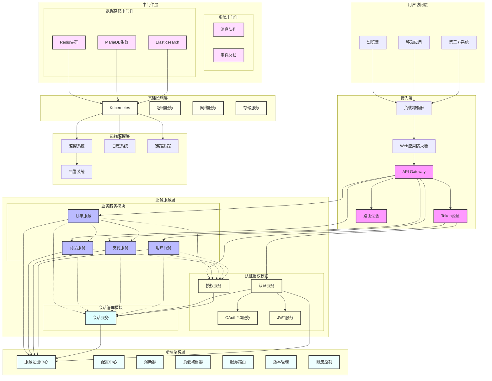
```mermaid
graph TD
    subgraph 用户访问层
        Browser[浏览器]
        MobileApp[移动应用]
        ThirdParty[第三方系统]
    end

    subgraph 接入层
        LB[负载均衡器]
        WAF[Web应用防火墙]
        Gateway[API Gateway]
        Gateway --> TokenValidate[Token验证]
        Gateway --> RouteFilter[路由过滤]
    end

    subgraph 业务服务层
        subgraph 认证授权模块
            TokenValidate --> AuthService[认证服务]
            TokenValidate --> AuthorizationService[授权服务]
            AuthService --> OAuth[OAuth2.0服务]
            AuthService --> JWT[JWT服务]
        end

        subgraph 会话管理模块
            AuthService --> SessionService[会话服务]
            AuthorizationService --> SessionService
        end

        subgraph 业务服务模块
            OrderService[订单服务]
            ProductService[商品服务]
            PaymentService[支付服务]
            UserService[用户服务]
        end
    end

    subgraph 治理架构层
        Registry[服务注册中心]
        Config[配置中心]
        Circuit[熔断器]
        LoadBalance[负载均衡器]
        Router[服务路由]
        Version[版本管理]
        RateLimit[限流控制]
    end

    subgraph 中间件层
        subgraph 消息中间件
            MQ[消息队列]
            EventBus[事件总线]
        end

        subgraph 数据存储中间件
            Cache[Redis集群]
            DB[MariaDB集群]
            ES[Elasticsearch]
        end
    end

    subgraph 基础设施层
        K8S[Kubernetes]
        Docker[容器服务]
        Network[网络服务]
        Storage[存储服务]
    end

    subgraph 运维监控层
        Monitor[监控系统]
        Log[日志系统]
        Trace[链路追踪]
        Alert[告警系统]
    end

    %% 用户访问流向
    Browser --> LB
    MobileApp --> LB
    ThirdParty --> LB
    LB --> WAF
    WAF --> Gateway

    %% 网关到业务服务的调用
    Gateway --> OrderService
    Gateway --> ProductService
    Gateway --> PaymentService
    Gateway --> UserService

    %% 服务注册和配置
    OrderService --> Registry
    ProductService --> Registry
    PaymentService --> Registry
    UserService --> Registry
    SessionService --> Registry
    AuthService --> Registry

    %% 服务间直接调用
    OrderService --> ProductService
    OrderService --> PaymentService
    
    %% 业务服务获取会话和权限
    OrderService -.-> SessionService
    ProductService -.-> SessionService
    PaymentService -.-> SessionService
    UserService -.-> SessionService
    OrderService -.-> AuthorizationService
    ProductService -.-> AuthorizationService
    PaymentService -.-> AuthorizationService
    UserService -.-> AuthorizationService

    %% 基础设施依赖
    Cache --> K8S
    DB --> K8S
    ES --> K8S
    K8S --> Monitor
    K8S --> Log
    K8S --> Trace
    Monitor --> Alert

    %% 样式定义
    classDef gateway fill:#f9f,stroke:#333,stroke-width:2px;
    classDef service fill:#bbf,stroke:#333,stroke-width:2px;
    classDef storage fill:#dfd,stroke:#333,stroke-width:2px;
    classDef auth fill:#ffd,stroke:#333,stroke-width:2px;
    classDef session fill:#dff,stroke:#333,stroke-width:2px;
    classDef infra fill:#ffe,stroke:#333,stroke-width:2px;
    classDef middleware fill:#fdf,stroke:#333,stroke-width:2px;
    classDef governance fill:#eff,stroke:#333,stroke-width:2px;
    
    class Gateway,TokenValidate,RouteFilter gateway;
    class AuthService,AuthorizationService,OAuth,JWT auth;
    class SessionService session;
    class OrderService,ProductService,PaymentService,UserService service;
    class Cache,DB,ES,MQ,EventBus middleware;
    class K8S,Docker,Network,Storage infra;
    class Registry,Config,Circuit,LoadBalance,Router,Version,RateLimit governance;
```

架构层次说明：
1. **用户访问层**：处理各类客户端接入

2. **接入层**：
   - 负载均衡：流量分发
   - WAF：安全防护
   - API网关：统一接入、认证、路由

3. **业务服务层**：
   A. 认证授权模块：
      - 认证服务：用户认证
      - 授权服务：权限验证
      - OAuth2.0服务：第三方认证
      - JWT服务：令牌管理

   B. 会话管理模块：
      - 会话服务：核心会话管理
      - 会话状态维护
      - 会话生命周期管理

   C. 业务服务模块：
      - 订单服务
      - 商品服务
      - 支付服务
      - 用户服务

4. **治理架构层**：
   - 服务注册中心：服务注册与发现
   - 配置中心：配置管理与动态刷新
   - 熔断器：服务熔断与降级
   - 负载均衡器：服务负载均衡
   - 服务路由：动态路由策略
   - 版本管理：服务版本控制
   - 限流控制：服务访问控制

5. **中间件层**：
   A. 消息中间件：
      - 消息队列：异步消息处理
      - 事件总线：事件驱动架构

   B. 数据存储中间件：
      - Redis集群：分布式缓存
      - MariaDB集群：数据持久化
      - Elasticsearch：日志检索

6. **基础设施层**：
   - Kubernetes：容器编排
   - Docker：容器运行
   - 网络服务：SDN
   - 存储服务：分布式存储

7. **运维监控层**：
   - 监控系统：性能监控
   - 日志系统：日志收集
   - 链路追踪：调用链跟踪
   - 告警系统：异常告警


# NEW - 5
## 1. 整体架构图


```mermaid
graph TD
    subgraph 用户访问层
        Browser[浏览器]
        MobileApp[移动应用]
        ThirdParty[第三方系统]
    end

    subgraph 接入层
        LB[负载均衡器]
        WAF[Web应用防火墙]
        Gateway[API Gateway]
        Gateway --> TokenValidate[Token验证]
        Gateway --> RouteFilter[路由过滤]
    end

    subgraph 业务服务层
        subgraph 认证授权模块
            TokenValidate --> AuthService[认证服务]
            TokenValidate --> AuthorizationService[授权服务]
            AuthService --> OAuth[OAuth2.0服务]
            AuthService --> JWT[JWT服务]
        end

        subgraph 会话管理模块
            AuthService --> SessionService[会话服务]
            AuthorizationService --> SessionService
        end

        subgraph 业务服务模块
            OrderService[订单服务]
            ProductService[商品服务]
            PaymentService[支付服务]
            UserService[用户服务]
        end
    end

    subgraph 治理架构层
        Registry[服务注册中心]
        Config[配置中心]
        Circuit[熔断器]
        LoadBalance[负载均衡器]
        Router[服务路由]
        Version[版本管理]
        RateLimit[限流控制]
    end

    subgraph 中间件层
        subgraph 消息中间件
            MQ[消息队列]
            EventBus[事件总线]
        end

        subgraph 数据存储中间件
            Cache[Redis集群]
            DB[MariaDB集群]
            ES[Elasticsearch]
        end
    end

    subgraph 基础设施层
        K8S[Kubernetes]
        Docker[容器服务]
        Network[网络服务]
        Storage[存储服务]
    end

    subgraph 运维监控层
        Monitor[监控系统]
        Log[日志系统]
        Trace[链路追踪]
        Alert[告警系统]
    end

    %% 用户访问流向
    Browser --> LB
    MobileApp --> LB
    ThirdParty --> LB
    LB --> WAF
    WAF --> Gateway

    %% 网关到业务服务的调用
    Gateway --> OrderService
    Gateway --> ProductService
    Gateway --> PaymentService
    Gateway --> UserService

    %% 服务注册和配置
    OrderService --> Registry
    ProductService --> Registry
    PaymentService --> Registry
    UserService --> Registry
    SessionService --> Registry
    AuthService --> Registry

    %% 服务间直接调用
    OrderService --> ProductService
    OrderService --> PaymentService
    
    %% 业务服务获取会话和权限
    OrderService -.-> SessionService
    ProductService -.-> SessionService
    PaymentService -.-> SessionService
    UserService -.-> SessionService
    OrderService -.-> AuthorizationService
    ProductService -.-> AuthorizationService
    PaymentService -.-> AuthorizationService
    UserService -.-> AuthorizationService

    %% 基础设施依赖
    Cache --> K8S
    DB --> K8S
    ES --> K8S
    K8S --> Monitor
    K8S --> Log
    K8S --> Trace
    Monitor --> Alert

    %% 样式定义
    classDef gateway fill:#f9f,stroke:#333,stroke-width:2px;
    classDef service fill:#bbf,stroke:#333,stroke-width:2px;
    classDef storage fill:#dfd,stroke:#333,stroke-width:2px;
    classDef auth fill:#ffd,stroke:#333,stroke-width:2px;
    classDef session fill:#dff,stroke:#333,stroke-width:2px;
    classDef infra fill:#ffe,stroke:#333,stroke-width:2px;
    classDef middleware fill:#fdf,stroke:#333,stroke-width:2px;
    classDef governance fill:#eff,stroke:#333,stroke-width:2px;
    
    class Gateway,TokenValidate,RouteFilter gateway;
    class AuthService,AuthorizationService,OAuth,JWT auth;
    class SessionService session;
    class OrderService,ProductService,PaymentService,UserService service;
    class Cache,DB,ES,MQ,EventBus middleware;
    class K8S,Docker,Network,Storage infra;
    class Registry,Config,Circuit,LoadBalance,Router,Version,RateLimit governance;
```

架构层次说明：
1. **用户访问层**：处理各类客户端接入

2. **接入层**：
   - 负载均衡：流量分发
   - WAF：安全防护
   - API网关：统一接入、认证、路由

3. **业务服务层**：
   A. 认证授权模块：
      - 认证服务：用户认证
      - 授权服务：权限验证
      - OAuth2.0服务：第三方认证
      - JWT服务：令牌管理

   B. 会话管理模块：
      - 会话服务：核心会话管理
      - 会话状态维护
      - 会话生命周期管理

   C. 业务服务模块：
      - 订单服务
      - 商品服务
      - 支付服务
      - 用户服务

4. **治理架构层**：
   - 服务注册中心：服务注册与发现
   - 配置中心：配置管理与动态刷新
   - 熔断器：服务熔断与降级
   - 负载均衡器：服务负载均衡
   - 服务路由：动态路由策略
   - 版本管理：服务版本控制
   - 限流控制：服务访问控制

5. **中间件层**：
   A. 消息中间件：
      - 消息队列：异步消息处理
      - 事件总线：事件驱动架构

   B. 数据存储中间件：
      - Redis集群：分布式缓存
      - MariaDB集群：数据持久化
      - Elasticsearch：日志检索

6. **基础设施层**：
   - Kubernetes：容器编排
   - Docker：容器运行
   - 网络服务：SDN
   - 存储服务：分布式存储

7. **运维监控层**：
   - 监控系统：性能监控
   - 日志系统：日志收集
   - 链路追踪：调用链跟踪
   - 告警系统：异常告警


## 1. 整体架构图

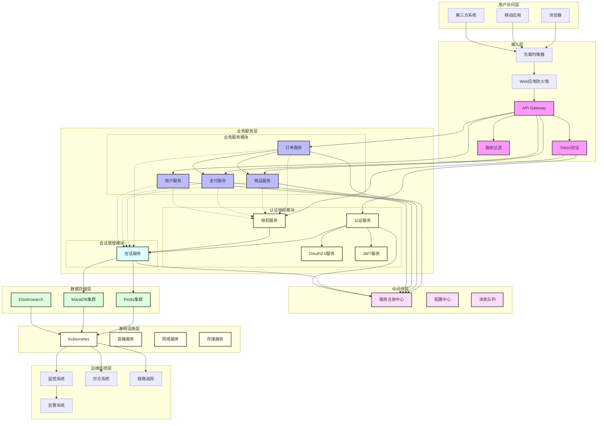
```mermaid
graph TD
    subgraph 用户访问层
        Browser[浏览器]
        MobileApp[移动应用]
        ThirdParty[第三方系统]
    end

    subgraph 接入层
        LB[负载均衡器]
        WAF[Web应用防火墙]
        Gateway[API Gateway]
        Gateway --> TokenValidate[Token验证]
        Gateway --> RouteFilter[路由过滤]
    end

    subgraph 业务服务层
        subgraph 认证授权模块
            TokenValidate --> AuthService[认证服务]
            TokenValidate --> AuthorizationService[授权服务]
            AuthService --> OAuth[OAuth2.0服务]
            AuthService --> JWT[JWT服务]
        end

        subgraph 会话管理模块
            AuthService --> SessionService[会话服务]
            AuthorizationService --> SessionService
        end

        subgraph 业务服务模块
            OrderService[订单服务]
            ProductService[商品服务]
            PaymentService[支付服务]
            UserService[用户服务]
        end
    end

    subgraph 中间件层
        Registry[服务注册中心]
        Config[配置中心]
        MQ[消息队列]
    end

    subgraph 数据存储层
        SessionService --> Cache[Redis集群]
        SessionService --> DB[MariaDB集群]
        ES[Elasticsearch]
    end

    subgraph 基础设施层
        K8S[Kubernetes]
        Docker[容器服务]
        Network[网络服务]
        Storage[存储服务]
    end

    subgraph 运维监控层
        Monitor[监控系统]
        Log[日志系统]
        Trace[链路追踪]
        Alert[告警系统]
    end

    %% 用户访问流向
    Browser --> LB
    MobileApp --> LB
    ThirdParty --> LB
    LB --> WAF
    WAF --> Gateway

    %% 网关到业务服务的调用
    Gateway --> OrderService
    Gateway --> ProductService
    Gateway --> PaymentService
    Gateway --> UserService

    %% 服务注册
    OrderService --> Registry
    ProductService --> Registry
    PaymentService --> Registry
    UserService --> Registry
    SessionService --> Registry
    AuthService --> Registry

    %% 服务间直接调用
    OrderService --> ProductService
    OrderService --> PaymentService
    
    %% 业务服务获取会话和权限
    OrderService -.-> SessionService
    ProductService -.-> SessionService
    PaymentService -.-> SessionService
    UserService -.-> SessionService
    OrderService -.-> AuthorizationService
    ProductService -.-> AuthorizationService
    PaymentService -.-> AuthorizationService
    UserService -.-> AuthorizationService

    %% 基础设施依赖
    Cache --> K8S
    DB --> K8S
    ES --> K8S
    K8S --> Monitor
    K8S --> Log
    K8S --> Trace
    Monitor --> Alert

    %% 样式定义
    classDef gateway fill:#f9f,stroke:#333,stroke-width:2px;
    classDef service fill:#bbf,stroke:#333,stroke-width:2px;
    classDef storage fill:#dfd,stroke:#333,stroke-width:2px;
    classDef auth fill:#ffd,stroke:#333,stroke-width:2px;
    classDef session fill:#dff,stroke:#333,stroke-width:2px;
    classDef infra fill:#ffe,stroke:#333,stroke-width:2px;
    classDef middleware fill:#fdf,stroke:#333,stroke-width:2px;
    
    class Gateway,TokenValidate,RouteFilter gateway;
    class AuthService,AuthorizationService,OAuth,JWT auth;
    class SessionService session;
    class OrderService,ProductService,PaymentService,UserService service;
    class Cache,DB,ES storage;
    class K8S,Docker,Network,Storage infra;
    class Registry,Config,MQ middleware;
```

架构层次说明：
1. **用户访问层**：处理各类客户端接入

2. **接入层**：
   - 负载均衡：流量分发
   - WAF：安全防护
   - API网关：统一接入、认证、路由

3. **业务服务层**：
   A. 认证授权模块：
      - 认证服务：用户认证
      - 授权服务：权限验证
      - OAuth2.0服务：第三方认证
      - JWT服务：令牌管理

   B. 会话管理模块：
      - 会话服务：核心会话管理
      - 会话状态维护
      - 会话生命周期管理

   C. 业务服务模块：
      - 订单服务
      - 商品服务
      - 支付服务
      - 用户服务

4. **中间件层**：
   - 服务注册中心：服务发现
   - 配置中心：配置管理
   - 消息队列：异步通信

5. **数据存储层**：
   - Redis集群：分布式缓存
   - MariaDB集群：数据持久化
   - Elasticsearch：日志检索

6. **基础设施层**：
   - Kubernetes：容器编排
   - Docker：容器运行
   - 网络服务：SDN
   - 存储服务：分布式存储

7. **运维监控层**：
   - 监控系统：性能监控
   - 日志系统：日志收集
   - 链路追踪：调用链跟踪
   - 告警系统：异常告警

   
# 分布式会话管理架构设计

## 1. 整体架构图

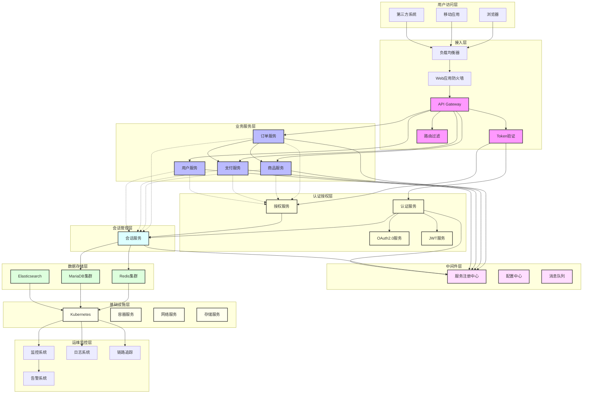
```mermaid
graph TD
    subgraph 用户访问层
        Browser[浏览器]
        MobileApp[移动应用]
        ThirdParty[第三方系统]
    end

    subgraph 接入层
        LB[负载均衡器]
        WAF[Web应用防火墙]
        Gateway[API Gateway]
        Gateway --> TokenValidate[Token验证]
        Gateway --> RouteFilter[路由过滤]
    end

    subgraph 认证授权层
        TokenValidate --> AuthService[认证服务]
        TokenValidate --> AuthorizationService[授权服务]
        AuthService --> OAuth[OAuth2.0服务]
        AuthService --> JWT[JWT服务]
    end

    subgraph 会话管理层
        AuthService --> SessionService[会话服务]
        AuthorizationService --> SessionService
    end

    subgraph 业务服务层
        OrderService[订单服务]
        ProductService[商品服务]
        PaymentService[支付服务]
        UserService[用户服务]
    end

    subgraph 中间件层
        Registry[服务注册中心]
        Config[配置中心]
        MQ[消息队列]
    end

    subgraph 数据存储层
        SessionService --> Cache[Redis集群]
        SessionService --> DB[MariaDB集群]
        ES[Elasticsearch]
    end

    subgraph 基础设施层
        K8S[Kubernetes]
        Docker[容器服务]
        Network[网络服务]
        Storage[存储服务]
    end

    subgraph 运维监控层
        Monitor[监控系统]
        Log[日志系统]
        Trace[链路追踪]
        Alert[告警系统]
    end

    %% 用户访问流向
    Browser --> LB
    MobileApp --> LB
    ThirdParty --> LB
    LB --> WAF
    WAF --> Gateway

    %% 网关到业务服务的调用
    Gateway --> OrderService
    Gateway --> ProductService
    Gateway --> PaymentService
    Gateway --> UserService

    %% 服务注册
    OrderService --> Registry
    ProductService --> Registry
    PaymentService --> Registry
    UserService --> Registry
    SessionService --> Registry
    AuthService --> Registry

    %% 服务间直接调用
    OrderService --> ProductService
    OrderService --> PaymentService
    
    %% 业务服务获取会话和权限
    OrderService -.-> SessionService
    ProductService -.-> SessionService
    PaymentService -.-> SessionService
    UserService -.-> SessionService
    OrderService -.-> AuthorizationService
    ProductService -.-> AuthorizationService
    PaymentService -.-> AuthorizationService
    UserService -.-> AuthorizationService

    %% 基础设施依赖
    Cache --> K8S
    DB --> K8S
    ES --> K8S
    K8S --> Monitor
    K8S --> Log
    K8S --> Trace
    Monitor --> Alert

    %% 样式定义
    classDef gateway fill:#f9f,stroke:#333,stroke-width:2px;
    classDef service fill:#bbf,stroke:#333,stroke-width:2px;
    classDef storage fill:#dfd,stroke:#333,stroke-width:2px;
    classDef auth fill:#ffd,stroke:#333,stroke-width:2px;
    classDef session fill:#dff,stroke:#333,stroke-width:2px;
    classDef infra fill:#ffe,stroke:#333,stroke-width:2px;
    classDef middleware fill:#fdf,stroke:#333,stroke-width:2px;
    
    class Gateway,TokenValidate,RouteFilter gateway;
    class AuthService,AuthorizationService,OAuth,JWT auth;
    class SessionService session;
    class OrderService,ProductService,PaymentService,UserService service;
    class Cache,DB,ES storage;
    class K8S,Docker,Network,Storage infra;
    class Registry,Config,MQ middleware;
```

架构层次说明：
1. **用户访问层**：处理各类客户端接入

2. **接入层**：
   - 负载均衡：流量分发
   - WAF：安全防护
   - API网关：统一接入、认证、路由

3. **认证授权层**：
   - 认证服务：用户认证
   - 授权服务：权限验证
   - OAuth2.0服务：第三方认证
   - JWT服务：令牌管理

4. **会话管理层**：
   - 会话服务：核心会话管理
   - 会话状态维护
   - 会话生命周期管理

5. **业务服务层**：
   - 订单服务
   - 商品服务
   - 支付服务
   - 用户服务

6. **中间件层**：
   - 服务注册中心：服务发现
   - 配置中心：配置管理
   - 消息队列：异步通信

7. **数据存储层**：
   - Redis集群：分布式缓存
   - MariaDB集群：数据持久化
   - Elasticsearch：日志检索

8. **基础设施层**：
   - Kubernetes：容器编排
   - Docker：容器运行
   - 网络服务：SDN
   - 存储服务：分布式存储

9. **运维监控层**：
   - 监控系统：性能监控
   - 日志系统：日志收集
   - 链路追踪：调用链跟踪
   - 告警系统：异常告警


   
#  2 技术架构总体
2.1 总体技术架构图
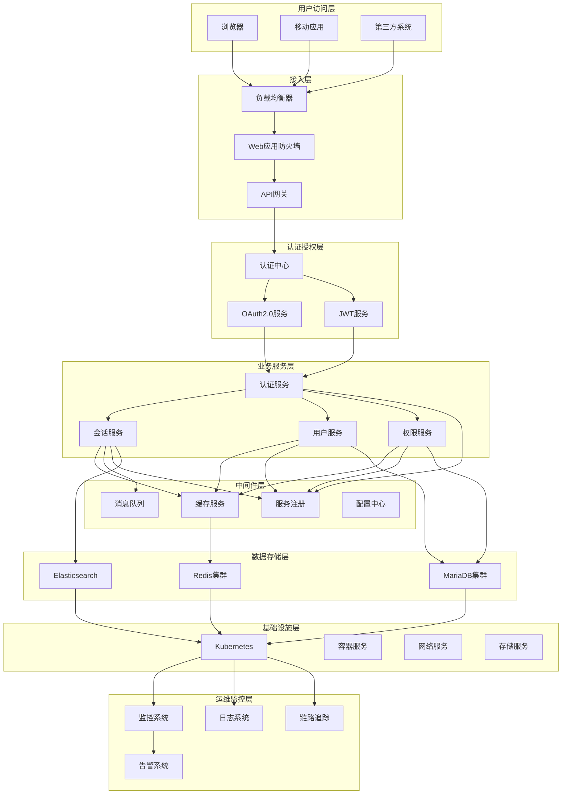
```mermaid
graph TD
    subgraph 用户访问层
        Browser[浏览器]
        MobileApp[移动应用]
        ThirdParty[第三方系统]
    end

    subgraph 接入层
        LB[负载均衡器]
        Gateway[API网关]
        WAF[Web应用防火墙]
    end

    subgraph 认证授权层
        Auth[认证中心]
        OAuth[OAuth2.0服务]
        JWT[JWT服务]
    end

    subgraph 业务服务层
        AS[认证服务]
        SS[会话服务]
        US[用户服务]
        PS[权限服务]
    end

    subgraph 中间件层
        Cache[缓存服务]
        MQ[消息队列]
        Registry[服务注册]
        Config[配置中心]
    end

    subgraph 数据存储层
        Redis[Redis集群]
        MariaDB[MariaDB集群]
        ES[Elasticsearch]
    end

    subgraph 基础设施层
        K8S[Kubernetes]
        Docker[容器服务]
        Network[网络服务]
        Storage[存储服务]
    end

    subgraph 运维监控层
        Monitor[监控系统]
        Log[日志系统]
        Trace[链路追踪]
        Alert[告警系统]
    end

    Browser --> LB
    MobileApp --> LB
    ThirdParty --> LB
    LB --> WAF
    WAF --> Gateway
    Gateway --> Auth
    Auth --> OAuth
    Auth --> JWT
    OAuth --> AS
    JWT --> AS
    AS --> SS
    AS --> US
    AS --> PS
    SS --> Cache
    SS --> MQ
    US --> Cache
    PS --> Cache
    AS --> Registry
    SS --> Registry
    US --> Registry
    PS --> Registry
    Cache --> Redis
    US --> MariaDB
    PS --> MariaDB
    SS --> ES
    Redis --> K8S
    MariaDB --> K8S
    ES --> K8S
    K8S --> Monitor
    K8S --> Log
    K8S --> Trace
    Monitor --> Alert
```

##### 2.2 架构层次说明
1. **用户访问层**
   - 支持多种客户端接入
   - 提供统一的访问入口
   - 实现客户端适配

2. **接入层**
   - 负载均衡：实现流量分发
   - API网关：请求路由和过滤
   - 安全防护：WAF防护

3. **认证授权层**
   - 统一认证中心
   - OAuth2.0协议支持
   - JWT令牌管理

4. **业务服务层**
   - 认证服务：身份认证
   - 会话服务：会话管理
   - 用户服务：用户管理
   - 权限服务：权限控制

5. **中间件层**
   - 缓存服务：分布式缓存
   - 消息队列：异步通信
   - 服务注册：服务发现
   - 配置中心：配置管理

6. **数据存储层**
   - Redis集群：会话存储
   - MariaDB集群：数据持久化
   - Elasticsearch：日志检索

7. **基础设施层**
   - 容器编排：Kubernetes
   - 容器运行：Docker
   - 网络服务：SDN
   - 存储服务：分布式存储

8. **运维监控层**
   - 监控系统：性能监控
   - 日志系统：日志收集
   - 链路追踪：调用链跟踪
   - 告警系统：异常告警

##### 2.3 关键流程说明
1. **认证流程**
   - 客户端请求认证
   - 网关路由到认证服务
   - 认证服务验证身份
   - 生成JWT令牌
   - 返回认证结果

2. **会话管理流程**
   - 创建分布式会话
   - 会话状态同步
   - 会话有效性验证
   - 会话自动续期
   - 会话安全清理

3. **数据访问流程**
   - 多级缓存访问
   - 读写分离处理
   - 数据分片路由
   - 数据同步复制

4. **监控告警流程**
   - 指标数据采集
   - 性能监控分析
   - 异常情况检测
   - 告警信息推送

#### 3. 应用架构
- **微服务架构**
  ```mermaid
  graph TD
    A[API Gateway] --> B[认证服务]
    A --> C[会话服务]
    A --> D[用户服务]
    A --> E[权限服务]
    
    B --> F[Redis集群]
    C --> F
    B --> G[MariaDB Enterprise集群]
    D --> G
    
    H[消息队列] --> B
    H --> C
    H --> D
  ```
##### 组件说明
1. **API Gateway**
   - 功能：统一的API接入层，负责请求路由、认证鉴权、流量控制
   - 依赖：与所有微服务交互
   - 技术选型：Spring Cloud Gateway
   - 关键特性：
     * 请求转发和负载均衡
     * 统一认证鉴权
     * 流量控制和熔断
     * 请求/响应转换

2. **认证服务**
   - 功能：处理用户认证、令牌管理、会话创建
   - 依赖：
     * Redis集群：存储会话和令牌信息
     * MariaDB Enterprise集群：存储用户认证信息
     * 消息队列：发布认证事件
   - 关键接口：
     * /auth/login：用户登录
     * /auth/logout：用户登出
     * /auth/token：令牌管理
     * /auth/session：会话管理

3. **会话服务**
   - 功能：管理分布式会话状态、会话同步、会话清理
   - 依赖：
     * Redis集群：存储会话数据
     * 消息队列：会话状态同步
   - 关键特性：
     * 分布式会话管理
     * 会话状态同步
     * 会话有效期控制
     * 会话数据清理

4. **用户服务**
   - 功能：用户信息管理、用户状态维护
   - 依赖：
     * MariaDB Enterprise集群：存储用户基础信息
     * Redis集群：缓存用户数据
     * 消息队列：用户状态变更通知
   - 核心功能：
     * 用户信息CRUD
     * 用户状态管理
     * 用户数据缓存

5. **权限服务**
   - 功能：权限管理、访问控制、权限验证
   - 依赖：
     * MariaDB Enterprise集群：存储权限规则
     * Redis集群：缓存权限数据
   - 主要特性：
     * RBAC权限模型
     * 动态权限控制
     * 权限缓存管理

6. **Redis集群**
   - 功能：分布式缓存，存储会话和临时数据
   - 被依赖：
     * 认证服务：存储会话令牌
     * 会话服务：存储会话状态
     * 用户服务：缓存用户数据
     * 权限服务：缓存权限数据
   - 关键配置：
     * 主从复制
     * 哨兵模式
     * 数据分片

7. **MariaDB集群**
   - 功能：持久化存储核心业务数据
   - 被依赖：
     * 认证服务：存储认证信息
     * 用户服务：存储用户数据
   - 架构特点：
     * Galera集群
     * 主从复制(Semi-Sync)
     * 读写分离
     * 数据分片
   - 企业特性：
     * 高性能事务处理
     * 数据一致性保证
     * 自动故障转移
     * 在线扩容能力

8. **消息队列**
   - 功能：异步消息通信，事件广播
   - 被依赖：
     * 认证服务：发布认证事件
     * 会话服务：同步会话状态
     * 用户服务：状态变更通知
   - 消息类型：
     * 认证事件消息
     * 会话状态消息
     * 用户状态消息
- **服务划分**
  - 认证服务(Auth Service)
    * 身份认证
    * Token管理
    * 多因素认证
    * 社交登录集成
    * SSO服务

  - 会话服务(Session Service)
    * 会话管理
    * 状态同步
    * 会话存储
    * 会话监控
    * 会话清理

  - 用户服务(User Service)
    * 用户管理
    * 账号管理
    * 设备管理
    * 偏好设置
    * 安全设置

  - 权限服务(Permission Service)
    * 权限管理
    * 角色管理
    * 访问控制
    * 策略管理
    * 审计日志

# 分布式会话管理架构设计

## 1. 整体架构图

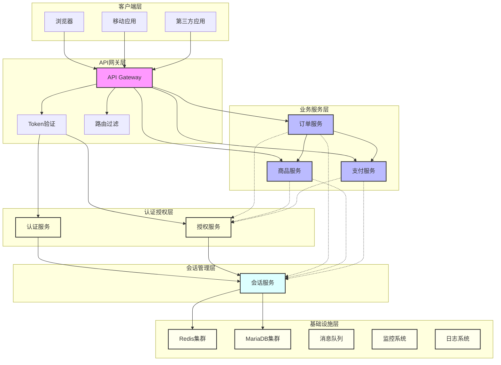
```mermaid
graph TD
    subgraph 客户端层
        Browser[浏览器]
        MobileApp[移动应用]
        ThirdParty[第三方应用]
    end

    subgraph API网关层
        Gateway[API Gateway]
        Gateway --> TokenValidate[Token验证]
        Gateway --> RouteFilter[路由过滤]
    end

    subgraph 认证授权层
        TokenValidate --> AuthService[认证服务]
        TokenValidate --> AuthorizationService[授权服务]
    end

    subgraph 会话管理层
        AuthService --> SessionService[会话服务]
        AuthorizationService --> SessionService
    end

    subgraph 业务服务层
        OrderService[订单服务]
        ProductService[商品服务]
        PaymentService[支付服务]
    end

    subgraph 基础设施层
        SessionService --> Cache[Redis集群]
        SessionService --> DB[MariaDB集群]
        Cache
        DB
        MQ[消息队列]
        Monitor[监控系统]
        Log[日志系统]
    end

    %% 客户端到网关的调用
    Browser --> Gateway
    MobileApp --> Gateway
    ThirdParty --> Gateway

    %% 网关到业务服务的调用
    Gateway --> OrderService
    Gateway --> ProductService
    Gateway --> PaymentService

    %% 服务间直接调用
    OrderService --> ProductService
    OrderService --> PaymentService
    
    %% 业务服务获取会话和权限
    OrderService -.-> SessionService
    ProductService -.-> SessionService
    PaymentService -.-> SessionService
    OrderService -.-> AuthorizationService
    ProductService -.-> AuthorizationService
    PaymentService -.-> AuthorizationService

    %% 样式定义
    classDef gateway fill:#f9f,stroke:#333,stroke-width:2px;
    classDef service fill:#bbf,stroke:#333,stroke-width:2px;
    classDef storage fill:#dfd,stroke:#333,stroke-width:2px;
    classDef auth fill:#ffd,stroke:#333,stroke-width:2px;
    classDef session fill:#dff,stroke:#333,stroke-width:2px;
    classDef infra fill:#ffe,stroke:#333,stroke-width:2px;
    
    class Gateway gateway;
    class AuthService,AuthorizationService auth;
    class SessionService session;
    class OrderService,ProductService,PaymentService service;
    class Cache,DB,MQ,Monitor,Log infra;
```

架构层次说明：
1. **客户端层**：处理各类客户端接入

2. **API网关层**：
   - 统一接入点
   - Token初步验证
   - 请求路由

3. **认证授权层**：
   - 认证服务：处理用户认证
   - 授权服务：处理权限验证

4. **会话管理层**：
   - 会话服务：核心会话管理
   - 会话状态维护
   - 会话生命周期管理

5. **业务服务层**：
   - 各个微服务
   - 业务功能实现

6. **基础设施层**：
   - Redis集群：分布式缓存
   - MariaDB集群：数据持久化
   - 消息队列：异步通信
   - 监控系统：系统监控
   - 日志系统：日志收集

这样的分层更加清晰，职责划分更加合理，会话服务作为独立的会话管理层的核心组件，为上层提供统一的会话管理能力。

主要改进：
1. 增加了独立的认证授权层
2. 将认证服务(AuthService)和授权服务(AuthorizationService)分开
3. 明确了业务服务对会话服务和授权服务的调用关系
4. 优化了分层结构，使职责更清晰

服务职责说明：
1. **认证服务(AuthService)**
   - 负责用户身份认证
   - 管理用户登录状态
   - 生成访问令牌
   - 处理多因素认证

2. **授权服务(AuthorizationService)**
   - 负责权限验证
   - 管理角色和权限
   - 处理访问控制
   - 提供权限查询接口

3. **会话服务(SessionService)**
   - 管理会话生命周期
   - 存储会话信息
   - 处理会话同步
   - 提供会话查询接口

这样的架构设计更符合单一职责原则，同时也便于各服务的独立扩展和维护。

## 2. 关键流程说明

1. **用户认证流程**
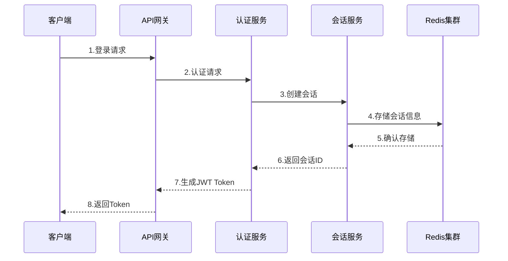
```mermaid
sequenceDiagram
    participant Client as 客户端
    participant Gateway as API网关
    participant Auth as 认证服务
    participant Session as 会话服务
    participant Redis as Redis集群
    
    Client->>Gateway: 1.登录请求
    Gateway->>Auth: 2.认证请求
    Auth->>Session: 3.创建会话
    Session->>Redis: 4.存储会话信息
    Redis-->>Session: 5.确认存储
    Session-->>Auth: 6.返回会话ID
    Auth-->>Gateway: 7.生成JWT Token
    Gateway-->>Client: 8.返回Token
```

2. **业务请求流程**
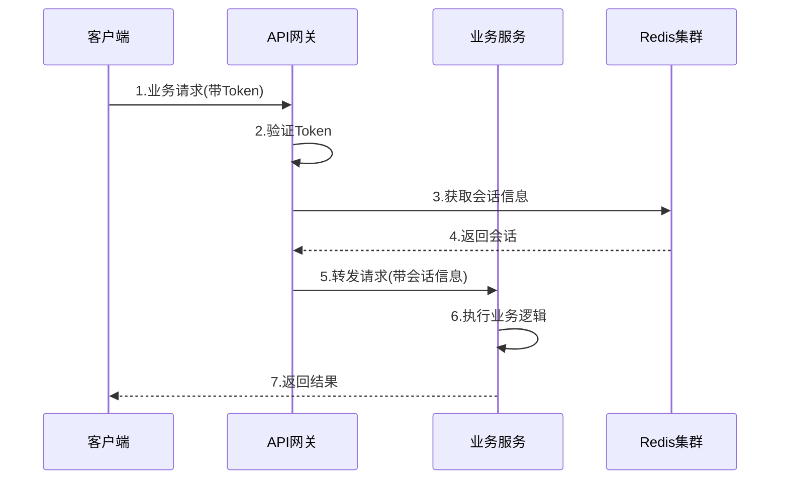
```mermaid
sequenceDiagram
    participant Client as 客户端
    participant Gateway as API网关
    participant Service as 业务服务
    participant Redis as Redis集群
    
    Client->>Gateway: 1.业务请求(带Token)
    Gateway->>Gateway: 2.验证Token
    Gateway->>Redis: 3.获取会话信息
    Redis-->>Gateway: 4.返回会话
    Gateway->>Service: 5.转发请求(带会话信息)
    Service->>Service: 6.执行业务逻辑
    Service-->>Client: 7.返回结果
```

3. **服务间调用流程**
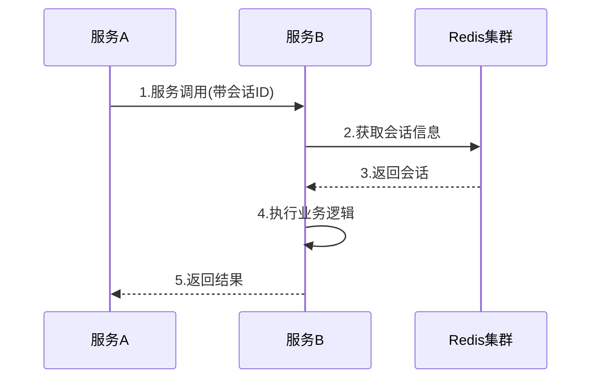
```mermaid
sequenceDiagram
    participant ServiceA as 服务A
    participant ServiceB as 服务B
    participant Redis as Redis集群
    
    ServiceA->>ServiceB: 1.服务调用(带会话ID)
    ServiceB->>Redis: 2.获取会话信息
    Redis-->>ServiceB: 3.返回会话
    ServiceB->>ServiceB: 4.执行业务逻辑
    ServiceB-->>ServiceA: 5.返回结果
```

## 3. 架构说明

1. **核心组件**
   - API Gateway: 统一的接入层,负责认证和路由
   - 会话服务: 管理会话生命周期
   - Redis集群: 存储会话信息
   - 业务服务: 各个微服务

2. **关键特性**
   - 集中式会话管理
   - 分布式缓存存储
   - 服务间直接调用
   - 会话信息按需获取

3. **数据流转**
   - 客户端通过API Gateway访问系统
   - Gateway验证Token后转发请求
   - 服务间可以直接调用
   - 会话信息统一存储在Redis

4. **安全控制**
   - 统一的认证授权
   - Token的有效性验证
   - 会话信息的安全存储
   - 服务间调用的权限控制

### 3.2 会话同步流程

#### 3.2.1 同步场景
1. **跨服务同步**
   - 用户在微服务A登录后访问微服务B
   - 会话状态变更需要同步到其他服务
   - 用户权限变更需要实时生效
   - 会话注销需要广播通知

2. **跨终端同步**
   - 用户在PC端登录后切换到移动端
   - 多设备同时在线状态维护
   - 会话状态实时同步
   - 单点登出能力支持

3. **跨数据中心同步**
   - 多机房部署场景下的会话同步
   - 异地多活架构下的数据一致性
   - 灾备切换时的会话恢复
   - 全球化部署的就近接入

#### 3.2.2 同步架构
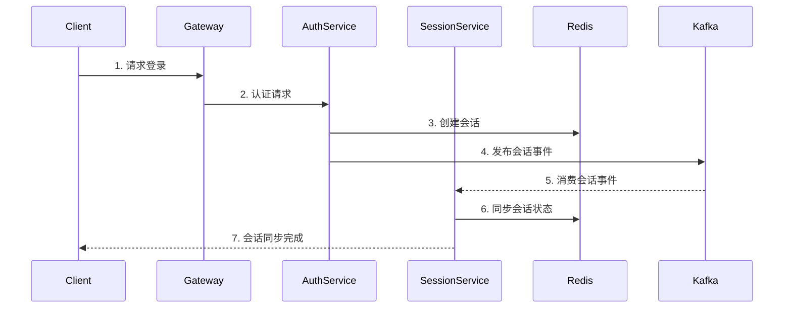
```mermaid
sequenceDiagram
    participant Client
    participant Gateway
    participant AuthService
    participant SessionService
    participant Redis
    participant Kafka
    
    Client->>Gateway: 1. 请求登录
    Gateway->>AuthService: 2. 认证请求
    AuthService->>Redis: 3. 创建会话
    AuthService->>Kafka: 4. 发布会话事件
    Kafka-->>SessionService: 5. 消费会话事件
    SessionService->>Redis: 6. 同步会话状态
    SessionService-->>Client: 7. 会话同步完成
```

#### 3.2.3 核心流程

1. **会话创建同步**
   ```mermaid
   graph TD
     A[用户登录] --> B[创建主会话]
     B --> C[生成会话Token]
     C --> D[写入Redis主节点]
     D --> E[异步复制到从节点]
     E --> F[发布同步事件]
     F --> G[其他服务更新缓存]
   ```

2. **会话更新同步**
   - 状态更新流程
     * 检查会话有效性
     * 更新会话状态
     * 写入主存储
     * 触发同步事件
     * 广播状态变更

   - 数据一致性保证
     * 采用最终一致性模型
     * 使用版本号机制
     * 冲突检测和解决
     * 失败重试机制

3. **会话注销同步**
   - 主动注销流程
     * 接收注销请求
     * 清理本地会话
     * 发布注销事件
     * 等待确认响应
     * 返回注销结果

   - 被动失效处理
     * 会话超时检测
     * 异常行为检测
     * 强制注销处理
     * 清理相关资源

#### 3.2.4 技术实现

1. **存储层设计**
   ```json
   {
     "sessionId": "uuid",
     "userId": "12345",
     "createTime": "timestamp",
     "updateTime": "timestamp",
     "expireTime": "timestamp",
     "version": 1,
     "status": "active",
     "devices": ["web", "mobile"],
     "attributes": {
       "roles": ["admin"],
       "permissions": ["read", "write"]
     }
   }
   ```

2. **消息格式设计**
   ```json
   {
     "type": "SESSION_UPDATE",
     "timestamp": "2023-12-01T10:00:00Z",
     "data": {
       "sessionId": "uuid",
       "action": "update",
       "changes": {
         "status": "active",
         "attributes": {}
       },
       "version": 2
     }
   }
   ```

3. **同步策略**
   - 实时同步
     * 关键状态变更
     * 安全相关更新
     * 用户主动操作
   
   - 延迟同步
     * 非关键属性更新
     * 统计数据更新
     * 批量数据处理
4. **异常处理**
   - 网络异常
     * 重试机制
     * 降级策略
     * 日志记录
   
   - 数据异常
     * 数据校验
     * 回滚机制
     * 告警通知

#### 3.2.5 性能优化

1. **同步性能优化**
   - 采用异步处理
   - 批量同步策略
   - 增量同步机制
   - 压缩传输数据

2. **存储性能优化**
   - 多级缓存架构
   - 热点数据缓存
   - 冷数据归档
   - 定期清理机制

3. **网络性能优化**
   - 就近接入
   - 消息压缩
   - 连接复用
   - 流量控制

#### 跨服务同步详解

1. **场景说明**
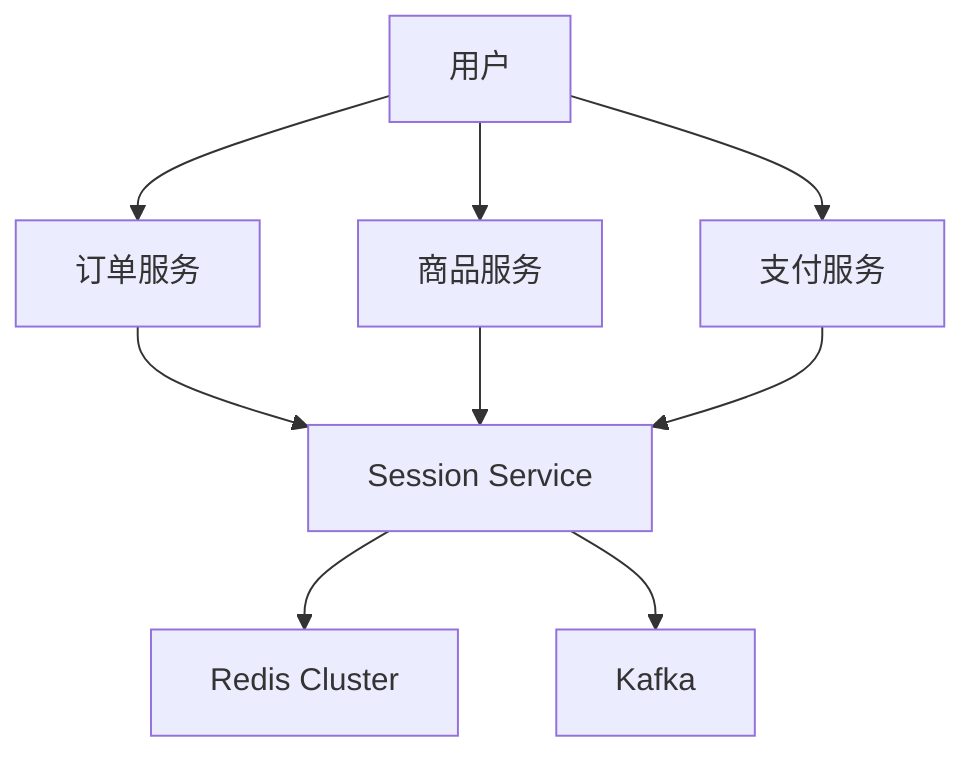
```mermaid
graph TD
    A[用户] --> B[订单服务]
    A --> C[商品服务]
    A --> D[支付服务]
    B --> E[Session Service]
    C --> E
    D --> E
    E --> F[Redis Cluster]
    E --> G[Kafka]
```

2. **典型业务场景**
   - **场景一：跨服务访问**
     ```mermaid
     sequenceDiagram
         User->>OrderService: 1.下单请求
         OrderService->>SessionService: 2.验证会话
         SessionService->>Redis: 3.获取会话
         OrderService->>PaymentService: 4.创建支付
         PaymentService->>SessionService: 5.验证会话
         SessionService->>Redis: 6.获取相同会话
     ```
   
   - **场景二：权限变更**
     ```mermaid
     sequenceDiagram
         Admin->>AuthService: 1.修改用户权限
         AuthService->>Redis: 2.更新会话
         AuthService->>Kafka: 3.发布权限变更事件
         Kafka->>OrderService: 4.同步权限
         Kafka->>PaymentService: 5.同步权限
         Kafka->>ProductService: 6.同步权限
     ```

3. **关键实现细节**
   ```java
   @Service
   public class SessionSyncService {
       // 会话同步处理
       public void syncSession(String sessionId, SessionUpdateEvent event) {
           // 1. 版本检查
           if (!isLatestVersion(sessionId, event.getVersion())) {
               return;
           }
           
           // 2. 更新本地缓存
           localSessionCache.update(sessionId, event.getChanges());
           
           // 3. 广播到其他服务
           kafkaTemplate.send("session-sync", event);
           
           // 4. 等待确认
           waitForAcks(sessionId, event.getVersion());
       }
   }
   ```

4. **数据同步策略**
   - **实时同步场景**
     * 用户权限变更
     * 登录状态变化
     * 安全策略更新
     * Token刷新

   - **准实时同步场景**
     * 用户偏好设置
     * 界面配置更新
     * 非关键属性变更
     * 统计数据更新

5. **异常处理机制**
   ```java
   @Component
   public class SessionSyncErrorHandler {
       public void handleSyncError(SessionSyncException ex) {
           switch (ex.getType()) {
               case NETWORK_TIMEOUT:
                   // 1. 重试机制
                   retrySync(ex.getSessionId());
                   break;
               case VERSION_CONFLICT:
                   // 2. 冲突解决
                   resolveConflict(ex.getSessionId());
                   break;
               case DATA_CORRUPTION:
                   // 3. 数据修复
                   repairSession(ex.getSessionId());
                   break;
           }
       }
   }
   ```

6. **性能优化方案**
   - **缓存优化**
     * 本地缓存(Caffeine)
     * 分布式缓存(Redis)
     * 多级缓存策略
     * 缓存预热机制

   - **同步优化**
     * 批量同步
     * 增量同步
     * 压缩传输
     * 异步处理

7. **监控指标**
   ```yaml
   metrics:
     sync:
       - name: session_sync_latency
         type: histogram
         labels: [service, operation]
       - name: sync_failure_rate
         type: counter
         labels: [service, error_type]
       - name: sync_queue_size
         type: gauge
         labels: [service]
   ```

#### 集中式会话管理设计

1. **架构说明**
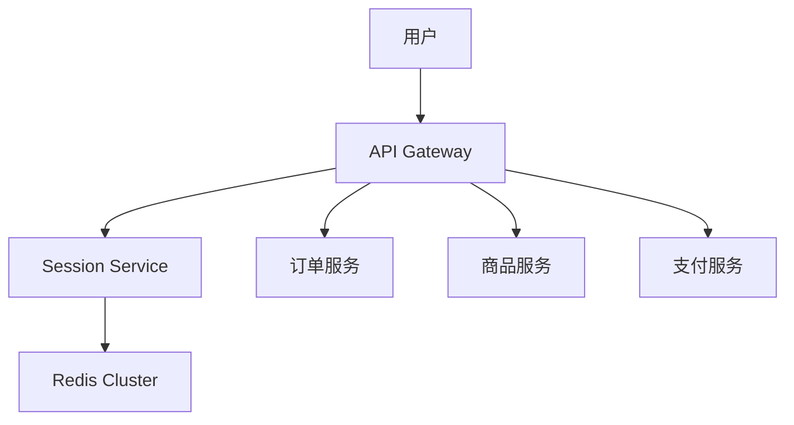
```mermaid
graph TD
    A[用户] --> B[API Gateway]
    B --> C[Session Service]
    C --> D[Redis Cluster]
    B --> E[订单服务]
    B --> F[商品服务]
    B --> G[支付服务]
```

2. **认证流程**
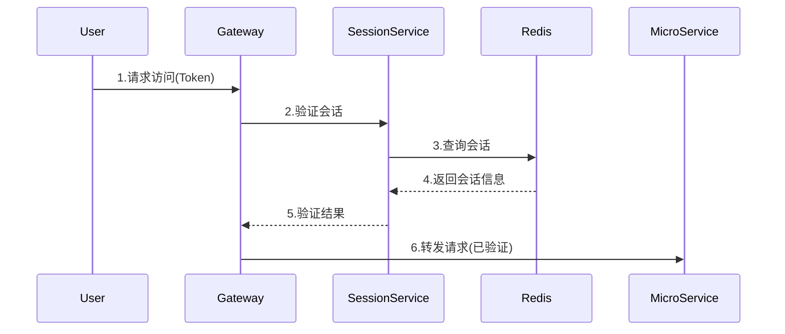
```mermaid
sequenceDiagram
    participant User
    participant Gateway
    participant SessionService
    participant Redis
    
    User->>Gateway: 1.请求访问(Token)
    Gateway->>SessionService: 2.验证会话
    SessionService->>Redis: 3.查询会话
    Redis-->>SessionService: 4.返回会话信息
    SessionService-->>Gateway: 5.验证结果
    Gateway->>MicroService: 6.转发请求(已验证)
```

3. **核心优势**
   - **简化架构**
     * 统一会话管理入口
     * 减少服务间耦合
     * 简化认证逻辑
     * 提高系统可维护性

   - **性能提升**
     * 减少网络调用
     * 降低延迟
     * 减少资源消耗
     * 提高响应速度

   - **安全增强**
     * 统一安全控制
     * 集中式权限验证
     * 简化安全审计
     * 降低攻击面

4. **实现要点**
   ```java
   @Service
   public class GatewaySessionFilter {
       @Autowired
       private SessionService sessionService;
       
       public Mono<Void> filter(ServerWebExchange exchange) {
           // 1. 获取Token
           String token = getToken(exchange);
           
           // 2. 验证会话
           return sessionService.validateSession(token)
               .flatMap(session -> {
                   // 3. 添加用户信息到Header
                   addSessionInfo(exchange, session);
                   
                   // 4. 转发到微服务
                   return chain.filter(exchange);
               });
       }
   }
   ```

5. **配置说明**
   ```yaml
   gateway:
     routes:
       - id: order-service
         uri: lb://order-service
         predicates:
           - Path=/api/orders/**
         filters:
           - SessionAuth
           - AddSessionInfo
   ```

6. **异常处理**
   ```java
   @Component
   public class SessionAuthExceptionHandler {
       public Mono<Void> handle(SessionAuthException ex) {
           switch (ex.getType()) {
               case TOKEN_EXPIRED:
                   return handleExpiredToken();
               case INVALID_TOKEN:
                   return handleInvalidToken();
               case SESSION_NOT_FOUND:
                   return handleSessionNotFound();
           }
       }
   }
   ```

### 3.2.1 集中式会话管理流程

1. **核心流程**
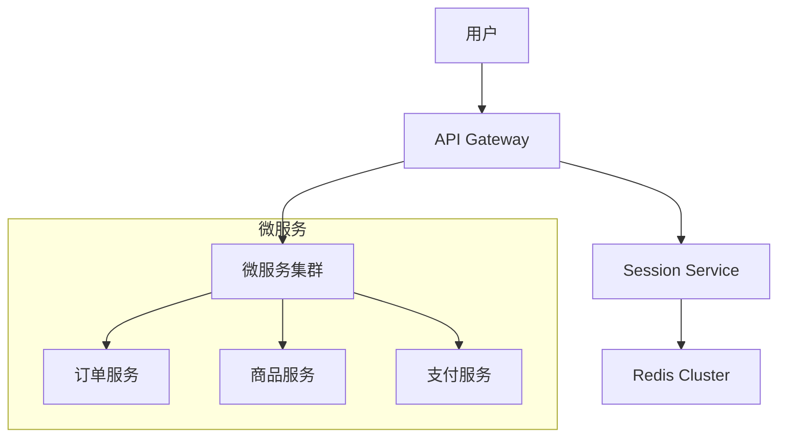
```mermaid
graph TD
    A[用户] --> B[API Gateway]
    B --> C[Session Service]
    C --> D[Redis Cluster]
    B --> E[微服务集群]
    
    subgraph 微服务
    E --> E1[订单服务]
    E --> E2[商品服务]
    E --> E3[支付服务]
    end
```

2. **认证流程**
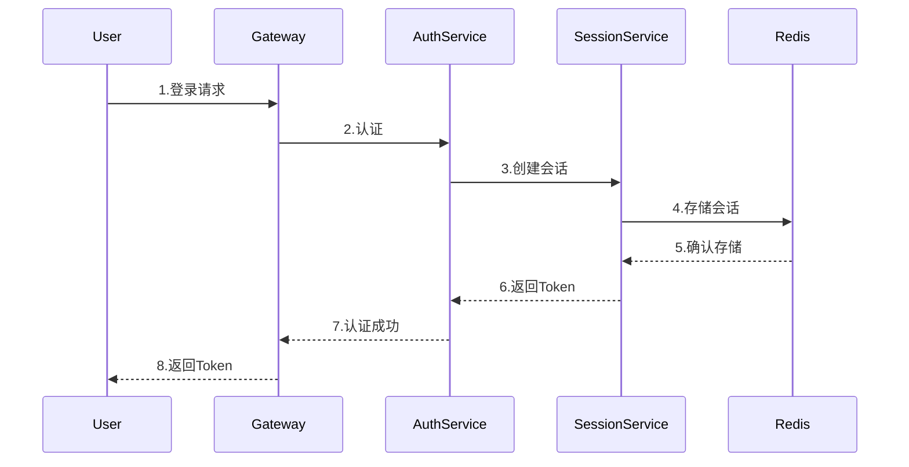
```mermaid
sequenceDiagram
    participant User
    participant Gateway
    participant AuthService
    participant SessionService
    participant Redis
    
    User->>Gateway: 1.登录请求
    Gateway->>AuthService: 2.认证
    AuthService->>SessionService: 3.创建会话
    SessionService->>Redis: 4.存储会话
    Redis-->>SessionService: 5.确认存储
    SessionService-->>AuthService: 6.返回Token
    AuthService-->>Gateway: 7.认证成功
    Gateway-->>User: 8.返回Token
```

3. **会话验证流程**
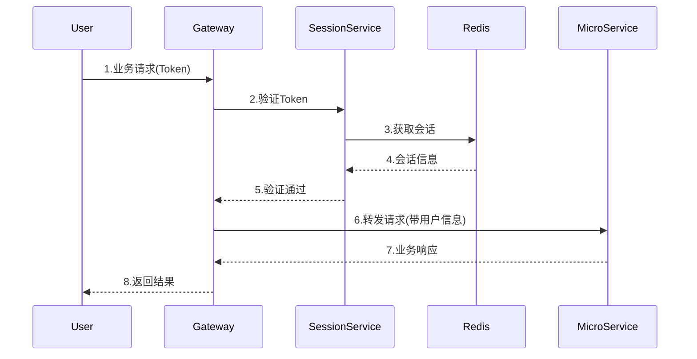
```mermaid
sequenceDiagram
    participant User
    participant Gateway
    participant SessionService
    participant Redis
    participant MicroService
    
    User->>Gateway: 1.业务请求(Token)
    Gateway->>SessionService: 2.验证Token
    SessionService->>Redis: 3.获取会话
    Redis-->>SessionService: 4.会话信息
    SessionService-->>Gateway: 5.验证通过
    Gateway->>MicroService: 6.转发请求(带用户信息)
    MicroService-->>Gateway: 7.业务响应
    Gateway-->>User: 8.返回结果
```

4. **会话管理策略**
   - **会话创建**
     * Token生成与分发
     * 会话信息存储
     * 过期时间设置
     * 会话属性初始化

   - **会话维护**
     * 会话状态检查
     * 自动续期机制
     * 会话属性更新
     * 异常会话清理

   - **会话失效**
     * 主动注销处理
     * 超时自动失效
     * 安全策略失效
     * 会话清理机制

5. **安全控制**
   ```java
   @Service
   public class SessionSecurityService {
       public SessionValidateResult validateSession(String token) {
           // 1. Token合法性验证
           if (!tokenValidator.validate(token)) {
               return SessionValidateResult.invalid();
           }
           
           // 2. 会话状态检查
           SessionInfo session = sessionStore.get(token);
           if (session == null || session.isExpired()) {
               return SessionValidateResult.expired();
           }
           
           // 3. 安全策略检查
           if (!securityPolicyChecker.check(session)) {
               return SessionValidateResult.forbidden();
           }
           
           // 4. 自动续期处理
           if (session.needRenew()) {
               sessionStore.renew(token);
           }
           
           return SessionValidateResult.ok(session);
       }
   }
   ```

6. **性能优化**
   - **缓存优化**
     * Gateway本地缓存
     * Redis集群缓存
     * 多级缓存策略
     * 缓存预热机制

   - **请求优化**
     * 批量处理
     * 异步处理
     * 并发控制
     * 限流保护

7. **监控指标**
   ```yaml
   metrics:
     session:
       - name: active_sessions
         type: gauge
         help: "当前活跃会话数"
       
       - name: auth_requests
         type: counter
         labels: [status, type]
         help: "认证请求统计"
       
       - name: session_validate_latency
         type: histogram
         buckets: [10ms, 50ms, 100ms, 200ms]
         help: "会话验证延迟分布"
       
       - name: token_errors
         type: counter
         labels: [error_type]
         help: "Token错误统计"
   ```

### 3.2.2 服务间调用方案

1. **架构设计**
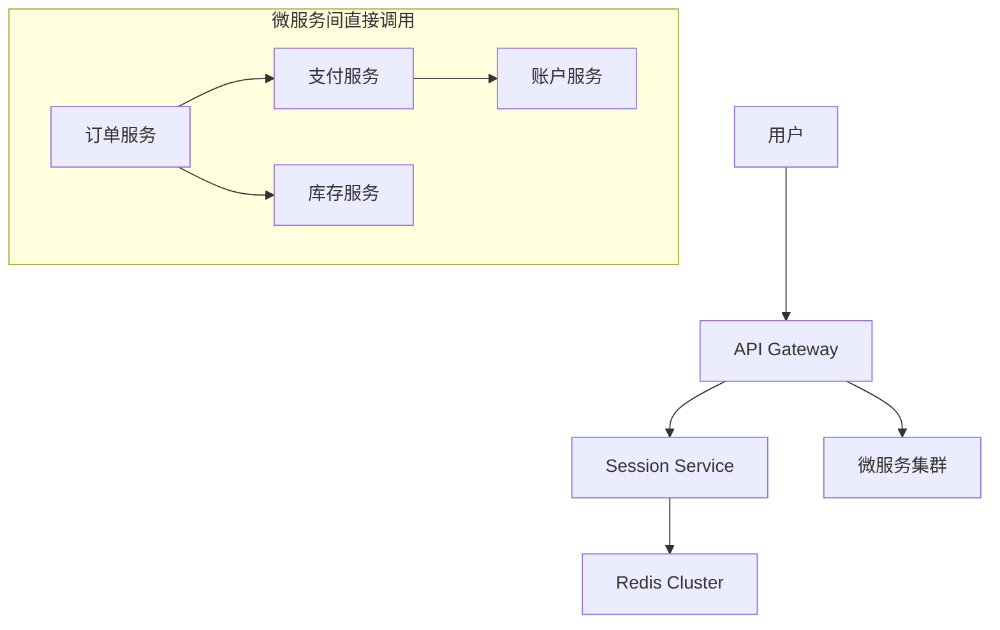
```mermaid
graph TD
    A[用户] --> B[API Gateway]
    B --> C[Session Service]
    C --> D[Redis Cluster]
    B --> E[微服务集群]
    
    subgraph 微服务间直接调用
    E1[订单服务] --> E2[支付服务]
    E1 --> E3[库存服务]
    E2 --> E4[账户服务]
    end
```

2. **服务间调用流程**
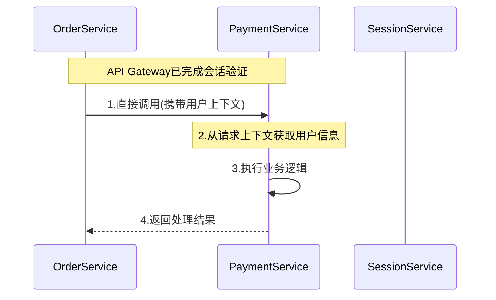
```mermaid
sequenceDiagram
    participant OrderService
    participant PaymentService
    participant SessionService
    
    Note over OrderService,PaymentService: API Gateway已完成会话验证
    OrderService->>PaymentService: 1.直接调用(携带用户上下文)
    Note over PaymentService: 2.从请求上下文获取用户信息
    PaymentService->>PaymentService: 3.执行业务逻辑
    PaymentService-->>OrderService: 4.返回处理结果
```

3. **用户上下文传递**
```java
@Component
public class UserContextHolder {
    private static final ThreadLocal<UserContext> userContext = new ThreadLocal<>();
    
    // Gateway验证后，将用户信息放入请求上下文
    public static void setContext(UserContext context) {
        userContext.set(context);
    }
    
    // 微服务获取用户信息
    public static UserContext getContext() {
        return userContext.get();
    }
    
    // 请求完成后清理
    public static void clear() {
        userContext.remove();
    }
}
```

4. **Feign调用配置**
```java
@Configuration
public class FeignConfig {
    @Bean
    public RequestInterceptor userContextInterceptor() {
        return template -> {
            UserContext context = UserContextHolder.getContext();
            if (context != null) {
                template.header("X-User-Id", context.getUserId());
                template.header("X-User-Roles", context.getRoles());
                template.header("X-Tenant-Id", context.getTenantId());
            }
        };
    }
}
```

5. **服务间安全控制**
```java
@Aspect
@Component
public class ServiceSecurityAspect {
    @Around("@annotation(requiresPermission)")
    public Object checkPermission(ProceedingJoinPoint pjp, 
                                RequiresPermission requiresPermission) {
        UserContext context = UserContextHolder.getContext();
        if (context == null) {
            throw new SecurityException("No user context found");
        }
        
        if (!context.hasPermission(requiresPermission.value())) {
            throw new SecurityException("Permission denied");
        }
        
        return pjp.proceed();
    }
}
```

6. **性能优化**
   - **上下文传递优化**
     * 精简上下文信息
     * 使用紧凑序列化
     * 异步传递机制
     * 缓存用户权限

   - **调用链路优化**
     * 服务直连
     * 连接池复用
     * 超时控制
     * 熔断降级

7. **监控指标**
```yaml
metrics:
  service:
    - name: service_call_latency
      type: histogram
      help: "服务间调用延迟"
      
    - name: context_propagation_errors
      type: counter
      help: "上下文传递错误"
      
    - name: permission_check_failures
      type: counter
      help: "权限检查失败次数"

### 3.2.5 数据权限设计

1. **数据权限模型**
```java
@Data
public class DataPermission {
    private String userId;        // 用户ID
    private String tenantId;      // 租户ID
    private String roleId;        // 角色ID
    private Set<String> deptIds;  // 部门权限范围
    private Set<String> dataScopes; // 数据范围
    private Map<String, String> conditions; // 数据过滤条件
}
```

2. **权限传递流程**
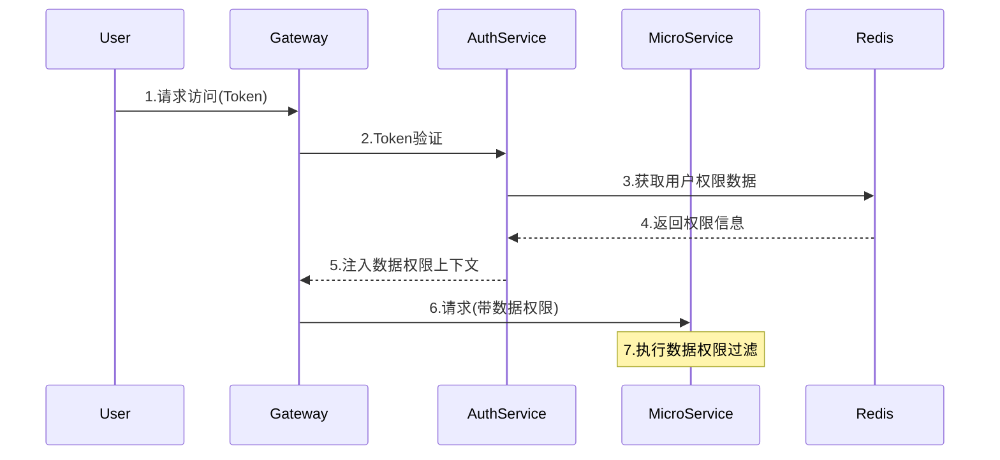
```mermaid
sequenceDiagram
    participant User
    participant Gateway
    participant AuthService
    participant MicroService
    participant Redis
    
    User->>Gateway: 1.请求访问(Token)
    Gateway->>AuthService: 2.Token验证
    AuthService->>Redis: 3.获取用户权限数据
    Redis-->>AuthService: 4.返回权限信息
    AuthService-->>Gateway: 5.注入数据权限上下文
    Gateway->>MicroService: 6.请求(带数据权限)
    Note over MicroService: 7.执行数据权限过滤
```

3. **数据权限实现**
```java
@Aspect
@Component
public class DataPermissionAspect {
    
    @Around("@annotation(dataAuth)")
    public Object handleDataPermission(ProceedingJoinPoint pjp, 
                                     DataAuth dataAuth) {
        // 1. 获取数据权限上下文
        DataPermission permission = DataPermissionHolder.get();
        
        // 2. 构建权限过滤条件
        QueryWrapper<?> queryWrapper = buildPermissionWrapper(permission);
        
        // 3. 注入过滤条件
        Object[] args = pjp.getArgs();
        injectPermissionCondition(args, queryWrapper);
        
        // 4. 执行原始查询
        return pjp.proceed(args);
    }
    
    private QueryWrapper<?> buildPermissionWrapper(DataPermission permission) {
        QueryWrapper<?> wrapper = new QueryWrapper<>();
        
        // 租户隔离
        if (permission.getTenantId() != null) {
            wrapper.eq("tenant_id", permission.getTenantId());
        }
        
        // 部门数据权限
        if (!permission.getDeptIds().isEmpty()) {
            wrapper.in("dept_id", permission.getDeptIds());
        }
        
        // 自定义数据范围
        if (!permission.getDataScopes().isEmpty()) {
            wrapper.in("scope_type", permission.getDataScopes());
        }
        
        // 其他过滤条件
        permission.getConditions().forEach((k, v) -> 
            wrapper.eq(k, v)
        );
        
        return wrapper;
    }
}
```

4. **使用示例**
```java
@Service
public class OrderService {
    
    @DataAuth(type = "order")
    public List<Order> queryOrders(OrderQuery query) {
        return orderMapper.selectList(query);
    }
    
    @DataAuth(type = "order", mode = "write")
    public void createOrder(Order order) {
        // 创建订单时自动注入数据权限相关字段
        orderMapper.insert(order);
    }
}
```

5. **权限缓存设计**
```java
@Service
public class DataPermissionService {
    
    @Autowired
    private RedisTemplate redisTemplate;
    
    public DataPermission loadPermission(String userId) {
        String cacheKey = "data_permission:" + userId;
        
        // 1. 查询缓存
        DataPermission cached = redisTemplate.opsForValue()
            .get(cacheKey);
        if (cached != null) {
            return cached;
        }
        
        // 2. 构建权限数据
        DataPermission permission = buildPermission(userId);
        
        // 3. 更新缓存
        redisTemplate.opsForValue()
            .set(cacheKey, permission, 30, TimeUnit.MINUTES);
            
        return permission;
    }
}
```

6. **权限更新机制**
```java
@Service
public class PermissionUpdateService {
    
    @Autowired
    private KafkaTemplate<String, PermissionUpdateEvent> kafkaTemplate;
    
    public void updatePermission(String userId) {
        // 1. 清除本地缓存
        DataPermissionHolder.remove(userId);
        
        // 2. 清除Redis缓存
        redisTemplate.delete("data_permission:" + userId);
        
        // 3. 发布权限更新事件
        PermissionUpdateEvent event = new PermissionUpdateEvent(userId);
        kafkaTemplate.send("permission-updates", event);
    }
}
```

核心特点：
1. 数据权限与认证授权分离
2. 支持多维度的权限控制
3. 性能优化的缓存机制
4. 灵活的权限更新机制
5. 可扩展的权限模型设计

### 3.2.6 会话上下文设计

1. **会话上下文数据结构**
```java
@Data
public class SessionContext implements Serializable {
    // 基础信息
    private String sessionId;          // 会话ID
    private String userId;             // 用户ID
    private String tenantId;           // 租户ID
    private Long createTime;           // 创建时间
    private Long lastAccessTime;       // 最后访问时间
    private String deviceInfo;         // 设备信息
    
    // 用户信息
    private UserInfo userInfo;         // 用户基本信息
    @Data
    public static class UserInfo {
        private String username;       // 用户名
        private String realName;       // 真实姓名
        private String email;          // 邮箱
        private String phone;          // 电话
        private String avatar;         // 头像
        private String status;         // 状态
    }
    
    // 认证信息
    private AuthInfo authInfo;         // 认证信息
    @Data
    public static class AuthInfo {
        private String tokenId;        // Token ID
        private String loginType;      // 登录类型
        private Set<String> roles;     // 角色列表
        private Set<String> permissions; // 权限列表
        private boolean mfaEnabled;    // 是否启用多因素认证
        private Map<String, Object> authDetails; // 认证详情
    }
    
    // 权限信息
    private PermissionInfo permissionInfo; // 权限信息
    @Data
    public static class PermissionInfo {
        private Set<String> deptIds;   // 部门权限
        private Set<String> dataScopes; // 数据范围
        private Map<String, String> conditions; // 数据过滤条件
        private Map<String, Integer> levels; // 权限等级
    }
    
    // 业务信息
    private Map<String, Object> businessContext; // 业务上下文
    private Map<String, String> attributes;      // 扩展属性
    
    // 安全信息
    private SecurityContext securityContext;    // 安全上下文
    @Data
    public static class SecurityContext {
        private String loginIp;        // 登录IP
        private String userAgent;      // 用户代理
        private String fingerprint;    // 设备指纹
        private Integer riskLevel;     // 风险等级
        private Set<String> grantedIps; // 授权IP列表
    }
}
```

2. **上下文管理**
```java
@Component
public class SessionContextManager {
    @Autowired
    private RedisTemplate<String, SessionContext> redisTemplate;
    
    private static final ThreadLocal<SessionContext> contextHolder = new ThreadLocal<>();
    
    // 创建会话上下文
    public SessionContext createContext(String userId, AuthInfo authInfo) {
        SessionContext context = new SessionContext();
        context.setSessionId(generateSessionId());
        context.setUserId(userId);
        context.setCreateTime(System.currentTimeMillis());
        context.setAuthInfo(authInfo);
        
        // 加载用户信息
        context.setUserInfo(loadUserInfo(userId));
        // 加载权限信息
        context.setPermissionInfo(loadPermissionInfo(userId));
        // 设置安全信息
        context.setSecurityContext(buildSecurityContext());
        
        // 保存到Redis
        saveContext(context);
        return context;
    }
    
    // 获取上下文
    public SessionContext getContext(String sessionId) {
        // 1. 从ThreadLocal获取
        SessionContext context = contextHolder.get();
        if (context != null) {
            return context;
        }
        
        // 2. 从Redis获取
        context = redisTemplate.opsForValue().get("session:" + sessionId);
        if (context != null) {
            // 设置到ThreadLocal
            contextHolder.set(context);
        }
        
        return context;
    }
    
    // 更新上下文
    public void updateContext(SessionContext context) {
        // 1. 更新最后访问时间
        context.setLastAccessTime(System.currentTimeMillis());
        
        // 2. 保存到Redis
        saveContext(context);
        
        // 3. 更新ThreadLocal
        contextHolder.set(context);
    }
}
```

3. **上下文传递**
```java
@Component
public class ContextPropagationInterceptor implements HandlerInterceptor {
    
    @Override
    public boolean preHandle(HttpServletRequest request, 
                           HttpServletResponse response, 
                           Object handler) {
        // 1. 从请求头获取会话信息
        String sessionId = request.getHeader("X-Session-Id");
        String token = request.getHeader("Authorization");
        
        // 2. 验证Token并获取上下文
        SessionContext context = sessionContextManager.getContext(sessionId);
        if (context != null && validateToken(token, context)) {
            // 3. 设置到ThreadLocal
            SessionContextHolder.setContext(context);
            return true;
        }
        
        return false;
    }
    
    @Override
    public void afterCompletion(HttpServletRequest request, 
                              HttpServletResponse response, 
                              Object handler, 
                              Exception ex) {
        // 清理ThreadLocal
        SessionContextHolder.clear();
    }
}
```

4. **上下文序列化**
```java
@Configuration
public class SessionContextSerializationConfig {
    
    @Bean
    public RedisTemplate<String, SessionContext> redisTemplate() {
        RedisTemplate<String, SessionContext> template = new RedisTemplate<>();
        
        // 使用JSON序列化
        Jackson2JsonRedisSerializer<SessionContext> serializer = 
            new Jackson2JsonRedisSerializer<>(SessionContext.class);
            
        // 配置序列化器
        template.setKeySerializer(new StringRedisSerializer());
        template.setValueSerializer(serializer);
        template.setHashKeySerializer(new StringRedisSerializer());
        template.setHashValueSerializer(serializer);
        
        return template;
    }
}
```

5. **上下文安全控制**
```java
@Aspect
@Component
public class SessionContextSecurityAspect {
    
    @Around("@annotation(secured)")
    public Object checkSecurity(ProceedingJoinPoint pjp, 
                              Secured secured) {
        SessionContext context = SessionContextHolder.getContext();
        
        // 1. 验证会话有效性
        if (!isSessionValid(context)) {
            throw new SessionInvalidException();
        }
        
        // 2. 检查权限
        if (!hasPermission(context, secured.value())) {
            throw new AccessDeniedException();
        }
        
        // 3. 检查风险等级
        if (context.getSecurityContext().getRiskLevel() > secured.riskLevel()) {
            throw new SecurityException("Risk level too high");
        }
        
        return pjp.proceed();
    }
}
```

核心特点：
1. 完整的用户和权限信息
2. 支持业务扩展属性
3. 多级缓存管理
4. 安全控制集成
5. 序列化和传递机制

### 3.2.7 Token与会话上下文设计

1. **JWT Token设计**
```java
@Data
public class JwtToken {
    // 只包含必要的信息
    private String sessionId;    // 会话ID(用于关联SessionContext)
    private String userId;       // 用户ID 
    private String tenantId;     // 租户ID
    private Long expireTime;     // 过期时间
    private String deviceId;     // 设备ID
    private String tokenType;    // Token类型(如: Bearer)
    private String signature;    // 签名
}
```

2. **Token生成与验证**
```java
@Service
public class TokenService {
    @Value("${jwt.secret}")
    private String secret;
    
    // 生成Token
    public String generateToken(SessionContext context) {
        return JWT.create()
            .withClaim("sessionId", context.getSessionId())
            .withClaim("userId", context.getUserId())
            .withClaim("tenantId", context.getTenantId())
            .withClaim("deviceId", context.getDeviceInfo())
            .withExpiresAt(new Date(System.currentTimeMillis() + 3600000))
            .sign(Algorithm.HMAC256(secret));
    }
    
    // 验证Token并提取基础信息
    public JwtToken validateToken(String token) {
        try {
            DecodedJWT jwt = JWT.require(Algorithm.HMAC256(secret))
                .build()
                .verify(token);
                
            JwtToken jwtToken = new JwtToken();
            jwtToken.setSessionId(jwt.getClaim("sessionId").asString());
            jwtToken.setUserId(jwt.getClaim("userId").asString());
            // ... 设置其他基础信息
            return jwtToken;
        } catch (JWTVerificationException e) {
            throw new TokenInvalidException();
        }
    }
}
```

3. **请求处理流程**
```mermaid
sequenceDiagram
    participant Client
    participant Gateway
    participant Service
    participant Redis
    
    Client->>Gateway: 1.请求(带JWT Token)
    Gateway->>Gateway: 2.验证Token基础信息
    Gateway->>Redis: 3.获取SessionContext
    Redis-->>Gateway: 4.返回完整上下文
    Gateway->>Service: 5.请求(带SessionContext)
    Note over Service: 6.使用ThreadLocal<br/>存储上下文
    Service-->>Client: 7.响应
```

4. **网关层处理**
```java
@Component
public class SessionContextFilter implements GlobalFilter {
    @Autowired
    private TokenService tokenService;
    @Autowired
    private SessionContextManager contextManager;
    
    @Override
    public Mono<Void> filter(ServerWebExchange exchange, GatewayFilterChain chain) {
        // 1. 获取并验证Token
        String token = exchange.getRequest().getHeaders()
            .getFirst("Authorization");
        JwtToken jwtToken = tokenService.validateToken(token);
        
        // 2. 获取完整会话上下文
        SessionContext context = contextManager
            .getContext(jwtToken.getSessionId());
            
        // 3. 验证上下文有效性
        if (!isContextValid(context, jwtToken)) {
            return unauthorized(exchange);
        }
        
        // 4. 将上下文信息添加到请求头
        ServerHttpRequest request = exchange.getRequest().mutate()
            .header("X-Session-Id", context.getSessionId())
            .header("X-User-Id", context.getUserId())
            .header("X-Tenant-Id", context.getTenantId())
            .header("X-Roles", String.join(",", context.getAuthInfo().getRoles()))
            // 只传递必要的上下文信息
            .build();
            
        return chain.filter(exchange.mutate().request(request).build());
    }
}
```

5. **微服务层处理**
```java
@Component
public class ServiceContextInterceptor implements HandlerInterceptor {
    @Autowired
    private SessionContextManager contextManager;
    
    @Override
    public boolean preHandle(HttpServletRequest request, 
                           HttpServletResponse response, 
                           Object handler) {
        // 1. 从请求头获取会话ID
        String sessionId = request.getHeader("X-Session-Id");
        
        // 2. 获取完整上下文
        SessionContext context = contextManager.getContext(sessionId);
        
        // 3. 设置到ThreadLocal
        if (context != null) {
            SessionContextHolder.setContext(context);
            return true;
        }
        
        return false;
    }
}
```

核心优势：
1. Token只包含必要的身份标识信息，体积小
2. 完整的会话上下文存储在Redis，可实时更新
3. 微服务通过会话ID按需获取上下文
4. 支持会话状态的实时变更
5. 降低网络传输开销

### 3.2.8 服务间调用认证设计

1. **服务间认证Token设计**
```java
@Data
public class ServiceToken {
    private String serviceId;      // 服务标识
    private String sourceService;  // 调用方服务
    private String targetService;  // 被调用方服务
    private Long timestamp;        // 时间戳
    private String traceId;        // 链路追踪ID
    private String signature;      // 签名
    
    // 携带原始用户上下文的必要信息
    private String sessionId;      // 用户会话ID
    private String userId;         // 用户ID
    private String tenantId;       // 租户ID
}
```

2. **服务间调用流程**
```mermaid
sequenceDiagram
    participant ServiceA
    participant ServiceB
    participant Redis
    
    Note over ServiceA: 已获取用户SessionContext
    ServiceA->>ServiceA: 1.生成ServiceToken
    ServiceA->>ServiceB: 2.调用服务(带ServiceToken)
    ServiceB->>ServiceB: 3.验证ServiceToken
    ServiceB->>Redis: 4.按需获取SessionContext
    Redis-->>ServiceB: 5.返回上下文
    ServiceB->>ServiceB: 6.执行业务逻辑
    ServiceB-->>ServiceA: 7.返回结果
```

3. **服务Token生成与验证**
```java
@Service
public class ServiceTokenManager {
    @Value("${service.secret}")
    private String serviceSecret;
    
    // 生成服务间调用Token
    public String generateServiceToken(String targetService, 
                                     SessionContext userContext) {
        ServiceToken token = new ServiceToken();
        token.setServiceId(UUID.randomUUID().toString());
        token.setSourceService(getCurrentServiceId());
        token.setTargetService(targetService);
        token.setTimestamp(System.currentTimeMillis());
        token.setTraceId(TraceContext.getTraceId());
        
        // 携带必要的用户上下文信息
        if (userContext != null) {
            token.setSessionId(userContext.getSessionId());
            token.setUserId(userContext.getUserId());
            token.setTenantId(userContext.getTenantId());
        }
        
        // 生成签名
        token.setSignature(generateSignature(token));
        
        return encodeToken(token);
    }
    
    // 验证服务Token
    public ServiceToken validateServiceToken(String tokenStr) {
        ServiceToken token = decodeToken(tokenStr);
        
        // 1. 验证签名
        if (!verifySignature(token)) {
            throw new InvalidServiceTokenException();
        }
        
        // 2. 验证时效性(如5分钟)
        if (System.currentTimeMillis() - token.getTimestamp() > 300000) {
            throw new TokenExpiredException();
        }
        
        // 3. 验证服务调用权限
        if (!isServiceCallAllowed(token.getSourceService(), 
                                token.getTargetService())) {
            throw new ServiceCallNotAllowedException();
        }
        
        return token;
    }
}
```

4. **服务调用拦截器**
```java
@Component
public class ServiceCallInterceptor implements HandlerInterceptor {
    @Autowired
    private ServiceTokenManager tokenManager;
    @Autowired
    private SessionContextManager contextManager;
    
    @Override
    public boolean preHandle(HttpServletRequest request, 
                           HttpServletResponse response, 
                           Object handler) {
        // 1. 获取并验证ServiceToken
        String tokenStr = request.getHeader("X-Service-Token");
        ServiceToken token = tokenManager.validateServiceToken(tokenStr);
        
        // 2. 如果包含会话信息，则加载上下文
        if (token.getSessionId() != null) {
            SessionContext context = contextManager
                .getContext(token.getSessionId());
            if (context != null) {
                SessionContextHolder.setContext(context);
            }
        }
        
        // 3. 设置调用链上下文
        ServiceCallContext.setCurrentCall(token);
        
        return true;
    }
}
```

5. **Feign客户端配置**
```java
@Configuration
public class ServiceFeignConfig {
    @Autowired
    private ServiceTokenManager tokenManager;
    
    @Bean
    public RequestInterceptor serviceTokenInterceptor() {
        return template -> {
            // 1. 获取当前用户上下文
            SessionContext userContext = SessionContextHolder.getContext();
            
            // 2. 生成服务调用Token
            String serviceToken = tokenManager
                .generateServiceToken(template.url(), userContext);
            
            // 3. 添加到请求头
            template.header("X-Service-Token", serviceToken);
        };
    }
}
```

6. **性能优化**
```java
@Configuration
public class ServiceTokenCacheConfig {
    @Bean
    public Cache<String, Boolean> tokenValidationCache() {
        return Caffeine.newBuilder()
            .expireAfterWrite(1, TimeUnit.MINUTES)
            .maximumSize(10000)
            .build();
    }
}
```

核心优势：
1. 服务间调用使用专门的认证机制
2. 支持携带必要的用户上下文信息
3. 内置签名机制保证安全性
4. 支持服务调用权限控制
5. 集成调用链追踪
6. 性能优化的缓存机制

### 3.2.9 服务间调用优化设计

1. **服务调用上下文传递**
```java
@Data
public class ServiceCallContext {
    // 原始用户上下文信息
    private String sessionId;      // 会话ID
    private String userId;         // 用户ID
    private String tenantId;       // 租户ID
    
    // 调用链信息
    private String traceId;        // 链路追踪ID
    private String sourceService;  // 来源服务
    private String targetService;  // 目标服务
    private Long timestamp;        // 调用时间戳
}
```

2. **服务间调用流程**
```mermaid
sequenceDiagram
    participant ServiceA
    participant ServiceB
    participant Redis
    
    Note over ServiceA: 已获取用户SessionContext
    ServiceA->>ServiceB: 1.调用服务(传递上下文)
    ServiceB->>Redis: 2.按需获取SessionContext
    Redis-->>ServiceB: 3.返回上下文
    ServiceB->>ServiceB: 4.执行业务逻辑
    ServiceB-->>ServiceA: 5.返回结果
```

3. **Feign调用配置**
```java
@Configuration
public class ServiceFeignConfig {
    
    @Bean
    public RequestInterceptor contextPropagationInterceptor() {
        return template -> {
            // 1. 获取当前用户上下文
            SessionContext context = SessionContextHolder.getContext();
            if (context != null) {
                // 2. 传递必要的上下文信息
                template.header("X-Session-Id", context.getSessionId());
                template.header("X-User-Id", context.getUserId());
                template.header("X-Tenant-Id", context.getTenantId());
                template.header("X-Trace-Id", TraceContext.getTraceId());
            }
        };
    }
}
```

4. **服务调用拦截器**
```java
@Component
public class ServiceCallInterceptor implements HandlerInterceptor {
    @Autowired
    private SessionContextManager contextManager;
    
    @Override
    public boolean preHandle(HttpServletRequest request, 
                           HttpServletResponse response, 
                           Object handler) {
        // 1. 获取上下文信息
        String sessionId = request.getHeader("X-Session-Id");
        
        // 2. 如果存在会话信息，则加载上下文
        if (sessionId != null) {
            SessionContext context = contextManager.getContext(sessionId);
            if (context != null) {
                SessionContextHolder.setContext(context);
            }
        }
        
        return true;
    }
}
```

5. **性能优化**
```java
@Service
public class OptimizedContextManager {
    @Autowired
    private Cache<String, SessionContext> localCache;
    
    public SessionContext getContext(String sessionId) {
        // 1. 优先从本地缓存获取
        SessionContext context = localCache.getIfPresent(sessionId);
        if (context != null) {
            return context;
        }
        
        // 2. 从Redis获取
        context = redisTemplate.opsForValue().get("session:" + sessionId);
        if (context != null) {
            // 3. 更新本地缓存
            localCache.put(sessionId, context);
        }
        
        return context;
    }
}
```

核心优势：
1. 简化服务调用流程
2. 减少额外的Token生成和验证开销
3. 直接复用用户会话上下文
4. 保持调用链路追踪能力
5. 支持本地缓存优化

